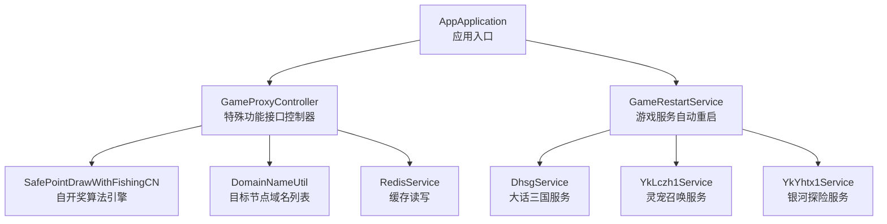
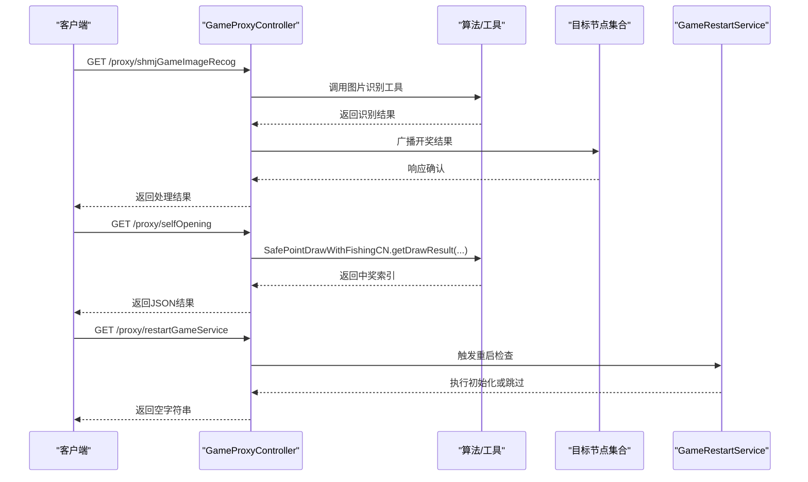
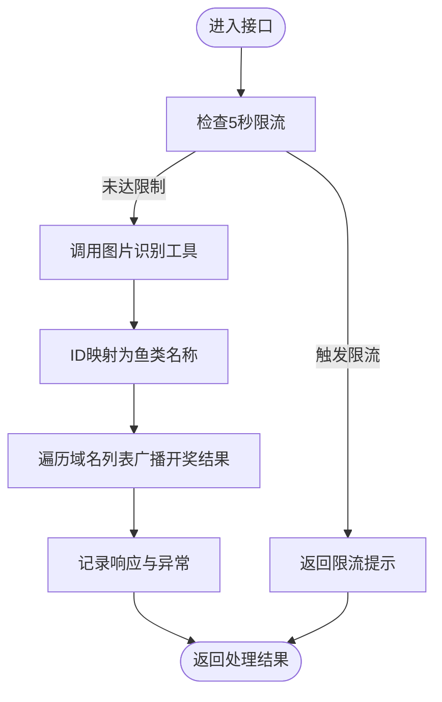
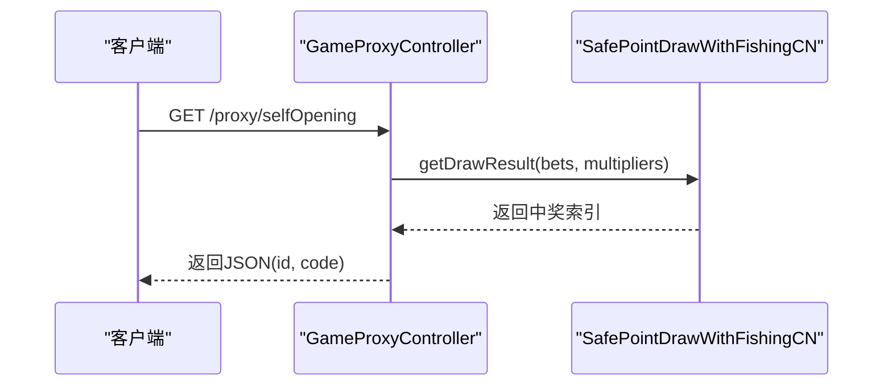
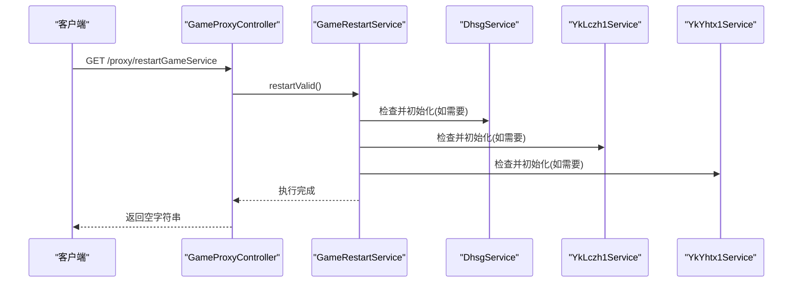
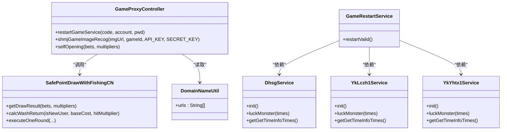

# 特殊功能接口

<cite>
**本文引用的文件**
- [AppApplication.java](file://game-proxy/src/main/java/com/game/AppApplication.java)
- [GameProxyController.java](file://game-proxy/src/main/java/com/game/controller/GameProxyController.java)
- [GameRestartService.java](file://game-proxy/src/main/java/com/game/GameRestartService.java)
- [SafePointDrawWithFishingCN.java](file://game-proxy/src/main/java/com/game/utils/SafePointDrawWithFishingCN.java)
- [SafeWeeklyDrawWithWashSim.java](file://game-proxy/src/main/java/com/game/utils/SafeWeeklyDrawWithWashSim.java)
- [DomainNameUtil.java](file://game-proxy/src/main/java/com/game/utils/DomainNameUtil.java)
- [DhsgService.java](file://game-proxy/src/main/java/com/game/douyu/dahsg/DhsgService.java)
- [YkLczh1Service.java](file://game-proxy/src/main/java/com/game/yk/lczh/YkLczh1Service.java)
- [YkYhtx1Service.java](file://game-proxy/src/main/java/com/game/yk/yhtx/YkYhtx1Service.java)
</cite>

## 目录
1. [简介](#简介)
2. [项目结构](#项目结构)
3. [核心组件](#核心组件)
4. [架构总览](#架构总览)
5. [详细组件分析](#详细组件分析)
6. [依赖关系分析](#依赖关系分析)
7. [性能与稳定性考量](#性能与稳定性考量)
8. [故障排查指南](#故障排查指南)
9. [结论](#结论)
10. [附录：接口调用示例与规范](#附录接口调用示例与规范)

## 简介
本文件聚焦于游戏代理系统中的三个特殊功能接口：/proxy/shmjGameImageRecog（深海秘境图片识别）、/proxy/selfOpening（自开奖测试）、/proxy/restartGameService（游戏服务重启）。文档从实现原理、数据流、错误处理、性能与安全等方面进行深入解析，并提供调用示例与最佳实践，帮助运营与开发人员正确使用这些接口。

## 项目结构
- 应用入口位于 game-proxy 模块，通过 Spring Boot 启动并开启调度能力。
- 控制器层集中于 GameProxyController，负责对外暴露特殊功能接口。
- 工具与业务服务分别位于 utils 与各游戏模块的服务类中，用于实现自开奖算法、定时重启、开奖结果同步等。

图表来源
- [AppApplication.java](file://game-proxy/src/main/java/com/game/AppApplication.java#L15-L31)
- [GameProxyController.java](file://game-proxy/src/main/java/com/game/controller/GameProxyController.java#L36-L436)
- [GameRestartService.java](file://game-proxy/src/main/java/com/game/GameRestartService.java#L11-L56)
- [DhsgService.java](file://game-proxy/src/main/java/com/game/douyu/dahsg/DhsgService.java#L25-L128)
- [YkLczh1Service.java](file://game-proxy/src/main/java/com/game/yk/lczh/YkLczh1Service.java#L22-L125)
- [YkYhtx1Service.java](file://game-proxy/src/main/java/com/game/yk/yhtx/YkYhtx1Service.java#L29-L133)

章节来源
- [AppApplication.java](file://game-proxy/src/main/java/com/game/AppApplication.java#L15-L31)
- [GameProxyController.java](file://game-proxy/src/main/java/com/game/controller/GameProxyController.java#L36-L436)

## 核心组件
- 自开奖算法引擎：基于安全权重与随机扰动的抽选算法，支持水洗返还与补偿机制，保证高倍率场景下的长期公平性。
- 图片识别与开奖结果同步：对深海秘境图片进行识别，将结果广播至多个目标节点。
- 游戏服务自动重启：按周期检查关键服务状态，必要时触发初始化流程，保障服务可用性。

章节来源
- [SafePointDrawWithFishingCN.java](file://game-proxy/src/main/java/com/game/utils/SafePointDrawWithFishingCN.java#L18-L316)
- [GameProxyController.java](file://game-proxy/src/main/java/com/game/controller/GameProxyController.java#L360-L412)
- [GameRestartService.java](file://game-proxy/src/main/java/com/game/GameRestartService.java#L11-L56)

## 架构总览
以下序列图展示三个特殊功能接口的典型调用链路与内部协作：

图表来源
- [GameProxyController.java](file://game-proxy/src/main/java/com/game/controller/GameProxyController.java#L360-L412)
- [SafePointDrawWithFishingCN.java](file://game-proxy/src/main/java/com/game/utils/SafePointDrawWithFishingCN.java#L30-L32)
- [GameRestartService.java](file://game-proxy/src/main/java/com/game/GameRestartService.java#L21-L54)
- [DomainNameUtil.java](file://game-proxy/src/main/java/com/game/utils/DomainNameUtil.java#L3-L15)

## 详细组件分析

### /proxy/shmjGameImageRecog 深海秘境图片识别接口
- 功能概述
  - 接收图片URL与百度AI鉴权参数，调用图片识别工具获取鱼类ID，再将结果广播到多个目标节点。
- 关键实现点
  - 限流机制：使用原子时间戳记录上次调用时间，5秒内仅允许一次请求。
  - 结果映射：将识别ID映射为鱼类名称。
  - 同步逻辑：遍历域名列表，向每个目标节点推送开奖结果。
- 错误处理
  - 识别失败或空结果时记录错误日志并返回。
  - 广播阶段捕获网络异常并记录告警，不影响主流程返回。
- 参数与返回
  - 入参：imgUrl（图片URL）、gameId（游戏标识）、API_KEY、SECRET_KEY（百度AI鉴权）。
  - 返回：固定字符串表示处理完成。
- 使用建议
  - 严格遵守5秒限流，避免重复请求导致拒绝。
  - 确保imgUrl可访问且图片清晰，提高识别准确率。
  - 监控广播响应，及时发现目标节点不可达问题。

图表来源
- [GameProxyController.java](file://game-proxy/src/main/java/com/game/controller/GameProxyController.java#L357-L412)
- [DomainNameUtil.java](file://game-proxy/src/main/java/com/game/utils/DomainNameUtil.java#L3-L15)

章节来源
- [GameProxyController.java](file://game-proxy/src/main/java/com/game/controller/GameProxyController.java#L357-L412)
- [DomainNameUtil.java](file://game-proxy/src/main/java/com/game/utils/DomainNameUtil.java#L3-L15)

### /proxy/selfOpening 自开奖测试接口
- 功能概述
  - 基于投注数组与倍率数组，调用安全抽选算法生成中奖索引，返回标准JSON结构。
- 关键实现点
  - 算法引擎：采用下注平滑、倍率压制、强随机扰动与每日高倍上限控制等策略，确保长期公平。
  - 输出结构：包含中奖索引与状态码字段。
- 参数与返回
  - 入参：bets（double[]）、multipliers（double[]）。
  - 返回：JSON字符串，包含id与code字段。
- 使用建议
  - 传入合理的投注与倍率数组，避免极端值导致权重失衡。
  - 在测试环境验证算法行为，避免影响真实开奖结果。

图表来源
- [GameProxyController.java](file://game-proxy/src/main/java/com/game/controller/GameProxyController.java#L416-L428)
- [SafePointDrawWithFishingCN.java](file://game-proxy/src/main/java/com/game/utils/SafePointDrawWithFishingCN.java#L30-L32)

章节来源
- [GameProxyController.java](file://game-proxy/src/main/java/com/game/controller/GameProxyController.java#L416-L428)
- [SafePointDrawWithFishingCN.java](file://game-proxy/src/main/java/com/game/utils/SafePointDrawWithFishingCN.java#L82-L146)

### /proxy/restartGameService 游戏服务重启接口
- 功能概述
  - 触发游戏服务自动重启检测任务，按条件初始化相关服务，保障服务可用性。
- 关键实现点
  - 重启策略：周期性检查服务最近一次获取信息的时间戳，若超过阈值则执行init()。
  - 涉及服务：大话三国、灵宠召唤、银河探险。
- 参数与返回
  - 入参：code（服务编码）、account（账户）、pwd（密码）。
  - 返回：空字符串。
- 安全与注意
  - 该接口由控制器直接调用服务层方法，实际部署中需结合网关或认证策略限制访问。
  - 重启动作可能影响业务连续性，建议在维护窗口执行。

图表来源
- [GameProxyController.java](file://game-proxy/src/main/java/com/game/controller/GameProxyController.java#L158-L166)
- [GameRestartService.java](file://game-proxy/src/main/java/com/game/GameRestartService.java#L21-L54)
- [DhsgService.java](file://game-proxy/src/main/java/com/game/douyu/dahsg/DhsgService.java#L40-L44)
- [YkLczh1Service.java](file://game-proxy/src/main/java/com/game/yk/lczh/YkLczh1Service.java#L36-L40)
- [YkYhtx1Service.java](file://game-proxy/src/main/java/com/game/yk/yhtx/YkYhtx1Service.java#L43-L47)

章节来源
- [GameProxyController.java](file://game-proxy/src/main/java/com/game/controller/GameProxyController.java#L158-L166)
- [GameRestartService.java](file://game-proxy/src/main/java/com/game/GameRestartService.java#L11-L56)

## 依赖关系分析
- 控制器依赖
  - GameProxyController 依赖 SafePointDrawWithFishingCN 实现自开奖，依赖 DomainNameUtil 提供目标节点列表，依赖 RedisService 进行缓存读写。
- 重启服务依赖
  - GameRestartService 依赖 DhsgService、YkLczh1Service、YkYhtx1Service 的初始化能力与时间戳判断。
- 算法对比
  - SafePointDrawWithFishingCN：面向长期运营的综合算法，包含水洗、补偿与捕鱼模块。
  - SafeWeeklyDrawWithWashSim：简化版水洗模拟算法，侧重概率压制与返还计算。

图表来源
- [GameProxyController.java](file://game-proxy/src/main/java/com/game/controller/GameProxyController.java#L36-L436)
- [SafePointDrawWithFishingCN.java](file://game-proxy/src/main/java/com/game/utils/SafePointDrawWithFishingCN.java#L18-L316)
- [DomainNameUtil.java](file://game-proxy/src/main/java/com/game/utils/DomainNameUtil.java#L3-L15)
- [GameRestartService.java](file://game-proxy/src/main/java/com/game/GameRestartService.java#L11-L56)
- [DhsgService.java](file://game-proxy/src/main/java/com/game/douyu/dahsg/DhsgService.java#L25-L128)
- [YkLczh1Service.java](file://game-proxy/src/main/java/com/game/yk/lczh/YkLczh1Service.java#L22-L125)
- [YkYhtx1Service.java](file://game-proxy/src/main/java/com/game/yk/yhtx/YkYhtx1Service.java#L29-L133)

章节来源
- [GameProxyController.java](file://game-proxy/src/main/java/com/game/controller/GameProxyController.java#L36-L436)
- [GameRestartService.java](file://game-proxy/src/main/java/com/game/GameRestartService.java#L11-L56)

## 性能与稳定性考量
- 限流与抖动
  - 图片识别接口采用5秒限流，避免频繁调用造成资源压力。
  - 自开奖算法引入强随机扰动，降低被预测风险。
- 广播与容错
  - 开奖结果同步遍历多个目标节点，单点异常不影响整体流程，但需监控异常日志。
- 重启策略
  - 周期性检查与延迟重试，避免瞬时失败导致无限重试。
- 缓存与时间
  - 控制器侧提供多处游戏时间缓存接口，便于快速获取与校准。

章节来源
- [GameProxyController.java](file://game-proxy/src/main/java/com/game/controller/GameProxyController.java#L357-L412)
- [SafePointDrawWithFishingCN.java](file://game-proxy/src/main/java/com/game/utils/SafePointDrawWithFishingCN.java#L121-L123)
- [DhsgService.java](file://game-proxy/src/main/java/com/game/douyu/dahsg/DhsgService.java#L112-L122)

## 故障排查指南
- 图片识别接口
  - 现象：返回限流提示或识别为空。
  - 排查：确认5秒内是否重复请求；检查imgUrl可访问性与清晰度；查看广播异常日志。
- 自开奖接口
  - 现象：返回结果不符合预期。
  - 排查：核对bets与multipliers输入；关注算法权重压制与随机扰动的影响。
- 重启接口
  - 现象：服务未按预期重启。
  - 排查：确认时间戳判断逻辑与阈值设置；检查对应服务init()是否抛出异常；核对访问权限。

章节来源
- [GameProxyController.java](file://game-proxy/src/main/java/com/game/controller/GameProxyController.java#L357-L412)
- [SafePointDrawWithFishingCN.java](file://game-proxy/src/main/java/com/game/utils/SafePointDrawWithFishingCN.java#L148-L150)
- [GameRestartService.java](file://game-proxy/src/main/java/com/game/GameRestartService.java#L21-L54)

## 结论
上述三个特殊功能接口分别覆盖了识别同步、自开奖测试与服务自动重启三大场景。通过严格的限流、稳健的广播与完善的重启策略，系统在保障运营效率的同时兼顾了长期公平与稳定性。建议在生产环境中配合访问控制与监控告警，确保接口安全与可观测性。

## 附录：接口调用示例与规范

- /proxy/shmjGameImageRecog
  - 方法与路径：GET /proxy/shmjGameImageRecog
  - 查询参数：
    - imgUrl：图片URL（必填）
    - gameId：游戏标识（必填）
    - API_KEY：百度AI鉴权（必填）
    - SECRET_KEY：百度AI鉴权（必填）
  - 返回：字符串，表示处理完成
  - 限流：5秒内仅允许一次请求
  - 示例（示意）：
    - curl "http://host:port/proxy/shmjGameImageRecog?imgUrl=...&gameId=...&API_KEY=...&SECRET_KEY=..."

- /proxy/selfOpening
  - 方法与路径：GET /proxy/selfOpening
  - 查询参数：
    - bets：double[] 投注数组（必填）
    - multipliers：double[] 倍率数组（必填）
  - 返回：JSON字符串，包含id与code字段
  - 示例（示意）：
    - curl "http://host:port/proxy/selfOpening?bets=[10,20]&multipliers=[5,10]"

- /proxy/restartGameService
  - 方法与路径：GET /proxy/restartGameService
  - 查询参数：
    - code：服务编码（必填）
    - account：账户（必填）
    - pwd：密码（必填）
  - 返回：空字符串
  - 安全：建议结合网关或认证策略限制访问
  - 示例（示意）：
    - curl "http://host:port/proxy/restartGameService?code=...&account=...&pwd=..."

- 运营注意事项
  - 图片识别：确保图片质量与URL可达，关注广播异常日志。
  - 自开奖：仅用于测试，避免与真实开奖结果混淆。
  - 重启：选择维护窗口执行，观察服务初始化日志。

章节来源
- [GameProxyController.java](file://game-proxy/src/main/java/com/game/controller/GameProxyController.java#L360-L428)
- [GameRestartService.java](file://game-proxy/src/main/java/com/game/GameRestartService.java#L21-L54)