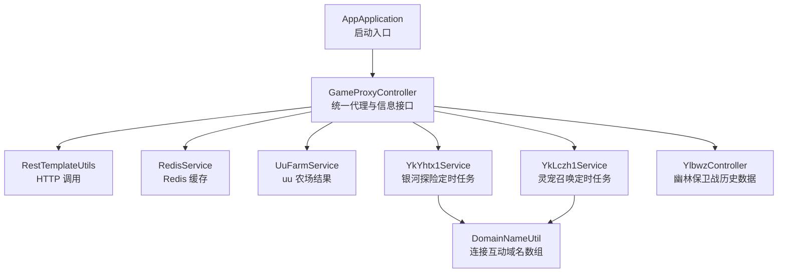
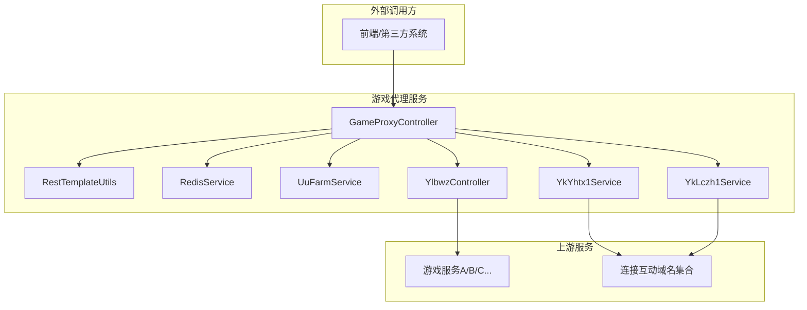
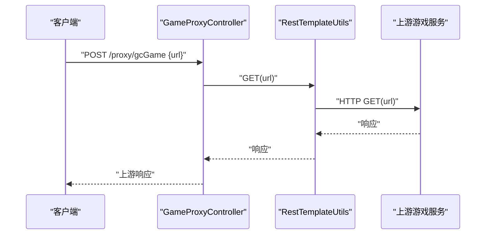
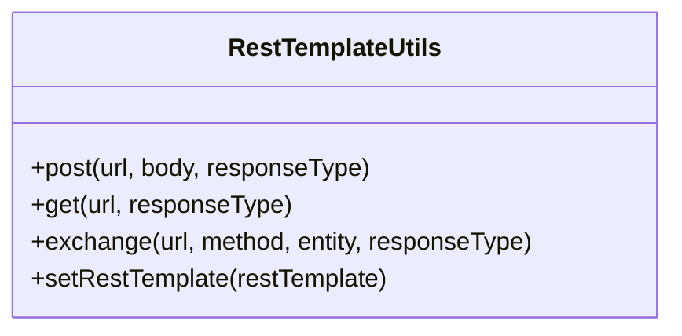
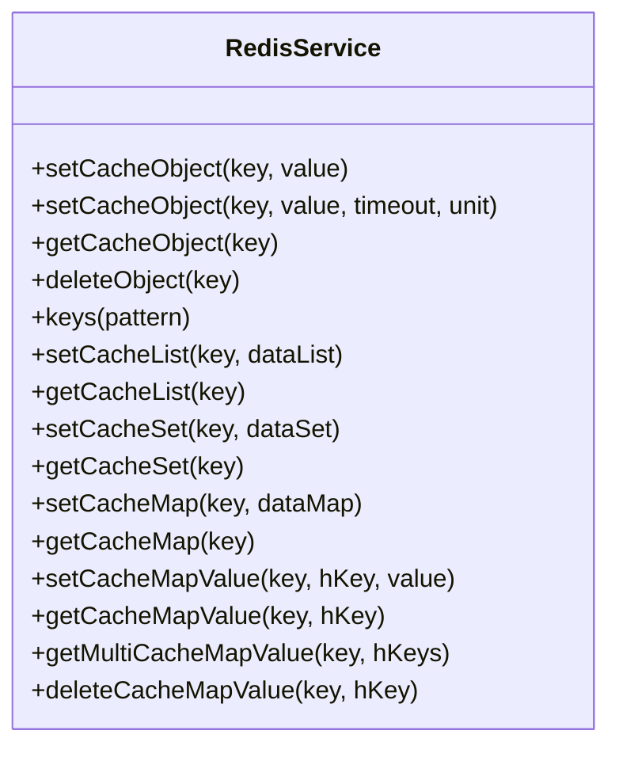
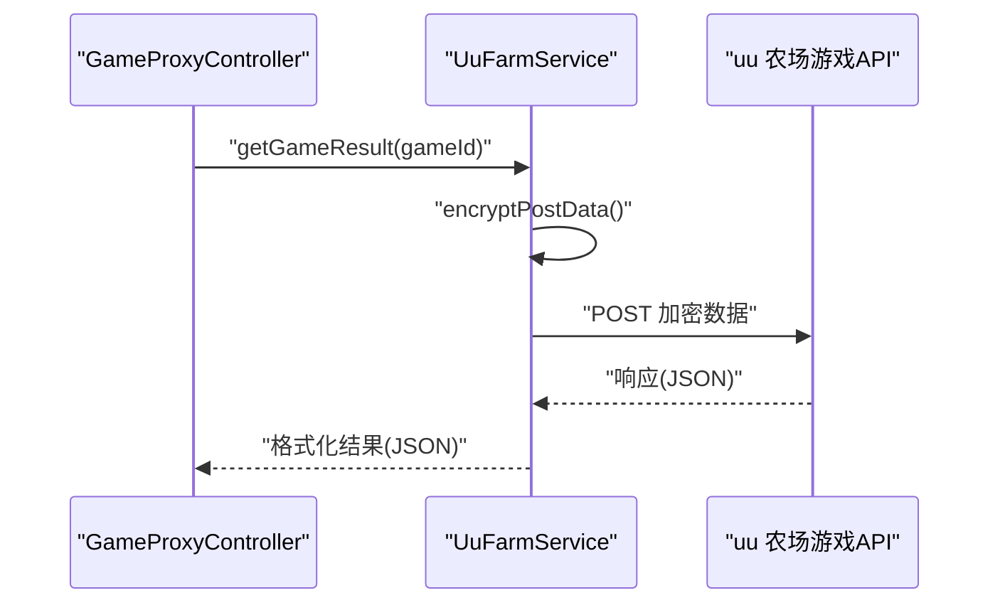
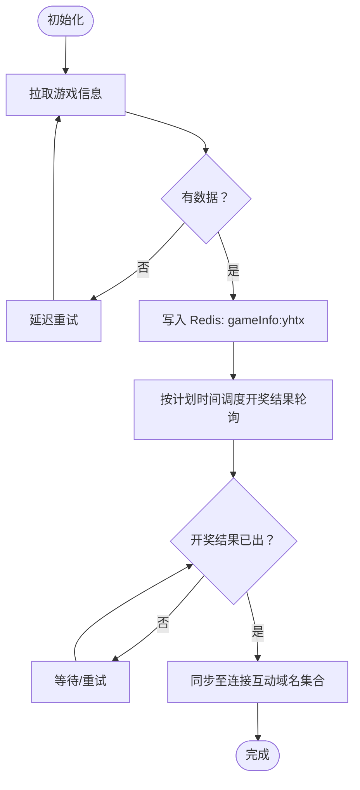
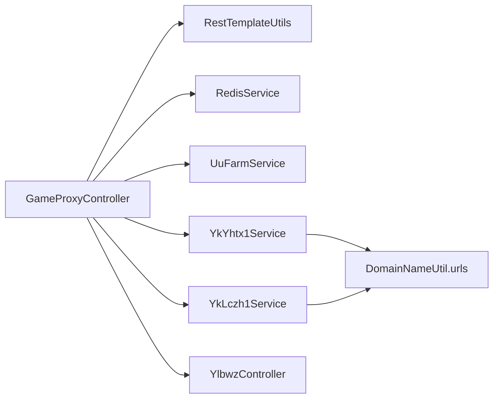

# 游戏代理服务

<cite>
**本文引用的文件**
- [AppApplication.java](file://game-proxy/src/main/java/com/game/AppApplication.java)
- [GameProxyController.java](file://game-proxy/src/main/java/com/game/controller/GameProxyController.java)
- [RestTemplateUtils.java](file://game-proxy/src/main/java/com/game/commom/RestTemplateUtils.java)
- [RedisService.java](file://game-proxy/src/main/java/com/game/redis/RedisService.java)
- [UuFarmService.java](file://game-proxy/src/main/java/com/game\uc/UuFarmService.java)
- [YkYhtx1Service.java](file://game-proxy/src/main/java/com/game/yk/yhtx/YkYhtx1Service.java)
- [YkLczh1Service.java](file://game-proxy/src/main/java/com/game/yk/lczh/YkLczh1Service.java)
- [YlbwzController.java](file://game-proxy/src/main/java/com/game/ylbwz/YlbwzController.java)
- [DomainNameUtil.java](file://game-proxy/src/main/java/com/game/utils/DomainNameUtil.java)
- [application.yml](file://game-proxy/src/main/resources/application.yml)
- [pom.xml](file://game-proxy/pom.xml)
</cite>

## 目录
1. [简介](#简介)
2. [项目结构](#项目结构)
3. [核心组件](#核心组件)
4. [架构总览](#架构总览)
5. [详细组件分析](#详细组件分析)
6. [依赖关系分析](#依赖关系分析)
7. [性能与可靠性](#性能与可靠性)
8. [故障排查指南](#故障排查指南)
9. [结论](#结论)
10. [附录：API 规范](#附录api-规范)

## 简介
本项目为“游戏代理服务”，通过统一的 HTTP 接口对外暴露多个游戏模块的数据与能力，包括：
- 统一代理转发：对上游游戏服务进行透明转发
- 游戏信息缓存：基于 Redis 的游戏期次与开奖时间缓存
- 结果同步：将开奖结果同步至连接互动平台
- 自开测试：内置安全随机算法，支持自开测试
- 图片识别：对特定场景图片进行识别并联动同步

服务通过 Spring Boot 启动，提供 RESTful 接口，便于前端或其它系统统一调用。

## 项目结构
- 启动入口：AppApplication
- 控制器层：GameProxyController（统一代理与信息查询）
- 通用工具：RestTemplateUtils（HTTP 调用）、RedisService（缓存）
- 业务服务：UuFarmService（uu 农场）、YkYhtx1Service（银河探险）、YkLczh1Service（灵宠召唤）
- 游戏模块：YlbwzController（幽林保卫战）
- 配置：application.yml（端口、上下文路径、Redis、HTTP 连接池、域名）

图表来源
- [AppApplication.java](file://game-proxy/src/main/java/com/game/AppApplication.java#L1-L33)
- [GameProxyController.java](file://game-proxy/src/main/java/com/game/controller/GameProxyController.java#L1-L436)
- [RestTemplateUtils.java](file://game-proxy/src/main/java/com/game/commom/RestTemplateUtils.java#L1-L51)
- [RedisService.java](file://game-proxy/src/main/java/com/game/redis/RedisService.java#L1-L244)
- [UuFarmService.java](file://game-proxy/src/main/java/com/game\uc/UuFarmService.java#L1-L135)
- [YkYhtx1Service.java](file://game-proxy/src/main/java/com/game/yk/yhtx/YkYhtx1Service.java#L1-L134)
- [YkLczh1Service.java](file://game-proxy/src/main/java/com/game/yk/lczh/YkLczh1Service.java#L1-L126)
- [YlbwzController.java](file://game-proxy/src/main/java/com/game/ylbwz/YlbwzController.java#L1-L74)
- [DomainNameUtil.java](file://game-proxy/src/main/java/com/game/utils/DomainNameUtil.java#L1-L16)

章节来源
- [AppApplication.java](file://game-proxy/src/main/java/com/game/AppApplication.java#L1-L33)
- [application.yml](file://game-proxy/src/main/resources/application.yml#L1-L58)

## 核心组件
- 统一代理控制器：负责对外暴露 /proxy 前缀下的接口，包括代理转发、信息查询、时间维护、图片识别与自开测试等。
- HTTP 工具：封装 RestTemplate，提供 GET/POST/exchange 方法，简化外部请求。
- 缓存服务：基于 RedisTemplate 的通用缓存操作，支持字符串、列表、集合、哈希等。
- 业务服务：
  - UuFarmService：uu 农场加密请求与结果解析
  - YkYhtx1Service：银河探险定时拉取期次与开奖结果，并同步至连接互动
  - YkLczh1Service：灵宠召唤定时拉取期次与开奖结果，并同步至连接互动
- 游戏模块控制器：YlbwzController 提供幽林保卫战历史数据查询与开奖时间查询

章节来源
- [GameProxyController.java](file://game-proxy/src/main/java/com/game/controller/GameProxyController.java#L1-L436)
- [RestTemplateUtils.java](file://game-proxy/src/main/java/com/game/commom/RestTemplateUtils.java#L1-L51)
- [RedisService.java](file://game-proxy/src/main/java/com/game/redis/RedisService.java#L1-L244)
- [UuFarmService.java](file://game-proxy/src/main/java/com/game\uc/UuFarmService.java#L1-L135)
- [YkYhtx1Service.java](file://game-proxy/src/main/java/com/game/yk/yhtx/YkYhtx1Service.java#L1-L134)
- [YkLczh1Service.java](file://game-proxy/src/main/java/com/game/yk/lczh/YkLczh1Service.java#L1-L126)
- [YlbwzController.java](file://game-proxy/src/main/java/com/game/ylbwz/YlbwzController.java#L1-L74)

## 架构总览
代理服务采用“控制器 + 工具 + 缓存 + 业务服务”的分层设计：
- 控制器层：集中暴露 /proxy 下的统一接口
- 业务层：各游戏模块的服务负责定时任务、数据拉取与结果同步
- 基础设施：Redis 作为共享缓存，RestTemplate 作为 HTTP 通道

图表来源
- [GameProxyController.java](file://game-proxy/src/main/java/com/game/controller/GameProxyController.java#L1-L436)
- [RestTemplateUtils.java](file://game-proxy/src/main/java/com/game/commom/RestTemplateUtils.java#L1-L51)
- [RedisService.java](file://game-proxy/src/main/java/com/game/redis/RedisService.java#L1-L244)
- [UuFarmService.java](file://game-proxy/src/main/java/com/game\uc/UuFarmService.java#L1-L135)
- [YkYhtx1Service.java](file://game-proxy/src/main/java/com/game/yk/yhtx/YkYhtx1Service.java#L1-L134)
- [YkLczh1Service.java](file://game-proxy/src/main/java/com/game/yk/lczh/YkLczh1Service.java#L1-L126)
- [YlbwzController.java](file://game-proxy/src/main/java/com/game/ylbwz/YlbwzController.java#L1-L74)
- [DomainNameUtil.java](file://game-proxy/src/main/java/com/game/utils/DomainNameUtil.java#L1-L16)

## 详细组件分析

### 统一代理控制器（GameProxyController）
- 职责
  - 代理转发：对上游游戏服务进行 GET/POST 转发
  - 信息查询：从 Redis 读取各游戏期次与开奖时间
  - 时间维护：设置/获取/删除游戏时间缓存
  - 结果同步：将开奖结果同步至连接互动
  - 图片识别：对深海秘境图片进行识别并联动同步
  - 自开测试：基于安全随机算法生成自开结果
- 关键接口
  - POST /proxy/gcGame：透传上游 URL，返回上游响应
  - POST /proxy/ylbwzGame：透传上游 URL，携带鉴权头（Uuid/Mid/Pid/Clienttime/Dfid），返回上游响应
  - GET /proxy/yhtxGameInfo：读取 Redis 中“gameInfo:yhtx”
  - GET /proxy/lczhGameInfo：读取 Redis 中“gameInfo:lczh”
  - GET /proxy/dhsgGameInfo、/proxy/bjxxhmGameInfo、/proxy/bjxsgGameInfo、/proxy/bjxgwbsGameInfo：读取对应游戏信息缓存
  - GET /proxy/restartGameService：触发游戏服务重启
  - GET /proxy/ljhdshmjGameInfo、/proxy/ljhdyztxGameInfo：读取连接互动相关游戏信息缓存
  - GET /proxy/addUCTime、/proxy/getUCTime：上报/读取 uu 农场开奖时间
  - GET /proxy/addYqlyyTime、/proxy/getYqlyyTime：上报/读取一千零一夜开奖时间
  - POST /proxy/addDwydh、/proxy/getdwydhTime：上报/读取宠物马拉松时间
  - GET /proxy/setGameTime、/proxy/getGameTime、/proxy/delGameTime：设置/获取/删除指定游戏 ID 的开奖时间
  - GET /proxy/shmjGameImageRecog：图片识别并同步至连接互动
  - GET /proxy/selfOpening：自开测试，返回安全随机结果

图表来源
- [GameProxyController.java](file://game-proxy/src/main/java/com/game/controller/GameProxyController.java#L51-L58)
- [RestTemplateUtils.java](file://game-proxy/src/main/java/com/game/commom/RestTemplateUtils.java#L38-L44)

章节来源
- [GameProxyController.java](file://game-proxy/src/main/java/com/game/controller/GameProxyController.java#L1-L436)

### HTTP 工具（RestTemplateUtils）
- 能力
  - 提供静态方法：GET、POST、exchange
  - 注入 RestTemplate 实例，避免在业务中直接装配
- 使用场景
  - 代理转发、结果同步、uu 农场请求

图表来源
- [RestTemplateUtils.java](file://game-proxy/src/main/java/com/game/commom/RestTemplateUtils.java#L1-L51)

章节来源
- [RestTemplateUtils.java](file://game-proxy/src/main/java/com/game/commom/RestTemplateUtils.java#L1-L51)

### 缓存服务（RedisService）
- 能力
  - 支持字符串、列表、集合、哈希等缓存操作
  - 提供过期时间设置、存在性判断、批量删除等
- 使用场景
  - 游戏期次与开奖时间缓存
  - 上报时间缓存
  - 连接互动相关数据缓存

图表来源
- [RedisService.java](file://game-proxy/src/main/java/com/game/redis/RedisService.java#L1-L244)

章节来源
- [RedisService.java](file://game-proxy/src/main/java/com/game/redis/RedisService.java#L1-L244)

### 业务服务：uu 农场（UuFarmService）
- 能力
  - AES-CBC 加密 + Base64 编码
  - 调用指定游戏 API，解析返回并格式化输出
- 使用场景
  - GET /proxy/uuFarmGameInfo：返回 uu 农场最近一期开奖结果与时间

图表来源
- [UuFarmService.java](file://game-proxy/src/main/java/com/game\uc/UuFarmService.java#L64-L98)
- [GameProxyController.java](file://game-proxy/src/main/java/com/game/controller/GameProxyController.java#L222-L225)

章节来源
- [UuFarmService.java](file://game-proxy/src/main/java/com/game\uc/UuFarmService.java#L1-L135)
- [GameProxyController.java](file://game-proxy/src/main/java/com/game/controller/GameProxyController.java#L222-L225)

### 业务服务：银河探险（YkYhtx1Service）
- 能力
  - 定时拉取游戏期次与开奖时间，写入 Redis
  - 当检测到新期次时，定时轮询开奖结果，同步至连接互动
- 使用场景
  - GET /proxy/yhtxGameInfo：读取 Redis 中“gameInfo:yhtx”

图表来源
- [YkYhtx1Service.java](file://game-proxy/src/main/java/com/game/yk/yhtx/YkYhtx1Service.java#L49-L77)
- [YkYhtx1Service.java](file://game-proxy/src/main/java/com/game/yk/yhtx/YkYhtx1Service.java#L78-L126)
- [DomainNameUtil.java](file://game-proxy/src/main/java/com/game/utils/DomainNameUtil.java#L1-L16)

章节来源
- [YkYhtx1Service.java](file://game-proxy/src/main/java/com/game/yk/yhtx/YkYhtx1Service.java#L1-L134)

### 业务服务：灵宠召唤（YkLczh1Service）
- 能力
  - 定时拉取游戏期次与开奖时间，写入 Redis
  - 当检测到新期次时，定时轮询开奖结果，同步至连接互动
- 使用场景
  - GET /proxy/lczhGameInfo：读取 Redis 中“gameInfo:lczh”

图表来源
- [YkLczh1Service.java](file://game-proxy/src/main/java/com/game/yk/lczh/YkLczh1Service.java#L42-L70)
- [YkLczh1Service.java](file://game-proxy/src/main/java/com/game/yk/lczh/YkLczh1Service.java#L73-L120)
- [DomainNameUtil.java](file://game-proxy/src/main/java/com/game/utils/DomainNameUtil.java#L1-L16)

章节来源
- [YkLczh1Service.java](file://game-proxy/src/main/java/com/game/yk/lczh/YkLczh1Service.java#L1-L126)

### 游戏模块：幽林保卫战（YlbwzController）
- 能力
  - 通过 SESSION 访问历史数据接口
  - 登录失效时自动登录并重试
  - 提供最后一条历史与全部历史列表查询
  - 提供开奖时间查询（来自 Redis）
- 使用场景
  - GET /proxy/ylbwzGameInfo：读取 Redis 中“gameInfo:ylbwz”（由上游模块维护）

章节来源
- [YlbwzController.java](file://game-proxy/src/main/java/com/game/ylbwz/YlbwzController.java#L1-L74)

## 依赖关系分析
- 组件耦合
  - 控制器依赖工具与缓存，以及各业务服务
  - 业务服务依赖 Redis 与定时框架（TimerFactory）
  - 结果同步依赖连接互动域名集合
- 外部依赖
  - Redis（数据缓存）
  - HTTP 客户端（RestTemplate/OkHttp/HttpUtil）
  - 连接互动域名集合

图表来源
- [GameProxyController.java](file://game-proxy/src/main/java/com/game/controller/GameProxyController.java#L1-L436)
- [YkYhtx1Service.java](file://game-proxy/src/main/java/com/game/yk/yhtx/YkYhtx1Service.java#L1-L134)
- [YkLczh1Service.java](file://game-proxy/src/main/java/com/game/yk/lczh/YkLczh1Service.java#L1-L126)
- [DomainNameUtil.java](file://game-proxy/src/main/java/com/game/utils/DomainNameUtil.java#L1-L16)

章节来源
- [pom.xml](file://game-proxy/pom.xml#L1-L163)

## 性能与可靠性
- 连接池与超时
  - HTTP 连接池参数已在配置中设置，建议结合实际并发调整最大连接数与超时时间
- 缓存命中
  - 游戏期次与开奖时间通过 Redis 缓存，减少重复请求
- 限流与幂等
  - 图片识别接口具备 5 秒内单次调用限制，避免频繁触发
- 异常处理
  - 结果同步采用 try-catch 包裹，记录异常但不中断主流程
- 建议
  - 对高频接口增加本地缓存与降级策略
  - 对上游接口增加熔断与重试机制
  - 对图片识别与自开测试增加速率限制与日志审计

[本节为通用建议，无需列出具体文件来源]

## 故障排查指南
- 代理转发失败
  - 检查上游 URL 是否正确，确认网络连通性
  - 查看控制器日志与异常栈
- Redis 读写异常
  - 检查 Redis 地址、密码与连接池配置
  - 确认键名是否一致（如 gameInfo:yhtx、gameInfo:lczh）
- 结果未同步至连接互动
  - 检查 DomainNameUtil.urls 是否包含目标域名
  - 查看同步接口返回与异常日志
- 图片识别限流
  - 确认 5 秒内仅一次请求
  - 检查图片地址有效性
- 自开测试异常
  - 检查输入参数格式与范围
  - 查看安全随机引擎日志

章节来源
- [GameProxyController.java](file://game-proxy/src/main/java/com/game/controller/GameProxyController.java#L360-L412)
- [YkYhtx1Service.java](file://game-proxy/src/main/java/com/game/yk/yhtx/YkYhtx1Service.java#L99-L108)
- [YkLczh1Service.java](file://game-proxy/src/main/java/com/game/yk/lczh/YkLczh1Service.java#L93-L102)

## 结论
本代理服务通过统一接口整合多游戏模块，实现了：
- 透明代理转发
- 游戏期次与开奖时间的集中缓存
- 结果同步与图片识别联动
- 自开测试与时间维护能力

建议在生产环境中进一步完善限流、熔断与监控体系，确保高并发下的稳定性与可运维性。

[本节为总结，无需列出具体文件来源]

## 附录：API 规范

- 统一前缀
  - /proxy

- 代理转发
  - POST /proxy/gcGame
    - 参数：url（字符串，上游完整 URL）
    - 返回：上游响应内容（字符串）
    - 示例：curl -X POST http://host:port/gameProxy/proxy/gcGame -d "url=http://upstream/game/info"
  - POST /proxy/ylbwzGame
    - 参数：url（字符串，上游完整 URL）、Uuid（字符串）、Mid（字符串）、Pid（字符串）
    - 返回：上游响应内容（字符串）
    - 示例：curl -X POST http://host:port/gameProxy/proxy/ylbwzGame?Uuid=...&Mid=...&Pid=... -d "url=http://upstream/game/info"

- 游戏信息查询（Redis）
  - GET /proxy/yhtxGameInfo
    - 返回：Redis 中“gameInfo:yhtx”的缓存内容（字符串）
  - GET /proxy/lczhGameInfo
    - 返回：Redis 中“gameInfo:lczh”的缓存内容（字符串）
  - GET /proxy/dhsgGameInfo、/proxy/bjxxhmGameInfo、/proxy/bjxsgGameInfo、/proxy/bjxgwbsGameInfo
    - 返回：对应游戏信息缓存（字符串）

- 游戏时间维护
  - GET /proxy/addUCTime?time=N
    - 说明：当 N 在合理范围内时，计算并写入 Redis“gameInfo:ucGameTime”
  - GET /proxy/getUCTime
    - 返回：Redis 中“gameInfo:ucGameTime”
  - GET /proxy/addYqlyyTime?time=T
    - 说明：支持秒数或“HH:mm:ss/H:mm”格式，写入 Redis“gameInfo:yqlyyTime”
  - GET /proxy/getYqlyyTime
    - 返回：Redis 中“gameInfo:yqlyyTime”
  - POST /proxy/addDwydh
    - 请求体：JSON 字符串，包含 gameId 等字段
    - 返回：OK
  - GET /proxy/getdwydhTime
    - 返回：Redis 中“gameInfo:dwydhGameTime”
  - GET /proxy/setGameTime?time=T&gameId=ID
    - 说明：time 支持秒或毫秒，写入 Redis“gameInfo:GameTime:{gameId}”
  - GET /proxy/getGameTime?gameId=ID
    - 返回：Redis 中对应键的缓存
  - GET /proxy/delGameTime?gameId=ID
    - 说明：删除对应键

- 连接互动相关
  - GET /proxy/ljhdshmjGameInfo、/proxy/ljhdyztxGameInfo
    - 返回：对应缓存内容（字符串）

- 结果同步与自开测试
  - GET /proxy/shmjGameImageRecog?imgUrl=...&gameId=...&API_KEY=...&SECRET_KEY=...
    - 说明：图片识别后同步至连接互动域名集合
  - GET /proxy/selfOpening?bets=...&multipliers=...
    - 说明：自开测试，返回安全随机结果（JSON）

- 其他
  - GET /proxy/restartGameService?code=...&account=...&pwd=...
    - 说明：触发游戏服务重启

章节来源
- [GameProxyController.java](file://game-proxy/src/main/java/com/game/controller/GameProxyController.java#L51-L436)
- [application.yml](file://game-proxy/src/main/resources/application.yml#L1-L58)