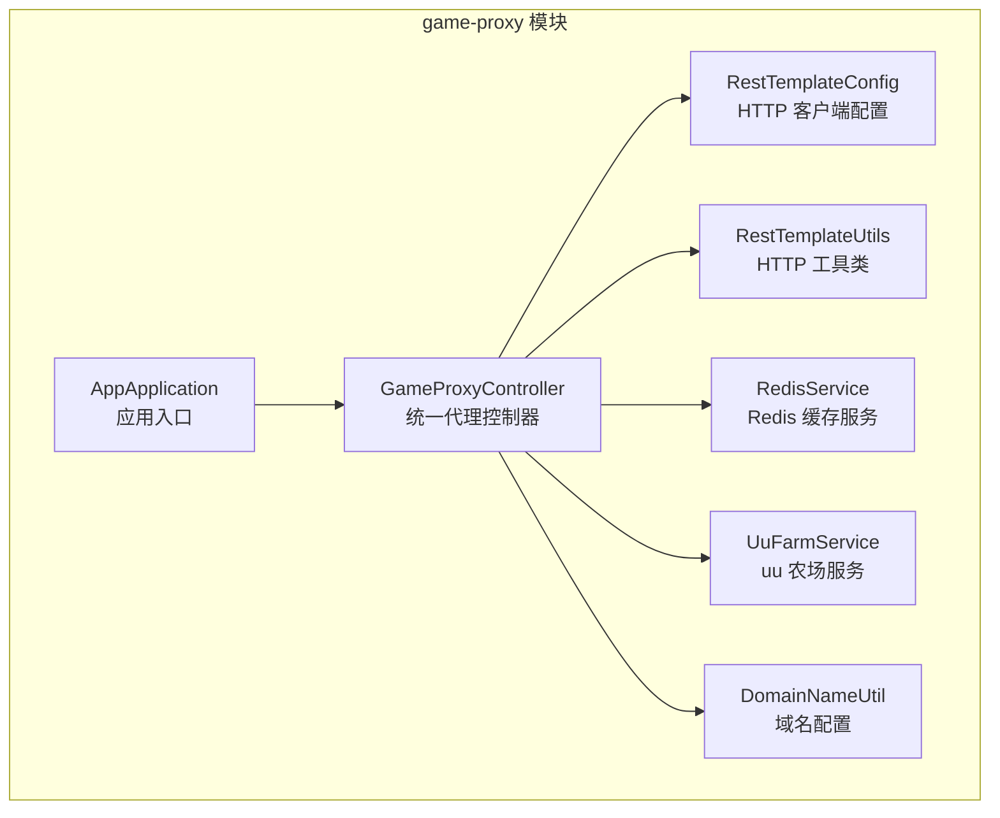
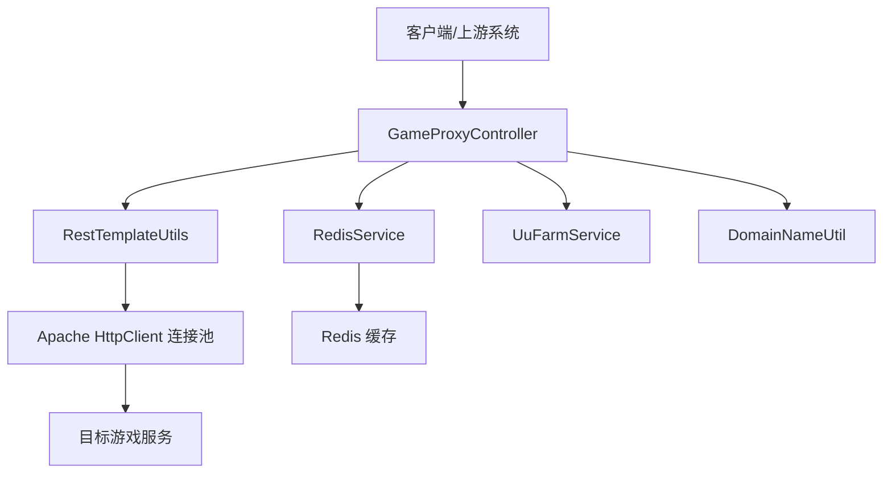
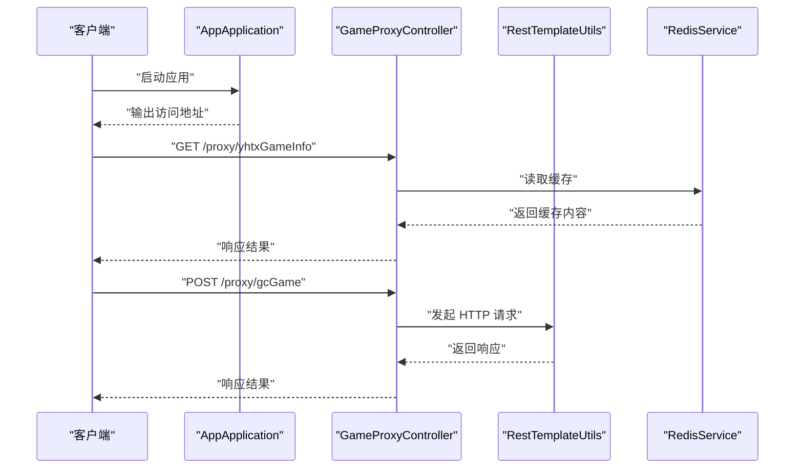
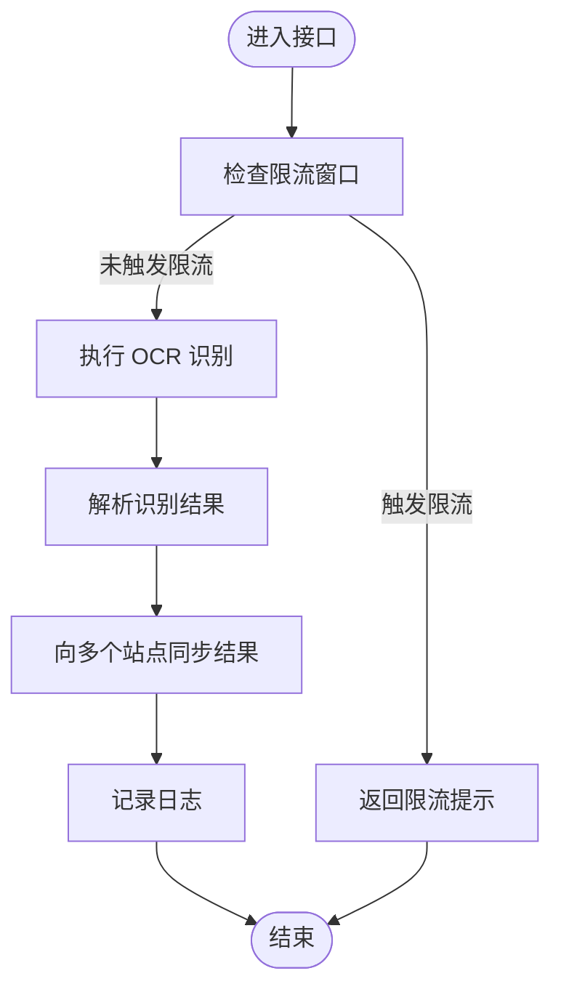
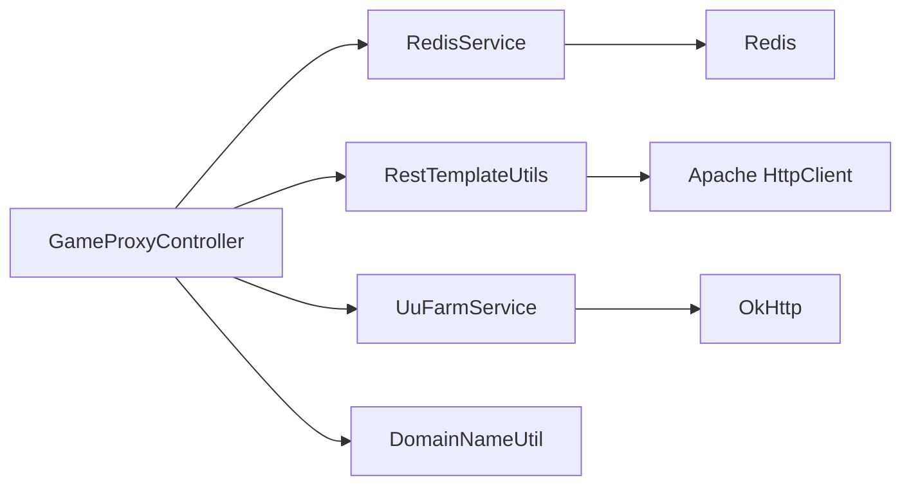

# 统一代理接口设计

<cite>
**本文引用的文件**
- [GameProxyController.java](file://game-proxy/src/main/java/com/game/controller/GameProxyController.java)
- [AppApplication.java](file://game-proxy/src/main/java/com/game/AppApplication.java)
- [RestTemplateConfig.java](file://game-proxy/src/main/java/com/game/commom/RestTemplateConfig.java)
- [RestTemplateUtils.java](file://game-proxy/src/main/java/com/game/commom/RestTemplateUtils.java)
- [RedisService.java](file://game-proxy/src/main/java/com/game/redis/RedisService.java)
- [UuFarmService.java](file://game-proxy/src/main/java/com/game\uc/UuFarmService.java)
- [DomainNameUtil.java](file://game-proxy/src/main/java/com/game/utils/DomainNameUtil.java)
- [application.yml](file://game-proxy/src/main/resources/application.yml)
- [pom.xml](file://game-proxy/pom.xml)
</cite>

## 目录
1. [引言](#引言)
2. [项目结构](#项目结构)
3. [核心组件](#核心组件)
4. [架构总览](#架构总览)
5. [详细组件分析](#详细组件分析)
6. [依赖关系分析](#依赖关系分析)
7. [性能考量](#性能考量)
8. [故障排查指南](#故障排查指南)
9. [结论](#结论)
10. [附录](#附录)

## 引言
本技术文档围绕统一代理接口设计展开，重点阐述 GameProxyController 的整体设计理念与架构原则，系统性说明 RESTful API 设计规范与命名约定，明确控制器职责分工（HTTP 方法映射、URL 路径设计、参数传递机制），解释代理模式在游戏服务中的应用及如何通过统一接口协调多个游戏模块。同时覆盖控制器初始化流程、依赖注入机制与异常处理策略，并提供接口设计最佳实践与性能优化建议。

## 项目结构
game-proxy 为统一代理服务的核心模块，采用 Spring Boot 架构，主要目录与职责如下：
- controller：对外暴露 REST 接口，集中路由与转发各游戏模块请求
- commom：通用配置与工具，如 RestTemplate 配置与静态工具类
- redis：基于 Redis 的缓存服务封装
- uc：特定游戏模块（如 uu 农场）的业务服务
- utils：通用工具类（域名、时间、加密等）
- resources：应用配置与日志配置

图表来源
- [AppApplication.java](file://game-proxy/src/main/java/com/game/AppApplication.java#L1-L33)
- [GameProxyController.java](file://game-proxy/src/main/java/com/game/controller/GameProxyController.java#L1-L436)
- [RestTemplateConfig.java](file://game-proxy/src/main/java/com/game/commom/RestTemplateConfig.java#L1-L132)
- [RestTemplateUtils.java](file://game-proxy/src/main/java/com/game/commom/RestTemplateUtils.java#L1-L51)
- [RedisService.java](file://game-proxy/src/main/java/com/game/redis/RedisService.java#L1-L244)
- [UuFarmService.java](file://game-proxy/src/main/java/com/game\uc/UuFarmService.java#L1-L135)
- [DomainNameUtil.java](file://game-proxy/src/main/java/com/game/utils/DomainNameUtil.java#L1-L16)

章节来源
- [AppApplication.java](file://game-proxy/src/main/java/com/game/AppApplication.java#L1-L33)
- [application.yml](file://game-proxy/src/main/resources/application.yml#L1-L58)

## 核心组件
- GameProxyController：统一代理控制器，负责将外部请求转发至目标游戏服务或读取缓存，同时提供游戏时间与开奖结果同步等辅助能力
- RestTemplateConfig/RestTemplateUtils：统一 HTTP 客户端配置与调用工具，支持连接池、超时、重试与头部设置
- RedisService：Redis 缓存操作封装，提供键值存取、过期控制、批量操作等
- UuFarmService：uu 农场游戏结果获取服务，包含加密与网络请求逻辑
- DomainNameUtil：连接互动域名列表配置，用于多活或多站点场景

章节来源
- [GameProxyController.java](file://game-proxy/src/main/java/com/game/controller/GameProxyController.java#L1-L436)
- [RestTemplateConfig.java](file://game-proxy/src/main/java/com/game/commom/RestTemplateConfig.java#L1-L132)
- [RestTemplateUtils.java](file://game-proxy/src/main/java/com/game/commom/RestTemplateUtils.java#L1-L51)
- [RedisService.java](file://game-proxy/src/main/java/com/game/redis/RedisService.java#L1-L244)
- [UuFarmService.java](file://game-proxy/src/main/java/com/game\uc/UuFarmService.java#L1-L135)
- [DomainNameUtil.java](file://game-proxy/src/main/java/com/game/utils/DomainNameUtil.java#L1-L16)

## 架构总览
统一代理接口通过 GameProxyController 将不同游戏模块的请求进行抽象与统一路由，结合 Redis 缓存与 HTTP 客户端配置，实现高可用、可扩展的游戏服务代理层。

图表来源
- [GameProxyController.java](file://game-proxy/src/main/java/com/game/controller/GameProxyController.java#L1-L436)
- [RestTemplateUtils.java](file://game-proxy/src/main/java/com/game/commom/RestTemplateUtils.java#L1-L51)
- [RestTemplateConfig.java](file://game-proxy/src/main/java/com/game/commom/RestTemplateConfig.java#L1-L132)
- [RedisService.java](file://game-proxy/src/main/java/com/game/redis/RedisService.java#L1-L244)
- [UuFarmService.java](file://game-proxy/src/main/java/com/game\uc/UuFarmService.java#L1-L135)
- [DomainNameUtil.java](file://game-proxy/src/main/java/com/game/utils/DomainNameUtil.java#L1-L16)

## 详细组件分析

### 控制器职责与 RESTful 设计
- 路由前缀与命名：统一前缀为 /proxy，便于与其他模块隔离
- GET/POST 映射：根据语义选择合适方法，如获取信息使用 GET，提交数据使用 POST
- 参数传递：支持路径变量、查询参数与请求体，遵循“单一职责”与“幂等性”原则
- 响应格式：统一返回字符串或 JSON 字符串，便于上层系统解析

章节来源
- [GameProxyController.java](file://game-proxy/src/main/java/com/game/controller/GameProxyController.java#L38-L436)

### 代理模式在游戏服务中的应用
- 单一入口：所有游戏相关请求经由 GameProxyController 转发或读取缓存
- 多游戏模块协调：通过 Redis 缓存统一存储各游戏的开放时间与开奖结果，避免重复请求
- 多活与容灾：结合 DomainNameUtil 的域名列表，实现多站点或多活场景下的请求分发

章节来源
- [GameProxyController.java](file://game-proxy/src/main/java/com/game/controller/GameProxyController.java#L360-L412)
- [DomainNameUtil.java](file://game-proxy/src/main/java/com/game/utils/DomainNameUtil.java#L1-L16)

### 初始化流程与依赖注入
- 应用启动：AppApplication 启动 Spring Boot 应用，输出访问地址与 Swagger 地址
- Bean 注入：GameProxyController 通过 @Resource 注入 RedisService、UuFarmService 等服务
- HTTP 客户端：RestTemplateConfig 定义连接池与超时策略，RestTemplateUtils 作为静态工具持有 RestTemplate 实例

图表来源
- [AppApplication.java](file://game-proxy/src/main/java/com/game/AppApplication.java#L24-L31)
- [GameProxyController.java](file://game-proxy/src/main/java/com/game/controller/GameProxyController.java#L51-L81)
- [RestTemplateUtils.java](file://game-proxy/src/main/java/com/game/commom/RestTemplateUtils.java#L26-L44)
- [RedisService.java](file://game-proxy/src/main/java/com/game/redis/RedisService.java#L95-L98)

章节来源
- [AppApplication.java](file://game-proxy/src/main/java/com/game/AppApplication.java#L1-L33)
- [GameProxyController.java](file://game-proxy/src/main/java/com/game/controller/GameProxyController.java#L41-L83)
- [RestTemplateConfig.java](file://game-proxy/src/main/java/com/game/commom/RestTemplateConfig.java#L62-L108)
- [RestTemplateUtils.java](file://game-proxy/src/main/java/com/game/commom/RestTemplateUtils.java#L13-L51)

### 异常处理策略
- HTTP 异常：使用 RestTemplate 发起请求时捕获 RestClientException，记录警告日志并继续处理其他域名
- 业务异常：对 Redis 操作异常进行 try-catch 包裹，保证主流程不中断
- 限流保护：对图片识别接口增加时间窗口内的调用限制，避免频繁触发

图表来源
- [GameProxyController.java](file://game-proxy/src/main/java/com/game/controller/GameProxyController.java#L360-L412)

章节来源
- [GameProxyController.java](file://game-proxy/src/main/java/com/game/controller/GameProxyController.java#L360-L412)

### 接口设计最佳实践与性能优化
- 使用连接池与超时配置：通过 RestTemplateConfig 统一配置连接池大小、并发数、超时时间，提升稳定性与吞吐
- 缓存优先策略：对高频读取的“游戏信息”接口使用 Redis 缓存，减少下游压力
- 参数校验与限流：对敏感接口增加时间窗口限制，防止滥用
- 统一响应格式：返回字符串或 JSON 字符串，便于上层系统统一处理

章节来源
- [RestTemplateConfig.java](file://game-proxy/src/main/java/com/game/commom/RestTemplateConfig.java#L44-L108)
- [RedisService.java](file://game-proxy/src/main/java/com/game/redis/RedisService.java#L30-L44)
- [GameProxyController.java](file://game-proxy/src/main/java/com/game/controller/GameProxyController.java#L357-L412)

## 依赖关系分析
- 组件耦合：GameProxyController 依赖 RedisService、RestTemplateUtils、UuFarmService、DomainNameUtil 等服务
- 外部依赖：Spring Web、Apache HttpClient、Spring Data Redis、OkHttp 等
- 配置依赖：application.yml 中的 server、spring.redis、http 等配置项

图表来源
- [GameProxyController.java](file://game-proxy/src/main/java/com/game/controller/GameProxyController.java#L1-L436)
- [RestTemplateUtils.java](file://game-proxy/src/main/java/com/game/commom/RestTemplateUtils.java#L1-L51)
- [RedisService.java](file://game-proxy/src/main/java/com/game/redis/RedisService.java#L1-L244)
- [UuFarmService.java](file://game-proxy/src/main/java/com/game\uc/UuFarmService.java#L1-L135)
- [application.yml](file://game-proxy/src/main/resources/application.yml#L1-L58)

章节来源
- [pom.xml](file://game-proxy/pom.xml#L26-L101)
- [application.yml](file://game-proxy/src/main/resources/application.yml#L1-L58)

## 性能考量
- 连接池与并发：合理设置 http.maxTotal 与 http.defaultMaxPerRoute，避免连接争用
- 超时策略：根据下游服务特性调整 connectTimeout、connectionRequestTimeout、socketTimeout
- 缓存命中率：对高频读取接口启用 Redis 缓存，缩短链路延迟
- 批量与异步：对多站点同步场景，可考虑异步化处理，降低主流程阻塞

## 故障排查指南
- 接口无响应：检查 server.port 与 server.servlet.context-path 配置，确认应用已启动
- HTTP 请求失败：查看 RestTemplate 配置与超时设置，关注 RestClientException 日志
- 缓存异常：确认 Redis 连接参数与密码，检查 RedisService 的 set/get/delete 操作
- 图片识别限流：确认 5 秒内仅允许一次调用，避免重复触发

章节来源
- [AppApplication.java](file://game-proxy/src/main/java/com/game/AppApplication.java#L24-L31)
- [application.yml](file://game-proxy/src/main/resources/application.yml#L1-L58)
- [GameProxyController.java](file://game-proxy/src/main/java/com/game/controller/GameProxyController.java#L360-L412)

## 结论
统一代理接口设计通过 GameProxyController 将多游戏模块的请求进行抽象与统一路由，结合 Redis 缓存与 Apache HttpClient 连接池，实现了高可用、低耦合、易扩展的游戏服务代理层。遵循 RESTful 设计规范与命名约定，配合限流与异常处理策略，能够有效支撑复杂业务场景下的稳定运行。

## 附录
- 访问地址：应用启动后输出 Local 与 External 地址，Swagger 地址可在日志中查看
- 配置项参考：server.port、server.servlet.context-path、spring.redis.*、http.* 等

章节来源
- [AppApplication.java](file://game-proxy/src/main/java/com/game/AppApplication.java#L24-L31)
- [application.yml](file://game-proxy/src/main/resources/application.yml#L1-L58)