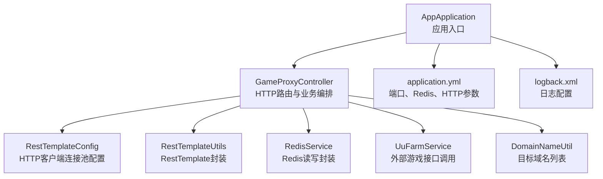
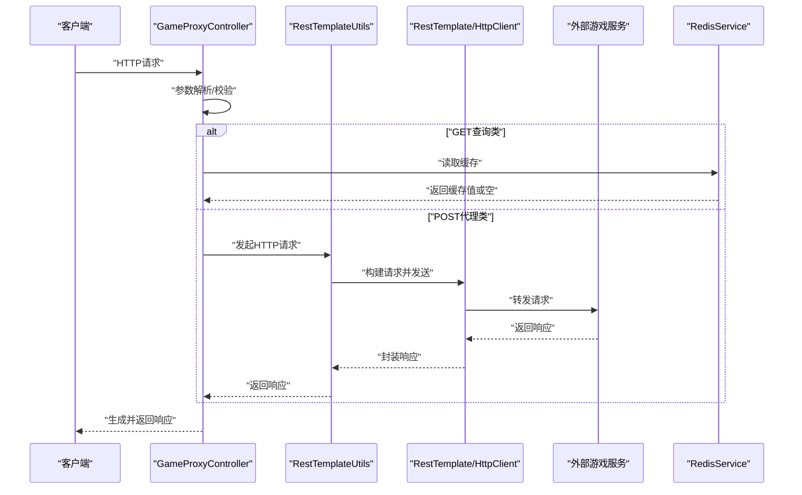
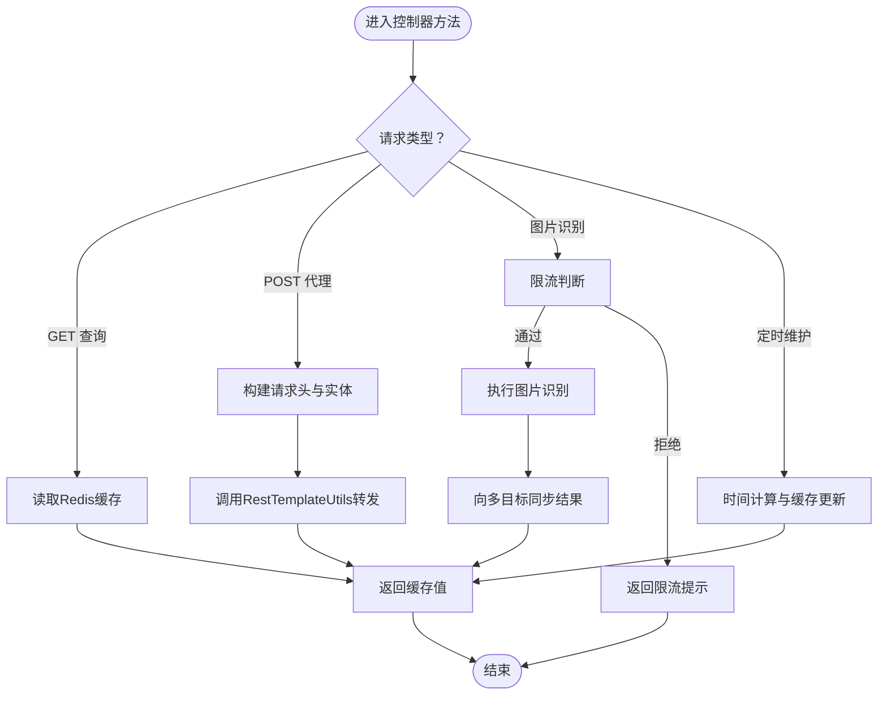
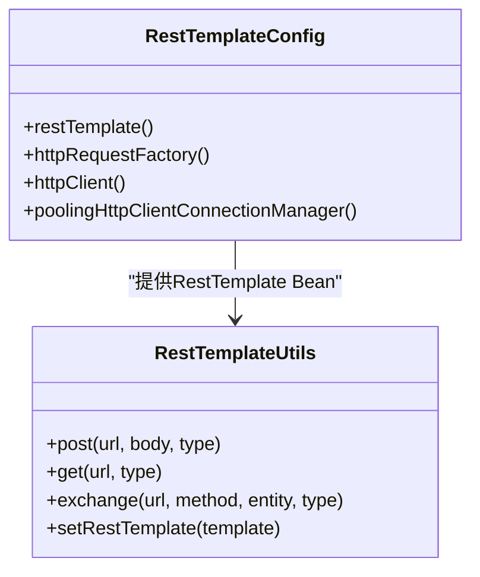
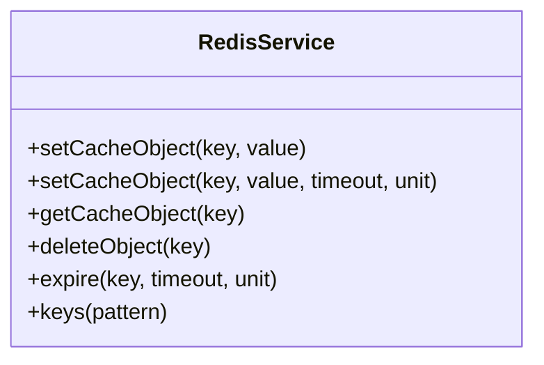
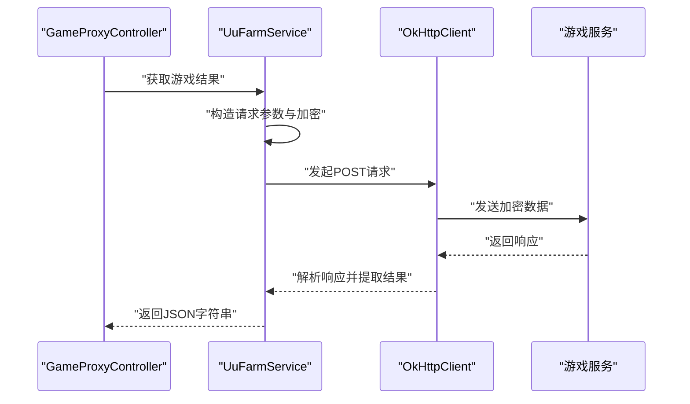
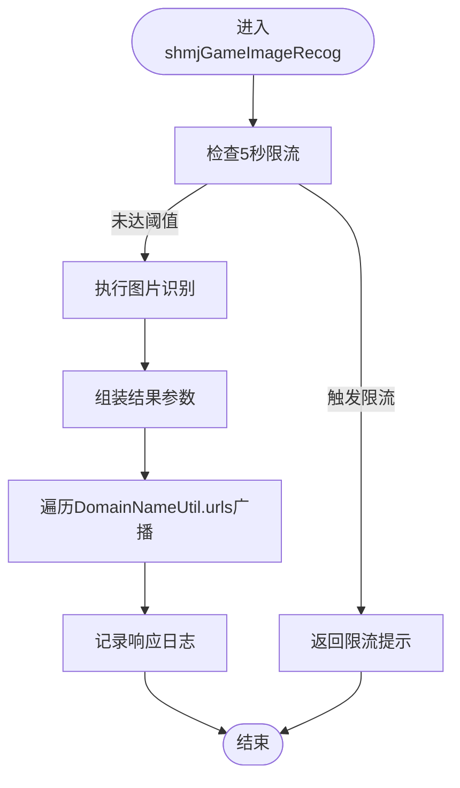
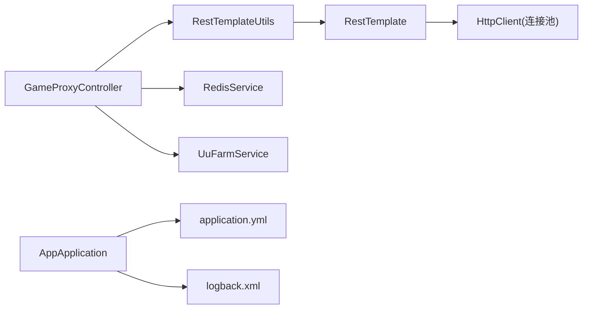

# 请求处理流程

<cite>
**本文引用的文件**
- [AppApplication.java](file://game-proxy/src/main/java/com/game/AppApplication.java)
- [GameProxyController.java](file://game-proxy/src/main/java/com/game/controller/GameProxyController.java)
- [RestTemplateConfig.java](file://game-proxy/src/main/java/com/game/commom/RestTemplateConfig.java)
- [RestTemplateUtils.java](file://game-proxy/src/main/java/com/game/commom/RestTemplateUtils.java)
- [RedisService.java](file://game-proxy/src/main/java/com/game/redis/RedisService.java)
- [DomainNameUtil.java](file://game-proxy/src/main/java/com/game/utils/DomainNameUtil.java)
- [application.yml](file://game-proxy/src/main/resources/application.yml)
- [logback.xml](file://game-proxy/src/main/resources/logback.xml)
- [UuFarmService.java](file://game-proxy/src/main/java/com/game/uc/UuFarmService.java)
- [pom.xml](file://game-proxy/pom.xml)
</cite>

## 目录
1. [简介](#简介)
2. [项目结构](#项目结构)
3. [核心组件](#核心组件)
4. [架构总览](#架构总览)
5. [详细组件分析](#详细组件分析)
6. [依赖关系分析](#依赖关系分析)
7. [性能考量](#性能考量)
8. [故障排查指南](#故障排查指南)
9. [结论](#结论)
10. [附录](#附录)

## 简介
本文件面向“请求处理流程”的技术文档，围绕从请求接入到响应返回的完整链路进行深入剖析。重点覆盖以下方面：
- 请求解析与参数校验
- 业务逻辑执行与外部调用
- 响应生成与返回
- 不同接口类型的处理差异（如POST代理请求与GET查询请求）
- 请求拦截、日志记录与性能监控机制
- 异常处理流程、错误响应格式与降级策略
- 提供时序图与流程图，帮助开发者快速理解处理过程

## 项目结构
该模块采用Spring Boot标准目录组织，核心入口位于应用启动类，控制器负责HTTP路由分发，工具类封装网络与缓存访问，配置文件集中管理HTTP连接池与Redis连接参数。

图表来源
- [AppApplication.java](file://game-proxy/src/main/java/com/game/AppApplication.java#L15-L31)
- [GameProxyController.java](file://game-proxy/src/main/java/com/game/controller/GameProxyController.java#L36-L39)
- [RestTemplateConfig.java](file://game-proxy/src/main/java/com/game/commom/RestTemplateConfig.java#L34-L131)
- [RestTemplateUtils.java](file://game-proxy/src/main/java/com/game/commom/RestTemplateUtils.java#L13-L49)
- [RedisService.java](file://game-proxy/src/main/java/com/game/redis/RedisService.java#L18-L243)
- [UuFarmService.java](file://game-proxy/src/main/java/com/game/uc/UuFarmService.java#L64-L131)
- [DomainNameUtil.java](file://game-proxy/src/main/java/com/game/utils/DomainNameUtil.java#L3-L15)
- [application.yml](file://game-proxy/src/main/resources/application.yml#L1-L58)
- [logback.xml](file://game-proxy/src/main/resources/logback.xml#L1-L75)

章节来源
- [AppApplication.java](file://game-proxy/src/main/java/com/game/AppApplication.java#L15-L31)
- [application.yml](file://game-proxy/src/main/resources/application.yml#L1-L58)

## 核心组件
- 应用入口与启动：负责应用启动、端口与上下文路径输出，并启用调度能力。
- 控制器层：统一处理HTTP请求，按接口类型进行差异化处理（GET查询、POST代理转发、图片识别、定时任务触发等）。
- HTTP客户端：通过Apache HttpClient连接池封装，支持超时、重试、连接复用与Keep-Alive。
- 缓存层：基于Redis的通用读写封装，支持过期时间、批量操作与多种数据结构。
- 外部服务集成：针对特定游戏平台的接口调用封装，统一参数构造与响应解析。
- 配置与日志：集中化管理HTTP连接池参数、Redis连接参数以及日志滚动策略。

章节来源
- [AppApplication.java](file://game-proxy/src/main/java/com/game/AppApplication.java#L15-L31)
- [GameProxyController.java](file://game-proxy/src/main/java/com/game/controller/GameProxyController.java#L36-L39)
- [RestTemplateConfig.java](file://game-proxy/src/main/java/com/game/commom/RestTemplateConfig.java#L34-L131)
- [RestTemplateUtils.java](file://game-proxy/src/main/java/com/game/commom/RestTemplateUtils.java#L13-L49)
- [RedisService.java](file://game-proxy/src/main/java/com/game/redis/RedisService.java#L18-L243)
- [UuFarmService.java](file://game-proxy/src/main/java/com/game/uc/UuFarmService.java#L64-L131)
- [application.yml](file://game-proxy/src/main/resources/application.yml#L1-L58)
- [logback.xml](file://game-proxy/src/main/resources/logback.xml#L1-L75)

## 架构总览
下图展示典型请求从接入到响应的关键节点与交互顺序：

图表来源
- [GameProxyController.java](file://game-proxy/src/main/java/com/game/controller/GameProxyController.java#L51-L81)
- [RestTemplateUtils.java](file://game-proxy/src/main/java/com/game/commom/RestTemplateUtils.java#L26-L44)
- [RestTemplateConfig.java](file://game-proxy/src/main/java/com/game/commom/RestTemplateConfig.java#L62-L108)
- [RedisService.java](file://game-proxy/src/main/java/com/game/redis/RedisService.java#L95-L98)

## 详细组件分析

### 控制器层：请求接入与差异化处理
- GET查询类接口：直接从Redis读取缓存，适合高频读取场景，降低外部依赖压力。
- POST代理类接口：构造HTTP请求头与实体，使用RestTemplate进行转发，适用于需要透传头部或参数的场景。
- 图片识别与同步：对输入参数进行限流与校验，识别后向多个目标地址同步结果。
- 定时任务与状态维护：提供设置/获取/删除游戏时间等接口，结合Redis实现短期状态存储。

图表来源
- [GameProxyController.java](file://game-proxy/src/main/java/com/game/controller/GameProxyController.java#L51-L81)
- [GameProxyController.java](file://game-proxy/src/main/java/com/game/controller/GameProxyController.java#L361-L412)
- [GameProxyController.java](file://game-proxy/src/main/java/com/game/controller/GameProxyController.java#L184-L208)
- [GameProxyController.java](file://game-proxy/src/main/java/com/game/controller/GameProxyController.java#L326-L354)

章节来源
- [GameProxyController.java](file://game-proxy/src/main/java/com/game/controller/GameProxyController.java#L51-L81)
- [GameProxyController.java](file://game-proxy/src/main/java/com/game/controller/GameProxyController.java#L90-L153)
- [GameProxyController.java](file://game-proxy/src/main/java/com/game/controller/GameProxyController.java#L361-L412)
- [GameProxyController.java](file://game-proxy/src/main/java/com/game/controller/GameProxyController.java#L184-L208)
- [GameProxyController.java](file://game-proxy/src/main/java/com/game/controller/GameProxyController.java#L326-L354)

### HTTP客户端与连接池：性能与稳定性保障
- 连接池参数：最大连接数、每路由并发、连接超时、请求超时、Socket超时、空闲校验与失效时间。
- 默认请求头：User-Agent、编码、语言、连接策略与内容类型。
- 重试策略：启用默认重试处理器，提升弱网环境下的成功率。
- 与控制器配合：控制器通过RestTemplateUtils发起请求，避免重复造轮子。

图表来源
- [RestTemplateConfig.java](file://game-proxy/src/main/java/com/game/commom/RestTemplateConfig.java#L62-L131)
- [RestTemplateUtils.java](file://game-proxy/src/main/java/com/game/commom/RestTemplateUtils.java#L13-L49)

章节来源
- [RestTemplateConfig.java](file://game-proxy/src/main/java/com/game/commom/RestTemplateConfig.java#L34-L131)
- [RestTemplateUtils.java](file://game-proxy/src/main/java/com/game/commom/RestTemplateUtils.java#L13-L49)
- [application.yml](file://game-proxy/src/main/resources/application.yml#L43-L57)

### 缓存层：Redis读写与过期控制
- 支持基本类型、列表、集合、哈希等多种数据结构。
- 提供过期时间设置、键存在性判断、批量删除等常用操作。
- 控制器侧广泛用于游戏信息缓存、时间窗口缓存与短期状态存储。

图表来源
- [RedisService.java](file://game-proxy/src/main/java/com/game/redis/RedisService.java#L18-L243)

章节来源
- [RedisService.java](file://game-proxy/src/main/java/com/game/redis/RedisService.java#L18-L243)
- [application.yml](file://game-proxy/src/main/resources/application.yml#L15-L30)

### 外部服务集成：UU农场示例
- 统一封装请求参数、加密与头部设置。
- 执行HTTP调用并解析响应，提取关键字段。
- 控制器通过注入服务直接获取格式化结果。

图表来源
- [UuFarmService.java](file://game-proxy/src/main/java/com/game/uc/UuFarmService.java#L64-L131)
- [GameProxyController.java](file://game-proxy/src/main/java/com/game/controller/GameProxyController.java#L222-L225)

章节来源
- [UuFarmService.java](file://game-proxy/src/main/java/com/game/uc/UuFarmService.java#L64-L131)
- [GameProxyController.java](file://game-proxy/src/main/java/com/game/controller/GameProxyController.java#L222-L225)

### 图片识别与同步：限流与多目标广播
- 输入参数校验与限流：同一接口在5秒内仅允许一次调用，避免重复提交。
- 识别完成后，将结果广播至多个目标地址，确保一致性。
- 异常处理：对RestTemplate调用进行异常捕获与日志记录。

图表来源
- [GameProxyController.java](file://game-proxy/src/main/java/com/game/controller/GameProxyController.java#L361-L412)
- [DomainNameUtil.java](file://game-proxy/src/main/java/com/game/utils/DomainNameUtil.java#L3-L15)

章节来源
- [GameProxyController.java](file://game-proxy/src/main/java/com/game/controller/GameProxyController.java#L361-L412)
- [DomainNameUtil.java](file://game-proxy/src/main/java/com/game/utils/DomainNameUtil.java#L3-L15)

## 依赖关系分析
- 控制器依赖RedisService、RestTemplateUtils、UuFarmService等组件。
- RestTemplateUtils依赖RestTemplate Bean，后者由RestTemplateConfig提供。
- 应用启动类负责加载配置与输出访问信息。
- 日志配置统一管理INFO/ERROR日志落盘与滚动策略。

图表来源
- [GameProxyController.java](file://game-proxy/src/main/java/com/game/controller/GameProxyController.java#L36-L39)
- [RestTemplateUtils.java](file://game-proxy/src/main/java/com/game/commom/RestTemplateUtils.java#L13-L49)
- [RestTemplateConfig.java](file://game-proxy/src/main/java/com/game/commom/RestTemplateConfig.java#L62-L108)
- [RedisService.java](file://game-proxy/src/main/java/com/game/redis/RedisService.java#L18-L243)
- [AppApplication.java](file://game-proxy/src/main/java/com/game/AppApplication.java#L15-L31)
- [application.yml](file://game-proxy/src/main/resources/application.yml#L1-L58)
- [logback.xml](file://game-proxy/src/main/resources/logback.xml#L1-L75)

章节来源
- [pom.xml](file://game-proxy/pom.xml#L26-L101)

## 性能考量
- 连接池参数：通过application.yml集中配置，建议根据并发量与外部服务性能调整最大连接数与超时参数。
- Keep-Alive与重试：连接池默认启用Keep-Alive与重试，有助于减少握手开销与弱网失败。
- 缓存命中：GET查询类接口优先读取Redis，显著降低外部依赖压力与延迟。
- 限流策略：图片识别接口内置5秒限流，防止重复提交导致的抖动与风暴。
- 日志落盘：INFO/ERROR分离落盘，避免日志过大影响I/O性能。

章节来源
- [application.yml](file://game-proxy/src/main/resources/application.yml#L43-L57)
- [RestTemplateConfig.java](file://game-proxy/src/main/java/com/game/commom/RestTemplateConfig.java#L84-L108)
- [GameProxyController.java](file://game-proxy/src/main/java/com/game/controller/GameProxyController.java#L361-L412)
- [logback.xml](file://game-proxy/src/main/resources/logback.xml#L15-L75)

## 故障排查指南
- 请求无响应或超时
  - 检查HTTP连接池参数与外部服务可用性。
  - 关注日志中ERROR级别记录，定位异常堆栈。
- Redis读写失败
  - 校验Redis连接参数与密码，确认键空间与过期策略。
- 图片识别接口被限流
  - 确认5秒内仅允许一次调用，避免频繁重复提交。
- 外部服务异常
  - 控制器对RestTemplate调用进行了异常捕获与日志记录，可据此定位问题。

章节来源
- [logback.xml](file://game-proxy/src/main/resources/logback.xml#L38-L73)
- [GameProxyController.java](file://game-proxy/src/main/java/com/game/controller/GameProxyController.java#L361-L412)
- [RedisService.java](file://game-proxy/src/main/java/com/game/redis/RedisService.java#L95-L98)

## 结论
本模块通过清晰的分层设计与集中化配置，实现了高可用、高性能的请求处理链路。控制器层承担编排职责，HTTP客户端与缓存层提供稳定支撑，日志体系保障可观测性。针对不同接口类型采用差异化策略（GET缓存、POST代理、图片识别限流），既满足功能需求又兼顾性能与稳定性。

## 附录
- 访问地址与端口：应用启动后会在日志中输出本地与外网访问地址及Swagger地址，便于调试与联调。
- 配置项参考：HTTP连接池、Redis连接与日志落盘策略均在application.yml与logback.xml中集中管理。

章节来源
- [AppApplication.java](file://game-proxy/src/main/java/com/game/AppApplication.java#L24-L31)
- [application.yml](file://game-proxy/src/main/resources/application.yml#L1-L58)
- [logback.xml](file://game-proxy/src/main/resources/logback.xml#L1-L75)