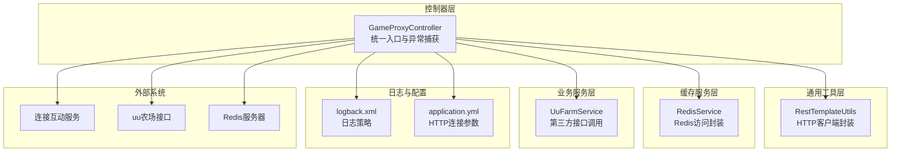
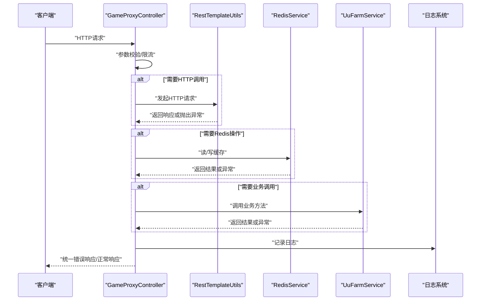
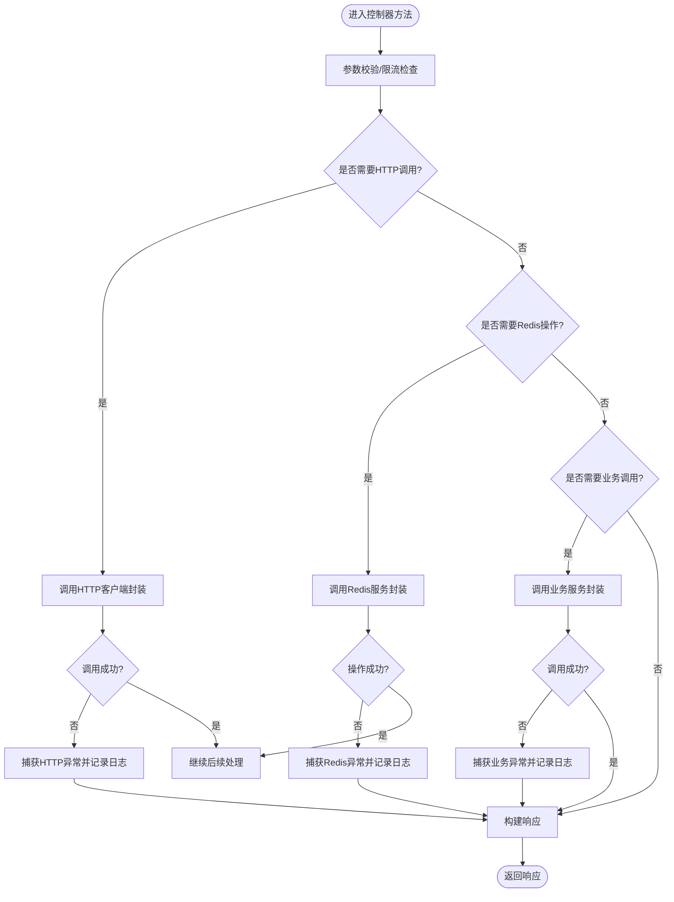
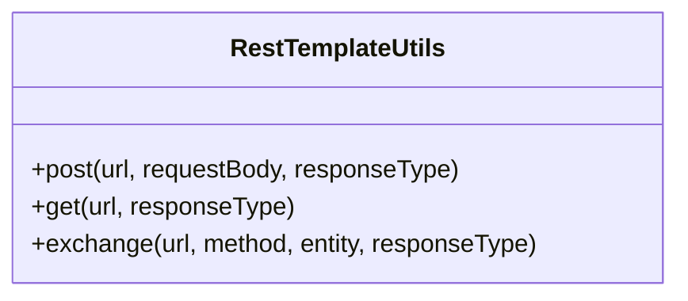
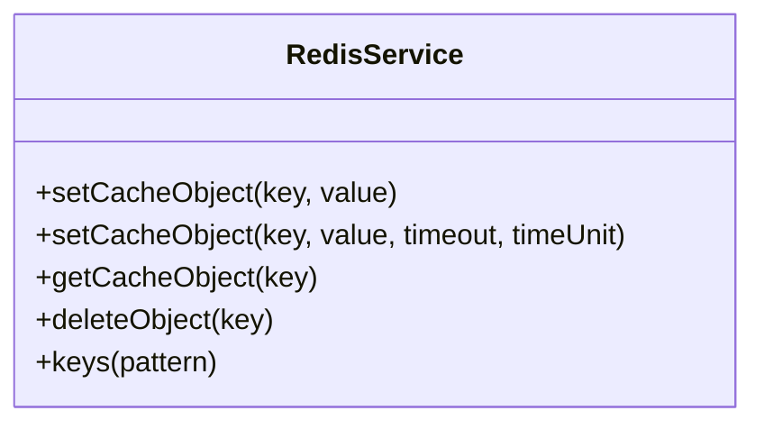
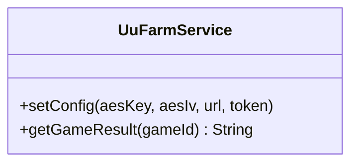
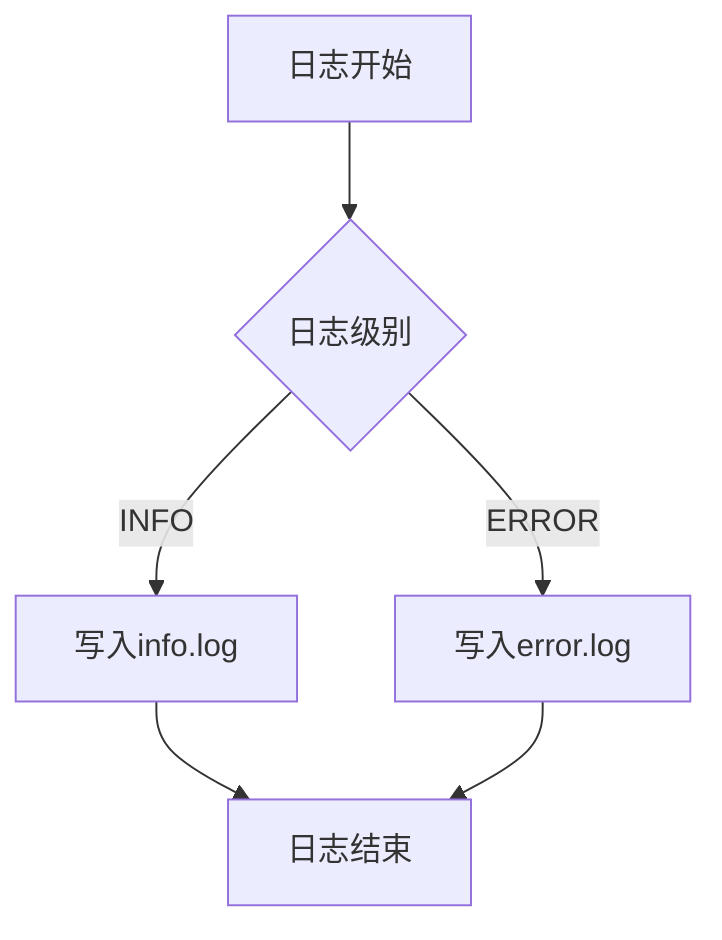
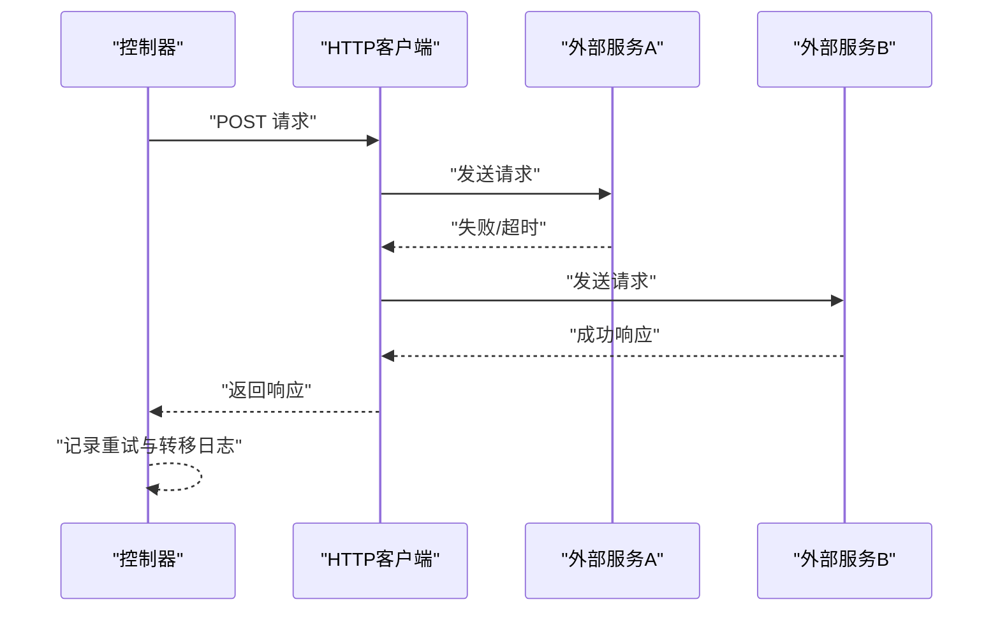
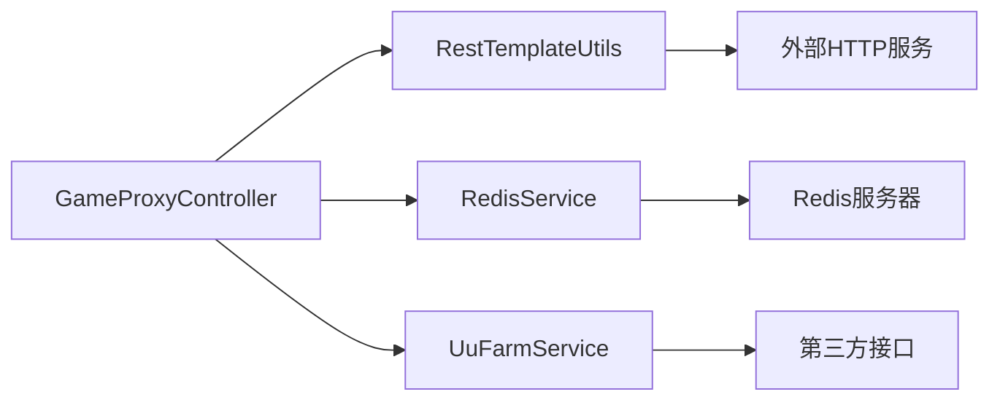

# 错误处理机制

<cite>
**本文引用的文件**
- [GameProxyController.java](file://game-proxy/src/main/java/com/game/controller/GameProxyController.java)
- [RestTemplateUtils.java](file://game-proxy/src/main/java/com/game/commom/RestTemplateUtils.java)
- [RedisService.java](file://game-proxy/src/main/java/com/game/redis/RedisService.java)
- [UuFarmService.java](file://game-proxy/src/main/java/com/game\uc/UuFarmService.java)
- [logback.xml](file://game-proxy/src/main/resources/logback.xml)
- [application.yml](file://game-proxy/src/main/resources/application.yml)
- [DomainNameUtil.java](file://game-proxy/src/main/java/com/game/utils/DomainNameUtil.java)
- [SafePointDrawWithFishingCN.java](file://game-proxy/src/main/java/com/game/utils/SafePointDrawWithFishingCN.java)
</cite>

## 目录
1. [引言](#引言)
2. [项目结构](#项目结构)
3. [核心组件](#核心组件)
4. [架构总览](#架构总览)
5. [详细组件分析](#详细组件分析)
6. [依赖关系分析](#依赖关系分析)
7. [性能考量](#性能考量)
8. [故障排查指南](#故障排查指南)
9. [结论](#结论)
10. [附录](#附录)

## 引言
本文件聚焦于控制器层的错误处理机制与错误响应策略，覆盖HTTP异常、业务异常与系统异常的分类处理，结合日志记录策略、错误码设计与用户友好提示，给出异常恢复、重试与故障转移建议，并总结最佳实践与调试技巧，帮助开发者快速定位与解决问题。

## 项目结构
围绕错误处理相关的关键模块如下：
- 控制器层：统一入口，负责参数校验、调用下游服务、异常捕获与响应构造
- 通用工具层：封装HTTP客户端调用，暴露可抛出的异常类型
- 缓存服务层：封装Redis访问，提供幂等与容错能力
- 业务服务层：封装第三方接口调用，集中处理业务异常
- 日志与配置：统一日志输出策略与HTTP连接参数配置

**图表来源**
- [GameProxyController.java](file://game-proxy/src/main/java/com/game/controller/GameProxyController.java#L1-L436)
- [RestTemplateUtils.java](file://game-proxy/src/main/java/com/game/commom/RestTemplateUtils.java#L1-L51)
- [RedisService.java](file://game-proxy/src/main/java/com/game/redis/RedisService.java#L1-L244)
- [UuFarmService.java](file://game-proxy/src/main/java/com/game\uc/UuFarmService.java#L1-L135)
- [logback.xml](file://game-proxy/src/main/resources/logback.xml#L1-L75)
- [application.yml](file://game-proxy/src/main/resources/application.yml#L1-L58)

**章节来源**
- [GameProxyController.java](file://game-proxy/src/main/java/com/game/controller/GameProxyController.java#L1-L436)
- [RestTemplateUtils.java](file://game-proxy/src/main/java/com/game/commom/RestTemplateUtils.java#L1-L51)
- [RedisService.java](file://game-proxy/src/main/java/com/game/redis/RedisService.java#L1-L244)
- [UuFarmService.java](file://game-proxy/src/main/java/com/game\uc/UuFarmService.java#L1-L135)
- [logback.xml](file://game-proxy/src/main/resources/logback.xml#L1-L75)
- [application.yml](file://game-proxy/src/main/resources/application.yml#L1-L58)

## 核心组件
- 控制器层：集中捕获并处理异常，返回用户友好的错误信息或降级结果
- HTTP客户端封装：对外抛出明确的异常类型，便于上层分类处理
- 缓存服务封装：提供幂等写入与读取，异常时记录日志并返回空值或默认值
- 业务服务封装：对第三方接口调用进行异常捕获与日志记录，必要时返回空结果
- 日志策略：按级别分离输出，便于问题定位与审计
- 配置参数：统一管理HTTP连接超时与并发参数，提升稳定性

**章节来源**
- [GameProxyController.java](file://game-proxy/src/main/java/com/game/controller/GameProxyController.java#L1-L436)
- [RestTemplateUtils.java](file://game-proxy/src/main/java/com/game/commom/RestTemplateUtils.java#L1-L51)
- [RedisService.java](file://game-proxy/src/main/java/com/game/redis/RedisService.java#L1-L244)
- [UuFarmService.java](file://game-proxy/src/main/java/com/game\uc/UuFarmService.java#L1-L135)
- [logback.xml](file://game-proxy/src/main/resources/logback.xml#L1-L75)
- [application.yml](file://game-proxy/src/main/resources/application.yml#L1-L58)

## 架构总览
控制器通过工具层与服务层完成业务编排，异常在各层被捕获并向上冒泡，最终由控制器统一处理与响应。

**图表来源**
- [GameProxyController.java](file://game-proxy/src/main/java/com/game/controller/GameProxyController.java#L1-L436)
- [RestTemplateUtils.java](file://game-proxy/src/main/java/com/game/commom/RestTemplateUtils.java#L1-L51)
- [RedisService.java](file://game-proxy/src/main/java/com/game/redis/RedisService.java#L1-L244)
- [UuFarmService.java](file://game-proxy/src/main/java/com/game\uc/UuFarmService.java#L1-L135)
- [logback.xml](file://game-proxy/src/main/resources/logback.xml#L1-L75)

## 详细组件分析

### 控制器层异常处理策略
- 分类处理
  - HTTP异常：通过HTTP客户端封装抛出的异常类型进行捕获与分类处理
  - 业务异常：对业务逻辑返回空值或默认值时进行降级处理
  - 系统异常：对未预期异常进行兜底处理并记录详细日志
- 错误响应
  - 对外返回统一的错误提示或降级结果，避免泄露内部细节
  - 对于限流场景，返回明确的用户提示
- 用户友好提示
  - 在关键流程中输出清晰的日志，便于前端与运营理解

**图表来源**
- [GameProxyController.java](file://game-proxy/src/main/java/com/game/controller/GameProxyController.java#L1-L436)
- [RestTemplateUtils.java](file://game-proxy/src/main/java/com/game/commom/RestTemplateUtils.java#L1-L51)
- [RedisService.java](file://game-proxy/src/main/java/com/game/redis/RedisService.java#L1-L244)
- [UuFarmService.java](file://game-proxy/src/main/java/com/game\uc/UuFarmService.java#L1-L135)

**章节来源**
- [GameProxyController.java](file://game-proxy/src/main/java/com/game/controller/GameProxyController.java#L360-L412)

### HTTP客户端封装与异常分类
- 异常类型
  - 明确抛出HTTP相关异常类型，便于上层进行分类处理
- 使用建议
  - 在控制器中针对不同异常类型返回不同的错误码与提示
  - 对网络异常进行重试或降级处理

**图表来源**
- [RestTemplateUtils.java](file://game-proxy/src/main/java/com/game/commom/RestTemplateUtils.java#L1-L51)

**章节来源**
- [RestTemplateUtils.java](file://game-proxy/src/main/java/com/game/commom/RestTemplateUtils.java#L26-L44)

### 缓存服务封装与异常处理
- 幂等性与容错
  - 写入与删除操作提供异常捕获，保证流程不中断
  - 读取操作返回空值时，控制器进行降级处理
- 日志记录
  - 异常发生时记录日志，便于追踪

**图表来源**
- [RedisService.java](file://game-proxy/src/main/java/com/game/redis/RedisService.java#L1-L244)

**章节来源**
- [RedisService.java](file://game-proxy/src/main/java/com/game/redis/RedisService.java#L30-L44)
- [RedisService.java](file://game-proxy/src/main/java/com/game/redis/RedisService.java#L95-L98)
- [RedisService.java](file://game-proxy/src/main/java/com/game/redis/RedisService.java#L105-L107)

### 业务服务封装与异常处理
- 第三方接口调用
  - 对外部接口调用进行异常捕获与日志记录
  - 返回空值时由控制器进行降级处理
- 配置与加密
  - 提供动态配置能力，便于在运行时调整接口参数

**图表来源**
- [UuFarmService.java](file://game-proxy/src/main/java/com/game\uc/UuFarmService.java#L1-L135)

**章节来源**
- [UuFarmService.java](file://game-proxy/src/main/java/com/game\uc/UuFarmService.java#L64-L98)
- [UuFarmService.java](file://game-proxy/src/main/java/com/game\uc/UuFarmService.java#L121-L131)

### 日志记录策略
- 日志级别
  - INFO级别用于常规操作日志
  - ERROR级别用于异常与错误信息
- 输出策略
  - 控制台输出与滚动文件输出分离
  - 按级别过滤，避免日志风暴
- 关键字段
  - 方法名、行号、消息体，便于快速定位

**图表来源**
- [logback.xml](file://game-proxy/src/main/resources/logback.xml#L1-L75)

**章节来源**
- [logback.xml](file://game-proxy/src/main/resources/logback.xml#L8-L36)
- [logback.xml](file://game-proxy/src/main/resources/logback.xml#L38-L58)
- [logback.xml](file://game-proxy/src/main/resources/logback.xml#L65-L73)

### 错误码定义与用户友好提示
- 错误码建议
  - HTTP异常：映射为标准HTTP状态码或自定义业务错误码
  - 业务异常：定义业务错误码与描述，便于前端展示
  - 系统异常：统一错误码与唯一追踪ID，便于定位
- 用户友好提示
  - 控制器层返回简洁明了的提示信息，避免技术术语
  - 对于限流场景，明确告知用户等待时间或操作建议

**章节来源**
- [GameProxyController.java](file://game-proxy/src/main/java/com/game/controller/GameProxyController.java#L368-L371)
- [GameProxyController.java](file://game-proxy/src/main/java/com/game/controller/GameProxyController.java#L385-L388)

### 异常恢复机制、重试策略与故障转移
- 异常恢复
  - 对于可恢复的瞬时异常（如网络抖动），在控制器层进行有限重试
- 重试策略
  - 指数退避或固定间隔重试，避免雪崩效应
  - 限制最大重试次数与超时时间
- 故障转移
  - 对多目标地址进行轮询或并行调用，任一成功即返回
  - 记录失败节点，便于后续隔离与修复

**图表来源**
- [GameProxyController.java](file://game-proxy/src/main/java/com/game/controller/GameProxyController.java#L395-L407)
- [DomainNameUtil.java](file://game-proxy/src/main/java/com/game/utils/DomainNameUtil.java#L1-L16)

**章节来源**
- [GameProxyController.java](file://game-proxy/src/main/java/com/game/controller/GameProxyController.java#L395-L407)
- [DomainNameUtil.java](file://game-proxy/src/main/java/com/game/utils/DomainNameUtil.java#L4-L12)

### 调试技巧与最佳实践
- 调试技巧
  - 结合日志级别与过滤器，快速定位异常
  - 使用唯一请求ID贯穿整个调用链
  - 对关键参数与返回值进行结构化日志记录
- 最佳实践
  - 统一异常处理与响应格式
  - 对外部依赖进行超时与熔断控制
  - 对敏感信息进行脱敏处理
  - 对高频调用进行限流与去重

**章节来源**
- [logback.xml](file://game-proxy/src/main/resources/logback.xml#L6-L6)
- [application.yml](file://game-proxy/src/main/resources/application.yml#L44-L57)

## 依赖关系分析
控制器层依赖工具层与服务层，工具层与服务层分别依赖外部系统与中间件。整体耦合度适中，便于扩展与维护。

**图表来源**
- [GameProxyController.java](file://game-proxy/src/main/java/com/game/controller/GameProxyController.java#L1-L436)
- [RestTemplateUtils.java](file://game-proxy/src/main/java/com/game/commom/RestTemplateUtils.java#L1-L51)
- [RedisService.java](file://game-proxy/src/main/java/com/game/redis/RedisService.java#L1-L244)
- [UuFarmService.java](file://game-proxy/src/main/java/com/game\uc/UuFarmService.java#L1-L135)

**章节来源**
- [GameProxyController.java](file://game-proxy/src/main/java/com/game/controller/GameProxyController.java#L1-L436)
- [RestTemplateUtils.java](file://game-proxy/src/main/java/com/game/commom/RestTemplateUtils.java#L1-L51)
- [RedisService.java](file://game-proxy/src/main/java/com/game/redis/RedisService.java#L1-L244)
- [UuFarmService.java](file://game-proxy/src/main/java/com/game\uc/UuFarmService.java#L1-L135)

## 性能考量
- HTTP连接参数
  - 合理设置连接超时、读超时与并发数，避免资源耗尽
- 缓存命中率
  - 通过合理的TTL与键设计提升缓存命中率，减少后端压力
- 日志开销
  - 控制台与文件输出分离，避免过多INFO日志影响性能

**章节来源**
- [application.yml](file://game-proxy/src/main/resources/application.yml#L44-L57)
- [logback.xml](file://game-proxy/src/main/resources/logback.xml#L8-L36)
- [logback.xml](file://game-proxy/src/main/resources/logback.xml#L38-L58)

## 故障排查指南
- 常见问题
  - HTTP调用失败：检查超时配置与目标地址连通性
  - Redis操作异常：确认连接参数与权限配置
  - 业务接口异常：查看第三方接口状态与签名参数
- 排查步骤
  - 查看ERROR级别日志，定位异常堆栈
  - 校验请求参数与返回值结构
  - 对关键流程增加埋点与追踪ID

**章节来源**
- [UuFarmService.java](file://game-proxy/src/main/java/com/game\uc/UuFarmService.java#L88-L98)
- [RedisService.java](file://game-proxy/src/main/java/com/game/redis/RedisService.java#L30-L44)
- [logback.xml](file://game-proxy/src/main/resources/logback.xml#L38-L58)

## 结论
本项目在控制器层实现了较为完善的异常处理与错误响应机制，结合HTTP客户端封装、缓存服务封装与业务服务封装，形成了清晰的异常分类与处理流程。通过统一的日志策略与配置参数，能够有效支撑系统的稳定性与可观测性。建议进一步完善错误码体系与重试/熔断策略，持续优化用户体验与系统可靠性。

## 附录
- 关键流程参考路径
  - 图片识别与结果同步：[GameProxyController.java](file://game-proxy/src/main/java/com/game/controller/GameProxyController.java#L360-L412)
  - HTTP调用封装：[RestTemplateUtils.java](file://game-proxy/src/main/java/com/game/commom/RestTemplateUtils.java#L26-L44)
  - Redis操作封装：[RedisService.java](file://game-proxy/src/main/java/com/game/redis/RedisService.java#L30-L44)
  - 业务接口调用封装：[UuFarmService.java](file://game-proxy/src/main/java/com/game\uc/UuFarmService.java#L64-L98)
  - 日志配置：[logback.xml](file://game-proxy/src/main/resources/logback.xml#L1-L75)
  - HTTP连接参数：[application.yml](file://game-proxy/src/main/resources/application.yml#L44-L57)
  - 外部服务地址配置：[DomainNameUtil.java](file://game-proxy/src/main/java/com/game/utils/DomainNameUtil.java#L4-L12)
  - 自开测试算法：[SafePointDrawWithFishingCN.java](file://game-proxy/src/main/java/com/game/utils/SafePointDrawWithFishingCN.java#L148-L150)