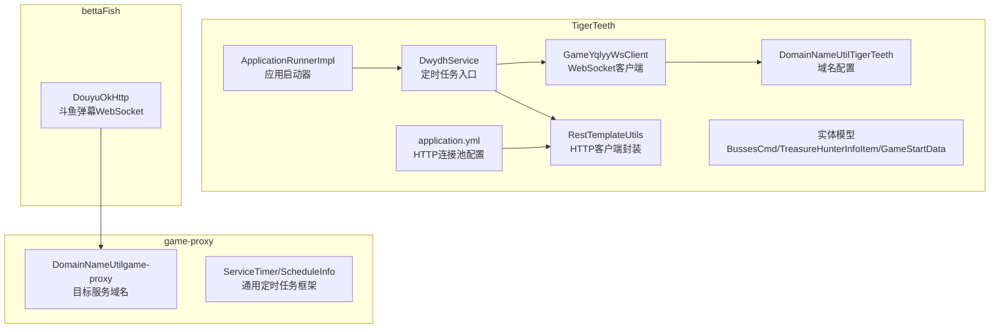
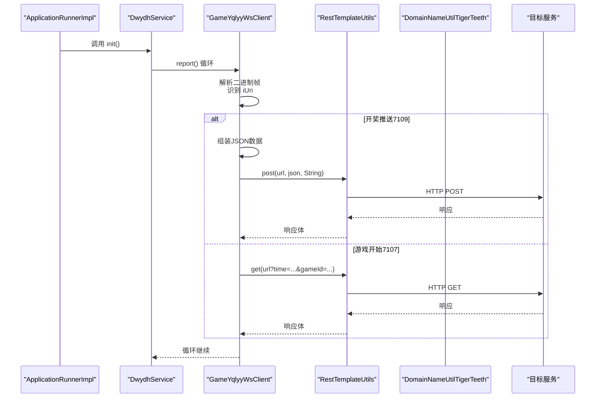
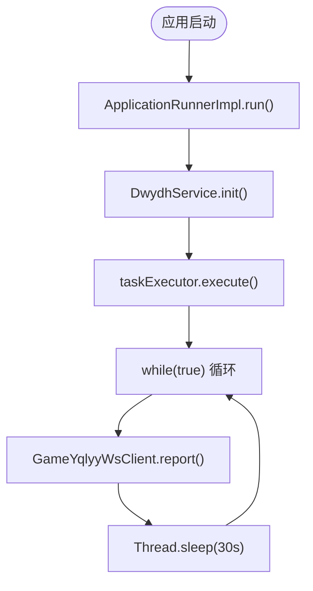
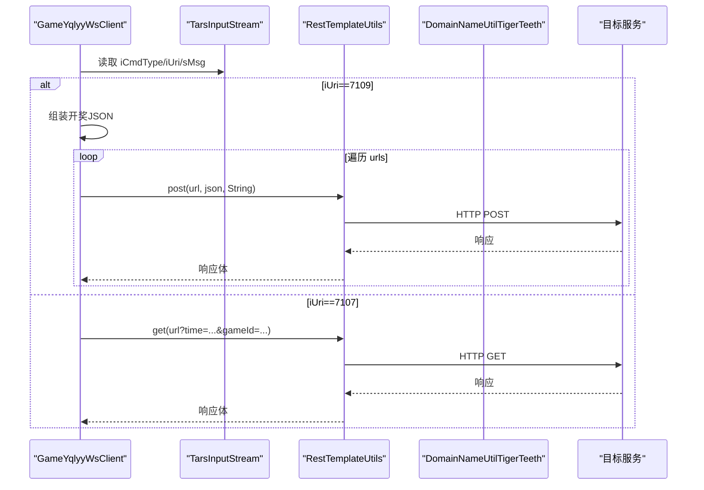
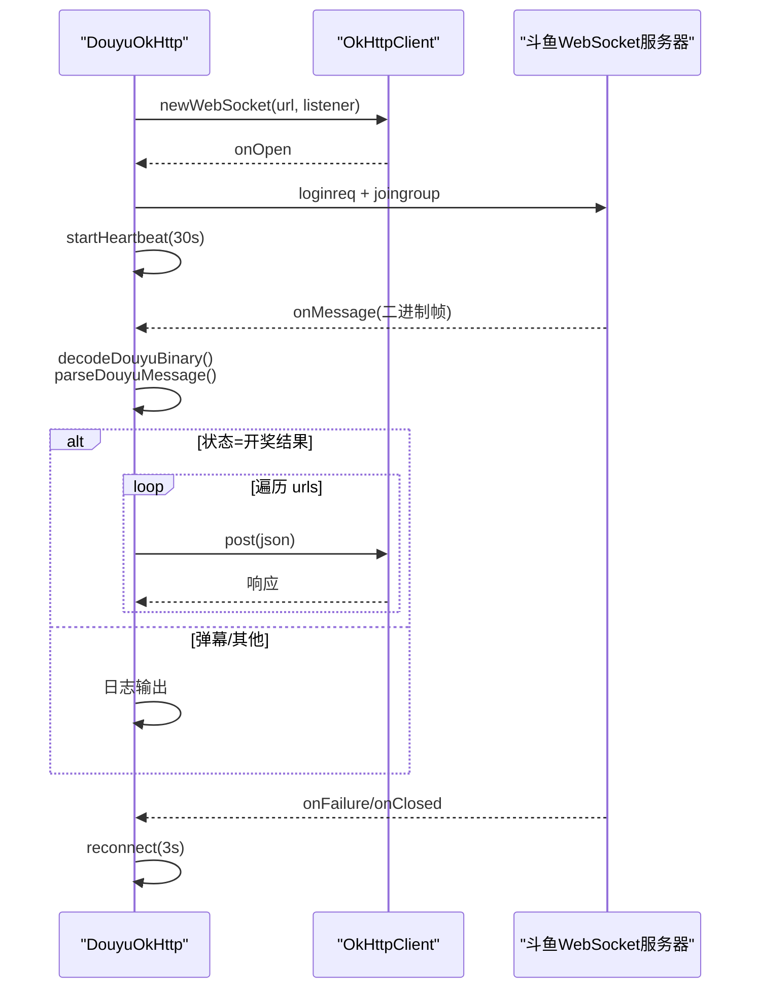
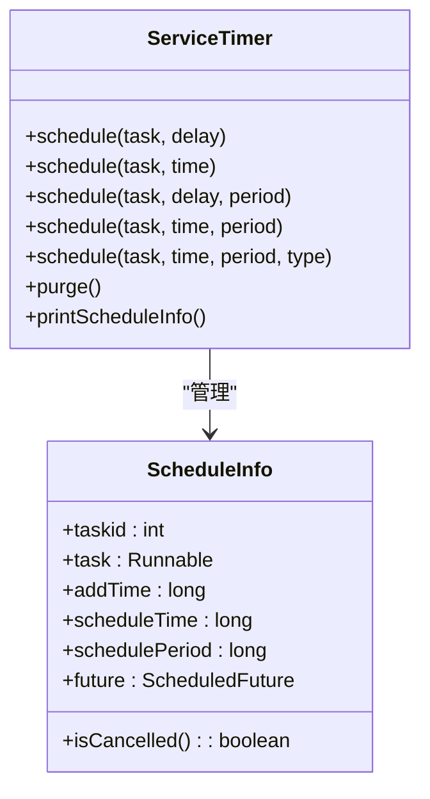
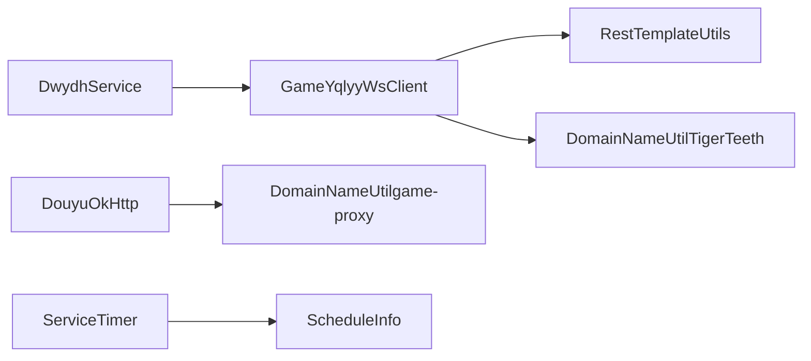

# 斗鱼直播服务模块

<cite>
**本文引用的文件**
- [DwydhService.java](file://TigerTeeth/src/main/java/com/dwydh/DwydhService.java)
- [DouyuOkHttp.java](file://bettaFish/src/main/java/com/utils/DouyuOkHttp.java)
- [DomainNameUtil.java（TigerTeeth）](file://TigerTeeth/src/main/java/com/utils/DomainNameUtil.java)
- [DomainNameUtil.java（game-proxy）](file://game-proxy/src/main/java/com/game/utils/DomainNameUtil.java)
- [RestTemplateUtils.java](file://TigerTeeth/src/main/java/com/commom/RestTemplateUtils.java)
- [GameYqlyyWsClient.java](file://TigerTeeth/src/main/java/com/yqlyy/GameYqlyyWsClient.java)
- [TreasureHunterInfoItem.java](file://TigerTeeth/src/main/java/com/entity/AccountedNotify/TreasureHunterInfoItem.java)
- [BussesCmd.java](file://TigerTeeth/src/main/java/com/entity/BussesCmd.java)
- [GameStartData.java](file://TigerTeeth/src/main/java/com/entity/GameStartData.java)
- [ApplicationRunnerImpl.java](file://TigerTeeth/src/main/java/com/listener/ApplicationRunnerImpl.java)
- [ServiceTimer.java](file://game-proxy/src/main/java/com/game/timer/ServiceTimer.java)
- [ScheduleInfo.java](file://game-proxy/src/main/java/com/game/timer/ScheduleInfo.java)
- [application.yml](file://TigerTeeth/src/main/resources/application.yml)
- [application.properties（bettaFish）](file://bettaFish/src/main/resources/application.properties)
</cite>

## 目录
1. [简介](#简介)
2. [项目结构](#项目结构)
3. [核心组件](#核心组件)
4. [架构总览](#架构总览)
5. [详细组件分析](#详细组件分析)
6. [依赖关系分析](#依赖关系分析)
7. [性能与可扩展性](#性能与可扩展性)
8. [故障排查指南](#故障排查指南)
9. [结论](#结论)
10. [附录](#附录)

## 简介
本技术文档聚焦于斗鱼直播服务模块，系统性梳理以下方面：
- DwydhService 在斗鱼平台上的实现方式与职责边界
- HTTP 客户端配置与使用（OkHttp 与 RestTemplate）
- 数据同步机制与定时任务管理
- DouyuOkHttp 工具类的设计原理与关键作用
- DomainNameUtil 在域名管理中的应用与配置策略
- HTTP 请求流程、响应处理与错误重试机制
- 斗鱼平台特有 API 接口调用示例、数据格式转换与状态监控实现
- 模块的可扩展性设计与性能优化方案

## 项目结构
该模块由两个子工程协作完成：
- TigerTeeth：负责 WebSocket 与 HTTP 同步、定时上报、实体模型与配置
- bettaFish：负责斗鱼弹幕 WebSocket 的接入与心跳、二进制协议编解码

图表来源
- [DwydhService.java](file://TigerTeeth/src/main/java/com/dwydh/DwydhService.java#L1-L39)
- [GameYqlyyWsClient.java](file://TigerTeeth/src/main/java/com/yqlyy/GameYqlyyWsClient.java#L1-L328)
- [RestTemplateUtils.java](file://TigerTeeth/src/main/java/com/commom/RestTemplateUtils.java#L1-L31)
- [DouyuOkHttp.java](file://bettaFish/src/main/java/com/utils/DouyuOkHttp.java#L1-L282)
- [DomainNameUtil.java（TigerTeeth）](file://TigerTeeth/src/main/java/com/utils/DomainNameUtil.java#L1-L16)
- [DomainNameUtil.java（game-proxy）](file://game-proxy/src/main/java/com/game/utils/DomainNameUtil.java#L1-L16)
- [ApplicationRunnerImpl.java](file://TigerTeeth/src/main/java/com/listener/ApplicationRunnerImpl.java#L1-L34)
- [application.yml](file://TigerTeeth/src/main/resources/application.yml#L1-L31)
- [ServiceTimer.java](file://game-proxy/src/main/java/com/game/timer/ServiceTimer.java#L1-L164)
- [ScheduleInfo.java](file://game-proxy/src/main/java/com/game/timer/ScheduleInfo.java#L1-L66)

章节来源
- [DwydhService.java](file://TigerTeeth/src/main/java/com/dwydh/DwydhService.java#L1-L39)
- [DouyuOkHttp.java](file://bettaFish/src/main/java/com/utils/DouyuOkHttp.java#L1-L282)
- [DomainNameUtil.java（TigerTeeth）](file://TigerTeeth/src/main/java/com/utils/DomainNameUtil.java#L1-L16)
- [DomainNameUtil.java（game-proxy）](file://game-proxy/src/main/java/com/game/utils/DomainNameUtil.java#L1-L16)
- [RestTemplateUtils.java](file://TigerTeeth/src/main/java/com/commom/RestTemplateUtils.java#L1-L31)
- [GameYqlyyWsClient.java](file://TigerTeeth/src/main/java/com/yqlyy/GameYqlyyWsClient.java#L1-L328)
- [TreasureHunterInfoItem.java](file://TigerTeeth/src/main/java/com/entity/AccountedNotify/TreasureHunterInfoItem.java#L1-L124)
- [BussesCmd.java](file://TigerTeeth/src/main/java/com/entity/BussesCmd.java#L1-L10)
- [GameStartData.java](file://TigerTeeth/src/main/java/com/entity/GameStartData.java#L1-L79)
- [ApplicationRunnerImpl.java](file://TigerTeeth/src/main/java/com/listener/ApplicationRunnerImpl.java#L1-L34)
- [ServiceTimer.java](file://game-proxy/src/main/java/com/game/timer/ServiceTimer.java#L1-L164)
- [ScheduleInfo.java](file://game-proxy/src/main/java/com/game/timer/ScheduleInfo.java#L1-L66)
- [application.yml](file://TigerTeeth/src/main/resources/application.yml#L1-L31)
- [application.properties（bettaFish）](file://bettaFish/src/main/resources/application.properties#L1-L1)

## 核心组件
- DwydhService：作为定时任务入口，通过线程池调度 WebSocket 客户端，周期性上报状态
- GameYqlyyWsClient：基于 Java WebSocket API 的客户端，解析二进制帧、识别推送类型并触发数据同步
- DouyuOkHttp：基于 OkHttp 的斗鱼弹幕 WebSocket 客户端，负责登录、心跳、消息解析与结果同步
- RestTemplateUtils：对 RestTemplate 的轻量封装，统一 GET/POST/exchange 调用
- DomainNameUtil：集中管理目标服务域名数组，支持多活与灰度发布
- 实体模型：BussesCmd、TreasureHunterInfoItem、GameStartData，用于承载协议字段与业务数据
- ServiceTimer：通用定时任务框架，提供统一的任务注册、周期调度与清理

章节来源
- [DwydhService.java](file://TigerTeeth/src/main/java/com/dwydh/DwydhService.java#L1-L39)
- [GameYqlyyWsClient.java](file://TigerTeeth/src/main/java/com/yqlyy/GameYqlyyWsClient.java#L1-L328)
- [DouyuOkHttp.java](file://bettaFish/src/main/java/com/utils/DouyuOkHttp.java#L1-L282)
- [RestTemplateUtils.java](file://TigerTeeth/src/main/java/com/commom/RestTemplateUtils.java#L1-L31)
- [DomainNameUtil.java（TigerTeeth）](file://TigerTeeth/src/main/java/com/utils/DomainNameUtil.java#L1-L16)
- [DomainNameUtil.java（game-proxy）](file://game-proxy/src/main/java/com/game/utils/DomainNameUtil.java#L1-L16)
- [BussesCmd.java](file://TigerTeeth/src/main/java/com/entity/BussesCmd.java#L1-L10)
- [TreasureHunterInfoItem.java](file://TigerTeeth/src/main/java/com/entity/AccountedNotify/TreasureHunterInfoItem.java#L1-L124)
- [GameStartData.java](file://TigerTeeth/src/main/java/com/entity/GameStartData.java#L1-L79)
- [ServiceTimer.java](file://game-proxy/src/main/java/com/game/timer/ServiceTimer.java#L1-L164)

## 架构总览
模块采用“启动器驱动 + 多客户端协同”的架构：
- ApplicationRunnerImpl 在应用启动后调用 DwydhService.init()
- DwydhService 使用线程池执行 GameYqlyyWsClient 的 report 循环
- GameYqlyyWsClient 解析二进制帧，根据 iUri 分发不同业务逻辑，触发 HTTP 同步
- bettaFish 中的 DouyuOkHttp 独立维护弹幕 WebSocket，按斗鱼协议登录、心跳与消息分发，并将开奖结果同步至多活域名

图表来源
- [ApplicationRunnerImpl.java](file://TigerTeeth/src/main/java/com/listener/ApplicationRunnerImpl.java#L1-L34)
- [DwydhService.java](file://TigerTeeth/src/main/java/com/dwydh/DwydhService.java#L1-L39)
- [GameYqlyyWsClient.java](file://TigerTeeth/src/main/java/com/yqlyy/GameYqlyyWsClient.java#L1-L328)
- [RestTemplateUtils.java](file://TigerTeeth/src/main/java/com/commom/RestTemplateUtils.java#L1-L31)
- [DomainNameUtil.java（TigerTeeth）](file://TigerTeeth/src/main/java/com/utils/DomainNameUtil.java#L1-L16)

## 详细组件分析

### DwydhService：定时任务与线程池
- 职责：在应用启动后，通过线程池异步启动 WebSocket 客户端，周期性调用 report 方法
- 关键点：
  - 使用 ThreadPoolTaskExecutor 执行长时任务，避免阻塞主线程
  - 循环内调用 GameYqlyyWsClient.report()，内部包含重连与心跳逻辑
  - 通过 ApplicationRunnerImpl 触发初始化

图表来源
- [ApplicationRunnerImpl.java](file://TigerTeeth/src/main/java/com/listener/ApplicationRunnerImpl.java#L1-L34)
- [DwydhService.java](file://TigerTeeth/src/main/java/com/dwydh/DwydhService.java#L1-L39)

章节来源
- [DwydhService.java](file://TigerTeeth/src/main/java/com/dwydh/DwydhService.java#L1-L39)
- [ApplicationRunnerImpl.java](file://TigerTeeth/src/main/java/com/listener/ApplicationRunnerImpl.java#L1-L34)

### GameYqlyyWsClient：WebSocket 协议解析与数据同步
- 职责：连接虎牙 WebSocket，解析二进制帧，识别推送类型并触发 HTTP 同步
- 关键点：
  - 使用 javax.websocket.ClientEndpoint 注解式客户端
  - 二进制帧解析：TarsInputStream 读取 iCmdType、iUri、sMsg
  - 根据 iUri 分发：
    - 7109：开奖推送，组装 JSON 并向 DomainNameUtil.urls 列表逐个同步
    - 7107：游戏开始，向 DomainNameUtil.transitUrls 列表同步时间参数
    - 其他 URI：类似处理，分别映射到不同业务路径
  - 使用 RestTemplateUtils 统一发起 HTTP 请求，记录日志并捕获异常

图表来源
- [GameYqlyyWsClient.java](file://TigerTeeth/src/main/java/com/yqlyy/GameYqlyyWsClient.java#L1-L328)
- [RestTemplateUtils.java](file://TigerTeeth/src/main/java/com/commom/RestTemplateUtils.java#L1-L31)
- [DomainNameUtil.java（TigerTeeth）](file://TigerTeeth/src/main/java/com/utils/DomainNameUtil.java#L1-L16)

章节来源
- [GameYqlyyWsClient.java](file://TigerTeeth/src/main/java/com/yqlyy/GameYqlyyWsClient.java#L1-L328)
- [RestTemplateUtils.java](file://TigerTeeth/src/main/java/com/commom/RestTemplateUtils.java#L1-L31)
- [DomainNameUtil.java（TigerTeeth）](file://TigerTeeth/src/main/java/com/utils/DomainNameUtil.java#L1-L16)
- [BussesCmd.java](file://TigerTeeth/src/main/java/com/entity/BussesCmd.java#L1-L10)
- [TreasureHunterInfoItem.java](file://TigerTeeth/src/main/java/com/entity/AccountedNotify/TreasureHunterInfoItem.java#L1-L124)
- [GameStartData.java](file://TigerTeeth/src/main/java/com/entity/GameStartData.java#L1-L79)

### DouyuOkHttp：斗鱼弹幕 WebSocket 客户端
- 设计原理：
  - 使用 OkHttp 的 WebSocket 客户端，自定义连接头与协议
  - 登录流程：连接成功后发送 loginreq 与 joingroup 指令
  - 心跳机制：每 30 秒发送 mrkl 指令维持连接
  - 错误重连：onFailure/onClosed 回调中延迟重连
  - 协议编解码：二进制帧长度、类型、文本体解析；消息字符串以 “/” 和 “@=” 分割键值
- 关键作用：
  - 实时订阅斗鱼弹幕与游戏状态
  - 当检测到特定状态（如开奖结果）时，遍历 DomainNameUtil.urls 对外同步

图表来源
- [DouyuOkHttp.java](file://bettaFish/src/main/java/com/utils/DouyuOkHttp.java#L1-L282)

章节来源
- [DouyuOkHttp.java](file://bettaFish/src/main/java/com/utils/DouyuOkHttp.java#L1-L282)

### DomainNameUtil：域名管理与配置策略
- TigerTeeth 版本：
  - urls：业务同步目标域名列表（当前为空，便于外部注入）
  - transitUrls：中转服务域名列表（本地回环示例）
- game-proxy 版本：
  - urls：生产环境多活域名数组，支持跨机房/多实例部署
- 配置策略建议：
  - urls 与 transitUrls 应通过配置中心或环境变量注入，避免硬编码
  - 支持灰度发布：按百分比切换 urls 列表中的部分地址
  - 健康检查：对 urls 中每个地址进行探活，剔除不可用节点

章节来源
- [DomainNameUtil.java（TigerTeeth）](file://TigerTeeth/src/main/java/com/utils/DomainNameUtil.java#L1-L16)
- [DomainNameUtil.java（game-proxy）](file://game-proxy/src/main/java/com/game/utils/DomainNameUtil.java#L1-L16)

### HTTP 客户端配置与使用
- RestTemplateUtils：
  - 提供 post/get/exchange 三类常用方法，统一封装 ResponseEntity 返回
  - 与 application.yml 中 HTTP 连接池参数配合使用
- application.yml（TigerTeeth）：
  - http.maxTotal、http.defaultMaxPerRoute、http.connectTimeout、http.socketTimeout 等
  - 通过 spring.profiles.active 切换环境
- bettaFish：
  - application.properties 设置 server.port

章节来源
- [RestTemplateUtils.java](file://TigerTeeth/src/main/java/com/commom/RestTemplateUtils.java#L1-L31)
- [application.yml](file://TigerTeeth/src/main/resources/application.yml#L1-L31)
- [application.properties（bettaFish）](file://bettaFish/src/main/resources/application.properties#L1-L1)

### 数据格式转换与状态监控
- GameYqlyyWsClient：
  - 使用 TarsInputStream 读取二进制字段，构造 JSON 对象后同步
  - 对不同 iUri（如 7109/7107/7103/7101）进行差异化处理
- DouyuOkHttp：
  - decodeDouyuBinary：按小端序解析二进制帧，提取文本体
  - parseDouyuMessage：解析 “key@=value/...” 形式的键值对
  - 日志记录：对弹幕与开奖结果进行分级输出，便于监控
- 实体模型：
  - BussesCmd：承载推送命令的元信息
  - TreasureHunterInfoItem：包含动物 ID/名称等字段
  - GameStartData：包含轮次时间戳等字段

章节来源
- [GameYqlyyWsClient.java](file://TigerTeeth/src/main/java/com/yqlyy/GameYqlyyWsClient.java#L1-L328)
- [DouyuOkHttp.java](file://bettaFish/src/main/java/com/utils/DouyuOkHttp.java#L1-L282)
- [BussesCmd.java](file://TigerTeeth/src/main/java/com/entity/BussesCmd.java#L1-L10)
- [TreasureHunterInfoItem.java](file://TigerTeeth/src/main/java/com/entity/AccountedNotify/TreasureHunterInfoItem.java#L1-L124)
- [GameStartData.java](file://TigerTeeth/src/main/java/com/entity/GameStartData.java#L1-L79)

### 定时任务管理
- DwydhService：通过线程池执行 report 循环，固定周期上报
- ServiceTimer：通用定时任务框架，支持一次性与周期性任务、毫秒/秒/分钟/小时/天/周/月/年粒度
  - schedule(...) 多重重载，支持按相对延时、绝对时间与周期调度
  - 内置 purge() 自动清理取消/完成的任务，降低内存占用
  - ScheduleInfo 记录任务生命周期与未来句柄，便于可观测性

图表来源
- [ServiceTimer.java](file://game-proxy/src/main/java/com/game/timer/ServiceTimer.java#L1-L164)
- [ScheduleInfo.java](file://game-proxy/src/main/java/com/game/timer/ScheduleInfo.java#L1-L66)

章节来源
- [ServiceTimer.java](file://game-proxy/src/main/java/com/game/timer/ServiceTimer.java#L1-L164)
- [ScheduleInfo.java](file://game-proxy/src/main/java/com/game/timer/ScheduleInfo.java#L1-L66)

## 依赖关系分析
- DwydhService 依赖线程池与 GameYqlyyWsClient
- GameYqlyyWsClient 依赖 RestTemplateUtils 与 DomainNameUtil
- DouyuOkHttp 独立于 Spring 上下文，但与 DomainNameUtil 协作
- ServiceTimer 为通用定时任务基础设施，可被各模块复用

图表来源
- [DwydhService.java](file://TigerTeeth/src/main/java/com/dwydh/DwydhService.java#L1-L39)
- [GameYqlyyWsClient.java](file://TigerTeeth/src/main/java/com/yqlyy/GameYqlyyWsClient.java#L1-L328)
- [RestTemplateUtils.java](file://TigerTeeth/src/main/java/com/commom/RestTemplateUtils.java#L1-L31)
- [DouyuOkHttp.java](file://bettaFish/src/main/java/com/utils/DouyuOkHttp.java#L1-L282)
- [DomainNameUtil.java（TigerTeeth）](file://TigerTeeth/src/main/java/com/utils/DomainNameUtil.java#L1-L16)
- [DomainNameUtil.java（game-proxy）](file://game-proxy/src/main/java/com/game/utils/DomainNameUtil.java#L1-L16)
- [ServiceTimer.java](file://game-proxy/src/main/java/com/game/timer/ServiceTimer.java#L1-L164)
- [ScheduleInfo.java](file://game-proxy/src/main/java/com/game/timer/ScheduleInfo.java#L1-L66)

章节来源
- [DwydhService.java](file://TigerTeeth/src/main/java/com/dwydh/DwydhService.java#L1-L39)
- [GameYqlyyWsClient.java](file://TigerTeeth/src/main/java/com/yqlyy/GameYqlyyWsClient.java#L1-L328)
- [RestTemplateUtils.java](file://TigerTeeth/src/main/java/com/commom/RestTemplateUtils.java#L1-L31)
- [DouyuOkHttp.java](file://bettaFish/src/main/java/com/utils/DouyuOkHttp.java#L1-L282)
- [DomainNameUtil.java（TigerTeeth）](file://TigerTeeth/src/main/java/com/utils/DomainNameUtil.java#L1-L16)
- [DomainNameUtil.java（game-proxy）](file://game-proxy/src/main/java/com/game/utils/DomainNameUtil.java#L1-L16)
- [ServiceTimer.java](file://game-proxy/src/main/java/com/game/timer/ServiceTimer.java#L1-L164)
- [ScheduleInfo.java](file://game-proxy/src/main/java/com/game/timer/ScheduleInfo.java#L1-L66)

## 性能与可扩展性
- 连接池与超时：
  - application.yml 中设置最大连接数、并发路由限制、连接/请求/套接字超时
  - 建议结合业务 QPS 调优，避免连接池耗尽导致排队
- 异步化：
  - DwydhService 使用线程池隔离长时任务，避免阻塞主线程
  - ServiceTimer 提供统一的调度能力，支持高并发场景
- 多活与灰度：
  - DomainNameUtil 支持多域名列表，便于灰度与灾备
  - 建议引入健康检查与熔断降级策略
- 协议与编解码：
  - GameYqlyyWsClient 的二进制解析与 DouyuOkHttp 的字符串解析均采用流式处理，减少内存拷贝
- 心跳与重连：
  - DouyuOkHttp 的心跳与自动重连保障长连接稳定性
  - 建议增加指数退避与抖动，降低雪崩风险

[本节为通用指导，无需列出章节来源]

## 故障排查指南
- WebSocket 连接失败
  - 检查 wsUrl 是否有效，确认网络可达
  - 查看 onOpen/onFailure/onClosed 回调日志
- HTTP 同步失败
  - 检查 DomainNameUtil.urls 是否正确配置
  - 查看 RestTemplateUtils 的异常日志与响应码
- 弹幕/开奖结果未同步
  - 确认 DouyuOkHttp 的房间号与登录流程
  - 检查 parseDouyuMessage 的键值解析是否符合协议
- 定时任务异常
  - 使用 ServiceTimer.printScheduleInfo() 输出任务状态
  - 检查 scheduleInfos 中是否存在取消/完成的任务未清理

章节来源
- [GameYqlyyWsClient.java](file://TigerTeeth/src/main/java/com/yqlyy/GameYqlyyWsClient.java#L1-L328)
- [DouyuOkHttp.java](file://bettaFish/src/main/java/com/utils/DouyuOkHttp.java#L1-L282)
- [ServiceTimer.java](file://game-proxy/src/main/java/com/game/timer/ServiceTimer.java#L1-L164)

## 结论
本模块通过“启动器 + 多客户端 + 统一 HTTP 封装 + 定时任务框架”的组合，实现了对斗鱼与虎牙直播平台的数据采集与同步。DouyuOkHttp 专注于弹幕与开奖结果的实时订阅，GameYqlyyWsClient 负责虎牙游戏状态的解析与同步，DomainNameUtil 提供灵活的多活配置，ServiceTimer 提供稳定的调度能力。整体设计具备良好的可扩展性与可维护性，建议后续引入配置中心、健康检查与熔断降级，进一步提升鲁棒性。

[本节为总结性内容，无需列出章节来源]

## 附录
- 配置项参考
  - application.yml 中 HTTP 连接池参数
  - bettaFish application.properties 端口配置
- 实体模型说明
  - BussesCmd：推送命令元信息
  - TreasureHunterInfoItem：动物信息
  - GameStartData：游戏时间戳

章节来源
- [application.yml](file://TigerTeeth/src/main/resources/application.yml#L1-L31)
- [application.properties（bettaFish）](file://bettaFish/src/main/resources/application.properties#L1-L1)
- [BussesCmd.java](file://TigerTeeth/src/main/java/com/entity/BussesCmd.java#L1-L10)
- [TreasureHunterInfoItem.java](file://TigerTeeth/src/main/java/com/entity/AccountedNotify/TreasureHunterInfoItem.java#L1-L124)
- [GameStartData.java](file://TigerTeeth/src/main/java/com/entity/GameStartData.java#L1-L79)