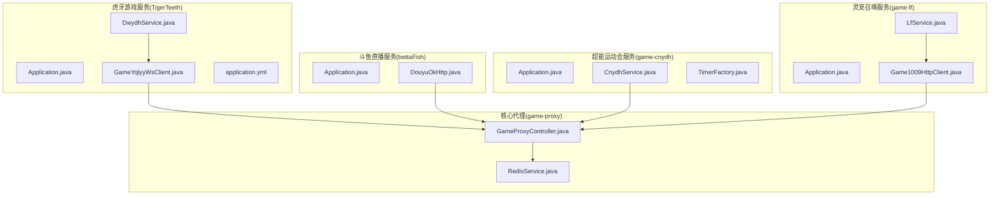
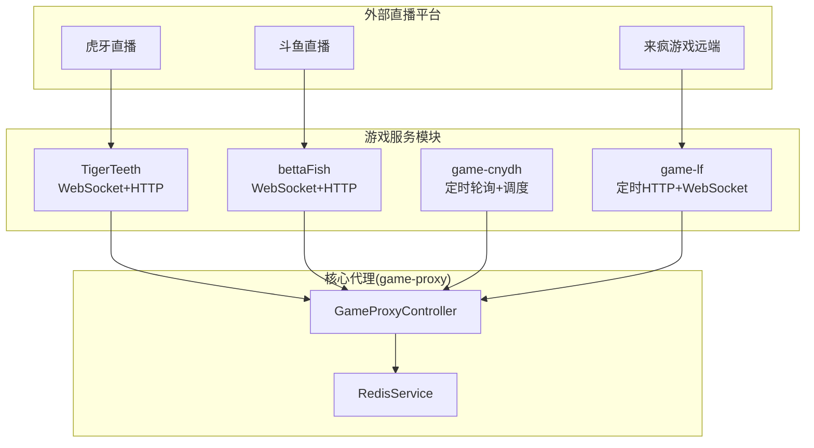
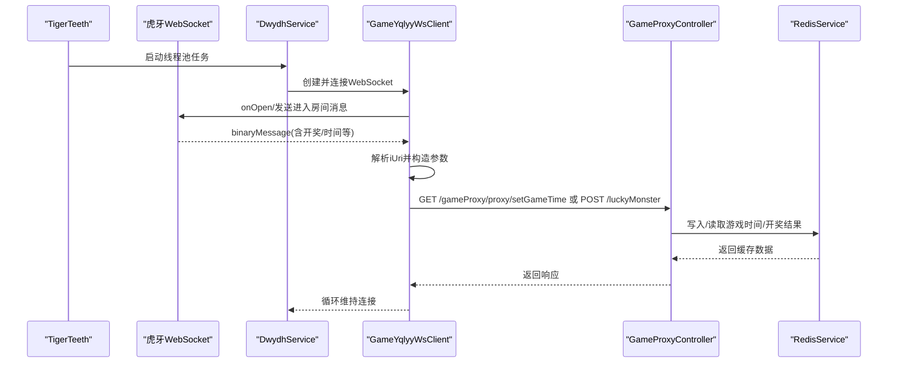
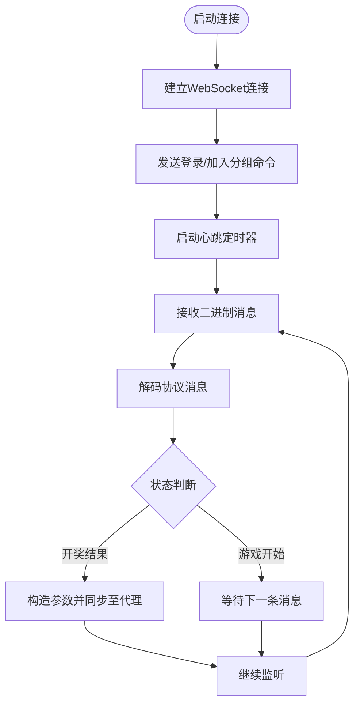
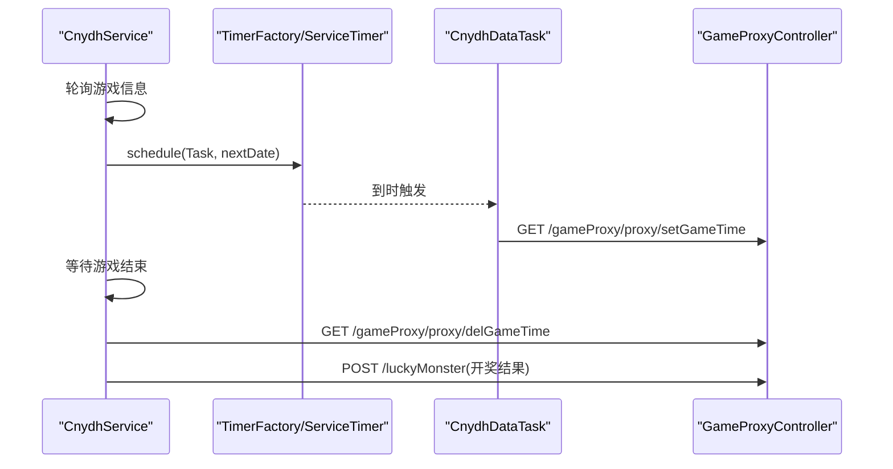
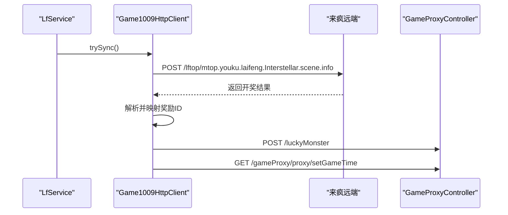
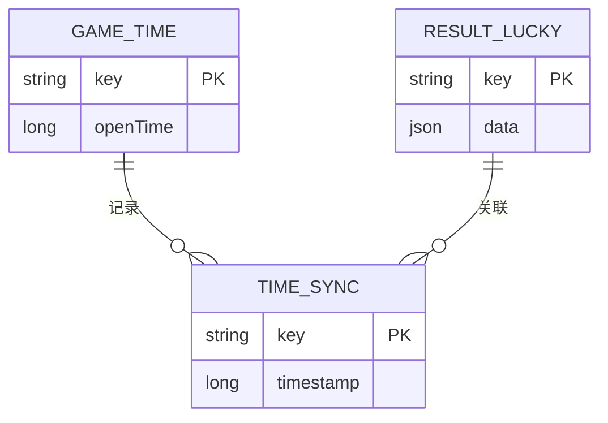
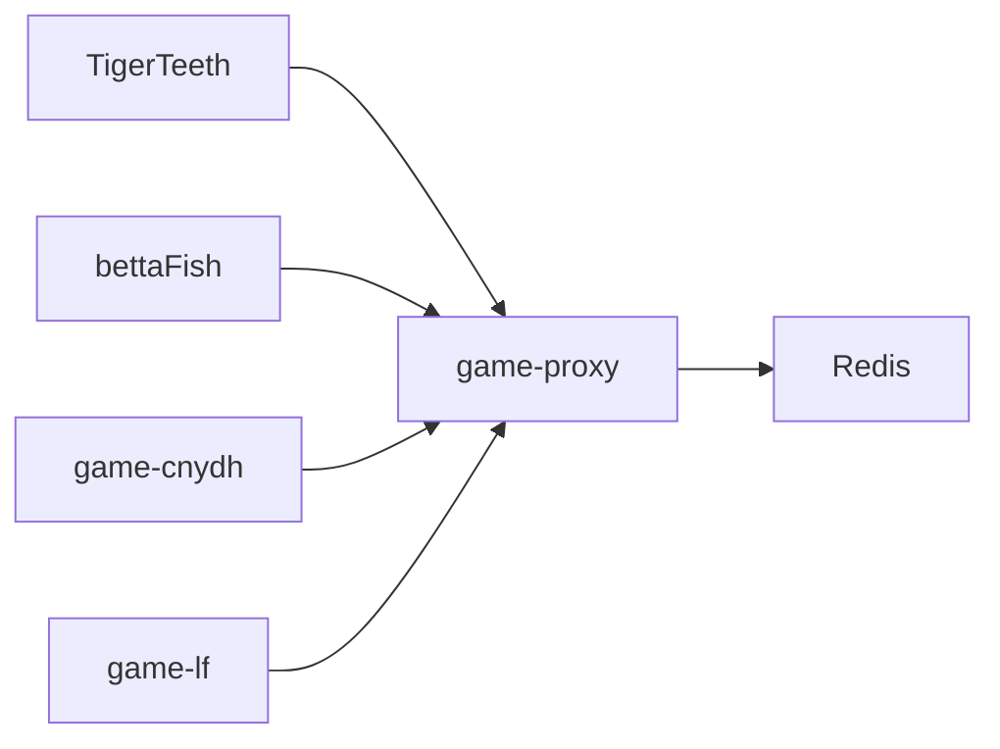

# 游戏服务模块

<cite>
**本文引用的文件**   
- [TigerTeeth/Application.java](file://TigerTeeth/src/main/java/com/Application.java)
- [TigerTeeth/DwydhService.java](file://TigerTeeth/src/main/java/com/dwydh/DwydhService.java)
- [TigerTeeth/GameYqlyyWsClient.java](file://TigerTeeth/src/main/java/com/yqlyy/GameYqlyyWsClient.java)
- [TigerTeeth/application.yml](file://TigerTeeth/src/main/resources/application.yml)
- [bettaFish/Application.java](file://bettaFish/src/main/java/com/Application.java)
- [bettaFish/DouyuOkHttp.java](file://bettaFish/src/main/java/com/utils/DouyuOkHttp.java)
- [game-cnydh/Application.java](file://game-cnydh/src/main/java/com/Application.java)
- [game-cnydh/CnydhService.java](file://game-cnydh/src/main/java/com/cnydh/cnydh/CnydhService.java)
- [game-cnydh/TimerFactory.java](file://game-cnydh/src/main/java/com/utils/TimerFactory.java)
- [game-lf/Application.java](file://game-lf/src/main/java/com/Application.java)
- [game-lf/LfService.java](file://game-lf/src/main/java/com/listener/LfService.java)
- [game-lf/Game1009HttpClient.java](file://game-lf/src/main/java/com/listener/Game1009HttpClient.java)
- [game-proxy/GameProxyController.java](file://game-proxy/src/main/java/com/game/controller/GameProxyController.java)
- [game-proxy/RedisService.java](file://game-proxy/src/main/java/com/game/redis/RedisService.java)
</cite>

## 目录
1. [引言](#引言)
2. [项目结构](#项目结构)
3. [核心组件](#核心组件)
4. [架构总览](#架构总览)
5. [详细组件分析](#详细组件分析)
6. [依赖分析](#依赖分析)
7. [性能考量](#性能考量)
8. [故障排查指南](#故障排查指南)
9. [结论](#结论)
10. [附录](#附录)

## 引言
本文件面向“游戏服务模块”的技术文档，系统性梳理并解读以下四个子模块的业务目标、架构设计与关键技术实现：
- 虎牙游戏服务（TigerTeeth）：通过 WebSocket 实时订阅虎牙直播平台的游戏事件，解析并转发开奖与时间同步信息至中转代理。
- 斗鱼直播服务（bettaFish）：基于 OkHttp 的 WebSocket 客户端，接入斗鱼弹幕与游戏事件，解析并同步开奖结果。
- 超能运动会服务（game-cnydh）：周期性轮询游戏状态，调度定时任务，同步游戏开始时间与开奖结果。
- 灵宠召唤服务（game-lf）：基于定时调度与 HTTP 客户端，拉取远端游戏结果并同步至代理。

同时，文档阐述这些模块与核心代理系统（game-proxy）的集成方式，覆盖 WebSocket 通信、HTTP 客户端实现、定时任务调度、配置管理、错误处理与性能优化策略，并提供模块间协作关系图与数据流转说明。

## 项目结构
该仓库采用多模块聚合结构，每个游戏服务独立为一个 Maven 模块，统一由 Spring Boot 启动入口驱动，核心代理模块提供统一的 HTTP 代理与缓存能力。

**图表来源**
- [TigerTeeth/Application.java](file://TigerTeeth/src/main/java/com/Application.java#L1-L14)
- [TigerTeeth/DwydhService.java](file://TigerTeeth/src/main/java/com/dwydh/DwydhService.java#L1-L39)
- [TigerTeeth/GameYqlyyWsClient.java](file://TigerTeeth/src/main/java/com/yqlyy/GameYqlyyWsClient.java#L1-L328)
- [TigerTeeth/application.yml](file://TigerTeeth/src/main/resources/application.yml#L1-L31)
- [bettaFish/Application.java](file://bettaFish/src/main/java/com/Application.java#L1-L14)
- [bettaFish/DouyuOkHttp.java](file://bettaFish/src/main/java/com/utils/DouyuOkHttp.java#L1-L282)
- [game-cnydh/Application.java](file://game-cnydh/src/main/java/com/Application.java#L1-L14)
- [game-cnydh/CnydhService.java](file://game-cnydh/src/main/java/com/cnydh/cnydh/CnydhService.java#L1-L143)
- [game-cnydh/TimerFactory.java](file://game-cnydh/src/main/java/com/utils/TimerFactory.java#L1-L11)
- [game-lf/Application.java](file://game-lf/src/main/java/com/Application.java#L1-L14)
- [game-lf/LfService.java](file://game-lf/src/main/java/com/listener/LfService.java#L1-L42)
- [game-lf/Game1009HttpClient.java](file://game-lf/src/main/java/com/listener/Game1009HttpClient.java#L1-L187)
- [game-proxy/GameProxyController.java](file://game-proxy/src/main/java/com/game/controller/GameProxyController.java#L1-L436)
- [game-proxy/RedisService.java](file://game-proxy/src/main/java/com/game/redis/RedisService.java#L1-L244)

**章节来源**
- [TigerTeeth/Application.java](file://TigerTeeth/src/main/java/com/Application.java#L1-L14)
- [bettaFish/Application.java](file://bettaFish/src/main/java/com/Application.java#L1-L14)
- [game-cnydh/Application.java](file://game-cnydh/src/main/java/com/Application.java#L1-L14)
- [game-lf/Application.java](file://game-lf/src/main/java/com/Application.java#L1-L14)

## 核心组件
- WebSocket 客户端
  - 虎牙：GameYqlyyWsClient 基于 Java WebSocket API，解析二进制帧并分发不同业务事件（开奖、开始时间等），随后通过 HTTP 客户端转发至代理。
  - 斗鱼：DouyuOkHttp 基于 OkHttp 的 WebSocket 客户端，负责登录、心跳、消息解码与结果同步。
- HTTP 客户端
  - 虎牙/灵宠：RestTemplateUtils（由各模块引入）或 OkHttpUtil（game-lf）用于向代理与下游服务发起 HTTP 请求。
  - 代理：GameProxyController 提供统一的代理接口与缓存读写。
- 定时任务
  - game-cnydh：TimerFactory + ServiceTimer 组合，按游戏阶段动态调度任务。
  - game-lf：LfService 使用 ScheduledExecutorService + while(true) 循环，周期性触发 Game1009HttpClient 同步。
- 配置与缓存
  - 各模块 application.yml 中定义 HTTP 连接池与超时参数。
  - game-proxy RedisService 提供统一的 Redis 缓存能力，GameProxyController 作为入口暴露游戏时间与开奖结果的读写接口。

**章节来源**
- [TigerTeeth/GameYqlyyWsClient.java](file://TigerTeeth/src/main/java/com/yqlyy/GameYqlyyWsClient.java#L1-L328)
- [bettaFish/DouyuOkHttp.java](file://bettaFish/src/main/java/com/utils/DouyuOkHttp.java#L1-L282)
- [game-cnydh/CnydhService.java](file://game-cnydh/src/main/java/com/cnydh/cnydh/CnydhService.java#L1-L143)
- [game-cnydh/TimerFactory.java](file://game-cnydh/src/main/java/com/utils/TimerFactory.java#L1-L11)
- [game-lf/LfService.java](file://game-lf/src/main/java/com/listener/LfService.java#L1-L42)
- [game-lf/Game1009HttpClient.java](file://game-lf/src/main/java/com/listener/Game1009HttpClient.java#L1-L187)
- [game-proxy/GameProxyController.java](file://game-proxy/src/main/java/com/game/controller/GameProxyController.java#L1-L436)
- [game-proxy/RedisService.java](file://game-proxy/src/main/java/com/game/redis/RedisService.java#L1-L244)
- [TigerTeeth/application.yml](file://TigerTeeth/src/main/resources/application.yml#L1-L31)

## 架构总览
下图展示各模块与代理系统的交互关系与数据流向：

**图表来源**
- [TigerTeeth/GameYqlyyWsClient.java](file://TigerTeeth/src/main/java/com/yqlyy/GameYqlyyWsClient.java#L1-L328)
- [bettaFish/DouyuOkHttp.java](file://bettaFish/src/main/java/com/utils/DouyuOkHttp.java#L1-L282)
- [game-cnydh/CnydhService.java](file://game-cnydh/src/main/java/com/cnydh/cnydh/CnydhService.java#L1-L143)
- [game-lf/Game1009HttpClient.java](file://game-lf/src/main/java/com/listener/Game1009HttpClient.java#L1-L187)
- [game-proxy/GameProxyController.java](file://game-proxy/src/main/java/com/game/controller/GameProxyController.java#L1-L436)
- [game-proxy/RedisService.java](file://game-proxy/src/main/java/com/game/redis/RedisService.java#L1-L244)

## 详细组件分析

### 虎牙游戏服务（TigerTeeth）
- 业务职责
  - 通过 WebSocket 订阅虎牙游戏事件，解析开奖与开始时间等消息。
  - 将开奖结果与时间同步请求转发至代理，再由代理分发到下游服务。
- 关键实现
  - DwydhService：使用线程池执行 WebSocket 客户端，循环上报与维持连接。
  - GameYqlyyWsClient：处理 onOpen、onMessage、onError 等回调，解析二进制帧并根据 iUri 分发不同业务处理（如 7109 开奖、7107/7101 开始时间）。
  - HTTP 转发：通过 RestTemplateUtils 向代理接口（如 /gameProxy/proxy/setGameTime）发起 GET/POST 请求。
- 配置与运行
  - application.yml 中配置 HTTP 连接池与超时参数，确保长连接稳定。
- 数据流与序列图

**图表来源**
- [TigerTeeth/DwydhService.java](file://TigerTeeth/src/main/java/com/dwydh/DwydhService.java#L1-L39)
- [TigerTeeth/GameYqlyyWsClient.java](file://TigerTeeth/src/main/java/com/yqlyy/GameYqlyyWsClient.java#L1-L328)
- [game-proxy/GameProxyController.java](file://game-proxy/src/main/java/com/game/controller/GameProxyController.java#L1-L436)
- [game-proxy/RedisService.java](file://game-proxy/src/main/java/com/game/redis/RedisService.java#L1-L244)

**章节来源**
- [TigerTeeth/DwydhService.java](file://TigerTeeth/src/main/java/com/dwydh/DwydhService.java#L1-L39)
- [TigerTeeth/GameYqlyyWsClient.java](file://TigerTeeth/src/main/java/com/yqlyy/GameYqlyyWsClient.java#L1-L328)
- [TigerTeeth/application.yml](file://TigerTeeth/src/main/resources/application.yml#L1-L31)

### 斗鱼直播服务（bettaFish）
- 业务职责
  - 建立与斗鱼 WebSocket 的连接，登录房间并加入分组，周期性发送心跳。
  - 解析二进制协议消息，识别游戏状态变化（开始/结束），并将开奖结果同步至代理。
- 关键实现
  - DouyuOkHttp：封装连接、登录、心跳、消息解码与自动重连逻辑；解析 chatmsg 等消息，识别开奖结果后通过 OkHttp 发起同步请求。
  - 自动重连：断线后延迟重连，保证持续监控。
- 数据流与流程图

**图表来源**
- [bettaFish/DouyuOkHttp.java](file://bettaFish/src/main/java/com/utils/DouyuOkHttp.java#L1-L282)

**章节来源**
- [bettaFish/DouyuOkHttp.java](file://bettaFish/src/main/java/com/utils/DouyuOkHttp.java#L1-L282)

### 超能运动会服务（game-cnydh）
- 业务职责
  - 轮询游戏状态，当游戏即将开始时，向代理下发“游戏开始时间”；当游戏结束后，拉取开奖结果并同步至代理。
- 关键实现
  - CnydhService：周期性请求游戏信息，解析 play_status 与 remain_duration，调度 CnydhDataTask 定时任务。
  - TimerFactory：提供全局 ServiceTimer 单例，集中管理定时任务。
- 数据流与序列图

**图表来源**
- [game-cnydh/CnydhService.java](file://game-cnydh/src/main/java/com/cnydh/cnydh/CnydhService.java#L1-L143)
- [game-cnydh/TimerFactory.java](file://game-cnydh/src/main/java/com/utils/TimerFactory.java#L1-L11)
- [game-proxy/GameProxyController.java](file://game-proxy/src/main/java/com/game/controller/GameProxyController.java#L1-L436)

**章节来源**
- [game-cnydh/CnydhService.java](file://game-cnydh/src/main/java/com/cnydh/cnydh/CnydhService.java#L1-L143)
- [game-cnydh/TimerFactory.java](file://game-cnydh/src/main/java/com/utils/TimerFactory.java#L1-L11)

### 灵宠召唤服务（game-lf）
- 业务职责
  - 周期性拉取远端游戏开奖结果，同步至代理；同时向代理上报游戏开始时间。
- 关键实现
  - LfService：初始化单线程调度器，后台线程循环执行 Game1009HttpClient。
  - Game1009HttpClient：构建远端请求头与表单参数，解析返回并进行映射转换，随后同步至代理。
- 数据流与序列图

**图表来源**
- [game-lf/LfService.java](file://game-lf/src/main/java/com/listener/LfService.java#L1-L42)
- [game-lf/Game1009HttpClient.java](file://game-lf/src/main/java/com/listener/Game1009HttpClient.java#L1-L187)
- [game-proxy/GameProxyController.java](file://game-proxy/src/main/java/com/game/controller/GameProxyController.java#L1-L436)

**章节来源**
- [game-lf/LfService.java](file://game-lf/src/main/java/com/listener/LfService.java#L1-L42)
- [game-lf/Game1009HttpClient.java](file://game-lf/src/main/java/com/listener/Game1009HttpClient.java#L1-L187)

### 核心代理系统（game-proxy）
- 业务职责
  - 提供统一的 HTTP 代理接口，接收来自各游戏服务的开奖结果与时间同步请求，并将数据写入 Redis 缓存，供其他模块读取。
- 关键实现
  - GameProxyController：提供 /proxy/* 接口，包括游戏信息读取、时间设置/删除、开奖结果同步等。
  - RedisService：封装 Redis 操作，支持字符串、哈希、列表、集合等数据结构。
- 数据模型与流程

**图表来源**
- [game-proxy/GameProxyController.java](file://game-proxy/src/main/java/com/game/controller/GameProxyController.java#L1-L436)
- [game-proxy/RedisService.java](file://game-proxy/src/main/java/com/game/redis/RedisService.java#L1-L244)

**章节来源**
- [game-proxy/GameProxyController.java](file://game-proxy/src/main/java/com/game/controller/GameProxyController.java#L1-L436)
- [game-proxy/RedisService.java](file://game-proxy/src/main/java/com/game/redis/RedisService.java#L1-L244)

## 依赖分析
- 模块耦合
  - 各游戏服务模块与 game-proxy 通过 HTTP 接口耦合，不直接依赖彼此，降低耦合度。
  - game-proxy 内部通过 RedisService 与 GameProxyController 解耦，便于扩展与维护。
- 外部依赖
  - WebSocket 客户端：虎牙使用 Java WebSocket API，斗鱼使用 OkHttp WebSocket。
  - HTTP 客户端：虎牙/灵宠使用 RestTemplateUtils/OkHttpUtil，代理使用 RestTemplateUtils。
  - 定时调度：game-cnydh 使用自定义 TimerFactory + ServiceTimer，game-lf 使用 ScheduledExecutorService。
- 潜在风险
  - WebSocket 断线重连策略需统一规范，避免重复推送与资源浪费。
  - 定时任务与轮询频率应结合上游接口限流策略，防止触发风控。

**图表来源**
- [TigerTeeth/DwydhService.java](file://TigerTeeth/src/main/java/com/dwydh/DwydhService.java#L1-L39)
- [bettaFish/DouyuOkHttp.java](file://bettaFish/src/main/java/com/utils/DouyuOkHttp.java#L1-L282)
- [game-cnydh/CnydhService.java](file://game-cnydh/src/main/java/com/cnydh/cnydh/CnydhService.java#L1-L143)
- [game-lf/Game1009HttpClient.java](file://game-lf/src/main/java/com/listener/Game1009HttpClient.java#L1-L187)
- [game-proxy/GameProxyController.java](file://game-proxy/src/main/java/com/game/controller/GameProxyController.java#L1-L436)
- [game-proxy/RedisService.java](file://game-proxy/src/main/java/com/game/redis/RedisService.java#L1-L244)

**章节来源**
- [game-proxy/GameProxyController.java](file://game-proxy/src/main/java/com/game/controller/GameProxyController.java#L1-L436)
- [game-proxy/RedisService.java](file://game-proxy/src/main/java/com/game/redis/RedisService.java#L1-L244)

## 性能考量
- 连接与超时
  - 在虎牙模块的 application.yml 中配置了连接池大小、并发数、超时时间与连接验证策略，有助于提升长连接稳定性与吞吐。
- 轮询与定时
  - game-cnydh 与 game-lf 的轮询/定时频率需与上游接口限流策略匹配，避免频繁请求导致限流或封禁。
- 缓存命中
  - 代理层通过 Redis 缓存游戏时间与开奖结果，减少重复请求与跨模块数据传输成本。
- 线程与资源
  - WebSocket 客户端与定时任务均应避免阻塞主线程，合理设置线程池大小与守护线程策略，防止资源泄漏。

**章节来源**
- [TigerTeeth/application.yml](file://TigerTeeth/src/main/resources/application.yml#L1-L31)
- [game-proxy/RedisService.java](file://game-proxy/src/main/java/com/game/redis/RedisService.java#L1-L244)

## 故障排查指南
- WebSocket 连接问题
  - 检查 onOpen/onError 回调日志，确认握手与认证流程是否正常。
  - 若出现频繁断线，核查心跳间隔与自动重连逻辑，必要时调整连接超时参数。
- HTTP 请求异常
  - 核对请求头、URL 与参数格式，关注代理接口返回状态与异常日志。
  - 对于超时或失败的请求，建议增加重试与熔断策略。
- 定时任务未触发
  - 检查 TimerFactory 单例与 ServiceTimer 的调度队列，确认任务是否正确注册与执行。
- 缓存一致性
  - 通过 RedisService 的 getCacheObject 接口核对缓存键值，确保 set/del 操作一致。

**章节来源**
- [TigerTeeth/GameYqlyyWsClient.java](file://TigerTeeth/src/main/java/com/yqlyy/GameYqlyyWsClient.java#L1-L328)
- [bettaFish/DouyuOkHttp.java](file://bettaFish/src/main/java/com/utils/DouyuOkHttp.java#L1-L282)
- [game-cnydh/CnydhService.java](file://game-cnydh/src/main/java/com/cnydh/cnydh/CnydhService.java#L1-L143)
- [game-lf/Game1009HttpClient.java](file://game-lf/src/main/java/com/listener/Game1009HttpClient.java#L1-L187)
- [game-proxy/GameProxyController.java](file://game-proxy/src/main/java/com/game/controller/GameProxyController.java#L1-L436)
- [game-proxy/RedisService.java](file://game-proxy/src/main/java/com/game/redis/RedisService.java#L1-L244)

## 结论
本项目通过模块化设计实现了对多个直播平台游戏事件的采集与同步，借助统一的代理与缓存层，形成清晰的数据通路与可扩展的集成架构。建议后续进一步统一 WebSocket 重连策略、完善限流与熔断机制，并增强监控与告警体系，以提升整体稳定性与可观测性。

## 附录
- 配置项参考
  - HTTP 连接池与超时：见虎牙模块 application.yml。
  - 代理接口：GameProxyController 提供统一入口，支持时间设置/删除、开奖结果同步与缓存读取。
- 常用工具
  - RedisService：提供通用的缓存操作接口，便于快速扩展新游戏模块。

**章节来源**
- [TigerTeeth/application.yml](file://TigerTeeth/src/main/resources/application.yml#L1-L31)
- [game-proxy/GameProxyController.java](file://game-proxy/src/main/java/com/game/controller/GameProxyController.java#L1-L436)
- [game-proxy/RedisService.java](file://game-proxy/src/main/java/com/game/redis/RedisService.java#L1-L244)