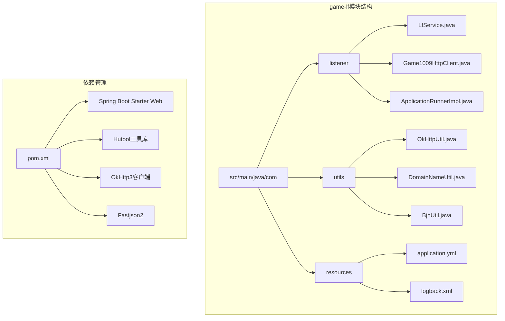
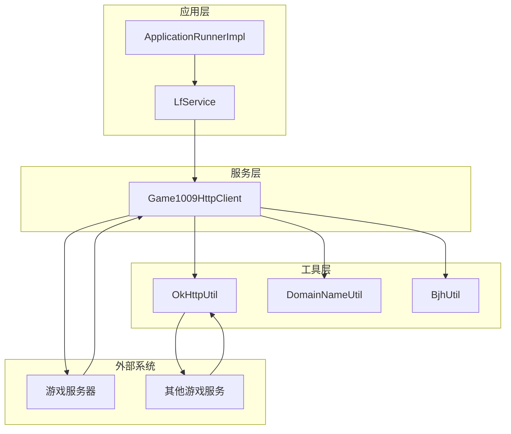
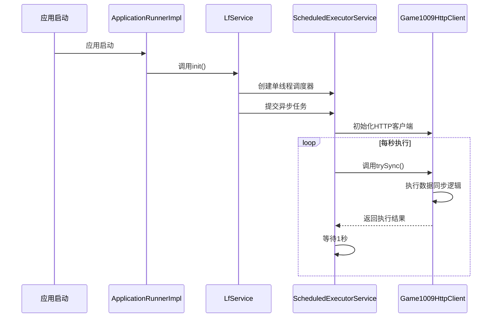
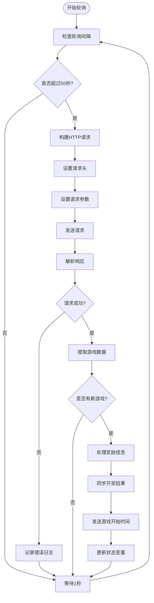
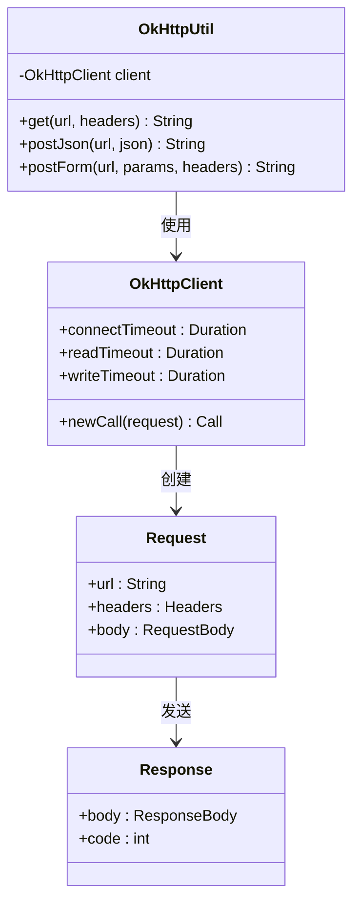
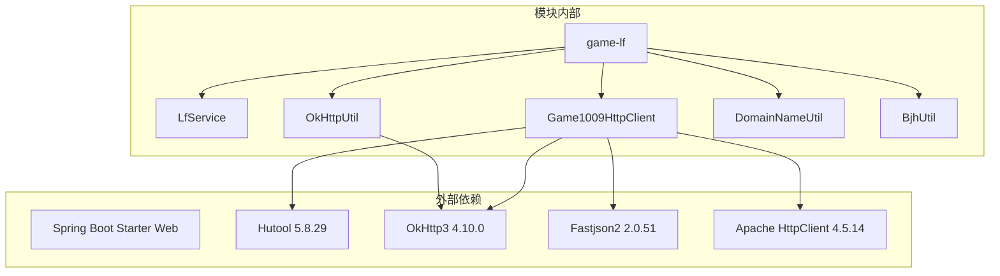

# 灵宠召唤服务模块

<cite>
**本文档引用的文件**
- [LfService.java](file://game-lf/src/main/java/com/listener/LfService.java)
- [Game1009HttpClient.java](file://game-lf/src/main/java/com/listener/Game1009HttpClient.java)
- [OkHttpUtil.java](file://game-lf/src/main/java/com/utils/OkHttpUtil.java)
- [DomainNameUtil.java](file://game-lf/src/main/java/com/utils/DomainNameUtil.java)
- [BjhUtil.java](file://game-lf/src/main/java/com/utils/BjhUtil.java)
- [ApplicationRunnerImpl.java](file://game-lf/src/main/java/com/listener/ApplicationRunnerImpl.java)
- [application.yml](file://game-lf/src/main/resources/application.yml)
- [pom.xml](file://game-lf/pom.xml)
</cite>

## 目录
1. [简介](#简介)
2. [项目结构](#项目结构)
3. [核心组件](#核心组件)
4. [架构概览](#架构概览)
5. [详细组件分析](#详细组件分析)
6. [依赖关系分析](#依赖关系分析)
7. [性能考虑](#性能考虑)
8. [故障排除指南](#故障排除指南)
9. [结论](#结论)

## 简介

灵宠召唤服务模块是一个基于Spring Boot开发的游戏状态监控和数据同步服务。该模块主要负责监控来疯直播平台上的"探岛寻宝"游戏状态，实时获取游戏开奖结果，并将结果同步到其他游戏服务模块。模块采用异步轮询机制，通过HTTP客户端与游戏服务器进行数据交互，实现了完整的数据采集、状态判断和事件处理流程。

## 项目结构

灵宠召唤服务模块采用标准的Spring Boot项目结构，主要包含以下关键目录和文件：



**图表来源**
- [LfService.java](file://game-lf/src/main/java/com/listener/LfService.java#L1-L42)
- [Game1009HttpClient.java](file://game-lf/src/main/java/com/listener/Game1009HttpClient.java#L1-L187)
- [OkHttpUtil.java](file://game-lf/src/main/java/com/utils/OkHttpUtil.java#L1-L74)

**章节来源**
- [LfService.java](file://game-lf/src/main/java/com/listener/LfService.java#L1-L42)
- [Game1009HttpClient.java](file://game-lf/src/main/java/com/listener/Game1009HttpClient.java#L1-L187)
- [OkHttpUtil.java](file://game-lf/src/main/java/com/utils/OkHttpUtil.java#L1-L74)
- [DomainNameUtil.java](file://game-lf/src/main/java/com/utils/DomainNameUtil.java#L1-L10)
- [BjhUtil.java](file://game-lf/src/main/java/com/utils/BjhUtil.java#L1-L10)
- [ApplicationRunnerImpl.java](file://game-lf/src/main/java/com/listener/ApplicationRunnerImpl.java#L1-L30)
- [application.yml](file://game-lf/src/main/resources/application.yml#L1-L1)
- [pom.xml](file://game-lf/pom.xml#L1-L160)

## 核心组件

灵宠召唤服务模块由四个核心组件构成，每个组件都有明确的职责分工：

### LfService - 主控制器
负责整个服务的生命周期管理和调度控制，使用Spring的@PostConstruct注解确保服务在应用启动后自动初始化。

### Game1009HttpClient - 游戏状态监控器
这是模块的核心组件，负责与游戏服务器进行HTTP通信，获取游戏状态信息并处理数据同步逻辑。

### OkHttpUtil - HTTP通信工具类
提供统一的HTTP客户端封装，支持GET、POST(JSON)和POST(Form)三种请求方式，确保网络通信的一致性和可靠性。

### 工具类集合
包括域名管理、数据处理等辅助工具，为服务提供基础功能支持。

**章节来源**
- [LfService.java](file://game-lf/src/main/java/com/listener/LfService.java#L10-L42)
- [Game1009HttpClient.java](file://game-lf/src/main/java/com/listener/Game1009HttpClient.java#L30-L187)
- [OkHttpUtil.java](file://game-lf/src/main/java/com/utils/OkHttpUtil.java#L8-L74)

## 架构概览

灵宠召唤服务模块采用分层架构设计，实现了清晰的关注点分离：



**图表来源**
- [ApplicationRunnerImpl.java](file://game-lf/src/main/java/com/listener/ApplicationRunnerImpl.java#L19-L29)
- [LfService.java](file://game-lf/src/main/java/com/listener/LfService.java#L16-L40)
- [Game1009HttpClient.java](file://game-lf/src/main/java/com/listener/Game1009HttpClient.java#L49-L168)

该架构实现了以下特点：
- **异步处理**：使用ScheduledExecutorService实现非阻塞的轮询机制
- **模块化设计**：各组件职责明确，便于维护和扩展
- **可扩展性**：支持添加新的游戏监控和数据同步功能
- **容错机制**：完善的异常处理和日志记录

## 详细组件分析

### LfService - 异步调度服务

LfService作为服务的入口点，负责启动和管理异步任务：



**图表来源**
- [LfService.java](file://game-lf/src/main/java/com/listener/LfService.java#L16-L40)
- [ApplicationRunnerImpl.java](file://game-lf/src/main/java/com/listener/ApplicationRunnerImpl.java#L21-L27)

**章节来源**
- [LfService.java](file://game-lf/src/main/java/com/listener/LfService.java#L10-L42)
- [ApplicationRunnerImpl.java](file://game-lf/src/main/java/com/listener/ApplicationRunnerImpl.java#L17-L29)

### Game1009HttpClient - HTTP客户端实现

Game1009HttpClient是模块的核心组件，实现了完整的游戏状态监控和数据同步功能：

#### 数据采集流程



**图表来源**
- [Game1009HttpClient.java](file://game-lf/src/main/java/com/listener/Game1009HttpClient.java#L49-L168)

#### 请求构建机制

Game1009HttpClient使用Hutool HTTP工具库构建请求，包含以下关键要素：

- **URL配置**：指向来疯直播游戏服务器的API端点
- **请求头设置**：模拟真实浏览器环境，包含完整的HTTP头部信息
- **参数配置**：包含游戏标识、应用密钥和客户端信息
- **超时设置**：1500毫秒的请求超时时间

#### 响应解析逻辑

系统采用JSON解析方式处理响应数据，主要关注以下字段：
- `ret`数组：包含操作状态信息
- `data`对象：包含游戏状态和奖励信息
- `id`字段：游戏期号标识
- `betStatus`字段：投注状态
- `rewardId`和`rewardName`：奖励怪物信息

#### 状态判断机制

系统实现了多层状态判断逻辑：

1. **时间窗口检查**：每55秒检查一次游戏状态
2. **期号变化检测**：通过比较`lastGameOpenId`和当前期号判断新游戏开始
3. **状态验证**：确保`betStatus`等于3（开放投注状态）
4. **奖励映射**：将游戏奖励ID转换为标准怪物ID

**章节来源**
- [Game1009HttpClient.java](file://game-lf/src/main/java/com/listener/Game1009HttpClient.java#L30-L187)

### OkHttpUtil - HTTP通信工具类

OkHttpUtil提供了统一的HTTP客户端封装，支持多种请求方式：



**图表来源**
- [OkHttpUtil.java](file://game-lf/src/main/java/com/utils/OkHttpUtil.java#L8-L74)

#### 设计原理

OkHttpUtil采用了以下设计原则：

- **静态实例模式**：使用静态初始化确保客户端实例的唯一性
- **超时配置**：所有请求都设置了10秒的连接、读取和写入超时
- **统一接口**：提供简洁的静态方法接口，简化调用复杂度
- **异常处理**：通过抛出IOException确保调用方能够正确处理网络异常

#### 应用场景

在灵宠召唤服务中，OkHttpUtil主要用于：
- 同步开奖结果到其他游戏服务
- 发送游戏开始时间到游戏代理服务
- 处理各种HTTP通信需求

**章节来源**
- [OkHttpUtil.java](file://game-lf/src/main/java/com/utils/OkHttpUtil.java#L8-L74)

### DomainNameUtil - 域名管理工具

DomainNameUtil提供了统一的域名配置管理：

```mermaid
classDiagram
class DomainNameUtil {
+transitUrls : String[]
}
note for DomainNameUtil : "游戏时间转发接口配置"
```

**图表来源**
- [DomainNameUtil.java](file://game-lf/src/main/java/com/utils/DomainNameUtil.java#L3-L9)

该工具类目前只包含一个静态数组，存储了游戏时间转发的接口地址，默认配置为本地8085端口。

**章节来源**
- [DomainNameUtil.java](file://game-lf/src/main/java/com/utils/DomainNameUtil.java#L1-L10)

### BjhUtil - 数据处理工具

BjhUtil是一个简单的数据容器类：

```mermaid
classDiagram
class BjhUtil {
+stringStringMap : Map~String,String~
}
note for BjhUtil : "白金秀账号配置"
```

**图表来源**
- [BjhUtil.java](file://game-lf/src/main/java/com/utils/BjhUtil.java#L6-L9)

该工具类目前只包含一个静态的HashMap，用于存储白金秀相关的账号配置信息。

**章节来源**
- [BjhUtil.java](file://game-lf/src/main/java/com/utils/BjhUtil.java#L1-L10)

## 依赖关系分析

灵宠召唤服务模块的依赖关系体现了清晰的分层架构：



**图表来源**
- [pom.xml](file://game-lf/pom.xml#L26-L96)

### 核心依赖说明

- **Spring Boot Starter Web**：提供Web应用的基础框架支持
- **Hutool**：提供丰富的Java工具类，包括HTTP请求、JSON处理等功能
- **OkHttp3**：高性能的HTTP客户端，用于网络通信
- **Fastjson2**：快速JSON解析库，用于数据序列化和反序列化
- **Apache HttpClient**：提供HTTP协议支持，与Hutool形成互补

**章节来源**
- [pom.xml](file://game-lf/pom.xml#L26-L96)

## 性能考虑

灵宠召唤服务模块在设计时充分考虑了性能优化：

### 异步处理机制
- 使用单线程ScheduledExecutorService避免资源竞争
- 设置守护线程确保应用退出时线程正确终止
- 1秒的轮询间隔平衡了实时性和系统负载

### 内存管理
- 静态OkHttpClient实例减少对象创建开销
- 合理的超时设置防止内存泄漏
- 及时的日志清理避免内存占用过大

### 网络优化
- 统一的HTTP客户端配置确保连接复用
- 合理的超时设置提升用户体验
- 异常情况下的快速失败机制

## 故障排除指南

### 常见问题及解决方案

#### HTTP请求失败
**问题描述**：游戏服务器响应异常或网络连接超时
**解决方法**：
1. 检查游戏服务器地址配置
2. 验证网络连接状态
3. 查看详细的错误日志信息

#### 认证失败
**问题描述**：游戏服务器返回认证错误
**解决方法**：
1. 更新game_remote_token配置
2. 检查Cookie的有效期
3. 验证用户权限

#### 数据解析错误
**问题描述**：JSON响应格式不符合预期
**解决方法**：
1. 检查响应数据结构
2. 更新解析逻辑以适应服务器变更
3. 添加更健壮的错误处理

#### 线程安全问题
**问题描述**：多线程环境下状态变量竞争
**解决方法**：
1. 使用synchronized关键字保护共享状态
2. 考虑使用原子变量替代简单变量
3. 重新设计状态管理模式

**章节来源**
- [Game1009HttpClient.java](file://game-lf/src/main/java/com/listener/Game1009HttpClient.java#L162-L168)
- [LfService.java](file://game-lf/src/main/java/com/listener/LfService.java#L34-L37)

## 结论

灵宠召唤服务模块是一个设计精良的异步监控系统，具有以下显著特点：

### 技术优势
- **模块化设计**：清晰的职责分离和组件边界
- **异步处理**：高效的轮询机制和非阻塞I/O
- **健壮性**：完善的异常处理和日志记录
- **可扩展性**：易于添加新的游戏监控功能

### 架构特色
- 采用分层架构，关注点分离明确
- 使用Spring Boot简化配置和部署
- 集成多种第三方库提升开发效率
- 实现了完整的数据同步和状态管理

### 改进建议
1. **配置管理**：将硬编码的配置迁移到配置文件
2. **监控告警**：添加更完善的监控和告警机制
3. **测试覆盖**：增加单元测试和集成测试
4. **文档完善**：补充详细的API文档和使用说明

该模块为游戏服务系统的数据同步和状态监控提供了可靠的基础设施，为后续的功能扩展奠定了良好的基础。