# 虎牙游戏服务模块

<cite>
**本文档引用的文件**
- [DwydhService.java](file://TigerTeeth/src/main/java/com/dwydh/DwydhService.java)
- [GameYqlyyWsClient.java](file://TigerTeeth/src/main/java/com/yqlyy/GameYqlyyWsClient.java)
- [RestTemplateUtils.java](file://TigerTeeth/src/main/java/com/commom/RestTemplateUtils.java)
- [DomainNameUtil.java](file://TigerTeeth/src/main/java/com/utils/DomainNameUtil.java)
- [GameStartData.java](file://TigerTeeth/src/main/java/com/entity/GameStartData.java)
- [OpenTreasureHunter.java](file://TigerTeeth/src/main/java/com/entity/AccountedNotify/OpenTreasureHunter.java)
- [TreasureHunterInfoItem.java](file://TigerTeeth/src/main/java/com/entity/AccountedNotify/TreasureHunterInfoItem.java)
- [BussesCmd.java](file://TigerTeeth/src/main/java/com/entity/BussesCmd.java)
- [WsCmd.java](file://TigerTeeth/src/main/java/com/entity/WsCmd.java)
- [ApplicationRunnerImpl.java](file://TigerTeeth/src/main/java/com/listener/ApplicationRunnerImpl.java)
- [application.yml](file://TigerTeeth/src/main/resources/application.yml)
- [pom.xml](file://TigerTeeth/pom.xml)
</cite>

## 目录
1. [简介](#简介)
2. [项目结构](#项目结构)
3. [核心组件](#核心组件)
4. [架构概览](#架构概览)
5. [详细组件分析](#详细组件分析)
6. [依赖关系分析](#依赖关系分析)
7. [性能考虑](#性能考虑)
8. [故障排除指南](#故障排除指南)
9. [结论](#结论)

## 简介

虎牙游戏服务模块是一个基于Spring Boot的WebSocket客户端应用，专门用于与虎牙游戏平台进行实时通信。该模块实现了对"一千零一夜"和"宠物马拉松"两款游戏的数据采集和处理功能，通过WebSocket协议接收游戏状态更新，并将关键数据同步到内部系统。

该模块的核心功能包括：
- WebSocket客户端连接管理
- 游戏数据解析和处理
- 实时数据同步到内部系统
- 错误处理和重连机制
- 线程池管理和定时任务调度

## 项目结构

项目采用标准的Spring Boot目录结构，主要分为以下几个模块：

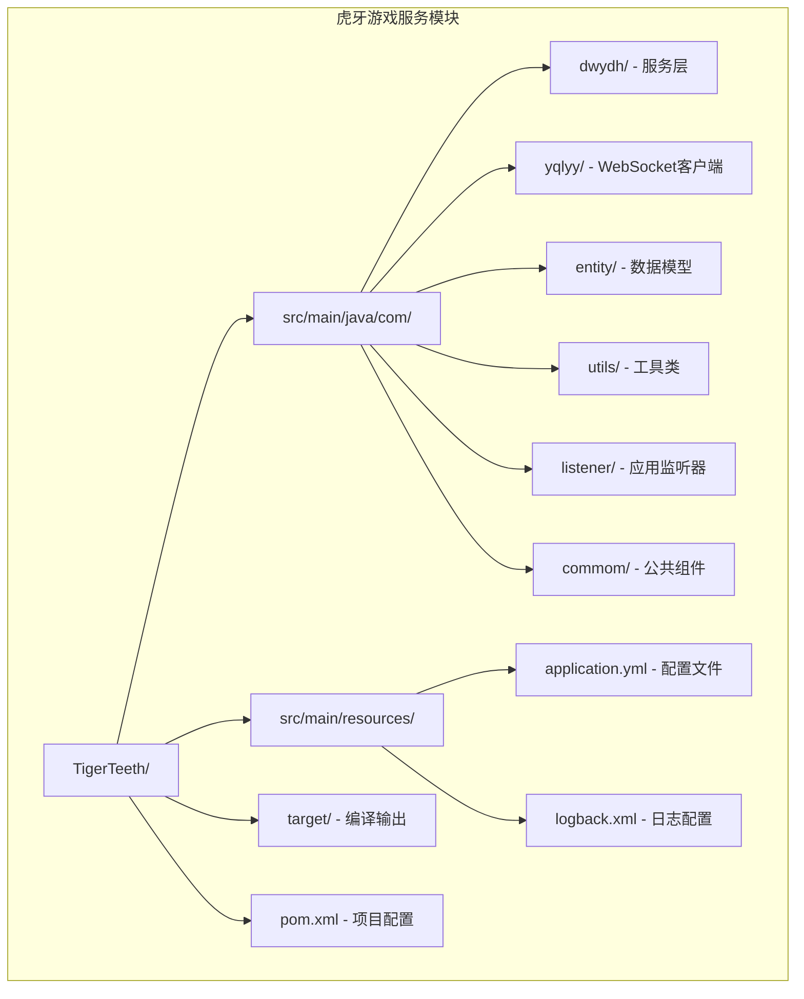

**图表来源**
- [pom.xml](file://TigerTeeth/pom.xml#L1-L160)

**章节来源**
- [pom.xml](file://TigerTeeth/pom.xml#L1-L160)
- [application.yml](file://TigerTeeth/src/main/resources/application.yml#L1-L31)

## 核心组件

### DwydhService - 主服务类

DwydhService是整个模块的核心服务类，负责协调各个组件的工作。它使用Spring的线程池来管理WebSocket客户端的生命周期。

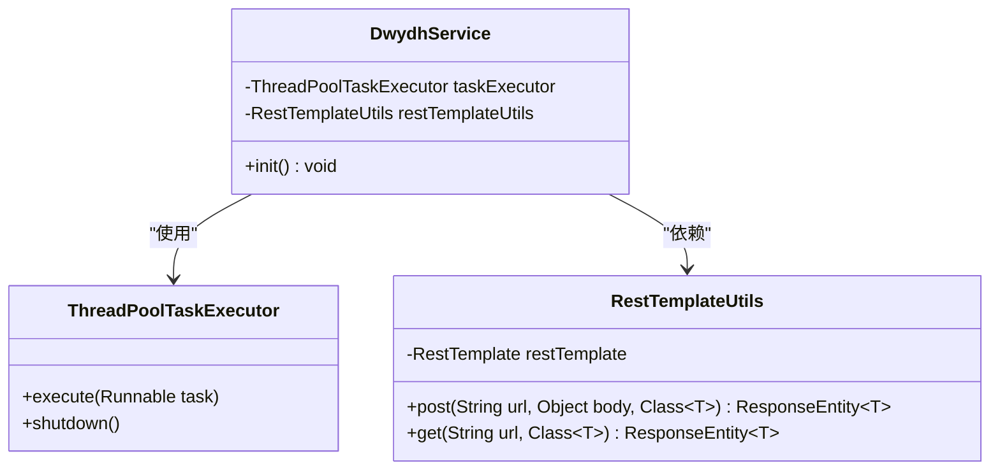

**图表来源**
- [DwydhService.java](file://TigerTeeth/src/main/java/com/dwydh/DwydhService.java#L1-L39)
- [RestTemplateUtils.java](file://TigerTeeth/src/main/java/com/commom/RestTemplateUtils.java#L1-L31)

### GameYqlyyWsClient - WebSocket客户端

GameYqlyyWsClient是模块的核心WebSocket客户端，负责与虎牙游戏服务器建立和维护WebSocket连接。

**章节来源**
- [DwydhService.java](file://TigerTeeth/src/main/java/com/dwydh/DwydhService.java#L1-L39)
- [GameYqlyyWsClient.java](file://TigerTeeth/src/main/java/com/yqlyy/GameYqlyyWsClient.java#L1-L328)

## 架构概览

该模块采用分层架构设计，各层职责明确：

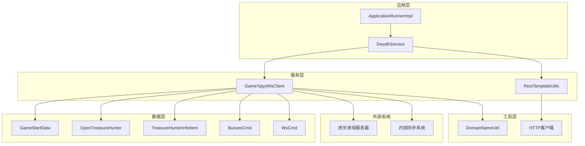

**图表来源**
- [ApplicationRunnerImpl.java](file://TigerTeeth/src/main/java/com/listener/ApplicationRunnerImpl.java#L1-L34)
- [DwydhService.java](file://TigerTeeth/src/main/java/com/dwydh/DwydhService.java#L1-L39)
- [GameYqlyyWsClient.java](file://TigerTeeth/src/main/java/com/yqlyy/GameYqlyyWsClient.java#L1-L328)

## 详细组件分析

### WebSocket客户端实现机制

#### 连接建立流程

WebSocket客户端的连接建立采用了完整的生命周期管理：

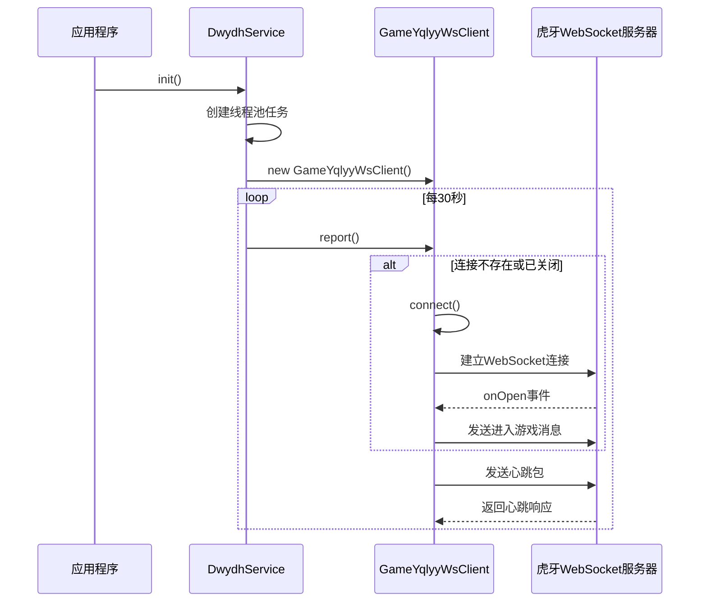

**图表来源**
- [DwydhService.java](file://TigerTeeth/src/main/java/com/dwydh/DwydhService.java#L21-L36)
- [GameYqlyyWsClient.java](file://TigerTeeth/src/main/java/com/yqlyy/GameYqlyyWsClient.java#L250-L272)

#### 消息处理机制

客户端实现了多种消息类型的处理：

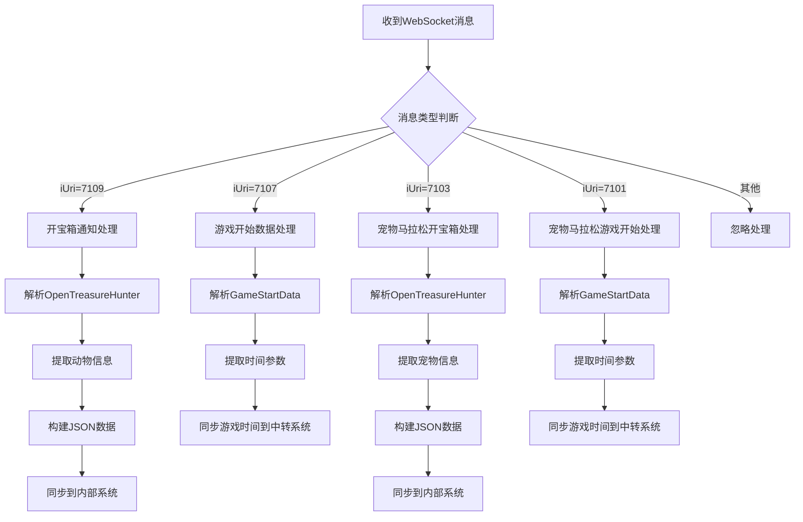

**图表来源**
- [GameYqlyyWsClient.java](file://TigerTeeth/src/main/java/com/yqlyy/GameYqlyyWsClient.java#L51-L218)

#### 断线重连策略

客户端实现了智能的断线检测和自动重连机制：

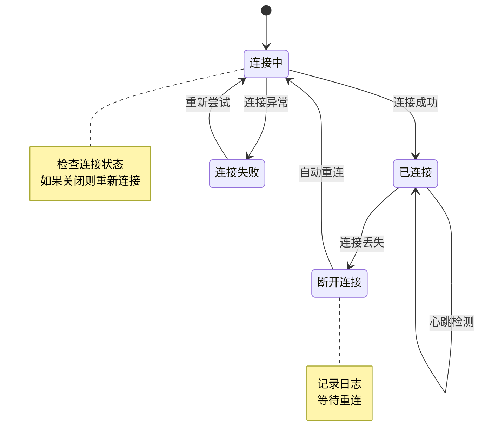

**图表来源**
- [GameYqlyyWsClient.java](file://TigerTeeth/src/main/java/com/yqlyy/GameYqlyyWsClient.java#L274-L290)

**章节来源**
- [GameYqlyyWsClient.java](file://TigerTeeth/src/main/java/com/yqlyy/GameYqlyyWsClient.java#L1-L328)

### 定时报告逻辑

DwydhService实现了基于线程池的定时报告机制：

```mermaid
flowchart TD
A[应用启动] --> B[ApplicationRunnerImpl.run()]
B --> C[DwydhService.init()]
C --> D[创建线程池任务]
D --> E[循环执行report方法]
E --> F[检查WebSocket连接]
F --> |连接正常| G[发送心跳包]
F --> |连接异常| H[重新建立连接]
G --> I[等待30秒]
H --> I
I --> E
```

**图表来源**
- [DwydhService.java](file://TigerTeeth/src/main/java/com/dwydh/DwydhService.java#L21-L36)
- [ApplicationRunnerImpl.java](file://TigerTeeth/src/main/java/com/listener/ApplicationRunnerImpl.java#L25-L31)

**章节来源**
- [DwydhService.java](file://TigerTeeth/src/main/java/com/dwydh/DwydhService.java#L1-L39)
- [ApplicationRunnerImpl.java](file://TigerTeeth/src/main/java/com/listener/ApplicationRunnerImpl.java#L1-L34)

### 线程池管理策略

模块使用Spring的ThreadPoolTaskExecutor来管理并发任务：

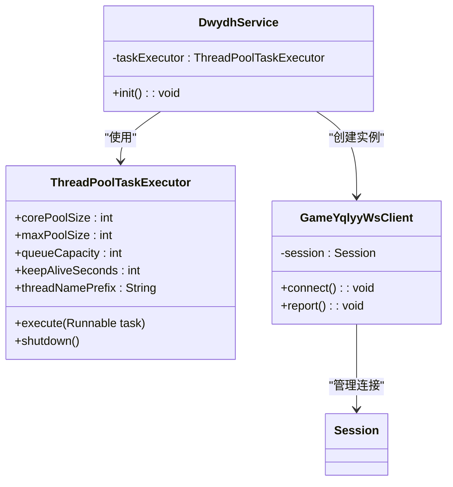

**图表来源**
- [DwydhService.java](file://TigerTeeth/src/main/java/com/dwydh/DwydhService.java#L16-L17)

**章节来源**
- [DwydhService.java](file://TigerTeeth/src/main/java/com/dwydh/DwydhService.java#L1-L39)

### RestTemplateUtils - HTTP请求处理

RestTemplateUtils封装了HTTP客户端操作，提供了简洁的接口：

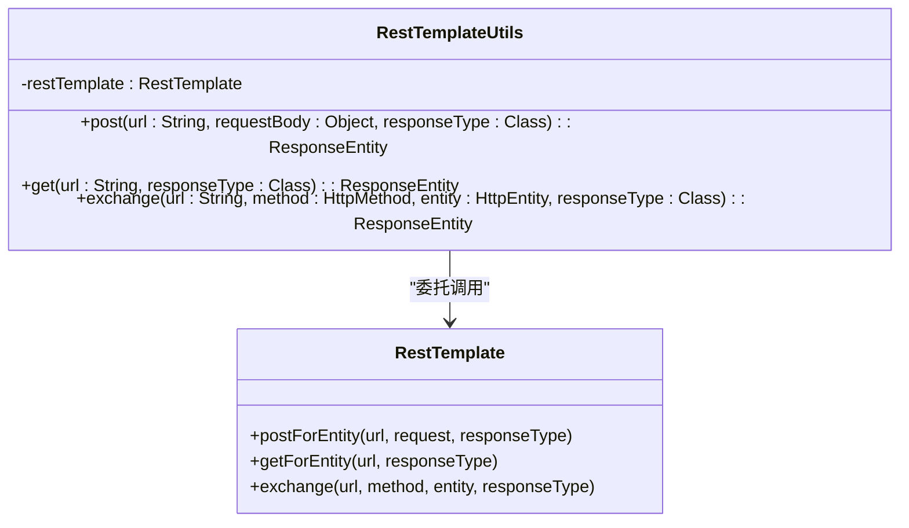

**图表来源**
- [RestTemplateUtils.java](file://TigerTeeth/src/main/java/com/commom/RestTemplateUtils.java#L1-L31)

**章节来源**
- [RestTemplateUtils.java](file://TigerTeeth/src/main/java/com/commom/RestTemplateUtils.java#L1-L31)

### DomainNameUtil - 域名解析

DomainNameUtil提供了静态的域名配置管理：

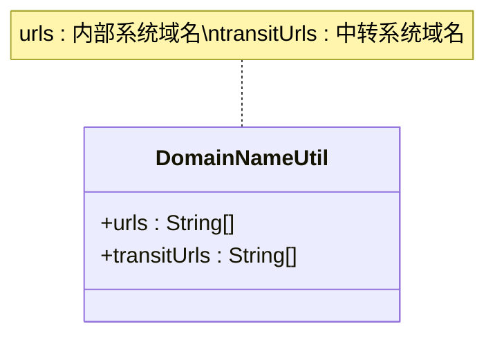

**图表来源**
- [DomainNameUtil.java](file://TigerTeeth/src/main/java/com/utils/DomainNameUtil.java#L1-L16)

**章节来源**
- [DomainNameUtil.java](file://TigerTeeth/src/main/java/com/utils/DomainNameUtil.java#L1-L16)

### 实体模型设计

#### GameStartData - 游戏开始数据

GameStartData模型用于存储游戏开始时的关键时间参数：

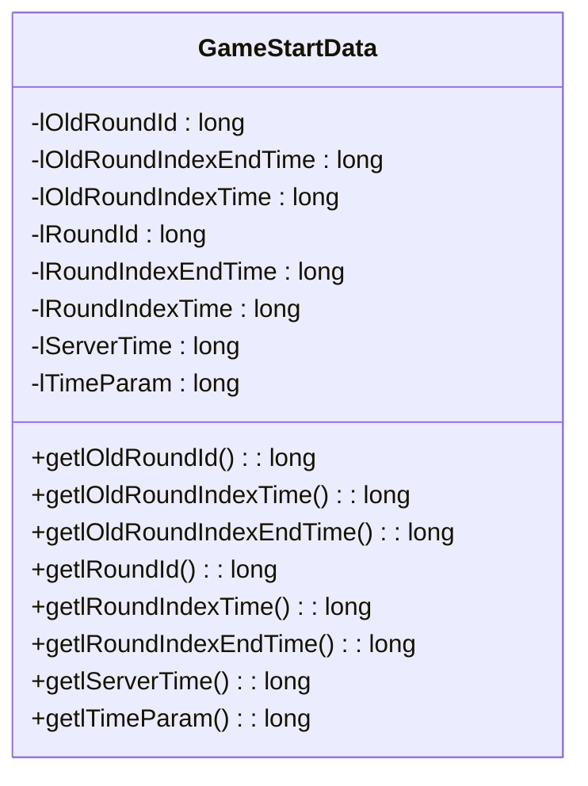

**图表来源**
- [GameStartData.java](file://TigerTeeth/src/main/java/com/entity/GameStartData.java#L1-L79)

#### OpenTreasureHunter - 开宝箱通知

OpenTreasureHunter模型用于处理开宝箱事件：

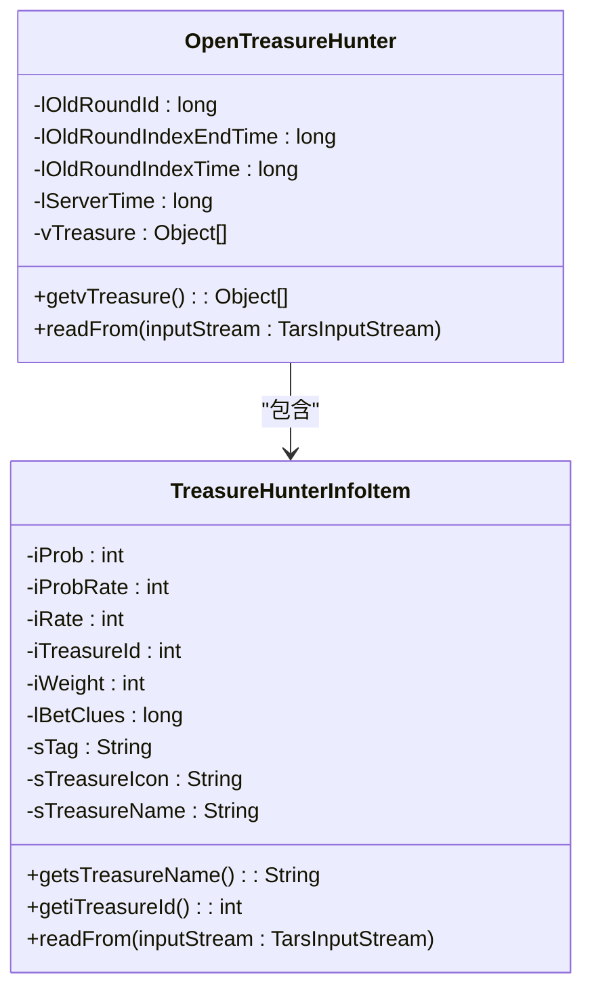

**图表来源**
- [OpenTreasureHunter.java](file://TigerTeeth/src/main/java/com/entity/AccountedNotify/OpenTreasureHunter.java#L1-L83)
- [TreasureHunterInfoItem.java](file://TigerTeeth/src/main/java/com/entity/AccountedNotify/TreasureHunterInfoItem.java#L1-L124)

**章节来源**
- [GameStartData.java](file://TigerTeeth/src/main/java/com/entity/GameStartData.java#L1-L79)
- [OpenTreasureHunter.java](file://TigerTeeth/src/main/java/com/entity/AccountedNotify/OpenTreasureHunter.java#L1-L83)
- [TreasureHunterInfoItem.java](file://TigerTeeth/src/main/java/com/entity/AccountedNotify/TreasureHunterInfoItem.java#L1-L124)

## 依赖关系分析

### 外部依赖

模块的主要外部依赖包括：

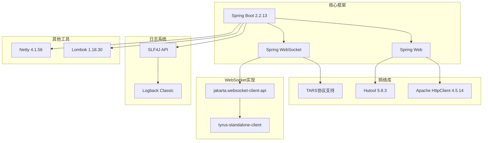

**图表来源**
- [pom.xml](file://TigerTeeth/pom.xml#L26-L111)

### 内部模块依赖

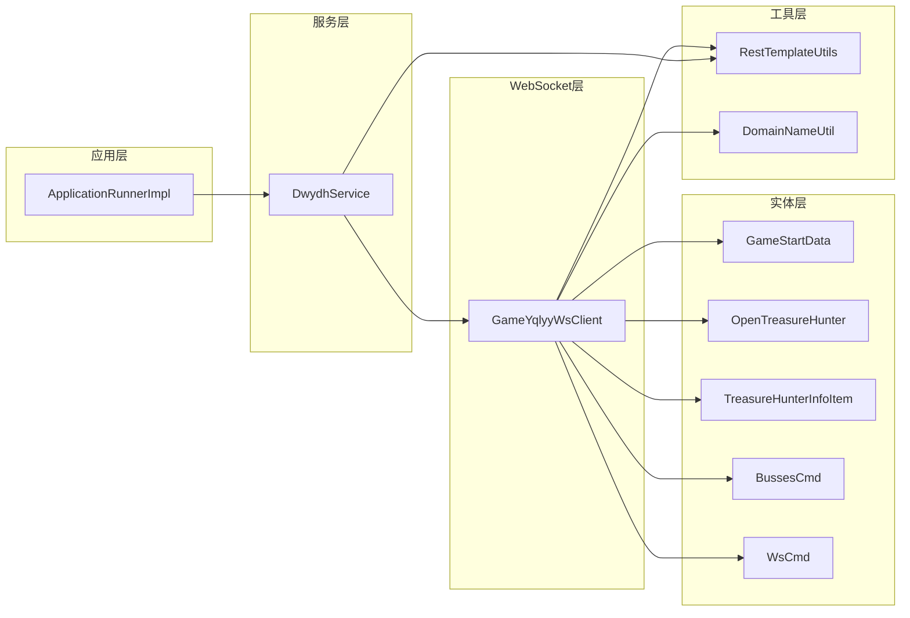

**图表来源**
- [ApplicationRunnerImpl.java](file://TigerTeeth/src/main/java/com/listener/ApplicationRunnerImpl.java#L1-L34)
- [DwydhService.java](file://TigerTeeth/src/main/java/com/dwydh/DwydhService.java#L1-L39)
- [GameYqlyyWsClient.java](file://TigerTeeth/src/main/java/com/yqlyy/GameYqlyyWsClient.java#L1-L328)

**章节来源**
- [pom.xml](file://TigerTeeth/pom.xml#L1-L160)

## 性能考虑

### WebSocket连接优化

1. **连接池配置**：WebSocket容器设置了合理的缓冲区大小（65536字节）和超时时间
2. **异步发送**：启用了异步发送模式以提高性能
3. **心跳机制**：每30秒发送一次心跳包，确保连接活跃

### 线程池配置

1. **核心线程数**：根据业务需求合理设置
2. **队列容量**：避免过多的任务堆积
3. **超时处理**：及时清理空闲线程

### HTTP请求优化

1. **连接池复用**：使用Apache HttpClient的连接池机制
2. **超时配置**：合理设置连接超时和读取超时
3. **重试机制**：在网络异常时自动重试

## 故障排除指南

### WebSocket连接问题

**常见问题及解决方案**：

1. **连接超时**
   - 检查网络连接和防火墙设置
   - 验证WebSocket URL的有效性
   - 查看日志中的具体错误信息

2. **消息解析失败**
   - 确认TARS协议数据格式
   - 检查字段索引映射关系
   - 验证数据完整性

3. **断线重连失败**
   - 检查重连间隔设置
   - 验证域名解析配置
   - 查看异常堆栈信息

### HTTP请求问题

**常见问题及解决方案**：

1. **请求超时**
   - 调整socketTimeout参数
   - 检查目标服务器响应时间
   - 实施指数退避重试策略

2. **连接池耗尽**
   - 增加最大连接数配置
   - 优化连接复用策略
   - 监控连接池使用情况

3. **序列化异常**
   - 检查JSON数据格式
   - 验证字段映射关系
   - 确认编码格式一致性

**章节来源**
- [GameYqlyyWsClient.java](file://TigerTeeth/src/main/java/com/yqlyy/GameYqlyyWsClient.java#L240-L248)
- [RestTemplateUtils.java](file://TigerTeeth/src/main/java/com/commom/RestTemplateUtils.java#L19-L29)

## 结论

虎牙游戏服务模块是一个设计良好的WebSocket客户端应用，具有以下特点：

1. **模块化设计**：清晰的分层架构和职责分离
2. **健壮性**：完善的错误处理和重连机制
3. **可扩展性**：灵活的配置和插件化设计
4. **性能优化**：合理的线程池和连接池配置

该模块成功实现了与虎牙游戏平台的实时数据交互，为后续的功能扩展奠定了坚实的基础。建议在未来版本中进一步完善监控和告警机制，以及增加更多的配置选项来适应不同的部署环境。