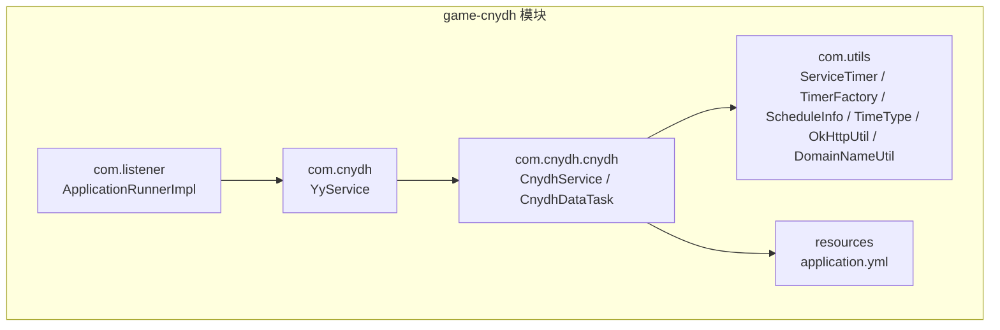
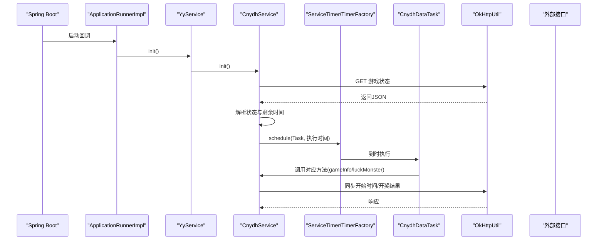
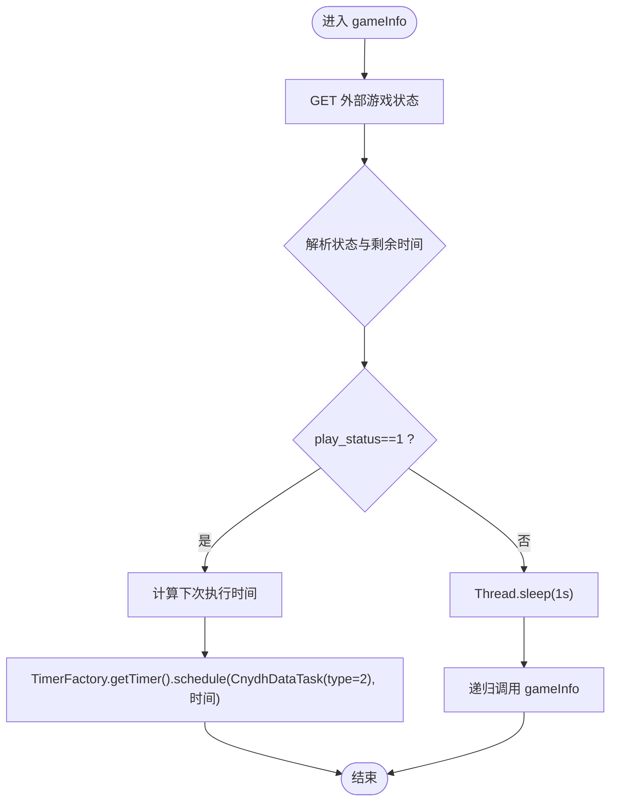
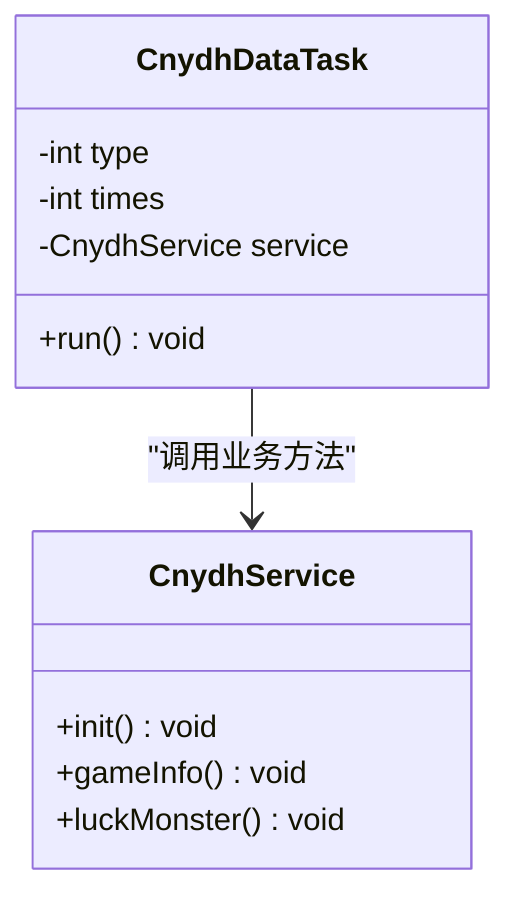
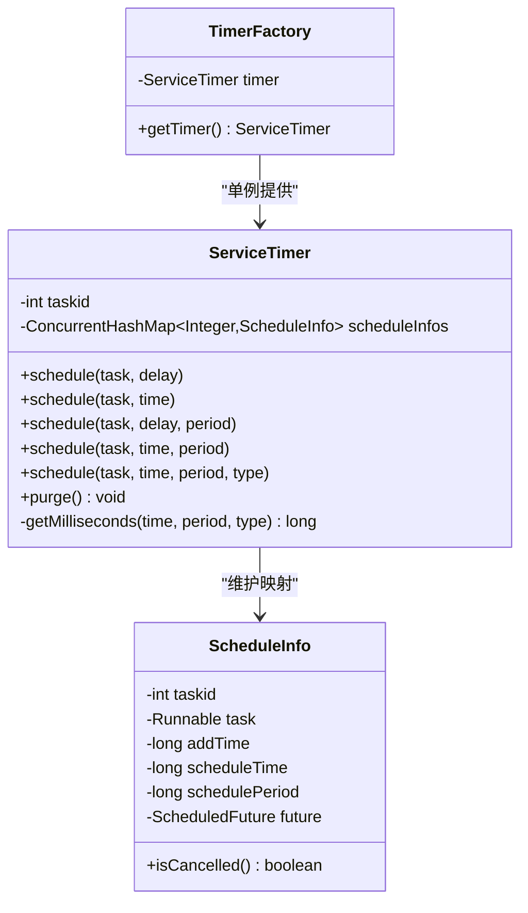
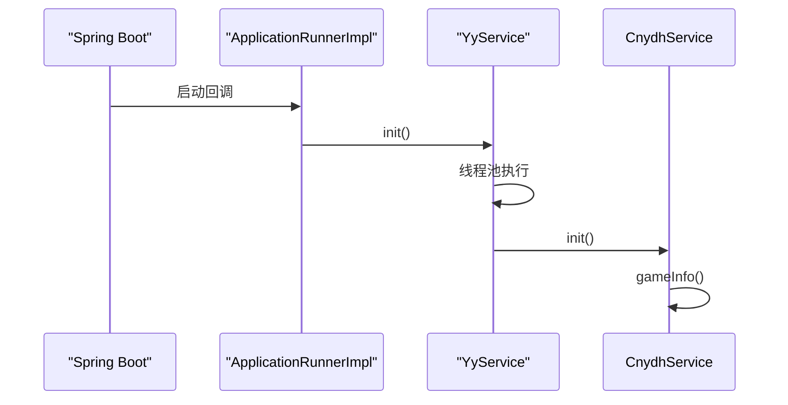
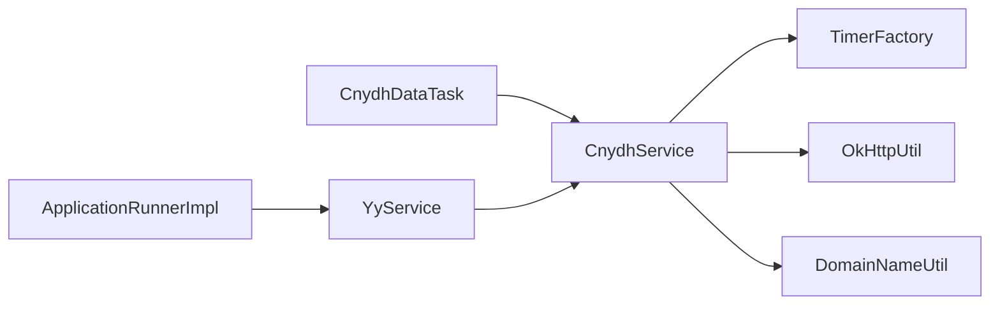

# 超能运动会服务模块

<cite>
**本文引用的文件**
- [CnydhService.java](file://game-cnydh/src/main/java/com/cnydh/cnydh/CnydhService.java)
- [CnydhDataTask.java](file://game-cnydh/src/main/java/com/cnydh/cnydh/CnydhDataTask.java)
- [YyService.java](file://game-cnydh/src/main/java/com/cnydh/YyService.java)
- [ServiceTimer.java](file://game-cnydh/src/main/java/com/utils/ServiceTimer.java)
- [TimerFactory.java](file://game-cnydh/src/main/java/com/utils/TimerFactory.java)
- [ScheduleInfo.java](file://game-cnydh/src/main/java/com/utils/ScheduleInfo.java)
- [DomainNameUtil.java](file://game-cnydh/src/main/java/com/utils/DomainNameUtil.java)
- [OkHttpUtil.java](file://game-cnydh/src/main/java/com/utils/OkHttpUtil.java)
- [TimeType.java](file://game-cnydh/src/main/java/com/utils/TimeType.java)
- [ApplicationRunnerImpl.java](file://game-cnydh/src/main/java/com/listener/ApplicationRunnerImpl.java)
- [application.yml](file://game-cnydh/src/main/resources/application.yml)
</cite>

## 目录
1. [简介](#简介)
2. [项目结构](#项目结构)
3. [核心组件](#核心组件)
4. [架构总览](#架构总览)
5. [详细组件分析](#详细组件分析)
6. [依赖关系分析](#依赖关系分析)
7. [性能考虑](#性能考虑)
8. [故障排查指南](#故障排查指南)
9. [结论](#结论)
10. [附录](#附录)

## 简介
本文件面向“超能运动会”服务模块的技术文档，聚焦以下目标：
- 深入解析 CnydhService 的核心业务与定时任务调度机制
- 全面阐述 CnydhDataTask 的任务执行计划、数据采集与处理流程
- 解析 ServiceTimer 与 TimerFactory 的设计模式及 ScheduleInfo 在任务配置中的作用
- 提供定时任务生命周期管理、异常处理与性能监控方案
- 展示 YyService 在平台集成中的应用与数据流转
- 总结模块可配置性、扩展机制与最佳实践，并给出故障排查与性能优化建议

## 项目结构
该模块位于 game-cnydh 子工程中，采用按功能域分层组织：
- com.cnydh.cnydh：业务服务与数据任务
- com.cnydh：平台集成服务（YyService）
- com.utils：通用工具与定时框架（ServiceTimer、TimerFactory、ScheduleInfo、TimeType、OkHttpUtil、DomainNameUtil）
- com.listener：应用启动监听器（ApplicationRunnerImpl）
- resources：应用配置（application.yml）

图表来源
- [CnydhService.java](file://game-cnydh/src/main/java/com/cnydh/cnydh/CnydhService.java#L1-L143)
- [YyService.java](file://game-cnydh/src/main/java/com/cnydh/YyService.java#L1-L34)
- [ServiceTimer.java](file://game-cnydh/src/main/java/com/utils/ServiceTimer.java#L1-L164)
- [TimerFactory.java](file://game-cnydh/src/main/java/com/utils/TimerFactory.java#L1-L11)
- [ScheduleInfo.java](file://game-cnydh/src/main/java/com/utils/ScheduleInfo.java#L1-L66)
- [OkHttpUtil.java](file://game-cnydh/src/main/java/com/utils/OkHttpUtil.java#L1-L74)
- [DomainNameUtil.java](file://game-cnydh/src/main/java/com/utils/DomainNameUtil.java#L1-L12)
- [ApplicationRunnerImpl.java](file://game-cnydh/src/main/java/com/listener/ApplicationRunnerImpl.java#L1-L31)
- [application.yml](file://game-cnydh/src/main/resources/application.yml#L1-L1)

章节来源
- [application.yml](file://game-cnydh/src/main/resources/application.yml#L1-L1)

## 核心组件
- CnydhService：负责从外部接口拉取游戏状态，计算下一次执行时间，通过定时器调度 CnydhDataTask 执行不同阶段的任务；同时负责向平台同步游戏开始时间和开奖结果。
- CnydhDataTask：轻量的 Runnable 实现，根据类型（1=轮询游戏信息；2=开奖同步）调用 CnydhService 对应方法。
- YyService：平台入口服务，使用线程池异步初始化 CnydhService，避免阻塞应用启动。
- ServiceTimer：基于 ScheduledThreadPoolExecutor 的增强定时器，支持多种调度方式与周期任务，并维护 ScheduleInfo 映射用于生命周期跟踪与清理。
- TimerFactory：单例工厂，提供全局统一的 ServiceTimer 实例。
- ScheduleInfo：封装任务元信息（任务ID、添加时间、计划执行时间、周期、Future），并提供取消/完成判断。
- OkHttpUtil：HTTP 客户端封装，提供 GET/POST(JSON/Form) 方法。
- DomainNameUtil：域名与URL常量集中管理。
- TimeType：时间单位枚举（毫秒、秒、分钟、小时、天、周、月、年）。
- ApplicationRunnerImpl：应用启动监听器，触发 YyService 初始化。

章节来源
- [CnydhService.java](file://game-cnydh/src/main/java/com/cnydh/cnydh/CnydhService.java#L1-L143)
- [CnydhDataTask.java](file://game-cnydh/src/main/java/com/cnydh/cnydh/CnydhDataTask.java#L1-L36)
- [YyService.java](file://game-cnydh/src/main/java/com/cnydh/YyService.java#L1-L34)
- [ServiceTimer.java](file://game-cnydh/src/main/java/com/utils/ServiceTimer.java#L1-L164)
- [TimerFactory.java](file://game-cnydh/src/main/java/com/utils/TimerFactory.java#L1-L11)
- [ScheduleInfo.java](file://game-cnydh/src/main/java/com/utils/ScheduleInfo.java#L1-L66)
- [OkHttpUtil.java](file://game-cnydh/src/main/java/com/utils/OkHttpUtil.java#L1-L74)
- [DomainNameUtil.java](file://game-cnydh/src/main/java/com/utils/DomainNameUtil.java#L1-L12)
- [TimeType.java](file://game-cnydh/src/main/java/com/utils/TimeType.java#L1-L24)
- [ApplicationRunnerImpl.java](file://game-cnydh/src/main/java/com/listener/ApplicationRunnerImpl.java#L1-L31)

## 架构总览
整体架构围绕“平台入口 → 业务服务 → 定时调度 → 数据采集/同步”的链路展开。YyService 通过线程池异步初始化 CnydhService；CnydhService 通过 OkHttpUtil 访问外部接口，结合 ServiceTimer/TimerFactory 将 CnydhDataTask 排程到指定时间点执行。

图表来源
- [ApplicationRunnerImpl.java](file://game-cnydh/src/main/java/com/listener/ApplicationRunnerImpl.java#L1-L31)
- [YyService.java](file://game-cnydh/src/main/java/com/cnydh/YyService.java#L1-L34)
- [CnydhService.java](file://game-cnydh/src/main/java/com/cnydh/cnydh/CnydhService.java#L1-L143)
- [ServiceTimer.java](file://game-cnydh/src/main/java/com/utils/ServiceTimer.java#L1-L164)
- [TimerFactory.java](file://game-cnydh/src/main/java/com/utils/TimerFactory.java#L1-L11)
- [CnydhDataTask.java](file://game-cnydh/src/main/java/com/cnydh/cnydh/CnydhDataTask.java#L1-L36)
- [OkHttpUtil.java](file://game-cnydh/src/main/java/com/utils/OkHttpUtil.java#L1-L74)

## 详细组件分析

### CnydhService：业务与定时调度核心
- 初始化与入口
  - init：调用 gameInfo 并记录初始化日志。
- 游戏信息与定时调度
  - gameInfo：访问外部接口获取游戏状态；当处于可开始状态时，计算下一次执行时间并使用 TimerFactory.getTimer().schedule(...) 排定 CnydhDataTask(type=2) 执行。
  - 若未满足条件，则短暂休眠后重试，形成自适应轮询。
- 开奖同步与后续调度
  - luckMonster：删除已设置的游戏开始时间；轮询获取开奖结果，成功后构造参数并同步至平台；随后排定下一次 CnydhDataTask(type=1) 执行。
- 异常处理
  - 对网络异常与未知异常分别捕获并记录日志；对 RestClientException 使用警告级别日志，其他异常使用错误级别日志。
- 数据采集与处理
  - 使用 OkHttpUtil 进行 HTTP 请求；使用 JSON 工具解析返回体；通过 DomainNameUtil 管理外部接口 URL 与中转 URL。

图表来源
- [CnydhService.java](file://game-cnydh/src/main/java/com/cnydh/cnydh/CnydhService.java#L42-L82)
- [TimerFactory.java](file://game-cnydh/src/main/java/com/utils/TimerFactory.java#L1-L11)
- [ServiceTimer.java](file://game-cnydh/src/main/java/com/utils/ServiceTimer.java#L1-L164)

章节来源
- [CnydhService.java](file://game-cnydh/src/main/java/com/cnydh/cnydh/CnydhService.java#L36-L140)
- [OkHttpUtil.java](file://game-cnydh/src/main/java/com/utils/OkHttpUtil.java#L1-L74)
- [DomainNameUtil.java](file://game-cnydh/src/main/java/com/utils/DomainNameUtil.java#L1-L12)

### CnydhDataTask：任务执行计划与处理流程
- 角色定位
  - 作为 Runnable，依据 type 字段区分执行分支：
    - type=1：调用 CnydhService.gameInfo，用于周期性轮询游戏状态。
    - type=2：调用 CnydhService.luckMonster，用于开奖同步与后续调度。
- 错误处理
  - 捕获并记录异常，避免中断定时线程池。
- 生命周期
  - 由 ServiceTimer 基于计划时间调度执行，执行完成后等待下一次调度或被取消。

图表来源
- [CnydhDataTask.java](file://game-cnydh/src/main/java/com/cnydh/cnydh/CnydhDataTask.java#L1-L36)
- [CnydhService.java](file://game-cnydh/src/main/java/com/cnydh/cnydh/CnydhService.java#L1-L143)

章节来源
- [CnydhDataTask.java](file://game-cnydh/src/main/java/com/cnydh/cnydh/CnydhDataTask.java#L11-L36)

### ServiceTimer 与 TimerFactory：设计模式与任务配置
- 设计模式
  - 单例工厂（TimerFactory）提供全局唯一定时器实例，确保任务调度一致性与资源复用。
  - 继承 ScheduledThreadPoolExecutor，扩展了多重重载的 schedule 方法，支持按毫秒、秒、分钟、小时、天、周、月、年等单位配置周期。
- 任务配置与追踪
  - ScheduleInfo 记录任务ID、添加时间、计划执行时间、周期与 Future，便于生命周期管理与自动清理。
  - purge 定期清理已取消或已完成的任务，降低内存占用。
- 调度能力
  - 支持一次性任务与固定速率周期任务；支持按绝对时间或相对延迟调度；支持带时间单位的周期配置。

图表来源
- [TimerFactory.java](file://game-cnydh/src/main/java/com/utils/TimerFactory.java#L1-L11)
- [ServiceTimer.java](file://game-cnydh/src/main/java/com/utils/ServiceTimer.java#L1-L164)
- [ScheduleInfo.java](file://game-cnydh/src/main/java/com/utils/ScheduleInfo.java#L1-L66)
- [TimeType.java](file://game-cnydh/src/main/java/com/utils/TimeType.java#L1-L24)

章节来源
- [TimerFactory.java](file://game-cnydh/src/main/java/com/utils/TimerFactory.java#L1-L11)
- [ServiceTimer.java](file://game-cnydh/src/main/java/com/utils/ServiceTimer.java#L21-L136)
- [ScheduleInfo.java](file://game-cnydh/src/main/java/com/utils/ScheduleInfo.java#L14-L65)
- [TimeType.java](file://game-cnydh/src/main/java/com/utils/TimeType.java#L1-L24)

### YyService：平台集成与数据流转
- 角色定位
  - 作为平台入口服务，注入线程池与 CnydhService，通过线程池异步执行初始化，避免阻塞应用启动。
- 数据流转
  - ApplicationRunnerImpl 在应用启动时调用 YyService.init，后者在独立线程中调用 CnydhService.init，从而驱动整个定时任务链路。

图表来源
- [ApplicationRunnerImpl.java](file://game-cnydh/src/main/java/com/listener/ApplicationRunnerImpl.java#L1-L31)
- [YyService.java](file://game-cnydh/src/main/java/com/cnydh/YyService.java#L1-L34)
- [CnydhService.java](file://game-cnydh/src/main/java/com/cnydh/cnydh/CnydhService.java#L36-L40)

章节来源
- [YyService.java](file://game-cnydh/src/main/java/com/cnydh/YyService.java#L14-L29)
- [ApplicationRunnerImpl.java](file://game-cnydh/src/main/java/com/listener/ApplicationRunnerImpl.java#L22-L28)

### ScheduleInfo：任务配置与生命周期管理
- 关键字段
  - taskid：任务唯一标识
  - addTime/scheduleTime：添加时间与计划执行时间
  - schedulePeriod：周期（毫秒）
  - future：底层 ScheduledFuture
- 生命周期判定
  - isCancelled：基于 future 的取消/完成状态判断，配合 purge 自动清理。
- 价值
  - 为 ServiceTimer 提供任务元信息与清理依据，保障定时器稳定运行。

章节来源
- [ScheduleInfo.java](file://game-cnydh/src/main/java/com/utils/ScheduleInfo.java#L14-L65)
- [ServiceTimer.java](file://game-cnydh/src/main/java/com/utils/ServiceTimer.java#L101-L113)

### HTTP 与配置：OkHttpUtil 与 DomainNameUtil
- OkHttpUtil
  - 提供 GET/POST(JSON)/POST(Form) 三类方法，内置连接、读写超时配置，适用于高并发场景下的稳定通信。
- DomainNameUtil
  - 集中管理中转 URL 与外部接口 URL，便于配置变更与扩展。

章节来源
- [OkHttpUtil.java](file://game-cnydh/src/main/java/com/utils/OkHttpUtil.java#L10-L74)
- [DomainNameUtil.java](file://game-cnydh/src/main/java/com/utils/DomainNameUtil.java#L5-L11)

## 依赖关系分析
- 组件耦合
  - CnydhService 依赖 TimerFactory/ServiceTimer 进行调度，依赖 OkHttpUtil 进行数据采集，依赖 DomainNameUtil 管理 URL。
  - CnydhDataTask 仅持有 CnydhService 引用，职责单一，耦合度低。
  - YyService 通过线程池解耦初始化过程，避免阻塞启动。
- 外部依赖
  - OkHttp 客户端、Spring 线程池、Hutool JSON 工具等。

图表来源
- [CnydhService.java](file://game-cnydh/src/main/java/com/cnydh/cnydh/CnydhService.java#L1-L143)
- [CnydhDataTask.java](file://game-cnydh/src/main/java/com/cnydh/cnydh/CnydhDataTask.java#L1-L36)
- [YyService.java](file://game-cnydh/src/main/java/com/cnydh/YyService.java#L1-L34)
- [TimerFactory.java](file://game-cnydh/src/main/java/com/utils/TimerFactory.java#L1-L11)
- [OkHttpUtil.java](file://game-cnydh/src/main/java/com/utils/OkHttpUtil.java#L1-L74)
- [DomainNameUtil.java](file://game-cnydh/src/main/java/com/utils/DomainNameUtil.java#L1-L12)
- [ApplicationRunnerImpl.java](file://game-cnydh/src/main/java/com/listener/ApplicationRunnerImpl.java#L1-L31)

## 性能考虑
- 线程池与调度
  - ServiceTimer 默认核心池大小为 12，适合中等并发的定时任务；如需更高吞吐，可在部署侧调整 JVM 线程数或使用更细粒度的线程池隔离。
- 超时与重试
  - OkHttpUtil 设置统一的连接/读写超时，避免长时间阻塞；CnydhService 中对异常进行分级处理，减少抖动传播。
- 周期与清理
  - purge 定期清理取消/完成任务，防止映射无限增长；建议结合监控观察任务数量趋势。
- I/O 与序列化
  - JSON 解析与 HTTP 调用为瓶颈环节，建议在外部接口侧评估限流与缓存策略，必要时引入本地缓存与降级策略。

## 故障排查指南
- 启动阶段
  - 若应用启动卡住，检查 YyService 是否在独立线程中执行；确认线程池配置与队列长度。
- 定时任务不执行
  - 检查 ServiceTimer 的 schedule 调用是否成功返回 Future；核对 ScheduleInfo 中的计划时间与周期。
  - 查看 purge 日志，确认是否存在大量已取消任务导致内存压力。
- 外部接口异常
  - 关注 OkHttpUtil 的超时与异常日志；核对 DomainNameUtil 中的 URL 是否正确。
  - 对 RestClientException 与未知异常分别处理，确保不影响主流程。
- 数据同步失败
  - 检查 CnydhService 中 luckMonster 的轮询次数与间隔；确认返回码与响应体格式。

章节来源
- [YyService.java](file://game-cnydh/src/main/java/com/cnydh/YyService.java#L20-L29)
- [ServiceTimer.java](file://game-cnydh/src/main/java/com/utils/ServiceTimer.java#L101-L113)
- [CnydhService.java](file://game-cnydh/src/main/java/com/cnydh/cnydh/CnydhService.java#L56-L65)
- [OkHttpUtil.java](file://game-cnydh/src/main/java/com/utils/OkHttpUtil.java#L20-L51)

## 结论
本模块以清晰的职责划分与稳定的定时调度机制实现了“超能运动会”的业务闭环：YyService 负责平台集成与异步初始化，CnydhService 负责业务逻辑与外部接口交互，CnydhDataTask 负责具体任务执行，ServiceTimer/TimerFactory 提供统一的调度基础设施，ScheduleInfo 提供生命周期管理。通过合理的异常处理与性能优化建议，模块具备良好的可运维性与扩展性。

## 附录
- 可配置项
  - application.yml：端口等基础配置
  - DomainNameUtil：外部接口与中转 URL
  - OkHttpUtil：超时参数
  - ServiceTimer：线程池大小（构造函数）
- 扩展建议
  - 引入任务优先级与隔离策略
  - 增加任务执行指标上报与告警
  - 对热点接口增加本地缓存与降级开关