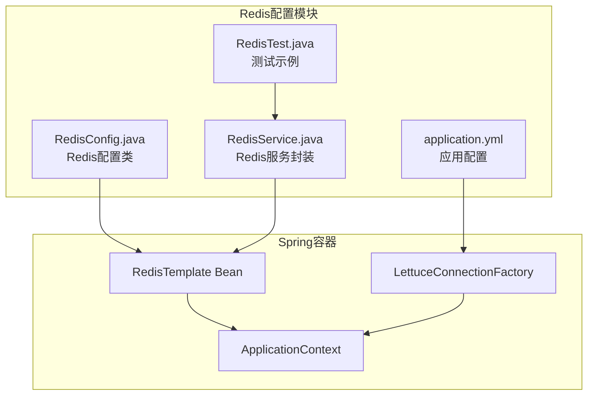
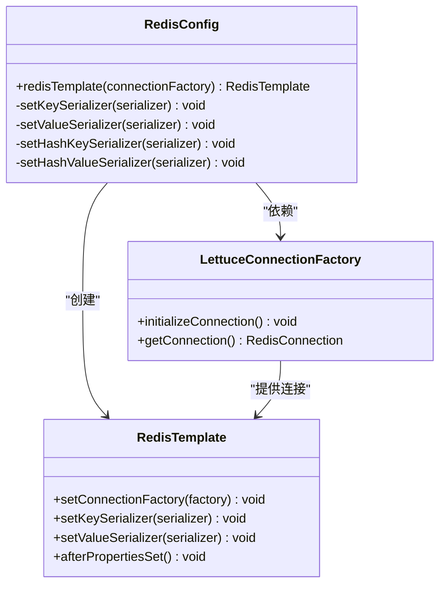
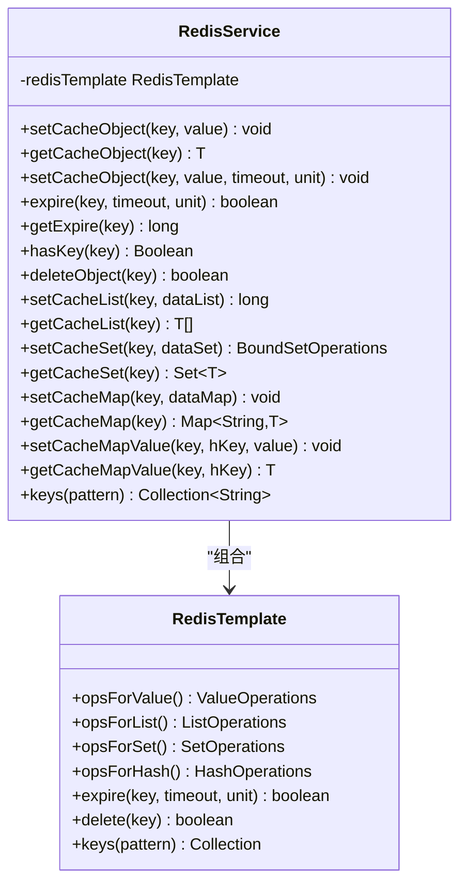
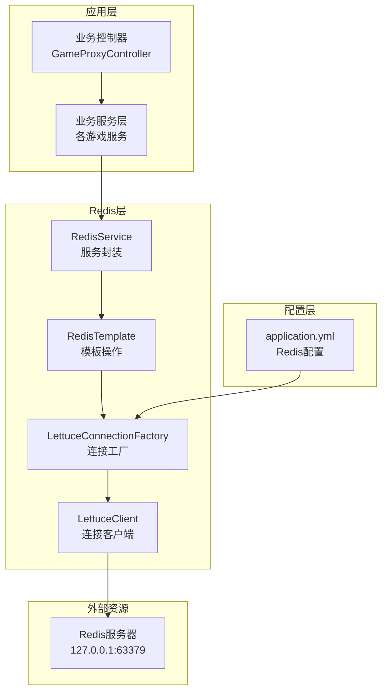
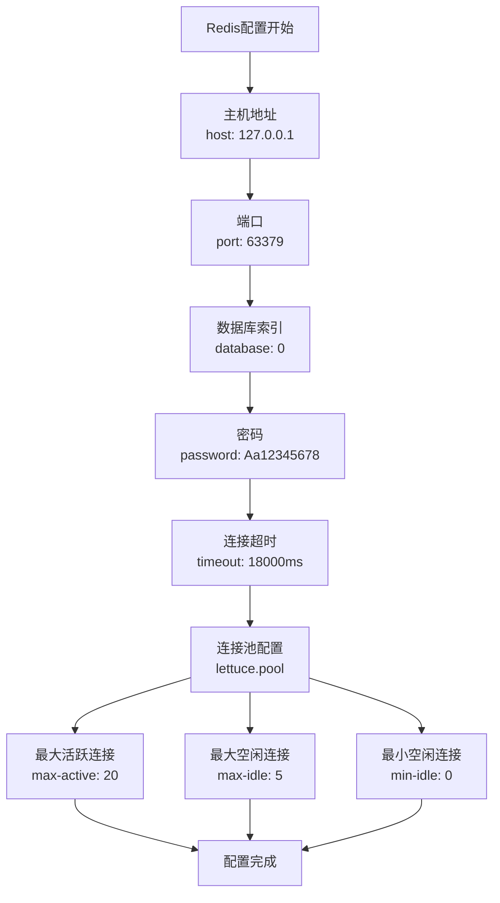
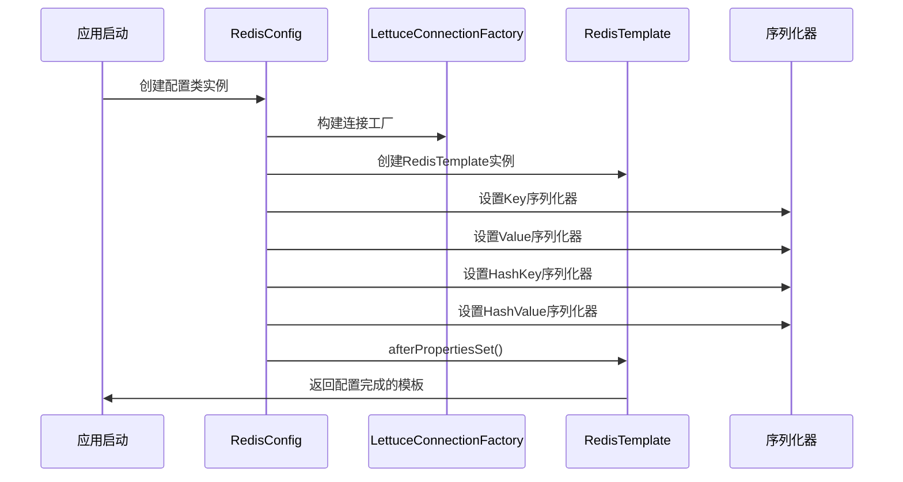
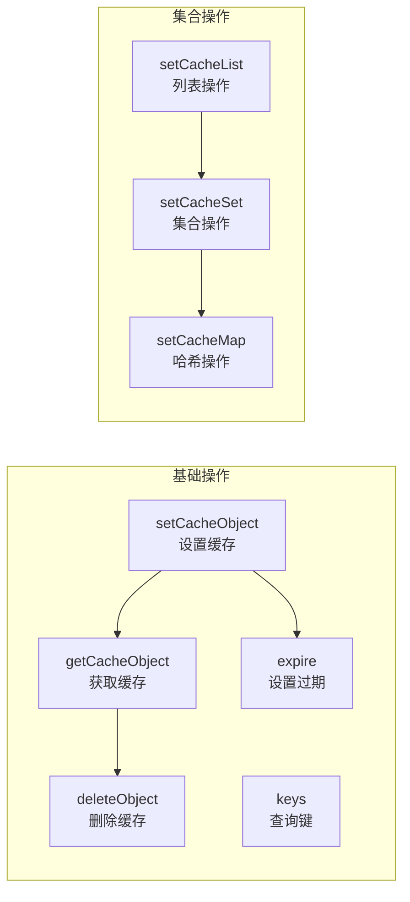
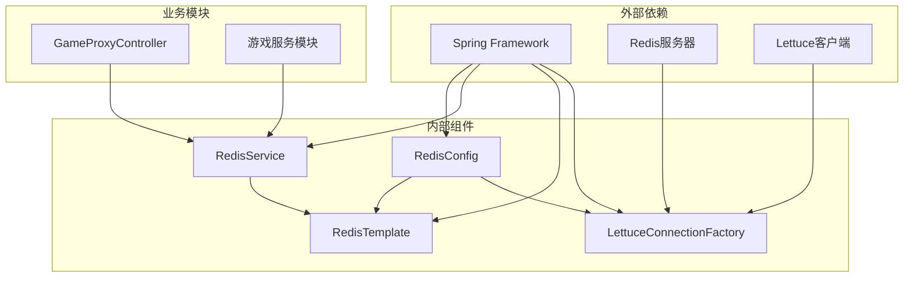
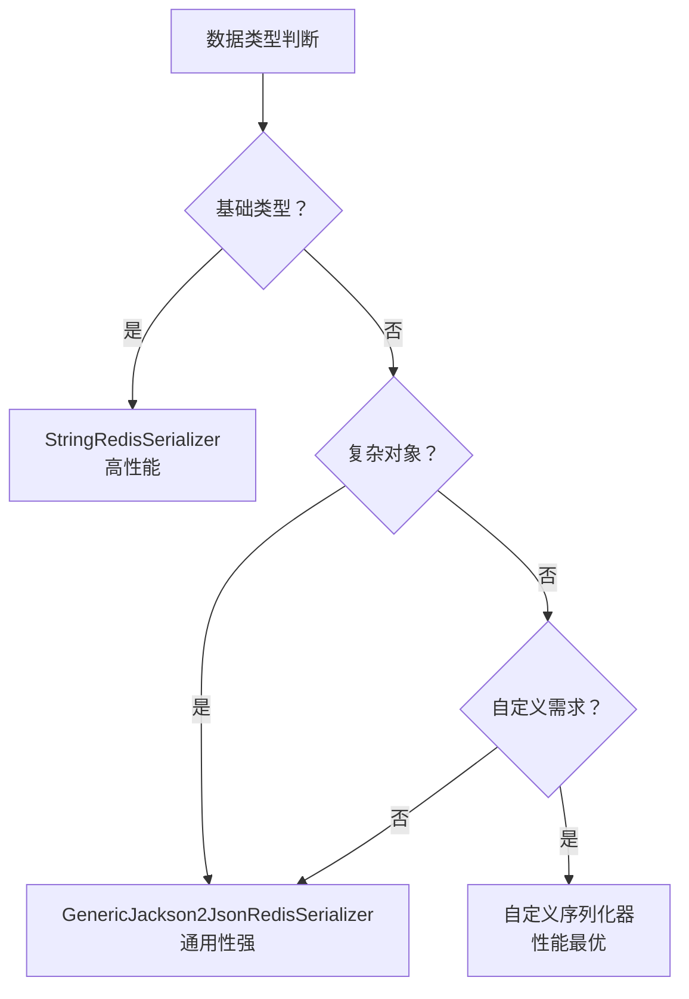
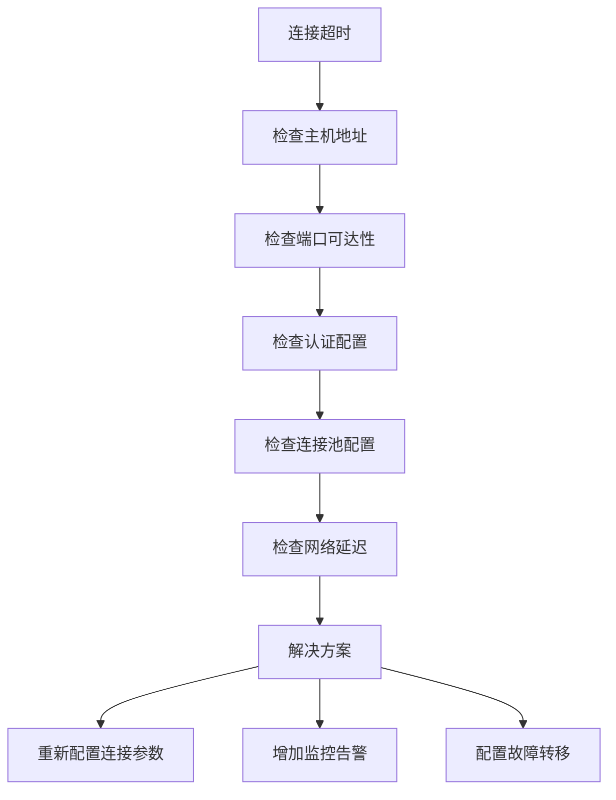

# Redis配置与连接

<cite>
**本文档引用的文件**
- [RedisConfig.java](file://game-proxy/src/main/java/com/game/redis/RedisConfig.java)
- [RedisService.java](file://game-proxy/src/main/java/com/game/redis/RedisService.java)
- [application.yml](file://game-proxy/src/main/resources/application.yml)
- [RedisTest.java](file://game-proxy/src/test/java/RedisTest.java)
</cite>

## 目录
1. [简介](#简介)
2. [项目结构](#项目结构)
3. [核心组件](#核心组件)
4. [架构概览](#架构概览)
5. [详细组件分析](#详细组件分析)
6. [依赖关系分析](#依赖关系分析)
7. [性能考虑](#性能考虑)
8. [故障排查指南](#故障排查指南)
9. [结论](#结论)

## 简介

本文件针对Redis配置与连接管理进行深入技术文档编写，重点涵盖以下方面：
- RedisConfig类的配置实现，包括连接工厂配置、序列化器设置、连接池参数调优和集群模式支持
- application.yml中的Redis连接配置选项，包括主机地址、端口、密码、数据库索引、超时设置等参数的作用和最佳实践
- RedisTemplate的配置和初始化过程，包括泛型类型设置、操作命令配置和异常处理机制
- 连接池性能调优指南，包括最大连接数、空闲连接数、连接超时时间等关键参数的设置原则
- 连接故障处理、重连机制和监控告警的配置方法

## 项目结构

在当前代码库中，Redis相关的配置主要集中在`game-proxy`模块中，具体文件分布如下：
- 配置类：`game-proxy/src/main/java/com/game/redis/RedisConfig.java`
- 业务服务：`game-proxy/src/main/java/com/game/redis/RedisService.java`
- 配置文件：`game-proxy/src/main/resources/application.yml`
- 测试示例：`game-proxy/src/test/java/RedisTest.java`

**图表来源**
- [RedisConfig.java](file://game-proxy/src/main/java/com/game/redis/RedisConfig.java#L1-L41)
- [RedisService.java](file://game-proxy/src/main/java/com/game/redis/RedisService.java#L1-L244)
- [application.yml](file://game-proxy/src/main/resources/application.yml#L1-L58)

**章节来源**
- [RedisConfig.java](file://game-proxy/src/main/java/com/game/redis/RedisConfig.java#L1-L41)
- [RedisService.java](file://game-proxy/src/main/java/com/game/redis/RedisService.java#L1-L244)
- [application.yml](file://game-proxy/src/main/resources/application.yml#L1-L58)

## 核心组件

### RedisConfig配置类

RedisConfig类负责Redis连接和模板的配置，采用Spring注解驱动的方式实现：

**图表来源**
- [RedisConfig.java](file://game-proxy/src/main/java/com/game/redis/RedisConfig.java#L27-L39)

该配置类的核心特性包括：
- 使用Lettuce作为Redis连接客户端
- 自定义序列化策略，确保数据正确存储和读取
- 支持多种Redis数据类型的统一操作接口

**章节来源**
- [RedisConfig.java](file://game-proxy/src/main/java/com/game/redis/RedisConfig.java#L10-L40)

### RedisService服务封装

RedisService提供了一套完整的Redis操作工具方法，覆盖常用的数据操作场景：

**图表来源**
- [RedisService.java](file://game-proxy/src/main/java/com/game/redis/RedisService.java#L20-L243)

**章节来源**
- [RedisService.java](file://game-proxy/src/main/java/com/game/redis/RedisService.java#L13-L243)

## 架构概览

Redis在系统中的整体架构设计如下：

**图表来源**
- [RedisConfig.java](file://game-proxy/src/main/java/com/game/redis/RedisConfig.java#L27-L39)
- [application.yml](file://game-proxy/src/main/resources/application.yml#L15-L30)

## 详细组件分析

### Redis连接配置详解

#### application.yml中的Redis配置选项

在application.yml中，Redis连接配置位于spring.redis命名空间下：

**图表来源**
- [application.yml](file://game-proxy/src/main/resources/application.yml#L15-L30)

#### 关键配置参数说明

| 参数名 | 默认值 | 作用描述 | 最佳实践 |
|--------|--------|----------|----------|
| host | 127.0.0.1 | Redis服务器地址 | 生产环境建议使用内网IP或域名 |
| port | 6379 | Redis服务器端口 | 开发环境可使用63379便于区分 |
| database | 0 | 数据库索引 | 建议为每个环境分配独立数据库 |
| password | 空 | 认证密码 | 生产环境必须设置强密码 |
| timeout | 18000ms | 连接超时时间 | 根据网络状况调整，避免过短导致频繁超时 |
| lettuce.pool.max-active | 20 | 最大连接数 | 根据QPS和并发量计算 |
| lettuce.pool.max-idle | 5 | 最大空闲连接 | 一般设置为max-active的25% |
| lettuce.pool.min-idle | 0 | 最小空闲连接 | 通常设为0即可 |

**章节来源**
- [application.yml](file://game-proxy/src/main/resources/application.yml#L15-L30)

### RedisTemplate配置与初始化

RedisTemplate的配置过程体现了Spring Data Redis的设计理念：

**图表来源**
- [RedisConfig.java](file://game-proxy/src/main/java/com/game/redis/RedisConfig.java#L27-L39)

#### 序列化器配置策略

系统采用了混合序列化策略：
- **Key序列化器**：StringRedisSerializer，确保键的字符串格式
- **Value序列化器**：GenericJackson2JsonRedisSerializer，支持复杂对象的JSON序列化
- **HashKey序列化器**：StringRedisSerializer，保持Hash键的一致性
- **HashValue序列化器**：GenericJackson2JsonRedisSerializer，统一Hash值的存储格式

这种配置的优势在于：
1. 键的可读性和调试友好性
2. 复杂对象的完整序列化和反序列化
3. 与Spring Data Redis的自动类型转换兼容

**章节来源**
- [RedisConfig.java](file://game-proxy/src/main/java/com/game/redis/RedisConfig.java#L27-L39)

### RedisService操作方法详解

RedisService提供了丰富的操作方法，覆盖了常见的Redis使用场景：

#### 基础数据操作

**图表来源**
- [RedisService.java](file://game-proxy/src/main/java/com/game/redis/RedisService.java#L30-L242)

#### 高级功能实现

RedisService还实现了以下高级功能：
- **过期时间管理**：支持精确的时间控制和动态调整
- **批量操作**：提供批量设置和获取功能
- **类型安全**：通过泛型确保编译时类型安全
- **异常处理**：在业务层提供友好的异常处理机制

**章节来源**
- [RedisService.java](file://game-proxy/src/main/java/com/game/redis/RedisService.java#L24-L242)

## 依赖关系分析

Redis配置在整个系统中的依赖关系如下：

**图表来源**
- [RedisConfig.java](file://game-proxy/src/main/java/com/game/redis/RedisConfig.java#L1-L41)
- [RedisService.java](file://game-proxy/src/main/java/com/game/redis/RedisService.java#L1-L244)

**章节来源**
- [RedisConfig.java](file://game-proxy/src/main/java/com/game/redis/RedisConfig.java#L1-L41)
- [RedisService.java](file://game-proxy/src/main/java/com/game/redis/RedisService.java#L1-L244)

## 性能考虑

### 连接池参数调优指南

基于当前配置，以下是连接池参数的调优建议：

#### 核心参数设置原则

| 参数 | 当前值 | 推荐范围 | 调优依据 |
|------|--------|----------|----------|
| max-active | 20 | 50-200 | 根据峰值QPS计算，预留30%缓冲 |
| max-idle | 5 | 10-50 | max-active的25%-30% |
| min-idle | 0 | 0-10 | 通常设为0，按需增长 |
| max-wait | - | 2000-5000ms | 避免无限等待，影响响应时间 |

#### 性能监控指标

建议关注以下关键指标：
- **连接利用率**：`(活跃连接/总连接) × 100%`
- **等待时间**：连接获取平均等待时间
- **超时率**：连接超时次数占比
- **错误率**：连接失败和重试次数

#### 调优步骤

1. **基准测试**：使用Redis-benchmark进行压力测试
2. **逐步调优**：每次调整一个参数，观察效果
3. **监控验证**：通过JMX或Redis INFO命令监控状态
4. **容量规划**：根据业务增长预留扩展空间

### 序列化性能优化

#### 序列化器选择策略

#### 缓存策略优化

1. **热点数据预热**：启动时加载常用数据
2. **分层缓存**：本地缓存+Redis缓存双重保障
3. **批量操作**：使用Pipeline减少网络往返
4. **智能过期**：设置合理的TTL避免内存泄漏

## 故障排查指南

### 常见连接问题及解决方案

#### 连接超时问题

#### 连接池耗尽问题

当出现连接池耗尽时，应检查：
1. **连接泄漏**：确认所有连接正确关闭
2. **超时设置**：适当增加超时时间
3. **池大小**：根据实际负载调整池大小
4. **并发控制**：限制同时进行的操作数量

#### 序列化异常处理

序列化异常的常见原因：
- **类型不匹配**：存储和读取的数据类型不一致
- **循环引用**：对象间存在循环引用
- **缺少无参构造函数**：JSON序列化需要无参构造函数
- **字段访问权限**：私有字段无法序列化

**章节来源**
- [RedisService.java](file://game-proxy/src/main/java/com/game/redis/RedisService.java#L30-L242)

### 监控告警配置

建议配置以下监控指标：
- **连接状态**：连接数、活跃连接数、等待连接数
- **性能指标**：命令执行时间、命中率、错误率
- **资源使用**：内存使用、CPU占用、网络带宽
- **业务指标**：缓存命中率、响应时间、吞吐量

## 结论

通过对Redis配置与连接管理的深入分析，可以总结出以下要点：

### 技术优势

1. **配置简洁**：采用Spring Boot自动配置，减少了大量样板代码
2. **类型安全**：通过泛型确保编译时类型检查
3. **扩展性强**：支持多种Redis数据类型和操作模式
4. **性能优化**：合理的序列化策略和连接池配置

### 最佳实践建议

1. **生产环境配置**：使用独立的配置文件，启用密码认证
2. **性能调优**：根据实际负载调整连接池参数
3. **监控完善**：建立完善的监控和告警体系
4. **容错设计**：实现优雅降级和故障转移机制

### 后续改进方向

1. **集群支持**：考虑引入Redis集群模式支持
2. **连接池监控**：增加更详细的连接池使用统计
3. **序列化优化**：根据业务特点选择更合适的序列化方案
4. **故障恢复**：实现自动化的故障检测和恢复机制

通过以上配置和优化，系统能够稳定高效地运行Redis连接，为业务提供可靠的缓存服务。