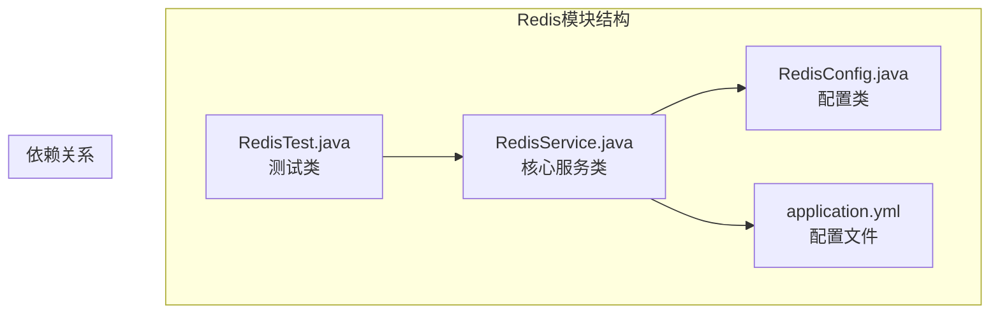
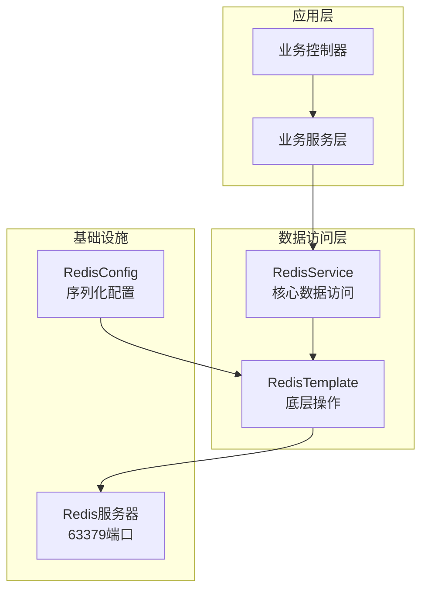
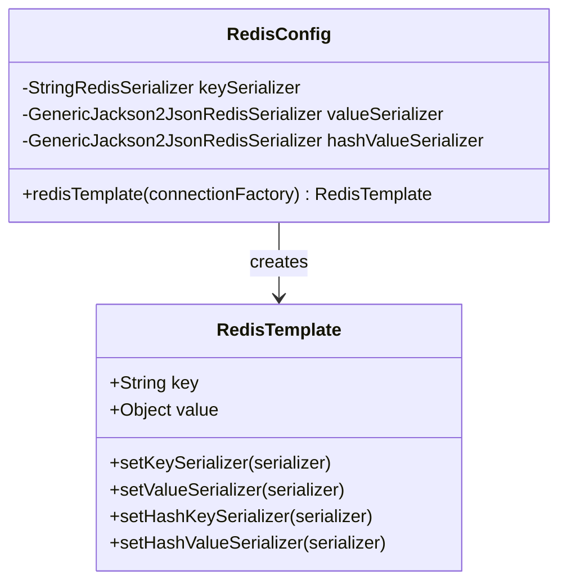
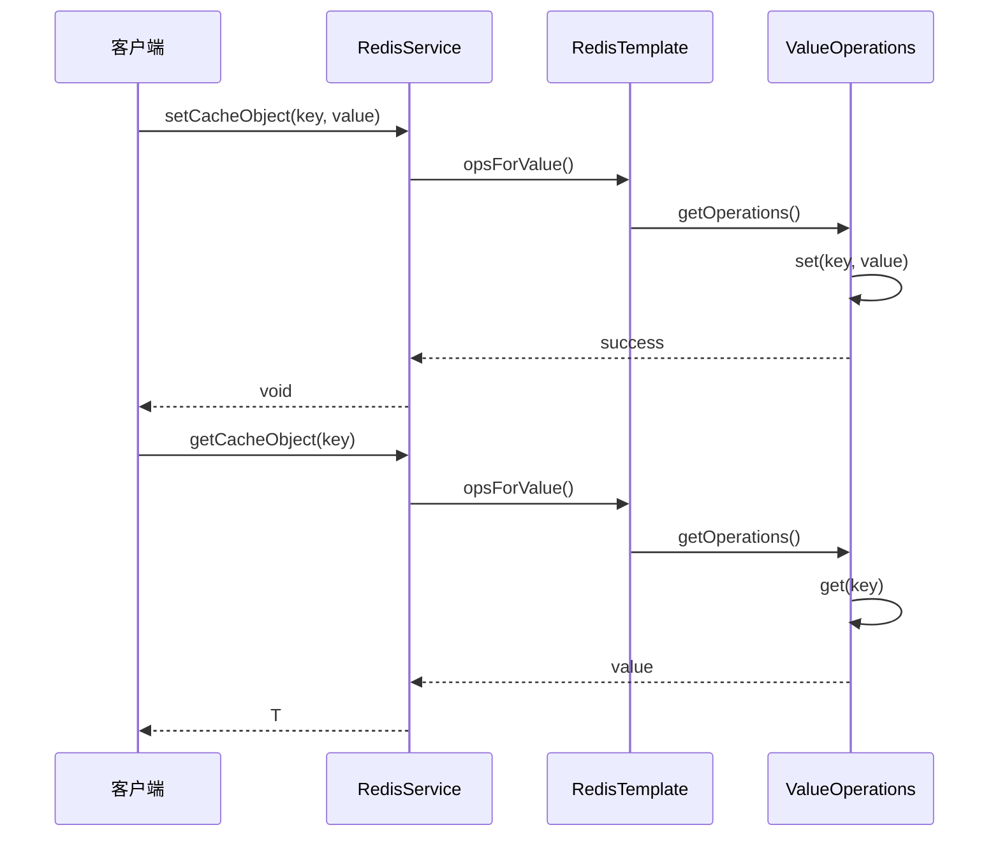
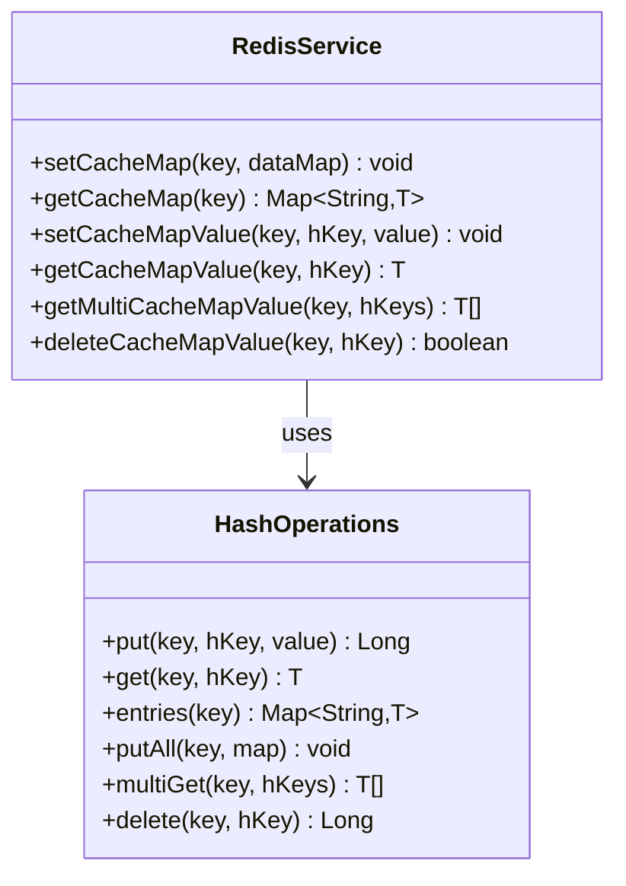
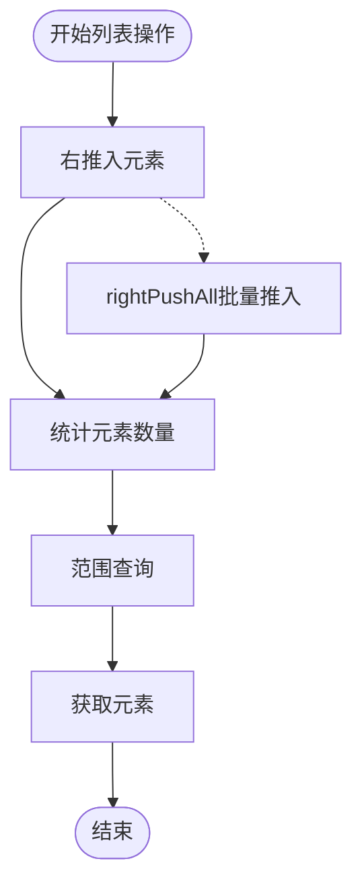
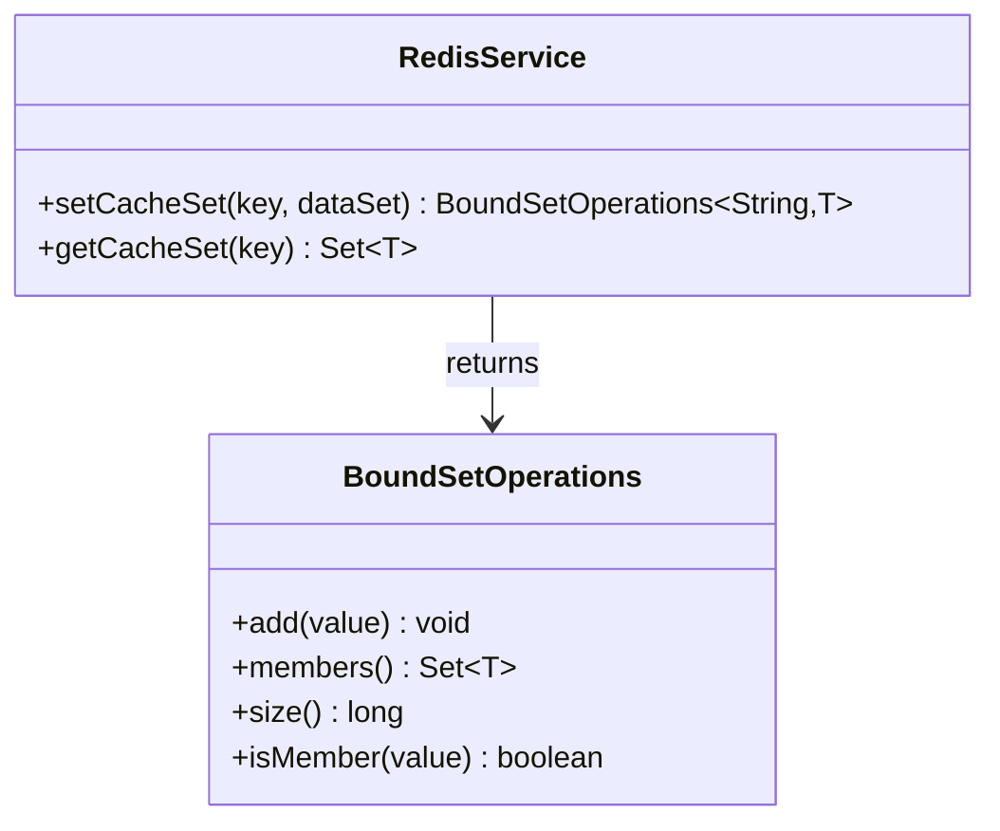
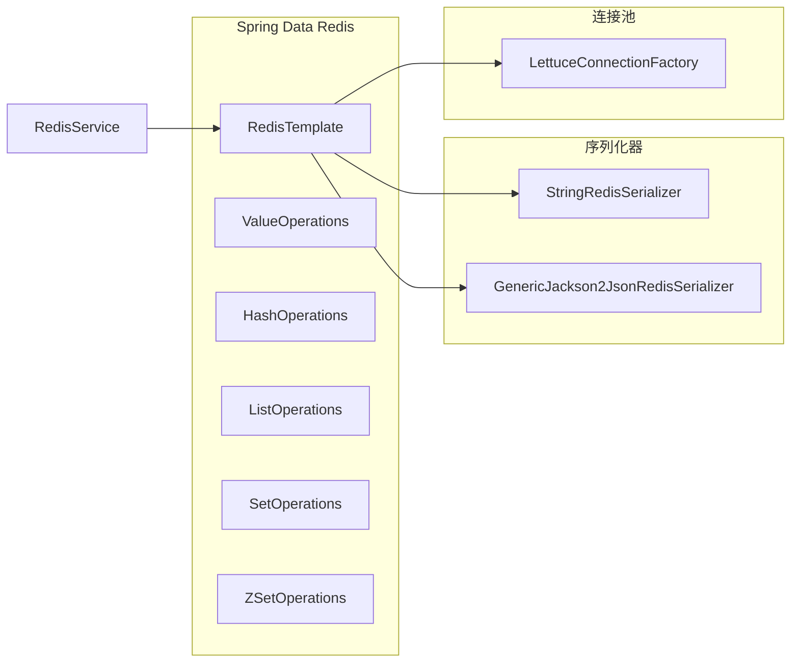
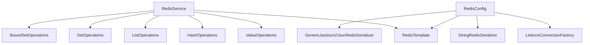

# 数据类型操作

<cite>
**本文档引用的文件**
- [RedisService.java](file://game-proxy/src/main/java/com/game/redis/RedisService.java)
- [RedisConfig.java](file://game-proxy/src/main/java/com/game/redis/RedisConfig.java)
- [application.yml](file://game-proxy/src/main/resources/application.yml)
- [RedisTest.java](file://game-proxy/src/test/java/RedisTest.java)
</cite>

## 目录
1. [简介](#简介)
2. [项目结构](#项目结构)
3. [核心组件](#核心组件)
4. [架构概览](#架构概览)
5. [详细组件分析](#详细组件分析)
6. [依赖关系分析](#依赖关系分析)
7. [性能考虑](#性能考虑)
8. [故障排除指南](#故障排除指南)
9. [结论](#结论)

## 简介

本文档详细介绍了Redis数据类型操作的实现，重点分析了`RedisService`类中各种数据类型的增删改查操作。该服务封装了Spring Data Redis的核心功能，提供了统一的Redis操作接口，支持字符串(Value)、哈希(Hash)、列表(List)、集合(Set)和有序集合(ZSet)等数据类型的完整操作。

## 项目结构

该项目采用标准的Spring Boot项目结构，Redis相关的核心代码位于`game-proxy`模块中：

**图表来源**
- [RedisService.java](file://game-proxy/src/main/java/com/game/redis/RedisService.java#L1-L244)
- [RedisConfig.java](file://game-proxy/src/main/java/com/game/redis/RedisConfig.java#L1-L41)

**章节来源**
- [RedisService.java](file://game-proxy/src/main/java/com/game/redis/RedisService.java#L1-L244)
- [RedisConfig.java](file://game-proxy/src/main/java/com/game/redis/RedisConfig.java#L1-L41)
- [application.yml](file://game-proxy/src/main/resources/application.yml#L1-L58)

## 核心组件

### RedisService类概述

`RedisService`是一个Spring服务类，负责封装所有Redis数据操作。它通过@Autowired注入RedisTemplate，并提供了针对不同数据类型的专门操作方法。

主要特性：
- **泛型支持**：所有操作都支持泛型，确保类型安全
- **过期时间管理**：支持设置和查询键的有效期
- **批量操作**：提供批量插入和批量获取功能
- **条件操作**：支持键存在性检查和删除操作

**章节来源**
- [RedisService.java](file://game-proxy/src/main/java/com/game/redis/RedisService.java#L13-L23)

## 架构概览

系统采用分层架构设计，清晰分离了配置、服务和应用逻辑：

**图表来源**
- [RedisService.java](file://game-proxy/src/main/java/com/game/redis/RedisService.java#L20-L22)
- [RedisConfig.java](file://game-proxy/src/main/java/com/game/redis/RedisConfig.java#L27-L39)

## 详细组件分析

### Redis配置与序列化

#### 序列化配置

RedisConfig类配置了完整的序列化策略，确保Java对象能够正确存储和检索：

**图表来源**
- [RedisConfig.java](file://game-proxy/src/main/java/com/game/redis/RedisConfig.java#L27-L39)

#### 序列化策略详解

| 序列化器 | 用途 | 特点 |
|---------|------|------|
| StringRedisSerializer | 键序列化 | 将键转换为UTF-8字节序列 |
| GenericJackson2JsonRedisSerializer | 值序列化 | 使用Jackson将对象序列化为JSON |
| HashKeySerializer | 哈希键序列化 | 与键序列化器相同 |
| HashValueSerializer | 哈希值序列化 | 与值序列化器相同 |

**章节来源**
- [RedisConfig.java](file://game-proxy/src/main/java/com/game/redis/RedisConfig.java#L31-L36)

### 字符串(Value)操作

#### 基本操作方法

RedisService提供了完整的字符串操作接口：

**图表来源**
- [RedisService.java](file://game-proxy/src/main/java/com/game/redis/RedisService.java#L30-L44)
- [RedisService.java](file://game-proxy/src/main/java/com/game/redis/RedisService.java#L95-L98)

#### 过期时间管理

支持灵活的过期时间设置：

| 方法 | 参数 | 功能 | 返回值 |
|------|------|------|--------|
| expire(key, timeout) | key, timeout(seconds) | 设置默认秒级过期 | boolean |
| expire(key, timeout, unit) | key, timeout, TimeUnit | 设置指定单位过期 | boolean |
| getExpire(key) | key | 获取剩余过期时间 | long |

**章节来源**
- [RedisService.java](file://game-proxy/src/main/java/com/game/redis/RedisService.java#L53-L77)

### 哈希(Hash)操作

#### 完整的哈希操作集

RedisService提供了丰富的哈希操作方法：

**图表来源**
- [RedisService.java](file://game-proxy/src/main/java/com/game/redis/RedisService.java#L173-L232)

#### 批量操作支持

哈希操作支持批量插入和批量获取：

- `setCacheMap()`：批量插入整个Map
- `getMultiCacheMapValue()`：批量获取多个字段值
- `deleteCacheMapValue()`：删除指定字段

**章节来源**
- [RedisService.java](file://game-proxy/src/main/java/com/game/redis/RedisService.java#L173-L232)

### 列表(List)操作

#### 列表数据结构操作

**图表来源**
- [RedisService.java](file://game-proxy/src/main/java/com/game/redis/RedisService.java#L126-L139)

#### 列表操作特性

- **右推入**：使用`rightPushAll()`进行批量推入
- **范围查询**：支持从0到-1的完整范围查询
- **批量操作**：适合队列和消息队列场景

**章节来源**
- [RedisService.java](file://game-proxy/src/main/java/com/game/redis/RedisService.java#L126-L139)

### 集合(Set)操作

#### 集合数据类型实现

**图表来源**
- [RedisService.java](file://game-proxy/src/main/java/com/game/redis/RedisService.java#L148-L165)

#### 集合操作特点

- **BoundSetOperations**：返回绑定的操作对象，支持链式调用
- **迭代器模式**：使用Iterator遍历Set集合
- **成员查询**：支持成员存在性检查

**章节来源**
- [RedisService.java](file://game-proxy/src/main/java/com/game/redis/RedisService.java#L148-L165)

### 有序集合(ZSet)操作

#### 当前实现状态

经过分析，当前的`RedisService`实现中没有提供专门的ZSet操作方法。虽然RedisConfig配置中注释提到了`opsForZSet()`，但实际的ZSet操作方法并未在RedisService中实现。

**章节来源**
- [RedisService.java](file://game-proxy/src/main/java/com/game/redis/RedisService.java#L17-L22)
- [RedisConfig.java](file://game-proxy/src/main/java/com/game/redis/RedisConfig.java#L17-L21)

## 依赖关系分析

### 外部依赖

系统依赖以下关键组件：

**图表来源**
- [RedisService.java](file://game-proxy/src/main/java/com/game/redis/RedisService.java#L3-L8)
- [RedisConfig.java](file://game-proxy/src/main/java/com/game/redis/RedisConfig.java#L5-L8)

### 内部依赖关系

**图表来源**
- [RedisService.java](file://game-proxy/src/main/java/com/game/redis/RedisService.java#L3-L8)
- [RedisConfig.java](file://game-proxy/src/main/java/com/game/redis/RedisConfig.java#L27-L39)

**章节来源**
- [RedisService.java](file://game-proxy/src/main/java/com/game/redis/RedisService.java#L1-L12)
- [RedisConfig.java](file://game-proxy/src/main/java/com/game/redis/RedisConfig.java#L1-L11)

## 性能考虑

### 连接池配置

基于application.yml配置，系统使用Lettuce连接池：

| 配置项 | 值 | 说明 |
|--------|-----|------|
| max-active | 20 | 最大连接数 |
| max-idle | 5 | 最大空闲连接 |
| min-idle | 0 | 最小空闲连接 |
| timeout | 18000ms | 连接超时时间 |

### 序列化性能

- **JSON序列化**：使用Jackson进行高效序列化
- **字符串键**：使用StringRedisSerializer优化键存储
- **批量操作**：优先使用批量方法减少网络往返

### 最佳实践建议

1. **批量操作**：使用批量插入和批量获取方法
2. **连接复用**：避免频繁创建连接
3. **过期策略**：合理设置过期时间防止内存泄漏
4. **序列化选择**：根据数据类型选择合适的序列化器

**章节来源**
- [application.yml](file://game-proxy/src/main/resources/application.yml#L23-L30)
- [RedisConfig.java](file://game-proxy/src/main/java/com/game/redis/RedisConfig.java#L31-L36)

## 故障排除指南

### 常见问题及解决方案

#### 连接异常

**问题**：连接Redis服务器失败
**原因**：主机名、端口或密码配置错误
**解决方案**：
- 检查application.yml中的Redis配置
- 验证Redis服务器状态
- 确认防火墙设置

#### 序列化错误

**问题**：对象序列化/反序列化失败
**原因**：缺少无参构造函数或序列化器配置错误
**解决方案**：
- 确保实体类有无参构造函数
- 检查GenericJackson2JsonRedisSerializer配置
- 验证对象的可序列化性

#### 超时处理

**问题**：操作超时
**原因**：网络延迟或Redis服务器负载过高
**解决方案**：
- 调整timeout配置
- 优化Redis查询
- 实施重试机制

**章节来源**
- [application.yml](file://game-proxy/src/main/resources/application.yml#L15-L22)
- [RedisConfig.java](file://game-proxy/src/main/java/com/game/redis/RedisConfig.java#L31-L36)

## 结论

RedisService提供了完整的Redis数据类型操作接口，具有以下优势：

1. **类型安全**：所有操作都支持泛型，确保编译时类型检查
2. **功能完整**：覆盖了字符串、哈希、列表、集合等主要数据类型
3. **配置灵活**：支持自定义序列化器和连接池配置
4. **易于使用**：提供简洁的API接口

**改进建议**：
- 添加ZSet操作方法以完善数据类型支持
- 实现更完善的异常处理机制
- 添加操作监控和性能指标
- 提供更多批量操作选项

该实现为Spring Boot应用提供了可靠的Redis数据访问层，适合大多数缓存和数据存储场景。