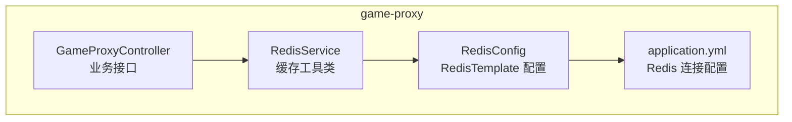
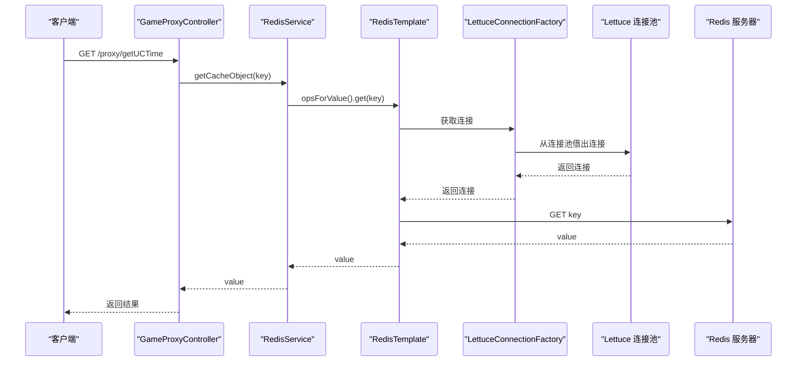
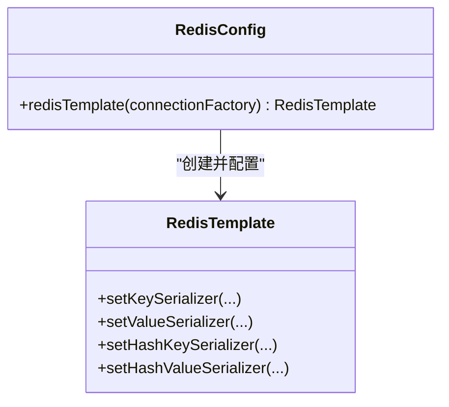
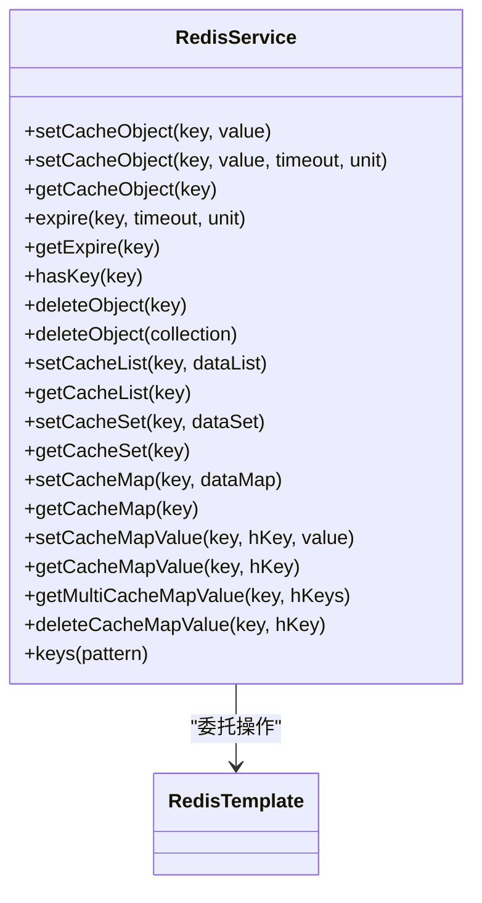
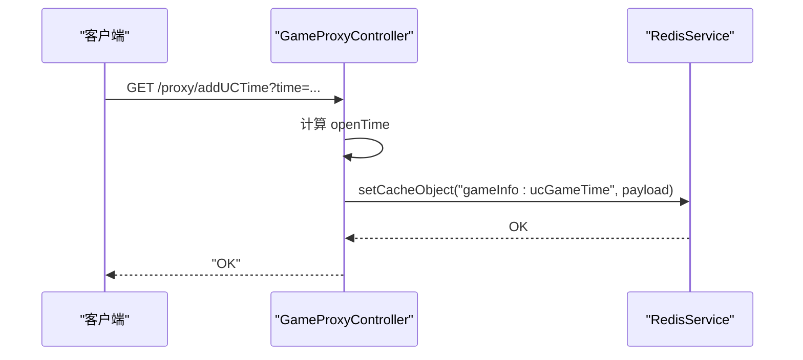
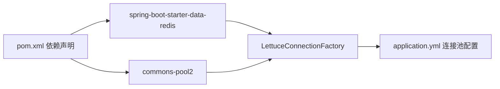

# 缓存性能优化

<cite>
**本文引用的文件**
- [RedisConfig.java](file://game-proxy/src/main/java/com/game/redis/RedisConfig.java)
- [RedisService.java](file://game-proxy/src/main/java/com/game/redis/RedisService.java)
- [application.yml](file://game-proxy/src/main/resources/application.yml)
- [GameProxyController.java](file://game-proxy/src/main/java/com/game/controller/GameProxyController.java)
- [pom.xml](file://game-proxy/pom.xml)
- [RedisTest.java](file://game-proxy/src/test/java/RedisTest.java)
</cite>

## 目录
1. [引言](#引言)
2. [项目结构](#项目结构)
3. [核心组件](#核心组件)
4. [架构总览](#架构总览)
5. [详细组件分析](#详细组件分析)
6. [依赖关系分析](#依赖关系分析)
7. [性能考量与优化建议](#性能考量与优化建议)
8. [故障排查指南](#故障排查指南)
9. [结论](#结论)
10. [附录](#附录)

## 引言
本技术文档围绕缓存性能优化展开，结合当前代码库中对 Redis 的使用现状，系统性地给出监控指标与方法、命中率优化策略、内存与连接池管理、批量操作与并发控制优化、性能测试与诊断方法，并提供可落地的调优建议。文档面向不同层次读者，既提供高层概览，也包含代码级分析与可视化图示。

## 项目结构
本仓库包含多个子工程，其中与缓存直接相关的是 game-proxy 模块，其通过 Spring Data Redis + Lettuce 实现 Redis 访问，提供统一的 RedisService 工具类封装常用操作，并在控制器中使用该服务进行缓存读写。

图表来源
- [RedisConfig.java](file://game-proxy/src/main/java/com/game/redis/RedisConfig.java#L27-L39)
- [RedisService.java](file://game-proxy/src/main/java/com/game/redis/RedisService.java#L20-L243)
- [application.yml](file://game-proxy/src/main/resources/application.yml#L15-L30)
- [GameProxyController.java](file://game-proxy/src/main/java/com/game/controller/GameProxyController.java#L82-L200)

章节来源
- [RedisConfig.java](file://game-proxy/src/main/java/com/game/redis/RedisConfig.java#L1-L41)
- [RedisService.java](file://game-proxy/src/main/java/com/game/redis/RedisService.java#L1-L244)
- [application.yml](file://game-proxy/src/main/resources/application.yml#L1-L58)
- [GameProxyController.java](file://game-proxy/src/main/java/com/game/controller/GameProxyController.java#L1-L200)

## 核心组件
- RedisTemplate 序列化配置：统一 Key/HashKey 使用字符串序列化，Value/HashValue 使用 JSON 序列化，确保跨语言与类型安全。
- RedisService：封装常用缓存操作（字符串、List、Set、Hash），提供过期时间设置、批量读取、键匹配等能力。
- 控制器层：在具体业务接口中使用 RedisService 进行缓存读写，如获取/设置游戏信息、设置临时时间缓存等。

章节来源
- [RedisConfig.java](file://game-proxy/src/main/java/com/game/redis/RedisConfig.java#L27-L39)
- [RedisService.java](file://game-proxy/src/main/java/com/game/redis/RedisService.java#L24-L242)
- [GameProxyController.java](file://game-proxy/src/main/java/com/game/controller/GameProxyController.java#L82-L200)

## 架构总览
下图展示从控制器到 Redis 的典型调用链路，以及连接池配置位置。

图表来源
- [GameProxyController.java](file://game-proxy/src/main/java/com/game/controller/GameProxyController.java#L212-L217)
- [RedisService.java](file://game-proxy/src/main/java/com/game/redis/RedisService.java#L95-L98)
- [RedisConfig.java](file://game-proxy/src/main/java/com/game/redis/RedisConfig.java#L27-L39)
- [application.yml](file://game-proxy/src/main/resources/application.yml#L23-L30)

## 详细组件分析

### RedisTemplate 序列化配置
- Key/HashKey 使用字符串序列化，Value/HashValue 使用 JSON 序列化，避免二进制键导致的不可读性，同时保证复杂对象的序列化一致性。
- 该配置位于 RedisConfig 中的 Bean 方法内，作为全局模板注入使用。

图表来源
- [RedisConfig.java](file://game-proxy/src/main/java/com/game/redis/RedisConfig.java#L27-L39)

章节来源
- [RedisConfig.java](file://game-proxy/src/main/java/com/game/redis/RedisConfig.java#L27-L39)

### RedisService 缓存工具类
- 支持字符串对象缓存、带过期时间的缓存、删除单个/集合对象、List/Set/Hash 的读写与批量读取、键匹配等。
- 提供 BoundSetOperations、HashOperations、ValueOperations 等操作入口，便于按数据类型高效操作。

图表来源
- [RedisService.java](file://game-proxy/src/main/java/com/game/redis/RedisService.java#L20-L243)

章节来源
- [RedisService.java](file://game-proxy/src/main/java/com/game/redis/RedisService.java#L20-L243)

### 控制器层缓存使用
- 在多个接口中通过 RedisService 读取/写入缓存，例如获取游戏信息、设置临时时间缓存等。
- 示例：设置 5 秒缓存时间，便于短期状态同步与快速返回。

图表来源
- [GameProxyController.java](file://game-proxy/src/main/java/com/game/controller/GameProxyController.java#L184-L208)
- [RedisService.java](file://game-proxy/src/main/java/com/game/redis/RedisService.java#L30-L44)

章节来源
- [GameProxyController.java](file://game-proxy/src/main/java/com/game/controller/GameProxyController.java#L184-L208)
- [RedisService.java](file://game-proxy/src/main/java/com/game/redis/RedisService.java#L30-L44)

## 依赖关系分析
- Spring Boot Starter Data Redis：提供 Redis 自动配置与连接工厂。
- Commons Pool2：提供连接池实现，与 Lettuce 协同工作。
- application.yml 中的 spring.redis.lettuce.pool.* 配置了连接池参数。

图表来源
- [pom.xml](file://game-proxy/pom.xml#L74-L81)
- [application.yml](file://game-proxy/src/main/resources/application.yml#L23-L30)

章节来源
- [pom.xml](file://game-proxy/pom.xml#L74-L81)
- [application.yml](file://game-proxy/src/main/resources/application.yml#L15-L30)

## 性能考量与优化建议

### Redis 性能监控指标与方法
- 内存使用率：通过 INFO memory 或 Redis CLI 查看 used_memory、used_memory_rss、fragmentation_ratio 等，关注碎片率与内存峰值。
- 连接数：通过 INFO clients 查看 connected_clients、client_longest_output_list 等，评估连接池利用率与峰值。
- 命令执行频率：通过 INFO commandstats 统计各命令次数与耗时，识别热点命令。
- 慢查询分析：启用 slowlog-log-slower-than 与 slowlog-max-len，定期导出并分析慢查询日志。
- 命中率：通过 INFO stats 查看 keyspace_hits/keyspace_misses 计算命中率，持续观察趋势。

### 缓存命中率优化策略
- 预热策略：在系统启动或业务低峰期，批量加载高频数据至缓存，减少冷启动抖动。
- 热点数据处理：对热点键设置更短过期时间或引入二级缓存（本地缓存+Redis），并配合热点探测与降级策略。
- 缓存分层设计：将热数据放 Redis，温数据放本地缓存，冷数据落盘或延迟加载，降低热点压力。

### 内存管理优化
- 内存碎片整理：定期执行 MEMORY PURGE（Redis 6+）或重启节点进行碎片整理；避免频繁大对象增删导致碎片累积。
- 内存淘汰策略：根据业务特征选择合适的 maxmemory-policy（如 volatile-ttl、allkeys-lru 等），并结合过期策略控制内存增长。
- 大对象处理：拆分大对象、采用压缩存储或外部存储（如对象存储）+ 缓存指针，避免阻塞主进程。

### 连接池优化
- 连接复用：确保连接池参数合理，避免频繁创建销毁连接；在高并发场景下适当增大最大连接数。
- 连接池大小调优：依据 QPS、平均响应时间与 CPU/网络资源，逐步调整 max-active、max-idle、min-idle，观察连接等待时间与拒绝率。
- 连接泄漏检测：启用连接池监控指标（如 borrowed、returned、created、destroyed），结合 GC 日志与线程堆栈定位泄漏点。

### 批量操作优化
- Pipeline 使用：将多个独立命令打包发送，减少往返开销；适用于批量写入、批量读取等场景。
- 事务优化：谨慎使用 MULTI/EXEC，避免长事务占用连接与阻塞；必要时拆分为多个短事务。
- Lua 脚本应用：将原子性要求高的多步操作封装为 Lua，减少网络往返与竞态条件。

### 并发控制优化
- 分布式锁实现：基于 SET key value NX EX ttl 原子指令实现简单分布式锁；注意锁粒度与超时时间，避免死锁。
- 乐观锁策略：利用版本号或 CAS 操作（如 WATCH/MULTI/EXEC）实现无阻塞并发更新。
- 并发安全保证：在高并发场景下，优先使用原子操作与 Lua 脚本，避免业务层手动加锁带来的复杂性。

### 性能测试与基准测试
- 基准测试工具：使用 redis-benchmark 进行单机/集群压测，覆盖读写比例、数据大小、连接数等维度。
- 场景化测试：模拟真实业务路径（如读多写少、写多读少、混合场景），记录延迟分布、吞吐量与错误率。
- 指标采集：结合系统监控（CPU、内存、网络、磁盘）与 Redis 自身指标，形成全链路画像。

### 常见问题诊断
- 命令阻塞：排查是否存在 KEYS、FLUSHALL 等阻塞命令；改用 SCAN、UNLINK 等非阻塞替代。
- 内存飙升：检查是否存在未设置过期时间的大对象；启用 maxmemory 策略并清理冷数据。
- 连接池耗尽：提升 max-active，优化业务侧连接复用；排查连接泄漏与异常关闭。
- 命中率低：分析热点键分布与过期策略，引入预热与分层缓存；优化键命名与 TTL 设计。

## 故障排查指南
- 连接异常：检查 application.yml 中 host/port/password/timeout 配置，确认网络连通性与认证信息正确。
- 序列化异常：确认 RedisService 使用的 JSON 序列化器与业务对象兼容，避免字段缺失或类型不匹配。
- 缓存失效：核对过期时间设置与业务逻辑，确保在关键路径上正确设置 TTL。
- 测试验证：参考测试文件中的注释示例，验证基本读写流程与过期设置是否生效。

章节来源
- [application.yml](file://game-proxy/src/main/resources/application.yml#L15-L30)
- [RedisService.java](file://game-proxy/src/main/java/com/game/redis/RedisService.java#L30-L44)
- [RedisTest.java](file://game-proxy/src/test/java/RedisTest.java#L37-L94)

## 结论
通过对 RedisConfig、RedisService 与控制器层的使用现状分析，可以明确当前项目已具备基础的序列化配置与通用缓存能力。为进一步提升性能与稳定性，建议在现有基础上完善监控体系、优化连接池参数、引入批量与原子操作、实施命中率与内存治理策略，并建立完善的性能测试与故障排查机制。

## 附录
- 关键配置项参考：
  - Redis 主机与端口、数据库索引、密码、超时时间
  - Lettuce 连接池最大连接数、最大空闲、最小空闲
- 推荐实践清单：
  - 启用慢查询日志与命令统计
  - 设置合理的过期策略与淘汰策略
  - 使用 Pipeline/Lua 优化批量与原子操作
  - 建立命中率与内存使用率的持续观测