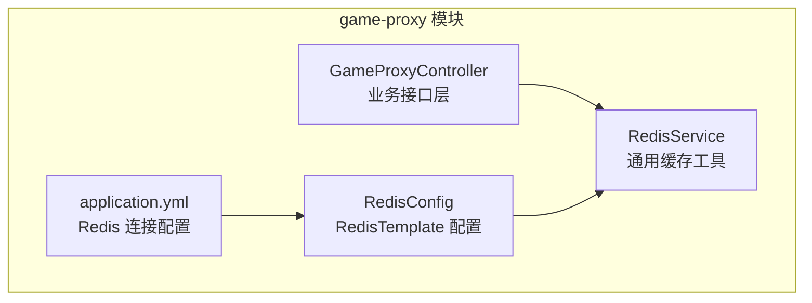
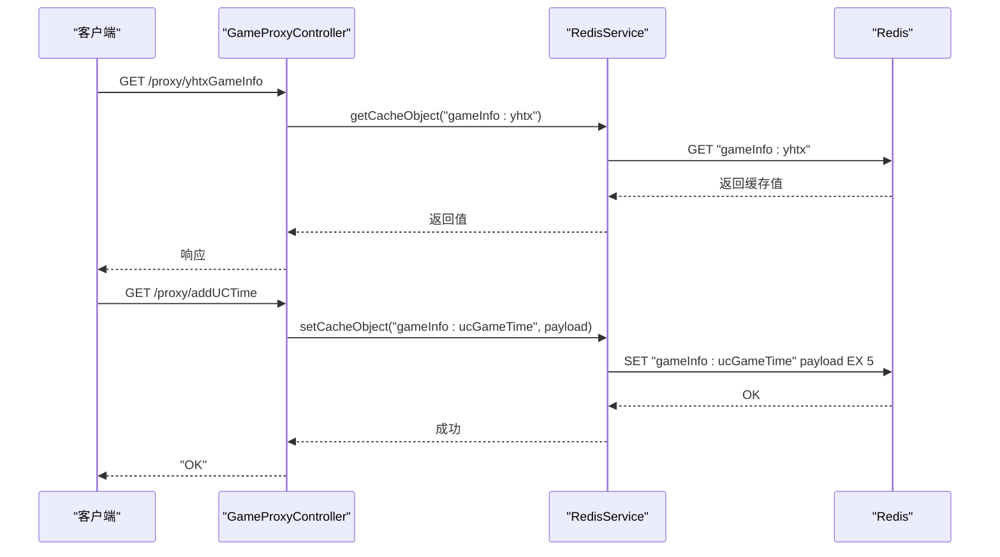
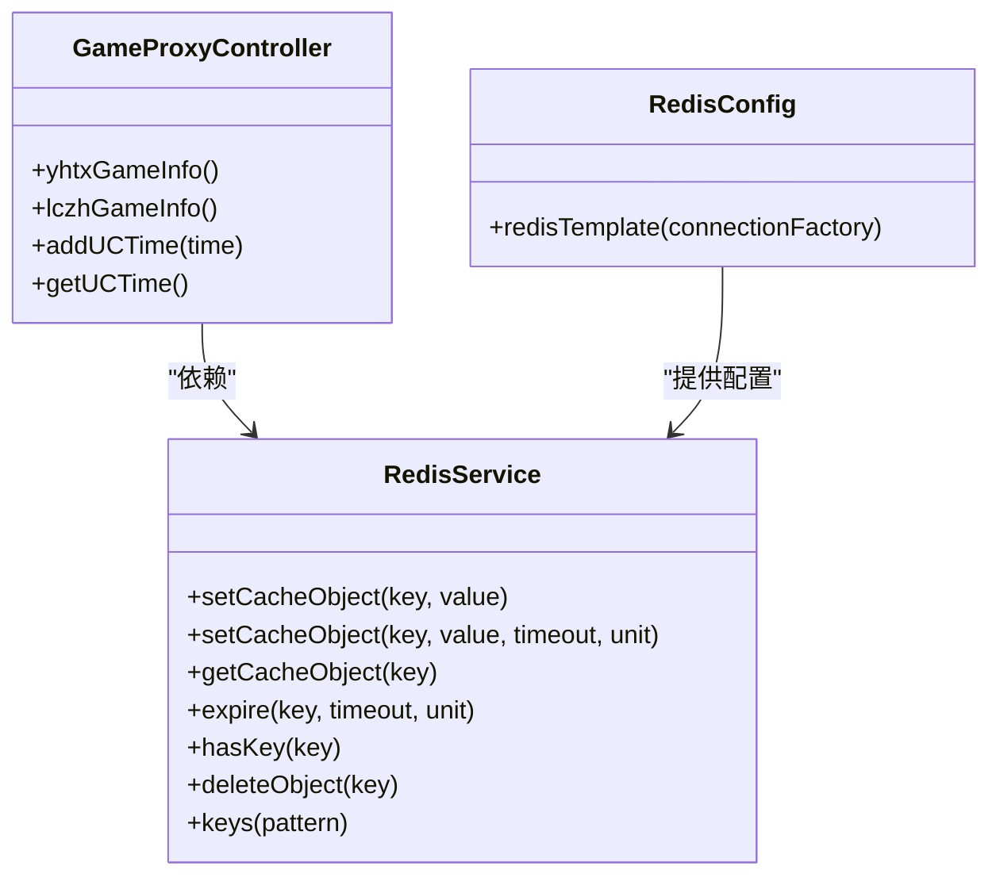

# 缓存策略设计

<cite>
**本文档引用的文件**
- [RedisConfig.java](file://game-proxy/src/main/java/com/game/redis/RedisConfig.java)
- [RedisService.java](file://game-proxy/src/main/java/com/game/redis/RedisService.java)
- [GameProxyController.java](file://game-proxy/src/main/java/com/game/controller/GameProxyController.java)
- [application.yml](file://game-proxy/src/main/resources/application.yml)
- [RedisTest.java](file://game-proxy/src/test/java/RedisTest.java)
</cite>

## 目录
1. [简介](#简介)
2. [项目结构](#项目结构)
3. [核心组件](#核心组件)
4. [架构总览](#架构总览)
5. [详细组件分析](#详细组件分析)
6. [依赖关系分析](#依赖关系分析)
7. [性能考量](#性能考量)
8. [故障排查指南](#故障排查指南)
9. [结论](#结论)
10. [附录](#附录)

## 简介
本文件面向缓存策略设计，结合仓库中实际的Redis实现与业务使用，系统性阐述缓存键命名规范与设计原则、过期时间策略、数据类型选择策略、常见缓存问题的预防与解决、一致性保障策略以及缓存预热、批量操作与事务处理的最佳实践。目标是帮助读者在不直接阅读源码的情况下，也能快速理解并应用这些策略。

## 项目结构
本项目采用模块化组织，其中与缓存直接相关的实现集中在 game-proxy 模块：
- Redis 配置与工具类：位于 redis 包，负责序列化、模板配置与通用缓存操作封装
- 控制器层：通过注入 RedisService 实现对不同业务键的读取与写入
- 配置文件：定义Redis连接参数与连接池配置

图表来源
- [RedisConfig.java](file://game-proxy/src/main/java/com/game/redis/RedisConfig.java#L27-L39)
- [RedisService.java](file://game-proxy/src/main/java/com/game/redis/RedisService.java#L20-L22)
- [GameProxyController.java](file://game-proxy/src/main/java/com/game/controller/GameProxyController.java#L82-L83)
- [application.yml](file://game-proxy/src/main/resources/application.yml#L15-L30)

章节来源
- [RedisConfig.java](file://game-proxy/src/main/java/com/game/redis/RedisConfig.java#L1-L41)
- [RedisService.java](file://game-proxy/src/main/java/com/game/redis/RedisService.java#L1-L244)
- [GameProxyController.java](file://game-proxy/src/main/java/com/game/controller/GameProxyController.java#L1-L200)
- [application.yml](file://game-proxy/src/main/resources/application.yml#L1-L58)

## 核心组件
- RedisConfig：定义 RedisTemplate 的序列化策略（key/value 使用 String 和 JSON），确保跨模块一致的序列化行为
- RedisService：封装常用缓存操作（字符串、列表、集合、哈希），提供过期时间设置、键存在性判断、批量键查询等能力
- GameProxyController：业务接口层，通过 RedisService 读取或写入特定业务键，如游戏信息、时间戳等
- application.yml：集中管理 Redis 连接参数与连接池配置

章节来源
- [RedisConfig.java](file://game-proxy/src/main/java/com/game/redis/RedisConfig.java#L27-L39)
- [RedisService.java](file://game-proxy/src/main/java/com/game/redis/RedisService.java#L20-L243)
- [GameProxyController.java](file://game-proxy/src/main/java/com/game/controller/GameProxyController.java#L82-L200)
- [application.yml](file://game-proxy/src/main/resources/application.yml#L15-L30)

## 架构总览
下图展示从控制器到缓存的调用链路与数据流向，体现键命名、过期策略与数据类型的使用方式。

图表来源
- [GameProxyController.java](file://game-proxy/src/main/java/com/game/controller/GameProxyController.java#L90-L105)
- [GameProxyController.java](file://game-proxy/src/main/java/com/game/controller/GameProxyController.java#L184-L208)
- [RedisService.java](file://game-proxy/src/main/java/com/game/redis/RedisService.java#L30-L44)

## 详细组件分析

### 缓存键命名规范与设计原则
- 前缀命名：使用领域/业务域前缀区分功能域，如 "gameInfo:" 前缀用于存放游戏相关信息
- 业务标识符组合：在前缀后追加具体业务标识，如 ":yhtx"、":lczh"、":ucGameTime" 等，形成清晰的业务语义
- 层级结构设计：建议采用 "域:子域:资源" 或 "域:业务:维度" 的层级，便于按域检索与清理
- 命名一致性：统一使用小写与冒号分隔，避免大小写与特殊字符差异导致的键冲突

参考实现位置
- [GameProxyController.java](file://game-proxy/src/main/java/com/game/controller/GameProxyController.java#L90-L128)
- [GameProxyController.java](file://game-proxy/src/main/java/com/game/controller/GameProxyController.java#L184-L208)

章节来源
- [GameProxyController.java](file://game-proxy/src/main/java/com/game/controller/GameProxyController.java#L90-L128)
- [GameProxyController.java](file://game-proxy/src/main/java/com/game/controller/GameProxyController.java#L184-L208)

### 过期时间策略
- 固定过期时间：适用于短期有效且周期固定的缓存，如上报的游戏时间缓存设置固定过期时间
- 动态过期时间：根据业务状态或外部条件调整过期，例如根据当前时间偏移计算到期点
- 绝对过期：明确指定到期时间点，适合严格时效性的数据
- 滑动过期：在访问时延长有效期，适合高频访问但生命周期不确定的热点数据

实现要点
- RedisService 提供带过期时间的 set 接口，支持传入时间单位
- 控制器层在写入时显式设置过期时间，确保缓存生命周期可控

参考实现位置
- [RedisService.java](file://game-proxy/src/main/java/com/game/redis/RedisService.java#L34-L44)
- [GameProxyController.java](file://game-proxy/src/main/java/com/game/controller/GameProxyController.java#L195-L196)

章节来源
- [RedisService.java](file://game-proxy/src/main/java/com/game/redis/RedisService.java#L34-L44)
- [GameProxyController.java](file://game-proxy/src/main/java/com/game/controller/GameProxyController.java#L184-L208)

### 数据类型选择策略
- 字符串缓存：适合简单值或序列化后的对象，读写简单，适合键值对存储
- 哈希缓存：适合对象字段的局部更新与读取，减少整体序列化开销
- 列表缓存：适合顺序数据或队列场景，支持范围读取
- 集合缓存：适合去重与成员关系判断

性能对比与选择建议
- 字符串：整体序列化/反序列化成本较低，适合频繁读写的简单值
- 哈希：字段级读写更灵活，适合对象部分字段更新
- 列表：范围读取效率高，适合需要按序遍历的场景
- 集合：去重与交并运算高效，适合权限/标签等集合操作

参考实现位置
- [RedisService.java](file://game-proxy/src/main/java/com/game/redis/RedisService.java#L120-L139)
- [RedisService.java](file://game-proxy/src/main/java/com/game/redis/RedisService.java#L141-L165)
- [RedisService.java](file://game-proxy/src/main/java/com/game/redis/RedisService.java#L167-L187)

章节来源
- [RedisService.java](file://game-proxy/src/main/java/com/game/redis/RedisService.java#L120-L187)

### 缓存穿透、击穿、雪崩的预防机制
- 缓存穿透：对不存在的键进行空值缓存并设置短过期，避免持续打后端
- 缓存击穿：热点键设置互斥锁或短时间永不过期，配合异步刷新
- 缓存雪崩：为过期时间增加随机抖动，避免同一时刻大面积过期

实现建议
- 在读取前先判断键是否存在，不存在时返回空值并设置短过期
- 热点键采用本地互斥锁或分布式锁，避免并发重建
- 批量过期时加入随机秒数，分散到期高峰

[本节为通用策略说明，不直接分析具体文件]

### 缓存一致性保证策略
- 读写策略：先写后读或先读后写，结合业务幂等性设计
- 更新策略：写入新值并设置合理过期，避免脏读
- 删除策略：删除键或清空集合，确保后续读取触发重建

参考实现位置
- [RedisService.java](file://game-proxy/src/main/java/com/game/redis/RedisService.java#L100-L117)
- [RedisService.java](file://game-proxy/src/main/java/com/game/redis/RedisService.java#L230-L232)

章节来源
- [RedisService.java](file://game-proxy/src/main/java/com/game/redis/RedisService.java#L100-L117)
- [RedisService.java](file://game-proxy/src/main/java/com/game/redis/RedisService.java#L230-L232)

### 缓存预热、批量操作与事务处理最佳实践
- 缓存预热：启动阶段或定时任务批量写入热点键，降低冷启动延迟
- 批量操作：使用批量写入接口一次性写入多个键值，减少网络往返
- 事务处理：对强一致要求的场景，采用事务或Lua脚本保证原子性

参考实现位置
- [RedisService.java](file://game-proxy/src/main/java/com/game/redis/RedisService.java#L126-L129)
- [RedisService.java](file://game-proxy/src/main/java/com/game/redis/RedisService.java#L240-L242)

章节来源
- [RedisService.java](file://game-proxy/src/main/java/com/game/redis/RedisService.java#L126-L129)
- [RedisService.java](file://game-proxy/src/main/java/com/game/redis/RedisService.java#L240-L242)

## 依赖关系分析
- 控制器依赖 RedisService 进行缓存读写
- RedisService 依赖 RedisTemplate 进行底层操作
- RedisConfig 为 RedisService 提供统一的序列化与连接配置

图表来源
- [GameProxyController.java](file://game-proxy/src/main/java/com/game/controller/GameProxyController.java#L82-L208)
- [RedisService.java](file://game-proxy/src/main/java/com/game/redis/RedisService.java#L20-L243)
- [RedisConfig.java](file://game-proxy/src/main/java/com/game/redis/RedisConfig.java#L27-L39)

章节来源
- [GameProxyController.java](file://game-proxy/src/main/java/com/game/controller/GameProxyController.java#L82-L208)
- [RedisService.java](file://game-proxy/src/main/java/com/game/redis/RedisService.java#L20-L243)
- [RedisConfig.java](file://game-proxy/src/main/java/com/game/redis/RedisConfig.java#L27-L39)

## 性能考量
- 序列化策略：统一使用JSON序列化，减少跨语言/跨模块兼容问题
- 连接池配置：合理设置最大连接数、最大空闲与最小空闲，避免连接争用
- 键空间设计：避免过多零散键，可采用哈希聚合热点字段
- 过期策略：为不同业务设置差异化过期时间，平衡命中率与内存占用

章节来源
- [RedisConfig.java](file://game-proxy/src/main/java/com/game/redis/RedisConfig.java#L31-L36)
- [application.yml](file://game-proxy/src/main/resources/application.yml#L23-L30)

## 故障排查指南
- 键不存在：使用 hasKey 判断键是否存在，避免空指针
- 过期时间异常：通过 getExpire 查询剩余时间，确认过期逻辑
- 批量键清理：使用 keys(pattern) 获取匹配键集合，再批量删除
- 测试验证：通过单元测试验证缓存读写与过期行为

参考实现位置
- [RedisService.java](file://game-proxy/src/main/java/com/game/redis/RedisService.java#L79-L87)
- [RedisService.java](file://game-proxy/src/main/java/com/game/redis/RedisService.java#L75-L77)
- [RedisService.java](file://game-proxy/src/main/java/com/game/redis/RedisService.java#L240-L242)
- [RedisTest.java](file://game-proxy/src/test/java/RedisTest.java#L33-L94)

章节来源
- [RedisService.java](file://game-proxy/src/main/java/com/game/redis/RedisService.java#L75-L87)
- [RedisService.java](file://game-proxy/src/main/java/com/game/redis/RedisService.java#L240-L242)
- [RedisTest.java](file://game-proxy/src/test/java/RedisTest.java#L33-L94)

## 结论
本项目通过统一的 Redis 配置与工具类，结合控制器层的业务键命名与过期策略，形成了可维护、可扩展的缓存体系。建议在现有基础上进一步完善：
- 明确各业务域的键命名规范与过期策略清单
- 引入缓存监控与告警，跟踪命中率与过期情况
- 对热点键引入本地缓存与互斥锁，降低Redis压力
- 在关键路径上增加缓存降级与熔断策略，提升系统韧性

[本节为总结性内容，不直接分析具体文件]

## 附录
- Redis 连接与池化配置参考：[application.yml](file://game-proxy/src/main/resources/application.yml#L15-L30)
- RedisTemplate 序列化配置参考：[RedisConfig.java](file://game-proxy/src/main/java/com/game/redis/RedisConfig.java#L31-L36)
- 业务键使用示例参考：[GameProxyController.java](file://game-proxy/src/main/java/com/game/controller/GameProxyController.java#L90-L128)