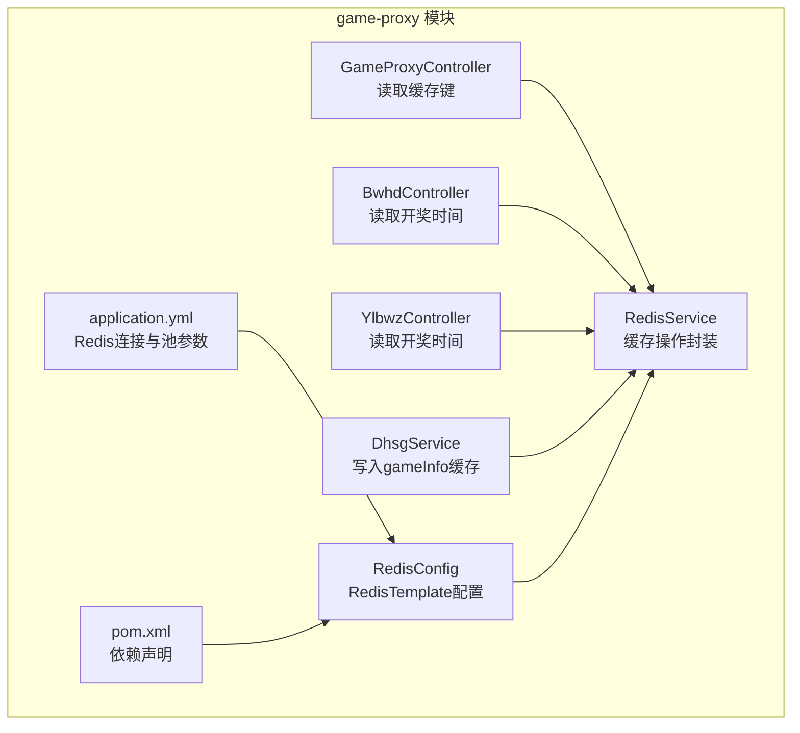
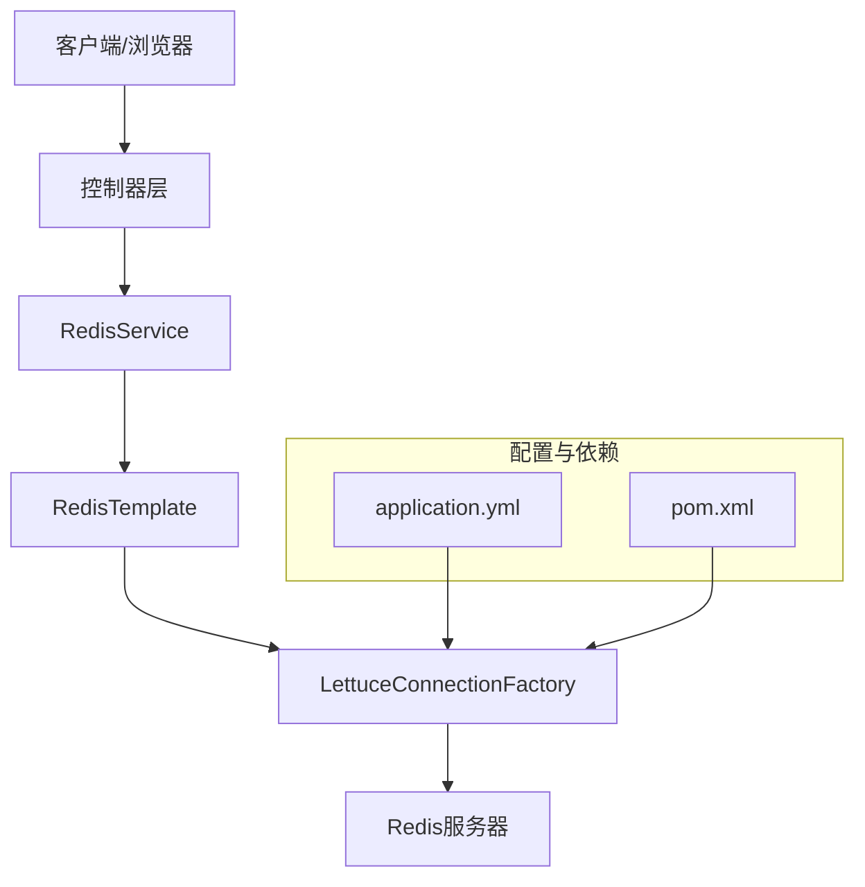
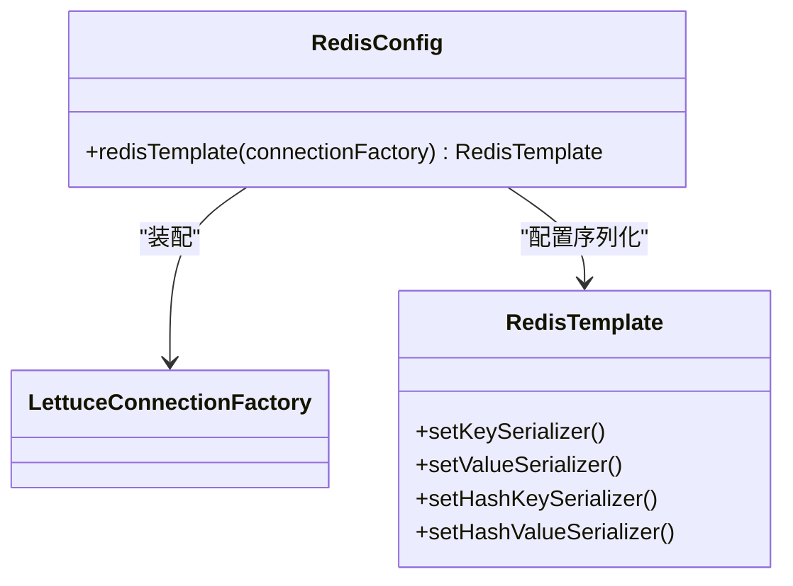
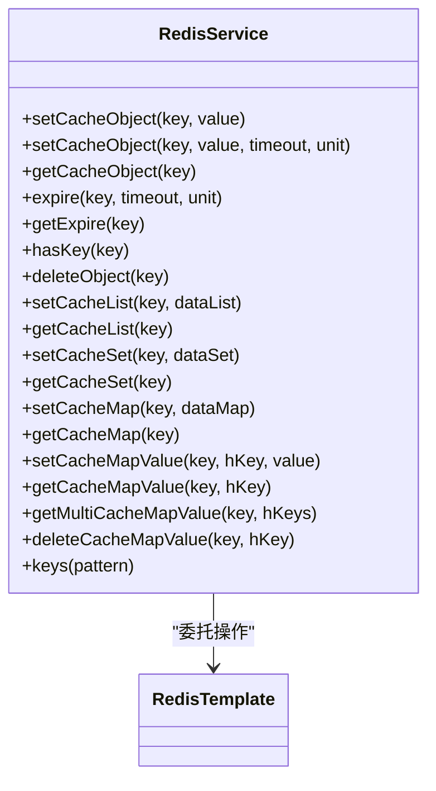
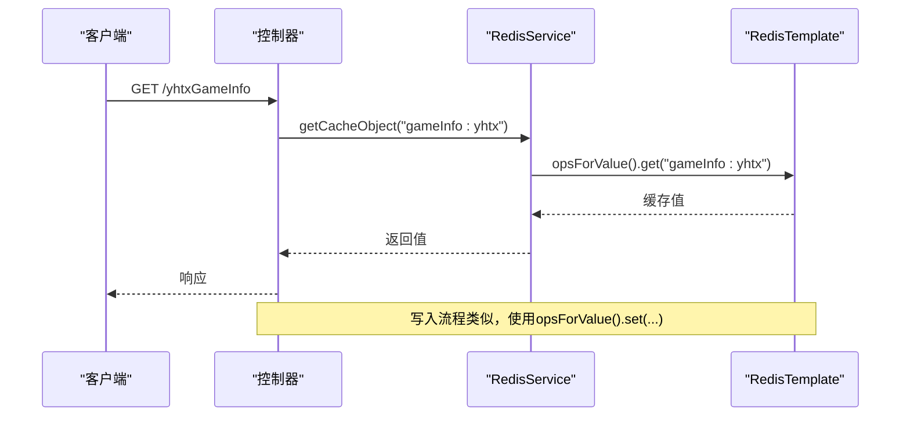
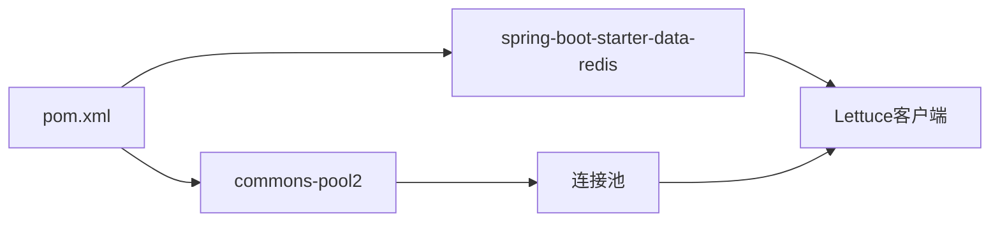

# 缓存管理系统

<cite>
**本文引用的文件**
- [RedisConfig.java](file://game-proxy/src/main/java/com/game/redis/RedisConfig.java)
- [RedisService.java](file://game-proxy/src/main/java/com/game/redis/RedisService.java)
- [application.yml](file://game-proxy/src/main/resources/application.yml)
- [pom.xml](file://game-proxy/pom.xml)
- [GameProxyController.java](file://game-proxy/src/main/java/com/game/controller/GameProxyController.java)
- [BwhdController.java](file://game-proxy/src/main/java/com/game/gcbwz/BwhdController.java)
- [YlbwzController.java](file://game-proxy/src/main/java/com/game/ylbwz/YlbwzController.java)
- [DhsgService.java](file://game-proxy/src/main/java/com/game/douyu/dahsg/DhsgService.java)
- [SpringUtils.java](file://game-proxy/src/main/java/com/game/utils/SpringUtils.java)
- [RedisTest.java](file://game-proxy/src/test/java/RedisTest.java)
</cite>

## 目录
1. [简介](#简介)
2. [项目结构](#项目结构)
3. [核心组件](#核心组件)
4. [架构总览](#架构总览)
5. [详细组件分析](#详细组件分析)
6. [依赖关系分析](#依赖关系分析)
7. [性能考虑](#性能考虑)
8. [故障排查指南](#故障排查指南)
9. [结论](#结论)
10. [附录](#附录)

## 简介
本技术文档围绕Redis缓存管理系统展开，系统基于Spring Boot与Lettuce客户端实现，提供统一的Redis访问封装与配置。文档重点覆盖以下方面：
- Redis配置与连接管理：连接工厂、序列化策略、连接池参数、超时设置
- 缓存策略设计：数据类型选择、键命名规范、过期时间策略、内存管理
- RedisService接口能力：字符串、哈希、列表、集合等数据类型的增删改查
- 缓存失效机制、数据一致性与并发控制
- 性能优化技巧、监控指标与故障排查
- Spring Redis配置最佳实践与扩展建议

## 项目结构
本项目采用多模块结构，Redis相关能力集中在game-proxy模块内，核心文件如下：
- 配置层：RedisConfig负责RedisTemplate与序列化配置
- 服务层：RedisService提供统一的缓存操作接口
- 控制器层：通过控制器读取缓存键值，如“gameInfo:*”、“lottery_open_time_*”
- 配置文件：application.yml集中管理Redis连接参数与连接池配置
- 依赖管理：pom.xml引入spring-boot-starter-data-redis与commons-pool2

图表来源
- [RedisConfig.java](file://game-proxy/src/main/java/com/game/redis/RedisConfig.java#L27-L39)
- [RedisService.java](file://game-proxy/src/main/java/com/game/redis/RedisService.java#L20-L244)
- [GameProxyController.java](file://game-proxy/src/main/java/com/game/controller/GameProxyController.java#L82-L183)
- [BwhdController.java](file://game-proxy/src/main/java/com/game/gcbwz/BwhdController.java#L23-L70)
- [YlbwzController.java](file://game-proxy/src/main/java/com/game/ylbwz/YlbwzController.java#L23-L72)
- [DhsgService.java](file://game-proxy/src/main/java/com/game/douyu/dahsg/DhsgService.java#L46-L69)
- [application.yml](file://game-proxy/src/main/resources/application.yml#L15-L30)
- [pom.xml](file://game-proxy/pom.xml#L76-L81)

章节来源
- [RedisConfig.java](file://game-proxy/src/main/java/com/game/redis/RedisConfig.java#L10-L41)
- [application.yml](file://game-proxy/src/main/resources/application.yml#L15-L30)
- [pom.xml](file://game-proxy/pom.xml#L76-L81)

## 核心组件
- RedisConfig：定义RedisTemplate并设置key/value与hash的序列化策略，确保跨模块一致的序列化行为
- RedisService：面向业务的缓存操作封装，提供对象、列表、集合、哈希等数据类型的常用操作，并支持过期时间设置与查询
- 控制器与服务：通过注入RedisService实现对缓存的读取与写入，典型键如“gameInfo:*”、“lottery_open_time_*”

章节来源
- [RedisConfig.java](file://game-proxy/src/main/java/com/game/redis/RedisConfig.java#L27-L39)
- [RedisService.java](file://game-proxy/src/main/java/com/game/redis/RedisService.java#L20-L244)
- [GameProxyController.java](file://game-proxy/src/main/java/com/game/controller/GameProxyController.java#L90-L183)
- [BwhdController.java](file://game-proxy/src/main/java/com/game/gcbwz/BwhdController.java#L63-L69)
- [YlbwzController.java](file://game-proxy/src/main/java/com/game/ylbwz/YlbwzController.java#L66-L71)
- [DhsgService.java](file://game-proxy/src/main/java/com/game/douyu/dahsg/DhsgService.java#L61)

## 架构总览
系统通过Spring容器装配RedisTemplate，RedisService作为业务入口，控制器与服务层通过依赖注入使用RedisService进行缓存读写。

图表来源
- [RedisService.java](file://game-proxy/src/main/java/com/game/redis/RedisService.java#L20-L244)
- [RedisConfig.java](file://game-proxy/src/main/java/com/game/redis/RedisConfig.java#L27-L39)
- [application.yml](file://game-proxy/src/main/resources/application.yml#L15-L30)
- [pom.xml](file://game-proxy/pom.xml#L76-L81)

## 详细组件分析

### Redis配置与连接管理
- 连接工厂与序列化
  - 使用LettuceConnectionFactory作为连接工厂
  - RedisTemplate设置key/value与hash的序列化器：StringRedisSerializer与GenericJackson2JsonRedisSerializer
  - 作用：确保键值与对象序列化一致，避免乱码与反序列化问题
- 连接池与超时
  - 连接池参数：最大活跃连接、最大空闲、最小空闲
  - 超时设置：连接超时、读写超时
  - 作用：提升连接复用效率，降低网络抖动影响
- 集群模式支持
  - 当前配置为单机模式（host/port），未见集群或哨兵配置项
  - 如需集群/哨兵，请在连接工厂处增加相应配置

图表来源
- [RedisConfig.java](file://game-proxy/src/main/java/com/game/redis/RedisConfig.java#L27-L39)

章节来源
- [RedisConfig.java](file://game-proxy/src/main/java/com/game/redis/RedisConfig.java#L10-L41)
- [application.yml](file://game-proxy/src/main/resources/application.yml#L15-L30)
- [pom.xml](file://game-proxy/pom.xml#L76-L81)

### 缓存策略设计
- 数据类型选择
  - 字符串：适合简单键值缓存，如“gameInfo:*”、“lottery_open_time_*”
  - 哈希：适合结构化对象，如用户信息、游戏状态
  - 列表/集合：适合去重与顺序场景（如任务队列、白名单）
- 键命名规范
  - 建议采用“业务域:实体:标识”的层级命名，如“gameInfo:dahsg:20241201”
  - 与现有键保持一致，便于统一管理与清理
- 过期时间策略
  - 写入时可设置TTL，读取前检查过期时间，结合业务刷新策略
  - 对热点数据可设置较短TTL，配合预热与异步更新
- 内存管理
  - 合理设置过期时间，避免无界增长
  - 使用批量操作减少网络往返与序列化开销

章节来源
- [RedisService.java](file://game-proxy/src/main/java/com/game/redis/RedisService.java#L30-L44)
- [RedisService.java](file://game-proxy/src/main/java/com/game/redis/RedisService.java#L126-L139)
- [RedisService.java](file://game-proxy/src/main/java/com/game/redis/RedisService.java#L148-L165)
- [RedisService.java](file://game-proxy/src/main/java/com/game/redis/RedisService.java#L173-L187)
- [RedisService.java](file://game-proxy/src/main/java/com/game/redis/RedisService.java#L196-L210)

### RedisService接口能力
- 对象缓存
  - 支持设置与读取任意对象，可带TTL
  - 提供存在性判断与删除
- 列表缓存
  - 支持批量右推入队，读取全量列表
- 集合缓存
  - 支持批量添加与成员查询
- 哈希缓存
  - 支持整表写入、读取、按字段读取、批量读取、删除字段
- 其他
  - 批量键查询、过期时间设置与查询、存在性判断

图表来源
- [RedisService.java](file://game-proxy/src/main/java/com/game/redis/RedisService.java#L20-L244)

章节来源
- [RedisService.java](file://game-proxy/src/main/java/com/game/redis/RedisService.java#L24-L117)
- [RedisService.java](file://game-proxy/src/main/java/com/game/redis/RedisService.java#L119-L232)
- [RedisService.java](file://game-proxy/src/main/java/com/game/redis/RedisService.java#L234-L242)

### 缓存失效机制、一致性与并发控制
- 失效机制
  - 显式过期：通过expire设置TTL
  - 主动删除：deleteObject与deleteCacheMapValue
  - 批量清理：keys(pattern)后批量删除
- 一致性
  - 写入后立即更新缓存，或在写入成功后再删除旧缓存键
  - 对于热点数据，采用“先读缓存，再回源更新”的双写策略
- 并发控制
  - 使用分布式锁（如Redis SET key value NX EX ttl）避免缓存击穿
  - 对高并发读取场景，可采用“读多写少”的缓存预热策略

章节来源
- [RedisService.java](file://game-proxy/src/main/java/com/game/redis/RedisService.java#L53-L77)
- [RedisService.java](file://game-proxy/src/main/java/com/game/redis/RedisService.java#L105-L117)
- [RedisService.java](file://game-proxy/src/main/java/com/game/redis/RedisService.java#L240-L242)

### 使用示例与调用流程
- 控制器读取缓存
  - 通过RedisService读取“gameInfo:*”与“lottery_open_time_*”键
- 服务写入缓存
  - 在定时任务或业务逻辑中写入gameInfo缓存，供控制器读取

图表来源
- [GameProxyController.java](file://game-proxy/src/main/java/com/game/controller/GameProxyController.java#L90-L94)
- [RedisService.java](file://game-proxy/src/main/java/com/game/redis/RedisService.java#L95-L98)

章节来源
- [GameProxyController.java](file://game-proxy/src/main/java/com/game/controller/GameProxyController.java#L90-L183)
- [BwhdController.java](file://game-proxy/src/main/java/com/game/gcbwz/BwhdController.java#L63-L69)
- [YlbwzController.java](file://game-proxy/src/main/java/com/game/ylbwz/YlbwzController.java#L66-L71)
- [DhsgService.java](file://game-proxy/src/main/java/com/game/douyu/dahsg/DhsgService.java#L61)

## 依赖关系分析
- Redis依赖
  - spring-boot-starter-data-redis：提供Redis自动配置与模板
  - commons-pool2：提供Jedis/Lettuce连接池
- 版本与兼容性
  - Spring Boot版本为2.2.13.RELEASE，确保与Lettuce与Redis客户端兼容

图表来源
- [pom.xml](file://game-proxy/pom.xml#L76-L81)

章节来源
- [pom.xml](file://game-proxy/pom.xml#L76-L81)

## 性能考虑
- 连接池优化
  - 合理设置max-active与max-idle，避免连接过多导致Redis压力过大
  - 监控连接池使用率与阻塞等待时间
- 序列化优化
  - 使用JSON序列化时注意字段变更与兼容性
  - 对大对象优先采用压缩或分片存储
- 批量操作
  - 使用批量写入（如rightPushAll、putAll）减少网络往返
- TTL策略
  - 热点数据短TTL+预热，冷数据长TTL+懒加载
- 监控指标
  - 连接池活跃数、阻塞数、Redis命中率、慢查询日志
- 故障排查
  - 关注连接超时、序列化异常、键空间过期与内存淘汰

## 故障排查指南
- 连接问题
  - 检查host/port/password与timeout配置
  - 观察连接池耗尽与超时错误
- 序列化问题
  - 确认key/value序列化策略一致
  - 排查对象字段变化导致的反序列化异常
- 键空间与过期
  - 使用keys(pattern)定位键，结合del批量清理
  - 检查TTL设置与过期事件
- 并发与一致性
  - 使用分布式锁避免竞态
  - 对热点键做预热与降级策略

章节来源
- [application.yml](file://game-proxy/src/main/resources/application.yml#L15-L30)
- [RedisService.java](file://game-proxy/src/main/java/com/game/redis/RedisService.java#L240-L242)

## 结论
本Redis缓存系统通过统一的RedisConfig与RedisService实现了清晰的配置与操作抽象，结合控制器与服务层的键命名规范与TTL策略，满足了多游戏模块的缓存需求。建议后续完善集群/哨兵配置、引入分布式锁与监控体系，并持续优化连接池与序列化策略以提升整体性能与稳定性。

## 附录
- 键命名参考
  - 游戏信息：gameInfo:{gameCode}
  - 开奖时间：lottery_open_time_{gameCode}
- 测试参考
  - 可参考RedisTest注释示例进行本地验证

章节来源
- [RedisTest.java](file://game-proxy/src/test/java/RedisTest.java#L37-L92)