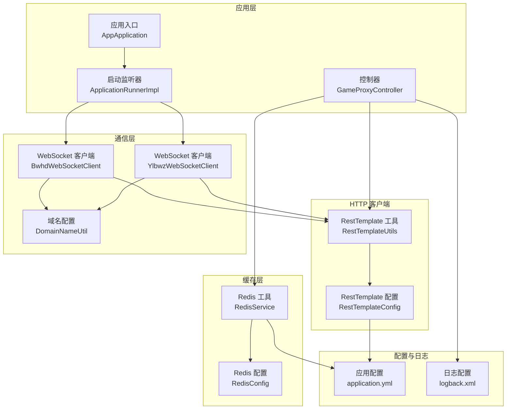
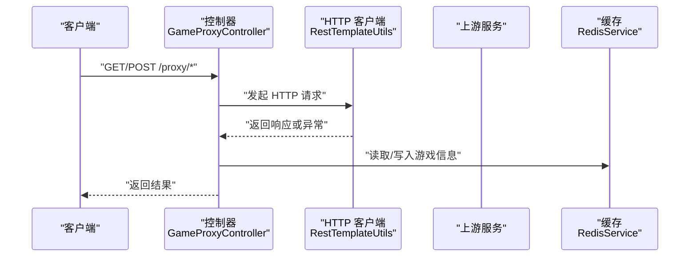
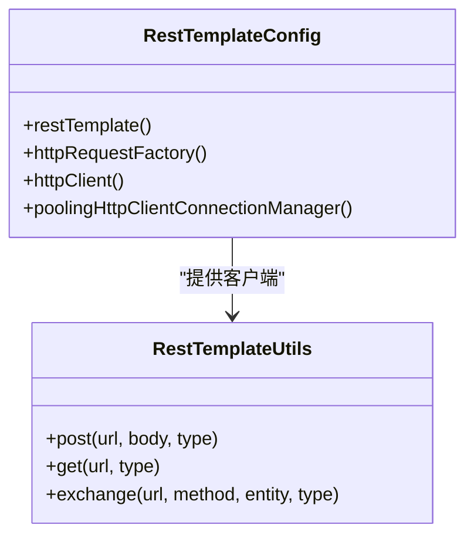
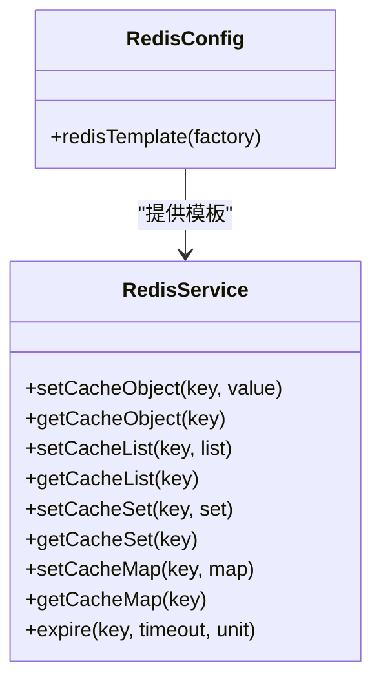
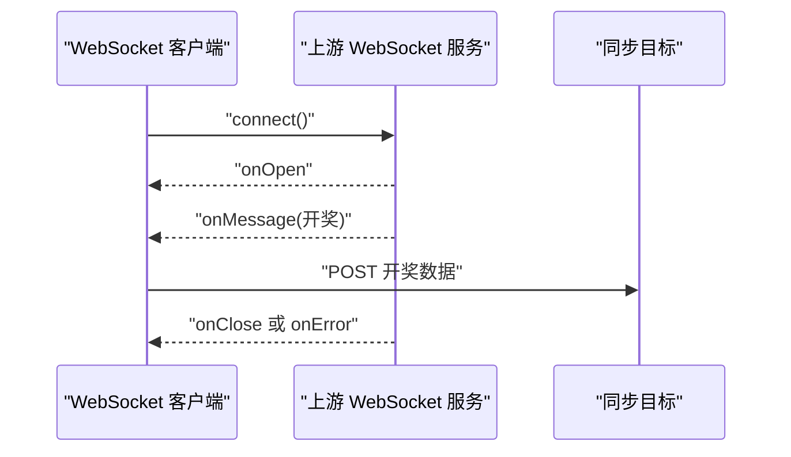
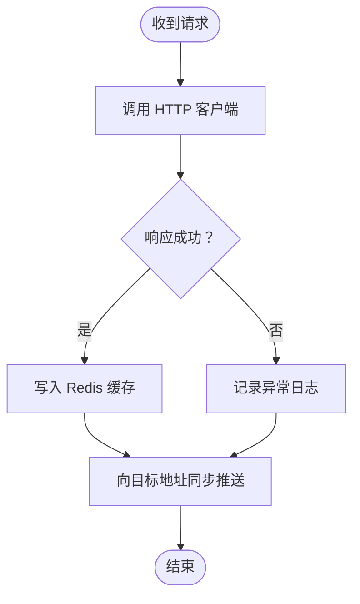
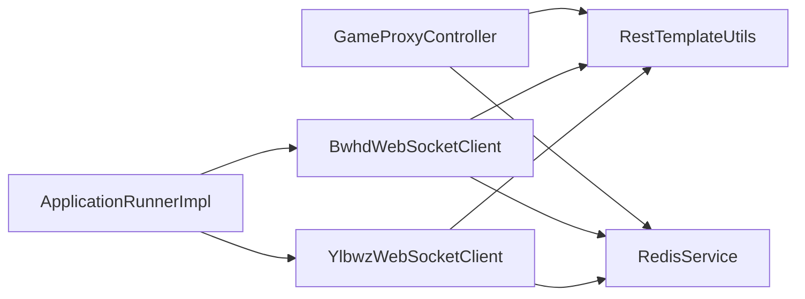

# 故障排除指南

<cite>
**本文引用的文件**
- [application.yml](file://game-proxy/src/main/resources/application.yml)
- [logback.xml](file://game-proxy/src/main/resources/logback.xml)
- [RestTemplateConfig.java](file://game-proxy/src/main/java/com/game/commom/RestTemplateConfig.java)
- [RestTemplateUtils.java](file://game-proxy/src/main/java/com/game/commom/RestTemplateUtils.java)
- [RedisConfig.java](file://game-proxy/src/main/java/com/game/redis/RedisConfig.java)
- [RedisService.java](file://game-proxy/src/main/java/com/game/redis/RedisService.java)
- [BwhdWebSocketClient.java](file://game-proxy/src/main/java/com/game/gcbwz/BwhdWebSocketClient.java)
- [YlbwzWebSocketClient.java](file://game-proxy/src/main/java/com/game/ylbwz/YlbwzWebSocketClient.java)
- [GameProxyController.java](file://game-proxy/src/main/java/com/game/controller/GameProxyController.java)
- [SpringUtils.java](file://game-proxy/src/main/java/com/game/utils/SpringUtils.java)
- [SSLUtil.java](file://game-proxy/src/main/java/com/game/utils/SSLUtil.java)
- [DomainNameUtil.java](file://game-proxy/src/main/java/com/game/utils/DomainNameUtil.java)
- [AppApplication.java](file://game-proxy/src/main/java/com/game/AppApplication.java)
- [ApplicationRunnerImpl.java](file://game-proxy/src/main/java/com/game/listener/ApplicationRunnerImpl.java)
- [GameRestartService.java](file://game-proxy/src/main/java/com/game/GameRestartService.java)
- [RedisTest.java](file://game-proxy/src/test/java/RedisTest.java)
</cite>

## 目录
1. [简介](#简介)
2. [项目结构](#项目结构)
3. [核心组件](#核心组件)
4. [架构总览](#架构总览)
5. [详细组件分析](#详细组件分析)
6. [依赖关系分析](#依赖关系分析)
7. [性能与稳定性考量](#性能与稳定性考量)
8. [故障排除指南](#故障排除指南)
9. [结论](#结论)
10. [附录](#附录)

## 简介
本指南面向游戏代理系统的运维与开发人员，提供系统性的故障诊断方法与解决方案，覆盖以下方面：
- 服务启动失败的常见原因与修复步骤
- Redis 连接异常（连接超时、认证失败、网络不通）的排查与解决
- API 调用超时与失败（网络问题、服务不可用、参数错误）的处理
- WebSocket 连接问题（连接建立失败、消息丢失、连接中断）的排查
- HTTP 客户端异常（SSL 证书、超时配置、重试机制）的处理
- 日志分析技巧与错误信息解读
- 常见故障的快速修复脚本与应急处理预案

## 项目结构
该系统采用 Spring Boot 架构，核心模块包括：
- 控制层：对外提供代理接口与查询接口
- 通用配置：HTTP 客户端连接池、超时与重试策略
- 缓存层：Redis 连接与工具类
- 通信层：WebSocket 客户端与 HTTP 同步推送
- 启动与调度：应用启动监听器与定时重启服务
- 日志：统一的日志配置与输出策略

**图表来源**
- [AppApplication.java](file://game-proxy/src/main/java/com/game/AppApplication.java#L15-L31)
- [ApplicationRunnerImpl.java](file://game-proxy/src/main/java/com/game/listener/ApplicationRunnerImpl.java#L33-L96)
- [GameProxyController.java](file://game-proxy/src/main/java/com/game/controller/GameProxyController.java#L37-L39)
- [RestTemplateConfig.java](file://game-proxy/src/main/java/com/game/commom/RestTemplateConfig.java#L34-L131)
- [RestTemplateUtils.java](file://game-proxy/src/main/java/com/game/commom/RestTemplateUtils.java#L14-L49)
- [RedisConfig.java](file://game-proxy/src/main/java/com/game/redis/RedisConfig.java#L11-L39)
- [RedisService.java](file://game-proxy/src/main/java/com/game/redis/RedisService.java#L20-L243)
- [BwhdWebSocketClient.java](file://game-proxy/src/main/java/com/game/gcbwz/BwhdWebSocketClient.java#L27-L172)
- [YlbwzWebSocketClient.java](file://game-proxy/src/main/java/com/game/ylbwz/YlbwzWebSocketClient.java#L55-L166)
- [DomainNameUtil.java](file://game-proxy/src/main/java/com/game/utils/DomainNameUtil.java#L4-L12)
- [application.yml](file://game-proxy/src/main/resources/application.yml#L1-L58)
- [logback.xml](file://game-proxy/src/main/resources/logback.xml#L1-L75)

**章节来源**
- [AppApplication.java](file://game-proxy/src/main/java/com/game/AppApplication.java#L15-L31)
- [ApplicationRunnerImpl.java](file://game-proxy/src/main/java/com/game/listener/ApplicationRunnerImpl.java#L33-L96)
- [application.yml](file://game-proxy/src/main/resources/application.yml#L1-L58)
- [logback.xml](file://game-proxy/src/main/resources/logback.xml#L1-L75)

## 核心组件
- HTTP 客户端与连接池
  - 通过 RestTemplateConfig 统一配置连接超时、读取超时、连接池大小、并发限制与重试策略
  - RestTemplateUtils 提供静态封装，简化 GET/POST/exchange 调用
- 缓存与序列化
  - RedisConfig 配置键值序列化策略，避免乱码与反序列化异常
  - RedisService 提供常用 CRUD 与集合操作，支持过期时间与批量操作
- WebSocket 客户端
  - BwhdWebSocketClient 与 YlbwzWebSocketClient 分别对接不同游戏服务，负责连接、消息处理与异常记录
- 控制器与同步
  - GameProxyController 提供代理接口与游戏信息缓存查询
  - 收到开奖消息后，向多个目标地址进行同步推送
- 启动与监控
  - ApplicationRunnerImpl 在应用启动时初始化各游戏服务与 WebSocket 客户端
  - GameRestartService 定时检测并重启异常服务

**章节来源**
- [RestTemplateConfig.java](file://game-proxy/src/main/java/com/game/commom/RestTemplateConfig.java#L34-L131)
- [RestTemplateUtils.java](file://game-proxy/src/main/java/com/game/commom/RestTemplateUtils.java#L14-L49)
- [RedisConfig.java](file://game-proxy/src/main/java/com/game/redis/RedisConfig.java#L11-L39)
- [RedisService.java](file://game-proxy/src/main/java/com/game/redis/RedisService.java#L20-L243)
- [BwhdWebSocketClient.java](file://game-proxy/src/main/java/com/game/gcbwz/BwhdWebSocketClient.java#L27-L172)
- [YlbwzWebSocketClient.java](file://game-proxy/src/main/java/com/game/ylbwz/YlbwzWebSocketClient.java#L55-L166)
- [GameProxyController.java](file://game-proxy/src/main/java/com/game/controller/GameProxyController.java#L37-L39)
- [ApplicationRunnerImpl.java](file://game-proxy/src/main/java/com/game/listener/ApplicationRunnerImpl.java#L33-L96)
- [GameRestartService.java](file://game-proxy/src/main/java/com/game/GameRestartService.java#L13-L55)

## 架构总览
系统通过控制器接收外部请求，利用 HTTP 客户端访问上游服务或进行同步推送；通过 Redis 缓存游戏状态与时间；通过 WebSocket 实时订阅开奖消息。

**图表来源**
- [GameProxyController.java](file://game-proxy/src/main/java/com/game/controller/GameProxyController.java#L51-L81)
- [RestTemplateUtils.java](file://game-proxy/src/main/java/com/game/commom/RestTemplateUtils.java#L26-L44)
- [RedisService.java](file://game-proxy/src/main/java/com/game/redis/RedisService.java#L95-L97)

## 详细组件分析

### HTTP 客户端与连接池（RestTemplate）
- 关键配置项
  - 连接超时、读取超时、连接池最大连接数、每路由最大连接数、空闲校验与空闲失效时间
- 默认行为
  - 使用 Apache HttpClient 连接池，启用 Keep-Alive 与默认请求头
  - 默认重试 2 次，支持“连接获取超时”场景
- 建议
  - 根据上游服务性能调整超时与连接池参数
  - 对高并发场景适当提高并发与连接上限

**图表来源**
- [RestTemplateConfig.java](file://game-proxy/src/main/java/com/game/commom/RestTemplateConfig.java#L62-L129)
- [RestTemplateUtils.java](file://game-proxy/src/main/java/com/game/commom/RestTemplateUtils.java#L14-L49)

**章节来源**
- [RestTemplateConfig.java](file://game-proxy/src/main/java/com/game/commom/RestTemplateConfig.java#L34-L131)
- [RestTemplateUtils.java](file://game-proxy/src/main/java/com/game/commom/RestTemplateUtils.java#L14-L49)
- [application.yml](file://game-proxy/src/main/resources/application.yml#L44-L57)

### 缓存与序列化（Redis）
- 序列化策略
  - Key 使用字符串序列化，Value 使用 JSON 序列化，避免乱码与类型不一致
- 常用操作
  - 字符串、List、Set、Hash 的增删查改与过期时间设置
- 建议
  - 对热点键设置合理 TTL，避免内存膨胀
  - 使用批量操作减少网络往返

**图表来源**
- [RedisConfig.java](file://game-proxy/src/main/java/com/game/redis/RedisConfig.java#L27-L39)
- [RedisService.java](file://game-proxy/src/main/java/com/game/redis/RedisService.java#L30-L242)

**章节来源**
- [RedisConfig.java](file://game-proxy/src/main/java/com/game/redis/RedisConfig.java#L11-L39)
- [RedisService.java](file://game-proxy/src/main/java/com/game/redis/RedisService.java#L20-L243)
- [application.yml](file://game-proxy/src/main/resources/application.yml#L15-L30)

### WebSocket 客户端
- 连接与状态
  - 通过构造函数传入 URI，内部维护连接与消息标志位
  - onOpen/onMessage/onClose/onError 回调用于记录状态与异常
- 同步逻辑
  - 收到特定消息后，遍历域名数组向多个目标地址进行同步推送
- 建议
  - 对连接状态进行健康检查与自动重连
  - 记录异常堆栈以便定位问题

**图表来源**
- [BwhdWebSocketClient.java](file://game-proxy/src/main/java/com/game/gcbwz/BwhdWebSocketClient.java#L64-L131)
- [YlbwzWebSocketClient.java](file://game-proxy/src/main/java/com/game/ylbwz/YlbwzWebSocketClient.java#L76-L138)
- [DomainNameUtil.java](file://game-proxy/src/main/java/com/game/utils/DomainNameUtil.java#L4-L12)

**章节来源**
- [BwhdWebSocketClient.java](file://game-proxy/src/main/java/com/game/gcbwz/BwhdWebSocketClient.java#L27-L172)
- [YlbwzWebSocketClient.java](file://game-proxy/src/main/java/com/game/ylbwz/YlbwzWebSocketClient.java#L55-L166)
- [DomainNameUtil.java](file://game-proxy/src/main/java/com/game/utils/DomainNameUtil.java#L4-L12)

### 控制器与同步推送
- 接口职责
  - 提供游戏代理接口与游戏信息查询接口
  - 写入/读取 Redis 缓存，用于跨服务共享状态
- 同步推送
  - 收到开奖结果后，向多个目标地址进行同步推送
  - 对异常进行日志记录与降级处理

**图表来源**
- [GameProxyController.java](file://game-proxy/src/main/java/com/game/controller/GameProxyController.java#L51-L81)
- [RestTemplateUtils.java](file://game-proxy/src/main/java/com/game/commom/RestTemplateUtils.java#L26-L44)
- [RedisService.java](file://game-proxy/src/main/java/com/game/redis/RedisService.java#L95-L97)

**章节来源**
- [GameProxyController.java](file://game-proxy/src/main/java/com/game/controller/GameProxyController.java#L37-L39)
- [RestTemplateUtils.java](file://game-proxy/src/main/java/com/game/commom/RestTemplateUtils.java#L14-L49)
- [RedisService.java](file://game-proxy/src/main/java/com/game/redis/RedisService.java#L20-L243)

## 依赖关系分析
- 组件耦合
  - 控制器依赖 HTTP 工具与 Redis 工具
  - WebSocket 客户端依赖 Redis 工具与 HTTP 工具
  - 启动监听器负责初始化各服务与客户端
- 外部依赖
  - Redis 服务器、上游游戏服务、WebSocket 服务
- 风险点
  - 单点故障：Redis 不可用导致缓存功能失效
  - 网络抖动：HTTP 超时与重试策略需合理配置
  - 异常未捕获：WebSocket 异常需统一记录与告警

**图表来源**
- [GameProxyController.java](file://game-proxy/src/main/java/com/game/controller/GameProxyController.java#L82-L83)
- [BwhdWebSocketClient.java](file://game-proxy/src/main/java/com/game/gcbwz/BwhdWebSocketClient.java#L34-L53)
- [YlbwzWebSocketClient.java](file://game-proxy/src/main/java/com/game/ylbwz/YlbwzWebSocketClient.java#L57-L57)
- [ApplicationRunnerImpl.java](file://game-proxy/src/main/java/com/game/listener/ApplicationRunnerImpl.java#L33-L96)

**章节来源**
- [GameProxyController.java](file://game-proxy/src/main/java/com/game/controller/GameProxyController.java#L82-L83)
- [BwhdWebSocketClient.java](file://game-proxy/src/main/java/com/game/gcbwz/BwhdWebSocketClient.java#L34-L53)
- [YlbwzWebSocketClient.java](file://game-proxy/src/main/java/com/game/ylbwz/YlbwzWebSocketClient.java#L57-L57)
- [ApplicationRunnerImpl.java](file://game-proxy/src/main/java/com/game/listener/ApplicationRunnerImpl.java#L33-L96)

## 性能与稳定性考量
- 连接池与超时
  - 合理设置连接池大小与并发上限，避免资源耗尽
  - 超时参数需结合上游服务响应时间与网络状况调整
- 缓存策略
  - 对高频读取的数据设置 TTL，避免缓存击穿
  - 使用批量操作减少网络往返
- WebSocket 健康检查
  - 定期检查连接状态，异常时自动重连
  - 对消息处理增加幂等与去重逻辑

[本节为通用建议，无需列出具体文件来源]

## 故障排除指南

### 一、服务启动失败
- 常见原因
  - 端口占用、上下文路径冲突
  - 配置文件缺失或参数错误
  - 启动监听器初始化异常
- 诊断步骤
  - 查看启动日志，确认端口与上下文路径
  - 检查 application.yml 中 server.port 与 server.servlet.context-path
  - 观察启动监听器日志，定位初始化失败的服务
- 修复建议
  - 修改端口或上下文路径
  - 修正配置项，确保 Redis 与 HTTP 参数正确
  - 临时注释有问题的初始化逻辑，逐步恢复

**章节来源**
- [AppApplication.java](file://game-proxy/src/main/java/com/game/AppApplication.java#L24-L31)
- [application.yml](file://game-proxy/src/main/resources/application.yml#L2-L5)
- [ApplicationRunnerImpl.java](file://game-proxy/src/main/java/com/game/listener/ApplicationRunnerImpl.java#L64-L96)

### 二、Redis 连接异常
- 常见症状
  - 连接超时、认证失败、网络不通
  - RedisTemplate 抛出异常或返回空值
- 诊断步骤
  - 检查 application.yml 中 host、port、password、timeout
  - 使用 Redis 客户端工具验证连通性与认证
  - 查看 RedisService 方法调用处是否有异常日志
- 修复建议
  - 校正密码与端口，确保网络可达
  - 调整连接池参数与超时时间
  - 如使用哨兵/集群，请补充相应配置

**章节来源**
- [application.yml](file://game-proxy/src/main/resources/application.yml#L15-L22)
- [RedisConfig.java](file://game-proxy/src/main/java/com/game/redis/RedisConfig.java#L27-L39)
- [RedisService.java](file://game-proxy/src/main/java/com/game/redis/RedisService.java#L30-L97)

### 三、API 调用超时与失败
- 常见原因
  - 上游服务不可用、网络延迟、参数错误
  - HTTP 客户端超时配置不当
- 诊断步骤
  - 检查 RestTemplateConfig 的超时与连接池配置
  - 观察 GameProxyController 中的异常日志
  - 使用 curl 或 Postman 验证上游接口
- 修复建议
  - 调整 connectTimeout、socketTimeout、connectionRequestTimeout
  - 增加重试策略或熔断降级
  - 校验请求参数与头部信息

**章节来源**
- [RestTemplateConfig.java](file://game-proxy/src/main/java/com/game/commom/RestTemplateConfig.java#L84-L107)
- [application.yml](file://game-proxy/src/main/resources/application.yml#L48-L53)
- [GameProxyController.java](file://game-proxy/src/main/java/com/game/controller/GameProxyController.java#L51-L81)

### 四、WebSocket 连接问题
- 常见症状
  - 连接建立失败、消息丢失、连接中断
- 诊断步骤
  - 检查 WebSocket 客户端 onOpen/onError/onClose 回调日志
  - 确认 DomainNameUtil 中的目标地址可访问
  - 观察同步推送过程中的异常日志
- 修复建议
  - 增加自动重连与心跳机制
  - 对异常进行统一记录与告警
  - 校验会话与鉴权参数

**章节来源**
- [BwhdWebSocketClient.java](file://game-proxy/src/main/java/com/game/gcbwz/BwhdWebSocketClient.java#L64-L131)
- [YlbwzWebSocketClient.java](file://game-proxy/src/main/java/com/game/ylbwz/YlbwzWebSocketClient.java#L76-L138)
- [DomainNameUtil.java](file://game-proxy/src/main/java/com/game/utils/DomainNameUtil.java#L4-L12)

### 五、HTTP 客户端异常
- 常见症状
  - SSL 证书错误、超时频繁、请求被拒
- 诊断步骤
  - 检查 SSLUtil 的信任策略（仅用于测试环境）
  - 查看 RestTemplateConfig 的超时与重试配置
  - 观察异常日志中的堆栈信息
- 修复建议
  - 正式环境配置正确的证书链与主机名校验
  - 调整超时与重试参数，避免过度重试
  - 对上游接口进行灰度验证

**章节来源**
- [SSLUtil.java](file://game-proxy/src/main/java/com/game/utils/SSLUtil.java#L7-L20)
- [RestTemplateConfig.java](file://game-proxy/src/main/java/com/game/commom/RestTemplateConfig.java#L84-L107)

### 六、日志分析与错误解读
- 日志位置与级别
  - 控制台与文件输出，按级别过滤
  - Spring 日志级别默认为 warn，便于聚焦异常
- 常见错误模式
  - Redis 连接异常：连接超时、认证失败
  - HTTP 调用异常：超时、4xx/5xx
  - WebSocket 异常：握手失败、连接中断
- 建议
  - 对关键路径增加日志埋点
  - 使用统一的异常包装与错误码

**章节来源**
- [logback.xml](file://game-proxy/src/main/resources/logback.xml#L60-L73)

### 七、常用故障快速修复脚本与应急预案
- 快速修复脚本（示例思路）
  - Redis 连接修复：检查配置、重启 Redis 客户端
  - HTTP 超时修复：调整超时与连接池参数
  - WebSocket 修复：重连、校验会话、检查目标地址
- 应急预案
  - 降级策略：缓存兜底、短路保护
  - 通知机制：异常告警、值班轮值
  - 回滚方案：配置回滚、版本回退

[本节为通用建议，无需列出具体文件来源]

## 结论
通过统一的 HTTP 客户端配置、规范的 Redis 序列化策略、完善的日志体系与 WebSocket 健壮性设计，系统具备较好的可维护性与可扩展性。建议在生产环境中持续优化超时与重试策略，完善异常监控与告警，确保服务稳定运行。

[本节为总结性内容，无需列出具体文件来源]

## 附录
- 测试参考
  - Redis 功能测试可参考 RedisTest 示例（注释掉的测试方法）

**章节来源**
- [RedisTest.java](file://game-proxy/src/test/java/RedisTest.java#L37-L94)