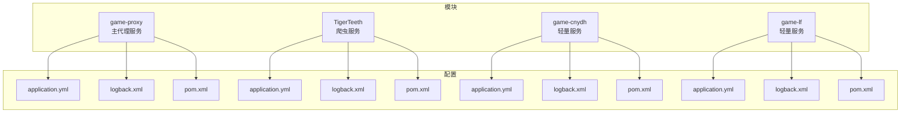
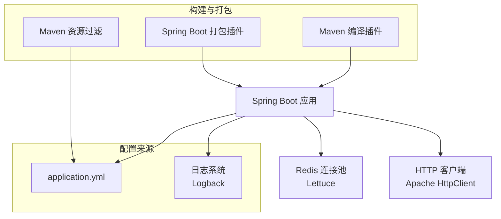
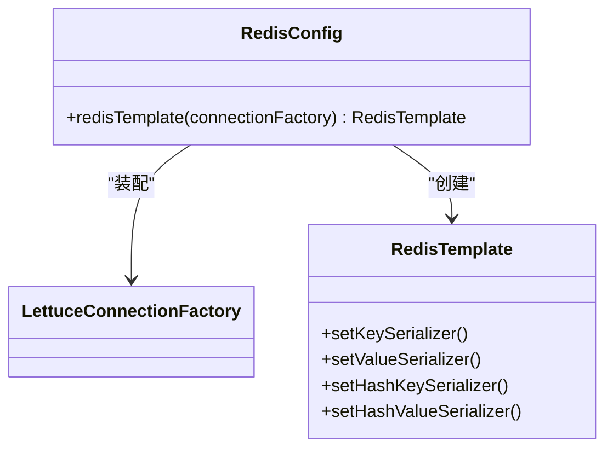
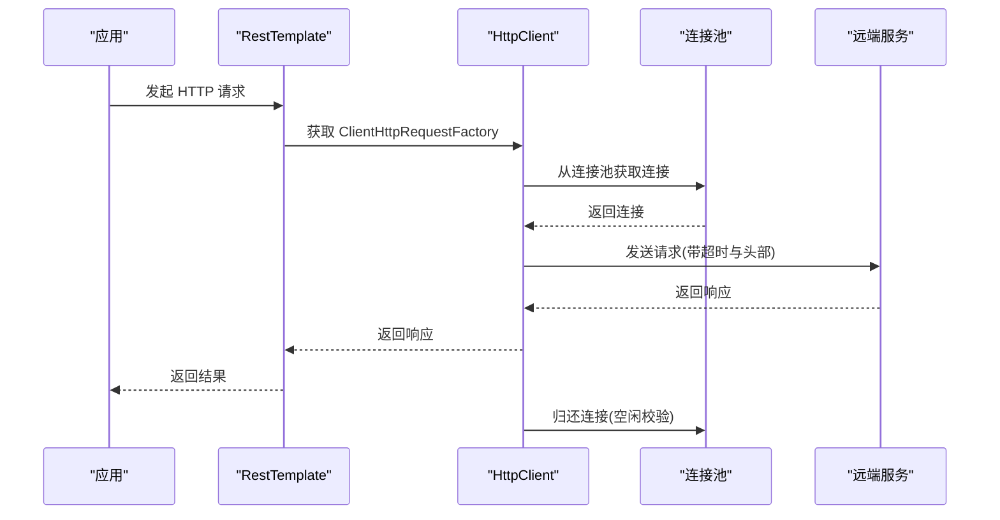
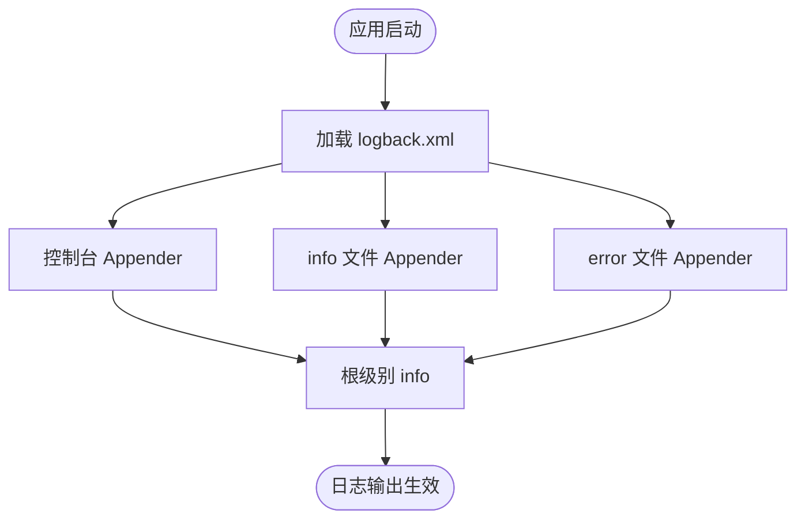
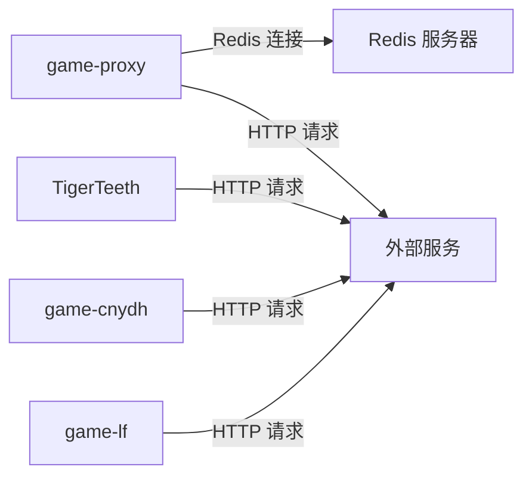

# 环境配置说明

<cite>
**本文引用的文件**
- [game-proxy/application.yml](file://game-proxy/src/main/resources/application.yml)
- [game-proxy/logback.xml](file://game-proxy/src/main/resources/logback.xml)
- [game-proxy/pom.xml](file://game-proxy/pom.xml)
- [game-proxy/RedisConfig.java](file://game-proxy/src/main/java/com/game/redis/RedisConfig.java)
- [game-proxy/RestTemplateConfig.java](file://game-proxy/src/main/java/com/game/commom/RestTemplateConfig.java)
- [TigerTeeth/application.yml](file://TigerTeeth/src/main/resources/application.yml)
- [TigerTeeth/logback.xml](file://TigerTeeth/src/main/resources/logback.xml)
- [TigerTeeth/pom.xml](file://TigerTeeth/pom.xml)
- [TigerTeeth/RestTemplateConfig.java](file://TigerTeeth/src/main/java/com/commom/RestTemplateConfig.java)
- [game-cnydh/application.yml](file://game-cnydh/src/main/resources/application.yml)
- [game-cnydh/logback.xml](file://game-cnydh/src/main/resources/logback.xml)
- [game-cnydh/pom.xml](file://game-cnydh/pom.xml)
- [game-lf/application.yml](file://game-lf/src/main/resources/application.yml)
- [game-lf/logback.xml](file://game-lf/src/main/resources/logback.xml)
- [game-lf/pom.xml](file://game-lf/pom.xml)
</cite>

## 目录
1. [简介](#简介)
2. [项目结构](#项目结构)
3. [核心组件](#核心组件)
4. [架构总览](#架构总览)
5. [详细组件分析](#详细组件分析)
6. [依赖关系分析](#依赖关系分析)
7. [性能考虑](#性能考虑)
8. [故障排查指南](#故障排查指南)
9. [结论](#结论)
10. [附录](#附录)

## 简介
本文件面向游戏代理系统的运维与开发人员，提供一套完整的环境配置说明。内容覆盖以下方面：
- application.yml 配置项详解：Tomcat 服务器、Spring Profile、Redis 连接池、HTTP 客户端超时与连接池参数等
- 日志系统配置：Logback 的 appender、滚动策略、日志级别与输出路径
- Maven 构建配置：依赖版本、编译参数、资源过滤与打包插件
- 多环境配置差异：开发、测试、生产三套配置的对比与最佳实践
- 配置验证方法与常见问题诊断

## 项目结构
本仓库包含多个子模块，每个模块均包含独立的 Spring Boot 配置与构建脚本：
- game-proxy：主代理服务，包含 Redis 连接池与 HTTP 客户端配置
- TigerTeeth：另一个业务模块，同样包含 HTTP 客户端与日志配置
- game-cnydh、game-lf：轻量级服务模块，仅包含基础端口与日志配置

图表来源
- [game-proxy/application.yml](file://game-proxy/src/main/resources/application.yml#L1-L58)
- [game-proxy/logback.xml](file://game-proxy/src/main/resources/logback.xml#L1-L75)
- [game-proxy/pom.xml](file://game-proxy/pom.xml#L1-L163)
- [TigerTeeth/application.yml](file://TigerTeeth/src/main/resources/application.yml#L1-L31)
- [TigerTeeth/logback.xml](file://TigerTeeth/src/main/resources/logback.xml#L1-L75)
- [TigerTeeth/pom.xml](file://TigerTeeth/pom.xml#L1-L160)
- [game-cnydh/application.yml](file://game-cnydh/src/main/resources/application.yml#L1-L1)
- [game-cnydh/logback.xml](file://game-cnydh/src/main/resources/logback.xml#L1-L75)
- [game-cnydh/pom.xml](file://game-cnydh/pom.xml#L1-L159)
- [game-lf/application.yml](file://game-lf/src/main/resources/application.yml#L1-L1)
- [game-lf/logback.xml](file://game-lf/src/main/resources/logback.xml#L1-L75)
- [game-lf/pom.xml](file://game-lf/pom.xml#L1-L160)

章节来源
- [game-proxy/application.yml](file://game-proxy/src/main/resources/application.yml#L1-L58)
- [TigerTeeth/application.yml](file://TigerTeeth/src/main/resources/application.yml#L1-L31)
- [game-cnydh/application.yml](file://game-cnydh/src/main/resources/application.yml#L1-L1)
- [game-lf/application.yml](file://game-lf/src/main/resources/application.yml#L1-L1)

## 核心组件
本节聚焦于与环境配置直接相关的核心组件：服务器与端口、Redis 连接池、HTTP 客户端、日志系统。

- 服务器与端口绑定
  - game-proxy：Tomcat 端口与上下文路径由 server.port 与 server.servlet.context-path 决定
  - TigerTeeth：同上，但端口与上下文路径不同
  - game-cnydh、game-lf：仅配置了 server.port

- Redis 连接池
  - game-proxy：通过 spring.redis.* 与 spring.redis.lettuce.pool.* 配置主机、端口、数据库、密码、超时与连接池参数
  - RedisTemplate 序列化策略在 RedisConfig 中定义，使用字符串键与 JSON 值序列化

- HTTP 客户端
  - 两个模块均通过 application.yml 的 http.* 参数注入 RestTemplateConfig，后者基于 Apache HttpClient 实现连接池与超时策略
  - 关键参数包括最大连接数、每路由并发、连接超时、请求连接超时、Socket 超时、连接有效性检查与空闲校验间隔

- 日志系统
  - 所有模块采用 Logback，统一配置在 logback.xml 中
  - 输出包含控制台与按日期滚动的文件（info/error 分离），并通过 logger 节点设置模块与框架日志级别

章节来源
- [game-proxy/application.yml](file://game-proxy/src/main/resources/application.yml#L1-L58)
- [game-proxy/RedisConfig.java](file://game-proxy/src/main/java/com/game/redis/RedisConfig.java#L1-L41)
- [game-proxy/RestTemplateConfig.java](file://game-proxy/src/main/java/com/game/commom/RestTemplateConfig.java#L1-L132)
- [TigerTeeth/RestTemplateConfig.java](file://TigerTeeth/src/main/java/com/commom/RestTemplateConfig.java#L1-L132)
- [TigerTeeth/application.yml](file://TigerTeeth/src/main/resources/application.yml#L1-L31)
- [game-proxy/logback.xml](file://game-proxy/src/main/resources/logback.xml#L1-L75)
- [TigerTeeth/logback.xml](file://TigerTeeth/src/main/resources/logback.xml#L1-L75)
- [game-cnydh/logback.xml](file://game-cnydh/src/main/resources/logback.xml#L1-L75)
- [game-lf/logback.xml](file://game-lf/src/main/resources/logback.xml#L1-L75)

## 架构总览
下图展示各模块的配置与运行关系：应用启动加载 application.yml，初始化 Redis 连接池与 HTTP 客户端；日志系统由 logback.xml 统一管理；Maven 构建负责资源过滤与打包。

图表来源
- [game-proxy/application.yml](file://game-proxy/src/main/resources/application.yml#L1-L58)
- [game-proxy/logback.xml](file://game-proxy/src/main/resources/logback.xml#L1-L75)
- [game-proxy/pom.xml](file://game-proxy/pom.xml#L102-L143)
- [TigerTeeth/application.yml](file://TigerTeeth/src/main/resources/application.yml#L1-L31)
- [TigerTeeth/logback.xml](file://TigerTeeth/src/main/resources/logback.xml#L1-L75)
- [TigerTeeth/pom.xml](file://TigerTeeth/pom.xml#L114-L154)

## 详细组件分析

### 服务器与端口绑定
- game-proxy
  - server.port：服务监听端口
  - server.servlet.context-path：上下文路径
- TigerTeeth
  - 同上，端口与上下文路径与 game-proxy 不同
- game-cnydh、game-lf
  - 仅配置 server.port，未设置上下文路径

章节来源
- [game-proxy/application.yml](file://game-proxy/src/main/resources/application.yml#L1-L6)
- [TigerTeeth/application.yml](file://TigerTeeth/src/main/resources/application.yml#L1-L6)
- [game-cnydh/application.yml](file://game-cnydh/src/main/resources/application.yml#L1-L1)
- [game-lf/application.yml](file://game-lf/src/main/resources/application.yml#L1-L1)

### Redis 连接池配置
- 连接参数
  - spring.redis.host/port/database/password/timeout
- 连接池参数
  - spring.redis.lettuce.pool.max-active/max-idle/min-idle
- 序列化策略
  - RedisTemplate 使用字符串键与 JSON 值序列化，确保跨语言与可读性

图表来源
- [game-proxy/RedisConfig.java](file://game-proxy/src/main/java/com/game/redis/RedisConfig.java#L1-L41)

章节来源
- [game-proxy/application.yml](file://game-proxy/src/main/resources/application.yml#L15-L31)
- [game-proxy/RedisConfig.java](file://game-proxy/src/main/java/com/game/redis/RedisConfig.java#L1-L41)

### HTTP 客户端超时与连接池
- application.yml 中的 http.* 参数映射到 RestTemplateConfig
- 关键参数
  - http.maxTotal：连接池最大连接数
  - http.defaultMaxPerRoute：每路由最大并发
  - http.connectTimeout：连接超时
  - http.connectionRequestTimeout：从池获取连接的超时
  - http.socketTimeout：Socket 读写超时
  - http.staleConnectionCheckEnabled：提交请求前检查连接有效性
  - http.validateAfterInactivity：空闲后校验间隔
- 实现要点
  - 使用 PoolingHttpClientConnectionManager 管理连接池
  - 设置 Keep-Alive 策略与重试策略
  - 默认请求头包含 User-Agent、编码、语言、连接保持与内容类型

图表来源
- [game-proxy/RestTemplateConfig.java](file://game-proxy/src/main/java/com/game/commom/RestTemplateConfig.java#L34-L129)
- [TigerTeeth/RestTemplateConfig.java](file://TigerTeeth/src/main/java/com/commom/RestTemplateConfig.java#L34-L129)
- [game-proxy/application.yml](file://game-proxy/src/main/resources/application.yml#L43-L58)
- [TigerTeeth/application.yml](file://TigerTeeth/src/main/resources/application.yml#L16-L31)

章节来源
- [game-proxy/RestTemplateConfig.java](file://game-proxy/src/main/java/com/game/commom/RestTemplateConfig.java#L1-L132)
- [TigerTeeth/RestTemplateConfig.java](file://TigerTeeth/src/main/java/com/commom/RestTemplateConfig.java#L1-L132)
- [game-proxy/application.yml](file://game-proxy/src/main/resources/application.yml#L43-L58)
- [TigerTeeth/application.yml](file://TigerTeeth/src/main/resources/application.yml#L16-L31)

### 日志系统配置
- 输出目标
  - 控制台输出与按日期滚动的文件输出
- 文件滚动策略
  - 基于时间的 TimeBasedRollingPolicy，文件名含日期，保留历史天数
- 日志级别
  - 根日志级别为 info
  - 模块日志 com.gzb 级别 info
  - 框架日志 org.springframework 级别 warn
- 输出格式
  - 自定义 pattern，包含时间、线程、级别、类名、方法行号与消息

图表来源
- [game-proxy/logback.xml](file://game-proxy/src/main/resources/logback.xml#L1-L75)
- [TigerTeeth/logback.xml](file://TigerTeeth/src/main/resources/logback.xml#L1-L75)
- [game-cnydh/logback.xml](file://game-cnydh/src/main/resources/logback.xml#L1-L75)
- [game-lf/logback.xml](file://game-lf/src/main/resources/logback.xml#L1-L75)

章节来源
- [game-proxy/logback.xml](file://game-proxy/src/main/resources/logback.xml#L1-L75)
- [TigerTeeth/logback.xml](file://TigerTeeth/src/main/resources/logback.xml#L1-L75)
- [game-cnydh/logback.xml](file://game-cnydh/src/main/resources/logback.xml#L1-L75)
- [game-lf/logback.xml](file://game-lf/src/main/resources/logback.xml#L1-L75)

### Maven 构建配置
- Java 版本与编码
  - java.version=1.8
  - project.build.sourceEncoding=UTF-8
- 依赖管理
  - Spring Boot Starter Web、测试、Redis、HTTP 客户端、JSON、WebSocket、Lang3、OkHttp 等
- 插件配置
  - maven-resources-plugin：资源编码
  - maven-compiler-plugin：源/目标/编码
  - spring-boot-maven-plugin：打包排除 Lombok

章节来源
- [game-proxy/pom.xml](file://game-proxy/pom.xml#L11-L18)
- [game-proxy/pom.xml](file://game-proxy/pom.xml#L102-L143)
- [TigerTeeth/pom.xml](file://TigerTeeth/pom.xml#L11-L18)
- [TigerTeeth/pom.xml](file://TigerTeeth/pom.xml#L114-L154)
- [game-cnydh/pom.xml](file://game-cnydh/pom.xml#L11-L18)
- [game-cnydh/pom.xml](file://game-cnydh/pom.xml#L98-L140)
- [game-lf/pom.xml](file://game-lf/pom.xml#L11-L18)
- [game-lf/pom.xml](file://game-lf/pom.xml#L98-L141)

## 依赖关系分析
- 模块间关系
  - game-proxy 作为主模块，包含 Redis 与 HTTP 客户端配置
  - TigerTeeth 与 game-cnydh、game-lf 为独立服务，分别承担不同业务场景
- 配置耦合点
  - Redis 连接参数在 game-proxy 的 application.yml 中集中管理
  - HTTP 客户端参数在两个模块的 application.yml 中一致，便于统一调优
- 日志一致性
  - 四个模块的日志配置结构一致，便于统一运维

图表来源
- [game-proxy/application.yml](file://game-proxy/src/main/resources/application.yml#L15-L58)
- [TigerTeeth/application.yml](file://TigerTeeth/src/main/resources/application.yml#L16-L31)
- [game-cnydh/application.yml](file://game-cnydh/src/main/resources/application.yml#L1-L1)
- [game-lf/application.yml](file://game-lf/src/main/resources/application.yml#L1-L1)

章节来源
- [game-proxy/application.yml](file://game-proxy/src/main/resources/application.yml#L1-L58)
- [TigerTeeth/application.yml](file://TigerTeeth/src/main/resources/application.yml#L1-L31)
- [game-cnydh/application.yml](file://game-cnydh/src/main/resources/application.yml#L1-L1)
- [game-lf/application.yml](file://game-lf/src/main/resources/application.yml#L1-L1)

## 性能考虑
- Redis 连接池
  - 合理设置 max-active 与 max-idle，避免连接过多导致服务器压力过大
  - min-idle 保持一定空闲连接可降低突发请求的延迟
- HTTP 客户端
  - 根据下游服务性能调整超时参数，避免长连接占用
  - 启用 staleConnectionCheckEnabled 与 validateAfterInactivity，提升连接复用稳定性
- 日志
  - info/error 分离滚动，减少 IO 压力
  - 控制台输出仅用于开发调试，生产环境建议关闭或限制级别

## 故障排查指南
- Redis 连接失败
  - 症状：连接超时、认证失败、无法获取连接
  - 排查：核对 host/port/password/database/timeout；检查 max-active 与 max-idle 是否合理
- HTTP 请求超时
  - 症状：connectTimeout/connectionRequestTimeout/socketTimeout 导致请求中断
  - 排查：结合下游服务性能与网络状况调整超时参数；确认 keep-alive 与重试策略
- 日志异常
  - 症状：日志不输出、文件未生成、权限不足
  - 排查：确认 log.path 路径存在且可写；检查 RollingPolicy 与文件名模式；核对日志级别
- 构建问题
  - 症状：资源过滤不生效、编码异常、打包失败
  - 排查：确认 maven-resources-plugin 与 maven-compiler-plugin 的 encoding 与版本；检查 spring-boot-maven-plugin 配置

章节来源
- [game-proxy/application.yml](file://game-proxy/src/main/resources/application.yml#L15-L31)
- [game-proxy/application.yml](file://game-proxy/src/main/resources/application.yml#L43-L58)
- [game-proxy/logback.xml](file://game-proxy/src/main/resources/logback.xml#L1-L75)
- [game-proxy/pom.xml](file://game-proxy/pom.xml#L102-L143)

## 结论
本文件梳理了游戏代理系统在多模块下的环境配置要点，重点覆盖了服务器端口、Redis 连接池、HTTP 客户端超时与连接池、日志系统以及 Maven 构建。通过统一的配置与清晰的模块边界，能够有效支撑开发、测试与生产的差异化需求，并为后续扩展与维护提供稳定基础。

## 附录

### 多环境配置差异与最佳实践
- 开发环境
  - 端口：选择与业务不冲突的本地端口
  - Redis：使用本地或内网 Redis，min-idle 可适当提高以降低首次请求延迟
  - 日志：根级别设为 debug 或 info，控制台输出开启
- 测试环境
  - 端口：与生产隔离，便于并行测试
  - Redis：使用独立实例，max-active 适中，开启连接池监控
  - 日志：info 级别为主，error 单独归档
- 生产环境
  - 端口：固定端口，配合反向代理与健康检查
  - Redis：高可用部署，合理设置超时与连接池上限
  - 日志：info/error 分离，保留历史天数满足审计要求

### 配置验证清单
- 服务器
  - 确认 server.port 与 context-path 正确
- Redis
  - 连通性测试、认证成功、键空间操作正常
- HTTP
  - 超时参数合理、连接池利用率正常、无频繁重建
- 日志
  - 控制台与文件输出正常、滚动策略生效、级别符合预期
- 构建
  - 资源过滤生效、打包产物包含所需依赖、插件版本兼容