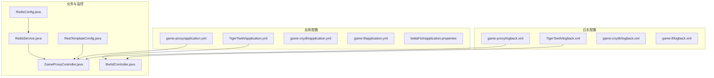
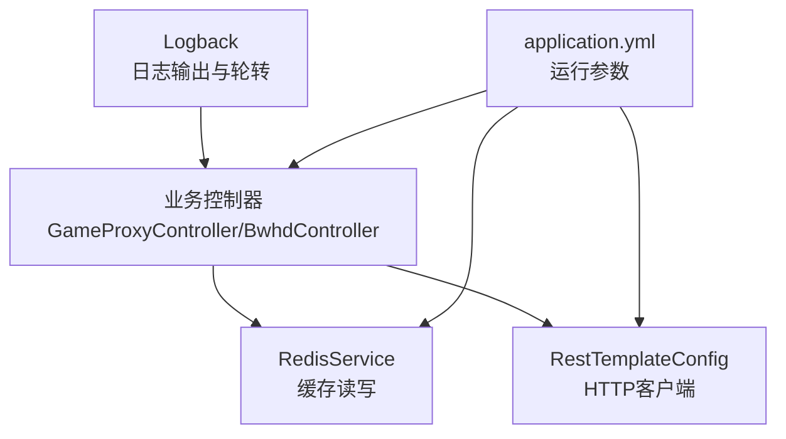
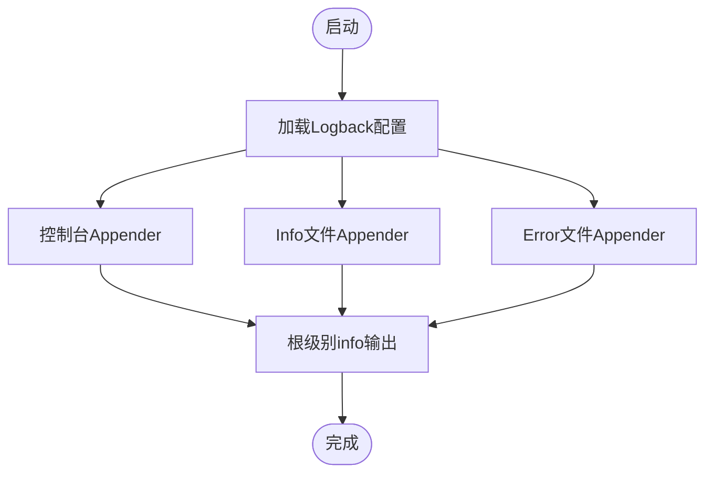
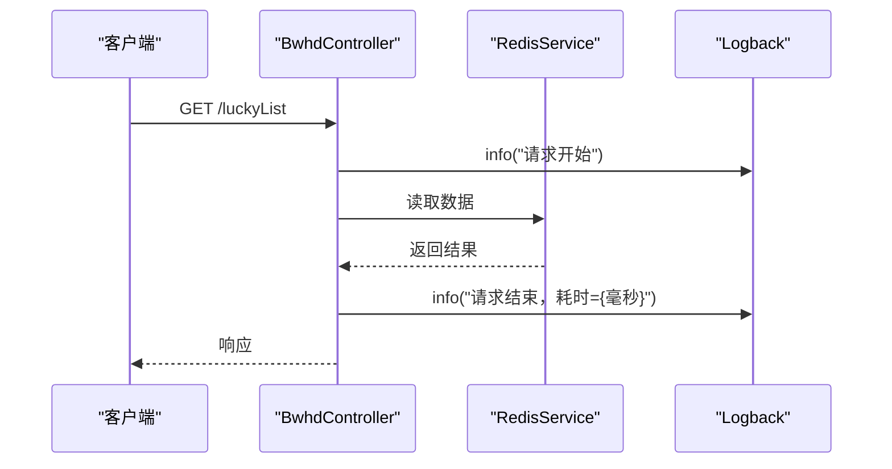
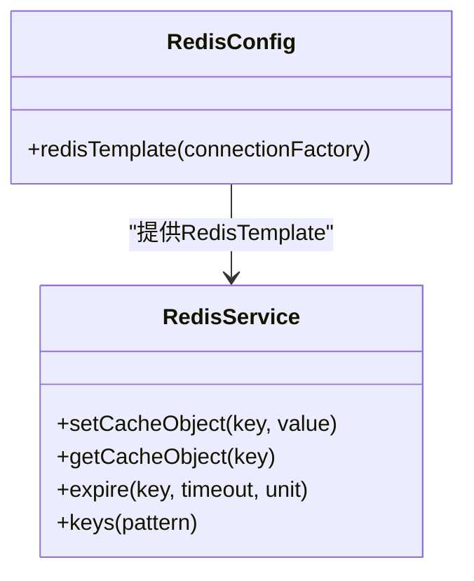
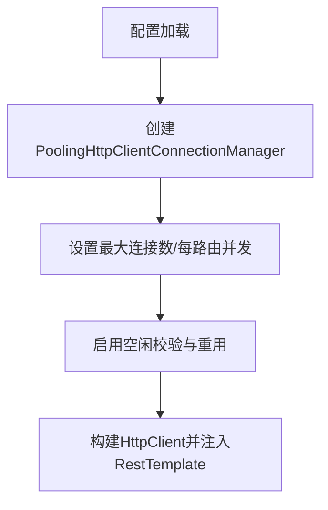
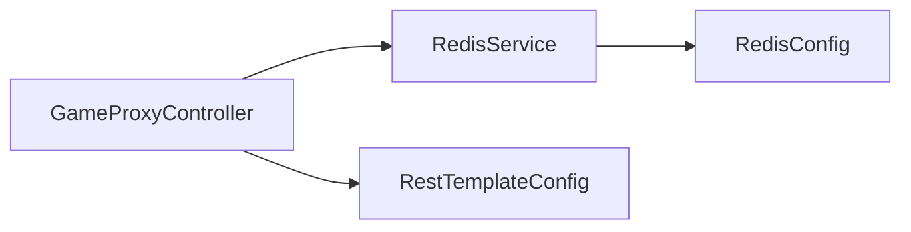

# 监控与日志

<cite>
**本文引用的文件**
- [game-proxy/src/main/resources/logback.xml](file://game-proxy/src/main/resources/logback.xml)
- [game-proxy/src/main/resources/application.yml](file://game-proxy/src/main/resources/application.yml)
- [game-proxy/src/main/java/com/game/controller/GameProxyController.java](file://game-proxy/src/main/java/com/game/controller/GameProxyController.java)
- [game-proxy/src/main/java/com/game/gcbwz/BwhdController.java](file://game-proxy/src/main/java/com/game/gcbwz/BwhdController.java)
- [game-proxy/src/main/java/com/game/redis/RedisService.java](file://game-proxy/src/main/java/com/game/redis/RedisService.java)
- [game-proxy/src/main/java/com/game/redis/RedisConfig.java](file://game-proxy/src/main/java/com/game/redis/RedisConfig.java)
- [game-proxy/src/main/java/com/game/commom/RestTemplateConfig.java](file://game-proxy/src/main/java/com/game/commom/RestTemplateConfig.java)
- [TigerTeeth/src/main/resources/logback.xml](file://TigerTeeth/src/main/resources/logback.xml)
- [TigerTeeth/src/main/resources/application.yml](file://TigerTeeth/src/main/resources/application.yml)
- [game-cnydh/src/main/resources/logback.xml](file://game-cnydh/src/main/resources/logback.xml)
- [game-cnydh/src/main/resources/application.yml](file://game-cnydh/src/main/resources/application.yml)
- [game-lf/src/main/resources/logback.xml](file://game-lf/src/main/resources/logback.xml)
- [game-lf/src/main/resources/application.yml](file://game-lf/src/main/resources/application.yml)
- [bettaFish/src/main/resources/application.properties](file://bettaFish/src/main/resources/application.properties)
</cite>

## 目录
1. [简介](#简介)
2. [项目结构](#项目结构)
3. [核心组件](#核心组件)
4. [架构总览](#架构总览)
5. [详细组件分析](#详细组件分析)
6. [依赖分析](#依赖分析)
7. [性能考虑](#性能考虑)
8. [故障排查指南](#故障排查指南)
9. [结论](#结论)
10. [附录](#附录)

## 简介
本文件面向游戏代理系统，提供一套完整的监控与日志管理方案。内容涵盖日志系统配置与管理策略（Logback）、日志级别与文件轮转、关键业务日志记录规范（API调用、错误、性能、调试），以及系统监控指标（服务健康、Redis连接、API响应时间、内存使用等）的定义与采集方法。同时给出告警阈值建议、日志分析工具使用方法、常见问题排查技巧，以及性能监控仪表板的搭建建议与可视化展示方案。

## 项目结构
本仓库包含多个子项目，其中与监控和日志直接相关的关键文件如下：
- Logback配置：各子项目均提供独立的Logback配置，统一采用按日滚动的文件输出与控制台输出组合。
- 应用配置：各子项目通过application.yml或application.properties提供运行参数，如端口、Redis连接、HTTP连接池参数等。
- 业务控制器：包含对Redis读写、HTTP调用、耗时统计等关键环节的日志记录点。
- Redis服务封装：提供统一的Redis读写、过期时间设置、键空间查询等能力。
- HTTP客户端配置：统一的RestTemplate与Apache HttpClient连接池配置，便于统一超时与连接复用策略。

图表来源
- [game-proxy/src/main/resources/logback.xml](file://game-proxy/src/main/resources/logback.xml#L1-L75)
- [TigerTeeth/src/main/resources/logback.xml](file://TigerTeeth/src/main/resources/logback.xml#L1-L75)
- [game-proxy/src/main/resources/application.yml](file://game-proxy/src/main/resources/application.yml#L1-L58)
- [TigerTeeth/src/main/resources/application.yml](file://TigerTeeth/src/main/resources/application.yml#L1-L31)
- [game-proxy/src/main/java/com/game/controller/GameProxyController.java](file://game-proxy/src/main/java/com/game/controller/GameProxyController.java#L360-L373)
- [game-proxy/src/main/java/com/game/gcbwz/BwhdController.java](file://game-proxy/src/main/java/com/game/gcbwz/BwhdController.java#L39-L70)
- [game-proxy/src/main/java/com/game/redis/RedisService.java](file://game-proxy/src/main/java/com/game/redis/RedisService.java#L95-L98)
- [game-proxy/src/main/java/com/game/redis/RedisConfig.java](file://game-proxy/src/main/java/com/game/redis/RedisConfig.java#L27-L29)
- [game-proxy/src/main/java/com/game/commom/RestTemplateConfig.java](file://game-proxy/src/main/java/com/game/commom/RestTemplateConfig.java#L35-L54)

章节来源
- [game-proxy/src/main/resources/logback.xml](file://game-proxy/src/main/resources/logback.xml#L1-L75)
- [game-proxy/src/main/resources/application.yml](file://game-proxy/src/main/resources/application.yml#L1-L58)
- [game-proxy/src/main/java/com/game/controller/GameProxyController.java](file://game-proxy/src/main/java/com/game/controller/GameProxyController.java#L360-L373)
- [game-proxy/src/main/java/com/game/gcbwz/BwhdController.java](file://game-proxy/src/main/java/com/game/gcbwz/BwhdController.java#L39-L70)
- [game-proxy/src/main/java/com/game/redis/RedisService.java](file://game-proxy/src/main/java/com/game/redis/RedisService.java#L95-L98)
- [game-proxy/src/main/java/com/game/redis/RedisConfig.java](file://game-proxy/src/main/java/com/game/redis/RedisConfig.java#L27-L29)
- [game-proxy/src/main/java/com/game/commom/RestTemplateConfig.java](file://game-proxy/src/main/java/com/game/commom/RestTemplateConfig.java#L35-L54)

## 核心组件
- 日志系统（Logback）
  - 输出目标：控制台与按日滚动的info/error文件。
  - 文件轮转：基于时间的TimeBasedRollingPolicy，保留60天历史。
  - 日志级别：根级别info，模块与Spring框架分别设置过滤与降噪。
- Redis服务
  - 统一封装了字符串、列表、集合、哈希等常用操作，支持过期时间设置与键空间查询。
- HTTP客户端
  - 基于Apache HttpClient的连接池配置，统一超时与重试策略，便于集中治理。
- 业务控制器
  - 在关键流程（如Redis读取、接口限流、耗时统计）记录info/warn日志，便于追踪与审计。

章节来源
- [game-proxy/src/main/resources/logback.xml](file://game-proxy/src/main/resources/logback.xml#L15-L73)
- [game-proxy/src/main/java/com/game/redis/RedisService.java](file://game-proxy/src/main/java/com/game/redis/RedisService.java#L24-L242)
- [game-proxy/src/main/java/com/game/commom/RestTemplateConfig.java](file://game-proxy/src/main/java/com/game/commom/RestTemplateConfig.java#L84-L129)
- [game-proxy/src/main/java/com/game/controller/GameProxyController.java](file://game-proxy/src/main/java/com/game/controller/GameProxyController.java#L360-L373)

## 架构总览
下图展示了日志与监控在系统中的位置与交互关系：Logback负责日志输出；业务控制器在关键路径打点；Redis作为缓存与状态存储；HTTP客户端用于外部调用；应用配置集中管理运行参数。

图表来源
- [game-proxy/src/main/resources/logback.xml](file://game-proxy/src/main/resources/logback.xml#L65-L73)
- [game-proxy/src/main/resources/application.yml](file://game-proxy/src/main/resources/application.yml#L15-L57)
- [game-proxy/src/main/java/com/game/controller/GameProxyController.java](file://game-proxy/src/main/java/com/game/controller/GameProxyController.java#L90-L137)
- [game-proxy/src/main/java/com/game/gcbwz/BwhdController.java](file://game-proxy/src/main/java/com/game/gcbwz/BwhdController.java#L39-L70)
- [game-proxy/src/main/java/com/game/redis/RedisService.java](file://game-proxy/src/main/java/com/game/redis/RedisService.java#L95-L98)
- [game-proxy/src/main/java/com/game/commom/RestTemplateConfig.java](file://game-proxy/src/main/java/com/game/commom/RestTemplateConfig.java#L84-L129)

## 详细组件分析

### 日志系统（Logback）配置详解
- 输出目标
  - 控制台：用于开发与实时观测。
  - 文件：info.log与error.log，按日期滚动，保留60天。
- 日志级别
  - 根级别info，确保生产环境以info为主。
  - 模块与框架降噪：模块包与Spring框架分别设置过滤，避免噪声。
- 文件轮转与归档
  - TimeBasedRollingPolicy，按日生成文件，保留60天。
  - LevelFilter用于仅记录指定级别的消息，减少IO与存储压力。

图表来源
- [game-proxy/src/main/resources/logback.xml](file://game-proxy/src/main/resources/logback.xml#L65-L73)

章节来源
- [game-proxy/src/main/resources/logback.xml](file://game-proxy/src/main/resources/logback.xml#L1-L75)
- [TigerTeeth/src/main/resources/logback.xml](file://TigerTeeth/src/main/resources/logback.xml#L1-L75)
- [game-cnydh/src/main/resources/logback.xml](file://game-cnydh/src/main/resources/logback.xml#L1-L75)
- [game-lf/src/main/resources/logback.xml](file://game-lf/src/main/resources/logback.xml#L1-L75)

### 关键业务日志记录规范
- API调用日志
  - 记录请求开始、结束与耗时，便于性能分析与异常定位。
  - 示例：古城控制器在获取历史数据与开奖时间前后记录info日志。
- 错误日志
  - 使用ERROR级别记录异常与失败场景，结合文件轮转与保留策略便于事后分析。
- 性能日志
  - 记录关键接口耗时，结合限流策略（如5秒内仅允许一次请求）进行告警阈值设定。
- 调试日志
  - 开发阶段可临时提升级别，生产环境建议保持info及以上，避免噪声。

图表来源
- [game-proxy/src/main/java/com/game/gcbwz/BwhdController.java](file://game-proxy/src/main/java/com/game/gcbwz/BwhdController.java#L39-L70)
- [game-proxy/src/main/java/com/game/redis/RedisService.java](file://game-proxy/src/main/java/com/game/redis/RedisService.java#L95-L98)
- [game-proxy/src/main/resources/logback.xml](file://game-proxy/src/main/resources/logback.xml#L65-L73)

章节来源
- [game-proxy/src/main/java/com/game/gcbwz/BwhdController.java](file://game-proxy/src/main/java/com/game/gcbwz/BwhdController.java#L39-L70)
- [game-proxy/src/main/java/com/game/controller/GameProxyController.java](file://game-proxy/src/main/java/com/game/controller/GameProxyController.java#L360-L373)

### Redis连接与监控
- 连接配置
  - Redis主机、端口、数据库、密码、超时时间、连接池大小等在application.yml中集中配置。
- 服务封装
  - 提供字符串、列表、集合、哈希等常用操作，支持过期时间设置与键空间查询。
- 监控指标建议
  - 连接池活跃/空闲连接数、命令执行QPS、慢查询、KEYS扫描频率等。

图表来源
- [game-proxy/src/main/java/com/game/redis/RedisConfig.java](file://game-proxy/src/main/java/com/game/redis/RedisConfig.java#L27-L29)
- [game-proxy/src/main/java/com/game/redis/RedisService.java](file://game-proxy/src/main/java/com/game/redis/RedisService.java#L24-L242)

章节来源
- [game-proxy/src/main/resources/application.yml](file://game-proxy/src/main/resources/application.yml#L15-L30)
- [game-proxy/src/main/java/com/game/redis/RedisService.java](file://game-proxy/src/main/java/com/game/redis/RedisService.java#L24-L242)
- [game-proxy/src/main/java/com/game/redis/RedisConfig.java](file://game-proxy/src/main/java/com/game/redis/RedisConfig.java#L27-L29)

### HTTP客户端与连接池监控
- 连接池参数
  - 最大连接数、每路由并发、连接超时、请求超时、套接字超时、空闲校验与重用策略等。
- 监控指标建议
  - 连接池利用率、排队等待时间、超时次数、重试次数、外部服务响应时间分布。

图表来源
- [game-proxy/src/main/java/com/game/commom/RestTemplateConfig.java](file://game-proxy/src/main/java/com/game/commom/RestTemplateConfig.java#L116-L129)
- [game-proxy/src/main/resources/application.yml](file://game-proxy/src/main/resources/application.yml#L43-L57)

章节来源
- [game-proxy/src/main/java/com/game/commom/RestTemplateConfig.java](file://game-proxy/src/main/java/com/game/commom/RestTemplateConfig.java#L35-L129)
- [game-proxy/src/main/resources/application.yml](file://game-proxy/src/main/resources/application.yml#L43-L57)

## 依赖分析
- 组件耦合
  - 业务控制器依赖RedisService与HTTP客户端配置。
  - RedisService依赖RedisTemplate，RedisConfig提供序列化与连接工厂。
- 外部依赖
  - Logback用于日志输出；Apache HttpClient用于HTTP通信；Spring Data Redis用于Redis访问。
- 潜在风险
  - 日志级别过高导致IO与磁盘压力增大；Redis连接池配置不当导致超时与堆积；HTTP超时设置不合理影响整体吞吐。

图表来源
- [game-proxy/src/main/java/com/game/controller/GameProxyController.java](file://game-proxy/src/main/java/com/game/controller/GameProxyController.java#L82-L83)
- [game-proxy/src/main/java/com/game/redis/RedisService.java](file://game-proxy/src/main/java/com/game/redis/RedisService.java#L21-L22)
- [game-proxy/src/main/java/com/game/redis/RedisConfig.java](file://game-proxy/src/main/java/com/game/redis/RedisConfig.java#L27-L29)
- [game-proxy/src/main/java/com/game/commom/RestTemplateConfig.java](file://game-proxy/src/main/java/com/game/commom/RestTemplateConfig.java#L62-L76)

章节来源
- [game-proxy/src/main/java/com/game/controller/GameProxyController.java](file://game-proxy/src/main/java/com/game/controller/GameProxyController.java#L82-L83)
- [game-proxy/src/main/java/com/game/redis/RedisService.java](file://game-proxy/src/main/java/com/game/redis/RedisService.java#L21-L22)
- [game-proxy/src/main/java/com/game/redis/RedisConfig.java](file://game-proxy/src/main/java/com/game/redis/RedisConfig.java#L27-L29)
- [game-proxy/src/main/java/com/game/commom/RestTemplateConfig.java](file://game-proxy/src/main/java/com/game/commom/RestTemplateConfig.java#L62-L76)

## 性能考虑
- 日志性能
  - 使用按日滚动与固定保留天数，避免无限增长；在生产环境保持info级别，必要时临时调整。
- Redis性能
  - 合理设置连接池大小与超时；避免频繁KEYS扫描；对热点键设置合理TTL。
- HTTP性能
  - 统一超时与重试策略；根据外部服务SLA调整socketTimeout；关注排队与超时指标。

[本节为通用指导，无需列出章节来源]

## 故障排查指南
- 接口限流告警
  - 观察控制器中限流逻辑与warn日志，确认是否触发限流。
- Redis连接异常
  - 检查application.yml中的Redis连接参数与连接池配置；查看RedisService的返回状态与异常日志。
- HTTP超时与重试
  - 查看RestTemplateConfig的超时参数与重试策略；结合业务日志中的耗时统计定位瓶颈。
- 日志缺失或过多
  - 检查Logback配置的级别过滤与文件路径；确认文件权限与磁盘空间。

章节来源
- [game-proxy/src/main/java/com/game/controller/GameProxyController.java](file://game-proxy/src/main/java/com/game/controller/GameProxyController.java#L360-L373)
- [game-proxy/src/main/resources/application.yml](file://game-proxy/src/main/resources/application.yml#L15-L30)
- [game-proxy/src/main/java/com/game/commom/RestTemplateConfig.java](file://game-proxy/src/main/java/com/game/commom/RestTemplateConfig.java#L84-L129)
- [game-proxy/src/main/resources/logback.xml](file://game-proxy/src/main/resources/logback.xml#L65-L73)

## 结论
通过统一的Logback配置、明确的业务日志规范、完善的Redis与HTTP客户端治理，以及可量化的监控指标与告警阈值，可以有效提升系统的可观测性与稳定性。建议在生产环境中持续优化日志级别与保留策略，定期审查Redis与HTTP超时参数，并结合仪表板实现多维度可视化监控。

[本节为总结性内容，无需列出章节来源]

## 附录

### 系统监控指标定义与采集方法
- 服务健康状态
  - 指标：存活探针、就绪探针、JVM线程数、GC次数与耗时。
  - 采集：Spring Boot Actuator暴露健康端点与JMX指标。
- Redis连接数
  - 指标：connected_clients、used_memory、mem_fragmentation_ratio、keyspace_hits/misses。
  - 采集：Redis INFO命令或客户端统计。
- API响应时间
  - 指标：P50/P95/P99、错误率、超时率。
  - 采集：业务控制器中记录的耗时日志，结合日志分析工具聚合。
- 内存使用情况
  - 指标：堆内存使用率、非堆内存、GC频次与停顿时间。
  - 采集：JVM JMX或容器监控。

[本节为通用指导，无需列出章节来源]

### 告警机制配置与阈值建议
- 日志级别告警
  - ERROR级别日志量突增触发告警。
- Redis告警
  - 连接池耗尽、慢查询增多、内存使用率超阈值。
- API告警
  - 响应时间P95超阈值、错误率上升、超时比例升高。
- HTTP告警
  - 连接池排队时间过长、超时次数激增。

[本节为通用指导，无需列出章节来源]

### 日志分析工具使用方法
- 工具选择
  - ELK（Elasticsearch+Logstash+Kibana）或Loki+Grafana+Promtail。
- 常见任务
  - 按时间范围检索、按级别筛选、按接口聚合耗时、生成趋势图。
- 实践建议
  - 为关键业务日志添加结构化字段（如接口名、耗时、状态码）以便高效检索与聚合。

[本节为通用指导，无需列出章节来源]

### 性能监控仪表板搭建建议
- 数据源
  - 日志分析平台（如Kibana/Loki）、JMX/Actuator导出的指标。
- 展示维度
  - 服务健康、Redis连接与内存、API响应时间分布、错误与超时趋势。
- 可视化建议
  - 折线图（趋势）、柱状图（错误分布）、热力图（响应时间热区）。

[本节为通用指导，无需列出章节来源]