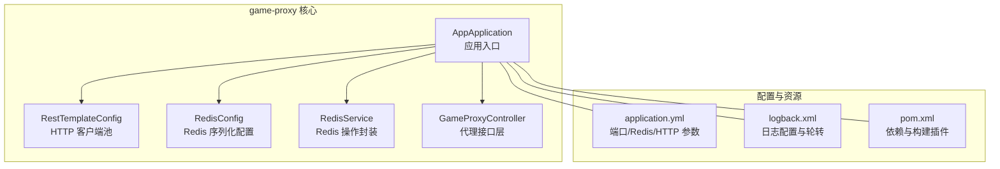
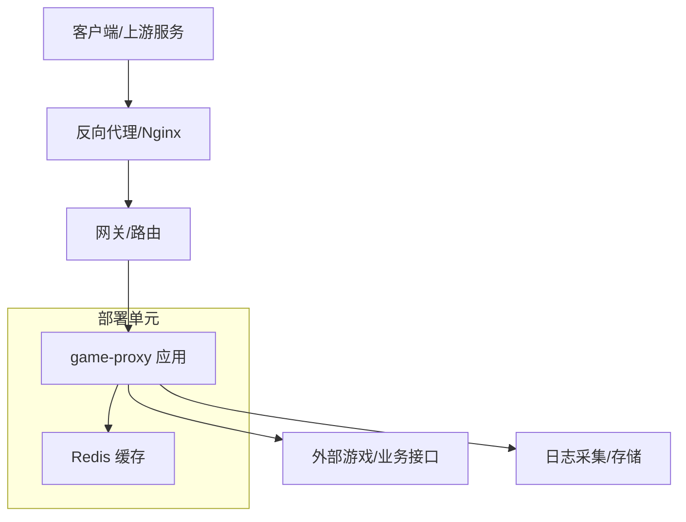
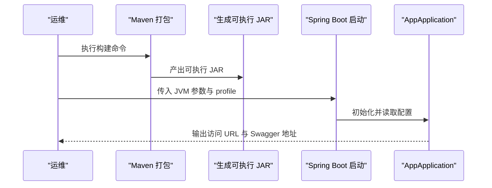
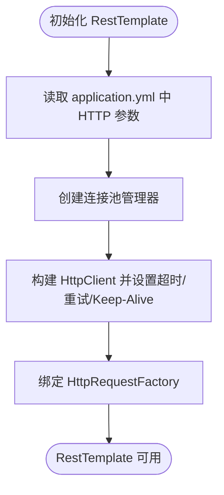
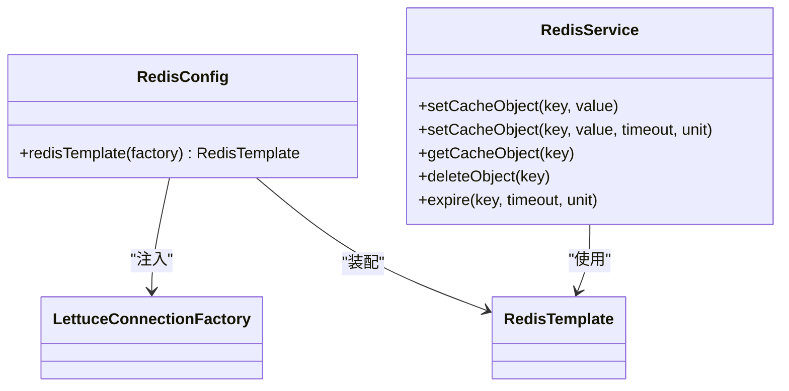
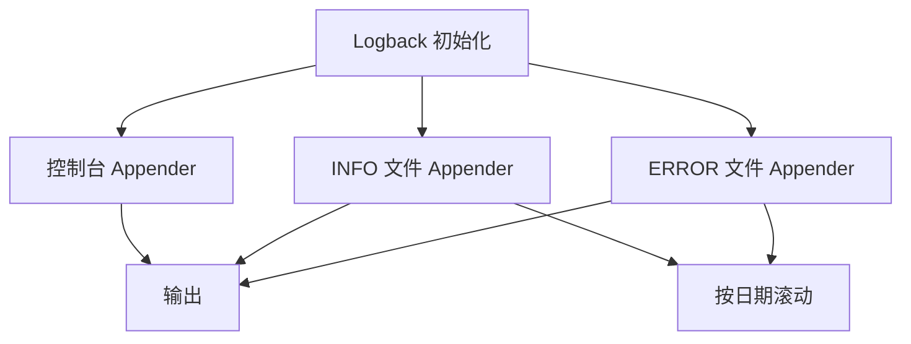
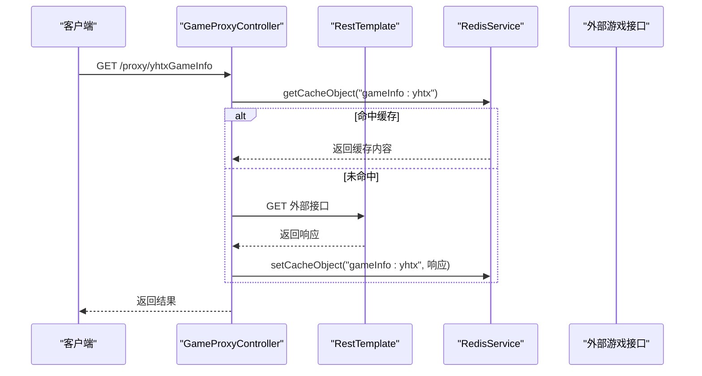
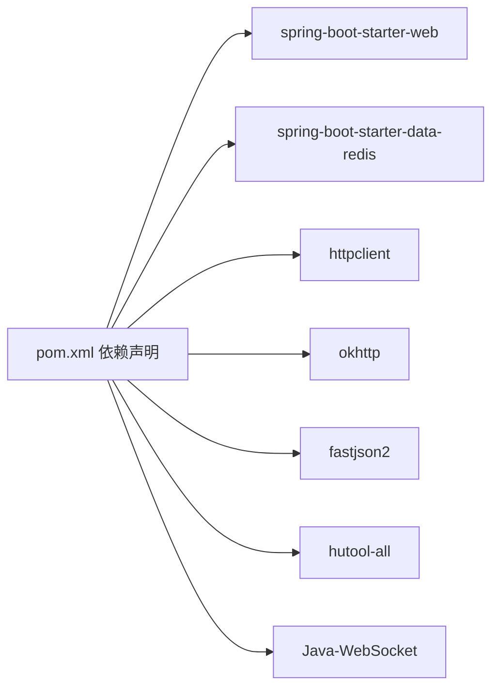

# 部署与运维

<cite>
**本文引用的文件**
- [game-proxy/application.yml](file://game-proxy/src/main/resources/application.yml)
- [game-proxy/logback.xml](file://game-proxy/src/main/resources/logback.xml)
- [game-proxy/pom.xml](file://game-proxy/pom.xml)
- [game-proxy/AppApplication.java](file://game-proxy/src/main/java/com/game/AppApplication.java)
- [game-proxy/RestTemplateConfig.java](file://game-proxy/src/main/java/com/game/commom/RestTemplateConfig.java)
- [game-proxy/RedisConfig.java](file://game-proxy/src/main/java/com/game/redis/RedisConfig.java)
- [game-proxy/RedisService.java](file://game-proxy/src/main/java/com/game/redis/RedisService.java)
- [game-proxy/GameProxyController.java](file://game-proxy/src/main/java/com/game/controller/GameProxyController.java)
- [TigerTeeth/application.yml](file://TigerTeeth/src/main/resources/application.yml)
- [TigerTeeth/logback.xml](file://TigerTeeth/src/main/resources/logback.xml)
- [TigerTeeth/pom.xml](file://TigerTeeth/pom.xml)
- [game-cnydh/application.yml](file://game-cnydh/src/main/resources/application.yml)
- [game-lf/application.yml](file://game-lf/src/main/resources/application.yml)
</cite>

## 目录
1. [简介](#简介)
2. [项目结构](#项目结构)
3. [核心组件](#核心组件)
4. [架构总览](#架构总览)
5. [详细组件分析](#详细组件分析)
6. [依赖分析](#依赖分析)
7. [性能考量](#性能考量)
8. [故障排查指南](#故障排查指南)
9. [结论](#结论)
10. [附录](#附录)

## 简介
本文件面向游戏代理系统的生产部署与运维，覆盖以下要点：
- 生产环境部署要求与配置管理
- application.yml 关键参数说明（Redis、HTTP 客户端、日志、端口等）
- 日志系统配置与监控策略（Logback、日志轮转、性能观测）
- 完整部署流程（打包构建、环境准备、服务启动、健康检查）
- 常见运维问题排查（启动失败、Redis 连接异常、API 调用超时）
- 性能监控指标、容量规划与扩展建议

## 项目结构
本仓库包含多个子模块，其中与“游戏代理系统”直接相关的是 game-proxy 模块，其他模块（如 TigerTeeth、game-cnydh、game-lf）可作为独立服务或参考服务存在。

图表来源
- [game-proxy/AppApplication.java](file://game-proxy/src/main/java/com/game/AppApplication.java#L15-L31)
- [game-proxy/RestTemplateConfig.java](file://game-proxy/src/main/java/com/game/commom/RestTemplateConfig.java#L34-L131)
- [game-proxy/RedisConfig.java](file://game-proxy/src/main/java/com/game/redis/RedisConfig.java#L10-L39)
- [game-proxy/RedisService.java](file://game-proxy/src/main/java/com/game/redis/RedisService.java#L18-L243)
- [game-proxy/GameProxyController.java](file://game-proxy/src/main/java/com/game/controller/GameProxyController.java#L36-L435)
- [game-proxy/application.yml](file://game-proxy/src/main/resources/application.yml#L1-L58)
- [game-proxy/logback.xml](file://game-proxy/src/main/resources/logback.xml#L1-L75)
- [game-proxy/pom.xml](file://game-proxy/pom.xml#L11-L160)

章节来源
- [game-proxy/pom.xml](file://game-proxy/pom.xml#L11-L160)

## 核心组件
- 应用入口与启动
  - 启动类负责读取 server.port 与 server.servlet.context-path，并在启动后输出访问 URL 与 Swagger 文档地址。
- HTTP 客户端配置
  - 基于 Apache HttpClient 的连接池与超时策略，支持 Keep-Alive、重试与并发限制。
- Redis 配置
  - Lettuce 连接工厂与 RedisTemplate 序列化策略，统一 key/value 序列化方式。
- Redis 服务封装
  - 提供常用缓存操作（字符串、列表、集合、Hash、过期与删除），便于上层控制器使用。
- 代理控制器
  - 提供多游戏信息查询、时间缓存、图片识别与同步等接口，内部通过 RestTemplate 与 RedisService 完成业务逻辑。

章节来源
- [game-proxy/AppApplication.java](file://game-proxy/src/main/java/com/game/AppApplication.java#L24-L31)
- [game-proxy/RestTemplateConfig.java](file://game-proxy/src/main/java/com/game/commom/RestTemplateConfig.java#L62-L129)
- [game-proxy/RedisConfig.java](file://game-proxy/src/main/java/com/game/redis/RedisConfig.java#L27-L39)
- [game-proxy/RedisService.java](file://game-proxy/src/main/java/com/game/redis/RedisService.java#L30-L107)
- [game-proxy/GameProxyController.java](file://game-proxy/src/main/java/com/game/controller/GameProxyController.java#L51-L435)

## 架构总览
下图展示生产环境典型部署拓扑与交互：

说明
- game-proxy 通过 HTTP 客户端池与外部接口通信，同时使用 Redis 缓存关键游戏信息。
- 日志由 Logback 输出至本地文件并按日期轮转，建议配合集中化日志平台进行采集与分析。

## 详细组件分析

### 应用配置与启动流程
- 端口与上下文路径
  - server.port 与 server.servlet.context-path 决定服务监听端口与访问路径。
- 启动日志与健康检查
  - 启动完成后输出 Local/External 访问地址与 Swagger 文档地址，便于快速验证服务可用性。
- 健康检查建议
  - 可通过 GET /actuator/health 或自定义健康端点进行探测。

图表来源
- [game-proxy/AppApplication.java](file://game-proxy/src/main/java/com/game/AppApplication.java#L24-L31)
- [game-proxy/pom.xml](file://game-proxy/pom.xml#L130-L142)

章节来源
- [game-proxy/AppApplication.java](file://game-proxy/src/main/java/com/game/AppApplication.java#L24-L31)
- [game-proxy/application.yml](file://game-proxy/src/main/resources/application.yml#L2-L5)

### HTTP 客户端参数与连接池
- 关键参数
  - http.maxTotal、http.defaultMaxPerRoute：连接池总量与每路由并发上限
  - http.connectTimeout、http.connectionRequestTimeout、http.socketTimeout：连接建立、从池获取、读取超时
  - http.staleConnectionCheckEnabled、http.validateAfterInactivity：连接有效性校验与空闲重用策略
- 默认请求头
  - User-Agent、Accept-Encoding、Accept-Language、Connection、Content-Type 等
- 重试与 Keep-Alive
  - 默认启用重试与 Keep-Alive 策略，提升稳定性与性能

图表来源
- [game-proxy/RestTemplateConfig.java](file://game-proxy/src/main/java/com/game/commom/RestTemplateConfig.java#L34-L129)
- [game-proxy/application.yml](file://game-proxy/src/main/resources/application.yml#L43-L58)

章节来源
- [game-proxy/RestTemplateConfig.java](file://game-proxy/src/main/java/com/game/commom/RestTemplateConfig.java#L35-L54)
- [game-proxy/RestTemplateConfig.java](file://game-proxy/src/main/java/com/game/commom/RestTemplateConfig.java#L84-L108)
- [game-proxy/RestTemplateConfig.java](file://game-proxy/src/main/java/com/game/commom/RestTemplateConfig.java#L116-L129)
- [game-proxy/application.yml](file://game-proxy/src/main/resources/application.yml#L43-L58)

### Redis 连接与序列化配置
- Redis 连接参数
  - spring.redis.host、spring.redis.port、spring.redis.database、spring.redis.password、spring.redis.timeout
  - spring.redis.lettuce.pool.max-active、max-idle、min-idle
- 序列化策略
  - key/value 使用 StringRedisSerializer，HashKey/HashValue 使用 GenericJackson2JsonRedisSerializer，确保跨语言与可读性

图表来源
- [game-proxy/RedisConfig.java](file://game-proxy/src/main/java/com/game/redis/RedisConfig.java#L27-L39)
- [game-proxy/RedisService.java](file://game-proxy/src/main/java/com/game/redis/RedisService.java#L30-L107)
- [game-proxy/application.yml](file://game-proxy/src/main/resources/application.yml#L15-L31)

章节来源
- [game-proxy/RedisConfig.java](file://game-proxy/src/main/java/com/game/redis/RedisConfig.java#L27-L39)
- [game-proxy/application.yml](file://game-proxy/src/main/resources/application.yml#L15-L31)

### 日志系统与监控策略
- 日志配置
  - 控制台输出与 RollingFileAppender 组合，INFO/ERROR 分离落盘
  - 按日期滚动，保留 60 天
- 日志级别
  - 根日志级别 info，模块 com.gzb info，框架 org.springframework warn
- 监控建议
  - 结合集中化日志平台（如 ELK/Fluentd/Vector）采集 info/error 文件
  - 建议对关键接口（如 /proxy/*）增加访问日志与慢查询告警

图表来源
- [game-proxy/logback.xml](file://game-proxy/src/main/resources/logback.xml#L8-L73)

章节来源
- [game-proxy/logback.xml](file://game-proxy/src/main/resources/logback.xml#L1-L75)

### 接口与业务处理流程
- 代理接口示例
  - /proxy/gcGame、/proxy/ylbwzGameInfo、/proxy/yhtxGameInfo 等
- 业务处理
  - 控制器通过 RestTemplate 发起外部请求，通过 RedisService 读写缓存
  - 部分接口包含限流保护（如深海秘境图片识别 5 秒内仅一次）

图表来源
- [game-proxy/GameProxyController.java](file://game-proxy/src/main/java/com/game/controller/GameProxyController.java#L90-L105)
- [game-proxy/RedisService.java](file://game-proxy/src/main/java/com/game/redis/RedisService.java#L95-L98)
- [game-proxy/RestTemplateConfig.java](file://game-proxy/src/main/java/com/game/commom/RestTemplateConfig.java#L62-L76)

章节来源
- [game-proxy/GameProxyController.java](file://game-proxy/src/main/java/com/game/controller/GameProxyController.java#L51-L105)
- [game-proxy/RedisService.java](file://game-proxy/src/main/java/com/game/redis/RedisService.java#L95-L98)

## 依赖分析
- 构建与运行
  - Spring Boot 2.2.13.RELEASE，JDK 1.8
  - 依赖包括 Web、Redis、HTTP 客户端、WebSocket、工具库等
- 关键外部依赖
  - spring-boot-starter-web、spring-boot-starter-data-redis
  - apache httpclient、okhttp、fastjson2、hutool、websocket

图表来源
- [game-proxy/pom.xml](file://game-proxy/pom.xml#L26-L100)

章节来源
- [game-proxy/pom.xml](file://game-proxy/pom.xml#L11-L160)

## 性能考量
- HTTP 客户端池
  - 合理设置 maxTotal 与 defaultMaxPerRoute，避免过度占用系统资源
  - 调整 socketTimeout 与 connectionRequestTimeout，平衡吞吐与延迟
- Redis 连接池
  - 根据 QPS 与延迟目标调整 max-active/max-idle/min-idle，避免阻塞与抖动
- 日志
  - INFO/ERROR 分离与按日滚动，减少 IO 压力；生产环境建议降低根日志级别或关闭控制台输出
- 缓存策略
  - 对高频读取接口设置合理 TTL，结合热点数据预热与失效策略

## 故障排查指南
- 服务启动失败
  - 检查 server.port 是否被占用；确认 application.yml profile 正确加载
  - 查看启动日志输出的访问 URL 与 Swagger 地址，确认端口与上下文路径
- Redis 连接异常
  - 校验 spring.redis.host/port/password/database/timeout 配置
  - 检查 Redis 服务器状态与网络连通性；确认连接池参数合理
- API 调用超时
  - 检查 http.connectTimeout、connectionRequestTimeout、socketTimeout 设置
  - 观察外部接口可用性与响应时间，必要时增加重试与熔断
- 日志异常
  - 确认 logback.xml 配置生效，检查日志目录权限与磁盘空间
  - 如需集中化，请配置日志采集器并验证转发链路

章节来源
- [game-proxy/AppApplication.java](file://game-proxy/src/main/java/com/game/AppApplication.java#L24-L31)
- [game-proxy/application.yml](file://game-proxy/src/main/resources/application.yml#L15-L31)
- [game-proxy/application.yml](file://game-proxy/src/main/resources/application.yml#L43-L58)
- [game-proxy/logback.xml](file://game-proxy/src/main/resources/logback.xml#L1-L75)

## 结论
本部署与运维文档围绕 game-proxy 模块，给出了生产环境的配置要点、日志与监控策略、部署流程以及常见问题排查方法。建议在上线前完成压测与容量评估，并持续优化 HTTP/Redis 参数与日志策略，确保系统稳定与可观测性。

## 附录

### 配置项速查表（game-proxy/application.yml）
- 服务器
  - server.port：服务监听端口
  - server.servlet.context-path：上下文路径
- Spring Profile
  - spring.profiles.active：激活的环境配置
- Redis
  - spring.redis.host/port/database/password/timeout
  - spring.redis.lettuce.pool.max-active/idle/min-idle
- HTTP 客户端
  - http.maxTotal、defaultMaxPerRoute、connectTimeout、connectionRequestTimeout、socketTimeout
  - staleConnectionCheckEnabled、validateAfterInactivity
- 自定义业务
  - manxiang.session.*、manxiang.phone.*、ympd.domain、userName、password

章节来源
- [game-proxy/application.yml](file://game-proxy/src/main/resources/application.yml#L1-L58)

### 其他模块端口参考
- game-cnydh：server.port=8082
- game-lf：server.port=8088
- TigerTeeth：server.port=8021，context-path=/tigerTeeth

章节来源
- [game-cnydh/application.yml](file://game-cnydh/src/main/resources/application.yml#L1-L1)
- [game-lf/application.yml](file://game-lf/src/main/resources/application.yml#L1-L1)
- [TigerTeeth/application.yml](file://TigerTeeth/src/main/resources/application.yml#L1-L31)