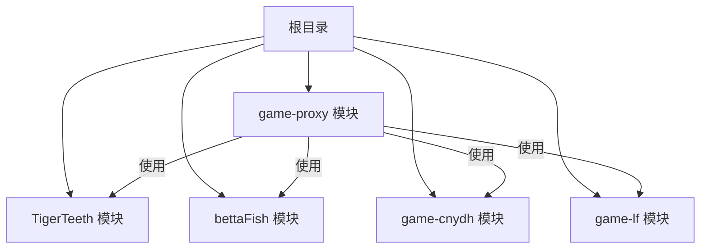
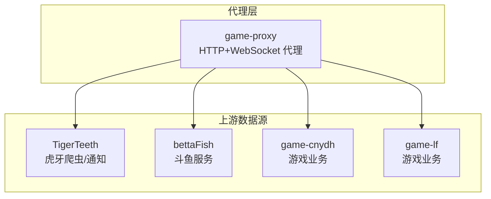
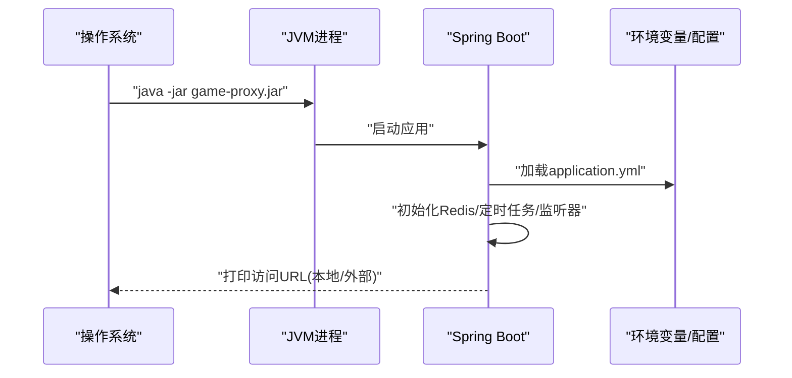
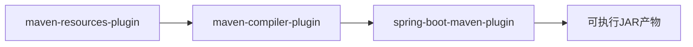

# 部署流程指南

<cite>
**本文档引用的文件**
- [game-proxy/pom.xml](file://game-proxy/pom.xml)
- [game-proxy/src/main/resources/application.yml](file://game-proxy/src/main/resources/application.yml)
- [game-proxy/src/main/java/com/game/AppApplication.java](file://game-proxy/src/main/java/com/game/AppApplication.java)
- [TigerTeeth/pom.xml](file://TigerTeeth/pom.xml)
- [TigerTeeth/src/main/resources/application.yml](file://TigerTeeth/src/main/resources/application.yml)
- [TigerTeeth/src/main/java/com/Application.java](file://TigerTeeth/src/main/java/com/Application.java)
- [bettaFish/pom.xml](file://bettaFish/pom.xml)
- [bettaFish/src/main/resources/application.properties](file://bettaFish/src/main/resources/application.properties)
- [game-cnydh/pom.xml](file://game-cnydh/pom.xml)
- [game-cnydh/src/main/resources/application.yml](file://game-cnydh/src/main/resources/application.yml)
- [game-lf/pom.xml](file://game-lf/pom.xml)
- [game-lf/src/main/resources/application.yml](file://game-lf/src/main/resources/application.yml)
</cite>

## 目录
1. [简介](#简介)
2. [项目结构](#项目结构)
3. [核心组件](#核心组件)
4. [架构总览](#架构总览)
5. [详细组件分析](#详细组件分析)
6. [依赖分析](#依赖分析)
7. [性能考虑](#性能考虑)
8. [故障排查指南](#故障排查指南)
9. [结论](#结论)
10. [附录](#附录)

## 简介
本指南面向游戏代理系统的生产部署，覆盖从源码构建到容器化部署、服务启动与高可用配置的全流程。文档基于仓库中的多模块Maven工程，说明各模块的构建顺序、依赖关系、打包产物、启动方式与配置要点，并提供环境检查清单、健康检查方法与回滚策略。

## 项目结构
该仓库采用多模块Maven布局，包含以下子模块：
- game-proxy：游戏代理主服务，提供HTTP接口与WebSocket客户端能力
- TigerTeeth：虎牙相关爬虫与通知处理模块
- bettaFish：斗鱼相关服务模块
- game-cnydh：部分游戏业务模块
- game-lf：另一部分游戏业务模块

图表来源
- [game-proxy/pom.xml](file://game-proxy/pom.xml#L1-L163)
- [TigerTeeth/pom.xml](file://TigerTeeth/pom.xml#L1-L160)
- [bettaFish/pom.xml](file://bettaFish/pom.xml#L1-L98)
- [game-cnydh/pom.xml](file://game-cnydh/pom.xml#L1-L159)
- [game-lf/pom.xml](file://game-lf/pom.xml#L1-L160)

章节来源
- [game-proxy/pom.xml](file://game-proxy/pom.xml#L1-L163)
- [TigerTeeth/pom.xml](file://TigerTeeth/pom.xml#L1-L160)
- [bettaFish/pom.xml](file://bettaFish/pom.xml#L1-L98)
- [game-cnydh/pom.xml](file://game-cnydh/pom.xml#L1-L159)
- [game-lf/pom.xml](file://game-lf/pom.xml#L1-L160)

## 核心组件
- 构建工具与版本
  - Maven：用于多模块构建与打包
  - Java 8：所有模块统一使用Java 8
  - Spring Boot 2.2.13.RELEASE：统一的父POM与插件版本
- 打包产物
  - 各模块均打包为可执行JAR（Spring Boot插件）
  - game-proxy最终产物名在构建配置中定义
- 关键配置
  - application.yml/application.properties：端口、上下文路径、Redis连接、HTTP连接池等
  - profile占位符：通过Maven属性注入运行环境

章节来源
- [game-proxy/pom.xml](file://game-proxy/pom.xml#L11-L24)
- [TigerTeeth/pom.xml](file://TigerTeeth/pom.xml#L11-L23)
- [bettaFish/pom.xml](file://bettaFish/pom.xml#L17-L24)
- [game-cnydh/pom.xml](file://game-cnydh/pom.xml#L11-L24)
- [game-lf/pom.xml](file://game-lf/pom.xml#L11-L24)

## 架构总览
下图展示各模块在生产环境中的角色与交互关系（概念性）：

## 详细组件分析

### game-proxy 组件
- 启动类与日志输出
  - 启动类负责读取端口与上下文路径并打印访问URL
- 配置要点
  - server.port、server.servlet.context-path
  - spring.redis.*：主机、端口、密码、超时与连接池
  - 自定义业务配置项（如会话与账号）
  - HTTP连接池参数：最大连接数、并发、超时等
- 构建与打包
  - 使用Spring Boot Maven插件生成可执行JAR
  - 资源过滤启用，支持profile占位符注入

图表来源
- [game-proxy/src/main/java/com/game/AppApplication.java](file://game-proxy/src/main/java/com/game/AppApplication.java#L24-L31)
- [game-proxy/src/main/resources/application.yml](file://game-proxy/src/main/resources/application.yml#L1-L58)

章节来源
- [game-proxy/src/main/java/com/game/AppApplication.java](file://game-proxy/src/main/java/com/game/AppApplication.java#L1-L33)
- [game-proxy/src/main/resources/application.yml](file://game-proxy/src/main/resources/application.yml#L1-L58)
- [game-proxy/pom.xml](file://game-proxy/pom.xml#L102-L142)

### TigerTeeth 组件
- 启动类与端口
  - 启动类位于根包空间
  - application.yml定义端口与上下文路径
- 依赖与网络
  - 包含HTTP客户端、WebSocket客户端、Netty等网络相关依赖
- 构建与打包
  - 使用Spring Boot插件，资源过滤开启

章节来源
- [TigerTeeth/src/main/java/com/Application.java](file://TigerTeeth/src/main/java/com/Application.java#L1-L14)
- [TigerTeeth/src/main/resources/application.yml](file://TigerTeeth/src/main/resources/application.yml#L1-L31)
- [TigerTeeth/pom.xml](file://TigerTeeth/pom.xml#L114-L154)

### bettaFish 组件
- 端口配置
  - application.properties定义server.port
- 依赖与网络
  - HTTP客户端与OKHttp等
- 构建与打包
  - 使用Spring Boot插件，资源过滤开启

章节来源
- [bettaFish/src/main/resources/application.properties](file://bettaFish/src/main/resources/application.properties#L1-L1)
- [bettaFish/pom.xml](file://bettaFish/pom.xml#L52-L94)

### game-cnydh 组件
- 端口配置
  - application.yml定义server.port
- 依赖与网络
  - 包含HTTP客户端、WebSocket、OKHttp、Redis Starter等
- 构建与打包
  - 使用Spring Boot插件，资源过滤开启

章节来源
- [game-cnydh/src/main/resources/application.yml](file://game-cnydh/src/main/resources/application.yml#L1-L1)
- [game-cnydh/pom.xml](file://game-cnydh/pom.xml#L98-L139)

### game-lf 组件
- 端口配置
  - application.yml定义server.port
- 依赖与网络
  - 包含HTTP客户端、WebSocket、OKHttp、Redis Starter等
- 构建与打包
  - 使用Spring Boot插件，资源过滤开启

章节来源
- [game-lf/src/main/resources/application.yml](file://game-lf/src/main/resources/application.yml#L1-L1)
- [game-lf/pom.xml](file://game-lf/pom.xml#L98-L139)

## 依赖分析
- 版本统一
  - 所有模块均继承自Spring Boot父POM，确保插件与依赖版本一致
- 插件链路
  - maven-resources-plugin：资源编码与过滤
  - maven-compiler-plugin：Java版本与编码
  - spring-boot-maven-plugin：打包可执行JAR，排除Lombok
- 模块间关系
  - 未发现模块间的直接依赖声明；game-proxy作为聚合入口，其他模块独立运行

图表来源
- [game-proxy/pom.xml](file://game-proxy/pom.xml#L112-L142)
- [TigerTeeth/pom.xml](file://TigerTeeth/pom.xml#L123-L153)
- [bettaFish/pom.xml](file://bettaFish/pom.xml#L61-L91)
- [game-cnydh/pom.xml](file://game-cnydh/pom.xml#L108-L139)
- [game-lf/pom.xml](file://game-lf/pom.xml#L109-L139)

章节来源
- [game-proxy/pom.xml](file://game-proxy/pom.xml#L112-L142)
- [TigerTeeth/pom.xml](file://TigerTeeth/pom.xml#L123-L153)
- [bettaFish/pom.xml](file://bettaFish/pom.xml#L61-L91)
- [game-cnydh/pom.xml](file://game-cnydh/pom.xml#L108-L139)
- [game-lf/pom.xml](file://game-lf/pom.xml#L109-L139)

## 性能考虑
- HTTP连接池
  - 合理设置最大连接数与并发，避免连接耗尽
  - 超时参数需结合上游服务稳定性调整
- Redis连接池
  - 连接池大小与阻塞等待时间应与业务QPS匹配
- WebSocket长连接
  - 建议实现自动重连与心跳检测，避免连接中断
- JVM参数建议
  - 初始堆与最大堆：根据服务内存占用与GC行为调优
  - GC策略：优先选择稳定低延迟的收集器组合
  - 元空间：预留足够元空间防止类加载溢出

## 故障排查指南
- 启动失败
  - 检查端口占用与上下文路径冲突
  - 校验Redis连接参数与可达性
  - 查看应用日志输出的访问URL定位问题
- 连接异常
  - HTTP客户端超时：增大超时参数或优化上游服务
  - WebSocket断连：检查重连逻辑与心跳间隔
- 配置问题
  - profile占位符未生效：确认Maven构建时的属性传递
- 健康检查
  - 访问应用根路径返回200即表示服务就绪
  - Redis连接可通过ping命令验证
  - 上游接口可调用关键接口进行连通性测试

章节来源
- [game-proxy/src/main/java/com/game/AppApplication.java](file://game-proxy/src/main/java/com/game/AppApplication.java#L24-L31)
- [game-proxy/src/main/resources/application.yml](file://game-proxy/src/main/resources/application.yml#L15-L31)

## 结论
本指南提供了从源码到生产的完整部署路径，明确了多模块构建顺序、打包产物、启动流程与配置要点。建议在生产环境中结合负载均衡与高可用策略，配合完善的监控与回滚机制，确保系统稳定运行。

## 附录

### A. Maven构建与打包流程
- 构建命令
  - 在根目录执行：mvn clean package -DskipTests
  - 如需切换profile：mvn clean package -DskipTests -Dprofiles.active=prod
- 产物位置
  - game-proxy/target 下生成可执行JAR
  - 其他模块同理，按各自target目录查找
- 构建顺序
  - 多模块并行构建，无显式依赖声明时按Maven默认顺序执行

章节来源
- [game-proxy/pom.xml](file://game-proxy/pom.xml#L112-L142)
- [TigerTeeth/pom.xml](file://TigerTeeth/pom.xml#L123-L153)
- [bettaFish/pom.xml](file://bettaFish/pom.xml#L61-L91)
- [game-cnydh/pom.xml](file://game-cnydh/pom.xml#L108-L139)
- [game-lf/pom.xml](file://game-lf/pom.xml#L109-L139)

### B. Docker容器化部署方案
- 基础镜像
  - 使用官方OpenJDK 8镜像作为基础镜像
- 构建步骤
  - 将game-proxy/target下的可执行JAR复制到镜像内
  - 设置JAVA_OPTS与JVM参数
  - 暴露应用端口（来自application.yml）
  - 设置ENTRYPOINT为java -jar启动
- 示例要点
  - 使用多阶段构建减少镜像体积
  - 将application.yml映射为挂载卷或通过构建参数注入profile
  - 为Redis等外部依赖准备独立容器或服务

### C. 服务启动流程与环境变量
- 启动脚本建议
  - 设置JAVA_OPTS（如-Xms、-Xmx、GC参数）
  - 设置-Dspring.profiles.active
  - 设置应用端口与上下文路径（如需要）
- 启动顺序
  - 先启动Redis（如使用）
  - 再启动game-proxy
  - 最后启动上游模块（如TigerTeeth/bettaFish等）

### D. 负载均衡与高可用
- 负载均衡
  - 使用Nginx/HAProxy将流量分发至多个game-proxy实例
  - 健康检查：定期探测根路径或专用健康端点
- 高可用
  - 多实例部署于多台主机
  - 使用共享Redis存储状态与会话
  - 实施蓝绿/滚动发布与自动回滚

### E. 部署前检查清单
- 环境准备
  - JDK 8已安装且JAVA_HOME正确
  - Maven已安装且网络可访问依赖仓库
  - Redis服务可用（如使用）
- 配置校验
  - application.yml中端口、上下文路径、Redis参数正确
  - profile占位符已通过Maven属性注入
- 权限与安全
  - 确认JAR文件权限与运行用户
  - Redis密码与网络ACL已配置

### F. 部署后健康检查
- 接口探活
  - GET 根路径返回200
  - Redis ping成功
- 性能指标
  - CPU/内存/GC频率在合理范围
  - HTTP/WS连接成功率与延迟

### G. 回滚策略
- 快速回滚
  - 保留上一版本JAR与配置
  - 通过负载均衡切换实例
- 自动回滚
  - 健康检查失败时自动摘除实例
  - 配合CI/CD流水线实现自动化回滚