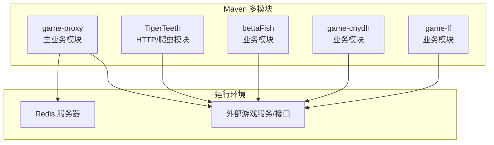
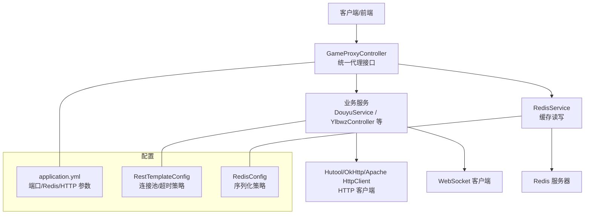
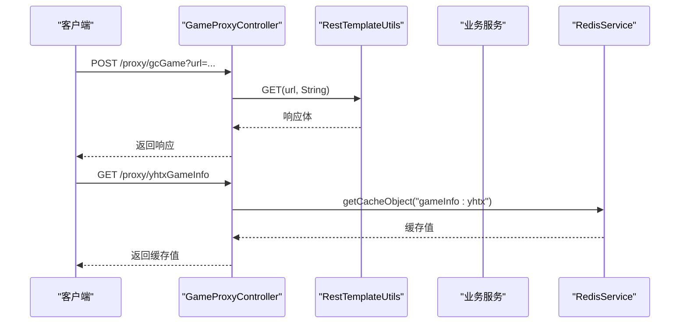
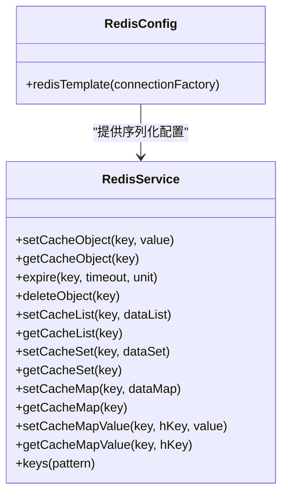
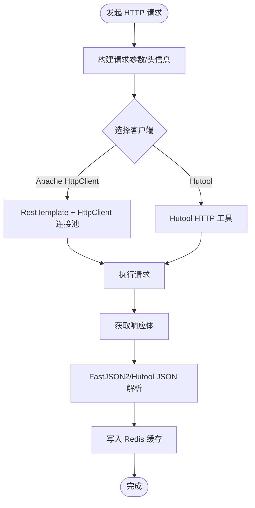
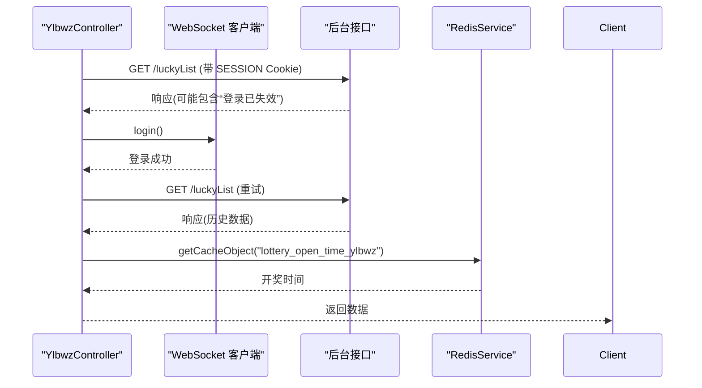
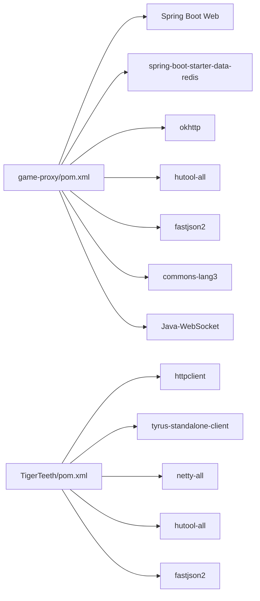

# 技术架构概览

<cite>
**本文引用的文件**
- [game-proxy/pom.xml](file://game-proxy/pom.xml)
- [TigerTeeth/pom.xml](file://TigerTeeth/pom.xml)
- [game-proxy/src/main/resources/application.yml](file://game-proxy/src/main/resources/application.yml)
- [TigerTeeth/src/main/resources/application.yml](file://TigerTeeth/src/main/resources/application.yml)
- [game-proxy/src/main/java/com/game/AppApplication.java](file://game-proxy/src/main/java/com/game/AppApplication.java)
- [TigerTeeth/src/main/java/com/Application.java](file://TigerTeeth/src/main/java/com/Application.java)
- [game-proxy/src/main/java/com/game/controller/GameProxyController.java](file://game-proxy/src/main/java/com/game/controller/GameProxyController.java)
- [game-proxy/src/main/java/com/game/redis/RedisConfig.java](file://game-proxy/src/main/java/com/game/redis/RedisConfig.java)
- [game-proxy/src/main/java/com/game/redis/RedisService.java](file://game-proxy/src/main/java/com/game/redis/RedisService.java)
- [game-proxy/src/main/java/com/game/douyu/DouyuService.java](file://game-proxy/src/main/java/com/game/douyu/DouyuService.java)
- [game-proxy/src/main/java/com/game/ylbwz/YlbwzController.java](file://game-proxy/src/main/java/com/game/ylbwz/YlbwzController.java)
- [game-proxy/src/main/java/com/game/commom/Constants.java](file://game-proxy/src/main/java/com/game/commom/Constants.java)
- [game-proxy/src/main/java/com/game/utils/DomainNameUtil.java](file://game-proxy/src/main/java/com/game/utils/DomainNameUtil.java)
- [game-proxy/src/main/java/com/game/utils/SpringUtils.java](file://game-proxy/src/main/java/com/game/utils/SpringUtils.java)
- [TigerTeeth/src/main/java/com/commom/RestTemplateConfig.java](file://TigerTeeth/src/main/java/com/commom/RestTemplateConfig.java)
</cite>

## 目录
1. [引言](#引言)
2. [项目结构](#项目结构)
3. [核心组件](#核心组件)
4. [架构总览](#架构总览)
5. [详细组件分析](#详细组件分析)
6. [依赖分析](#依赖分析)
7. [性能考量](#性能考量)
8. [故障排查指南](#故障排查指南)
9. [结论](#结论)
10. [附录](#附录)

## 引言
本项目围绕“游戏代理系统”构建，目标是为多个游戏平台提供统一的代理与数据中转能力，包括但不限于游戏信息缓存、定时任务调度、WebSocket 推送、第三方 HTTP 客户端集成以及与外部系统的对接。系统采用 Spring Boot 微服务化思路进行模块拆分与职责划分，结合 Redis 分布式缓存、OkHttp/HttpComponents 高性能 HTTP 客户端、Hutool 工具库与 FastJSON2 JSON 处理等技术栈，实现高并发、低耦合、易扩展的架构。

## 项目结构
项目采用 Maven 多模块组织方式，每个子模块聚焦特定业务域或通用能力，通过共享配置与公共组件实现复用。核心模块包括：
- game-proxy：主业务模块，提供统一的代理接口、Redis 缓存、定时任务、WebSocket 客户端、游戏服务对接等。
- TigerTeeth：独立爬虫/代理模块，侧重 HTTP 连接池与通用 RestTemplate 配置。
- bettaFish、game-cnydh、game-lf：其他业务模块（当前仓库未包含其完整源码），但通过 POM 可见其依赖与打包策略。

图表来源
- [game-proxy/pom.xml](file://game-proxy/pom.xml#L1-L163)
- [TigerTeeth/pom.xml](file://TigerTeeth/pom.xml#L1-L160)

章节来源
- [game-proxy/pom.xml](file://game-proxy/pom.xml#L1-L163)
- [TigerTeeth/pom.xml](file://TigerTeeth/pom.xml#L1-L160)

## 核心组件
- 应用入口与启动
  - game-proxy：通过 Spring Boot 启动类输出访问 URL，启用调度注解，便于定时任务与异步执行。
  - TigerTeeth：标准 Spring Boot 启动类，面向独立爬虫场景。
- 控制层与代理接口
  - 提供统一的代理接口，支持不同游戏的信息查询、时间同步、图片识别、开奖结果同步等。
- Redis 缓存层
  - 提供 RedisTemplate 序列化配置与常用 CRUD 封装，支撑游戏状态、时间、开奖结果等缓存。
- HTTP 客户端与工具
  - RestTemplate + Apache HttpClient 连接池配置（TigerTeeth）。
  - Hutool HTTP 工具与 FastJSON2 JSON 处理广泛使用于请求构造、数据解析与序列化。
- WebSocket 客户端
  - 针对特定游戏（如幽林保卫战）提供 WebSocket 登录与数据拉取能力。
- 定时任务与调度
  - 通过 Spring Scheduling 与自定义定时工厂实现周期性任务编排。

章节来源
- [game-proxy/src/main/java/com/game/AppApplication.java](file://game-proxy/src/main/java/com/game/AppApplication.java#L1-L33)
- [TigerTeeth/src/main/java/com/Application.java](file://TigerTeeth/src/main/java/com/Application.java#L1-L14)
- [game-proxy/src/main/java/com/game/controller/GameProxyController.java](file://game-proxy/src/main/java/com/game/controller/GameProxyController.java#L1-L436)
- [game-proxy/src/main/java/com/game/redis/RedisConfig.java](file://game-proxy/src/main/java/com/game/redis/RedisConfig.java#L1-L41)
- [game-proxy/src/main/java/com/game/redis/RedisService.java](file://game-proxy/src/main/java/com/game/redis/RedisService.java#L1-L244)
- [TigerTeeth/src/main/java/com/commom/RestTemplateConfig.java](file://TigerTeeth/src/main/java/com/commom/RestTemplateConfig.java#L1-L132)

## 架构总览
系统采用“集中式控制 + 分布式缓存 + 多客户端适配”的微服务化架构：
- 控制层：统一对外暴露 REST 接口，聚合内部服务与外部接口。
- 缓存层：Redis 提供高吞吐读写与会话/状态持久化。
- 适配层：针对不同游戏平台提供专用服务与客户端（HTTP/WS/OkHttp）。
- 配置层：通过 application.yml 统一管理端口、Redis 连接、HTTP 连接池参数与业务开关。

图表来源
- [game-proxy/src/main/java/com/game/controller/GameProxyController.java](file://game-proxy/src/main/java/com/game/controller/GameProxyController.java#L1-L436)
- [game-proxy/src/main/java/com/game/redis/RedisService.java](file://game-proxy/src/main/java/com/game/redis/RedisService.java#L1-L244)
- [TigerTeeth/src/main/java/com/commom/RestTemplateConfig.java](file://TigerTeeth/src/main/java/com/commom/RestTemplateConfig.java#L1-L132)
- [game-proxy/src/main/resources/application.yml](file://game-proxy/src/main/resources/application.yml#L1-L58)

## 详细组件分析

### 控制层与代理接口
- 统一代理接口：提供古城、幽林、银河探险、灵宠召唤、大话三国、小红帽、怪物捕手、UU 农场、一千零一夜、宠物马拉松等游戏信息的代理与缓存读取。
- 图片识别与开奖结果同步：对深海秘境图片进行识别后，向多个目标地址同步开奖结果。
- 时间同步：支持多种格式的时间输入，转换为统一的毫秒级时间戳并写入缓存。

图表来源
- [game-proxy/src/main/java/com/game/controller/GameProxyController.java](file://game-proxy/src/main/java/com/game/controller/GameProxyController.java#L1-L436)
- [game-proxy/src/main/java/com/game/redis/RedisService.java](file://game-proxy/src/main/java/com/game/redis/RedisService.java#L1-L244)

章节来源
- [game-proxy/src/main/java/com/game/controller/GameProxyController.java](file://game-proxy/src/main/java/com/game/controller/GameProxyController.java#L1-L436)

### Redis 缓存层
- RedisConfig：配置 String 与 JSON 序列化策略，确保键值与对象的正确存储与读取。
- RedisService：封装常用操作（字符串、列表、集合、哈希），提供过期时间设置、批量删除、模式匹配等能力，支撑多游戏状态与时间缓存。

图表来源
- [game-proxy/src/main/java/com/game/redis/RedisConfig.java](file://game-proxy/src/main/java/com/game/redis/RedisConfig.java#L1-L41)
- [game-proxy/src/main/java/com/game/redis/RedisService.java](file://game-proxy/src/main/java/com/game/redis/RedisService.java#L1-L244)

章节来源
- [game-proxy/src/main/java/com/game/redis/RedisConfig.java](file://game-proxy/src/main/java/com/game/redis/RedisConfig.java#L1-L41)
- [game-proxy/src/main/java/com/game/redis/RedisService.java](file://game-proxy/src/main/java/com/game/redis/RedisService.java#L1-L244)

### HTTP 客户端与工具
- RestTemplateConfig（TigerTeeth）：基于 Apache HttpClient 的连接池配置，统一超时、Keep-Alive、重试策略与默认 Header，提升稳定性与性能。
- Hutool 工具：简化 HTTP 请求、JSON 解析、日期时间处理等常见操作，降低样板代码。
- FastJSON2：高性能 JSON 解析与序列化，配合 Hutool JSON 工具类使用，保证数据交换效率。

图表来源
- [TigerTeeth/src/main/java/com/commom/RestTemplateConfig.java](file://TigerTeeth/src/main/java/com/commom/RestTemplateConfig.java#L1-L132)
- [game-proxy/src/main/java/com/game/controller/GameProxyController.java](file://game-proxy/src/main/java/com/game/controller/GameProxyController.java#L1-L436)

章节来源
- [TigerTeeth/src/main/java/com/commom/RestTemplateConfig.java](file://TigerTeeth/src/main/java/com/commom/RestTemplateConfig.java#L1-L132)

### WebSocket 客户端与业务服务
- DouyuService：封装斗鱼相关请求流程，使用线程池异步初始化与执行，结合 Hutool HTTP 完成数据获取。
- YlbwzController：通过 SESSION Cookie 访问后台接口，自动处理登录失效并重试，同时提供 Redis 中开奖时间查询。

图表来源
- [game-proxy/src/main/java/com/game/douyu/DouyuService.java](file://game-proxy/src/main/java/com/game/douyu/DouyuService.java#L1-L60)
- [game-proxy/src/main/java/com/game/ylbwz/YlbwzController.java](file://game-proxy/src/main/java/com/game/ylbwz/YlbwzController.java#L1-L74)
- [game-proxy/src/main/java/com/game/redis/RedisService.java](file://game-proxy/src/main/java/com/game/redis/RedisService.java#L1-L244)

章节来源
- [game-proxy/src/main/java/com/game/douyu/DouyuService.java](file://game-proxy/src/main/java/com/game/douyu/DouyuService.java#L1-L60)
- [game-proxy/src/main/java/com/game/ylbwz/YlbwzController.java](file://game-proxy/src/main/java/com/game/ylbwz/YlbwzController.java#L1-L74)

### 定时任务与调度
- 通过 Spring Scheduling 与自定义定时工厂实现周期性任务编排，结合 Redis 缓存与业务服务，实现定时刷新与清理。
- 业务常量与域名工具：集中管理外部接口地址与多域名切换，便于灰度与容灾。

章节来源
- [game-proxy/src/main/java/com/game/commom/Constants.java](file://game-proxy/src/main/java/com/game/commom/Constants.java#L1-L14)
- [game-proxy/src/main/java/com/game/utils/DomainNameUtil.java](file://game-proxy/src/main/java/com/game/utils/DomainNameUtil.java#L1-L16)
- [game-proxy/src/main/java/com/game/utils/SpringUtils.java](file://game-proxy/src/main/java/com/game/utils/SpringUtils.java#L1-L103)

## 依赖分析
- Spring Boot：提供自动装配、Web MVC、Redis Starter、定时任务等基础能力。
- Redis：spring-boot-starter-data-redis + Lettuce 连接池，配合自定义序列化策略。
- HTTP 客户端：Apache HttpClient（RestTemplate）、Hutool HTTP、OkHttp（部分模块）。
- JSON：FastJSON2 + Hutool JSON 工具类。
- 工具库：Hutool 提供日期、加密、IO、HTTP 等便捷能力。
- WebSocket：Java-WebSocket 或 Tyrus（TigerTeeth）用于客户端连接。

图表来源
- [game-proxy/pom.xml](file://game-proxy/pom.xml#L1-L163)
- [TigerTeeth/pom.xml](file://TigerTeeth/pom.xml#L1-L160)

章节来源
- [game-proxy/pom.xml](file://game-proxy/pom.xml#L1-L163)
- [TigerTeeth/pom.xml](file://TigerTeeth/pom.xml#L1-L160)

## 性能考量
- 连接池与超时：通过 RestTemplate + HttpClient 连接池配置，合理设置最大连接数、并发路由限制、连接/套接字超时，避免阻塞与资源浪费。
- 缓存命中：Redis 作为热点数据缓存，减少重复请求与外部依赖，建议根据业务设定合理的过期策略与键空间规划。
- 异步与线程池：业务服务使用线程池异步初始化与执行，避免阻塞主线程，提高吞吐。
- 序列化优化：Redis 使用 JSON 序列化，减少二次解析成本；HTTP 响应体直接缓存字符串，避免重复反序列化。
- 图片识别限流：对高频接口增加限流保护，防止触发风控或资源耗尽。

章节来源
- [TigerTeeth/src/main/java/com/commom/RestTemplateConfig.java](file://TigerTeeth/src/main/java/com/commom/RestTemplateConfig.java#L1-L132)
- [game-proxy/src/main/java/com/game/controller/GameProxyController.java](file://game-proxy/src/main/java/com/game/controller/GameProxyController.java#L357-L412)

## 故障排查指南
- Redis 连接失败
  - 检查 application.yml 中 Redis 地址、端口、密码与超时配置。
  - 确认 Redis 服务可达与网络策略放行。
- HTTP 请求异常
  - 查看连接池参数与超时设置，确认外部接口可用性与证书/域名校验。
  - 对于 RestTemplate，关注连接获取超时与套接字超时。
- WebSocket 登录失效
  - 观察接口返回“登录已失效”，触发重登逻辑并重试。
- 缓存未命中或脏数据
  - 检查键命名规范与过期时间，必要时清理缓存并验证序列化策略。
- 日志定位
  - 启动类输出访问 URL 与 Swagger 地址，便于快速验证服务状态。

章节来源
- [game-proxy/src/main/resources/application.yml](file://game-proxy/src/main/resources/application.yml#L1-L58)
- [TigerTeeth/src/main/resources/application.yml](file://TigerTeeth/src/main/resources/application.yml#L1-L31)
- [game-proxy/src/main/java/com/game/AppApplication.java](file://game-proxy/src/main/java/com/game/AppApplication.java#L24-L31)
- [game-proxy/src/main/java/com/game/ylbwz/YlbwzController.java](file://game-proxy/src/main/java/com/game/ylbwz/YlbwzController.java#L34-L37)

## 结论
本项目通过 Spring Boot 微服务化拆分、Redis 分布式缓存、多客户端适配与 Hutool/FastJSON2 工具链，构建了高可用、可扩展的游戏代理系统。在性能方面，连接池与缓存策略有效降低了延迟与外部依赖压力；在可维护性方面，统一的配置与工具类提升了开发效率。未来可在以下方向持续优化：统一认证与网关、可观测性增强（日志/指标/追踪）、灰度发布与熔断降级、容器化与弹性伸缩。

## 附录
- 关键配置项参考
  - server.port、server.servlet.context-path：服务端口与上下文路径。
  - spring.redis.*：Redis 连接与连接池配置。
  - http.*：HTTP 客户端连接池与超时参数。
- 常用依赖版本
  - Spring Boot：2.2.13.RELEASE
  - Hutool：5.8.x
  - FastJSON2：2.0.50+
  - OkHttp：4.10.0
  - Java 版本：1.8

章节来源
- [game-proxy/src/main/resources/application.yml](file://game-proxy/src/main/resources/application.yml#L1-L58)
- [TigerTeeth/src/main/resources/application.yml](file://TigerTeeth/src/main/resources/application.yml#L1-L31)
- [game-proxy/pom.xml](file://game-proxy/pom.xml#L1-L163)
- [TigerTeeth/pom.xml](file://TigerTeeth/pom.xml#L1-L160)