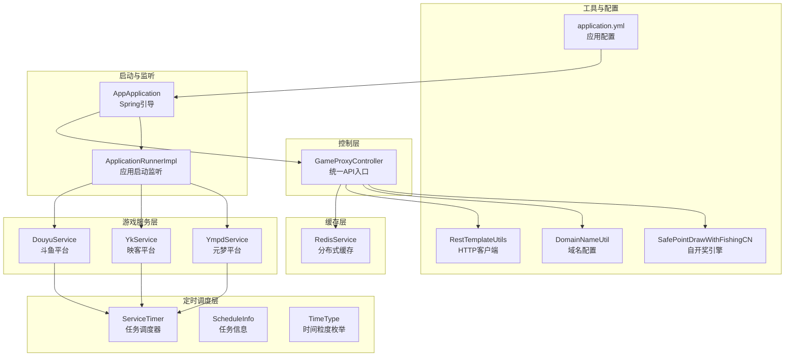
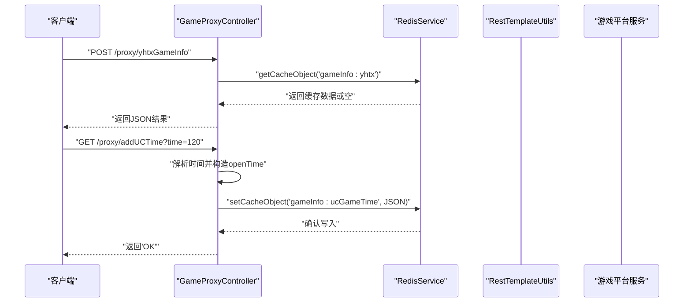
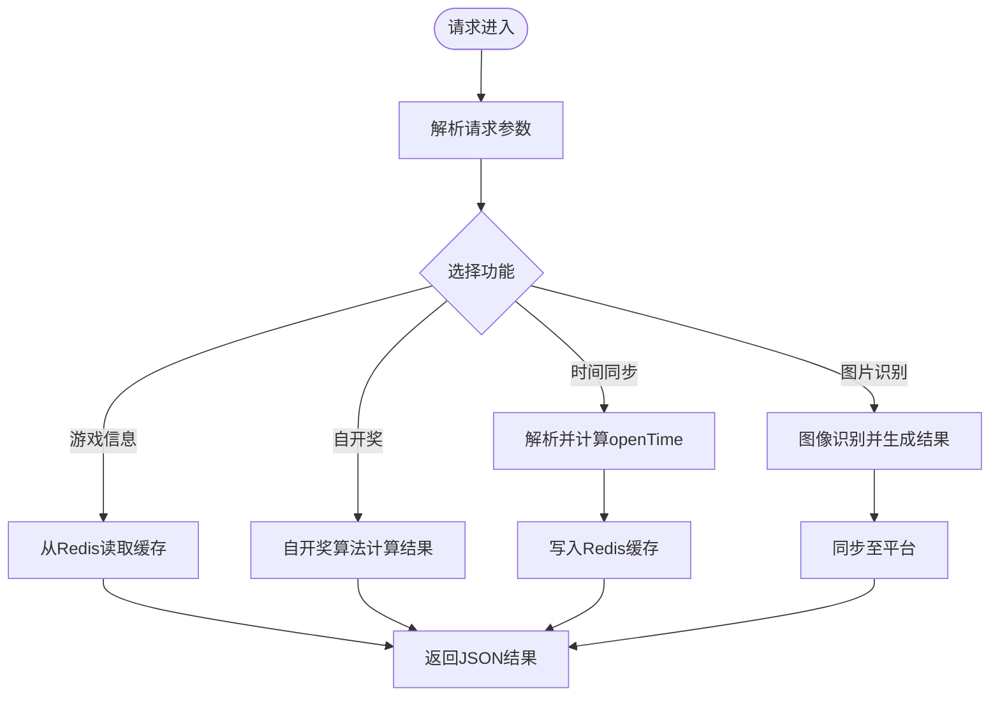
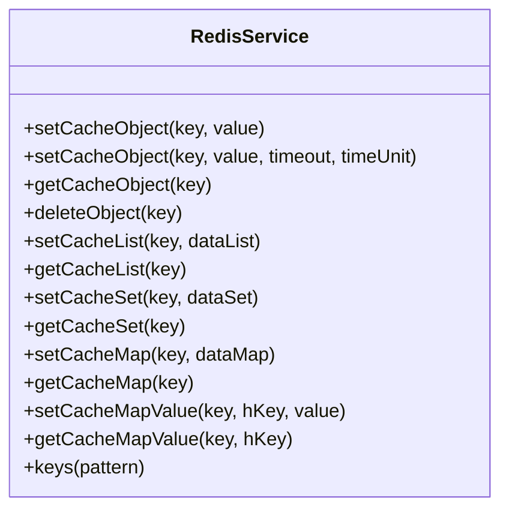
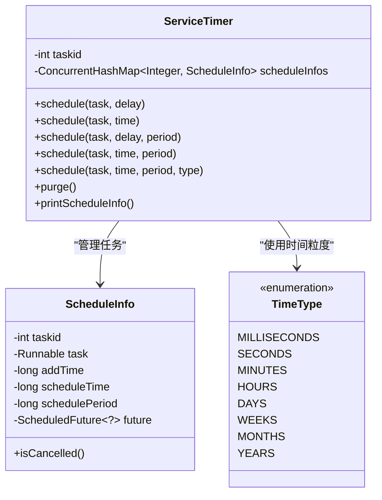
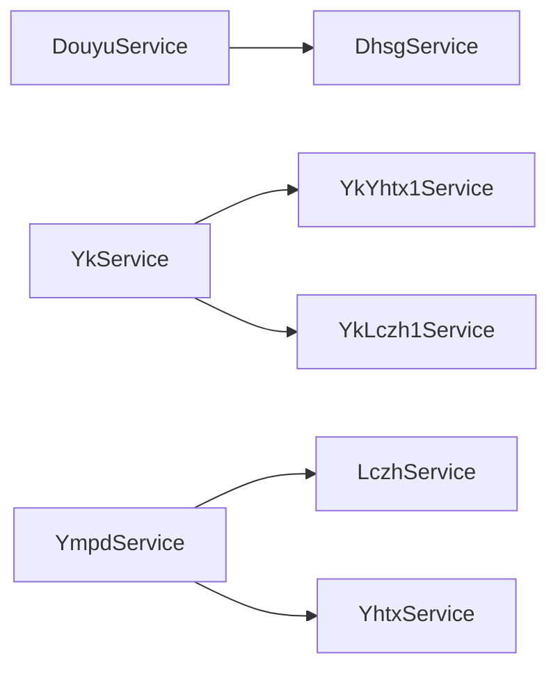
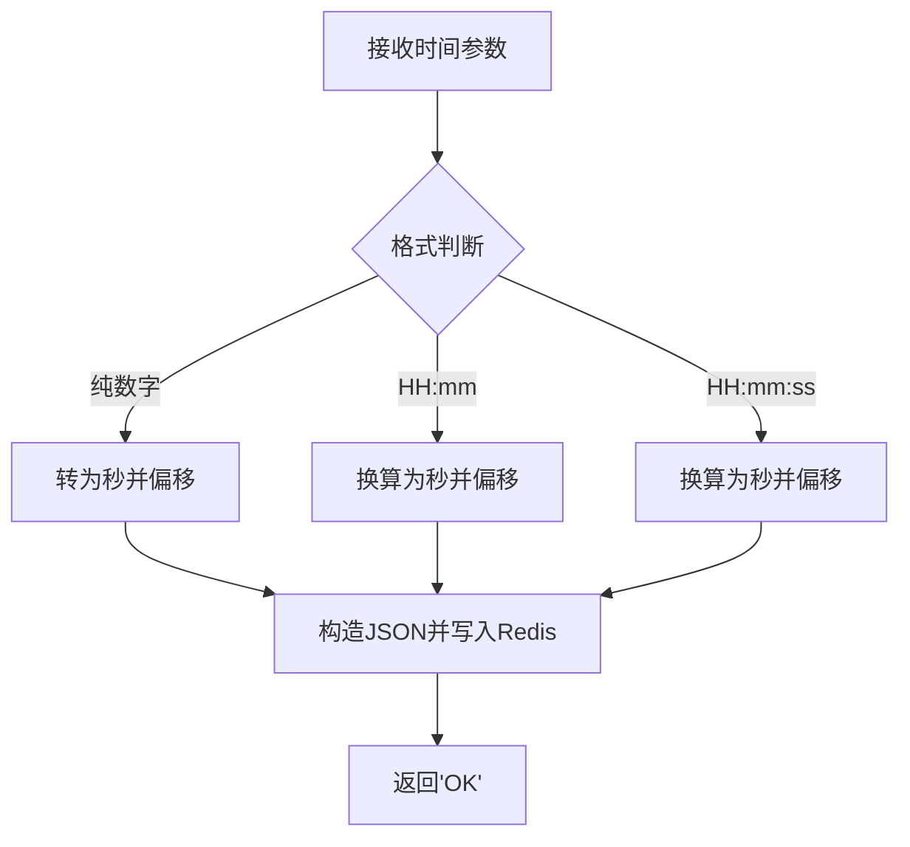
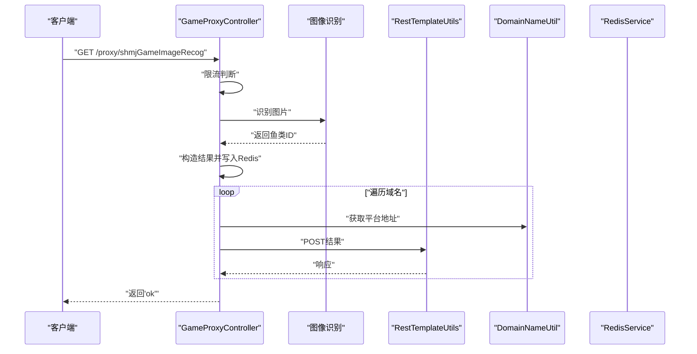
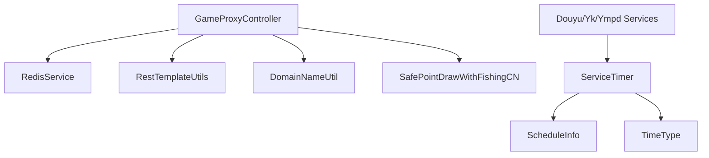

# 核心功能特性

<cite>
**本文引用的文件**
- [AppApplication.java](file://game-proxy/src/main/java/com/game/AppApplication.java)
- [GameProxyController.java](file://game-proxy/src/main/java/com/game/controller/GameProxyController.java)
- [RedisService.java](file://game-proxy/src/main/java/com/game/redis/RedisService.java)
- [ServiceTimer.java](file://game-proxy/src/main/java/com/game/timer/ServiceTimer.java)
- [ScheduleInfo.java](file://game-proxy/src/main/java/com/game/timer/ScheduleInfo.java)
- [TimeType.java](file://game-proxy/src/main/java/com/game/timer/TimeType.java)
- [RestTemplateUtils.java](file://game-proxy/src/main/java/com/game/commom/RestTemplateUtils.java)
- [DomainNameUtil.java](file://game-proxy/src/main/java/com/game/utils/DomainNameUtil.java)
- [SafePointDrawWithFishingCN.java](file://game-proxy/src/main/java/com/game/utils/SafePointDrawWithFishingCN.java)
- [DouyuService.java](file://game-proxy/src/main/java/com/game/douyu/DouyuService.java)
- [YkService.java](file://game-proxy/src/main/java/com/game/yk/YkService.java)
- [YmpdService.java](file://game-proxy/src/main/java/com/game/ympd/YmpdService.java)
- [application.yml](file://game-proxy/src/main/resources/application.yml)
- [ApplicationRunnerImpl.java](file://game-proxy/src/main/java/com/game/listener/ApplicationRunnerImpl.java)
- [pom.xml](file://game-proxy/pom.xml)
</cite>

## 目录
1. [简介](#简介)
2. [项目结构](#项目结构)
3. [核心组件](#核心组件)
4. [架构总览](#架构总览)
5. [详细组件分析](#详细组件分析)
6. [依赖分析](#依赖分析)
7. [性能考量](#性能考量)
8. [故障排查指南](#故障排查指南)
9. [结论](#结论)
10. [附录](#附录)

## 简介
本系统是一个面向多游戏平台的代理与监控系统，提供统一的API接口、实时游戏监控、自动时间同步、多游戏支持以及智能缓存管理等核心能力。通过集中化的控制器对外暴露统一入口，结合分布式缓存与定时调度，支撑多游戏平台的统一运营与数据同步。

## 项目结构
系统采用按功能域划分的模块化组织方式，核心模块包括：
- 控制层：统一对外接口，负责路由与参数处理
- 缓存层：基于Redis的分布式缓存，提供高性能读写
- 定时调度层：可扩展的任务调度器，支持多种时间粒度
- 游戏服务层：对接多个游戏平台，封装平台差异
- 工具与配置：HTTP客户端、域名配置、通用工具类
- 启动与监听：应用启动流程与初始化任务编排

图表来源
- [GameProxyController.java](file://game-proxy/src/main/java/com/game/controller/GameProxyController.java#L36-L436)
- [RedisService.java](file://game-proxy/src/main/java/com/game/redis/RedisService.java#L20-L244)
- [ServiceTimer.java](file://game-proxy/src/main/java/com/game/timer/ServiceTimer.java#L16-L164)
- [ScheduleInfo.java](file://game-proxy/src/main/java/com/game/timer/ScheduleInfo.java#L5-L66)
- [TimeType.java](file://game-proxy/src/main/java/com/game/timer/TimeType.java#L3-L24)
- [DouyuService.java](file://game-proxy/src/main/java/com/game/douyu/DouyuService.java#L20-L60)
- [YkService.java](file://game-proxy/src/main/java/com/game/yk/YkService.java#L19-L72)
- [YmpdService.java](file://game-proxy/src/main/java/com/game/ympd/YmpdService.java#L18-L83)
- [RestTemplateUtils.java](file://game-proxy/src/main/java/com/game/commom/RestTemplateUtils.java#L14-L51)
- [DomainNameUtil.java](file://game-proxy/src/main/java/com/game/utils/DomainNameUtil.java#L3-L16)
- [SafePointDrawWithFishingCN.java](file://game-proxy/src/main/java/com/game/utils/SafePointDrawWithFishingCN.java#L18-L316)
- [application.yml](file://game-proxy/src/main/resources/application.yml#L1-L58)
- [ApplicationRunnerImpl.java](file://game-proxy/src/main/java/com/game/listener/ApplicationRunnerImpl.java#L33-L174)
- [AppApplication.java](file://game-proxy/src/main/java/com/game/AppApplication.java#L17-L33)

章节来源
- [AppApplication.java](file://game-proxy/src/main/java/com/game/AppApplication.java#L17-L33)
- [application.yml](file://game-proxy/src/main/resources/application.yml#L1-L58)

## 核心组件
- 统一游戏代理接口：通过控制器集中暴露REST接口，统一处理多游戏平台的请求与响应，并提供缓存读取与写入能力。
- 实时游戏监控：通过定时调度器周期性拉取各平台游戏状态，结合缓存进行数据持久化与查询。
- 自动时间同步：提供多格式时间解析与缓存写入，支持不同游戏平台的时间同步策略。
- 多游戏支持：封装不同游戏平台的服务适配器，屏蔽平台差异，便于扩展新平台。
- 智能缓存管理：基于Redis的统一缓存抽象，提供多种数据结构操作与过期控制。

章节来源
- [GameProxyController.java](file://game-proxy/src/main/java/com/game/controller/GameProxyController.java#L41-L436)
- [RedisService.java](file://game-proxy/src/main/java/com/game/redis/RedisService.java#L20-L244)
- [ServiceTimer.java](file://game-proxy/src/main/java/com/game/timer/ServiceTimer.java#L16-L164)

## 架构总览
系统采用“控制器-缓存-调度-服务”的分层架构，控制器作为统一入口，缓存提供数据持久化与共享，调度器负责周期性任务，服务层对接外部平台。

图表来源
- [GameProxyController.java](file://game-proxy/src/main/java/com/game/controller/GameProxyController.java#L82-L208)
- [RedisService.java](file://game-proxy/src/main/java/com/game/redis/RedisService.java#L95-L107)
- [RestTemplateUtils.java](file://game-proxy/src/main/java/com/game/commom/RestTemplateUtils.java#L26-L44)

## 详细组件分析

### 统一游戏代理接口（GameProxyController）
- 职责与作用
  - 提供多游戏平台的统一访问入口，包括游戏信息查询、时间同步、图片识别与自开奖等功能。
  - 通过缓存读取与写入，实现跨平台数据的统一存储与查询。
  - 使用HTTP工具类进行外部平台请求转发与响应处理。
- 关键实现要点
  - 游戏信息接口：针对不同游戏平台提供独立的查询方法，统一从缓存读取。
  - 时间同步接口：支持多种时间格式解析，将计算后的开放时间写入缓存。
  - 图片识别与自开奖：集成图像识别与自开奖算法，将结果同步至相关平台。
- 数据流转
  - 控制器接收请求参数，调用缓存服务读取或写入数据，必要时通过HTTP工具类访问外部平台。
- 扩展建议
  - 新增平台时，在控制器中新增对应接口，并在缓存键命名上遵循统一规范。

图表来源
- [GameProxyController.java](file://game-proxy/src/main/java/com/game/controller/GameProxyController.java#L51-L436)
- [RedisService.java](file://game-proxy/src/main/java/com/game/redis/RedisService.java#L95-L107)
- [RestTemplateUtils.java](file://game-proxy/src/main/java/com/game/commom/RestTemplateUtils.java#L26-L44)

章节来源
- [GameProxyController.java](file://game-proxy/src/main/java/com/game/controller/GameProxyController.java#L41-L436)

### 分布式缓存（RedisService）
- 职责与作用
  - 提供统一的Redis操作接口，支持字符串、列表、集合、哈希等多种数据结构。
  - 支持设置过期时间、批量删除、键匹配等常用操作。
- 关键实现要点
  - 基于Spring Data Redis的模板方法，封装常用操作，简化调用方代码。
  - 提供泛型支持，确保类型安全。
- 性能与可靠性
  - 通过连接池配置提升并发性能；合理设置过期时间避免内存泄漏。

图表来源
- [RedisService.java](file://game-proxy/src/main/java/com/game/redis/RedisService.java#L20-L244)

章节来源
- [RedisService.java](file://game-proxy/src/main/java/com/game/redis/RedisService.java#L20-L244)

### 定时任务调度（ServiceTimer）
- 职责与作用
  - 提供统一的定时任务调度能力，支持一次性与周期性任务。
  - 内部维护任务信息与清理机制，保证资源回收。
- 关键实现要点
  - 支持多种时间粒度（毫秒、秒、分钟、小时、天、周、月、年）。
  - 提供任务取消检测与自动清理，避免悬挂任务。
- 使用场景
  - 周期性拉取游戏状态、健康检查与重启检测等。

图表来源
- [ServiceTimer.java](file://game-proxy/src/main/java/com/game/timer/ServiceTimer.java#L16-L164)
- [ScheduleInfo.java](file://game-proxy/src/main/java/com/game/timer/ScheduleInfo.java#L5-L66)
- [TimeType.java](file://game-proxy/src/main/java/com/game/timer/TimeType.java#L3-L24)

章节来源
- [ServiceTimer.java](file://game-proxy/src/main/java/com/game/timer/ServiceTimer.java#L16-L164)
- [ScheduleInfo.java](file://game-proxy/src/main/java/com/game/timer/ScheduleInfo.java#L5-L66)
- [TimeType.java](file://game-proxy/src/main/java/com/game/timer/TimeType.java#L3-L24)

### 多游戏支持（平台服务）
- 斗鱼平台（DouyuService）
  - 负责初始化与数据请求，封装平台差异。
- 映客平台（YkService）
  - 并行初始化多个子服务，统一请求入口。
- 元梦平台（YmpdService）
  - 登录获取令牌，周期性健康检查与重启检测。

图表来源
- [DouyuService.java](file://game-proxy/src/main/java/com/game/douyu/DouyuService.java#L20-L60)
- [YkService.java](file://game-proxy/src/main/java/com/game/yk/YkService.java#L19-L72)
- [YmpdService.java](file://game-proxy/src/main/java/com/game/ympd/YmpdService.java#L18-L83)

章节来源
- [DouyuService.java](file://game-proxy/src/main/java/com/game/douyu/DouyuService.java#L20-L60)
- [YkService.java](file://game-proxy/src/main/java/com/game/yk/YkService.java#L19-L72)
- [YmpdService.java](file://game-proxy/src/main/java/com/game/ympd/YmpdService.java#L18-L83)

### 自动时间同步与缓存写入
- 功能概述
  - 支持多种时间格式输入，统一转换为标准时间戳并写入缓存。
  - 提供读取与删除接口，便于前端与监控系统使用。
- 实现要点
  - 解析逻辑覆盖秒、分钟、小时与“HH:mm:ss”格式。
  - 写入缓存时设置合理的过期时间，避免脏数据滞留。

图表来源
- [GameProxyController.java](file://game-proxy/src/main/java/com/game/controller/GameProxyController.java#L306-L337)
- [RedisService.java](file://game-proxy/src/main/java/com/game/redis/RedisService.java#L30-L44)

章节来源
- [GameProxyController.java](file://game-proxy/src/main/java/com/game/controller/GameProxyController.java#L306-L337)
- [RedisService.java](file://game-proxy/src/main/java/com/game/redis/RedisService.java#L30-L44)

### 图片识别与自开奖
- 图片识别（深海秘境）
  - 限制调用频率，避免重复请求；识别后将结果同步至多个平台。
- 自开奖（SafePointDrawWithFishingCN）
  - 提供完整的自开奖算法，包含水洗、补偿与捕鱼模块，支持每日上限控制与强随机扰动。

图表来源
- [GameProxyController.java](file://game-proxy/src/main/java/com/game/controller/GameProxyController.java#L360-L412)
- [DomainNameUtil.java](file://game-proxy/src/main/java/com/game/utils/DomainNameUtil.java#L3-L16)
- [RestTemplateUtils.java](file://game-proxy/src/main/java/com/game/commom/RestTemplateUtils.java#L26-L44)
- [RedisService.java](file://game-proxy/src/main/java/com/game/redis/RedisService.java#L95-L107)

章节来源
- [GameProxyController.java](file://game-proxy/src/main/java/com/game/controller/GameProxyController.java#L360-L412)
- [SafePointDrawWithFishingCN.java](file://game-proxy/src/main/java/com/game/utils/SafePointDrawWithFishingCN.java#L18-L316)

## 依赖分析
- 组件耦合
  - 控制器依赖缓存与HTTP工具类，体现清晰的职责分离。
  - 平台服务通过调度器与工具类协同工作，降低对控制器的直接依赖。
- 外部依赖
  - Redis用于缓存与会话管理。
  - Spring Web与Spring Data Redis提供Web与缓存基础设施。
  - Hutool与Fastjson2提供常用工具与JSON处理能力。

图表来源
- [GameProxyController.java](file://game-proxy/src/main/java/com/game/controller/GameProxyController.java#L41-L436)
- [RedisService.java](file://game-proxy/src/main/java/com/game/redis/RedisService.java#L20-L244)
- [ServiceTimer.java](file://game-proxy/src/main/java/com/game/timer/ServiceTimer.java#L16-L164)
- [ScheduleInfo.java](file://game-proxy/src/main/java/com/game/timer/ScheduleInfo.java#L5-L66)
- [TimeType.java](file://game-proxy/src/main/java/com/game/timer/TimeType.java#L3-L24)
- [RestTemplateUtils.java](file://game-proxy/src/main/java/com/game/commom/RestTemplateUtils.java#L14-L51)
- [DomainNameUtil.java](file://game-proxy/src/main/java/com/game/utils/DomainNameUtil.java#L3-L16)
- [SafePointDrawWithFishingCN.java](file://game-proxy/src/main/java/com/game/utils/SafePointDrawWithFishingCN.java#L18-L316)

章节来源
- [pom.xml](file://game-proxy/pom.xml#L26-L100)

## 性能考量
- 缓存命中与过期策略
  - 合理设置缓存过期时间，避免热点数据长期驻留。
  - 使用批量读取与写入减少网络往返。
- 线程池与调度
  - 调度器线程池大小与任务清理周期需根据业务量调整。
  - 平台服务初始化采用异步线程池，避免阻塞主线程。
- 网络与超时
  - HTTP客户端超时参数需结合平台响应时间优化，防止连接堆积。

## 故障排查指南
- 接口限流
  - 图片识别接口存在5秒内限流保护，频繁调用会被拒绝。可通过增加间隔或优化触发条件解决。
- 缓存异常
  - Redis连接失败或写入异常时，控制器会记录错误日志。检查Redis连接配置与密码。
- 平台初始化
  - 平台服务初始化失败通常由网络或认证问题导致。查看启动监听器的日志输出，确认初始化流程。
- 时间同步
  - 时间格式不正确会导致解析失败。确保传入格式符合预期，或使用标准时间戳。

章节来源
- [GameProxyController.java](file://game-proxy/src/main/java/com/game/controller/GameProxyController.java#L368-L407)
- [ApplicationRunnerImpl.java](file://game-proxy/src/main/java/com/game/listener/ApplicationRunnerImpl.java#L64-L145)

## 结论
该系统通过统一的代理接口、智能缓存与定时调度，实现了多游戏平台的高效接入与数据同步。其模块化设计便于扩展新平台与新功能，同时具备良好的性能与可维护性。建议在生产环境中进一步完善监控与告警体系，并持续优化缓存与调度策略以适应业务增长。

## 附录
- 配置参考
  - 应用端口与上下文路径、Redis连接参数、HTTP客户端超时等均在配置文件中集中管理。
- 启动流程
  - 应用启动后，监听器负责初始化各平台服务与Socket连接，控制器随后对外提供统一接口。

章节来源
- [application.yml](file://game-proxy/src/main/resources/application.yml#L1-L58)
- [ApplicationRunnerImpl.java](file://game-proxy/src/main/java/com/game/listener/ApplicationRunnerImpl.java#L64-L145)
- [AppApplication.java](file://game-proxy/src/main/java/com/game/AppApplication.java#L17-L33)