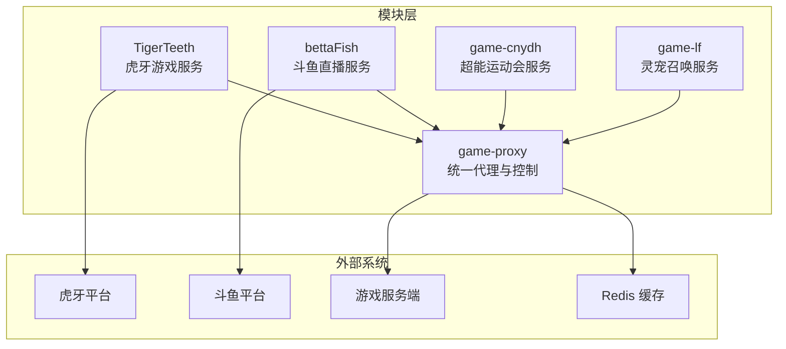
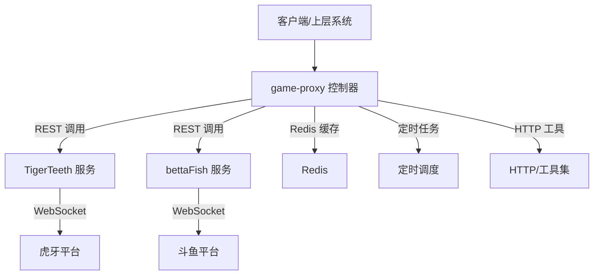
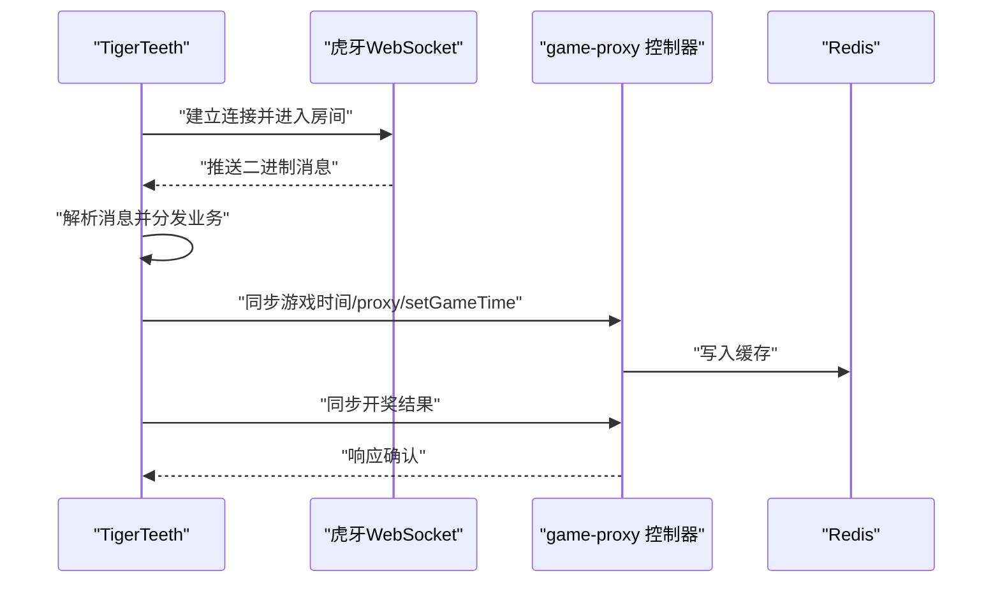
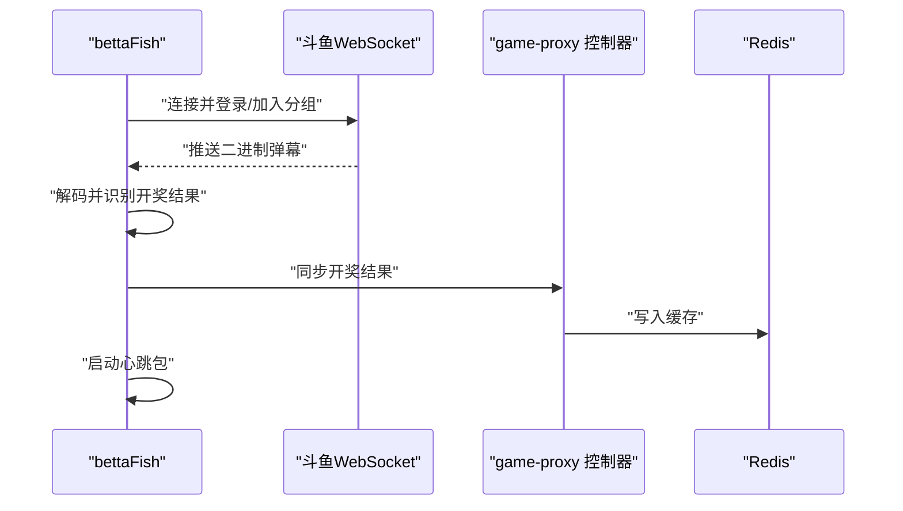
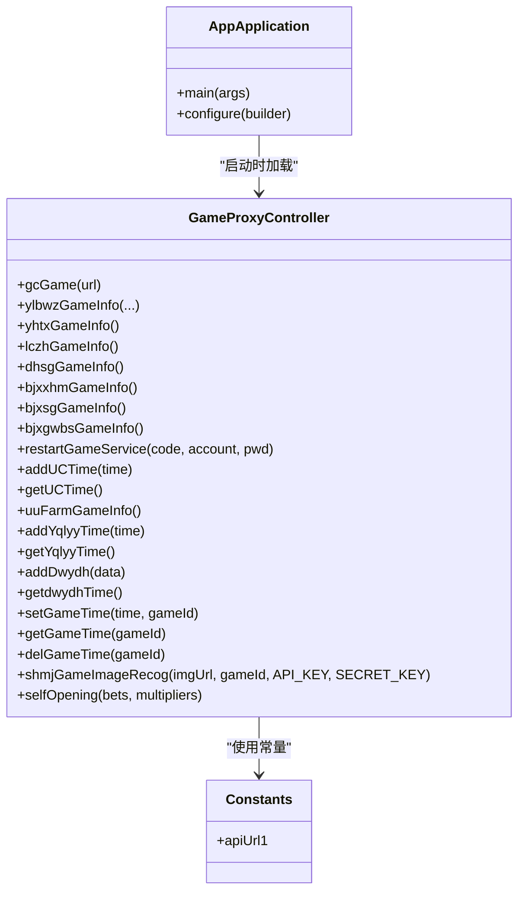
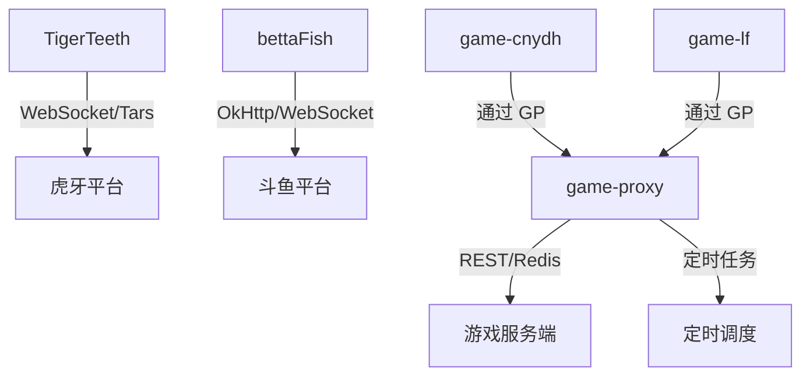

# 模块化组织结构

<cite>
**本文引用的文件**
- [TigerTeeth/pom.xml](file://TigerTeeth/pom.xml)
- [bettaFish/pom.xml](file://bettaFish/pom.xml)
- [game-cnydh/pom.xml](file://game-cnydh/pom.xml)
- [game-lf/pom.xml](file://game-lf/pom.xml)
- [game-proxy/pom.xml](file://game-proxy/pom.xml)
- [TigerTeeth/src/main/java/com/Application.java](file://TigerTeeth/src/main/java/com/Application.java)
- [bettaFish/src/main/java/com/Application.java](file://bettaFish/src/main/java/com/Application.java)
- [game-lf/src/main/java/com/Application.java](file://game-lf/src/main/java/com/Application.java)
- [game-proxy/src/main/java/com/game/AppApplication.java](file://game-proxy/src/main/java/com/game/AppApplication.java)
- [TigerTeeth/src/main/java/com/dwydh/DwydhService.java](file://TigerTeeth/src/main/java/com/dwydh/DwydhService.java)
- [TigerTeeth/src/main/java/com/yqlyy/GameYqlyyWsClient.java](file://TigerTeeth/src/main/java/com/yqlyy/GameYqlyyWsClient.java)
- [bettaFish/src/main/java/com/utils/DouyuOkHttp.java](file://bettaFish/src/main/java/com/utils/DouyuOkHttp.java)
- [game-proxy/src/main/java/com/game/controller/GameProxyController.java](file://game-proxy/src/main/java/com/game/controller/GameProxyController.java)
- [game-proxy/src/main/java/com/game/commom/Constants.java](file://game-proxy/src/main/java/com/game/commom/Constants.java)
</cite>

## 目录
1. [引言](#引言)
2. [项目结构](#项目结构)
3. [核心组件](#核心组件)
4. [架构总览](#架构总览)
5. [详细组件分析](#详细组件分析)
6. [依赖分析](#依赖分析)
7. [性能考量](#性能考量)
8. [故障排查指南](#故障排查指南)
9. [结论](#结论)
10. [附录](#附录)

## 引言
本项目采用模块化组织结构，围绕“游戏代理系统”目标，将不同游戏平台与业务场景拆分为独立子模块，同时通过统一的“game-proxy”模块实现集中管理与协调。该设计旨在提升代码复用、团队协作效率、版本管理灵活性以及系统的可扩展性与可维护性。

## 项目结构
项目由多个 Maven 子模块组成，每个模块聚焦于特定的游戏服务或业务域，彼此相对独立，便于独立部署与演进。模块划分如下：
- TigerTeeth：虎牙游戏服务模块，负责与虎牙平台的 WebSocket 通信及数据上报。
- bettaFish：斗鱼直播服务模块，负责与斗鱼平台的 WebSocket 通信与弹幕/开奖结果处理。
- game-cnydh：超能运动会服务模块，包含定时任务与 HTTP 客户端工具。
- game-lf：灵宠召唤服务模块，包含定时任务与 HTTP 客户端工具。
- game-proxy：统一代理与控制模块，提供统一的 HTTP 接口、Redis 缓存、定时调度与跨模块协调。

图表来源
- [TigerTeeth/pom.xml](file://TigerTeeth/pom.xml#L1-L160)
- [bettaFish/pom.xml](file://bettaFish/pom.xml#L1-L98)
- [game-cnydh/pom.xml](file://game-cnydh/pom.xml#L1-L159)
- [game-lf/pom.xml](file://game-lf/pom.xml#L1-L160)
- [game-proxy/pom.xml](file://game-proxy/pom.xml#L1-L163)

章节来源
- [TigerTeeth/pom.xml](file://TigerTeeth/pom.xml#L1-L160)
- [bettaFish/pom.xml](file://bettaFish/pom.xml#L1-L98)
- [game-cnydh/pom.xml](file://game-cnydh/pom.xml#L1-L159)
- [game-lf/pom.xml](file://game-lf/pom.xml#L1-L160)
- [game-proxy/pom.xml](file://game-proxy/pom.xml#L1-L163)

## 核心组件
- 应用入口
  - TigerTeeth：应用入口位于 com.Application，使用 Spring Boot 启动。
  - bettaFish：应用入口位于 com.Application，使用 Spring Boot 启动。
  - game-lf：应用入口位于 com.Application，使用 Spring Boot 启动。
  - game-proxy：应用入口位于 com.game.AppApplication，启用调度与日志输出。
- 服务与客户端
  - TigerTeeth：DwydhService 负责定时任务与 WebSocket 客户端初始化；GameYqlyyWsClient 负责与虎牙 WebSocket 通信并上报/同步数据。
  - bettaFish：DouyuOkHttp 提供斗鱼 WebSocket 连接、心跳、消息解码与开奖结果同步。
  - game-proxy：GameProxyController 提供统一代理接口、Redis 缓存读写、定时任务与跨模块协调。
- 统一配置与常量
  - game-proxy：Constants 提供统一的上游 API 地址常量，便于集中管理。

章节来源
- [TigerTeeth/src/main/java/com/Application.java](file://TigerTeeth/src/main/java/com/Application.java#L1-L14)
- [bettaFish/src/main/java/com/Application.java](file://bettaFish/src/main/java/com/Application.java#L1-L14)
- [game-lf/src/main/java/com/Application.java](file://game-lf/src/main/java/com/Application.java#L1-L14)
- [game-proxy/src/main/java/com/game/AppApplication.java](file://game-proxy/src/main/java/com/game/AppApplication.java#L1-L33)
- [TigerTeeth/src/main/java/com/dwydh/DwydhService.java](file://TigerTeeth/src/main/java/com/dwydh/DwydhService.java#L1-L39)
- [TigerTeeth/src/main/java/com/yqlyy/GameYqlyyWsClient.java](file://TigerTeeth/src/main/java/com/yqlyy/GameYqlyyWsClient.java#L1-L328)
- [bettaFish/src/main/java/com/utils/DouyuOkHttp.java](file://bettaFish/src/main/java/com/utils/DouyuOkHttp.java#L1-L282)
- [game-proxy/src/main/java/com/game/controller/GameProxyController.java](file://game-proxy/src/main/java/com/game/controller/GameProxyController.java#L1-L436)
- [game-proxy/src/main/java/com/game/commom/Constants.java](file://game-proxy/src/main/java/com/game/commom/Constants.java#L1-L14)

## 架构总览
统一代理模块（game-proxy）作为中枢，向上承接业务请求，向下协调各游戏模块与外部平台。TigerTeeth 与 bettaFish 分别负责虎牙与斗鱼平台的数据采集与同步；game-cnydh 与 game-lf 提供定时任务与 HTTP 工具，增强系统的自动化与扩展能力。

图表来源
- [game-proxy/src/main/java/com/game/controller/GameProxyController.java](file://game-proxy/src/main/java/com/game/controller/GameProxyController.java#L1-L436)
- [TigerTeeth/src/main/java/com/yqlyy/GameYqlyyWsClient.java](file://TigerTeeth/src/main/java/com/yqlyy/GameYqlyyWsClient.java#L1-L328)
- [bettaFish/src/main/java/com/utils/DouyuOkHttp.java](file://bettaFish/src/main/java/com/utils/DouyuOkHttp.java#L1-L282)

## 详细组件分析

### TigerTeeth（虎牙游戏服务）
- 职责与功能边界
  - 通过 WebSocket 与虎牙平台建立连接，监听游戏事件（如开奖、游戏开始）。
  - 将开奖结果与时间信息同步至统一代理模块或其他下游服务。
  - 提供定时任务线程池，保障持续上报与心跳维持。
- 关键实现要点
  - DwydhService：使用线程池执行 WebSocket 客户端初始化与周期性上报。
  - GameYqlyyWsClient：处理二进制消息、解析 Tars 协议、根据 iUri 分发不同业务逻辑（如 7109 开奖、7107/7101 时间同步）。
- 与 game-proxy 的协作
  - 通过统一代理模块提供的 Redis 缓存接口写入/读取游戏时间与状态。
  - 将开奖结果通过统一代理模块转发至下游游戏服务。

图表来源
- [TigerTeeth/src/main/java/com/dwydh/DwydhService.java](file://TigerTeeth/src/main/java/com/dwydh/DwydhService.java#L1-L39)
- [TigerTeeth/src/main/java/com/yqlyy/GameYqlyyWsClient.java](file://TigerTeeth/src/main/java/com/yqlyy/GameYqlyyWsClient.java#L1-L328)
- [game-proxy/src/main/java/com/game/controller/GameProxyController.java](file://game-proxy/src/main/java/com/game/controller/GameProxyController.java#L1-L436)

章节来源
- [TigerTeeth/src/main/java/com/dwydh/DwydhService.java](file://TigerTeeth/src/main/java/com/dwydh/DwydhService.java#L1-L39)
- [TigerTeeth/src/main/java/com/yqlyy/GameYqlyyWsClient.java](file://TigerTeeth/src/main/java/com/yqlyy/GameYqlyyWsClient.java#L1-L328)

### bettaFish（斗鱼直播服务）
- 职责与功能边界
  - 与斗鱼 WebSocket 建立连接，登录房间并加入分组。
  - 解析二进制弹幕消息，识别开奖结果并同步至统一代理模块。
  - 维护心跳包与自动重连机制。
- 关键实现要点
  - DouyuOkHttp：封装连接、心跳、消息解码与结果同步逻辑，支持多域名轮询同步。
- 与 game-proxy 的协作
  - 通过统一代理模块的 Redis 缓存接口写入开奖结果与时间信息。

图表来源
- [bettaFish/src/main/java/com/utils/DouyuOkHttp.java](file://bettaFish/src/main/java/com/utils/DouyuOkHttp.java#L1-L282)
- [game-proxy/src/main/java/com/game/controller/GameProxyController.java](file://game-proxy/src/main/java/com/game/controller/GameProxyController.java#L1-L436)

章节来源
- [bettaFish/src/main/java/com/utils/DouyuOkHttp.java](file://bettaFish/src/main/java/com/utils/DouyuOkHttp.java#L1-L282)

### game-cnydh（超能运动会服务）
- 职责与功能边界
  - 提供定时任务与 HTTP 工具，支撑超能运动会相关业务流程。
  - 通过统一代理模块进行跨模块协调与数据同步。
- 与 game-proxy 的协作
  - 通过统一代理模块的 Redis 缓存与定时调度能力，实现数据的持久化与周期性处理。

章节来源
- [game-cnydh/pom.xml](file://game-cnydh/pom.xml#L1-L159)
- [game-proxy/src/main/java/com/game/controller/GameProxyController.java](file://game-proxy/src/main/java/com/game/controller/GameProxyController.java#L1-L436)

### game-lf（灵宠召唤服务）
- 职责与功能边界
  - 提供定时任务与 HTTP 工具，支撑灵宠召唤相关业务流程。
  - 通过统一代理模块进行跨模块协调与数据同步。
- 与 game-proxy 的协作
  - 通过统一代理模块的 Redis 缓存与定时调度能力，实现数据的持久化与周期性处理。

章节来源
- [game-lf/pom.xml](file://game-lf/pom.xml#L1-L160)
- [game-proxy/src/main/java/com/game/controller/GameProxyController.java](file://game-proxy/src/main/java/com/game/controller/GameProxyController.java#L1-L436)

### game-proxy（统一代理与控制）
- 职责与功能边界
  - 提供统一的 HTTP 接口，集中暴露各游戏模块的能力。
  - 管理 Redis 缓存，提供游戏时间、开奖结果等数据的读写。
  - 提供定时任务与调度工具，支撑跨模块的周期性处理。
  - 统一常量与工具类，集中管理上游 API 地址与通用工具。
- 关键实现要点
  - GameProxyController：提供 /proxy 前缀的统一接口，包括游戏信息查询、时间同步、开奖结果同步、UU 农场与连接互动等功能。
  - Constants：集中管理上游 API 地址，便于统一配置与切换。
  - AppApplication：启用调度与日志输出，提供应用启动信息。

图表来源
- [game-proxy/src/main/java/com/game/controller/GameProxyController.java](file://game-proxy/src/main/java/com/game/controller/GameProxyController.java#L1-L436)
- [game-proxy/src/main/java/com/game/commom/Constants.java](file://game-proxy/src/main/java/com/game/commom/Constants.java#L1-L14)
- [game-proxy/src/main/java/com/game/AppApplication.java](file://game-proxy/src/main/java/com/game/AppApplication.java#L1-L33)

章节来源
- [game-proxy/src/main/java/com/game/controller/GameProxyController.java](file://game-proxy/src/main/java/com/game/controller/GameProxyController.java#L1-L436)
- [game-proxy/src/main/java/com/game/commom/Constants.java](file://game-proxy/src/main/java/com/game/commom/Constants.java#L1-L14)
- [game-proxy/src/main/java/com/game/AppApplication.java](file://game-proxy/src/main/java/com/game/AppApplication.java#L1-L33)

## 依赖分析
- 模块间依赖关系
  - TigerTeeth 与 bettaFish 作为平台接入模块，各自独立运行，不互相依赖。
  - game-proxy 作为统一中枢，向上承接业务请求，向下协调各模块与外部系统。
  - game-cnydh 与 game-lf 作为业务域模块，通过 game-proxy 实现统一管理与协调。
- 外部依赖
  - 各模块均基于 Spring Boot 2.2.13.RELEASE，使用 Web、Redis、HTTP 客户端等基础能力。
  - TigerTeeth 使用 WebSocket 客户端与 Tars 协议解析库；bettaFish 使用 OkHttp WebSocket 客户端；game-proxy 使用 Hutool、OkHttp、Redis 等工具。

图表来源
- [TigerTeeth/pom.xml](file://TigerTeeth/pom.xml#L1-L160)
- [bettaFish/pom.xml](file://bettaFish/pom.xml#L1-L98)
- [game-cnydh/pom.xml](file://game-cnydh/pom.xml#L1-L159)
- [game-lf/pom.xml](file://game-lf/pom.xml#L1-L160)
- [game-proxy/pom.xml](file://game-proxy/pom.xml#L1-L163)

章节来源
- [TigerTeeth/pom.xml](file://TigerTeeth/pom.xml#L1-L160)
- [bettaFish/pom.xml](file://bettaFish/pom.xml#L1-L98)
- [game-cnydh/pom.xml](file://game-cnydh/pom.xml#L1-L159)
- [game-lf/pom.xml](file://game-lf/pom.xml#L1-L160)
- [game-proxy/pom.xml](file://game-proxy/pom.xml#L1-L163)

## 性能考量
- 线程与并发
  - TigerTeeth 使用线程池执行 WebSocket 客户端初始化与周期性上报，避免阻塞主线程。
- 网络与协议
  - 虎牙 WebSocket 使用二进制消息与 Tars 协议解析，需注意缓冲区大小与消息分片处理。
  - 斗鱼 WebSocket 使用心跳包维持连接，建议合理设置心跳间隔与重连策略。
- 缓存与存储
  - game-proxy 通过 Redis 缓存游戏时间与开奖结果，建议设置合理的过期时间与键命名规范，避免缓存雪崩。
- 接口限流
  - 图片识别接口存在 5 秒内限流逻辑，建议在上层系统中配合退避策略与队列处理。

章节来源
- [TigerTeeth/src/main/java/com/dwydh/DwydhService.java](file://TigerTeeth/src/main/java/com/dwydh/DwydhService.java#L1-L39)
- [TigerTeeth/src/main/java/com/yqlyy/GameYqlyyWsClient.java](file://TigerTeeth/src/main/java/com/yqlyy/GameYqlyyWsClient.java#L1-L328)
- [bettaFish/src/main/java/com/utils/DouyuOkHttp.java](file://bettaFish/src/main/java/com/utils/DouyuOkHttp.java#L1-L282)
- [game-proxy/src/main/java/com/game/controller/GameProxyController.java](file://game-proxy/src/main/java/com/game/controller/GameProxyController.java#L1-L436)

## 故障排查指南
- WebSocket 连接问题
  - 检查 WebSocket URL 是否正确，确认平台证书与域名白名单。
  - 查看连接日志与异常堆栈，关注连接中断与自动重连逻辑。
- 消息解析问题
  - 对于二进制消息，确认字节序与协议字段偏移是否正确。
  - 对于 Tars 协议，确保输入流位置与字段索引一致。
- Redis 缓存问题
  - 检查键是否存在、过期时间是否合理、序列化格式是否一致。
- 接口调用异常
  - 对于统一代理接口，查看上游服务返回状态与异常日志，确认网络连通性与认证信息。

章节来源
- [TigerTeeth/src/main/java/com/yqlyy/GameYqlyyWsClient.java](file://TigerTeeth/src/main/java/com/yqlyy/GameYqlyyWsClient.java#L1-L328)
- [bettaFish/src/main/java/com/utils/DouyuOkHttp.java](file://bettaFish/src/main/java/com/utils/DouyuOkHttp.java#L1-L282)
- [game-proxy/src/main/java/com/game/controller/GameProxyController.java](file://game-proxy/src/main/java/com/game/controller/GameProxyController.java#L1-L436)

## 结论
该模块化组织结构通过将不同平台与业务域拆分为独立模块，并以 game-proxy 为核心实现统一管理与协调，显著提升了系统的可扩展性、可维护性与团队协作效率。模块间低耦合、高内聚的设计，使得各模块可以独立部署与演进，同时通过统一接口与缓存机制实现高效协同。

## 附录
- 最佳实践与指导原则
  - 明确模块职责边界，避免跨模块直接依赖。
  - 使用统一代理模块进行跨模块协调，减少重复实现。
  - 通过集中配置（如 Constants）管理外部系统地址，便于切换与灰度发布。
  - 在 WebSocket 与 HTTP 客户端中实现完善的异常处理与重试机制。
  - 合理使用 Redis 缓存，设置键空间命名规范与过期策略。
  - 对高频接口实施限流与降级策略，保障系统稳定性。