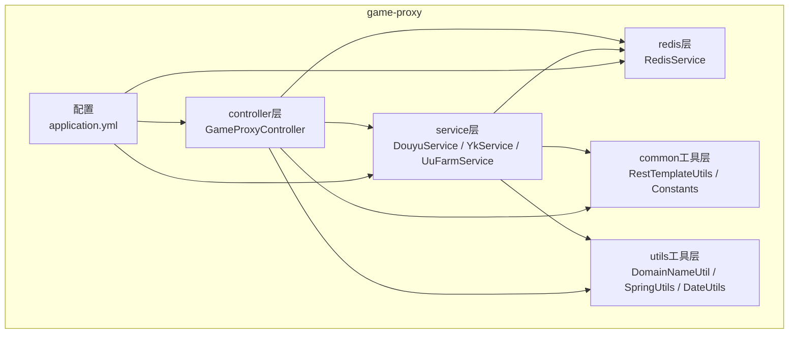
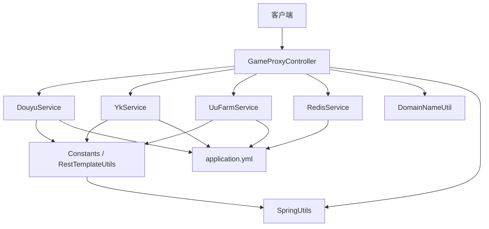
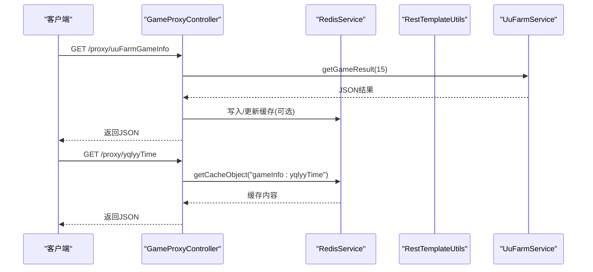
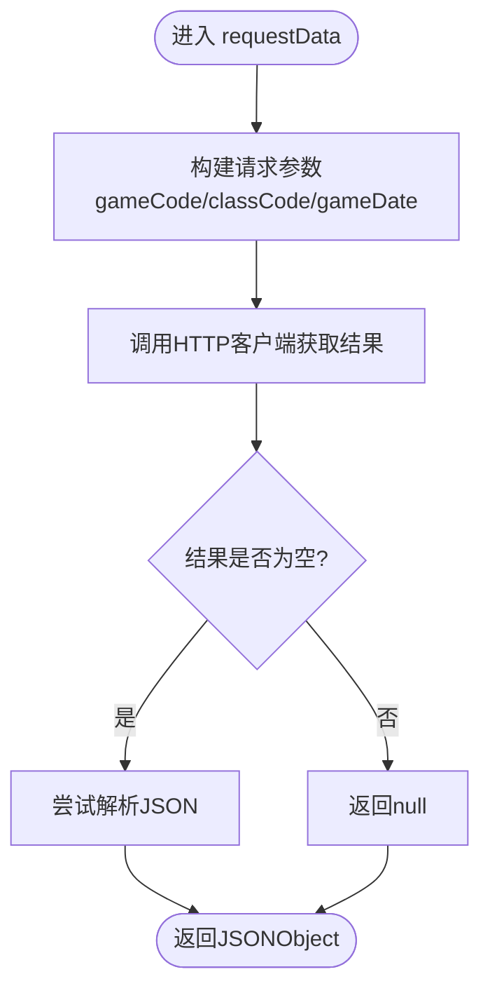
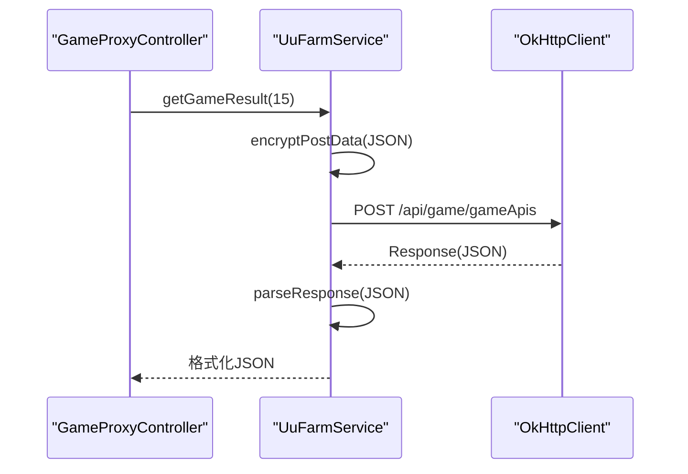
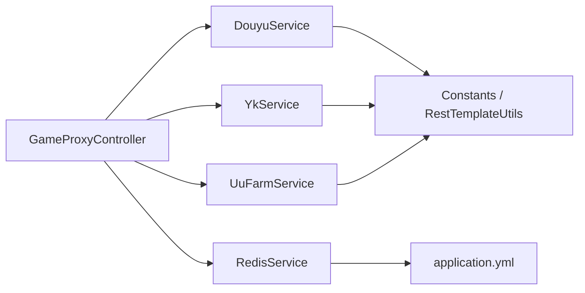

# 系统架构设计

<cite>
**本文引用的文件**
- [AppApplication.java](file://game-proxy/src/main/java/com/game/AppApplication.java)
- [GameProxyController.java](file://game-proxy/src/main/java/com/game/controller/GameProxyController.java)
- [DouyuService.java](file://game-proxy/src/main/java/com/game/douyu/DouyuService.java)
- [YkService.java](file://game-proxy/src/main/java/com/game/yk/YkService.java)
- [UuFarmService.java](file://game-proxy/src/main/java/com/game\uc/UuFarmService.java)
- [RedisService.java](file://game-proxy/src/main/java/com/game/redis/RedisService.java)
- [RestTemplateUtils.java](file://game-proxy/src/main/java/com/game/commom/RestTemplateUtils.java)
- [Constants.java](file://game-proxy/src/main/java/com/game/commom/Constants.java)
- [DomainNameUtil.java](file://game-proxy/src/main/java/com/game/utils/DomainNameUtil.java)
- [SpringUtils.java](file://game-proxy/src/main/java/com/game/utils/SpringUtils.java)
- [application.yml](file://game-proxy/src/main/resources/application.yml)
- [pom.xml](file://game-proxy/pom.xml)
</cite>

## 目录
1. [引言](#引言)
2. [项目结构](#项目结构)
3. [核心组件](#核心组件)
4. [架构总览](#架构总览)
5. [详细组件分析](#详细组件分析)
6. [依赖分析](#依赖分析)
7. [性能考虑](#性能考虑)
8. [故障排除指南](#故障排除指南)
9. [结论](#结论)
10. [附录](#附录)

## 引言
本系统是一个基于Spring Boot的游戏代理与数据聚合平台，主要职责是：
- 作为统一入口代理各游戏平台的HTTP/WebSocket请求
- 统一管理游戏状态、时间与开奖结果的缓存
- 提供定时任务与异步线程池调度
- 支持多游戏平台接入（映客、斗鱼、UU农场等）
- 通过REST接口对外提供统一查询与配置能力

系统采用分层架构与模块化设计，结合Spring容器的依赖注入与AOP特性，形成清晰的职责边界与可扩展的扩展点。

## 项目结构
系统采用按功能域划分的模块化组织方式，核心模块如下：
- controller层：统一对外HTTP接口，负责参数校验、请求转发与响应封装
- service层：业务逻辑与平台适配，负责调用第三方API、处理加密与解密
- redis层：集中式缓存，提供高性能读写与过期控制
- common工具层：通用配置、HTTP客户端封装、常量定义
- utils工具层：日期、域名、Spring上下文等辅助工具
- resources：配置文件与日志配置

**图示来源**
- [AppApplication.java](file://game-proxy/src/main/java/com/game/AppApplication.java#L1-L33)
- [GameProxyController.java](file://game-proxy/src/main/java/com/game/controller/GameProxyController.java#L1-L436)
- [DouyuService.java](file://game-proxy/src/main/java/com/game/douyu/DouyuService.java#L1-L60)
- [YkService.java](file://game-proxy/src/main/java/com/game/yk/YkService.java#L1-L72)
- [UuFarmService.java](file://game-proxy/src/main/java/com/game\uc/UuFarmService.java#L1-L135)
- [RedisService.java](file://game-proxy/src/main/java/com/game/redis/RedisService.java#L1-L244)
- [RestTemplateUtils.java](file://game-proxy/src/main/java/com/game/commom/RestTemplateUtils.java#L1-L51)
- [Constants.java](file://game-proxy/src/main/java/com/game/commom/Constants.java#L1-L14)
- [DomainNameUtil.java](file://game-proxy/src/main/java/com/game/utils/DomainNameUtil.java#L1-L16)
- [application.yml](file://game-proxy/src/main/resources/application.yml#L1-L58)

**章节来源**
- [AppApplication.java](file://game-proxy/src/main/java/com/game/AppApplication.java#L1-L33)
- [application.yml](file://game-proxy/src/main/resources/application.yml#L1-L58)

## 核心组件
- 控制器层
  - GameProxyController：提供统一的代理接口，包括游戏信息查询、时间设置、图片识别、UU农场数据获取等
- 服务层
  - DouyuService：斗鱼平台数据拉取与初始化
  - YkService：映客平台数据拉取与初始化
  - UuFarmService：UU农场加密请求与结果解析
- 缓存层
  - RedisService：提供键值、列表、集合、哈希等多种缓存操作
- 工具层
  - RestTemplateUtils：HTTP客户端封装
  - Constants：统一常量定义
  - DomainNameUtil：目标域名白名单
  - SpringUtils：非Spring管理环境获取Bean工具
- 配置
  - application.yml：端口、Redis、HTTP连接池、业务配置等

**章节来源**
- [GameProxyController.java](file://game-proxy/src/main/java/com/game/controller/GameProxyController.java#L1-L436)
- [DouyuService.java](file://game-proxy/src/main/java/com/game/douyu/DouyuService.java#L1-L60)
- [YkService.java](file://game-proxy/src/main/java/com/game/yk/YkService.java#L1-L72)
- [UuFarmService.java](file://game-proxy/src/main/java/com/game\uc/UuFarmService.java#L1-L135)
- [RedisService.java](file://game-proxy/src/main/java/com/game/redis/RedisService.java#L1-L244)
- [RestTemplateUtils.java](file://game-proxy/src/main/java/com/game/commom/RestTemplateUtils.java#L1-L51)
- [Constants.java](file://game-proxy/src/main/java/com/game/commom/Constants.java#L1-L14)
- [DomainNameUtil.java](file://game-proxy/src/main/java/com/game/utils/DomainNameUtil.java#L1-L16)
- [SpringUtils.java](file://game-proxy/src/main/java/com/game/utils/SpringUtils.java#L1-L103)
- [application.yml](file://game-proxy/src/main/resources/application.yml#L1-L58)

## 架构总览
系统采用分层架构与模块化设计，结合Spring Boot的自动装配与依赖注入，形成清晰的职责边界：
- 表现层：Controller负责HTTP请求处理与响应封装
- 领域层：Service负责业务逻辑与平台适配
- 基础设施层：Redis提供缓存，RestTemplate封装HTTP访问
- 工具与配置：统一常量、域名、Spring上下文工具与配置文件

**图示来源**
- [GameProxyController.java](file://game-proxy/src/main/java/com/game/controller/GameProxyController.java#L1-L436)
- [DouyuService.java](file://game-proxy/src/main/java/com/game/douyu/DouyuService.java#L1-L60)
- [YkService.java](file://game-proxy/src/main/java/com/game/yk/YkService.java#L1-L72)
- [UuFarmService.java](file://game-proxy/src/main/java/com/game\uc/UuFarmService.java#L1-L135)
- [RedisService.java](file://game-proxy/src/main/java/com/game/redis/RedisService.java#L1-L244)
- [RestTemplateUtils.java](file://game-proxy/src/main/java/com/game/commom/RestTemplateUtils.java#L1-L51)
- [Constants.java](file://game-proxy/src/main/java/com/game/commom/Constants.java#L1-L14)
- [DomainNameUtil.java](file://game-proxy/src/main/java/com/game/utils/DomainNameUtil.java#L1-L16)
- [SpringUtils.java](file://game-proxy/src/main/java/com/game/utils/SpringUtils.java#L1-L103)
- [application.yml](file://game-proxy/src/main/resources/application.yml#L1-L58)

## 详细组件分析

### 控制器层：GameProxyController
职责与边界
- 统一对外HTTP接口，负责参数解析、请求转发与响应封装
- 提供游戏信息查询、时间设置、图片识别、UU农场数据获取等接口
- 使用RedisService进行缓存读写，使用RestTemplateUtils进行HTTP请求

关键接口与流程
- 游戏信息查询：通过RedisService读取缓存
- 时间设置：将时间戳写入Redis，支持不同格式解析
- 图片识别：调用图片识别服务，并向多个域名广播开奖结果
- UU农场：调用UuFarmService获取加密后的游戏结果

**图示来源**
- [GameProxyController.java](file://game-proxy/src/main/java/com/game/controller/GameProxyController.java#L222-L225)
- [RedisService.java](file://game-proxy/src/main/java/com/game/redis/RedisService.java#L95-L98)
- [UuFarmService.java](file://game-proxy/src/main/java/com/game\uc/UuFarmService.java#L121-L131)

**章节来源**
- [GameProxyController.java](file://game-proxy/src/main/java/com/game/controller/GameProxyController.java#L1-L436)
- [RedisService.java](file://game-proxy/src/main/java/com/game/redis/RedisService.java#L1-L244)
- [UuFarmService.java](file://game-proxy/src/main/java/com/game\uc/UuFarmService.java#L1-L135)

### 服务层：DouyuService 与 YkService
职责与边界
- DouyuService：负责斗鱼平台的数据请求与初始化，使用线程池并发初始化子服务
- YkService：负责映客平台的数据请求与初始化，同样使用线程池并发初始化子服务

关键流程
- 初始化：通过线程池执行子服务的init方法
- 数据请求：构造参数并调用HTTP客户端获取结果，解析为JSON对象

**图示来源**
- [DouyuService.java](file://game-proxy/src/main/java/com/game/douyu/DouyuService.java#L38-L57)
- [YkService.java](file://game-proxy/src/main/java/com/game/yk/YkService.java#L50-L69)

**章节来源**
- [DouyuService.java](file://game-proxy/src/main/java/com/game/douyu/DouyuService.java#L1-L60)
- [YkService.java](file://game-proxy/src/main/java/com/game/yk/YkService.java#L1-L72)

### 服务层：UuFarmService
职责与边界
- UU农场加密请求与结果解析
- 支持动态配置AES密钥、IV、URL与Token
- 通过OkHttp发起POST请求，返回格式化JSON

关键流程
- 加密：对请求体进行AES/CBC加密并Base64编码
- 发起请求：构造请求头与请求体，调用OkHttp
- 解析：提取开奖时间与第一个中奖宠物信息

**图示来源**
- [UuFarmService.java](file://game-proxy/src/main/java/com/game\uc/UuFarmService.java#L64-L98)
- [UuFarmService.java](file://game-proxy/src/main/java/com/game\uc/UuFarmService.java#L101-L117)

**章节来源**
- [UuFarmService.java](file://game-proxy/src/main/java/com/game\uc/UuFarmService.java#L1-L135)

### 缓存层：RedisService
职责与边界
- 提供多种缓存操作：字符串、列表、集合、哈希
- 支持设置过期时间、批量删除、键匹配等
- 为控制器层提供统一的缓存访问接口

关键操作
- setCacheObject：设置键值与过期时间
- getCacheObject：获取缓存值
- deleteObject：删除单个或多个键
- setCacheList/setCacheSet/setCacheMap：批量缓存

**章节来源**
- [RedisService.java](file://game-proxy/src/main/java/com/game/redis/RedisService.java#L1-L244)

### 工具层：RestTemplateUtils 与 Constants
职责与边界
- RestTemplateUtils：封装RestTemplate的GET/POST/EXCHANGE方法，提供静态调用入口
- Constants：集中管理外部API地址等常量

关键点
- 静态注入RestTemplate，便于在非Spring管理环境下使用
- 统一API地址，便于切换环境

**章节来源**
- [RestTemplateUtils.java](file://game-proxy/src/main/java/com/game/commom/RestTemplateUtils.java#L1-L51)
- [Constants.java](file://game-proxy/src/main/java/com/game/commom/Constants.java#L1-L14)

### 工具层：DomainNameUtil 与 SpringUtils
职责与边界
- DomainNameUtil：维护目标域名白名单，用于图片识别结果广播
- SpringUtils：在非Spring管理环境中获取Bean与AOP代理

关键点
- 白名单机制确保仅向受信域名广播
- AOP代理获取便于在同进程内调用增强方法

**章节来源**
- [DomainNameUtil.java](file://game-proxy/src/main/java/com/game/utils/DomainNameUtil.java#L1-L16)
- [SpringUtils.java](file://game-proxy/src/main/java/com/game/utils/SpringUtils.java#L1-L103)

## 依赖分析
模块间依赖关系
- Controller依赖Service与RedisService
- Service依赖Common工具与配置
- RedisService依赖配置文件
- 工具类之间低耦合，通过常量与配置解耦

**图示来源**
- [GameProxyController.java](file://game-proxy/src/main/java/com/game/controller/GameProxyController.java#L1-L436)
- [DouyuService.java](file://game-proxy/src/main/java/com/game/douyu/DouyuService.java#L1-L60)
- [YkService.java](file://game-proxy/src/main/java/com/game/yk/YkService.java#L1-L72)
- [UuFarmService.java](file://game-proxy/src/main/java/com/game\uc/UuFarmService.java#L1-L135)
- [RedisService.java](file://game-proxy/src/main/java/com/game/redis/RedisService.java#L1-L244)
- [RestTemplateUtils.java](file://game-proxy/src/main/java/com/game/commom/RestTemplateUtils.java#L1-L51)
- [Constants.java](file://game-proxy/src/main/java/com/game/commom/Constants.java#L1-L14)
- [application.yml](file://game-proxy/src/main/resources/application.yml#L1-L58)

**章节来源**
- [pom.xml](file://game-proxy/pom.xml#L1-L163)

## 性能考虑
- 线程池与异步：Service层使用线程池并发初始化子服务，避免阻塞主线程
- 缓存命中：通过RedisService减少重复请求与计算
- HTTP连接池：application.yml中配置了连接池大小与超时参数，提升并发能力
- 限流保护：控制器层对图片识别接口进行简单限流，防止频繁调用

优化建议
- 对高频接口增加二级缓存与本地缓存
- 对第三方API增加熔断与降级策略
- 对图片识别结果进行去重与合并广播

## 故障排除指南
常见问题与定位
- Redis连接失败：检查application.yml中的Redis配置与网络连通性
- HTTP请求超时：调整application.yml中的超时参数或检查目标服务状态
- 图片识别失败：确认DomainNameUtil中的域名白名单与API密钥
- AES解密异常：核对UuFarmService的密钥与IV配置

**章节来源**
- [application.yml](file://game-proxy/src/main/resources/application.yml#L15-L57)
- [DomainNameUtil.java](file://game-proxy/src/main/java/com/game/utils/DomainNameUtil.java#L1-L16)
- [UuFarmService.java](file://game-proxy/src/main/java/com/game\uc/UuFarmService.java#L24-L44)

## 结论
本系统通过清晰的分层架构与模块化设计，实现了对多游戏平台的统一代理与数据聚合。控制器层提供统一接口，服务层负责业务逻辑与平台适配，缓存层提供高性能数据支撑。通过工具层与配置文件的解耦，系统具备良好的可扩展性与可维护性。未来可在以下方面进一步演进：
- 引入API网关与服务注册发现，支持水平扩展
- 增加监控与链路追踪，提升可观测性
- 抽象平台适配层，降低新增平台的接入成本

## 附录
- 设计模式应用
  - 代理模式：RestTemplateUtils对RestTemplate的封装，类似JDK动态代理的静态代理
  - 工厂模式：Spring容器对Service的实例化与依赖注入
  - 策略模式：不同平台Service的差异化实现，可通过配置选择策略
  - 观察者模式：定时任务与线程池回调，可视为事件驱动的简化形式

- 扩展性设计
  - 新平台接入：新增Service与Controller接口，复用Redis与工具层
  - 水平扩展：通过配置中心与负载均衡实现多实例部署