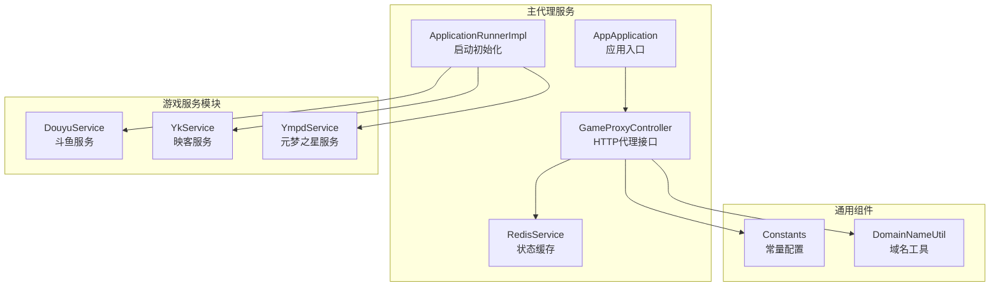
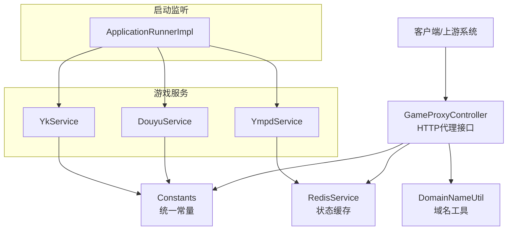
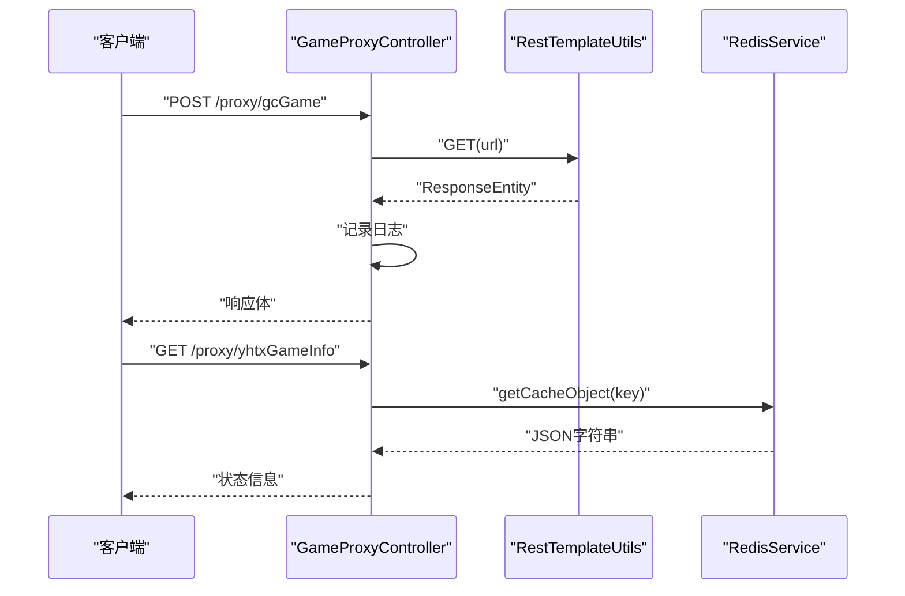
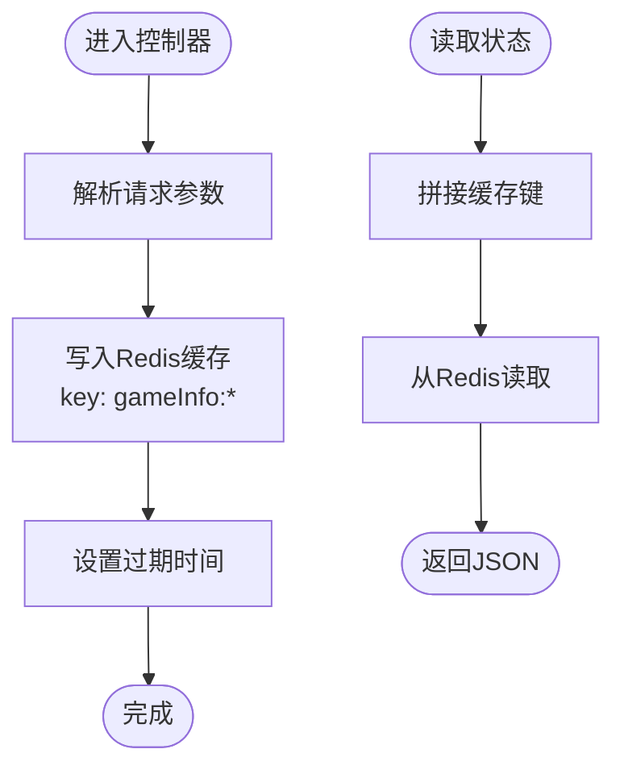
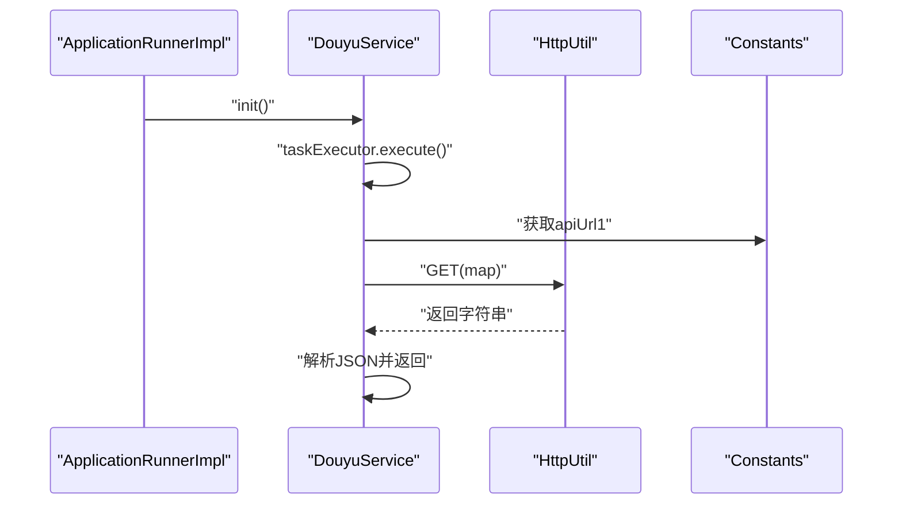
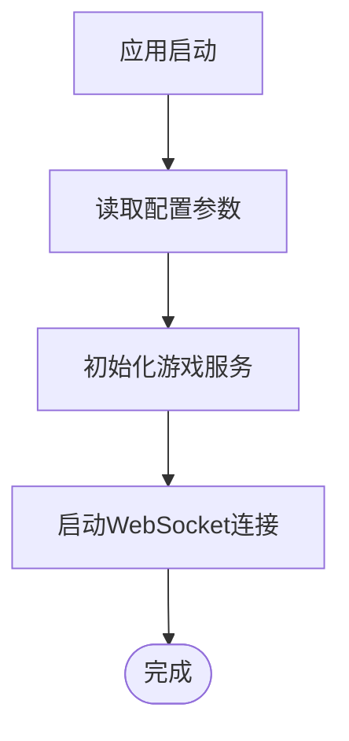
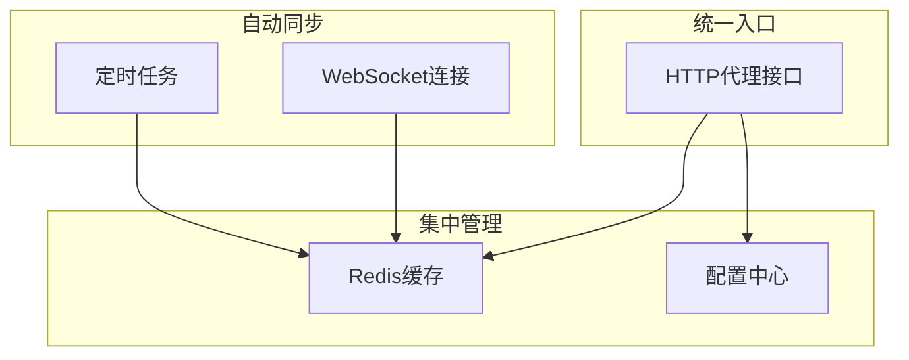
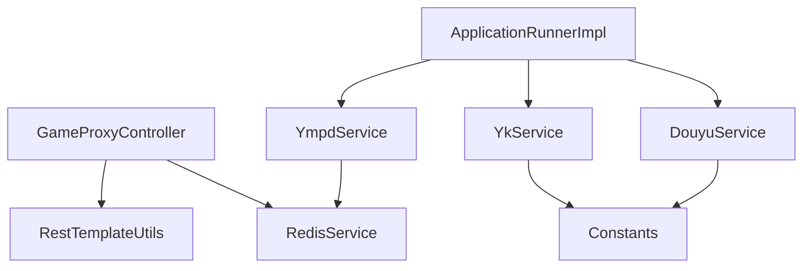

# 项目介绍与背景

<cite>
**本文引用的文件**
- [AppApplication.java](file://game-proxy/src/main/java/com/game/AppApplication.java)
- [application.yml](file://game-proxy/src/main/resources/application.yml)
- [GameProxyController.java](file://game-proxy/src/main/java/com/game/controller/GameProxyController.java)
- [RedisService.java](file://game-proxy/src/main/java/com/game/redis/RedisService.java)
- [Constants.java](file://game-proxy/src/main/java/com/game/commom/Constants.java)
- [DouyuService.java](file://game-proxy/src/main/java/com/game/douyu/DouyuService.java)
- [YkService.java](file://game-proxy/src/main/java/com/game/yk/YkService.java)
- [YmpdService.java](file://game-proxy/src/main/java/com/game/ympd/YmpdService.java)
- [ApplicationRunnerImpl.java](file://game-proxy/src/main/java/com/game/listener/ApplicationRunnerImpl.java)
- [DomainNameUtil.java](file://game-proxy/src/main/java/com/game/utils/DomainNameUtil.java)
- [pom.xml](file://game-proxy/pom.xml)
- [TigerTeeth Application.java](file://TigerTeeth/src/main/java/com/Application.java)
- [TigerTeeth application.yml](file://TigerTeeth/src/main/resources/application.yml)
- [DwydhService.java](file://TigerTeeth/src/main/java/com/dwydh/DwydhService.java)
</cite>

## 目录
1. [引言](#引言)
2. [项目结构](#项目结构)
3. [核心组件](#核心组件)
4. [架构总览](#架构总览)
5. [详细组件分析](#详细组件分析)
6. [依赖分析](#依赖分析)
7. [性能考量](#性能考量)
8. [故障排查指南](#故障排查指南)
9. [结论](#结论)
10. [附录](#附录)

## 引言
本项目是一个多游戏代理系统，旨在为多个游戏直播平台提供统一的数据同步、状态管理和自动化控制能力。通过集中化的代理层，系统能够：
- 统一接入不同游戏平台的接口与协议，屏蔽差异
- 实时缓存与分发各游戏的状态信息与开奖结果
- 自动化维护与健康检查，降低人工运维成本
- 支持跨平台数据同步与联动，提升运营效率

该系统主要面向以下用户群体：
- 游戏直播平台运营团队：用于统一监控与调度
- 自动化运维工程师：负责系统稳定性与扩展性
- 游戏数据分析师：基于统一缓存进行统计与分析

项目在游戏直播生态中的价值在于，通过标准化的数据通道与状态管理，降低多平台接入与维护的复杂度，提高整体运营效率与数据一致性。

## 项目结构
项目采用多模块结构，包含一个主代理服务与若干子模块：
- 主代理服务：提供统一的HTTP代理接口、状态缓存与定时任务
- 游戏服务模块：对接不同游戏平台（如斗鱼、映客、元梦之星等）
- 工具与通用组件：Redis缓存、HTTP客户端、常量与域名工具
- 启动监听器：应用启动时初始化各游戏服务与Socket连接

**图表来源**
- [AppApplication.java](file://game-proxy/src/main/java/com/game/AppApplication.java#L1-L33)
- [GameProxyController.java](file://game-proxy/src/main/java/com/game/controller/GameProxyController.java#L1-L436)
- [RedisService.java](file://game-proxy/src/main/java/com/game/redis/RedisService.java#L1-L244)
- [ApplicationRunnerImpl.java](file://game-proxy/src/main/java/com/game/listener/ApplicationRunnerImpl.java#L1-L174)
- [DouyuService.java](file://game-proxy/src/main/java/com/game/douyu/DouyuService.java#L1-L60)
- [YkService.java](file://game-proxy/src/main/java/com/game/yk/YkService.java#L1-L72)
- [YmpdService.java](file://game-proxy/src/main/java/com/game/ympd/YmpdService.java#L1-L83)
- [Constants.java](file://game-proxy/src/main/java/com/game/commom/Constants.java#L1-L14)
- [DomainNameUtil.java](file://game-proxy/src/main/java/com/game/utils/DomainNameUtil.java#L1-L16)

**章节来源**
- [AppApplication.java](file://game-proxy/src/main/java/com/game/AppApplication.java#L1-L33)
- [application.yml](file://game-proxy/src/main/resources/application.yml#L1-L58)
- [pom.xml](file://game-proxy/pom.xml#L1-L163)

## 核心组件
- 应用入口与启动配置
  - 应用入口负责启动Spring Boot应用，并输出访问地址与Swagger文档地址，便于快速验证服务状态
  - 通过环境变量与配置文件控制端口、上下文路径与Redis连接参数
- 控制器层
  - 提供统一的HTTP代理接口，支持古城、幽林等游戏的请求转发
  - 提供游戏状态查询接口，从Redis缓存读取各游戏的实时状态
  - 提供时间同步接口，支持不同游戏的开奖时间上报与缓存
- 缓存层
  - 基于Redis实现多种数据结构的缓存操作，包括字符串、列表、集合与哈希
  - 提供过期时间设置、批量操作与键空间扫描等能力
- 游戏服务层
  - 针对不同游戏平台封装请求逻辑，统一参数格式与返回处理
  - 提供初始化方法，启动定时任务或Socket连接，持续拉取或推送数据
- 启动监听器
  - 应用启动后自动初始化各游戏服务与Socket连接
  - 提供配置项，支持不同游戏的会话与手机号参数

**章节来源**
- [AppApplication.java](file://game-proxy/src/main/java/com/game/AppApplication.java#L24-L31)
- [application.yml](file://game-proxy/src/main/resources/application.yml#L2-L58)
- [GameProxyController.java](file://game-proxy/src/main/java/com/game/controller/GameProxyController.java#L45-L436)
- [RedisService.java](file://game-proxy/src/main/java/com/game/redis/RedisService.java#L24-L244)
- [DouyuService.java](file://game-proxy/src/main/java/com/game/douyu/DouyuService.java#L27-L57)
- [YkService.java](file://game-proxy/src/main/java/com/game/yk/YkService.java#L31-L68)
- [YmpdService.java](file://game-proxy/src/main/java/com/game/ympd/YmpdService.java#L33-L76)
- [ApplicationRunnerImpl.java](file://game-proxy/src/main/java/com/game/listener/ApplicationRunnerImpl.java#L64-L144)

## 架构总览
系统采用“控制器-缓存-服务-监听器”的分层架构，通过统一的HTTP代理接口与Redis缓存实现跨平台数据同步与状态管理。

**图表来源**
- [GameProxyController.java](file://game-proxy/src/main/java/com/game/controller/GameProxyController.java#L45-L436)
- [RedisService.java](file://game-proxy/src/main/java/com/game/redis/RedisService.java#L24-L244)
- [Constants.java](file://game-proxy/src/main/java/com/game/commom/Constants.java#L7-L12)
- [DomainNameUtil.java](file://game-proxy/src/main/java/com/game/utils/DomainNameUtil.java#L4-L12)
- [DouyuService.java](file://game-proxy/src/main/java/com/game/douyu/DouyuService.java#L38-L57)
- [YkService.java](file://game-proxy/src/main/java/com/game/yk/YkService.java#L50-L68)
- [YmpdService.java](file://game-proxy/src/main/java/com/game/ympd/YmpdService.java#L33-L76)
- [ApplicationRunnerImpl.java](file://game-proxy/src/main/java/com/game/listener/ApplicationRunnerImpl.java#L64-L100)

## 详细组件分析

### 控制器层：GameProxyController
- 功能职责
  - 提供游戏代理接口，转发不同平台的请求并返回响应
  - 提供游戏状态查询接口，从Redis缓存读取各游戏的实时状态
  - 提供时间同步接口，支持不同游戏的开奖时间上报与缓存
  - 提供图片识别与自开奖接口，支持深海秘境等场景的自动化处理
- 关键流程
  - 代理请求：接收上游请求，构造HTTP头，调用HTTP工具发起请求并返回响应
  - 状态查询：根据游戏标识从Redis读取缓存数据
  - 时间同步：解析时间参数，写入Redis缓存并设置过期时间
  - 图片识别：调用图像识别工具，将识别结果同步到多个域名

**图表来源**
- [GameProxyController.java](file://game-proxy/src/main/java/com/game/controller/GameProxyController.java#L51-L81)
- [GameProxyController.java](file://game-proxy/src/main/java/com/game/controller/GameProxyController.java#L90-L94)
- [RedisService.java](file://game-proxy/src/main/java/com/game/redis/RedisService.java#L95-L98)

**章节来源**
- [GameProxyController.java](file://game-proxy/src/main/java/com/game/controller/GameProxyController.java#L45-L436)
- [RedisService.java](file://game-proxy/src/main/java/com/game/redis/RedisService.java#L95-L98)

### 缓存层：RedisService
- 功能职责
  - 提供字符串、列表、集合、哈希等多种数据结构的缓存操作
  - 支持设置过期时间、批量删除与键空间扫描
  - 作为控制器层与服务层之间的数据中转站
- 关键流程
  - 写入缓存：根据游戏标识写入JSON字符串，并设置过期时间
  - 读取缓存：根据游戏标识读取JSON字符串
  - 删除缓存：按需删除指定键或批量删除

**图表来源**
- [GameProxyController.java](file://game-proxy/src/main/java/com/game/controller/GameProxyController.java#L186-L207)
- [GameProxyController.java](file://game-proxy/src/main/java/com/game/controller/GameProxyController.java#L232-L273)
- [RedisService.java](file://game-proxy/src/main/java/com/game/redis/RedisService.java#L30-L44)
- [RedisService.java](file://game-proxy/src/main/java/com/game/redis/RedisService.java#L95-L98)

**章节来源**
- [RedisService.java](file://game-proxy/src/main/java/com/game/redis/RedisService.java#L24-L244)

### 游戏服务层：DouyuService / YkService / YmpdService
- 功能职责
  - 封装不同游戏平台的请求逻辑，统一参数格式与返回处理
  - 提供初始化方法，启动定时任务或Socket连接，持续拉取或推送数据
- 关键流程
  - 请求封装：构造请求参数，调用HTTP工具发起请求
  - 结果解析：解析返回的JSON字符串，转换为对象
  - 初始化：在独立线程中启动服务，避免阻塞主线程

**图表来源**
- [ApplicationRunnerImpl.java](file://game-proxy/src/main/java/com/game/listener/ApplicationRunnerImpl.java#L76-L78)
- [DouyuService.java](file://game-proxy/src/main/java/com/game/douyu/DouyuService.java#L27-L57)
- [Constants.java](file://game-proxy/src/main/java/com/game/commom/Constants.java#L7-L12)

**章节来源**
- [DouyuService.java](file://game-proxy/src/main/java/com/game/douyu/DouyuService.java#L27-L57)
- [YkService.java](file://game-proxy/src/main/java/com/game/yk/YkService.java#L31-L68)
- [YmpdService.java](file://game-proxy/src/main/java/com/game/ympd/YmpdService.java#L58-L76)

### 启动监听器：ApplicationRunnerImpl
- 功能职责
  - 应用启动后自动初始化各游戏服务与Socket连接
  - 提供配置项，支持不同游戏的会话与手机号参数
- 关键流程
  - 读取配置：从配置文件读取会话与手机号参数
  - 初始化服务：按需启动各游戏服务
  - Socket连接：启动古城与幽林的WebSocket连接

**图表来源**
- [ApplicationRunnerImpl.java](file://game-proxy/src/main/java/com/game/listener/ApplicationRunnerImpl.java#L64-L144)

**章节来源**
- [ApplicationRunnerImpl.java](file://game-proxy/src/main/java/com/game/listener/ApplicationRunnerImpl.java#L64-L144)

### 概念性概览
- 多游戏代理平台的核心价值在于“统一入口、集中管理、自动同步”。通过代理层屏蔽平台差异，通过缓存层实现状态共享，通过监听器实现自动化运维。
- 适用场景包括：游戏状态实时监控、跨平台数据同步、自动化运维管理等。

[此图为概念性示意，不直接映射具体源码文件，故无图表来源]

## 依赖分析
- 模块间依赖
  - 控制器依赖缓存与工具类，实现状态查询与时间同步
  - 游戏服务依赖常量与HTTP工具，实现请求封装与结果解析
  - 启动监听器依赖各游戏服务，实现初始化与Socket连接
- 外部依赖
  - Spring Boot Web：提供HTTP服务器与Web框架
  - Redis：提供高性能缓存与数据结构支持
  - Hutool：提供HTTP、JSON、日期等常用工具
  - OkHttp/Netty：提供网络通信与WebSocket支持

**图表来源**
- [GameProxyController.java](file://game-proxy/src/main/java/com/game/controller/GameProxyController.java#L8-L11)
- [RedisService.java](file://game-proxy/src/main/java/com/game/redis/RedisService.java#L21-L22)
- [DouyuService.java](file://game-proxy/src/main/java/com/game/douyu/DouyuService.java#L5-L6)
- [YkService.java](file://game-proxy/src/main/java/com/game/yk/YkService.java#L4-L5)
- [YmpdService.java](file://game-proxy/src/main/java/com/game/ympd/YmpdService.java#L6-L7)
- [ApplicationRunnerImpl.java](file://game-proxy/src/main/java/com/game/listener/ApplicationRunnerImpl.java#L3-L15)

**章节来源**
- [pom.xml](file://game-proxy/pom.xml#L26-L100)

## 性能考量
- 缓存策略
  - 使用Redis作为统一缓存，支持多种数据结构，满足不同场景需求
  - 合理设置过期时间，避免缓存堆积与内存压力
- 线程模型
  - 使用线程池执行初始化与定时任务，避免阻塞主线程
  - WebSocket连接采用循环发送机制，确保连接稳定
- 网络优化
  - 配置HTTP连接池参数，提升并发处理能力
  - 启用连接复用与超时控制，减少资源浪费

[本节提供一般性指导，无需具体文件来源]

## 故障排查指南
- 接口访问异常
  - 检查应用启动日志，确认端口与上下文路径配置正确
  - 验证Redis连接参数，确保缓存服务可用
- 状态查询为空
  - 检查对应游戏的缓存键是否存在，确认写入流程正常
  - 查看定时任务或初始化流程是否执行成功
- WebSocket连接失败
  - 检查域名与端口配置，确认网络连通性
  - 查看连接日志，定位异常原因并重试

**章节来源**
- [AppApplication.java](file://game-proxy/src/main/java/com/game/AppApplication.java#L24-L31)
- [application.yml](file://game-proxy/src/main/resources/application.yml#L15-L31)
- [ApplicationRunnerImpl.java](file://game-proxy/src/main/java/com/game/listener/ApplicationRunnerImpl.java#L147-L172)

## 结论
本项目通过统一的代理层、集中化的缓存与自动化的运维机制，实现了多游戏直播平台的数据同步与状态管理。其核心价值在于降低接入复杂度、提升数据一致性与运维效率。建议在实际部署中结合业务场景优化缓存策略与网络配置，确保系统稳定运行。

[本节为总结性内容，无需具体文件来源]

## 附录
- 配置示例
  - 服务器端口与上下文路径：参考配置文件中的server段
  - Redis连接参数：参考配置文件中的spring.redis段
  - 游戏会话与手机号：参考配置文件中的manxiang段
- 快速启动
  - 使用Maven打包后启动应用，访问应用入口日志中提供的URL进行验证

**章节来源**
- [application.yml](file://game-proxy/src/main/resources/application.yml#L2-L58)
- [pom.xml](file://game-proxy/pom.xml#L102-L160)