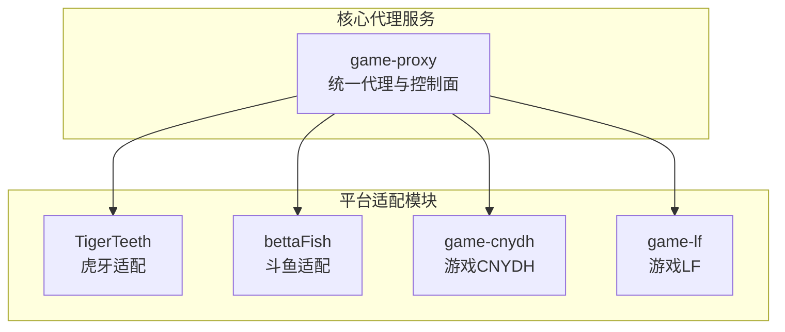
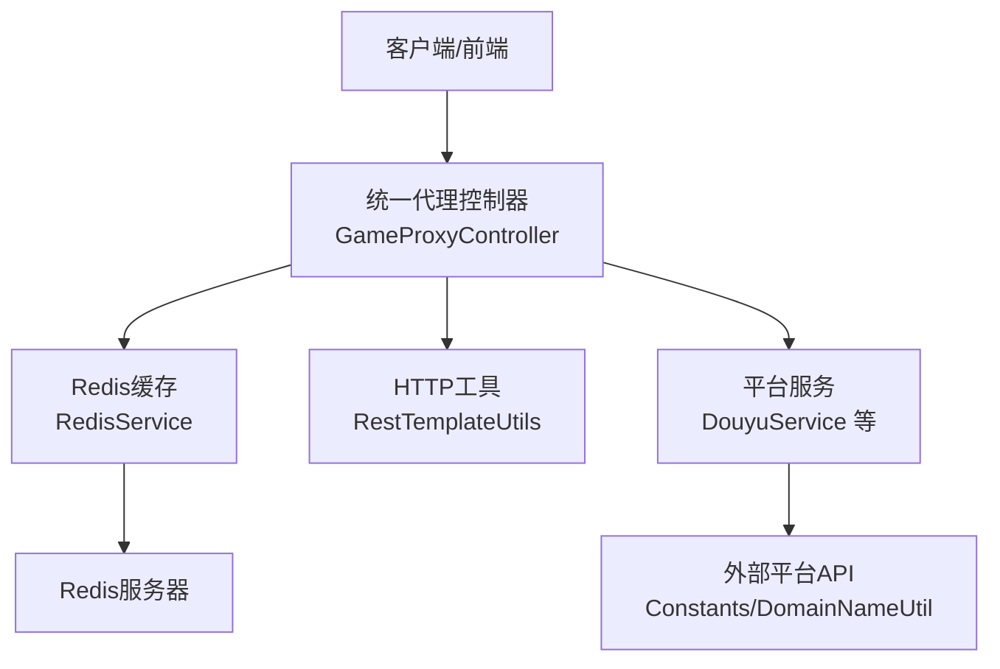
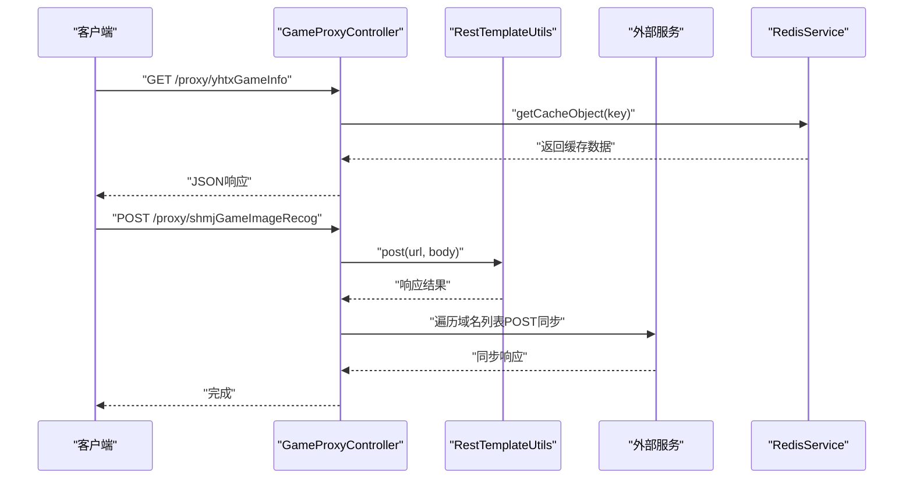
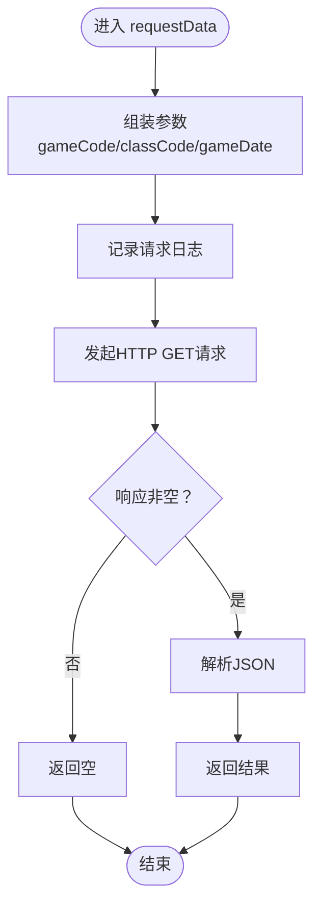
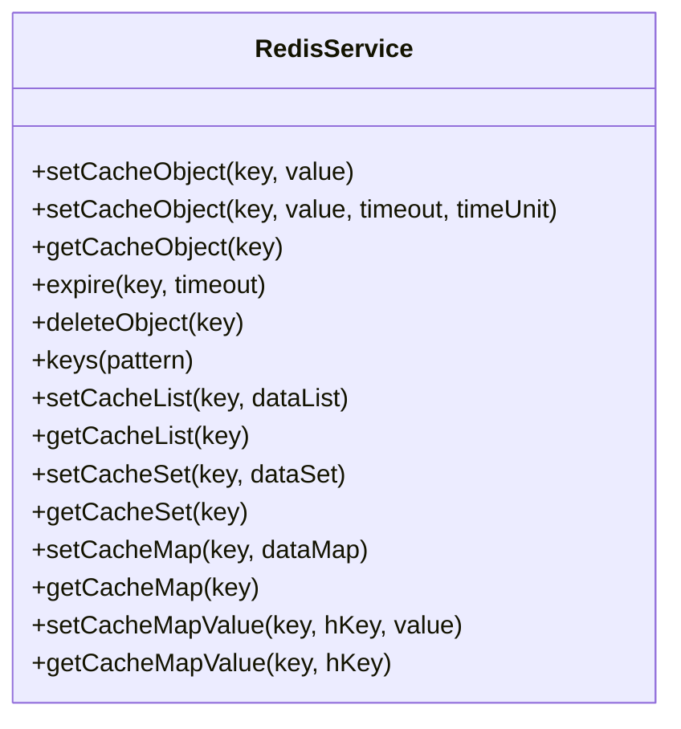
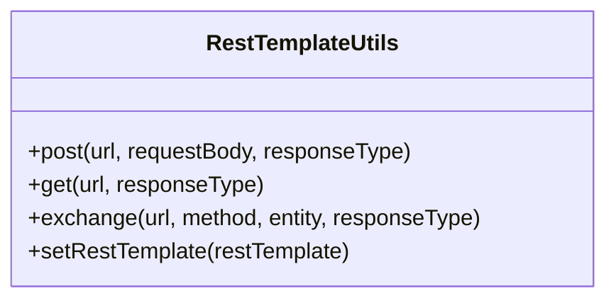
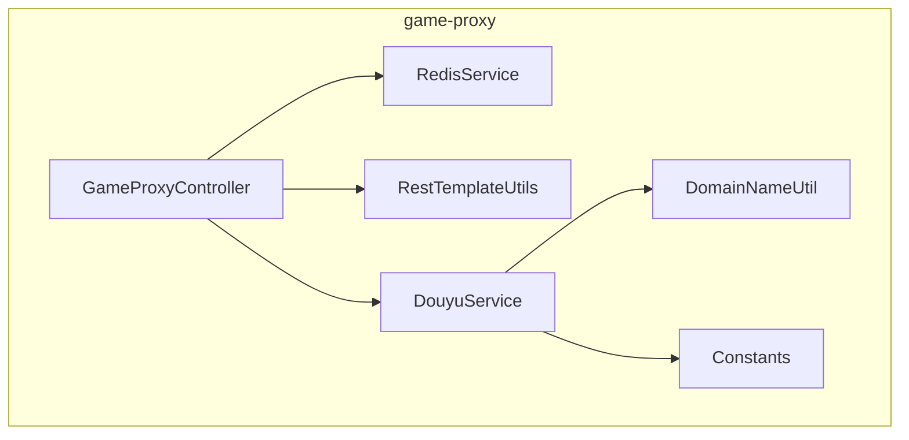

# 项目概述

<cite>
**本文引用的文件**
- [TigerTeeth/Application.java](file://TigerTeeth/src/main/java/com/Application.java)
- [bettaFish/Application.java](file://bettaFish/src/main/java/com/Application.java)
- [game-cnydh/Application.java](file://game-cnydh/src/main/java/com/Application.java)
- [game-lf/Application.java](file://game-lf/src/main/java/com/Application.java)
- [game-proxy/AppApplication.java](file://game-proxy/src/main/java/com/game/AppApplication.java)
- [TigerTeeth/application.yml](file://TigerTeeth/src/main/resources/application.yml)
- [game-proxy/application.yml](file://game-proxy/src/main/resources/application.yml)
- [game-proxy/GameProxyController.java](file://game-proxy/src/main/java/com/game/controller/GameProxyController.java)
- [game-proxy/DouyuService.java](file://game-proxy/src/main/java/com/game/douyu/DouyuService.java)
- [game-proxy/RedisService.java](file://game-proxy/src/main/java/com/game/redis/RedisService.java)
- [game-proxy/DomainNameUtil.java](file://game-proxy/src/main/java/com/game/utils/DomainNameUtil.java)
- [game-proxy/Constants.java](file://game-proxy/src/main/java/com/game/commom/Constants.java)
- [game-proxy/RestTemplateUtils.java](file://game-proxy/src/main/java/com/game/commom/RestTemplateUtils.java)
- [game-proxy/pom.xml](file://game-proxy/pom.xml)
- [TigerTeeth/pom.xml](file://TigerTeeth/pom.xml)
</cite>

## 目录
1. [引言](#引言)
2. [项目结构](#项目结构)
3. [核心组件](#核心组件)
4. [架构总览](#架构总览)
5. [详细组件分析](#详细组件分析)
6. [依赖分析](#依赖分析)
7. [性能考虑](#性能考虑)
8. [故障排除指南](#故障排除指南)
9. [结论](#结论)
10. [附录](#附录)

## 引言
本项目是一个多游戏代理平台，旨在为虎牙、斗鱼等多个直播平台提供统一的数据同步与状态管理服务。通过统一的代理层，系统能够集中处理不同游戏的数据采集、缓存、定时任务与外部服务对接，实现跨平台的一致性与可扩展性。系统采用微服务化的模块化组织方式，将不同游戏与平台的功能拆分为独立模块，便于维护与演进。

## 项目结构
项目由多个子模块组成，每个模块负责特定的游戏或平台能力：
- game-proxy：核心代理服务，提供统一的HTTP接口、Redis缓存、定时任务与跨模块协调。
- TigerTeeth：虎牙相关服务模块，包含应用入口与基础配置。
- bettaFish：斗鱼相关服务模块，包含应用入口与基础配置。
- game-cnydh：特定游戏服务模块，包含定时任务与通用工具。
- game-lf：特定游戏服务模块，包含定时任务与通用工具。

图表来源
- [game-proxy/AppApplication.java](file://game-proxy/src/main/java/com/game/AppApplication.java#L1-L33)
- [TigerTeeth/Application.java](file://TigerTeeth/src/main/java/com/Application.java#L1-L14)
- [bettaFish/Application.java](file://bettaFish/src/main/java/com/Application.java#L1-L14)
- [game-cnydh/Application.java](file://game-cnydh/src/main/java/com/Application.java#L1-L14)
- [game-lf/Application.java](file://game-lf/src/main/java/com/Application.java#L1-L14)

章节来源
- [game-proxy/AppApplication.java](file://game-proxy/src/main/java/com/game/AppApplication.java#L1-L33)
- [TigerTeeth/Application.java](file://TigerTeeth/src/main/java/com/Application.java#L1-L14)
- [bettaFish/Application.java](file://bettaFish/src/main/java/com/Application.java#L1-L14)
- [game-cnydh/Application.java](file://game-cnydh/src/main/java/com/Application.java#L1-L14)
- [game-lf/Application.java](file://game-lf/src/main/java/com/Application.java#L1-L14)

## 核心组件
- 统一入口与启动器
  - game-proxy 的应用入口启用调度与Web能力，输出运行访问地址与Swagger文档地址，便于本地调试与监控。
  - 各平台模块（TigerTeeth、bettaFish、game-cnydh、game-lf）均提供标准Spring Boot入口，便于独立部署与扩展。
- 控制器层
  - 统一代理控制器提供多种游戏信息查询与时间同步接口，支持Redis缓存读取与写入，以及跨服务调用。
- 服务层
  - 平台服务（如DouyuService）负责向外部平台发起请求并处理返回数据，结合线程池与定时任务实现异步与周期性任务。
- 缓存与工具
  - RedisService提供丰富的键值操作，支持字符串、列表、集合、哈希等多种数据结构。
  - RestTemplateUtils封装HTTP客户端调用，简化REST请求与响应处理。
  - DomainNameUtil与Constants集中管理外部域名与API地址，便于统一维护与切换。

章节来源
- [game-proxy/AppApplication.java](file://game-proxy/src/main/java/com/game/AppApplication.java#L17-L31)
- [game-proxy/GameProxyController.java](file://game-proxy/src/main/java/com/game/controller/GameProxyController.java#L30-L436)
- [game-proxy/DouyuService.java](file://game-proxy/src/main/java/com/game/douyu/DouyuService.java#L18-L59)
- [game-proxy/RedisService.java](file://game-proxy/src/main/java/com/game/redis/RedisService.java#L13-L244)
- [game-proxy/RestTemplateUtils.java](file://game-proxy/src/main/java/com/game/commom/RestTemplateUtils.java#L13-L50)
- [game-proxy/DomainNameUtil.java](file://game-proxy/src/main/java/com/game/utils/DomainNameUtil.java#L3-L15)
- [game-proxy/Constants.java](file://game-proxy/src/main/java/com/game/commom/Constants.java#L3-L13)

## 架构总览
系统采用“统一代理 + 平台适配 + 缓存与工具”的分层架构：
- 控制器层：对外暴露统一的HTTP接口，聚合不同游戏与平台的数据。
- 服务层：封装平台请求与业务逻辑，负责数据拉取、转换与转发。
- 缓存层：基于Redis提供高性能读写，支撑游戏状态与时间信息的持久化与共享。
- 工具层：提供HTTP客户端、域名与常量管理，降低重复代码与提升一致性。

图表来源
- [game-proxy/GameProxyController.java](file://game-proxy/src/main/java/com/game/controller/GameProxyController.java#L30-L436)
- [game-proxy/RedisService.java](file://game-proxy/src/main/java/com/game/redis/RedisService.java#L13-L244)
- [game-proxy/RestTemplateUtils.java](file://game-proxy/src/main/java/com/game/commom/RestTemplateUtils.java#L13-L50)
- [game-proxy/DouyuService.java](file://game-proxy/src/main/java/com/game/douyu/DouyuService.java#L18-L59)
- [game-proxy/Constants.java](file://game-proxy/src/main/java/com/game/commom/Constants.java#L3-L13)
- [game-proxy/DomainNameUtil.java](file://game-proxy/src/main/java/com/game/utils/DomainNameUtil.java#L3-L15)

## 详细组件分析

### 统一代理控制器（GameProxyController）
- 职责
  - 提供游戏信息查询接口（如深海迷境、灵宠召唤、大话三国等），统一从Redis读取缓存数据。
  - 提供时间同步接口（如UU农场、一千零一夜、宠物马拉松等），将时间信息写入Redis并设置过期策略。
  - 提供图片识别与自开奖接口，结合外部服务进行结果同步与校验。
- 关键流程
  - 查询流程：控制器从Redis读取指定键值，返回JSON格式的游戏信息。
  - 写入流程：控制器根据传入参数构造JSON对象，写入Redis并设置过期时间。
  - 同步流程：识别完成后，遍历域名列表向外部服务发起POST请求，同步开奖结果。

图表来源
- [game-proxy/GameProxyController.java](file://game-proxy/src/main/java/com/game/controller/GameProxyController.java#L86-L181)
- [game-proxy/RestTemplateUtils.java](file://game-proxy/src/main/java/com/game/commom/RestTemplateUtils.java#L26-L44)
- [game-proxy/DomainNameUtil.java](file://game-proxy/src/main/java/com/game/utils/DomainNameUtil.java#L3-L15)
- [game-proxy/RedisService.java](file://game-proxy/src/main/java/com/game/redis/RedisService.java#L95-L98)

章节来源
- [game-proxy/GameProxyController.java](file://game-proxy/src/main/java/com/game/controller/GameProxyController.java#L30-L436)

### 平台服务（DouyuService）
- 职责
  - 向外部平台发起请求，组装参数并处理返回数据。
  - 通过线程池执行初始化任务，避免阻塞主线程。
- 关键流程
  - 初始化：在独立线程中调用内部服务初始化。
  - 请求：根据游戏日期、游戏编码与描述组装参数，发起HTTP GET请求，解析JSON并返回。

图表来源
- [game-proxy/DouyuService.java](file://game-proxy/src/main/java/com/game/douyu/DouyuService.java#L38-L57)

章节来源
- [game-proxy/DouyuService.java](file://game-proxy/src/main/java/com/game/douyu/DouyuService.java#L18-L59)

### 缓存服务（RedisService）
- 职责
  - 提供统一的Redis操作接口，覆盖字符串、列表、集合、哈希等数据结构。
  - 支持设置过期时间、批量删除、键匹配等常用操作。
- 关键流程
  - 写入：根据键与值设置缓存，可选设置过期时间。
  - 读取：根据键获取缓存值，支持泛型返回。
  - 删除：支持单键与集合批量删除。

图表来源
- [game-proxy/RedisService.java](file://game-proxy/src/main/java/com/game/redis/RedisService.java#L13-L244)

章节来源
- [game-proxy/RedisService.java](file://game-proxy/src/main/java/com/game/redis/RedisService.java#L13-L244)

### HTTP工具（RestTemplateUtils）
- 职责
  - 封装RestTemplate的GET、POST与exchange方法，提供静态调用入口。
  - 通过注入RestTemplate实例，简化控制器层的HTTP调用。
- 关键流程
  - GET：发起GET请求并返回响应实体。
  - POST：发起POST请求并返回响应实体。
  - EXCHANGE：支持自定义HTTP方法与请求头实体。

图表来源
- [game-proxy/RestTemplateUtils.java](file://game-proxy/src/main/java/com/game/commom/RestTemplateUtils.java#L13-L50)

章节来源
- [game-proxy/RestTemplateUtils.java](file://game-proxy/src/main/java/com/game/commom/RestTemplateUtils.java#L13-L50)

### 配置与域名管理
- 配置文件
  - game-proxy：定义服务端口、上下文路径、Redis连接信息、HTTP客户端参数与业务配置项。
  - TigerTeeth：定义服务端口、上下文路径与HTTP客户端参数。
- 域名与常量
  - DomainNameUtil：集中管理外部服务域名数组，便于多节点或多环境切换。
  - Constants：集中管理外部API地址，支持正式与测试环境切换。

章节来源
- [game-proxy/application.yml](file://game-proxy/src/main/resources/application.yml#L1-L58)
- [TigerTeeth/application.yml](file://TigerTeeth/src/main/resources/application.yml#L1-L31)
- [game-proxy/DomainNameUtil.java](file://game-proxy/src/main/java/com/game/utils/DomainNameUtil.java#L3-L15)
- [game-proxy/Constants.java](file://game-proxy/src/main/java/com/game/commom/Constants.java#L3-L13)

## 依赖分析
- 技术栈
  - Spring Boot：提供Web、调度、Redis与自动配置能力。
  - Redis：提供高性能缓存与键值存储。
  - OkHttp/HttpClient：提供HTTP客户端能力，支持GET/POST与连接池配置。
  - Hutool/FASTJSON2/Lombok：提供工具类、JSON处理与注解简化。
- 模块间耦合
  - 控制器依赖RedisService与HTTP工具，减少重复代码。
  - 平台服务依赖外部域名与常量，便于集中管理。
  - 各平台模块独立部署，通过统一代理进行编排。

图表来源
- [game-proxy/GameProxyController.java](file://game-proxy/src/main/java/com/game/controller/GameProxyController.java#L30-L436)
- [game-proxy/RedisService.java](file://game-proxy/src/main/java/com/game/redis/RedisService.java#L13-L244)
- [game-proxy/RestTemplateUtils.java](file://game-proxy/src/main/java/com/game/commom/RestTemplateUtils.java#L13-L50)
- [game-proxy/DouyuService.java](file://game-proxy/src/main/java/com/game/douyu/DouyuService.java#L18-L59)
- [game-proxy/DomainNameUtil.java](file://game-proxy/src/main/java/com/game/utils/DomainNameUtil.java#L3-L15)
- [game-proxy/Constants.java](file://game-proxy/src/main/java/com/game/commom/Constants.java#L3-L13)

章节来源
- [game-proxy/pom.xml](file://game-proxy/pom.xml#L26-L100)
- [TigerTeeth/pom.xml](file://TigerTeeth/pom.xml#L26-L111)

## 性能考虑
- 连接池与超时
  - HTTP客户端配置了最大连接数、并发数与超时参数，确保高并发场景下的稳定性。
- 缓存策略
  - Redis提供键值缓存与过期机制，减少重复请求与外部依赖。
- 异步与线程池
  - 平台服务使用线程池执行初始化任务，避免阻塞主线程，提高响应速度。
- 接口限流
  - 图片识别接口设置了5秒内的调用限制，防止频繁请求导致外部服务压力过大。

章节来源
- [game-proxy/application.yml](file://game-proxy/src/main/resources/application.yml#L43-L58)
- [game-proxy/GameProxyController.java](file://game-proxy/src/main/java/com/game/controller/GameProxyController.java#L357-L412)

## 故障排除指南
- Redis连接问题
  - 检查Redis配置（主机、端口、密码、超时）与网络连通性。
  - 使用RedisService提供的keys方法进行键空间诊断。
- HTTP请求异常
  - 查看RestTemplateUtils的日志输出，确认URL、参数与响应状态。
  - 调整HTTP超时与连接池参数以适应外部服务的响应特性。
- 外部服务不可达
  - 检查DomainNameUtil中的域名列表与Constants中的API地址。
  - 在测试环境中切换至备用地址，验证服务可用性。
- 接口限流
  - 图片识别接口存在5秒内仅允许一次请求的限制，避免短时间内重复调用。

章节来源
- [game-proxy/RedisService.java](file://game-proxy/src/main/java/com/game/redis/RedisService.java#L240-L242)
- [game-proxy/RestTemplateUtils.java](file://game-proxy/src/main/java/com/game/commom/RestTemplateUtils.java#L26-L44)
- [game-proxy/DomainNameUtil.java](file://game-proxy/src/main/java/com/game/utils/DomainNameUtil.java#L3-L15)
- [game-proxy/Constants.java](file://game-proxy/src/main/java/com/game/commom/Constants.java#L3-L13)
- [game-proxy/GameProxyController.java](file://game-proxy/src/main/java/com/game/controller/GameProxyController.java#L367-L371)

## 结论
本项目通过统一代理层实现了对多直播平台与多游戏的数据同步与状态管理，具备良好的模块化与可扩展性。借助Redis缓存、HTTP工具与平台服务的协同，系统能够在保证性能的同时，灵活应对不同平台与游戏的差异化需求。建议在生产环境中进一步完善监控与告警体系，并持续优化缓存策略与外部服务的容错机制。

## 附录
- 快速启动
  - game-proxy：启动后可在日志中查看访问地址与Swagger文档地址。
  - 各平台模块：独立启动后可通过各自端口与上下文路径访问。
- 常用接口
  - 查询游戏信息：GET /proxy/yhtxGameInfo、GET /proxy/lczhGameInfo 等。
  - 写入时间信息：GET /proxy/addUCTime、GET /proxy/addYqlyyTime 等。
  - 图片识别：GET /proxy/shmjGameImageRecog（带限流保护）。
  - 自开奖：GET /proxy/selfOpening（用于测试）。

章节来源
- [game-proxy/AppApplication.java](file://game-proxy/src/main/java/com/game/AppApplication.java#L24-L31)
- [game-proxy/GameProxyController.java](file://game-proxy/src/main/java/com/game/controller/GameProxyController.java#L86-L436)