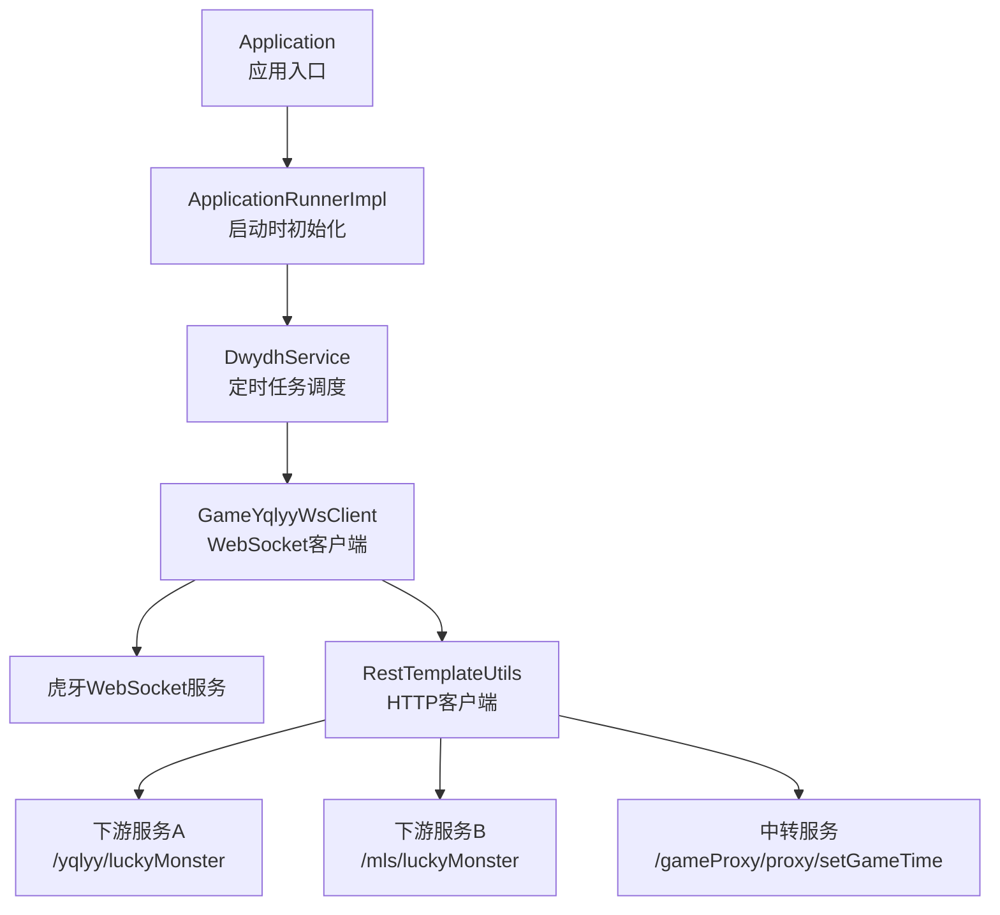
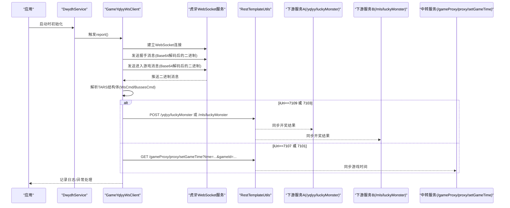
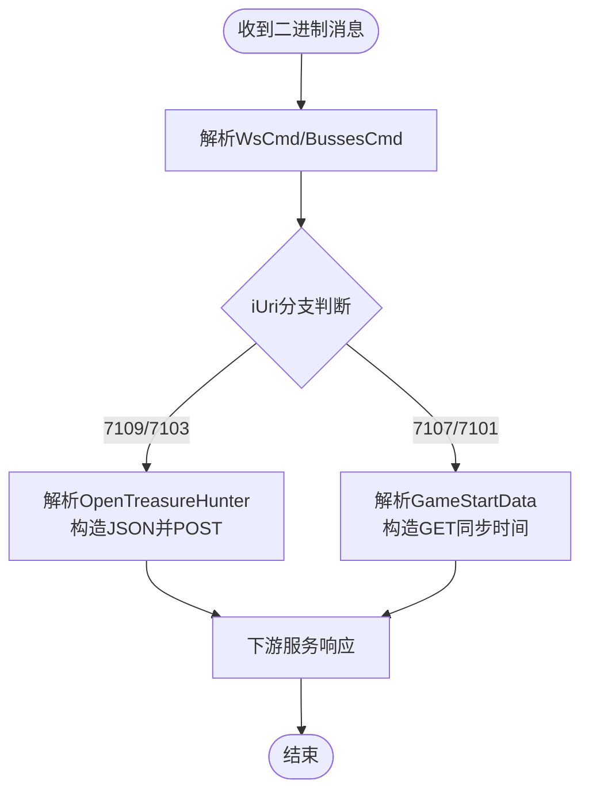
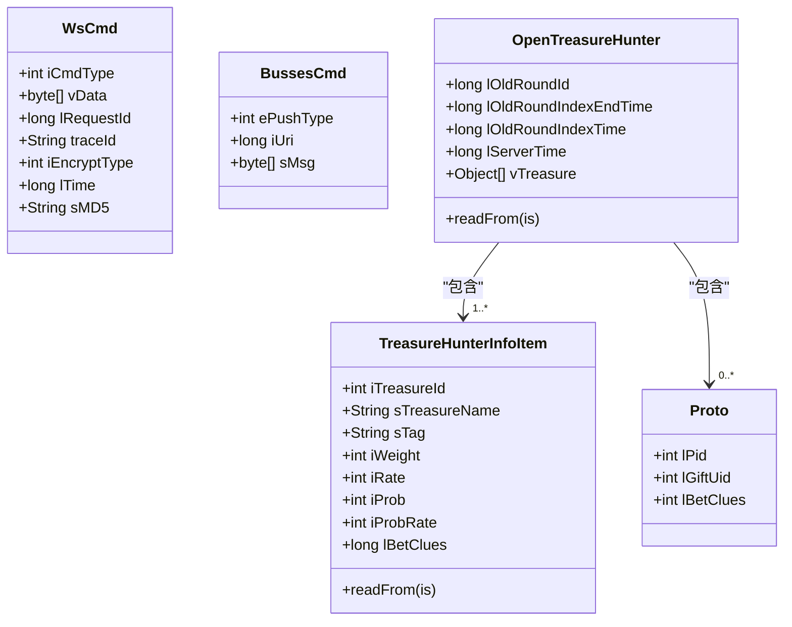
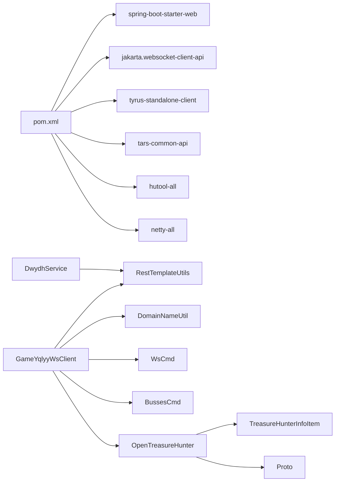

# API参考

<cite>
**本文引用的文件**
- [Application.java](file://src/main/java/com/Application.java)
- [DwydhService.java](file://src/main/java/com/dwydh/DwydhService.java)
- [GameYqlyyWsClient.java](file://src/main/java/com/yqlyy/GameYqlyyWsClient.java)
- [RestTemplateUtils.java](file://src/main/java/com/commom/RestTemplateUtils.java)
- [DomainNameUtil.java](file://src/main/java/com/utils/DomainNameUtil.java)
- [WsCmd.java](file://src/main/java/com/entity/WsCmd.java)
- [BussesCmd.java](file://src/main/java/com/entity/BussesCmd.java)
- [GameStartData.java](file://src/main/java/com/entity/GameStartData.java)
- [OpenTreasureHunter.java](file://src/main/java/com/entity/AccountedNotify/OpenTreasureHunter.java)
- [TreasureHunterInfoItem.java](file://src/main/java/com/entity/AccountedNotify/TreasureHunterInfoItem.java)
- [Proto.java](file://src/main/java/com/entity/AccountedNotify/Proto.java)
- [application.yml](file://src/main/resources/application.yml)
- [pom.xml](file://pom.xml)
</cite>

## 目录
1. [简介](#简介)
2. [项目结构](#项目结构)
3. [核心组件](#核心组件)
4. [架构总览](#架构总览)
5. [详细组件分析](#详细组件分析)
6. [依赖关系分析](#依赖关系分析)
7. [性能与使用限制](#性能与使用限制)
8. [安全与访问控制](#安全与访问控制)
9. [API版本与兼容性](#api版本与兼容性)
10. [调试与测试指南](#调试与测试指南)
11. [故障排查](#故障排查)
12. [结论](#结论)

## 简介
本文件为“虎牙爬虫”项目的API参考文档，聚焦两类接口：
- WebSocket接口：用于与虎牙直播平台的WebSocket服务建立连接、接收推送消息、发送握手与进入游戏消息，并在连接异常时自动重连。
- HTTP API接口：通过内部HTTP客户端向下游服务同步开奖结果与游戏时间等数据。

文档涵盖：
- WebSocket接口的连接建立、消息收发与关闭流程
- HTTP API的端点、请求参数、响应格式与状态码
- 消息格式与协议规范（二进制、TARS结构体、Base64编码）
- API调用示例与错误处理建议
- 版本管理与向后兼容策略
- 安全机制与访问控制
- 性能基准与使用限制
- 调试工具与测试方法

## 项目结构
该项目采用Spring Boot应用结构，核心模块如下：
- 应用入口与启动器：Application
- 应用生命周期钩子：ApplicationRunnerImpl
- WebSocket客户端：GameYqlyyWsClient
- 业务调度：DwydhService
- HTTP客户端封装：RestTemplateUtils
- 配置：application.yml
- 实体模型：WsCmd、BussesCmd、GameStartData、OpenTreasureHunter、TreasureHunterInfoItem、Proto
- 工具类：DomainNameUtil

图表来源
- [Application.java](file://src/main/java/com/Application.java#L1-L14)
- [ApplicationRunnerImpl.java](file://src/main/java/com/listener/ApplicationRunnerImpl.java#L1-L34)
- [DwydhService.java](file://src/main/java/com/dwydh/DwydhService.java#L1-L39)
- [GameYqlyyWsClient.java](file://src/main/java/com/yqlyy/GameYqlyyWsClient.java#L1-L328)
- [RestTemplateUtils.java](file://src/main/java/com/commom/RestTemplateUtils.java#L1-L31)
- [DomainNameUtil.java](file://src/main/java/com/utils/DomainNameUtil.java#L1-L16)

章节来源
- [Application.java](file://src/main/java/com/Application.java#L1-L14)
- [application.yml](file://src/main/resources/application.yml#L1-L31)

## 核心组件
- WebSocket客户端：负责连接、发送握手与进入游戏消息、解析二进制推送、触发HTTP同步。
- 业务调度：定时触发WebSocket上报逻辑，维持长连接。
- HTTP客户端：封装GET/POST调用，统一异常处理。
- 实体模型：描述WebSocket消息结构与业务数据。

章节来源
- [DwydhService.java](file://src/main/java/com/dwydh/DwydhService.java#L1-L39)
- [GameYqlyyWsClient.java](file://src/main/java/com/yqlyy/GameYqlyyWsClient.java#L1-L328)
- [RestTemplateUtils.java](file://src/main/java/com/commom/RestTemplateUtils.java#L1-L31)
- [WsCmd.java](file://src/main/java/com/entity/WsCmd.java#L1-L69)
- [BussesCmd.java](file://src/main/java/com/entity/BussesCmd.java#L1-L10)
- [GameStartData.java](file://src/main/java/com/entity/GameStartData.java#L1-L79)
- [OpenTreasureHunter.java](file://src/main/java/com/entity/AccountedNotify/OpenTreasureHunter.java#L1-L83)
- [TreasureHunterInfoItem.java](file://src/main/java/com/entity/AccountedNotify/TreasureHunterInfoItem.java#L1-L124)
- [Proto.java](file://src/main/java/com/entity/AccountedNotify/Proto.java#L1-L8)

## 架构总览
WebSocket与HTTP协同工作：WebSocket负责接收虎牙推送，HTTP负责将开奖结果与时间同步至下游系统。

图表来源
- [DwydhService.java](file://src/main/java/com/dwydh/DwydhService.java#L21-L36)
- [GameYqlyyWsClient.java](file://src/main/java/com/yqlyy/GameYqlyyWsClient.java#L221-L290)
- [RestTemplateUtils.java](file://src/main/java/com/commom/RestTemplateUtils.java#L19-L29)
- [DomainNameUtil.java](file://src/main/java/com/utils/DomainNameUtil.java#L4-L13)

## 详细组件分析

### WebSocket接口规范
- 连接建立
  - 客户端在打开回调中发送握手与进入游戏的二进制消息；若会话不存在或关闭则尝试重连。
  - 默认最大文本/二进制消息缓冲区为64KB，会话空闲超时默认10秒，异步发送超时20秒。
- 消息发送
  - 握手消息：Base64编码的字节数组，解码后作为二进制发送。
  - 进入游戏消息：Base64编码的字节数组，解码后作为二进制发送。
- 消息接收与处理
  - 二进制消息到达时，按TARS协议解析出WsCmd与BussesCmd，根据iUri分发处理：
    - iUri==7109 或 7103：解析OpenTreasureHunter，提取动物ID与名称，构造JSON并POST到下游服务。
    - iUri==7107 或 7101：解析GameStartData，提取旧轮次结束时间等，构造GET请求同步时间。
- 连接关闭与异常
  - 关闭与异常回调记录日志，必要时触发重连。

图表来源
- [GameYqlyyWsClient.java](file://src/main/java/com/yqlyy/GameYqlyyWsClient.java#L51-L219)
- [OpenTreasureHunter.java](file://src/main/java/com/entity/AccountedNotify/OpenTreasureHunter.java#L73-L81)
- [TreasureHunterInfoItem.java](file://src/main/java/com/entity/AccountedNotify/TreasureHunterInfoItem.java#L111-L122)
- [GameStartData.java](file://src/main/java/com/entity/GameStartData.java#L52-L76)

章节来源
- [GameYqlyyWsClient.java](file://src/main/java/com/yqlyy/GameYqlyyWsClient.java#L221-L290)
- [WsCmd.java](file://src/main/java/com/entity/WsCmd.java#L1-L69)
- [BussesCmd.java](file://src/main/java/com/entity/BussesCmd.java#L1-L10)

### HTTP API接口规范
- 端点与用途
  - POST /yqlyy/luckyMonster：同步“一千零一夜”开奖结果
  - POST /mls/luckyMonster：同步“宠物马拉松”开奖结果
  - GET /gameProxy/proxy/setGameTime：同步游戏时间
- 请求参数
  - POST /yqlyy/luckyMonster：JSON对象，包含数组data，元素含字段monsterId、monsterName
  - POST /mls/luckyMonster：JSON对象，包含字段monsterId、sTreasureName
  - GET /gameProxy/proxy/setGameTime：查询参数time（毫秒）、gameId（整数）
- 响应格式
  - 统一由HTTP客户端封装返回字符串响应体
- 状态码
  - 由下游服务决定；HTTP客户端不自定义状态码
- 调用示例（路径）
  - POST /yqlyy/luckyMonster：见[GameYqlyyWsClient.java](file://src/main/java/com/yqlyy/GameYqlyyWsClient.java#L105-L114)
  - POST /mls/luckyMonster：见[GameYqlyyWsClient.java](file://src/main/java/com/yqlyy/GameYqlyyWsClient.java#L172-L181)
  - GET /gameProxy/proxy/setGameTime：见[GameYqlyyWsClient.java](file://src/main/java/com/yqlyy/GameYqlyyWsClient.java#L138-L141)

章节来源
- [RestTemplateUtils.java](file://src/main/java/com/commom/RestTemplateUtils.java#L19-L29)
- [GameYqlyyWsClient.java](file://src/main/java/com/yqlyy/GameYqlyyWsClient.java#L105-L114)
- [GameYqlyyWsClient.java](file://src/main/java/com/yqlyy/GameYqlyyWsClient.java#L138-L141)
- [GameYqlyyWsClient.java](file://src/main/java/com/yqlyy/GameYqlyyWsClient.java#L172-L181)

### WebSocket消息格式与协议规范
- 消息类型
  - 二进制消息：用于接收虎牙推送
  - 文本消息：未在当前实现中使用
- 字段定义
  - WsCmd：包含iCmdType、vData、lRequestId、traceId、iEncryptType、lTime、sMD5
  - BussesCmd：包含ePushType、iUri、sMsg
  - OpenTreasureHunter：包含lOldRoundId、lOldRoundIndexEndTime、lOldRoundIndexTime、lServerTime、vTreasure（列表）
  - TreasureHunterInfoItem：包含iProb、iProbRate、iRate、iTreasureId、iWeight、lBetClues、sTag、sTreasureIcon、sTreasureName、vTreasureBetSumDetail
  - Proto：包含lPid、lGiftUid、lBetClues
- 数据编码
  - Base64：握手与进入游戏消息以Base64编码，运行时解码为字节发送
  - TARS：二进制消息按TARS协议解析
- 协议要点
  - 仅当iCmdType==7时才进一步解析BussesCmd
  - iUri用于区分不同业务推送

图表来源
- [WsCmd.java](file://src/main/java/com/entity/WsCmd.java#L1-L69)
- [BussesCmd.java](file://src/main/java/com/entity/BussesCmd.java#L1-L10)
- [OpenTreasureHunter.java](file://src/main/java/com/entity/AccountedNotify/OpenTreasureHunter.java#L1-L83)
- [TreasureHunterInfoItem.java](file://src/main/java/com/entity/AccountedNotify/TreasureHunterInfoItem.java#L1-L124)
- [Proto.java](file://src/main/java/com/entity/AccountedNotify/Proto.java#L1-L8)

章节来源
- [GameYqlyyWsClient.java](file://src/main/java/com/yqlyy/GameYqlyyWsClient.java#L61-L84)
- [GameYqlyyWsClient.java](file://src/main/java/com/yqlyy/GameYqlyyWsClient.java#L120-L147)
- [GameYqlyyWsClient.java](file://src/main/java/com/yqlyy/GameYqlyyWsClient.java#L150-L183)
- [GameYqlyyWsClient.java](file://src/main/java/com/yqlyy/GameYqlyyWsClient.java#L186-L213)

### API调用示例与错误处理
- WebSocket调用示例（路径）
  - 建立连接与发送握手/进入游戏：见[GameYqlyyWsClient.java](file://src/main/java/com/yqlyy/GameYqlyyWsClient.java#L221-L290)
  - 解析并同步开奖结果：见[GameYqlyyWsClient.java](file://src/main/java/com/yqlyy/GameYqlyyWsClient.java#L76-L117)
  - 同步游戏时间：见[GameYqlyyWsClient.java](file://src/main/java/com/yqlyy/GameYqlyyWsClient.java#L136-L147)
- HTTP调用示例（路径）
  - POST开奖结果：见[GameYqlyyWsClient.java](file://src/main/java/com/yqlyy/GameYqlyyWsClient.java#L105-L114)
  - GET同步时间：见[GameYqlyyWsClient.java](file://src/main/java/com/yqlyy/GameYqlyyWsClient.java#L138-L141)
- 错误处理
  - WebSocket异常与关闭：记录日志并触发重连
  - HTTP异常：捕获RestClientException与通用异常，记录warn/error

章节来源
- [GameYqlyyWsClient.java](file://src/main/java/com/yqlyy/GameYqlyyWsClient.java#L245-L248)
- [GameYqlyyWsClient.java](file://src/main/java/com/yqlyy/GameYqlyyWsClient.java#L109-L113)
- [GameYqlyyWsClient.java](file://src/main/java/com/yqlyy/GameYqlyyWsClient.java#L142-L146)

## 依赖关系分析
- 外部依赖
  - Spring Boot Web Starter、WebSocket客户端、TARS协议支持、Hutool、Netty等
- 内部模块耦合
  - DwydhService依赖ThreadPoolTaskExecutor与RestTemplateUtils
  - GameYqlyyWsClient依赖RestTemplateUtils与DomainNameUtil
  - 实体类之间通过TARS输入流读写

图表来源
- [pom.xml](file://pom.xml#L26-L111)
- [DwydhService.java](file://src/main/java/com/dwydh/DwydhService.java#L16-L19)
- [GameYqlyyWsClient.java](file://src/main/java/com/yqlyy/GameYqlyyWsClient.java#L32-L44)
- [WsCmd.java](file://src/main/java/com/entity/WsCmd.java#L1-L69)
- [BussesCmd.java](file://src/main/java/com/entity/BussesCmd.java#L1-L10)
- [OpenTreasureHunter.java](file://src/main/java/com/entity/AccountedNotify/OpenTreasureHunter.java#L1-L83)
- [TreasureHunterInfoItem.java](file://src/main/java/com/entity/AccountedNotify/TreasureHunterInfoItem.java#L1-L124)
- [Proto.java](file://src/main/java/com/entity/AccountedNotify/Proto.java#L1-L8)

章节来源
- [pom.xml](file://pom.xml#L1-L160)

## 性能与使用限制
- WebSocket缓冲与超时
  - 默认最大文本/二进制消息缓冲区：64KB
  - 会话空闲超时：10秒
  - 异步发送超时：20秒
- HTTP客户端连接池与超时
  - 最大连接数：100
  - 每路由并发：20
  - 连接超时：10秒
  - 获取连接超时：0.5秒
  - Socket超时：30秒
  - 连接有效性检测：启用
  - 保持空闲后验证：30分钟
- 建议
  - 根据下游服务性能调整HTTP超时与并发
  - 对高吞吐场景评估WebSocket缓冲与重连策略

章节来源
- [GameYqlyyWsClient.java](file://src/main/java/com/yqlyy/GameYqlyyWsClient.java#L254-L257)
- [application.yml](file://src/main/resources/application.yml#L16-L30)

## 安全与访问控制
- 当前实现未发现显式鉴权与访问控制逻辑
- 建议
  - 在HTTP同步端点增加鉴权与签名校验
  - 对WebSocket连接增加认证与白名单校验
  - 对敏感字段进行脱敏与审计

[本节为通用建议，不直接分析具体文件]

## API版本与兼容性
- 版本标识
  - 项目版本：1.0-SNAPSHOT
- 兼容性策略
  - WebSocket消息结构基于TARS协议，字段增删需谨慎
  - HTTP端点新增需向后兼容旧字段
  - 建议引入API版本号或语义化版本管理

章节来源
- [pom.xml](file://pom.xml#L7-L8)

## 调试与测试指南
- 日志
  - 使用SLF4J输出连接、异常与同步结果日志
- 测试步骤
  - 启动应用，观察WebSocket连接与消息解析日志
  - 检查下游服务是否收到同步请求
  - 模拟网络异常，验证重连逻辑
- 工具
  - 使用浏览器或WebSocket调试工具连接目标地址进行联调
  - 使用HTTP客户端工具对下游端点进行压测与验证

章节来源
- [GameYqlyyWsClient.java](file://src/main/java/com/yqlyy/GameYqlyyWsClient.java#L222-L248)
- [RestTemplateUtils.java](file://src/main/java/com/commom/RestTemplateUtils.java#L19-L29)

## 故障排查
- WebSocket无法连接
  - 检查wsUrl是否为空或不可达
  - 查看异常日志与重连触发
- 消息解析失败
  - 确认iCmdType与iUri是否符合预期
  - 核对TARS字段索引与数据类型
- HTTP同步失败
  - 检查下游服务可达性与鉴权
  - 查看RestClientException与通用异常日志

章节来源
- [GameYqlyyWsClient.java](file://src/main/java/com/yqlyy/GameYqlyyWsClient.java#L260-L271)
- [GameYqlyyWsClient.java](file://src/main/java/com/yqlyy/GameYqlyyWsClient.java#L109-L113)
- [GameYqlyyWsClient.java](file://src/main/java/com/yqlyy/GameYqlyyWsClient.java#L142-L146)

## 结论
本项目通过WebSocket订阅虎牙推送，并以HTTP同步方式将开奖结果与时间下发至下游系统。建议在生产环境中补充鉴权、限流与监控能力，确保消息解析与同步流程的稳定性与可观测性。