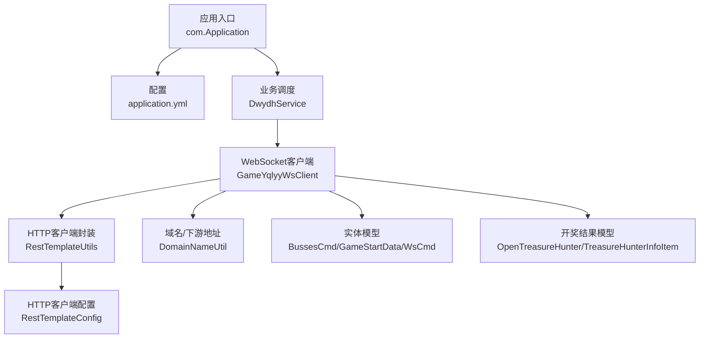
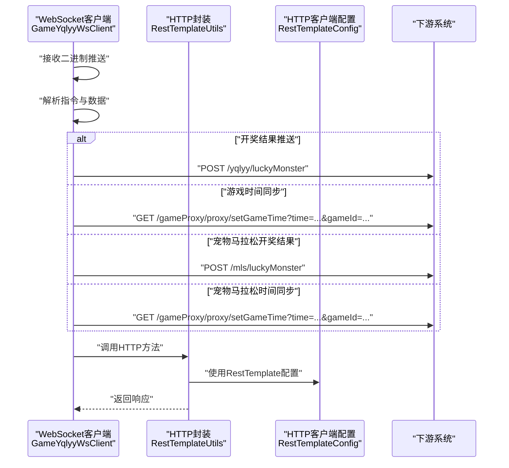
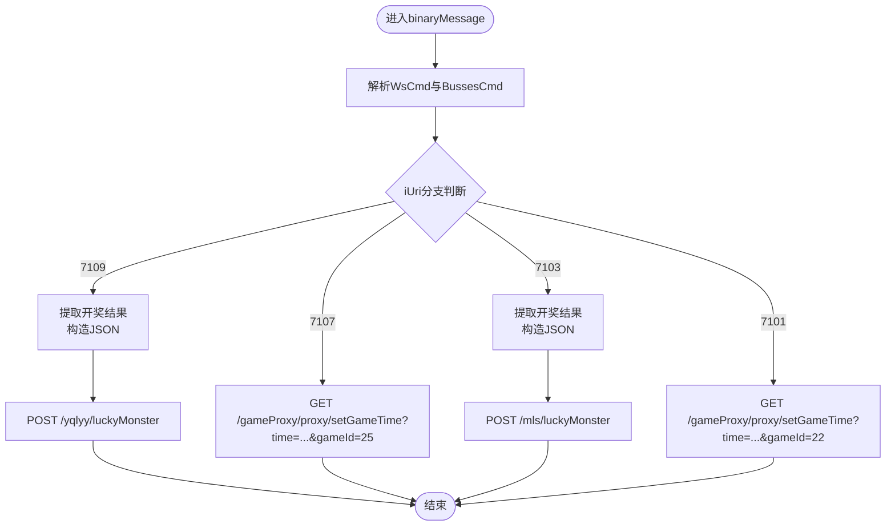
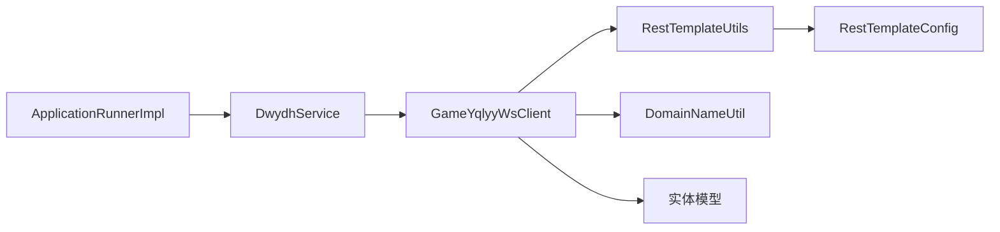

# HTTP API接口

<cite>
**本文引用的文件**
- [Application.java](file://src/main/java/com/Application.java)
- [application.yml](file://src/main/resources/application.yml)
- [RestTemplateConfig.java](file://src/main/java/com/commom/RestTemplateConfig.java)
- [RestTemplateUtils.java](file://src/main/java/com/commom/RestTemplateUtils.java)
- [DwydhService.java](file://src/main/java/com/dwydh/DwydhService.java)
- [ApplicationRunnerImpl.java](file://src/main/java/com/listener/ApplicationRunnerImpl.java)
- [GameYqlyyWsClient.java](file://src/main/java/com/yqlyy/GameYqlyyWsClient.java)
- [DomainNameUtil.java](file://src/main/java/com/utils/DomainNameUtil.java)
- [BussesCmd.java](file://src/main/java/com/entity/BussesCmd.java)
- [GameStartData.java](file://src/main/java/com/entity/GameStartData.java)
- [WsCmd.java](file://src/main/java/com/entity/WsCmd.java)
- [OpenTreasureHunter.java](file://src/main/java/com/entity/AccountedNotify/OpenTreasureHunter.java)
- [TreasureHunterInfoItem.java](file://src/main/java/com/entity/AccountedNotify/TreasureHunterInfoItem.java)
- [pom.xml](file://pom.xml)
</cite>

## 目录
1. [简介](#简介)
2. [项目结构](#项目结构)
3. [核心组件](#核心组件)
4. [架构总览](#架构总览)
5. [详细组件分析](#详细组件分析)
6. [依赖关系分析](#依赖关系分析)
7. [性能与使用限制](#性能与使用限制)
8. [故障排查指南](#故障排查指南)
9. [结论](#结论)
10. [附录](#附录)

## 简介
本文件为“HTTP API接口”的技术文档，聚焦于代码库中用于游戏数据同步的HTTP通信流程与接口行为。当前仓库以Spring Boot为基础，通过WebSocket接收游戏推送事件，并将关键游戏数据（如开奖结果、游戏时间）通过HTTP同步至下游系统。本文档将：
- 梳理HTTP请求方法与目标路径
- 说明请求参数与响应格式
- 给出调用示例与最佳实践
- 总结安全机制与性能特性
- 讨论API版本与兼容性

注意：当前代码库未暴露对外HTTP端点，所有HTTP调用均为客户端主动发起，用于将内部解析后的游戏数据同步到下游。

## 项目结构
- 应用入口与配置
  - 应用入口：com.Application
  - 服务器配置：application.yml（端口、上下文路径）
  - HTTP客户端配置：RestTemplateConfig（连接池、超时、重试）
- 业务组件
  - DwydhService：调度定时任务，启动GameYqlyyWsClient
  - GameYqlyyWsClient：WebSocket客户端，解析推送并触发HTTP同步
  - RestTemplateUtils：封装HTTP GET/POST调用
- 工具与实体
  - DomainNameUtil：下游目标地址集合
  - 实体类：BussesCmd、GameStartData、WsCmd、OpenTreasureHunter、TreasureHunterInfoItem（用于解析推送）

图表来源
- [Application.java](file://src/main/java/com/Application.java#L1-L14)
- [application.yml](file://src/main/resources/application.yml#L1-L31)
- [DwydhService.java](file://src/main/java/com/dwydh/DwydhService.java#L1-L39)
- [GameYqlyyWsClient.java](file://src/main/java/com/yqlyy/GameYqlyyWsClient.java#L1-L328)
- [RestTemplateUtils.java](file://src/main/java/com/commom/RestTemplateUtils.java#L1-L31)
- [RestTemplateConfig.java](file://src/main/java/com/commom/RestTemplateConfig.java#L1-L132)
- [DomainNameUtil.java](file://src/main/java/com/utils/DomainNameUtil.java#L1-L16)
- [BussesCmd.java](file://src/main/java/com/entity/BussesCmd.java#L1-L10)
- [GameStartData.java](file://src/main/java/com/entity/GameStartData.java#L1-L79)
- [WsCmd.java](file://src/main/java/com/entity/WsCmd.java#L1-L69)
- [OpenTreasureHunter.java](file://src/main/java/com/entity/AccountedNotify/OpenTreasureHunter.java#L1-L83)
- [TreasureHunterInfoItem.java](file://src/main/java/com/entity/AccountedNotify/TreasureHunterInfoItem.java#L1-L124)

章节来源
- [Application.java](file://src/main/java/com/Application.java#L1-L14)
- [application.yml](file://src/main/resources/application.yml#L1-L31)

## 核心组件
- 应用入口与启动
  - com.Application：Spring Boot启动类
  - ApplicationRunnerImpl：应用启动后执行初始化逻辑（启动DwydhService）
- HTTP客户端
  - RestTemplateConfig：配置连接池、超时、重试、默认头
  - RestTemplateUtils：封装GET/POST/exchange
- 数据同步
  - DwydhService：定时任务驱动GameYqlyyWsClient上报
  - GameYqlyyWsClient：WebSocket接收二进制推送，解析后按不同URI触发HTTP同步

章节来源
- [ApplicationRunnerImpl.java](file://src/main/java/com/listener/ApplicationRunnerImpl.java#L1-L34)
- [DwydhService.java](file://src/main/java/com/dwydh/DwydhService.java#L1-L39)
- [RestTemplateConfig.java](file://src/main/java/com/commom/RestTemplateConfig.java#L1-L132)
- [RestTemplateUtils.java](file://src/main/java/com/commom/RestTemplateUtils.java#L1-L31)

## 架构总览
下图展示了从WebSocket接收游戏推送，到解析并同步到下游系统的整体流程。

图表来源
- [GameYqlyyWsClient.java](file://src/main/java/com/yqlyy/GameYqlyyWsClient.java#L100-L180)
- [RestTemplateUtils.java](file://src/main/java/com/commom/RestTemplateUtils.java#L1-L31)
- [RestTemplateConfig.java](file://src/main/java/com/commom/RestTemplateConfig.java#L62-L108)

## 详细组件分析

### 组件A：GameYqlyyWsClient（WebSocket客户端）
- 功能要点
  - 连接指定wss地址，发送握手二进制帧
  - 接收二进制推送，解析指令类型与数据
  - 根据iUri分发处理：
    - 7109：一千零一夜开奖结果，构造JSON并POST到/yqlyy/luckyMonster
    - 7107：一千零一夜时间同步，GET /gameProxy/proxy/setGameTime?time=...&gameId=25
    - 7103：宠物马拉松开奖结果，POST到/mls/luckyMonster
    - 7101：宠物马拉松时间同步，GET /gameProxy/proxy/setGameTime?time=...&gameId=22
  - 对多个下游地址循环调用，确保可靠性
- 关键实体
  - WsCmd：指令头信息（iCmdType、vData等）
  - BussesCmd：推送载体（iUri、sMsg等）
  - GameStartData：时间相关字段
  - OpenTreasureHunter/TreasureHunterInfoItem：开奖结果结构

图表来源
- [GameYqlyyWsClient.java](file://src/main/java/com/yqlyy/GameYqlyyWsClient.java#L50-L220)
- [WsCmd.java](file://src/main/java/com/entity/WsCmd.java#L1-L69)
- [BussesCmd.java](file://src/main/java/com/entity/BussesCmd.java#L1-L10)
- [GameStartData.java](file://src/main/java/com/entity/GameStartData.java#L1-L79)
- [OpenTreasureHunter.java](file://src/main/java/com/entity/AccountedNotify/OpenTreasureHunter.java#L1-L83)
- [TreasureHunterInfoItem.java](file://src/main/java/com/entity/AccountedNotify/TreasureHunterInfoItem.java#L1-L124)

章节来源
- [GameYqlyyWsClient.java](file://src/main/java/com/yqlyy/GameYqlyyWsClient.java#L1-L328)

### 组件B：DwydhService（调度器）
- 功能要点
  - 在独立线程中周期性执行GameYqlyyWsClient.report()
  - 通过ThreadPoolTaskExecutor保证并发与隔离
- 触发链路
  - ApplicationRunnerImpl在应用启动后调用DwydhService.init()

章节来源
- [DwydhService.java](file://src/main/java/com/dwydh/DwydhService.java#L1-L39)
- [ApplicationRunnerImpl.java](file://src/main/java/com/listener/ApplicationRunnerImpl.java#L1-L34)

### 组件C：RestTemplateUtils 与 RestTemplateConfig（HTTP客户端）
- RestTemplateConfig
  - 配置连接池大小、每路由最大连接、超时参数、Keep-Alive、重试策略
  - 默认Content-Type为application/json;charset=UTF-8
- RestTemplateUtils
  - 封装GET/POST/exchange方法，统一返回ResponseEntity

章节来源
- [RestTemplateConfig.java](file://src/main/java/com/commom/RestTemplateConfig.java#L1-L132)
- [RestTemplateUtils.java](file://src/main/java/com/commom/RestTemplateUtils.java#L1-L31)

### 组件D：实体模型（数据结构）
- WsCmd：指令头字段（iCmdType、vData、lRequestId、traceId、iEncryptType、lTime、sMD5）
- BussesCmd：推送载体（ePushType、iUri、sMsg）
- GameStartData：轮次与时间字段（lOldRoundId、lOldRoundIndexEndTime、lOldRoundIndexTime、lRoundId、lRoundIndexEndTime、lRoundIndexTime、lServerTime、lTimeParam）
- OpenTreasureHunter：开奖结果容器（lOldRoundId、lOldRoundIndexEndTime、lOldRoundIndexTime、lServerTime、vTreasure）
- TreasureHunterInfoItem：单个动物项（iTreasureId、sTreasureName、sTag、iWeight、iRate、iProb、iProbRate、lBetClues、vTreasureBetSumDetail）

章节来源
- [WsCmd.java](file://src/main/java/com/entity/WsCmd.java#L1-L69)
- [BussesCmd.java](file://src/main/java/com/entity/BussesCmd.java#L1-L10)
- [GameStartData.java](file://src/main/java/com/entity/GameStartData.java#L1-L79)
- [OpenTreasureHunter.java](file://src/main/java/com/entity/AccountedNotify/OpenTreasureHunter.java#L1-L83)
- [TreasureHunterInfoItem.java](file://src/main/java/com/entity/AccountedNotify/TreasureHunterInfoItem.java#L1-L124)

## 依赖关系分析
- 组件耦合
  - GameYqlyyWsClient依赖RestTemplateUtils进行HTTP调用
  - DwydhService依赖GameYqlyyWsClient并通过线程池调度
  - ApplicationRunnerImpl负责应用启动后的初始化
- 外部依赖
  - Spring Web、Apache HttpClient、Hutool、TARS协议库、WebSocket客户端

图表来源
- [ApplicationRunnerImpl.java](file://src/main/java/com/listener/ApplicationRunnerImpl.java#L1-L34)
- [DwydhService.java](file://src/main/java/com/dwydh/DwydhService.java#L1-L39)
- [GameYqlyyWsClient.java](file://src/main/java/com/yqlyy/GameYqlyyWsClient.java#L1-L328)
- [RestTemplateUtils.java](file://src/main/java/com/commom/RestTemplateUtils.java#L1-L31)
- [RestTemplateConfig.java](file://src/main/java/com/commom/RestTemplateConfig.java#L1-L132)
- [DomainNameUtil.java](file://src/main/java/com/utils/DomainNameUtil.java#L1-L16)

章节来源
- [pom.xml](file://pom.xml#L1-L160)

## 性能与使用限制
- 连接池与超时
  - 最大连接数、每路由最大连接、连接超时、连接池获取超时、Socket超时、空闲校验与失效时间均在配置中明确
- 重试机制
  - 默认启用重试处理器，重试次数与幂等性需结合下游接口设计
- 并发与隔离
  - 使用线程池执行WebSocket客户端，避免阻塞主线程
- 建议
  - 对下游接口进行限流与熔断
  - 对重复推送进行去重或幂等键设计
  - 对JSON序列化/反序列化采用稳定版本，避免字段变更导致的兼容问题

章节来源
- [RestTemplateConfig.java](file://src/main/java/com/commom/RestTemplateConfig.java#L33-L132)
- [application.yml](file://src/main/resources/application.yml#L16-L31)
- [DwydhService.java](file://src/main/java/com/dwydh/DwydhService.java#L20-L36)

## 故障排查指南
- WebSocket连接失败
  - 检查wss地址有效性与网络连通性
  - 查看日志中的异常堆栈与错误码
- HTTP调用异常
  - 检查下游地址数组是否为空（urls/transitUrls）
  - 校验请求头与Content-Type是否符合预期
  - 关注超时与重试策略
- 数据解析异常
  - 确认推送指令类型与字段索引一致
  - 核对TARS结构读取顺序与字段类型

章节来源
- [GameYqlyyWsClient.java](file://src/main/java/com/yqlyy/GameYqlyyWsClient.java#L240-L308)
- [DomainNameUtil.java](file://src/main/java/com/utils/DomainNameUtil.java#L1-L16)
- [RestTemplateConfig.java](file://src/main/java/com/commom/RestTemplateConfig.java#L84-L108)

## 结论
- 当前代码库未暴露对外HTTP端点，而是作为“上游客户端”将游戏数据同步到下游系统
- HTTP接口由GameYqlyyWsClient根据推送指令动态触发，涉及两类路径：
  - POST /yqlyy/luckyMonster（一千零一夜开奖结果）
  - GET /gameProxy/proxy/setGameTime?time=...&gameId=...（时间同步）
  - POST /mls/luckyMonster（宠物马拉松开奖结果）
- HTTP客户端具备完善的连接池、超时与重试配置，建议结合下游能力进行限流与幂等设计

## 附录

### HTTP请求方法与路径规范
- 方法与用途
  - POST：用于提交开奖结果数据
  - GET：用于同步游戏时间
- 路径与参数
  - /yqlyy/luckyMonster
    - 请求体：JSON对象，包含开奖结果数组
    - 字段示例：animalId/animalName（依据实际下游字段）
  - /gameProxy/proxy/setGameTime
    - 查询参数：time（毫秒时间戳）、gameId（游戏标识）
  - /mls/luckyMonster
    - 请求体：JSON对象，包含开奖结果数组
    - 字段示例：animalId/animalName（依据实际下游字段）

章节来源
- [GameYqlyyWsClient.java](file://src/main/java/com/yqlyy/GameYqlyyWsClient.java#L100-L180)

### 请求参数与数据类型
- JSON请求体（示例字段）
  - animalId: number
  - animalName: string
  - 其他：依据下游接口定义
- 查询参数
  - time: number（毫秒）
  - gameId: number（22/25）

章节来源
- [GameYqlyyWsClient.java](file://src/main/java/com/yqlyy/GameYqlyyWsClient.java#L136-L147)
- [GameYqlyyWsClient.java](file://src/main/java/com/yqlyy/GameYqlyyWsClient.java#L170-L182)

### 响应格式与状态码
- 统一返回类型：ResponseEntity<T>
- 成功响应：由下游系统决定；客户端仅记录日志
- 错误处理：捕获RestClientException与通用异常，记录warn/error日志

章节来源
- [RestTemplateUtils.java](file://src/main/java/com/commom/RestTemplateUtils.java#L19-L29)
- [GameYqlyyWsClient.java](file://src/main/java/com/yqlyy/GameYqlyyWsClient.java#L104-L114)
- [GameYqlyyWsClient.java](file://src/main/java/com/yqlyy/GameYqlyyWsClient.java#L137-L147)
- [GameYqlyyWsClient.java](file://src/main/java/com/yqlyy/GameYqlyyWsClient.java#L171-L181)
- [GameYqlyyWsClient.java](file://src/main/java/com/yqlyy/GameYqlyyWsClient.java#L202-L213)

### API调用示例与最佳实践
- 示例（概念性）
  - POST /yqlyy/luckyMonster
    - Content-Type: application/json
    - Body: {"animalId": 1001, "animalName": "老虎"}
  - GET /gameProxy/proxy/setGameTime?time=1700000000000&gameId=25
- 最佳实践
  - 幂等性：对相同time/gameId的请求进行去重
  - 超时与重试：结合下游SLA设置合理重试次数与退避
  - 日志与监控：记录请求与响应摘要，便于追踪

章节来源
- [RestTemplateUtils.java](file://src/main/java/com/commom/RestTemplateUtils.java#L19-L29)
- [RestTemplateConfig.java](file://src/main/java/com/commom/RestTemplateConfig.java#L84-L108)

### 安全机制与认证
- 当前实现未包含鉴权逻辑
- 建议
  - 下游接口接入Token/JWT或签名机制
  - 传输层启用TLS（当前WebSocket使用wss）

章节来源
- [GameYqlyyWsClient.java](file://src/main/java/com/yqlyy/GameYqlyyWsClient.java#L35-L36)

### 版本管理与兼容性
- 版本号：1.0-SNAPSHOT（pom.xml）
- 兼容性建议
  - 对JSON字段变更采用向后兼容策略（新增字段不破坏旧版）
  - 对推送指令字段顺序严格遵循TARS定义
  - 对下游接口升级采用灰度与回滚预案

章节来源
- [pom.xml](file://pom.xml#L1-L20)