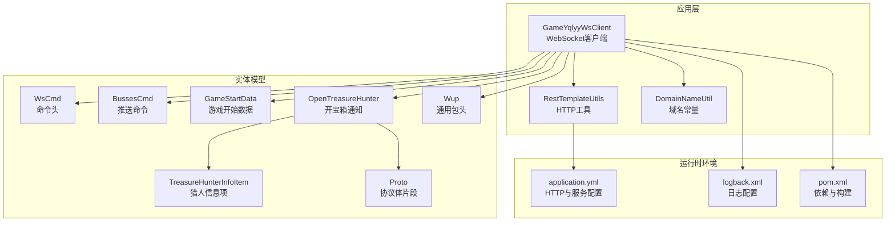
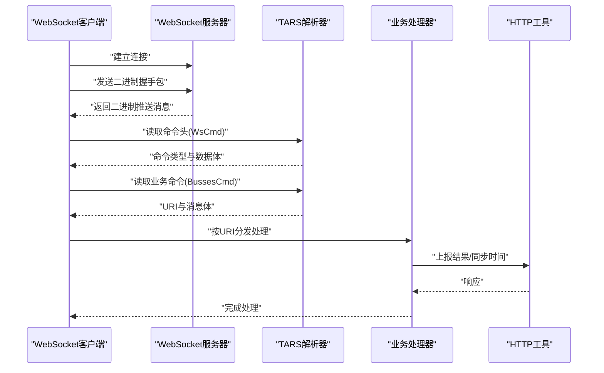
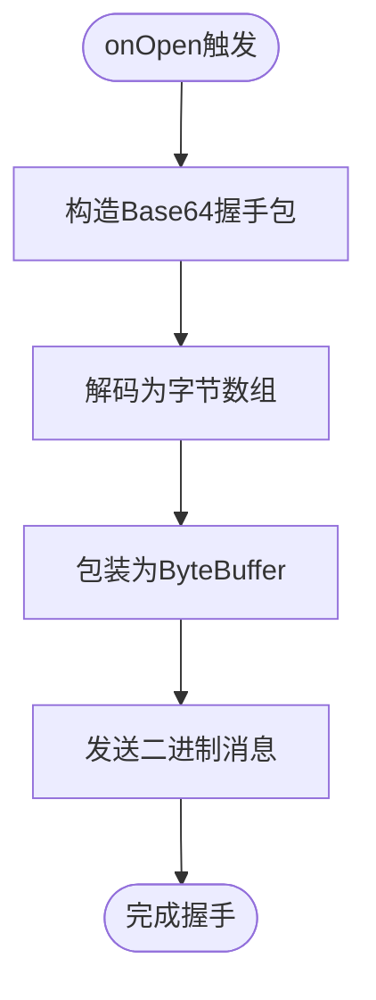
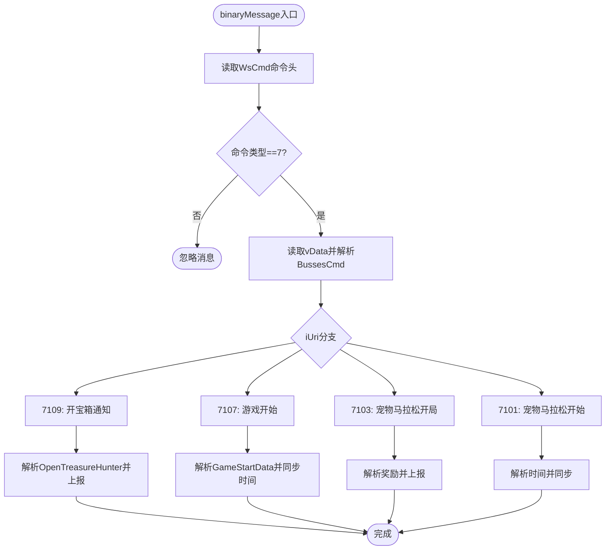
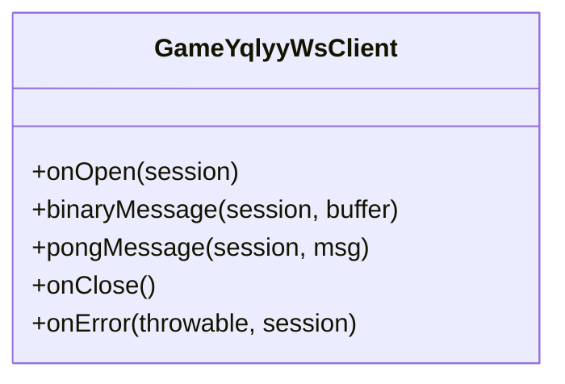
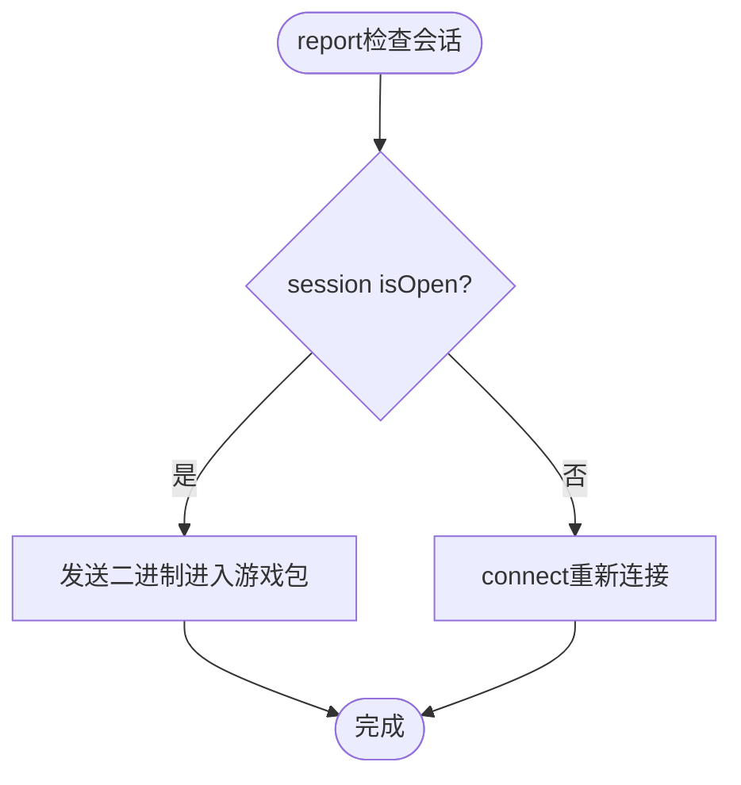
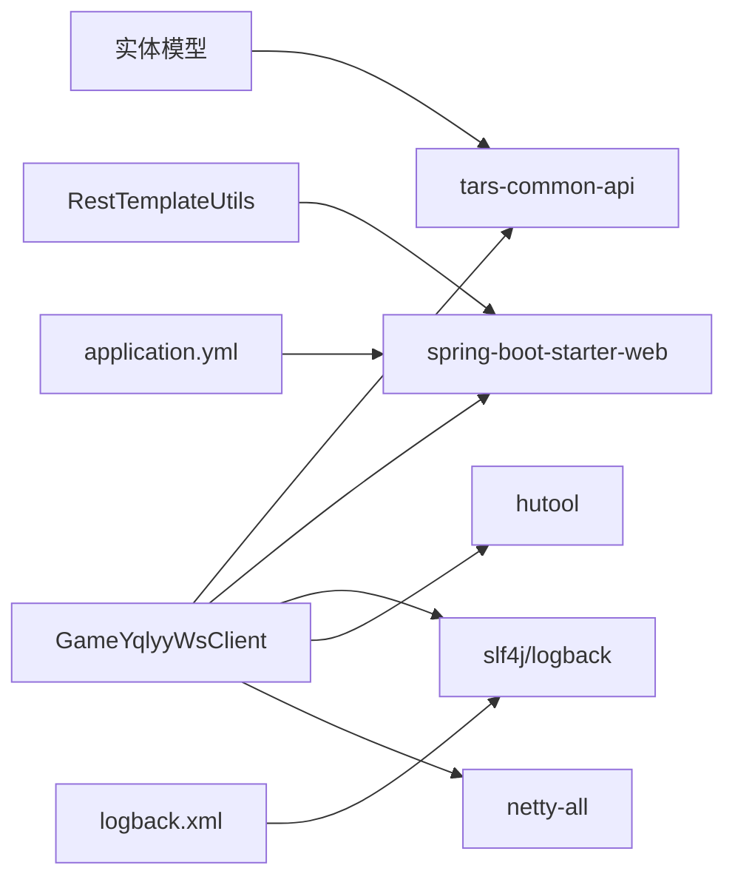

# WebSocket接口

<cite>
**本文引用的文件列表**
- [GameYqlyyWsClient.java](file://src/main/java/com/yqlyy/GameYqlyyWsClient.java)
- [WsCmd.java](file://src/main/java/com/entity/WsCmd.java)
- [BussesCmd.java](file://src/main/java/com/entity/BussesCmd.java)
- [GameStartData.java](file://src/main/java/com/entity/GameStartData.java)
- [OpenTreasureHunter.java](file://src/main/java/com/entity/AccountedNotify/OpenTreasureHunter.java)
- [TreasureHunterInfoItem.java](file://src/main/java/com/entity/AccountedNotify/TreasureHunterInfoItem.java)
- [Proto.java](file://src/main/java/com/entity/AccountedNotify/Proto.java)
- [Wup.java](file://src/main/java/com/entity/Wup.java)
- [DomainNameUtil.java](file://src/main/java/com/utils/DomainNameUtil.java)
- [application.yml](file://src/main/resources/application.yml)
- [logback.xml](file://src/main/resources/logback.xml)
- [pom.xml](file://pom.xml)
</cite>

## 目录
1. [简介](#简介)
2. [项目结构](#项目结构)
3. [核心组件](#核心组件)
4. [架构总览](#架构总览)
5. [组件详解](#组件详解)
6. [依赖关系分析](#依赖关系分析)
7. [性能与优化](#性能与优化)
8. [故障排查指南](#故障排查指南)
9. [结论](#结论)
10. [附录](#附录)

## 简介
本文件面向开发者，系统化梳理并解释该仓库中的WebSocket接口实现，重点覆盖：
- WebSocket连接建立流程与参数配置
- 二进制消息处理与TARS协议解码
- 事件回调机制（onOpen、onMessage、onClose、onError）
- 消息格式规范（二进制结构、字段含义、编码方式）
- 连接管理策略（重连、心跳、异常处理）
- 使用示例与最佳实践
- 安全机制与连接限制、性能优化与排障建议

## 项目结构
该项目为Spring Boot应用，包含WebSocket客户端、实体模型、HTTP工具与配置文件。WebSocket客户端位于com.yqlyy包下，实体模型位于com.entity及子包，HTTP工具位于com.utils，配置位于resources目录。

图表来源
- [GameYqlyyWsClient.java](file://src/main/java/com/yqlyy/GameYqlyyWsClient.java#L1-L328)
- [WsCmd.java](file://src/main/java/com/entity/WsCmd.java#L1-L69)
- [BussesCmd.java](file://src/main/java/com/entity/BussesCmd.java#L1-L10)
- [GameStartData.java](file://src/main/java/com/entity/GameStartData.java#L1-L79)
- [OpenTreasureHunter.java](file://src/main/java/com/entity/AccountedNotify/OpenTreasureHunter.java#L1-L83)
- [TreasureHunterInfoItem.java](file://src/main/java/com/entity/AccountedNotify/TreasureHunterInfoItem.java#L1-L124)
- [Proto.java](file://src/main/java/com/entity/AccountedNotify/Proto.java#L1-L8)
- [Wup.java](file://src/main/java/com/entity/Wup.java#L1-L29)
- [DomainNameUtil.java](file://src/main/java/com/utils/DomainNameUtil.java#L1-L16)
- [application.yml](file://src/main/resources/application.yml#L1-L31)
- [logback.xml](file://src/main/resources/logback.xml#L1-L75)
- [pom.xml](file://pom.xml#L1-L160)

章节来源
- [GameYqlyyWsClient.java](file://src/main/java/com/yqlyy/GameYqlyyWsClient.java#L1-L328)
- [application.yml](file://src/main/resources/application.yml#L1-L31)
- [logback.xml](file://src/main/resources/logback.xml#L1-L75)
- [pom.xml](file://pom.xml#L1-L160)

## 核心组件
- WebSocket客户端：负责连接、发送二进制握手包、接收二进制消息并按TARS协议解析，分发到不同业务URI处理。
- 实体模型：封装命令头、推送命令、游戏状态、开宝箱通知等数据结构。
- HTTP工具：用于将解析后的结果上报到内部服务或中转服务。
- 配置：HTTP连接池、超时、日志、服务端口等。

章节来源
- [GameYqlyyWsClient.java](file://src/main/java/com/yqlyy/GameYqlyyWsClient.java#L1-L328)
- [WsCmd.java](file://src/main/java/com/entity/WsCmd.java#L1-L69)
- [BussesCmd.java](file://src/main/java/com/entity/BussesCmd.java#L1-L10)
- [GameStartData.java](file://src/main/java/com/entity/GameStartData.java#L1-L79)
- [OpenTreasureHunter.java](file://src/main/java/com/entity/AccountedNotify/OpenTreasureHunter.java#L1-L83)
- [TreasureHunterInfoItem.java](file://src/main/java/com/entity/AccountedNotify/TreasureHunterInfoItem.java#L1-L124)
- [Proto.java](file://src/main/java/com/entity/AccountedNotify/Proto.java#L1-L8)
- [Wup.java](file://src/main/java/com/entity/Wup.java#L1-L29)
- [DomainNameUtil.java](file://src/main/java/com/utils/DomainNameUtil.java#L1-L16)
- [application.yml](file://src/main/resources/application.yml#L1-L31)
- [logback.xml](file://src/main/resources/logback.xml#L1-L75)
- [pom.xml](file://pom.xml#L1-L160)

## 架构总览
WebSocket客户端通过Jakarta WebSocket API建立连接，发送二进制握手包后接收二进制推送消息。消息采用TARS协议编码，客户端解析为命令头与业务命令，再根据URI路由到不同业务处理逻辑，并通过HTTP工具上报结果。

图表来源
- [GameYqlyyWsClient.java](file://src/main/java/com/yqlyy/GameYqlyyWsClient.java#L46-L219)
- [WsCmd.java](file://src/main/java/com/entity/WsCmd.java#L1-L69)
- [BussesCmd.java](file://src/main/java/com/entity/BussesCmd.java#L1-L10)
- [OpenTreasureHunter.java](file://src/main/java/com/entity/AccountedNotify/OpenTreasureHunter.java#L1-L83)
- [GameStartData.java](file://src/main/java/com/entity/GameStartData.java#L1-L79)

## 组件详解

### WebSocket连接与握手
- 连接入口：客户端在onOpen回调中构造二进制握手包并发送。
- 握手包内容：包含Base64编码的字节序列，客户端将其解码为ByteBuffer并通过Basic Remote发送。
- 连接参数：默认最大文本/二进制消息缓冲区大小、会话空闲超时、异步发送超时等在连接容器上设置。
- URL来源：静态字段保存wss地址；若为空则跳过连接尝试。

图表来源
- [GameYqlyyWsClient.java](file://src/main/java/com/yqlyy/GameYqlyyWsClient.java#L221-L237)

章节来源
- [GameYqlyyWsClient.java](file://src/main/java/com/yqlyy/GameYqlyyWsClient.java#L221-L237)

### 二进制消息处理与TARS解码
- 入口：binaryMessage回调接收二进制消息。
- 解析步骤：
  1) 以TARS输入流读取命令头（WsCmd），提取命令类型。
  2) 若命令类型非目标值则忽略。
  3) 读取数据体vData，再次以TARS输入流解析业务命令（BussesCmd）。
  4) 根据URI分发处理：
     - 7109：开宝箱通知，解析为OpenTreasureHunter，遍历奖励列表并上报。
     - 7107：游戏开始，解析GameStartData并同步时间到中转服务。
     - 7103：宠物马拉松开局，解析奖励并上报。
     - 7101：宠物马拉松开始，解析时间并同步。
- 异常处理：捕获HTTP异常并记录日志；当发送失败时触发重连。

图表来源
- [GameYqlyyWsClient.java](file://src/main/java/com/yqlyy/GameYqlyyWsClient.java#L51-L219)
- [WsCmd.java](file://src/main/java/com/entity/WsCmd.java#L1-L69)
- [BussesCmd.java](file://src/main/java/com/entity/BussesCmd.java#L1-L10)
- [OpenTreasureHunter.java](file://src/main/java/com/entity/AccountedNotify/OpenTreasureHunter.java#L1-L83)
- [GameStartData.java](file://src/main/java/com/entity/GameStartData.java#L1-L79)

章节来源
- [GameYqlyyWsClient.java](file://src/main/java/com/yqlyy/GameYqlyyWsClient.java#L51-L219)

### 事件回调机制
- onOpen：建立连接并发送握手包。
- onMessage（二进制）：解析TARS消息并分发处理。
- onClose：记录连接关闭。
- onError：记录异常。

图表来源
- [GameYqlyyWsClient.java](file://src/main/java/com/yqlyy/GameYqlyyWsClient.java#L46-L248)

章节来源
- [GameYqlyyWsClient.java](file://src/main/java/com/yqlyy/GameYqlyyWsClient.java#L46-L248)

### 消息格式规范
- 命令头（WsCmd）
  - 字段：命令类型、数据体、请求ID、追踪ID、加密类型、时间戳、MD5校验等。
  - 编码：TARS结构，按序号读取。
- 业务命令（BussesCmd）
  - 字段：推送类型、URI、消息体。
  - 编码：TARS结构，按序号读取。
- 开宝箱通知（OpenTreasureHunter）
  - 字段：轮次ID、索引时间、服务器时间、奖励列表（含TreasureHunterInfoItem）。
  - 编码：TARS数组与结构组合。
- 奖励项（TreasureHunterInfoItem）
  - 字段：ID、名称、权重、概率、倍率、投注线索等。
  - 编码：TARS结构。
- 游戏开始数据（GameStartData）
  - 字段：旧轮次ID、旧索引起止时间、当前轮次ID、索引起止时间、服务器时间、时间参数等。
  - 编码：TARS结构。
- 通用包头（Wup）
  - 字段：版本、包类型、消息类型、请求ID、服务名、函数名、缓冲区、超时、上下文、状态、数据等。
  - 编码：Map与字节缓冲区。

章节来源
- [WsCmd.java](file://src/main/java/com/entity/WsCmd.java#L1-L69)
- [BussesCmd.java](file://src/main/java/com/entity/BussesCmd.java#L1-L10)
- [OpenTreasureHunter.java](file://src/main/java/com/entity/AccountedNotify/OpenTreasureHunter.java#L1-L83)
- [TreasureHunterInfoItem.java](file://src/main/java/com/entity/AccountedNotify/TreasureHunterInfoItem.java#L1-L124)
- [GameStartData.java](file://src/main/java/com/entity/GameStartData.java#L1-L79)
- [Wup.java](file://src/main/java/com/entity/Wup.java#L1-L29)

### 连接管理策略
- 重连机制：report方法检测会话状态，若关闭则调用connect重新连接。
- 心跳维持：onMessage回调中接收PongMessage，用于确认连接存活。
- 异常处理：onError记录异常；发送失败时触发重连。
- 参数配置：连接容器设置默认缓冲区大小、空闲超时、异步发送超时。

图表来源
- [GameYqlyyWsClient.java](file://src/main/java/com/yqlyy/GameYqlyyWsClient.java#L274-L290)
- [GameYqlyyWsClient.java](file://src/main/java/com/yqlyy/GameYqlyyWsClient.java#L250-L272)

章节来源
- [GameYqlyyWsClient.java](file://src/main/java/com/yqlyy/GameYqlyyWsClient.java#L250-L290)

### 使用示例与最佳实践
- 基本用法
  - 创建客户端实例并注入HTTP工具。
  - 在合适时机调用report发送进入游戏包，确保会话处于打开状态。
  - 监听onMessage回调以接收推送消息并按URI处理。
- 最佳实践
  - 在onOpen中仅发送一次握手包，避免重复发送。
  - 对于高并发场景，合理设置连接容器的缓冲区与超时参数。
  - 对HTTP上报进行幂等设计，避免重复上报导致副作用。
  - 记录关键日志（连接、握手、解析、上报）以便排障。

章节来源
- [GameYqlyyWsClient.java](file://src/main/java/com/yqlyy/GameYqlyyWsClient.java#L274-L290)

### 安全机制与连接限制
- 安全机制
  - 使用wss协议（WebSocket Secure）保障传输安全。
  - 握手包采用Base64编码，避免明文传输敏感信息。
  - AES/CBC加密工具方法存在但未在当前流程中直接使用，如需启用应结合业务场景谨慎实现。
- 连接限制
  - 默认最大消息缓冲区大小与会话空闲超时已在连接容器上设置。
  - HTTP客户端超时与连接池参数由application.yml配置。

章节来源
- [GameYqlyyWsClient.java](file://src/main/java/com/yqlyy/GameYqlyyWsClient.java#L254-L257)
- [application.yml](file://src/main/resources/application.yml#L16-L31)

## 依赖关系分析
- WebSocket客户端依赖TARS协议库、HTTP客户端、日志框架与Spring Web。
- 实体模型依赖TARS注解基类，便于序列化/反序列化。
- HTTP工具依赖Apache HttpClient与JSON库。

图表来源
- [pom.xml](file://pom.xml#L26-L111)
- [GameYqlyyWsClient.java](file://src/main/java/com/yqlyy/GameYqlyyWsClient.java#L1-L328)
- [application.yml](file://src/main/resources/application.yml#L1-L31)
- [logback.xml](file://src/main/resources/logback.xml#L1-L75)

章节来源
- [pom.xml](file://pom.xml#L1-L160)

## 性能与优化
- 连接与消息缓冲
  - 合理设置默认最大文本/二进制消息缓冲区大小，避免频繁扩容。
  - 设置会话空闲超时与异步发送超时，防止资源泄漏。
- 解析性能
  - TARS输入流按序号读取，注意字段顺序与类型一致性，减少异常分支。
  - 对高频字段使用缓存或预分配容器，降低GC压力。
- HTTP上报
  - 复用HTTP连接池，设置合理的超时与并发上限。
  - 对批量上报进行合并与去重，减少网络请求次数。
- 日志与监控
  - 使用异步日志Appender，避免阻塞消息处理线程。
  - 关键路径埋点统计耗时与错误率，辅助定位瓶颈。

[本节为通用建议，无需特定文件引用]

## 故障排查指南
- 连接失败
  - 检查wss地址是否有效且可达。
  - 查看onError日志，定位异常原因（网络、证书、URL无效等）。
- 握手失败
  - 确认握手包Base64编码正确，长度与格式符合预期。
  - 核对onOpen中发送逻辑与异常处理。
- 消息解析异常
  - 检查WsCmd与BussesCmd字段序号与类型是否一致。
  - 对于7109/7107/7103/7101分支，确认URI匹配与数据体结构。
- 上报失败
  - 查看HTTP异常日志，确认目标服务可达与参数正确。
  - 对幂等性不足导致的重复上报问题进行补偿处理。
- 日志定位
  - 使用logback.xml配置的控制台与文件输出，结合INFO/ERROR级别筛选。

章节来源
- [GameYqlyyWsClient.java](file://src/main/java/com/yqlyy/GameYqlyyWsClient.java#L240-L248)
- [logback.xml](file://src/main/resources/logback.xml#L1-L75)

## 结论
该WebSocket接口实现了与虎牙WebSocket服务的稳定交互，通过TARS协议解析二进制消息并按URI路由到不同业务处理逻辑，同时具备基本的重连、心跳与异常处理能力。建议在生产环境中进一步完善重连策略、心跳保活、HTTP上报幂等与监控告警，以提升稳定性与可观测性。

[本节为总结性内容，无需特定文件引用]

## 附录

### 二进制消息结构与字段说明
- 命令头（WsCmd）
  - 命令类型：整型，标识消息类别。
  - 数据体：字节数组，承载业务命令与具体数据。
  - 请求ID/追踪ID/加密类型/时间戳/MD5：用于请求关联与完整性校验。
- 业务命令（BussesCmd）
  - 推送类型：整型，推送类型标识。
  - URI：长整型，业务路由标识。
  - 消息体：字节数组，承载具体业务数据。
- 开宝箱通知（OpenTreasureHunter）
  - 轮次ID/索引时间/服务器时间：用于时间与轮次对齐。
  - 奖励列表：包含多个TreasureHunterInfoItem，描述奖励详情。
- 奖励项（TreasureHunterInfoItem）
  - ID/名称/标签/权重/倍率/概率/投注线索：奖励属性与统计。
- 游戏开始数据（GameStartData）
  - 旧轮次ID/旧索引起止时间/当前轮次ID/索引起止时间/服务器时间/时间参数：用于时间同步与轮次管理。
- 通用包头（Wup）
  - 版本/包类型/消息类型/请求ID/服务名/函数名/缓冲区/超时/上下文/状态/数据：通用RPC包头。

章节来源
- [WsCmd.java](file://src/main/java/com/entity/WsCmd.java#L1-L69)
- [BussesCmd.java](file://src/main/java/com/entity/BussesCmd.java#L1-L10)
- [OpenTreasureHunter.java](file://src/main/java/com/entity/AccountedNotify/OpenTreasureHunter.java#L1-L83)
- [TreasureHunterInfoItem.java](file://src/main/java/com/entity/AccountedNotify/TreasureHunterInfoItem.java#L1-L124)
- [GameStartData.java](file://src/main/java/com/entity/GameStartData.java#L1-L79)
- [Wup.java](file://src/main/java/com/entity/Wup.java#L1-L29)