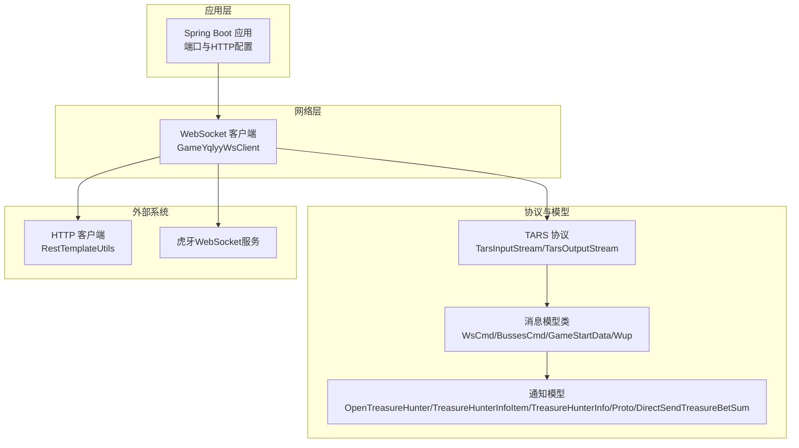
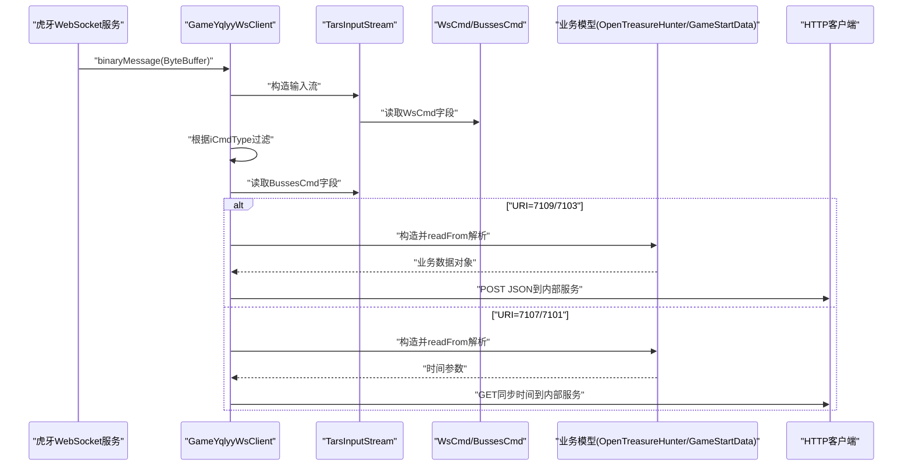
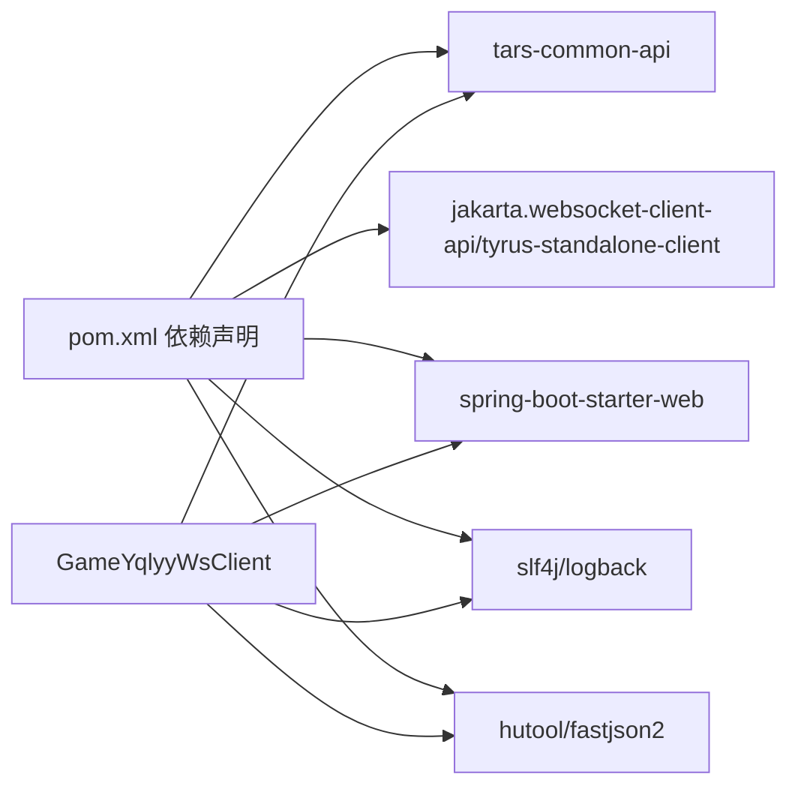
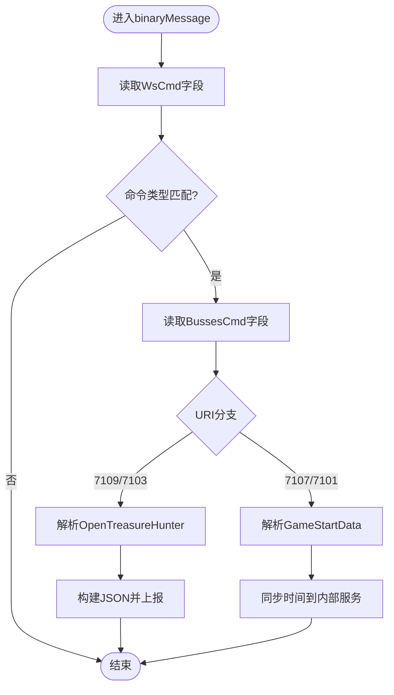

# 消息格式规范

<cite>
**本文引用的文件列表**
- [pom.xml](file://pom.xml)
- [application.yml](file://src/main/resources/application.yml)
- [WsCmd.java](file://src/main/java/com/entity/WsCmd.java)
- [BussesCmd.java](file://src/main/java/com/entity/BussesCmd.java)
- [GameStartData.java](file://src/main/java/com/entity/GameStartData.java)
- [Wup.java](file://src/main/java/com/entity/Wup.java)
- [OpenTreasureHunter.java](file://src/main/java/com/entity/AccountedNotify/OpenTreasureHunter.java)
- [TreasureHunterInfoItem.java](file://src/main/java/com/entity/AccountedNotify/TreasureHunterInfoItem.java)
- [TreasureHunterInfo.java](file://src/main/java/com/entity/AccountedNotify/TreasureHunterInfo.java)
- [Proto.java](file://src/main/java/com/entity/AccountedNotify/Proto.java)
- [DirectSendTreasureBetSum.java](file://src/main/java/com/entity/AccountedNotify/DirectSendTreasureBetSum.java)
- [GameYqlyyWsClient.java](file://src/main/java/com/yqlyy/GameYqlyyWsClient.java)
</cite>

## 目录
1. [引言](#引言)
2. [项目结构](#项目结构)
3. [核心组件](#核心组件)
4. [架构总览](#架构总览)
5. [详细组件分析](#详细组件分析)
6. [依赖关系分析](#依赖关系分析)
7. [性能与优化](#性能与优化)
8. [故障排查指南](#故障排查指南)
9. [结论](#结论)
10. [附录](#附录)

## 引言
本文件面向消息格式与协议实现的技术文档，聚焦于WebSocket二进制消息的结构、TARS协议的编码规范、消息类型与字段定义、解析流程与处理逻辑，并给出版本兼容性与扩展机制、性能优化建议以及常见问题排查方法。本文所有技术细节均基于仓库中的实际代码与依赖声明进行归纳总结。

## 项目结构
该项目为基于Spring Boot的Java应用，使用TARS协议进行二进制消息编解码，通过WebSocket接收游戏推送消息，并将关键业务数据转发至内部服务。

图表来源
- [GameYqlyyWsClient.java](file://src/main/java/com/yqlyy/GameYqlyyWsClient.java#L29-L327)
- [WsCmd.java](file://src/main/java/com/entity/WsCmd.java#L1-L68)
- [BussesCmd.java](file://src/main/java/com/entity/BussesCmd.java#L1-L9)
- [GameStartData.java](file://src/main/java/com/entity/GameStartData.java#L1-L78)
- [Wup.java](file://src/main/java/com/entity/Wup.java#L1-L28)
- [OpenTreasureHunter.java](file://src/main/java/com/entity/AccountedNotify/OpenTreasureHunter.java#L1-L82)
- [TreasureHunterInfoItem.java](file://src/main/java/com/entity/AccountedNotify/TreasureHunterInfoItem.java#L1-L123)
- [TreasureHunterInfo.java](file://src/main/java/com/entity/AccountedNotify/TreasureHunterInfo.java#L1-L43)
- [Proto.java](file://src/main/java/com/entity/AccountedNotify/Proto.java#L1-L7)
- [DirectSendTreasureBetSum.java](file://src/main/java/com/entity/AccountedNotify/DirectSendTreasureBetSum.java#L1-L8)

章节来源
- [pom.xml](file://pom.xml#L1-L160)
- [application.yml](file://src/main/resources/application.yml#L1-L31)

## 核心组件
- WebSocket客户端：负责建立与虎牙WebSocket服务的连接，接收二进制消息并进行解析与转发。
- TARS协议适配器：通过TarsInputStream/TarsOutputStream读写二进制消息，完成字段提取与对象反序列化。
- 消息模型：WsCmd封装WebSocket消息头；BussesCmd封装业务推送消息头；GameStartData封装游戏开始相关时间参数；Wup封装TARS调用元数据。
- 通知模型：OpenTreasureHunter、TreasureHunterInfoItem、TreasureHunterInfo、Proto、DirectSendTreasureBetSum用于承载开宝箱与游戏状态等业务数据。

章节来源
- [GameYqlyyWsClient.java](file://src/main/java/com/yqlyy/GameYqlyyWsClient.java#L46-L219)
- [WsCmd.java](file://src/main/java/com/entity/WsCmd.java#L1-L68)
- [BussesCmd.java](file://src/main/java/com/entity/BussesCmd.java#L1-L9)
- [GameStartData.java](file://src/main/java/com/entity/GameStartData.java#L1-L78)
- [Wup.java](file://src/main/java/com/entity/Wup.java#L1-L28)
- [OpenTreasureHunter.java](file://src/main/java/com/entity/AccountedNotify/OpenTreasureHunter.java#L1-L82)
- [TreasureHunterInfoItem.java](file://src/main/java/com/entity/AccountedNotify/TreasureHunterInfoItem.java#L1-L123)
- [TreasureHunterInfo.java](file://src/main/java/com/entity/AccountedNotify/TreasureHunterInfo.java#L1-L43)
- [Proto.java](file://src/main/java/com/entity/AccountedNotify/Proto.java#L1-L7)
- [DirectSendTreasureBetSum.java](file://src/main/java/com/entity/AccountedNotify/DirectSendTreasureBetSum.java#L1-L8)

## 架构总览
WebSocket消息在客户端侧的处理流程如下：
- 接收二进制消息
- 使用TARS输入流解析出WsCmd
- 根据WsCmd中的命令类型过滤消息
- 解析BussesCmd（包含业务URI与消息体）
- 针对不同URI进行特定业务解析（如开宝箱、游戏开始时间同步）

图表来源
- [GameYqlyyWsClient.java](file://src/main/java/com/yqlyy/GameYqlyyWsClient.java#L51-L218)
- [WsCmd.java](file://src/main/java/com/entity/WsCmd.java#L1-L68)
- [BussesCmd.java](file://src/main/java/com/entity/BussesCmd.java#L1-L9)
- [OpenTreasureHunter.java](file://src/main/java/com/entity/AccountedNotify/OpenTreasureHunter.java#L72-L81)
- [GameStartData.java](file://src/main/java/com/entity/GameStartData.java#L1-L78)

## 详细组件分析

### WebSocket消息头模型：WsCmd
- 字段定义
  - 命令类型：整型，用于区分消息类别
  - 请求ID：长整型，用于关联请求/响应
  - 时间戳：长整型，消息生成时间
  - 加密类型：整型，指示消息加密方式
  - 跟踪ID：字符串，用于链路追踪
  - 数据体：字节数组，承载后续业务消息
  - MD5校验：字符串，用于完整性校验（字段存在但未在解析处使用）
- 编码与解析
  - 通过TARS输入流按字段编号顺序读取
  - 字段编号与读取顺序由客户端解析逻辑决定

章节来源
- [WsCmd.java](file://src/main/java/com/entity/WsCmd.java#L1-L68)
- [GameYqlyyWsClient.java](file://src/main/java/com/yqlyy/GameYqlyyWsClient.java#L61-L68)

### 业务推送消息头：BussesCmd
- 字段定义
  - 推送类型：整型
  - URI：长整型，标识具体业务场景
  - 消息体：字节数组，承载业务数据
- 编码与解析
  - 通过TARS输入流按字段编号顺序读取
  - URI用于路由到不同的业务解析分支

章节来源
- [BussesCmd.java](file://src/main/java/com/entity/BussesCmd.java#L1-L9)
- [GameYqlyyWsClient.java](file://src/main/java/com/yqlyy/GameYqlyyWsClient.java#L70-L74)

### 游戏开始数据：GameStartData
- 字段定义
  - 当前轮次ID与索引时间
  - 上一轮次ID与索引时间
  - 服务器时间
  - 时间参数
- 编码与解析
  - 通过TARS输入流按字段编号顺序读取
  - 用于同步游戏时间到内部服务

章节来源
- [GameStartData.java](file://src/main/java/com/entity/GameStartData.java#L1-L78)
- [GameYqlyyWsClient.java](file://src/main/java/com/yqlyy/GameYqlyyWsClient.java#L122-L132)

### TARS调用元数据：Wup
- 字段定义
  - 版本号、包类型、消息类型、请求ID
  - 服务名、函数名、缓冲区
  - 超时时间、上下文、状态、数据映射
- 用途
  - 描述一次TARS调用的元信息，便于协议层处理

章节来源
- [Wup.java](file://src/main/java/com/entity/Wup.java#L1-L28)

### 开宝箱通知模型：OpenTreasureHunter
- 字段定义
  - 上一轮次ID与索引时间/结束时间
  - 服务器时间
  - 宝箱列表：包含动物项与奖励列表
- 编码与解析
  - 通过TARS输入流读取字段编号0、4等
  - vTreasure为数组，包含动物项与奖励集合

章节来源
- [OpenTreasureHunter.java](file://src/main/java/com/entity/AccountedNotify/OpenTreasureHunter.java#L1-L82)
- [GameYqlyyWsClient.java](file://src/main/java/com/yqlyy/GameYqlyyWsClient.java#L78-L84)

### 动物项模型：TreasureHunterInfoItem
- 字段定义
  - 概率、概率率、权重、ID、等级
  - 名称、标签、图标
  - 押注线索
  - 押注明细（嵌套结构）
- 编码与解析
  - 通过TARS输入流按字段编号顺序读取
  - 字段编号覆盖0~8，用于定位各字段

章节来源
- [TreasureHunterInfoItem.java](file://src/main/java/com/entity/AccountedNotify/TreasureHunterInfoItem.java#L1-L123)
- [GameYqlyyWsClient.java](file://src/main/java/com/yqlyy/GameYqlyyWsClient.java#L90-L99)

### 动物项容器：TreasureHunterInfo
- 字段定义
  - 单个动物项原型
  - 动物项列表
- 编码与解析
  - 通过TARS输入流读取单个动物项

章节来源
- [TreasureHunterInfo.java](file://src/main/java/com/entity/AccountedNotify/TreasureHunterInfo.java#L1-L43)

### 奖励明细模型：Proto
- 字段定义
  - 奖励ID、礼物用户ID、押注线索
- 用途
  - 作为奖励明细的基础结构

章节来源
- [Proto.java](file://src/main/java/com/entity/AccountedNotify/Proto.java#L1-L7)

### 押注明细容器：DirectSendTreasureBetSum
- 字段定义
  - 奖励明细原型
  - 明细数组
- 用途
  - 承载多条押注明细

章节来源
- [DirectSendTreasureBetSum.java](file://src/main/java/com/entity/AccountedNotify/DirectSendTreasureBetSum.java#L1-L8)

### WebSocket客户端：GameYqlyyWsClient
- 关键职责
  - 建立WebSocket连接
  - 处理二进制消息，解析WsCmd与BussesCmd
  - 针对不同URI执行业务解析与数据转发
  - 支持心跳与错误处理
- 解析流程要点
  - 读取WsCmd命令类型，仅处理特定类型
  - 读取BussesCmd的URI与消息体
  - 针对URI=7109/7103解析开宝箱数据并上报
  - 针对URI=7107/7101解析游戏开始时间并同步

章节来源
- [GameYqlyyWsClient.java](file://src/main/java/com/yqlyy/GameYqlyyWsClient.java#L46-L218)

## 依赖关系分析
- 协议依赖
  - 使用TARS协议API进行二进制编解码
- 外部依赖
  - WebSocket客户端API与实现
  - HTTP客户端用于内部服务通信
  - 日志框架与工具库

图表来源
- [pom.xml](file://pom.xml#L26-L111)
- [GameYqlyyWsClient.java](file://src/main/java/com/yqlyy/GameYqlyyWsClient.java#L1-L327)

章节来源
- [pom.xml](file://pom.xml#L1-L160)

## 性能与优化
- 消息缓冲区大小
  - 客户端设置默认最大二进制消息缓冲区为65536字节，可根据实际消息规模调整
- 心跳与保活
  - 客户端处理Pong消息，维持连接稳定
- 批量与流式
  - 建议对高频消息采用批量上报策略，减少HTTP往返次数
  - 对大字段（如消息体）优先采用流式解析，避免一次性加载导致内存峰值
- 错误与重连
  - 发生异常时进行自动重连，确保消息不丢失
- 压缩与加密
  - 若消息体较大，可考虑压缩后再传输；加密字段需在解析前完成解密

章节来源
- [GameYqlyyWsClient.java](file://src/main/java/com/yqlyy/GameYqlyyWsClient.java#L250-L272)

## 故障排查指南
- 连接失败
  - 检查WebSocket URL是否有效，确认网络可达
  - 查看日志中的异常堆栈，定位初始化阶段问题
- 消息解析异常
  - 确认WsCmd命令类型是否被正确过滤
  - 核对BussesCmd的URI是否匹配预期分支
  - 检查TARS字段编号与读取顺序是否一致
- 数据缺失或字段错位
  - 核对模型类字段编号与读取位置
  - 对于数组字段，确认数组长度与元素类型
- HTTP上报失败
  - 检查目标服务地址与网络连通性
  - 观察返回状态与异常信息，必要时重试

章节来源
- [GameYqlyyWsClient.java](file://src/main/java/com/yqlyy/GameYqlyyWsClient.java#L240-L248)
- [GameYqlyyWsClient.java](file://src/main/java/com/yqlyy/GameYqlyyWsClient.java#L103-L114)
- [GameYqlyyWsClient.java](file://src/main/java/com/yqlyy/GameYqlyyWsClient.java#L136-L147)

## 结论
本项目以TARS协议为核心，结合WebSocket二进制消息与业务模型，实现了对虎牙游戏推送数据的高效解析与转发。通过明确的消息头、字段编号与解析流程，能够稳定地支持开宝箱与游戏时间同步等关键业务。建议在生产环境中进一步完善字段校验、错误重试与性能监控，以提升系统的鲁棒性与可观测性。

## 附录

### TARS协议字段编号与序列化规则
- 字段编号
  - WsCmd：命令类型、数据体、请求ID、跟踪ID、加密类型、时间戳
  - BussesCmd：推送类型、URI、消息体
  - OpenTreasureHunter：上一轮次ID、索引时间/结束时间、服务器时间、vTreasure数组
  - TreasureHunterInfoItem：ID、名称、标签、权重、等级、概率、概率率、押注线索等
- 序列化规则
  - 采用TARS输入输出流按字段编号顺序读写
  - 数组字段通过readArray接口读取
  - 字符串与整型等基础类型按TARS标准编码

章节来源
- [WsCmd.java](file://src/main/java/com/entity/WsCmd.java#L1-L68)
- [BussesCmd.java](file://src/main/java/com/entity/BussesCmd.java#L1-L9)
- [OpenTreasureHunter.java](file://src/main/java/com/entity/AccountedNotify/OpenTreasureHunter.java#L72-L79)
- [TreasureHunterInfoItem.java](file://src/main/java/com/entity/AccountedNotify/TreasureHunterInfoItem.java#L111-L121)

### 消息类型与URI映射
- URI=7109/7103：开宝箱通知
  - 解析vTreasure数组，提取动物ID与名称并上报
- URI=7107/7101：游戏开始时间同步
  - 解析旧轮次索引时间与ID，同步到内部服务

章节来源
- [GameYqlyyWsClient.java](file://src/main/java/com/yqlyy/GameYqlyyWsClient.java#L76-L120)
- [GameYqlyyWsClient.java](file://src/main/java/com/yqlyy/GameYqlyyWsClient.java#L120-L148)
- [GameYqlyyWsClient.java](file://src/main/java/com/yqlyy/GameYqlyyWsClient.java#L150-L184)
- [GameYqlyyWsClient.java](file://src/main/java/com/yqlyy/GameYqlyyWsClient.java#L186-L214)

### 版本兼容性与扩展机制
- 版本字段
  - Wup包含版本号字段，可用于协议版本识别
- 扩展策略
  - 新增字段时保持字段编号连续，避免破坏已有解析
  - 对可选字段采用默认值策略，确保向前兼容
  - 对数组字段新增元素类型时，需在解析端做类型判断

章节来源
- [Wup.java](file://src/main/java/com/entity/Wup.java#L6-L28)

### 解析流程图（算法）

图表来源
- [GameYqlyyWsClient.java](file://src/main/java/com/yqlyy/GameYqlyyWsClient.java#L51-L218)