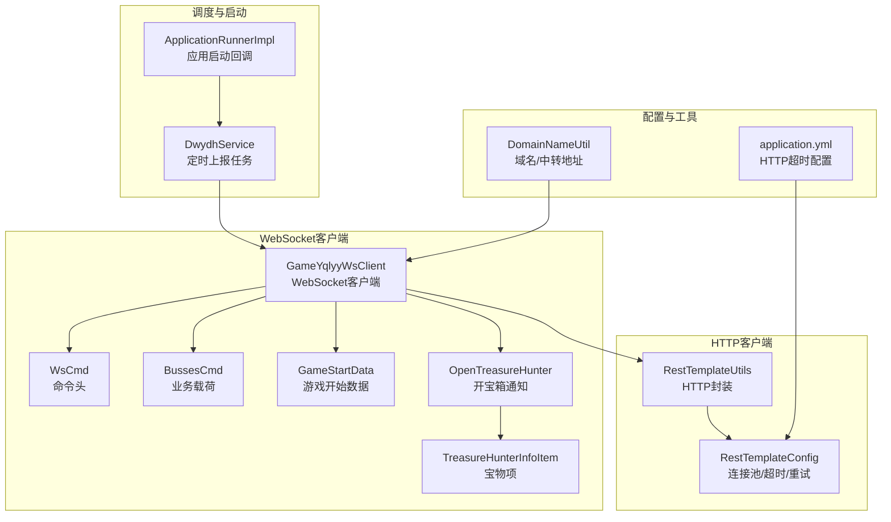
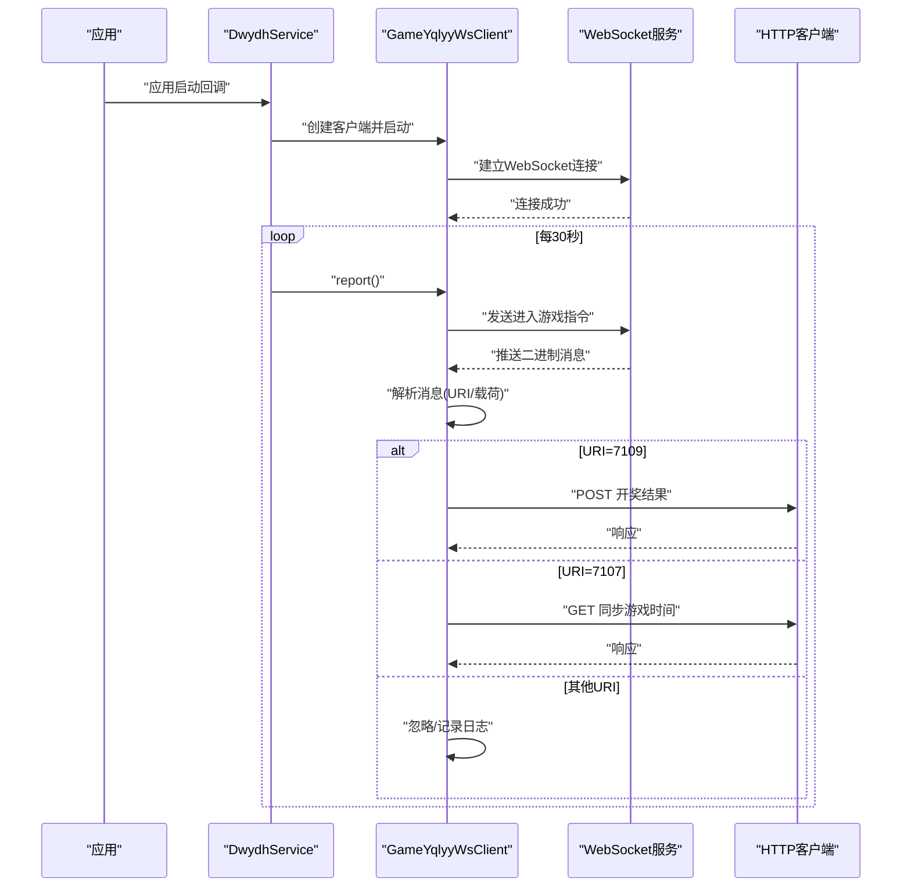
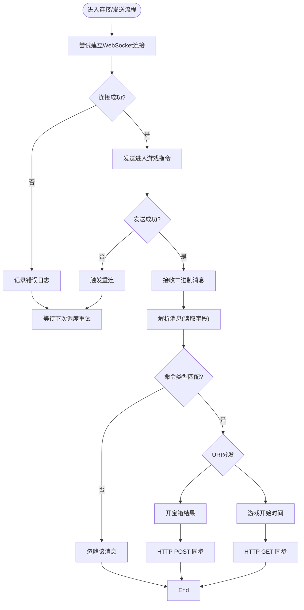
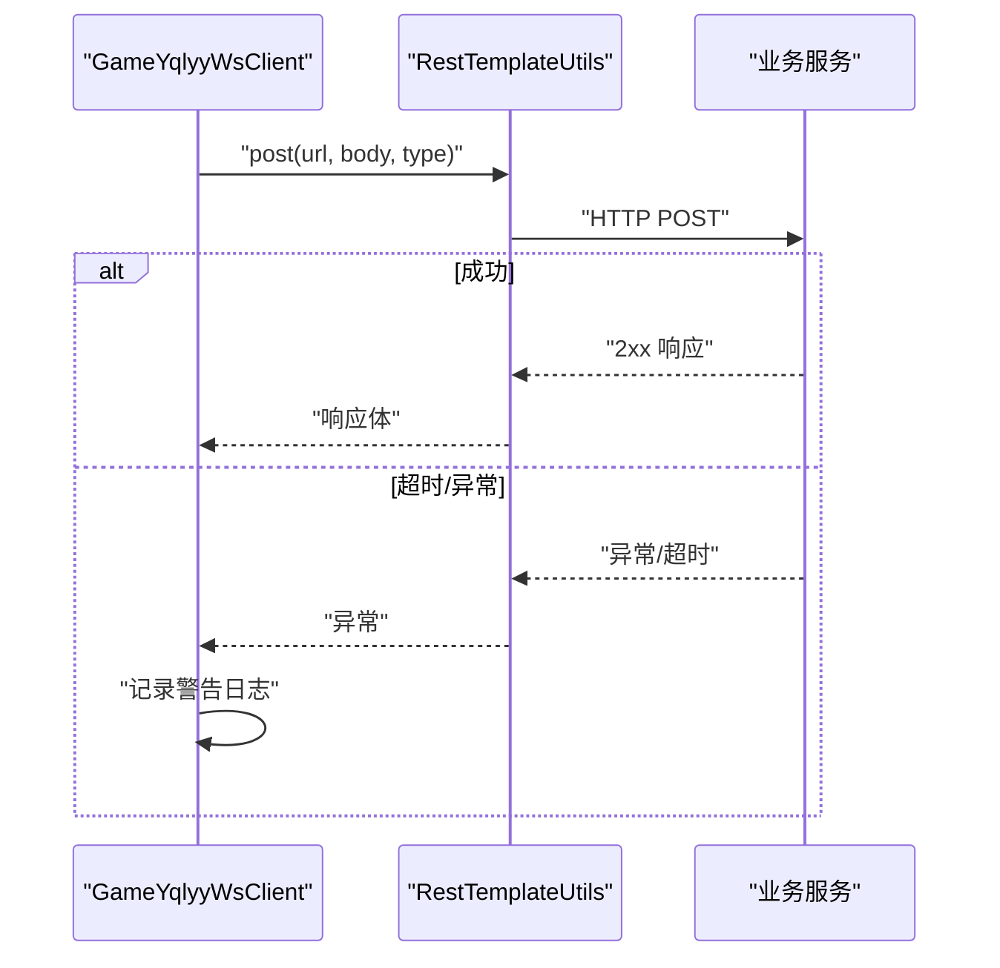
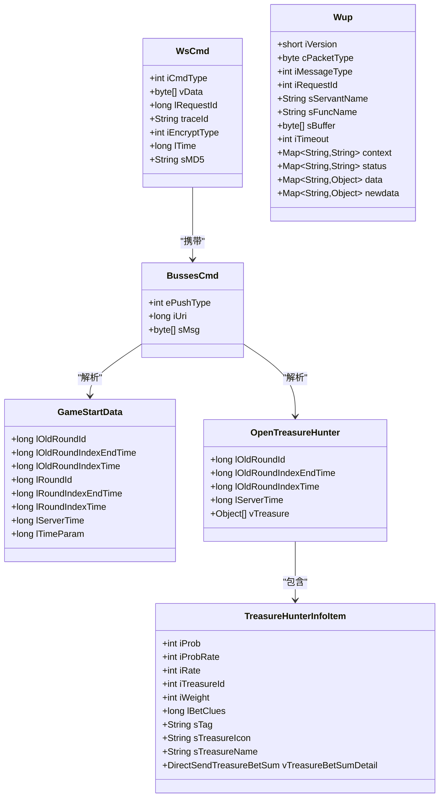
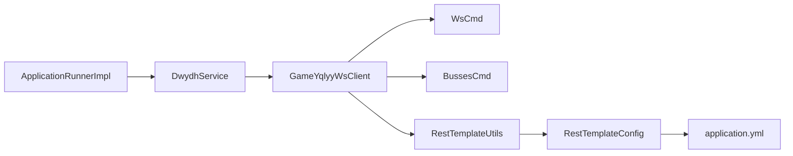

# 错误码定义

<cite>
**本文引用的文件列表**
- [GameYqlyyWsClient.java](file://src/main/java/com/yqlyy/GameYqlyyWsClient.java)
- [WsCmd.java](file://src/main/java/com/entity/WsCmd.java)
- [BussesCmd.java](file://src/main/java/com/entity/BussesCmd.java)
- [GameStartData.java](file://src/main/java/com/entity/GameStartData.java)
- [OpenTreasureHunter.java](file://src/main/java/com/entity/AccountedNotify/OpenTreasureHunter.java)
- [TreasureHunterInfoItem.java](file://src/main/java/com/entity/AccountedNotify/TreasureHunterInfoItem.java)
- [Wup.java](file://src/main/java/com/entity/Wup.java)
- [RestTemplateUtils.java](file://src/main/java/com/commom/RestTemplateUtils.java)
- [RestTemplateConfig.java](file://src/main/java/com/commom/RestTemplateConfig.java)
- [DomainNameUtil.java](file://src/main/java/com/utils/DomainNameUtil.java)
- [DwydhService.java](file://src/main/java/com/dwydh/DwydhService.java)
- [ApplicationRunnerImpl.java](file://src/main/java/com/listener/ApplicationRunnerImpl.java)
- [application.yml](file://src/main/resources/application.yml)
- [pom.xml](file://src/main/resources/pom.xml)
</cite>

## 目录
1. [简介](#简介)
2. [项目结构](#项目结构)
3. [核心组件](#核心组件)
4. [架构总览](#架构总览)
5. [详细组件分析](#详细组件分析)
6. [依赖关系分析](#依赖关系分析)
7. [性能与可靠性考虑](#性能与可靠性考虑)
8. [故障排查指南](#故障排查指南)
9. [结论](#结论)
10. [附录](#附录)

## 简介
本技术文档围绕项目中的错误码定义与错误处理机制展开，重点覆盖以下方面：
- WebSocket 连接错误码：涵盖连接失败、消息解析错误、协议不匹配等异常场景
- HTTP API 错误码分类与定义：基于项目中使用的 HTTP 客户端与服务交互，给出网络错误、业务逻辑错误、参数验证错误等分类
- 错误处理流程与恢复策略：自动重试、降级处理、故障转移
- 使用示例与调试方法：如何在实际开发中正确处理各类错误
- 错误监控与告警：如何通过错误码进行系统监控与问题定位
- 版本演进与兼容性：历史变化与迁移策略
- 最佳实践：常见错误的解决方案与建议

说明：当前仓库未提供统一的“错误码枚举/常量”定义文件，本文将结合代码中的日志记录、异常捕获与网络配置，系统化梳理错误场景与处理策略，并以“建议的错误码分类与命名规范”形式呈现，便于后续落地为统一的错误码体系。

## 项目结构
项目采用 Spring Boot 结构，主要模块如下：
- WebSocket 客户端：负责与远端 WebSocket 服务建立连接、接收二进制消息并解析
- 实体模型：封装 WebSocket 消息结构（命令头、业务载荷）以及业务数据结构
- HTTP 客户端：基于 RestTemplate 的 HTTP 访问封装，提供 GET/POST 接口
- 配置与工具：HTTP 连接池、超时、重试策略；域名与中转地址配置；应用启动入口

图表来源
- [GameYqlyyWsClient.java](file://src/main/java/com/yqlyy/GameYqlyyWsClient.java#L1-L328)
- [WsCmd.java](file://src/main/java/com/entity/WsCmd.java#L1-L69)
- [BussesCmd.java](file://src/main/java/com/entity/BussesCmd.java#L1-L10)
- [GameStartData.java](file://src/main/java/com/entity/GameStartData.java#L1-L79)
- [OpenTreasureHunter.java](file://src/main/java/com/entity/AccountedNotify/OpenTreasureHunter.java#L1-L83)
- [TreasureHunterInfoItem.java](file://src/main/java/com/entity/AccountedNotify/TreasureHunterInfoItem.java#L1-L124)
- [RestTemplateUtils.java](file://src/main/java/com/commom/RestTemplateUtils.java#L1-L31)
- [RestTemplateConfig.java](file://src/main/java/com/commom/RestTemplateConfig.java#L1-L131)
- [DomainNameUtil.java](file://src/main/java/com/utils/DomainNameUtil.java#L1-L16)
- [DwydhService.java](file://src/main/java/com/dwydh/DwydhService.java#L1-L39)
- [ApplicationRunnerImpl.java](file://src/main/java/com/listener/ApplicationRunnerImpl.java#L1-L33)
- [application.yml](file://src/main/resources/application.yml#L1-L31)

章节来源
- [GameYqlyyWsClient.java](file://src/main/java/com/yqlyy/GameYqlyyWsClient.java#L1-L328)
- [RestTemplateConfig.java](file://src/main/java/com/commom/RestTemplateConfig.java#L1-L131)
- [application.yml](file://src/main/resources/application.yml#L1-L31)

## 核心组件
- WebSocket 客户端：负责连接、心跳、消息解析与业务分发
- 实体模型：命令头与业务载荷的数据结构定义
- HTTP 客户端：封装 GET/POST 请求，统一异常处理
- 配置中心：HTTP 超时、连接池、重试策略
- 调度与启动：应用启动后初始化 WebSocket 客户端并周期性上报

章节来源
- [GameYqlyyWsClient.java](file://src/main/java/com/yqlyy/GameYqlyyWsClient.java#L1-L328)
- [WsCmd.java](file://src/main/java/com/entity/WsCmd.java#L1-L69)
- [BussesCmd.java](file://src/main/java/com/entity/BussesCmd.java#L1-L10)
- [RestTemplateUtils.java](file://src/main/java/com/commom/RestTemplateUtils.java#L1-L31)
- [RestTemplateConfig.java](file://src/main/java/com/commom/RestTemplateConfig.java#L1-L131)
- [DwydhService.java](file://src/main/java/com/dwydh/DwydhService.java#L1-L39)
- [ApplicationRunnerImpl.java](file://src/main/java/com/listener/ApplicationRunnerImpl.java#L1-L33)

## 架构总览
WebSocket 客户端在打开连接后，按固定周期发送进入游戏指令，接收远端推送的二进制消息，解析出业务 URI 与载荷，根据 URI 分发到不同的业务处理分支（如开宝箱、游戏开始时间同步等），并通过 HTTP 客户端向内部服务同步数据。

图表来源
- [DwydhService.java](file://src/main/java/com/dwydh/DwydhService.java#L21-L36)
- [GameYqlyyWsClient.java](file://src/main/java/com/yqlyy/GameYqlyyWsClient.java#L274-L290)
- [RestTemplateUtils.java](file://src/main/java/com/commom/RestTemplateUtils.java#L19-L29)

## 详细组件分析

### WebSocket 客户端错误场景与处理
- 连接失败
  - 触发条件：WebSocket 连接建立阶段抛出异常
  - 处理策略：记录错误日志并返回，等待上层调度再次尝试
  - 关键位置：连接方法内捕获异常并记录
- 消息解析错误
  - 触发条件：二进制消息解析失败（例如字段读取越界、类型不匹配）
  - 处理策略：记录警告日志，跳过该条消息，继续处理后续消息
  - 关键位置：消息解析分支与异常捕获
- 协议不匹配
  - 触发条件：命令类型非预期值（例如非目标指令类型）
  - 处理策略：直接返回，不进行业务处理
  - 关键位置：消息类型判断
- 发送失败与重连
  - 触发条件：发送二进制消息时 IO 异常
  - 处理策略：打印堆栈并触发重连逻辑
  - 关键位置：发送消息异常处理与重连调用

图表来源
- [GameYqlyyWsClient.java](file://src/main/java/com/yqlyy/GameYqlyyWsClient.java#L250-L272)
- [GameYqlyyWsClient.java](file://src/main/java/com/yqlyy/GameYqlyyWsClient.java#L274-L290)
- [GameYqlyyWsClient.java](file://src/main/java/com/yqlyy/GameYqlyyWsClient.java#L51-L219)

章节来源
- [GameYqlyyWsClient.java](file://src/main/java/com/yqlyy/GameYqlyyWsClient.java#L240-L248)
- [GameYqlyyWsClient.java](file://src/main/java/com/yqlyy/GameYqlyyWsClient.java#L250-L272)
- [GameYqlyyWsClient.java](file://src/main/java/com/yqlyy/GameYqlyyWsClient.java#L274-L290)
- [GameYqlyyWsClient.java](file://src/main/java/com/yqlyy/GameYqlyyWsClient.java#L51-L219)

### HTTP 客户端错误场景与处理
- 网络错误
  - 触发条件：HTTP 请求超时、连接不可用、DNS 解析失败
  - 处理策略：记录警告日志，继续处理其他目标地址；最终由上层重试机制兜底
  - 关键位置：HTTP 调用异常捕获
- 业务逻辑错误
  - 触发条件：目标服务返回非 2xx 状态码或业务错误响应
  - 处理策略：记录错误日志，不中断主流程，继续处理其他目标
  - 关键位置：HTTP 响应体处理与日志记录
- 参数验证错误
  - 触发条件：请求体格式不合法、缺少必要字段
  - 处理策略：在上游构建请求时校验，避免发送非法请求
  - 关键位置：请求体构造与校验

图表来源
- [RestTemplateUtils.java](file://src/main/java/com/commom/RestTemplateUtils.java#L19-L21)
- [GameYqlyyWsClient.java](file://src/main/java/com/yqlyy/GameYqlyyWsClient.java#L104-L114)
- [GameYqlyyWsClient.java](file://src/main/java/com/yqlyy/GameYqlyyWsClient.java#L136-L147)
- [GameYqlyyWsClient.java](file://src/main/java/com/yqlyy/GameYqlyyWsClient.java#L170-L181)
- [GameYqlyyWsClient.java](file://src/main/java/com/yqlyy/GameYqlyyWsClient.java#L202-L213)

章节来源
- [RestTemplateUtils.java](file://src/main/java/com/commom/RestTemplateUtils.java#L1-L31)
- [RestTemplateConfig.java](file://src/main/java/com/commom/RestTemplateConfig.java#L84-L108)
- [application.yml](file://src/main/resources/application.yml#L16-L31)
- [GameYqlyyWsClient.java](file://src/main/java/com/yqlyy/GameYqlyyWsClient.java#L104-L114)
- [GameYqlyyWsClient.java](file://src/main/java/com/yqlyy/GameYqlyyWsClient.java#L136-L147)
- [GameYqlyyWsClient.java](file://src/main/java/com/yqlyy/GameYqlyyWsClient.java#L170-L181)
- [GameYqlyyWsClient.java](file://src/main/java/com/yqlyy/GameYqlyyWsClient.java#L202-L213)

### 实体模型与消息结构
- 命令头（WsCmd）：包含命令类型、请求 ID、时间戳、加密类型、MD5 校验等
- 业务载荷（BussesCmd）：包含推送类型、URI、消息体
- 游戏开始数据（GameStartData）：包含轮次 ID、时间戳等
- 开宝箱通知（OpenTreasureHunter）：包含开箱结果列表
- 宝物项（TreasureHunterInfoItem）：包含宝物 ID、名称、权重、概率等
- WUP 协议（Wup）：通用协议头，用于某些场景下的请求封装

图表来源
- [WsCmd.java](file://src/main/java/com/entity/WsCmd.java#L1-L69)
- [BussesCmd.java](file://src/main/java/com/entity/BussesCmd.java#L1-L10)
- [GameStartData.java](file://src/main/java/com/entity/GameStartData.java#L1-L79)
- [OpenTreasureHunter.java](file://src/main/java/com/entity/AccountedNotify/OpenTreasureHunter.java#L1-L83)
- [TreasureHunterInfoItem.java](file://src/main/java/com/entity/AccountedNotify/TreasureHunterInfoItem.java#L1-L124)
- [Wup.java](file://src/main/java/com/entity/Wup.java#L1-L28)

章节来源
- [WsCmd.java](file://src/main/java/com/entity/WsCmd.java#L1-L69)
- [BussesCmd.java](file://src/main/java/com/entity/BussesCmd.java#L1-L10)
- [GameStartData.java](file://src/main/java/com/entity/GameStartData.java#L1-L79)
- [OpenTreasureHunter.java](file://src/main/java/com/entity/AccountedNotify/OpenTreasureHunter.java#L1-L83)
- [TreasureHunterInfoItem.java](file://src/main/java/com/entity/AccountedNotify/TreasureHunterInfoItem.java#L1-L124)
- [Wup.java](file://src/main/java/com/entity/Wup.java#L1-L28)

## 依赖关系分析
- WebSocket 客户端依赖实体模型进行消息解析
- HTTP 客户端通过 RestTemplate 封装访问内部服务
- 配置文件提供 HTTP 超时、连接池与重试策略
- 调度器负责周期性触发上报任务

图表来源
- [GameYqlyyWsClient.java](file://src/main/java/com/yqlyy/GameYqlyyWsClient.java#L1-L328)
- [RestTemplateUtils.java](file://src/main/java/com/commom/RestTemplateUtils.java#L1-L31)
- [RestTemplateConfig.java](file://src/main/java/com/commom/RestTemplateConfig.java#L1-L131)
- [application.yml](file://src/main/resources/application.yml#L1-L31)
- [DwydhService.java](file://src/main/java/com/dwydh/DwydhService.java#L1-L39)
- [ApplicationRunnerImpl.java](file://src/main/java/com/listener/ApplicationRunnerImpl.java#L1-L33)

章节来源
- [GameYqlyyWsClient.java](file://src/main/java/com/yqlyy/GameYqlyyWsClient.java#L1-L328)
- [RestTemplateUtils.java](file://src/main/java/com/commom/RestTemplateUtils.java#L1-L31)
- [RestTemplateConfig.java](file://src/main/java/com/commom/RestTemplateConfig.java#L1-L131)
- [application.yml](file://src/main/resources/application.yml#L1-L31)
- [DwydhService.java](file://src/main/java/com/dwydh/DwydhService.java#L1-L39)
- [ApplicationRunnerImpl.java](file://src/main/java/com/listener/ApplicationRunnerImpl.java#L1-L33)

## 性能与可靠性考虑
- 连接池与超时
  - HTTP 连接池最大连接数、每路由并发数、连接超时、请求超时、套接字超时、空闲校验等均在配置文件中定义
  - HTTP 客户端默认启用重试处理器，重试次数为 2 次
- WebSocket 超时与缓冲
  - WebSocket 容器设置文本/二进制消息缓冲大小、会话空闲超时、异步发送超时
- 日志与可观测性
  - 使用 SLF4J 记录连接、异常、业务处理等关键事件，便于问题定位与审计

章节来源
- [application.yml](file://src/main/resources/application.yml#L16-L31)
- [RestTemplateConfig.java](file://src/main/java/com/commom/RestTemplateConfig.java#L84-L108)
- [GameYqlyyWsClient.java](file://src/main/java/com/yqlyy/GameYqlyyWsClient.java#L254-L257)

## 故障排查指南
- WebSocket 连接失败
  - 现象：连接阶段抛出异常并记录错误日志
  - 排查：检查远端地址、网络连通性、证书与代理设置
  - 处理：等待上层调度重试或手动触发重连
- 发送失败
  - 现象：发送二进制消息时 IO 异常
  - 排查：检查本地网络、远端服务状态
  - 处理：触发重连并观察后续是否恢复
- HTTP 请求异常
  - 现象：HTTP 调用抛出 RestClientException 或其他异常
  - 排查：检查目标服务可用性、请求体合法性、超时配置
  - 处理：记录警告日志，继续处理其他目标地址
- 消息解析异常
  - 现象：解析字段时出现异常或字段缺失
  - 排查：确认远端协议版本、字段顺序与类型
  - 处理：记录日志并跳过该条消息，避免影响整体流程

章节来源
- [GameYqlyyWsClient.java](file://src/main/java/com/yqlyy/GameYqlyyWsClient.java#L240-L248)
- [GameYqlyyWsClient.java](file://src/main/java/com/yqlyy/GameYqlyyWsClient.java#L274-L290)
- [GameYqlyyWsClient.java](file://src/main/java/com/yqlyy/GameYqlyyWsClient.java#L104-L114)
- [GameYqlyyWsClient.java](file://src/main/java/com/yqlyy/GameYqlyyWsClient.java#L136-L147)
- [GameYqlyyWsClient.java](file://src/main/java/com/yqlyy/GameYqlyyWsClient.java#L170-L181)
- [GameYqlyyWsClient.java](file://src/main/java/com/yqlyy/GameYqlyyWsClient.java#L202-L213)

## 结论
本项目在 WebSocket 与 HTTP 两个层面均具备基础的错误处理能力：连接失败、发送失败、HTTP 异常、消息解析异常均有相应的日志记录与恢复策略。建议后续引入统一的错误码体系，明确错误分类与语义，配合监控与告警实现更完善的可观测性与自动化恢复。

## 附录

### 建议的错误码分类与定义（供落地参考）
说明：以下为建议的错误码分类与命名规范，便于在现有代码基础上扩展为统一的错误码体系。

- WebSocket 连接错误
  - 1001：连接建立失败（网络/证书/代理）
  - 1002：握手失败（协议/认证）
  - 1003：连接被远端关闭
  - 1004：连接超时
  - 1005：会话空闲超时
  - 1006：发送失败（IO 异常）

- WebSocket 消息错误
  - 2001：消息解析失败（字段缺失/类型不匹配）
  - 2002：命令类型不匹配（非目标指令）
  - 2003：业务 URI 不支持（未知 URI）

- HTTP 网络错误
  - 3001：连接超时
  - 3002：请求超时
  - 3003：DNS 解析失败
  - 3004：连接不可用
  - 3005：SSL 握手失败

- HTTP 业务错误
  - 4001：目标服务返回非 2xx
  - 4002：请求体格式不合法
  - 4003：缺少必要参数
  - 4004：业务逻辑校验失败

- HTTP 重试与降级
  - 5001：达到最大重试次数
  - 5002：降级处理（回退到本地缓存/默认值）

- 通用错误
  - 9999：未知错误

### 错误处理流程与恢复策略
- 自动重试：HTTP 层默认重试 2 次；WebSocket 发送失败触发重连
- 降级处理：当目标服务不可用时，记录日志并继续处理其他目标
- 故障转移：多目标地址轮询，单点失败不影响整体流程
- 监控与告警：基于日志级别与错误码进行分级告警

### 使用示例与调试方法
- WebSocket 调试：开启详细日志，观察连接、消息解析与业务分发过程
- HTTP 调试：检查请求体、响应状态码与异常堆栈，核对超时与重试配置
- 监控建议：为关键错误码设置阈值告警，结合日志聚合平台进行趋势分析

### 版本演进与兼容性
- 当前版本：基于 Spring Boot 2.2.13、HTTP 客户端 4.5.14、WebSocket 客户端 Tyrus 1.17
- 兼容性建议：升级时优先验证 WebSocket 与 HTTP 组件的兼容性，确保错误处理与日志策略一致

章节来源
- [pom.xml](file://src/main/resources/pom.xml#L1-L160)
- [RestTemplateConfig.java](file://src/main/java/com/commom/RestTemplateConfig.java#L106-L106)
- [application.yml](file://src/main/resources/application.yml#L16-L31)