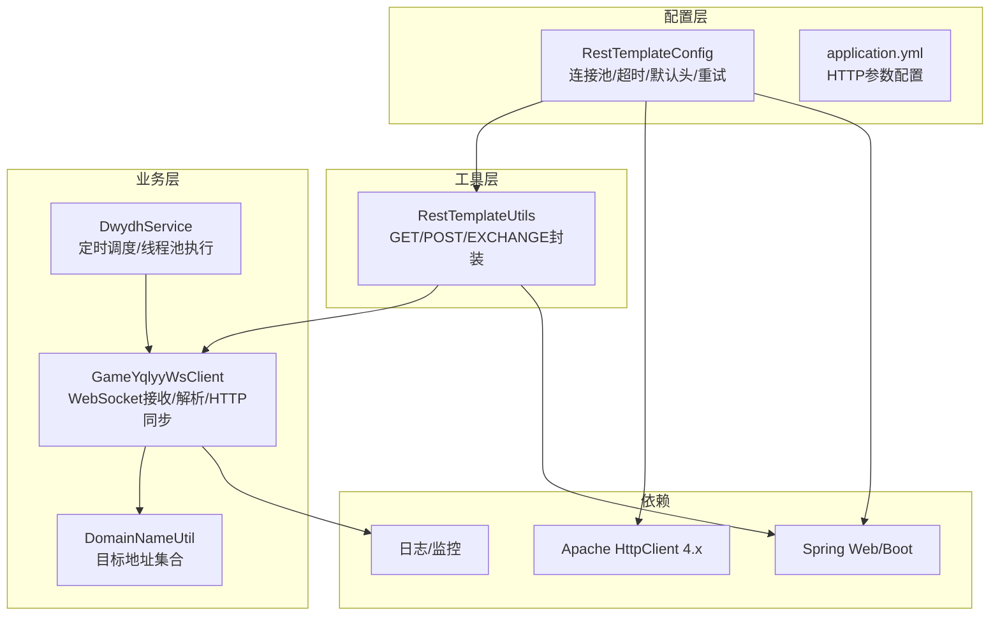
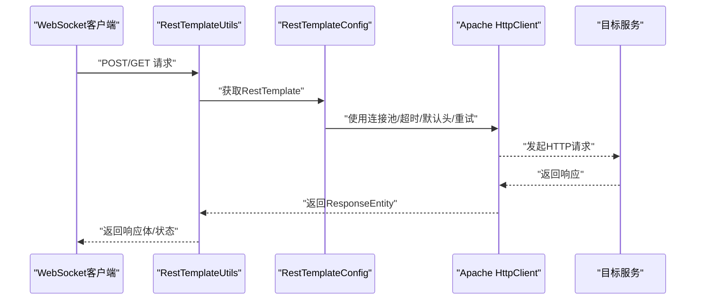
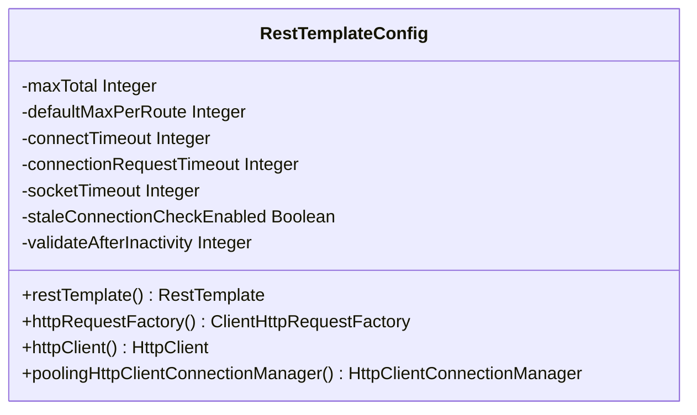
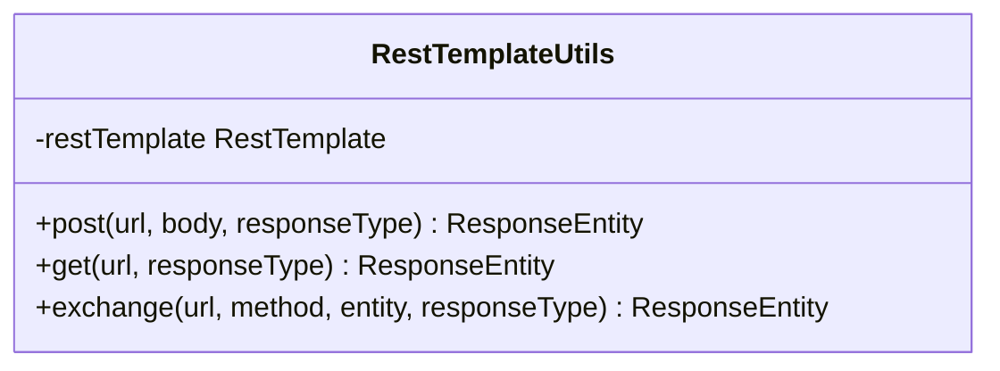
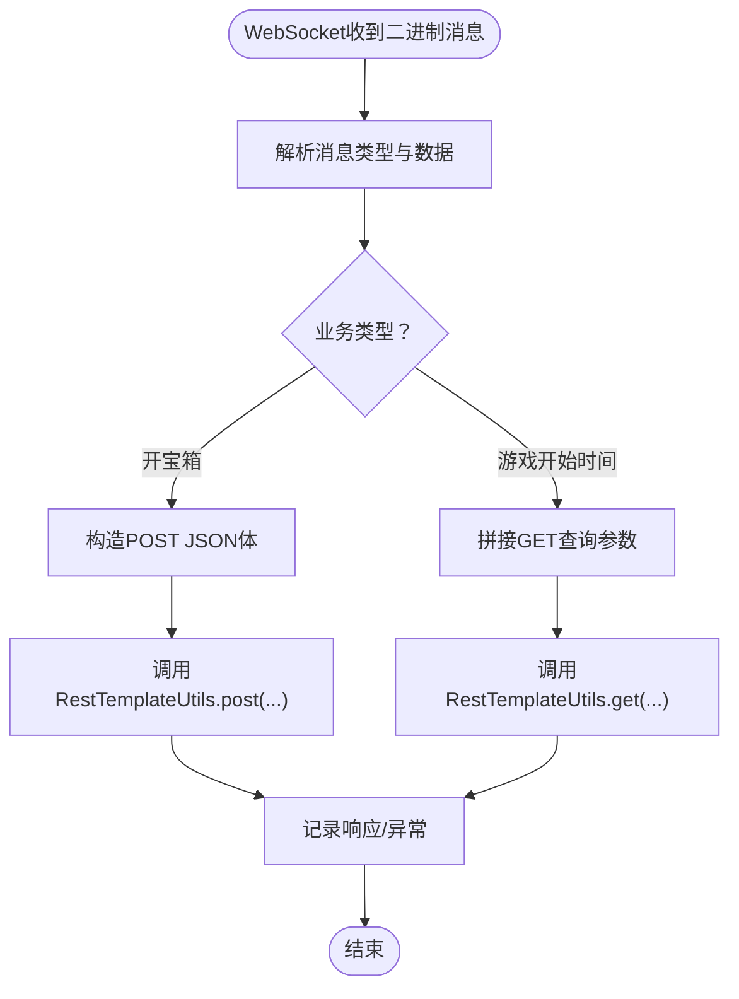
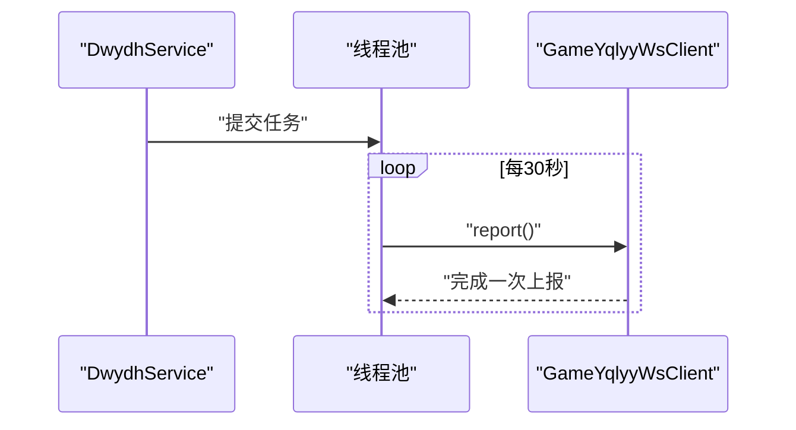
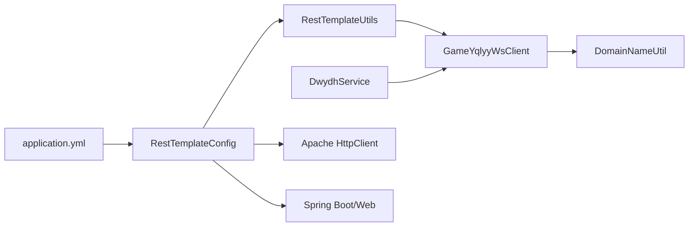

# HTTP通信模块

<cite>
**本文引用的文件列表**
- [RestTemplateConfig.java](file://src/main/java/com/commom/RestTemplateConfig.java)
- [RestTemplateUtils.java](file://src/main/java/com/commom/RestTemplateUtils.java)
- [DwydhService.java](file://src/main/java/com/dwydh/DwydhService.java)
- [GameYqlyyWsClient.java](file://src/main/java/com/yqlyy/GameYqlyyWsClient.java)
- [DomainNameUtil.java](file://src/main/java/com/utils/DomainNameUtil.java)
- [application.yml](file://src/main/resources/application.yml)
- [pom.xml](file://pom.xml)
</cite>

## 目录
1. [简介](#简介)
2. [项目结构](#项目结构)
3. [核心组件](#核心组件)
4. [架构总览](#架构总览)
5. [组件详解](#组件详解)
6. [依赖关系分析](#依赖关系分析)
7. [性能与优化](#性能与优化)
8. [故障排查指南](#故障排查指南)
9. [结论](#结论)
10. [附录](#附录)

## 简介
本文件面向HTTP通信模块，系统性梳理基于Spring RestTemplate与Apache HttpClient的HTTP客户端配置与使用，覆盖连接池、超时参数、重试机制、性能优化（连接复用、请求缓存、响应处理）、数据同步过程中的请求构建（URL组装、参数编码、头部设置）、错误处理与异常恢复、安全考虑（认证与加密）、性能监控与调优建议，并提供实际调用示例与调试方法，帮助开发者高效稳定地完成HTTP通信任务。

## 项目结构
该模块采用分层与职责分离的设计：
- 配置层：通过Spring配置类统一管理RestTemplate与底层HttpClient的连接池、超时、默认头等参数。
- 工具层：封装RestTemplate常用操作，屏蔽具体实现细节，便于业务侧直接调用。
- 业务层：WebSocket客户端负责接收实时数据，解析后触发HTTP同步请求。
- 配置层：通过外部配置文件集中管理HTTP参数，便于环境差异化部署。

图表来源
- [RestTemplateConfig.java](file://src/main/java/com/commom/RestTemplateConfig.java#L34-L131)
- [RestTemplateUtils.java](file://src/main/java/com/commom/RestTemplateUtils.java#L14-L30)
- [DwydhService.java](file://src/main/java/com/dwydh/DwydhService.java#L14-L38)
- [GameYqlyyWsClient.java](file://src/main/java/com/yqlyy/GameYqlyyWsClient.java#L30-L327)
- [DomainNameUtil.java](file://src/main/java/com/utils/DomainNameUtil.java#L3-L15)
- [application.yml](file://src/main/resources/application.yml#L16-L30)

章节来源
- [RestTemplateConfig.java](file://src/main/java/com/commom/RestTemplateConfig.java#L34-L131)
- [application.yml](file://src/main/resources/application.yml#L16-L30)

## 核心组件
- RestTemplateConfig：集中配置连接池、超时、默认请求头、重试策略与Keep-Alive策略，提供RestTemplate Bean。
- RestTemplateUtils：封装GET/POST/EXCHANGE，简化业务调用。
- GameYqlyyWsClient：WebSocket客户端，解析推送数据后构造HTTP请求进行数据同步。
- DwydhService：调度WebSocket客户端，周期性上报。
- DomainNameUtil：维护目标服务地址数组，用于批量同步。

章节来源
- [RestTemplateConfig.java](file://src/main/java/com/commom/RestTemplateConfig.java#L62-L107)
- [RestTemplateUtils.java](file://src/main/java/com/commom/RestTemplateUtils.java#L19-L29)
- [GameYqlyyWsClient.java](file://src/main/java/com/yqlyy/GameYqlyyWsClient.java#L103-L117)
- [DwydhService.java](file://src/main/java/com/dwydh/DwydhService.java#L21-L36)
- [DomainNameUtil.java](file://src/main/java/com/utils/DomainNameUtil.java#L4-L13)

## 架构总览
下图展示从WebSocket接收到数据到HTTP同步请求的完整链路，以及配置层如何为工具层提供稳定的HTTP基础设施。

图表来源
- [RestTemplateConfig.java](file://src/main/java/com/commom/RestTemplateConfig.java#L62-L107)
- [RestTemplateUtils.java](file://src/main/java/com/commom/RestTemplateUtils.java#L19-L29)
- [GameYqlyyWsClient.java](file://src/main/java/com/yqlyy/GameYqlyyWsClient.java#L103-L117)

## 组件详解

### RestTemplateConfig：连接池、超时与重试
- 连接池与Keep-Alive
  - 使用PoolingHttpClientConnectionManager，支持HTTP/HTTPS注册，最大连接数与每路由并发数可配，空闲校验与空闲失效阈值控制连接复用质量。
  - 设置DefaultConnectionKeepAliveStrategy，提升长连接复用率。
- 超时参数
  - RequestConfig设置连接超时、连接池获取超时、Socket超时；结合staleConnectionCheckEnabled启用连接有效性检查。
- 默认请求头
  - 设置User-Agent、Accept-Encoding、Accept-Language、Connection、Content-Type等，确保兼容性与压缩传输。
- 重试机制
  - 使用DefaultHttpRequestRetryHandler，允许在幂等场景自动重试，降低瞬时网络抖动影响。
- 请求工厂
  - HttpComponentsClientHttpRequestFactory将Apache HttpClient注入到Spring RestTemplate。

图表来源
- [RestTemplateConfig.java](file://src/main/java/com/commom/RestTemplateConfig.java#L34-L131)

章节来源
- [RestTemplateConfig.java](file://src/main/java/com/commom/RestTemplateConfig.java#L62-L107)
- [application.yml](file://src/main/resources/application.yml#L16-L30)

### RestTemplateUtils：HTTP调用封装
- 封装常用方法：GET、POST、EXCHANGE，统一返回ResponseEntity，便于上层读取状态码、头信息与响应体。
- 通过@Resource注入RestTemplate，避免重复创建，提高资源利用率。

图表来源
- [RestTemplateUtils.java](file://src/main/java/com/commom/RestTemplateUtils.java#L14-L30)

章节来源
- [RestTemplateUtils.java](file://src/main/java/com/commom/RestTemplateUtils.java#L19-L29)

### GameYqlyyWsClient：数据同步与HTTP请求构建
- 数据来源与解析
  - WebSocket二进制消息解析，根据iUri区分不同业务场景（如开宝箱、游戏开始时间同步）。
- URL组装与参数编码
  - 对于GET请求，直接拼接查询参数；对于POST请求，序列化JSON对象作为请求体。
- 头部设置
  - 默认由RestTemplateConfig统一设置Content-Type等；如需特殊头部可在业务侧扩展。
- 异常处理
  - 捕获RestClientException与通用异常，记录warn/error日志，保证流程不中断。
- 加密与安全
  - 提供AES/CBC加密封装方法，可用于敏感数据传输加密（当前未在HTTP同步中直接使用）。

图表来源
- [GameYqlyyWsClient.java](file://src/main/java/com/yqlyy/GameYqlyyWsClient.java#L76-L117)
- [GameYqlyyWsClient.java](file://src/main/java/com/yqlyy/GameYqlyyWsClient.java#L136-L147)
- [GameYqlyyWsClient.java](file://src/main/java/com/yqlyy/GameYqlyyWsClient.java#L170-L181)
- [GameYqlyyWsClient.java](file://src/main/java/com/yqlyy/GameYqlyyWsClient.java#L202-L213)

章节来源
- [GameYqlyyWsClient.java](file://src/main/java/com/yqlyy/GameYqlyyWsClient.java#L103-L117)
- [GameYqlyyWsClient.java](file://src/main/java/com/yqlyy/GameYqlyyWsClient.java#L136-L147)
- [GameYqlyyWsClient.java](file://src/main/java/com/yqlyy/GameYqlyyWsClient.java#L170-L181)
- [GameYqlyyWsClient.java](file://src/main/java/com/yqlyy/GameYqlyyWsClient.java#L202-L213)

### DwydhService：调度与线程池
- 使用ThreadPoolTaskExecutor异步执行WebSocket客户端的周期性上报。
- 通过while(true)+sleep实现固定周期的任务调度，注意异常中断与线程安全。

图表来源
- [DwydhService.java](file://src/main/java/com/dwydh/DwydhService.java#L21-L36)

章节来源
- [DwydhService.java](file://src/main/java/com/dwydh/DwydhService.java#L21-L36)

### DomainNameUtil：目标地址管理
- urls与transitUrls分别维护业务目标地址与中转服务地址，便于批量同步。
- 当前urls为空，需按部署环境填充真实地址。

章节来源
- [DomainNameUtil.java](file://src/main/java/com/utils/DomainNameUtil.java#L4-L13)

## 依赖关系分析
- RestTemplateConfig依赖Apache HttpClient与Spring Web，提供RestTemplate Bean。
- RestTemplateUtils依赖RestTemplate，封装HTTP调用。
- GameYqlyyWsClient依赖RestTemplateUtils与DomainNameUtil，负责业务数据同步。
- DwydhService依赖GameYqlyyWsClient与线程池，负责调度。
- application.yml集中管理HTTP参数，便于环境切换。

图表来源
- [RestTemplateConfig.java](file://src/main/java/com/commom/RestTemplateConfig.java#L62-L107)
- [RestTemplateUtils.java](file://src/main/java/com/commom/RestTemplateUtils.java#L19-L29)
- [GameYqlyyWsClient.java](file://src/main/java/com/yqlyy/GameYqlyyWsClient.java#L103-L117)
- [DwydhService.java](file://src/main/java/com/dwydh/DwydhService.java#L21-L36)
- [application.yml](file://src/main/resources/application.yml#L16-L30)

章节来源
- [pom.xml](file://pom.xml#L26-L110)

## 性能与优化
- 连接复用与池化
  - 合理设置maxTotal与defaultMaxPerRoute，避免连接不足或过度占用。
  - validateAfterInactivity与staleConnectionCheckEnabled有助于释放失效连接，提升稳定性。
- 超时参数
  - connectTimeout与socketTimeout应结合业务延迟与服务端能力权衡；connectionRequestTimeout限制等待连接的最长等待时间，防止阻塞队列堆积。
- 压缩与头部
  - Accept-Encoding启用gzip/deflate可减少带宽消耗，但需确认服务端支持。
- 请求缓存与幂等
  - 对于幂等GET/HEAD，可引入本地缓存策略（如基于URL+参数的LRU缓存），减少重复请求。
- 响应处理
  - 优先使用流式读取或分块处理，避免一次性加载大响应体导致内存压力。
- 并发与限流
  - 在业务侧对目标服务进行限流与熔断，避免对下游造成冲击。
- 日志与监控
  - 记录请求耗时、状态码分布、异常类型，结合指标系统进行趋势分析。

[本节为通用性能建议，无需特定文件引用]

## 故障排查指南
- 网络异常
  - RestClientException通常由网络波动、DNS解析失败、连接被拒绝等引起。建议开启staleConnectionCheckEnabled并适当缩短socketTimeout以快速失败。
- 服务不可用
  - 通过重试机制与降级策略（如本地缓存/默认值）提升可用性；对目标地址进行健康检查与灰度切换。
- 数据验证失败
  - 在解析WebSocket消息或构造HTTP请求体时，增加字段校验与异常捕获，记录原始数据以便定位问题。
- 超时与阻塞
  - 若出现大量连接池等待，检查connectionRequestTimeout与maxTotal；必要时拆分路由或增加并发上限。
- 日志与追踪
  - 使用统一的日志格式记录请求URL、方法、耗时、状态码与异常栈，便于问题回溯。

章节来源
- [GameYqlyyWsClient.java](file://src/main/java/com/yqlyy/GameYqlyyWsClient.java#L109-L113)
- [GameYqlyyWsClient.java](file://src/main/java/com/yqlyy/GameYqlyyWsClient.java#L142-L146)
- [GameYqlyyWsClient.java](file://src/main/java/com/yqlyy/GameYqlyyWsClient.java#L176-L180)
- [GameYqlyyWsClient.java](file://src/main/java/com/yqlyy/GameYqlyyWsClient.java#L208-L212)

## 结论
本模块通过配置层统一管理HTTP基础设施，工具层提供简洁的调用接口，业务层聚焦数据同步与调度。结合合理的连接池、超时与重试策略，以及完善的异常处理与日志监控，能够有效保障HTTP通信的稳定性与性能。建议在生产环境中进一步完善目标地址管理、限流熔断与安全策略，并持续优化参数以适配业务峰值。

[本节为总结性内容，无需特定文件引用]

## 附录

### HTTP参数配置清单（来自配置文件）
- 最大连接数：用于全局连接池上限
- 并发数：每路由最大并发
- 客户端创建连接超时时间：建立TCP连接的超时
- 从连接池获取连接的最长时间：等待连接池分配的超时
- 服务端响应超时时间：读取响应的超时
- 提交请求前测试连接是否可用：启用连接有效性检查
- 可用空闲连接过期时间：空闲连接复用前的校验间隔

章节来源
- [application.yml](file://src/main/resources/application.yml#L16-L30)

### 实际调用示例与调试方法
- GET请求示例
  - 场景：同步游戏开始时间
  - 步骤：遍历transitUrls，拼接查询参数，调用RestTemplateUtils.get(...)
  - 调试要点：记录每个URL的响应体与状态码，关注异常日志
- POST请求示例
  - 场景：同步开宝箱结果
  - 步骤：构造JSON对象，遍历urls，调用RestTemplateUtils.post(...)
  - 调试要点：核对Content-Type与请求体格式，检查服务端返回的业务状态
- 调试建议
  - 使用抓包工具（如Wireshark/Charles/Fiddler）观察请求与响应
  - 在RestTemplateConfig中临时调整日志级别，输出请求详情
  - 对关键路径增加埋点统计，记录耗时与成功率

章节来源
- [GameYqlyyWsClient.java](file://src/main/java/com/yqlyy/GameYqlyyWsClient.java#L103-L117)
- [GameYqlyyWsClient.java](file://src/main/java/com/yqlyy/GameYqlyyWsClient.java#L136-L147)
- [GameYqlyyWsClient.java](file://src/main/java/com/yqlyy/GameYqlyyWsClient.java#L170-L181)
- [GameYqlyyWsClient.java](file://src/main/java/com/yqlyy/GameYqlyyWsClient.java#L202-L213)

### 安全考虑
- 认证机制
  - 如需鉴权，可在RestTemplateConfig中添加Authorization头或自定义拦截器；或在业务侧通过签名/Token方式传递。
- 数据加密
  - 提供AES/CBC加密封装方法，适用于敏感字段传输；注意密钥管理与IV一致性。
- 传输安全
  - 优先使用HTTPS，确保证书校验与TLS版本合规；避免在日志中打印敏感信息。

章节来源
- [RestTemplateConfig.java](file://src/main/java/com/commom/RestTemplateConfig.java#L94-L106)
- [GameYqlyyWsClient.java](file://src/main/java/com/yqlyy/GameYqlyyWsClient.java#L310-L324)