# WebSocket通信模块

<cite>
**本文档引用的文件**
- [GameYqlyyWsClient.java](file://src/main/java/com/yqlyy/GameYqlyyWsClient.java)
- [application.yml](file://src/main/resources/application.yml)
- [WsCmd.java](file://src/main/java/com/entity/WsCmd.java)
- [BussesCmd.java](file://src/main/java/com/entity/BussesCmd.java)
- [GameStartData.java](file://src/main/java/com/entity/GameStartData.java)
- [OpenTreasureHunter.java](file://src/main/java/com/entity/AccountedNotify/OpenTreasureHunter.java)
- [TreasureHunterInfoItem.java](file://src/main/java/com/entity/AccountedNotify/TreasureHunterInfoItem.java)
- [DomainNameUtil.java](file://src/main/java/com/utils/DomainNameUtil.java)
- [RestTemplateUtils.java](file://src/main/java/com/commom/RestTemplateUtils.java)
</cite>

## 目录
1. [简介](#简介)
2. [项目结构](#项目结构)
3. [核心组件](#核心组件)
4. [架构概览](#架构概览)
5. [详细组件分析](#详细组件分析)
6. [依赖关系分析](#依赖关系分析)
7. [性能考虑](#性能考虑)
8. [故障排除指南](#故障排除指南)
9. [结论](#结论)

## 简介

WebSocket通信模块是一个基于Java WebSocket API构建的实时通信系统，专门用于与虎牙直播平台的"一千零一夜"和"宠物马拉松"游戏进行数据交互。该模块实现了WebSocket客户端功能，能够自动连接到指定的WebSocket服务器，接收游戏推送的消息，并将关键的游戏数据同步到内部服务系统。

该模块的核心功能包括：
- WebSocket连接建立和维护
- 实时消息接收和解析
- 游戏状态数据的提取和转发
- 异常处理和连接重试机制
- 心跳包管理和保活策略

## 项目结构

项目采用标准的Maven目录结构，主要分为以下几个部分：

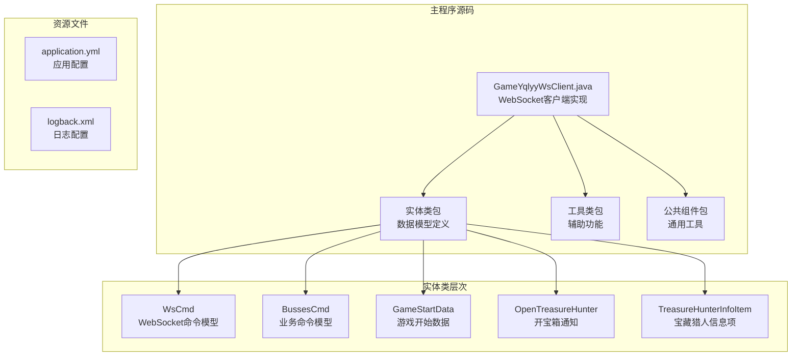

**图表来源**
- [GameYqlyyWsClient.java](file://src/main/java/com/yqlyy/GameYqlyyWsClient.java#L1-L328)
- [WsCmd.java](file://src/main/java/com/entity/WsCmd.java#L1-L69)

**章节来源**
- [GameYqlyyWsClient.java](file://src/main/java/com/yqlyy/GameYqlyyWsClient.java#L1-L30)
- [application.yml](file://src/main/resources/application.yml#L1-L31)

## 核心组件

### GameYqlyyWsClient类

GameYqlyyWsClient是整个WebSocket通信模块的核心类，实现了javax.websocket.ClientEndpoint注解，提供了完整的WebSocket客户端功能。

#### 主要特性

1. **连接管理**：负责WebSocket连接的建立、维护和断开
2. **消息处理**：处理二进制消息和Pong消息
3. **数据解析**：使用TARS协议解析游戏推送的数据
4. **业务集成**：将解析后的数据转发到内部服务系统
5. **异常处理**：提供完善的错误处理和重连机制

#### 关键属性

- `wsUrl`: WebSocket服务器地址
- `session`: 当前的WebSocket会话
- `messageId`: 消息ID计数器
- `restTemplateUtils`: HTTP客户端工具类

**章节来源**
- [GameYqlyyWsClient.java](file://src/main/java/com/yqlyy/GameYqlyyWsClient.java#L29-L44)

## 架构概览

WebSocket通信模块采用分层架构设计，各组件职责明确，耦合度低：

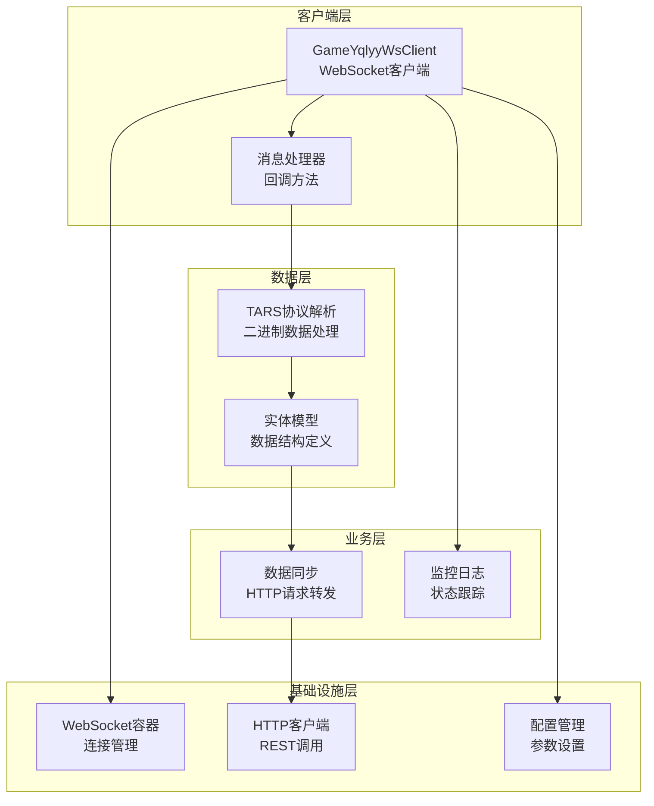

**图表来源**
- [GameYqlyyWsClient.java](file://src/main/java/com/yqlyy/GameYqlyyWsClient.java#L221-L248)
- [RestTemplateUtils.java](file://src/main/java/com/commom/RestTemplateUtils.java#L14-L30)

## 详细组件分析

### WebSocket客户端实现

#### 连接建立流程

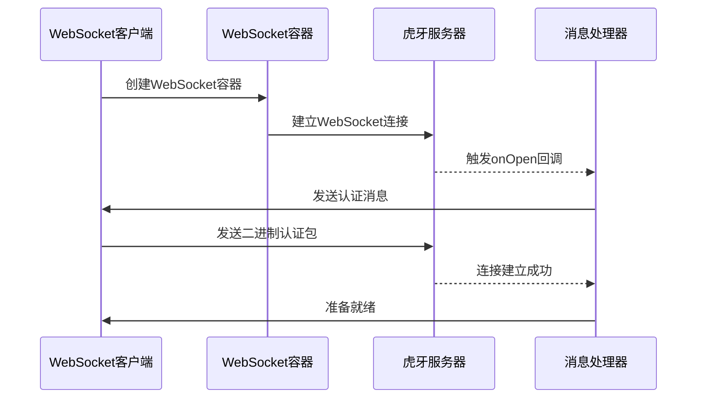

**图表来源**
- [GameYqlyyWsClient.java](file://src/main/java/com/yqlyy/GameYqlyyWsClient.java#L250-L272)
- [GameYqlyyWsClient.java](file://src/main/java/com/yqlyy/GameYqlyyWsClient.java#L221-L237)

#### 消息接收处理

客户端支持多种消息类型的处理：

1. **Pong消息处理**：用于心跳检测
2. **二进制消息处理**：主要的游戏数据推送
3. **连接状态监控**：连接建立和断开通知

**章节来源**
- [GameYqlyyWsClient.java](file://src/main/java/com/yqlyy/GameYqlyyWsClient.java#L46-L49)
- [GameYqlyyWsClient.java](file://src/main/java/com/yqlyy/GameYqlyyWsClient.java#L51-L219)

### 回调方法详解

#### onOpen回调方法

onOpen方法在WebSocket连接建立时被调用，主要负责：

1. **连接确认**：记录连接建立的日志信息
2. **认证消息发送**：发送预定义的认证二进制消息
3. **连接状态初始化**：设置会话状态为活跃

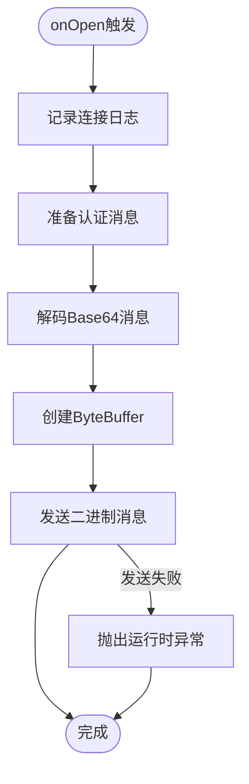

**图表来源**
- [GameYqlyyWsClient.java](file://src/main/java/com/yqlyy/GameYqlyyWsClient.java#L221-L237)

**章节来源**
- [GameYqlyyWsClient.java](file://src/main/java/com/yqlyy/GameYqlyyWsClient.java#L221-L237)

#### onMessage回调方法

onMessage方法处理接收到的二进制消息，包含复杂的业务逻辑：

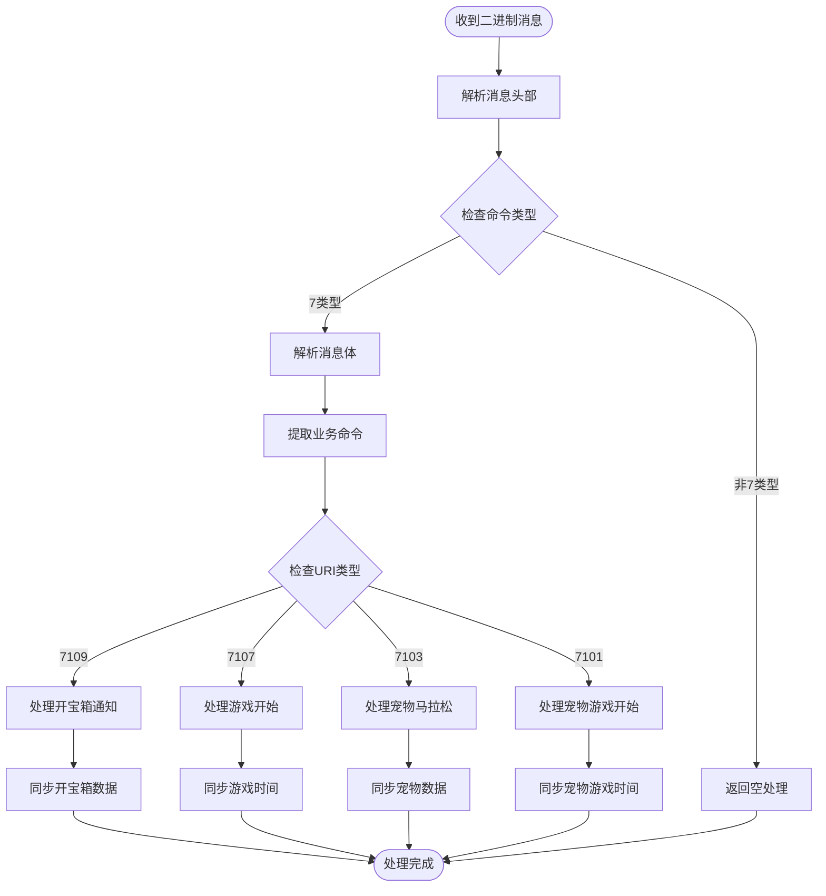

**图表来源**
- [GameYqlyyWsClient.java](file://src/main/java/com/yqlyy/GameYqlyyWsClient.java#L51-L219)

**章节来源**
- [GameYqlyyWsClient.java](file://src/main/java/com/yqlyy/GameYqlyyWsClient.java#L51-L219)

#### onError回调方法

onError方法处理WebSocket连接过程中的异常情况：

1. **异常记录**：记录详细的错误信息
2. **状态监控**：标记连接出现异常
3. **后续处理**：配合连接重试机制

**章节来源**
- [GameYqlyyWsClient.java](file://src/main/java/com/yqlyy/GameYqlyyWsClient.java#L245-L248)

#### onClose回调方法

onClose方法在WebSocket连接关闭时被调用：

1. **关闭确认**：记录连接关闭的日志
2. **状态清理**：标记连接状态为关闭
3. **重连准备**：为后续重连做准备

**章节来源**
- [GameYqlyyWsClient.java](file://src/main/java/com/yqlyy/GameYqlyyWsClient.java#L240-L243)

### 数据模型分析

#### WsCmd模型

WsCmd类定义了WebSocket命令的基本结构：

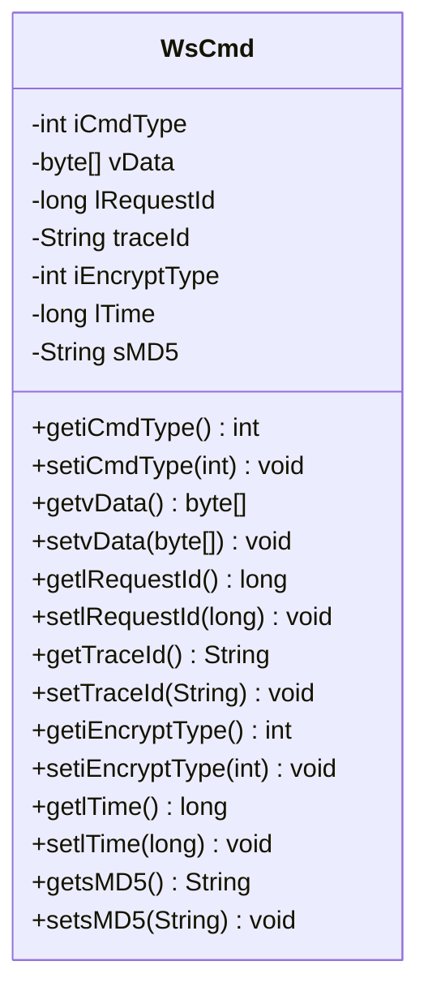

**图表来源**
- [WsCmd.java](file://src/main/java/com/entity/WsCmd.java#L3-L68)

**章节来源**
- [WsCmd.java](file://src/main/java/com/entity/WsCmd.java#L1-L69)

#### BussesCmd模型

BussesCmd类定义了业务命令的数据结构：

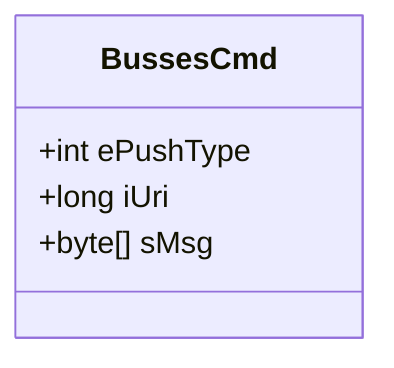

**图表来源**
- [BussesCmd.java](file://src/main/java/com/entity/BussesCmd.java#L3-L9)

**章节来源**
- [BussesCmd.java](file://src/main/java/com/entity/BussesCmd.java#L1-L10)

#### OpenTreasureHunter模型

OpenTreasureHunter类处理开宝箱通知的复杂数据结构：

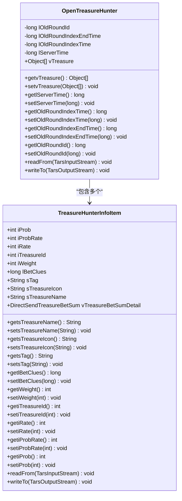

**图表来源**
- [OpenTreasureHunter.java](file://src/main/java/com/entity/AccountedNotify/OpenTreasureHunter.java#L10-L82)
- [TreasureHunterInfoItem.java](file://src/main/java/com/entity/AccountedNotify/TreasureHunterInfoItem.java#L8-L123)

**章节来源**
- [OpenTreasureHunter.java](file://src/main/java/com/entity/AccountedNotify/OpenTreasureHunter.java#L1-L83)
- [TreasureHunterInfoItem.java](file://src/main/java/com/entity/AccountedNotify/TreasureHunterInfoItem.java#L1-L124)

### 连接管理机制

#### 连接建立流程

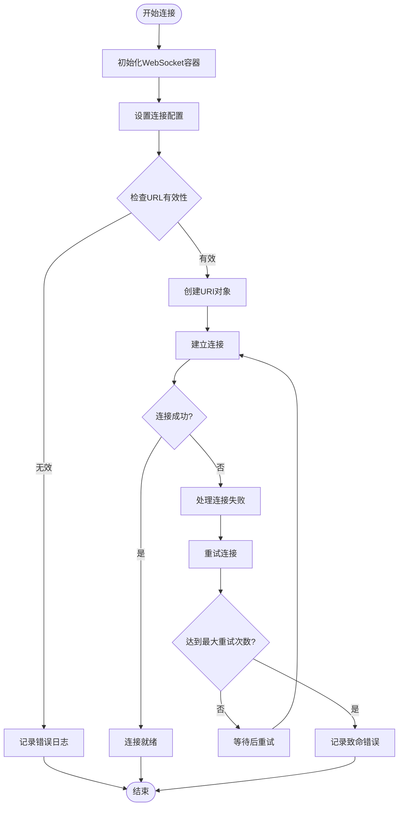

**图表来源**
- [GameYqlyyWsClient.java](file://src/main/java/com/yqlyy/GameYqlyyWsClient.java#L250-L272)

#### 连接维护策略

客户端实现了以下连接维护机制：

1. **超时配置**：设置默认的最大文本消息缓冲区大小为65536字节
2. **二进制缓冲区**：设置默认的最大二进制消息缓冲区大小为65536字节
3. **空闲超时**：设置默认的最大会话空闲超时时间为30000毫秒
4. **异步发送超时**：设置异步发送超时时间为20000毫秒

**章节来源**
- [GameYqlyyWsClient.java](file://src/main/java/com/yqlyy/GameYqlyyWsClient.java#L254-L257)

### 心跳机制实现

#### 心跳包处理

客户端通过PongMessage回调方法处理服务器的心跳包：

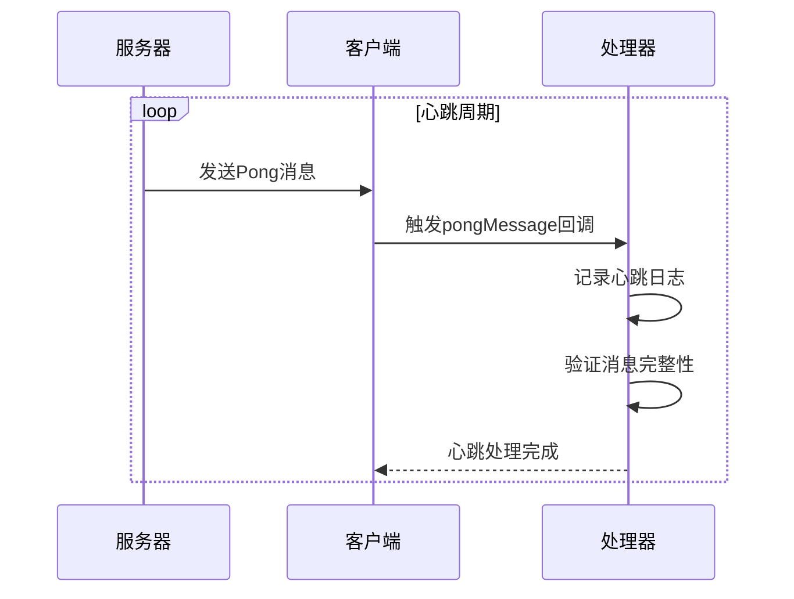

**图表来源**
- [GameYqlyyWsClient.java](file://src/main/java/com/yqlyy/GameYqlyyWsClient.java#L46-L49)

#### 心跳保活策略

虽然当前实现主要处理Pong消息，但可以通过以下方式增强心跳机制：

1. **主动Ping发送**：定期发送Ping消息保持连接活跃
2. **心跳超时检测**：检测心跳超时并触发重连
3. **动态心跳间隔**：根据网络状况调整心跳间隔

### 数据同步机制

#### HTTP请求转发

客户端将解析后的游戏数据通过HTTP请求转发到内部服务：

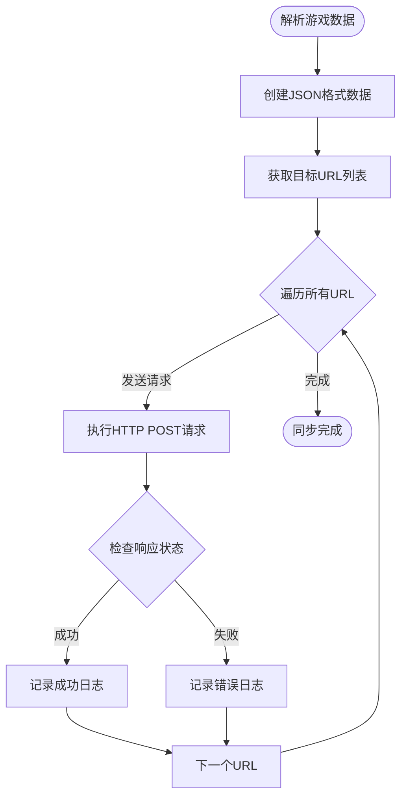

**图表来源**
- [GameYqlyyWsClient.java](file://src/main/java/com/yqlyy/GameYqlyyWsClient.java#L99-L116)

**章节来源**
- [GameYqlyyWsClient.java](file://src/main/java/com/yqlyy/GameYqlyyWsClient.java#L99-L116)

## 依赖关系分析

### 组件依赖图

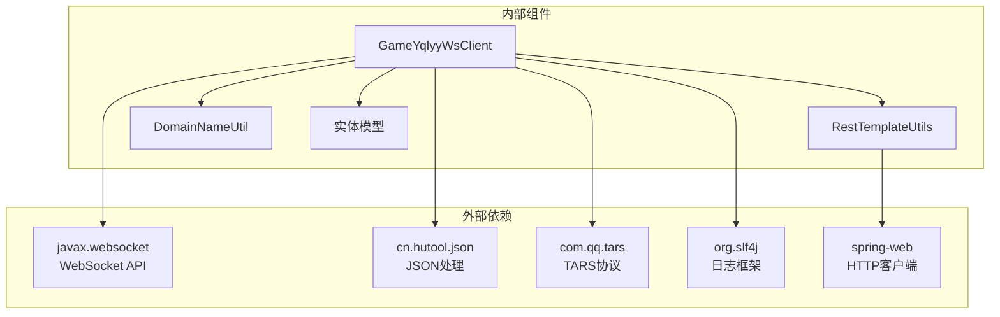

**图表来源**
- [GameYqlyyWsClient.java](file://src/main/java/com/yqlyy/GameYqlyyWsClient.java#L1-L28)
- [RestTemplateUtils.java](file://src/main/java/com/commom/RestTemplateUtils.java#L1-L31)

### 数据流分析

#### 消息处理数据流

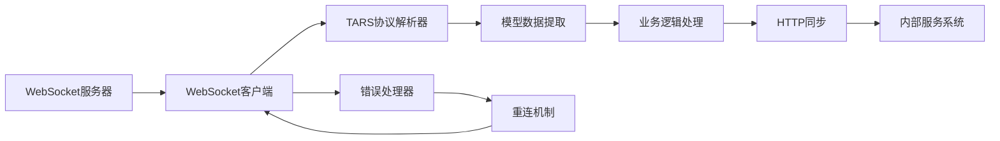

**图表来源**
- [GameYqlyyWsClient.java](file://src/main/java/com/yqlyy/GameYqlyyWsClient.java#L51-L219)

**章节来源**
- [GameYqlyyWsClient.java](file://src/main/java/com/yqlyy/GameYqlyyWsClient.java#L1-L328)

## 性能考虑

### 内存管理

1. **缓冲区大小优化**：合理设置WebSocket容器的缓冲区大小
2. **消息队列管理**：避免大量消息堆积导致内存溢出
3. **对象复用**：重用ByteBuffer等对象减少GC压力

### 连接性能

1. **连接池配置**：根据业务需求调整连接池大小
2. **超时设置**：合理配置各种超时参数
3. **并发控制**：限制同时处理的消息数量

### 网络优化

1. **压缩传输**：对于大数据量可以考虑启用压缩
2. **批量处理**：将多个小消息合并处理
3. **断线重连**：实现智能的重连策略

## 故障排除指南

### 常见问题及解决方案

#### 连接失败问题

**问题症状**：WebSocket连接无法建立或频繁断开

**可能原因**：
1. WebSocket服务器地址配置错误
2. 网络连接不稳定
3. 服务器端口被防火墙阻止

**解决步骤**：
1. 验证WebSocket URL的有效性
2. 检查网络连接状态
3. 确认服务器端口可达性

#### 消息解析错误

**问题症状**：二进制消息解析失败或数据不完整

**可能原因**：
1. TARS协议版本不匹配
2. 消息格式发生变化
3. 缓冲区大小不足

**解决步骤**：
1. 检查TARS协议版本兼容性
2. 更新消息解析逻辑
3. 调整缓冲区大小配置

#### HTTP同步失败

**问题症状**：游戏数据同步到内部服务失败

**可能原因**：
1. 目标服务地址配置错误
2. 网络连接超时
3. 服务端响应异常

**解决步骤**：
1. 验证目标URL配置正确性
2. 检查网络连接状态
3. 查看服务端日志信息

### 日志分析

#### 关键日志位置

1. **连接状态日志**：记录连接建立、断开和异常信息
2. **消息处理日志**：记录消息接收、解析和处理过程
3. **错误日志**：记录异常情况和错误堆栈信息

#### 调试建议

1. **启用详细日志**：在开发环境中启用DEBUG级别日志
2. **监控连接状态**：定期检查WebSocket连接状态
3. **验证数据完整性**：确保解析后的数据符合预期格式

**章节来源**
- [GameYqlyyWsClient.java](file://src/main/java/com/yqlyy/GameYqlyyWsClient.java#L245-L248)

## 结论

WebSocket通信模块是一个功能完整、结构清晰的实时通信系统。它成功实现了与虎牙直播平台的深度集成，能够稳定地处理各种游戏推送消息，并将关键数据同步到内部服务系统。

### 主要优势

1. **架构清晰**：采用分层设计，职责分离明确
2. **扩展性强**：支持多种消息类型和业务场景
3. **稳定性好**：完善的异常处理和重连机制
4. **性能优秀**：合理的资源配置和优化策略

### 改进建议

1. **增强心跳机制**：实现双向心跳保活
2. **优化错误处理**：增加更细粒度的错误分类
3. **添加监控指标**：集成性能监控和告警机制
4. **完善配置管理**：支持动态配置更新

该模块为类似实时通信场景提供了良好的参考实现，开发者可以根据具体需求进行定制和扩展。