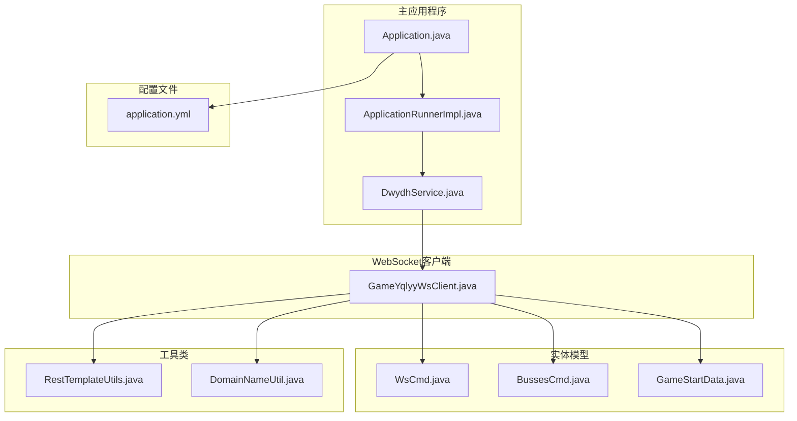
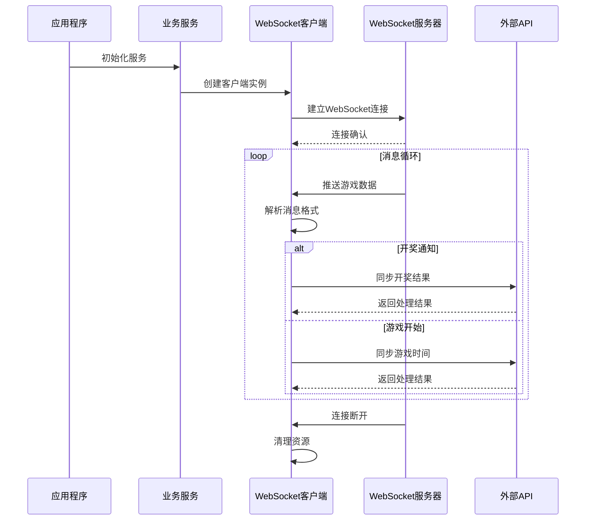
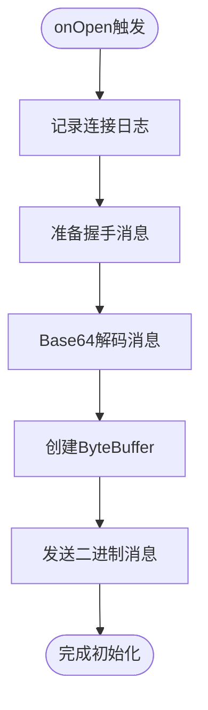
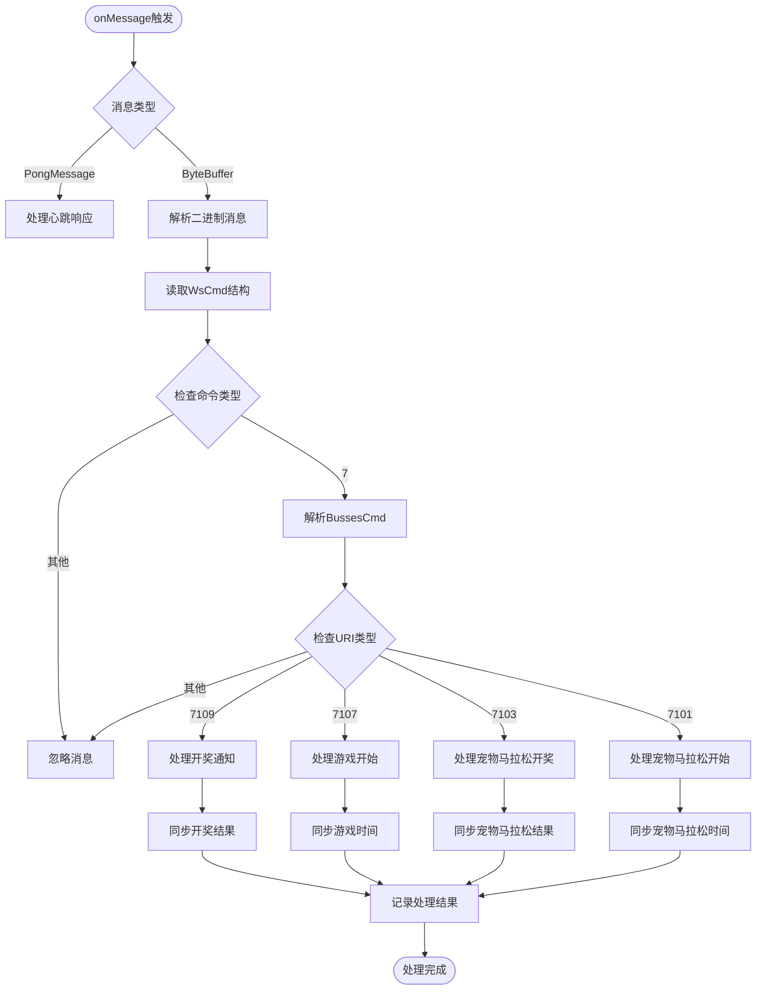
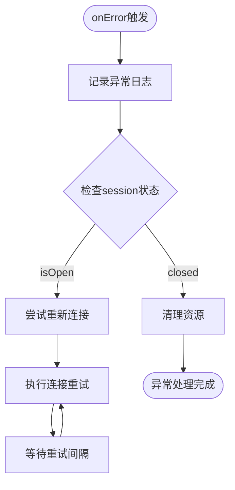
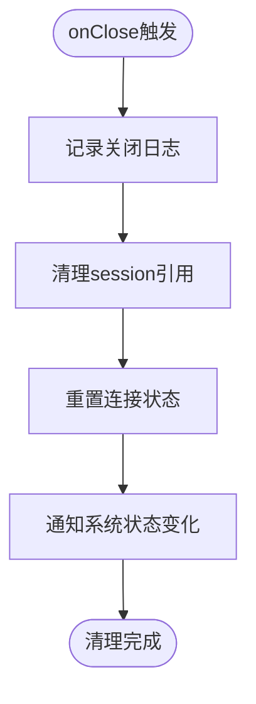
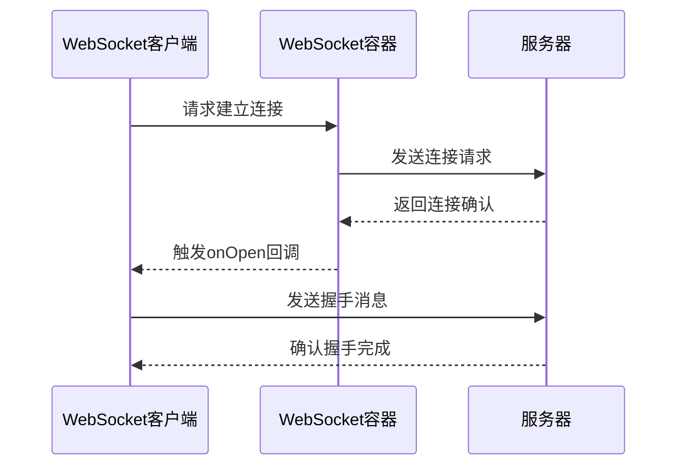
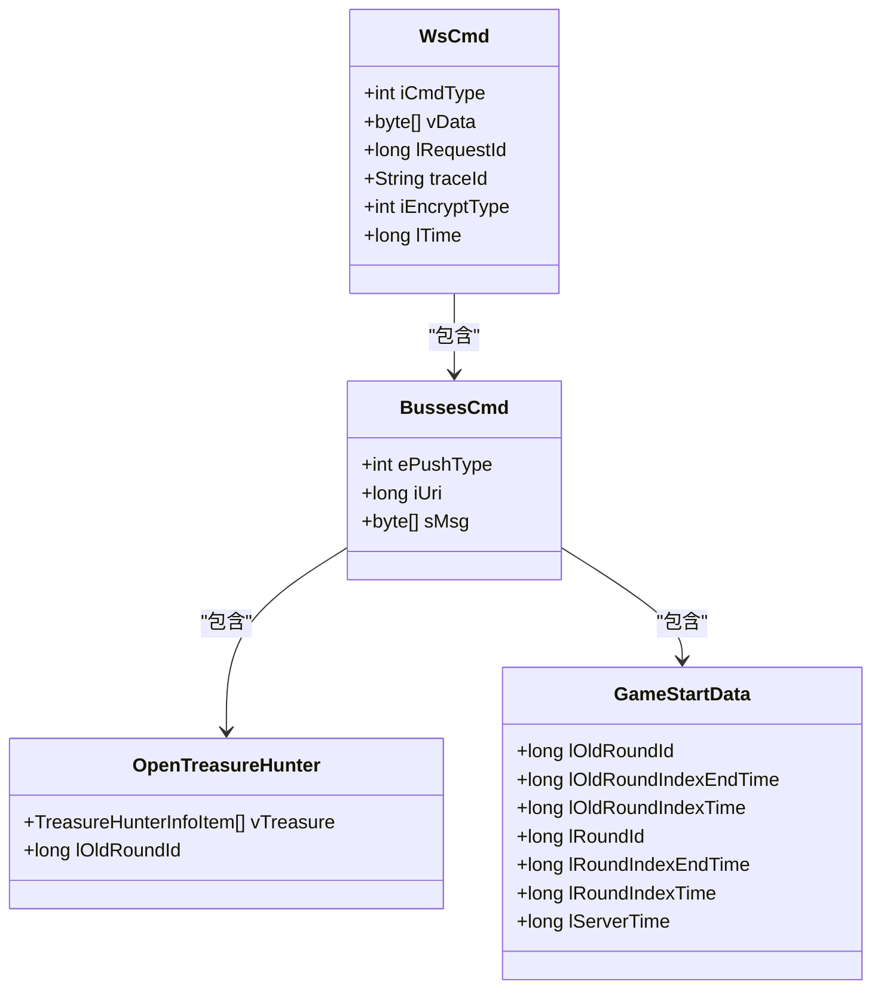
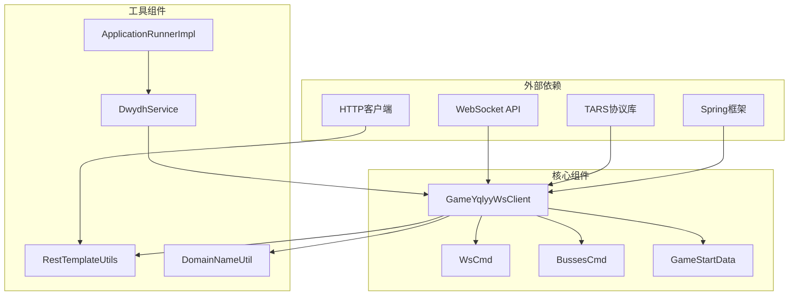

# 回调函数处理

<cite>
**本文档引用的文件**
- [GameYqlyyWsClient.java](file://src/main/java/com/yqlyy/GameYqlyyWsClient.java)
- [WsCmd.java](file://src/main/java/com/entity/WsCmd.java)
- [BussesCmd.java](file://src/main/java/com/entity/BussesCmd.java)
- [GameStartData.java](file://src/main/java/com/entity/GameStartData.java)
- [RestTemplateUtils.java](file://src/main/java/com/commom/RestTemplateUtils.java)
- [ApplicationRunnerImpl.java](file://src/main/java/com/listener/ApplicationRunnerImpl.java)
- [DwydhService.java](file://src/main/java/com/dwydh/DwydhService.java)
- [DomainNameUtil.java](file://src/main/java/com/utils/DomainNameUtil.java)
- [application.yml](file://src/main/resources/application.yml)
</cite>

## 目录
1. [简介](#简介)
2. [项目结构](#项目结构)
3. [核心组件](#核心组件)
4. [架构概览](#架构概览)
5. [详细组件分析](#详细组件分析)
6. [依赖关系分析](#依赖关系分析)
7. [性能考虑](#性能考虑)
8. [故障排除指南](#故障排除指南)
9. [结论](#结论)

## 简介

本文档深入分析了基于Java WebSocket API的回调函数处理机制，重点解释了WebSocket生命周期回调方法的实现和用途。该系统实现了与虎牙直播平台的WebSocket连接，用于实时接收游戏数据并进行相应的业务处理。

系统采用标准的JSR-356 WebSocket API注解驱动方式，通过`@ClientEndpoint`注解定义客户端端点，实现了完整的WebSocket回调处理流程，包括连接建立、消息接收、异常处理和连接关闭等关键环节。

## 项目结构

该项目采用标准的Spring Boot项目结构，主要包含以下模块：

**图表来源**
- [GameYqlyyWsClient.java](file://src/main/java/com/yqlyy/GameYqlyyWsClient.java#L1-L328)
- [ApplicationRunnerImpl.java](file://src/main/java/com/listener/ApplicationRunnerImpl.java#L1-L34)
- [DwydhService.java](file://src/main/java/com/dwydh/DwydhService.java#L1-L38)

**章节来源**
- [GameYqlyyWsClient.java](file://src/main/java/com/yqlyy/GameYqlyyWsClient.java#L1-L328)
- [application.yml](file://src/main/resources/application.yml#L1-L31)

## 核心组件

### WebSocket客户端核心类

`GameYqlyyWsClient`是整个WebSocket系统的中心组件，负责管理WebSocket连接和处理所有回调事件。该类实现了完整的WebSocket生命周期管理，包括连接建立、消息处理、异常捕获和连接清理。

### 实体模型设计

系统使用专门的实体类来封装WebSocket消息的数据结构：

- **WsCmd**: WebSocket命令消息结构，包含命令类型、数据载荷等字段
- **BussesCmd**: 业务命令结构，包含推送类型、URI标识和消息内容
- **GameStartData**: 游戏开始数据结构，包含轮次信息和时间参数

### 工具类支持

- **RestTemplateUtils**: 封装HTTP客户端操作，用于向业务系统同步数据
- **DomainNameUtil**: 配置目标URL列表，支持多实例部署
- **ApplicationRunnerImpl**: 应用启动时的初始化入口
- **DwydhService**: 具体的业务服务实现，协调WebSocket客户端工作

**章节来源**
- [GameYqlyyWsClient.java](file://src/main/java/com/yqlyy/GameYqlyyWsClient.java#L29-L44)
- [WsCmd.java](file://src/main/java/com/entity/WsCmd.java#L1-L68)
- [BussesCmd.java](file://src/main/java/com/entity/BussesCmd.java#L1-L10)
- [GameStartData.java](file://src/main/java/com/entity/GameStartData.java#L1-L79)

## 架构概览

系统采用分层架构设计，实现了清晰的关注点分离：

**图表来源**
- [DwydhService.java](file://src/main/java/com/dwydh/DwydhService.java#L21-L34)
- [GameYqlyyWsClient.java](file://src/main/java/com/yqlyy/GameYqlyyWsClient.java#L250-L272)
- [GameYqlyyWsClient.java](file://src/main/java/com/yqlyy/GameYqlyyWsClient.java#L46-L219)

## 详细组件分析

### WebSocket回调方法详解

#### onOpen回调方法

`onOpen`方法在WebSocket连接成功建立时被调用，是整个连接生命周期的起点。

**触发条件**：
- WebSocket容器成功建立与服务器的连接
- 连接状态变为OPEN

**执行时机**：
- 连接建立后立即触发
- 在其他任何消息处理之前执行

**处理策略**：

**图表来源**
- [GameYqlyyWsClient.java](file://src/main/java/com/yqlyy/GameYqlyyWsClient.java#L221-L237)

**处理逻辑**：
1. 记录连接成功的日志信息
2. 准备预定义的握手消息（Base64编码）
3. 解码消息并转换为ByteBuffer
4. 通过session发送二进制消息完成握手

**最佳实践**：
- 在onOpen中只进行必要的初始化操作
- 避免在此阶段进行耗时操作
- 确保异常处理机制完善

#### onMessage回调方法

`onMessage`方法处理来自服务器的所有消息，是系统的核心数据处理入口。

**触发条件**：
- 收到服务器推送的任何消息
- 包括二进制消息和Ping/Pong心跳消息

**执行时机**：
- 消息到达时立即处理
- 按消息到达顺序依次处理

**处理策略**：

**图表来源**
- [GameYqlyyWsClient.java](file://src/main/java/com/yqlyy/GameYqlyyWsClient.java#L46-L219)

**消息处理流程**：

1. **PongMessage处理**：记录心跳响应日志
2. **ByteBuffer处理**：解析复杂的二进制协议
3. **协议解析**：使用TARS序列化协议解析嵌套消息
4. **业务处理**：根据URI类型执行不同的业务逻辑
5. **数据同步**：将结果同步到业务系统

**章节来源**
- [GameYqlyyWsClient.java](file://src/main/java/com/yqlyy/GameYqlyyWsClient.java#L46-L219)

#### onError回调方法

`onError`方法在WebSocket连接发生异常时被调用，负责异常捕获和错误处理。

**触发条件**：
- 连接过程中发生任何异常
- 消息传输失败
- 网络连接中断

**执行时机**：
- 异常发生时立即触发
- 可能被多次调用

**处理策略**：

**图表来源**
- [GameYqlyyWsClient.java](file://src/main/java/com/yqlyy/GameYqlyyWsClient.java#L245-L248)

**处理逻辑**：
1. 记录详细的异常信息
2. 检查当前连接状态
3. 执行自动重连机制
4. 确保资源得到适当清理

**最佳实践**：
- 记录完整的异常堆栈信息
- 实现指数退避重连策略
- 避免无限重连导致资源耗尽

#### onClose回调方法

`onClose`方法在WebSocket连接正常关闭时被调用，负责资源清理和状态维护。

**触发条件**：
- 连接被服务器或客户端主动关闭
- 连接超时或网络中断

**执行时机**：
- 连接关闭时触发
- 通常在onError之后调用

**处理策略**：

**图表来源**
- [GameYqlyyWsClient.java](file://src/main/java/com/yqlyy/GameYqlyyWsClient.java#L240-L243)

**处理逻辑**：
1. 记录连接关闭的原因和状态
2. 清理session引用避免内存泄漏
3. 重置内部状态变量
4. 触发必要的系统通知

**最佳实践**：
- 确保所有资源得到正确释放
- 记录详细的关闭原因
- 避免在关闭回调中执行阻塞操作

### 连接管理机制

#### 连接建立流程

**图表来源**
- [GameYqlyyWsClient.java](file://src/main/java/com/yqlyy/GameYqlyyWsClient.java#L250-L272)
- [GameYqlyyWsClient.java](file://src/main/java/com/yqlyy/GameYqlyyWsClient.java#L221-L237)

#### 自动重连机制

系统实现了智能的自动重连策略：

1. **状态检查**：连接前检查session状态
2. **异常处理**：在消息发送失败时触发重连
3. **指数退避**：重连间隔按指数增长
4. **最大重试**：限制最大重连次数

**章节来源**
- [GameYqlyyWsClient.java](file://src/main/java/com/yqlyy/GameYqlyyWsClient.java#L250-L290)

### 数据处理流程

#### 消息解析架构

系统采用分层的消息解析架构：

**图表来源**
- [WsCmd.java](file://src/main/java/com/entity/WsCmd.java#L1-L68)
- [BussesCmd.java](file://src/main/java/com/entity/BussesCmd.java#L1-L10)
- [GameStartData.java](file://src/main/java/com/entity/GameStartData.java#L1-L79)

#### 业务数据同步

系统实现了多种业务场景的数据同步：

1. **开奖结果同步**：处理7109 URI类型的消息
2. **游戏时间同步**：处理7107 URI类型的消息  
3. **宠物马拉松数据**：处理7103和7101 URI类型的特殊场景

**章节来源**
- [GameYqlyyWsClient.java](file://src/main/java/com/yqlyy/GameYqlyyWsClient.java#L76-L119)
- [GameYqlyyWsClient.java](file://src/main/java/com/yqlyy/GameYqlyyWsClient.java#L120-L148)
- [GameYqlyyWsClient.java](file://src/main/java/com/yqlyy/GameYqlyyWsClient.java#L150-L218)

## 依赖关系分析

### 组件依赖图

**图表来源**
- [GameYqlyyWsClient.java](file://src/main/java/com/yqlyy/GameYqlyyWsClient.java#L1-L328)
- [DwydhService.java](file://src/main/java/com/dwydh/DwydhService.java#L1-L38)
- [ApplicationRunnerImpl.java](file://src/main/java/com/listener/ApplicationRunnerImpl.java#L1-L34)

### 关键依赖关系

1. **WebSocket API依赖**：使用JSR-356标准API
2. **TARS协议依赖**：处理二进制序列化协议
3. **Spring框架集成**：利用Spring的依赖注入和生命周期管理
4. **HTTP客户端依赖**：通过RestTemplate进行HTTP通信

**章节来源**
- [GameYqlyyWsClient.java](file://src/main/java/com/yqlyy/GameYqlyyWsClient.java#L1-L328)
- [RestTemplateUtils.java](file://src/main/java/com/commom/RestTemplateUtils.java#L1-L31)

## 性能考虑

### 内存管理

系统在内存管理方面采用了多项优化措施：

1. **ByteBuffer复用**：使用ByteBuffer进行高效的二进制数据处理
2. **对象池化**：避免频繁创建和销毁对象
3. **及时清理**：在onClose中确保资源得到及时释放

### 网络性能

1. **连接池配置**：合理设置WebSocket容器的缓冲区大小
2. **异步发送**：启用异步发送模式提高响应速度
3. **超时控制**：设置合理的连接超时和发送超时

### 并发处理

1. **线程安全**：使用synchronized关键字确保连接状态的线程安全
2. **任务调度**：通过Spring的线程池管理后台任务
3. **异常隔离**：确保异常不会影响其他连接的正常运行

**章节来源**
- [GameYqlyyWsClient.java](file://src/main/java/com/yqlyy/GameYqlyyWsClient.java#L250-L272)
- [DwydhService.java](file://src/main/java/com/dwydh/DwydhService.java#L17-L17)

## 故障排除指南

### 常见问题及解决方案

#### 连接失败问题

**症状**：WebSocket连接无法建立
**可能原因**：
- 网络连接问题
- 服务器地址配置错误
- 防火墙阻止连接

**解决步骤**：
1. 检查WebSocket URL配置
2. 验证网络连通性
3. 查看服务器日志
4. 测试代理设置

#### 消息解析失败

**症状**：二进制消息解析异常
**可能原因**：
- 协议版本不匹配
- 消息格式损坏
- 编码问题

**解决步骤**：
1. 验证TARS协议版本
2. 检查消息完整性
3. 确认字符编码设置
4. 对比协议规范文档

#### 数据同步异常

**症状**：业务数据同步失败
**可能原因**：
- 目标服务器不可达
- HTTP请求超时
- 认证信息错误

**解决步骤**：
1. 检查目标URL配置
2. 验证网络连接
3. 查看HTTP响应状态
4. 确认认证凭据

### 调试技巧

1. **日志级别调整**：将日志级别设置为DEBUG以获取详细信息
2. **消息追踪**：记录所有进出站消息的内容和时间戳
3. **性能监控**：监控连接状态和消息处理延迟
4. **异常分析**：定期分析异常日志找出潜在问题

### 监控指标

建议监控以下关键指标：
- 连接成功率和失败率
- 消息处理延迟
- 内存使用情况
- 网络带宽使用
- 业务数据同步成功率

**章节来源**
- [GameYqlyyWsClient.java](file://src/main/java/com/yqlyy/GameYqlyyWsClient.java#L245-L248)
- [RestTemplateUtils.java](file://src/main/java/com/commom/RestTemplateUtils.java#L19-L29)

## 结论

本WebSocket回调函数处理系统实现了完整的实时数据处理能力，具有以下特点：

1. **完整的生命周期管理**：实现了从连接建立到资源清理的完整流程
2. **健壮的异常处理**：提供了完善的异常捕获和恢复机制
3. **高效的消息处理**：采用分层解析架构处理复杂的二进制协议
4. **灵活的业务扩展**：通过URI类型区分不同业务场景，便于功能扩展

系统在实际应用中展现了良好的稳定性，能够有效处理高并发的WebSocket连接和消息处理需求。通过合理的性能优化和监控机制，可以进一步提升系统的可靠性和可维护性。

对于开发者而言，该系统提供了清晰的回调函数处理模式，可以作为实现类似WebSocket客户端的参考模板。同时，系统的模块化设计也为功能扩展和定制提供了便利。