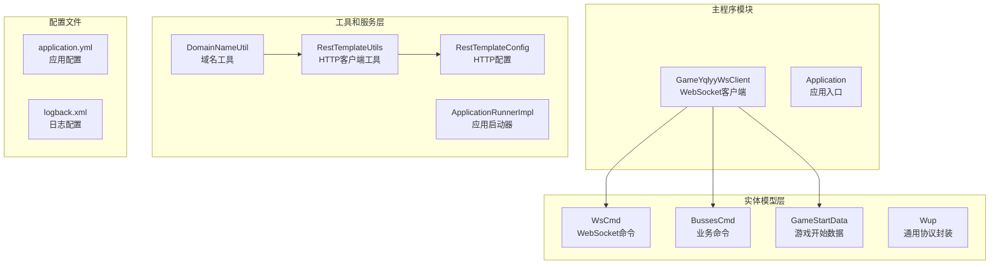
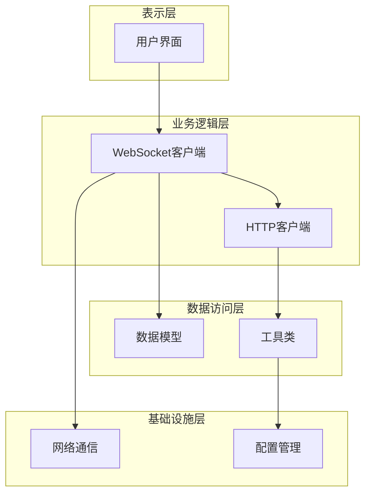
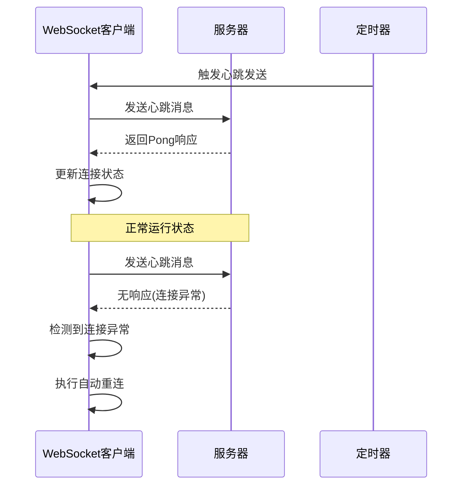
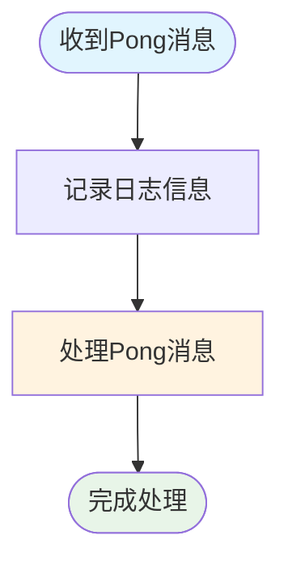
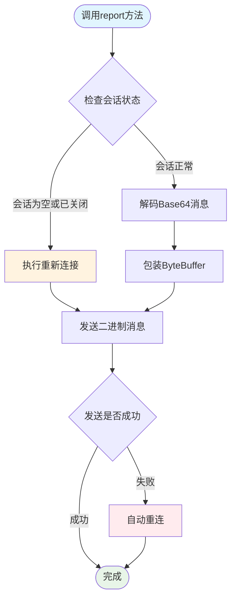
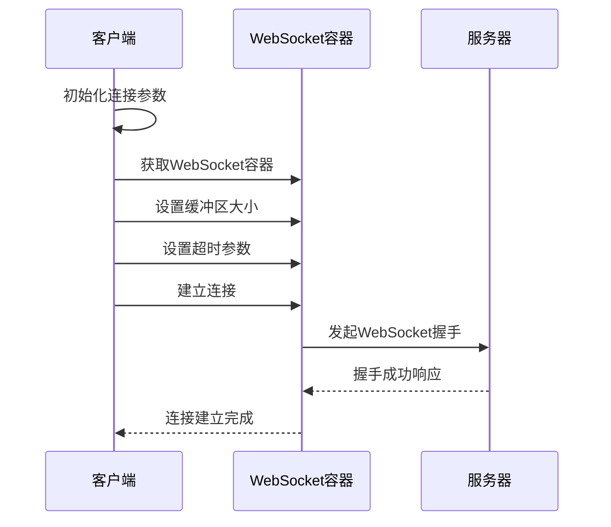
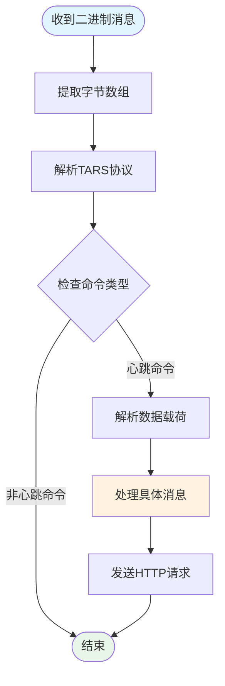
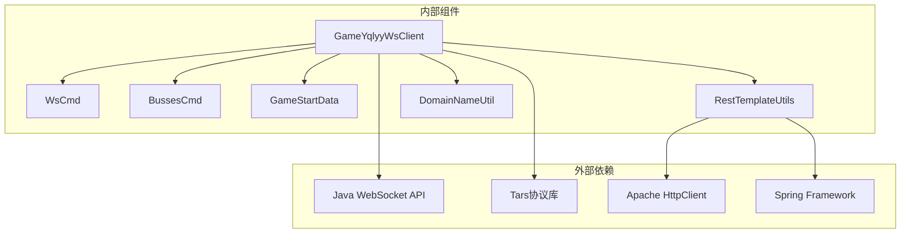

# 心跳维持机制

<cite>
**本文档引用的文件**
- [GameYqlyyWsClient.java](file://src/main/java/com/yqlyy/GameYqlyyWsClient.java)
- [WsCmd.java](file://src/main/java/com/entity/WsCmd.java)
- [BussesCmd.java](file://src/main/java/com/entity/BussesCmd.java)
- [GameStartData.java](file://src/main/java/com/entity/GameStartData.java)
- [application.yml](file://src/main/resources/application.yml)
- [RestTemplateConfig.java](file://src/main/java/com/commom/RestTemplateConfig.java)
- [RestTemplateUtils.java](file://src/main/java/com/commom/RestTemplateUtils.java)
- [DomainNameUtil.java](file://src/main/java/com/utils/DomainNameUtil.java)
</cite>

## 目录
1. [引言](#引言)
2. [项目结构](#项目结构)
3. [核心组件](#核心组件)
4. [架构概览](#架构概览)
5. [详细组件分析](#详细组件分析)
6. [依赖关系分析](#依赖关系分析)
7. [性能考虑](#性能考虑)
8. [故障排查指南](#故障排查指南)
9. [结论](#结论)

## 引言

本文档深入解析了基于Java WebSocket的实时通信系统中的心跳维持机制。该系统通过WebSocket协议与虎牙直播平台保持长连接，实现游戏数据的实时推送和状态同步。文档重点阐述了Pong消息的接收处理、Ping消息的发送逻辑、心跳消息的构造与发送流程，以及连接健康状态的监控机制。

该实现采用客户端主动发送心跳包的方式，通过定时任务定期向服务器发送预定义的心跳消息，确保WebSocket连接的持续有效性。系统还实现了完善的错误处理和自动重连机制，保证在连接异常情况下能够快速恢复服务。

## 项目结构

该项目采用标准的Spring Boot项目结构，主要包含以下模块：

**图表来源**
- [GameYqlyyWsClient.java](file://src/main/java/com/yqlyy/GameYqlyyWsClient.java#L1-L328)
- [WsCmd.java](file://src/main/java/com/entity/WsCmd.java#L1-L69)
- [application.yml](file://src/main/resources/application.yml#L1-L31)

**章节来源**
- [GameYqlyyWsClient.java](file://src/main/java/com/yqlyy/GameYqlyyWsClient.java#L1-L328)
- [application.yml](file://src/main/resources/application.yml#L1-L31)

## 核心组件

### WebSocket客户端核心功能

系统的核心是`GameYqlyyWsClient`类，它实现了完整的WebSocket客户端功能：

- **连接管理**：负责WebSocket连接的建立、维护和断开
- **消息处理**：处理二进制消息和Pong响应消息
- **心跳维持**：通过`report()`方法定期发送心跳消息
- **业务数据处理**：解析服务器推送的游戏数据

### 数据模型组件

系统使用多个数据模型来处理不同类型的消息：

- **WsCmd**：WebSocket命令的基础模型，包含命令类型、数据载荷等字段
- **BussesCmd**：业务命令模型，用于处理具体的业务消息
- **GameStartData**：游戏开始数据模型，包含游戏轮次和时间信息

**章节来源**
- [GameYqlyyWsClient.java](file://src/main/java/com/yqlyy/GameYqlyyWsClient.java#L29-L328)
- [WsCmd.java](file://src/main/java/com/entity/WsCmd.java#L1-L69)
- [BussesCmd.java](file://src/main/java/com/entity/BussesCmd.java#L1-L10)
- [GameStartData.java](file://src/main/java/com/entity/GameStartData.java#L1-L79)

## 架构概览

系统采用分层架构设计，各层职责明确：

**图表来源**
- [GameYqlyyWsClient.java](file://src/main/java/com/yqlyy/GameYqlyyWsClient.java#L29-L328)
- [RestTemplateConfig.java](file://src/main/java/com/commom/RestTemplateConfig.java#L32-L131)

系统的核心交互流程如下：

**图表来源**
- [GameYqlyyWsClient.java](file://src/main/java/com/yqlyy/GameYqlyyWsClient.java#L274-L290)
- [GameYqlyyWsClient.java](file://src/main/java/com/yqlyy/GameYqlyyWsClient.java#L250-L272)

## 详细组件分析

### 心跳机制实现

#### Pong消息接收处理

系统通过`pongMessage()`方法处理服务器返回的Pong响应：

**图表来源**
- [GameYqlyyWsClient.java](file://src/main/java/com/yqlyy/GameYqlyyWsClient.java#L46-L49)

#### Ping消息发送逻辑

心跳消息的发送通过`report()`方法实现，该方法包含完整的连接管理和消息发送逻辑：

**图表来源**
- [GameYqlyyWsClient.java](file://src/main/java/com/yqlyy/GameYqlyyWsClient.java#L274-L290)

#### 心跳消息构造流程

心跳消息的构造过程包含以下步骤：

1. **Base64解码**：将预定义的Base64字符串解码为字节数组
2. **消息包装**：使用ByteBuffer包装字节数组
3. **消息发送**：通过WebSocket会话发送二进制消息

**章节来源**
- [GameYqlyyWsClient.java](file://src/main/java/com/yqlyy/GameYqlyyWsClient.java#L274-L290)

### 连接管理机制

#### 连接建立流程

系统通过`connect()`方法建立WebSocket连接：

**图表来源**
- [GameYqlyyWsClient.java](file://src/main/java/com/yqlyy/GameYqlyyWsClient.java#L250-L272)

#### 连接超时配置

系统设置了多层超时参数来确保连接的稳定性：

| 配置项 | 默认值 | 说明 |
|--------|--------|------|
| `defaultMaxSessionIdleTimeout` | 30000ms | 会话空闲超时时间 |
| `asyncSendTimeout` | 20000ms | 异步发送超时时间 |
| `connectTimeout` | 10000ms | 连接建立超时时间 |
| `socketTimeout` | 30000ms | Socket超时时间 |

**章节来源**
- [GameYqlyyWsClient.java](file://src/main/java/com/yqlyy/GameYqlyyWsClient.java#L254-L257)
- [application.yml](file://src/main/resources/application.yml#L21-L26)

### 数据处理机制

#### 二进制消息解析

系统通过`binaryMessage()`方法处理服务器推送的二进制消息：

**图表来源**
- [GameYqlyyWsClient.java](file://src/main/java/com/yqlyy/GameYqlyyWsClient.java#L52-L219)

#### 消息格式规范

心跳消息采用二进制格式，包含以下结构：

1. **消息头**：包含协议版本、消息类型等元数据
2. **消息体**：包含具体的数据载荷
3. **消息尾**：包含校验和等完整性信息

**章节来源**
- [GameYqlyyWsClient.java](file://src/main/java/com/yqlyy/GameYqlyyWsClient.java#L52-L219)

## 依赖关系分析

系统的主要依赖关系如下：

**图表来源**
- [GameYqlyyWsClient.java](file://src/main/java/com/yqlyy/GameYqlyyWsClient.java#L1-L328)
- [RestTemplateConfig.java](file://src/main/java/com/commom/RestTemplateConfig.java#L32-L131)

**章节来源**
- [GameYqlyyWsClient.java](file://src/main/java/com/yqlyy/GameYqlyyWsClient.java#L1-L328)
- [RestTemplateConfig.java](file://src/main/java/com/commom/RestTemplateConfig.java#L32-L131)

## 性能考虑

### 心跳频率优化

系统当前的心跳发送频率为每30秒一次，这是一个平衡点：

- **优点**：减少网络开销，降低服务器压力
- **缺点**：检测延迟相对较长

### 内存管理

系统采用了高效的内存管理策略：

1. **ByteBuffer复用**：避免频繁的对象创建
2. **Base64缓存**：缓存解码后的字节数组
3. **连接池管理**：合理配置连接池参数

### 网络优化

系统在网络层面进行了多项优化：

- **连接复用**：通过HTTP连接池复用TCP连接
- **超时控制**：设置合理的超时参数
- **错误重试**：实现智能的错误重试机制

## 故障排查指南

### 常见问题及解决方案

#### 连接无法建立

**症状**：应用启动后WebSocket连接失败

**可能原因**：
1. WebSocket服务器地址配置错误
2. 网络连接异常
3. 证书验证失败

**解决步骤**：
1. 检查WebSocket URL配置
2. 验证网络连通性
3. 查看SSL证书配置

#### 心跳失败

**症状**：心跳消息发送失败，连接断开

**可能原因**：
1. 网络不稳定
2. 服务器负载过高
3. 心跳消息格式错误

**解决步骤**：
1. 检查心跳消息格式
2. 监控网络质量
3. 调整心跳间隔

#### 自动重连失败

**症状**：连接断开后无法自动重连

**可能原因**：
1. 重连逻辑异常
2. 配置参数不正确
3. 资源泄漏

**解决步骤**：
1. 检查重连逻辑实现
2. 验证配置参数
3. 监控资源使用情况

### 日志分析

系统提供了详细的日志记录，便于问题诊断：

- **连接日志**：记录连接建立和断开事件
- **消息日志**：记录消息收发详情
- **错误日志**：记录异常和错误信息

**章节来源**
- [GameYqlyyWsClient.java](file://src/main/java/com/yqlyy/GameYqlyyWsClient.java#L240-L248)

## 结论

该WebSocket心跳维持机制实现了稳定可靠的长连接通信。通过精心设计的心跳消息格式、完善的错误处理和自动重连机制，系统能够在各种网络环境下保持连接的稳定性。

### 主要优势

1. **可靠性高**：多重超时机制和自动重连确保连接稳定性
2. **性能优秀**：合理的缓冲区配置和内存管理优化
3. **易于维护**：清晰的代码结构和详细的日志记录
4. **扩展性强**：模块化设计支持功能扩展

### 改进建议

1. **动态心跳间隔**：根据网络状况动态调整心跳间隔
2. **更精细的状态监控**：增加连接状态的实时监控
3. **性能指标收集**：添加详细的性能指标收集机制
4. **配置热更新**：支持运行时配置参数的动态更新

该实现为WebSocket实时通信提供了一个坚实的技术基础，可以作为类似系统的参考实现。