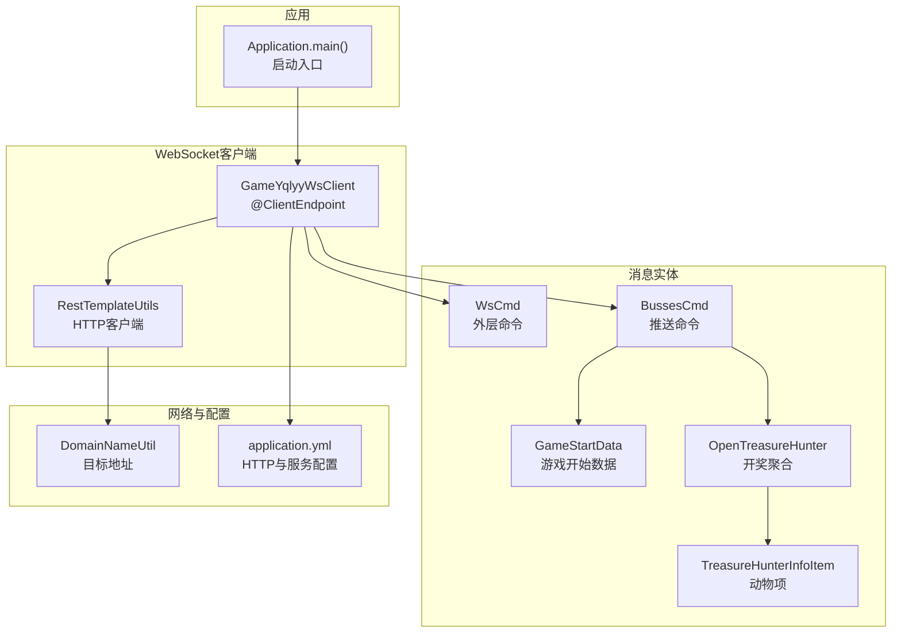
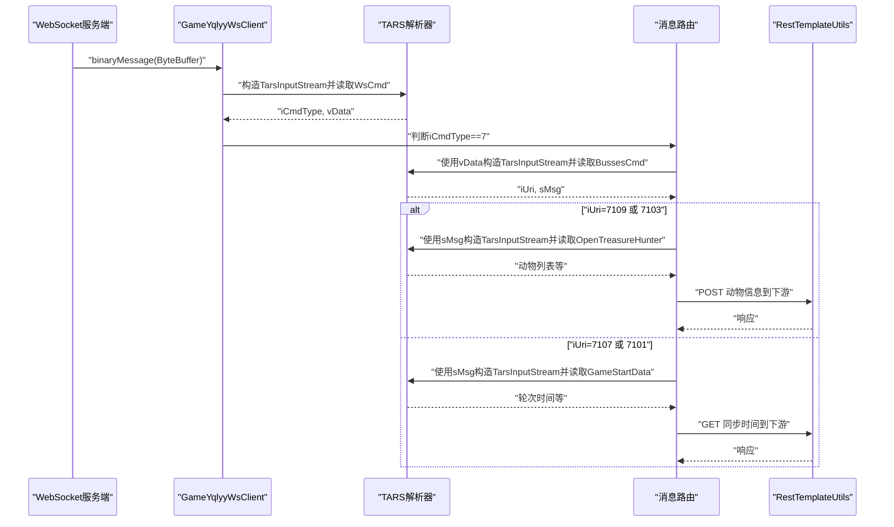
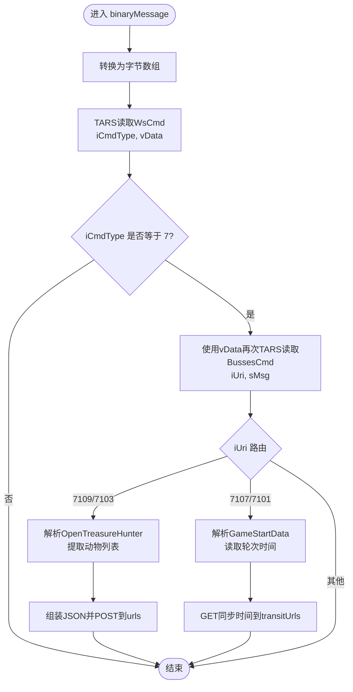
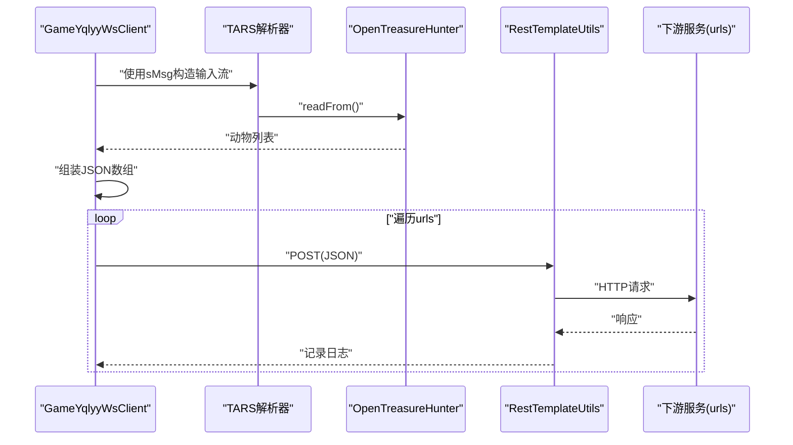
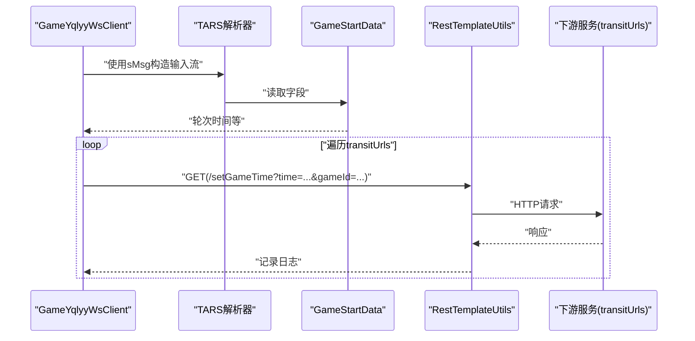
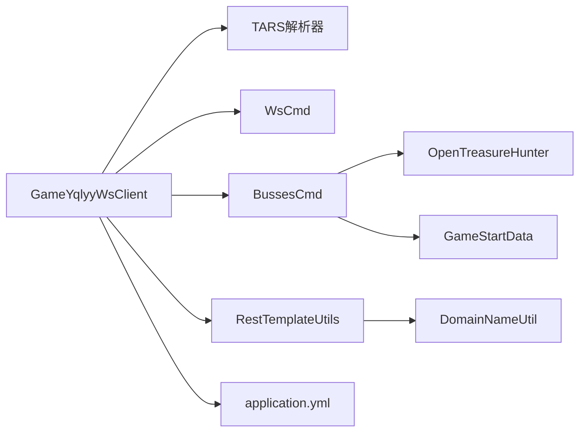

# 消息处理流程

<cite>
**本文引用的文件**
- [GameYqlyyWsClient.java](file://src/main/java/com/yqlyy/GameYqlyyWsClient.java)
- [WsCmd.java](file://src/main/java/com/entity/WsCmd.java)
- [BussesCmd.java](file://src/main/java/com/entity/BussesCmd.java)
- [GameStartData.java](file://src/main/java/com/entity/GameStartData.java)
- [OpenTreasureHunter.java](file://src/main/java/com/entity/AccountedNotify/OpenTreasureHunter.java)
- [TreasureHunterInfoItem.java](file://src/main/java/com/entity/AccountedNotify/TreasureHunterInfoItem.java)
- [DomainNameUtil.java](file://src/main/java/com/utils/DomainNameUtil.java)
- [RestTemplateUtils.java](file://src/main/java/com/commom/RestTemplateUtils.java)
- [application.yml](file://src/main/resources/application.yml)
</cite>

## 目录
1. [简介](#简介)
2. [项目结构](#项目结构)
3. [核心组件](#核心组件)
4. [架构总览](#架构总览)
5. [详细组件分析](#详细组件分析)
6. [依赖关系分析](#依赖关系分析)
7. [性能考量](#性能考量)
8. [故障排查指南](#故障排查指南)
9. [结论](#结论)
10. [附录](#附录)

## 简介
本文件围绕 WebSocket 二进制消息处理流程展开，重点剖析 binaryMessage() 方法的实现与工作机制，涵盖：
- 二进制消息接收与解析
- TARS 协议解包与字段读取
- 消息路由与不同业务 URI 的处理逻辑
- 开奖消息（iUri=7109/7103）与游戏开始消息（iUri=7107/7101）的处理流程
- 心跳响应与错误处理机制
- 数据模型、字段含义与数据转换细节
- 实用调试技巧与扩展建议

## 项目结构
该项目采用基于包的分层组织方式，核心 WebSocket 客户端位于 yqlyy 包，消息实体定义在 entity 包，工具类与配置位于 commom、utils、resources 等目录。

图表来源
- [GameYqlyyWsClient.java](file://src/main/java/com/yqlyy/GameYqlyyWsClient.java#L29-L328)
- [RestTemplateUtils.java](file://src/main/java/com/commom/RestTemplateUtils.java#L14-L31)
- [WsCmd.java](file://src/main/java/com/entity/WsCmd.java#L3-L68)
- [BussesCmd.java](file://src/main/java/com/entity/BussesCmd.java#L3-L9)
- [GameStartData.java](file://src/main/java/com/entity/GameStartData.java#L3-L79)
- [OpenTreasureHunter.java](file://src/main/java/com/entity/AccountedNotify/OpenTreasureHunter.java#L10-L83)
- [TreasureHunterInfoItem.java](file://src/main/java/com/entity/AccountedNotify/TreasureHunterInfoItem.java#L8-L124)
- [DomainNameUtil.java](file://src/main/java/com/utils/DomainNameUtil.java#L3-L16)
- [application.yml](file://src/main/resources/application.yml#L1-L31)

章节来源
- [GameYqlyyWsClient.java](file://src/main/java/com/yqlyy/GameYqlyyWsClient.java#L29-L328)
- [application.yml](file://src/main/resources/application.yml#L1-L31)

## 核心组件
- GameYqlyyWsClient：WebSocket 客户端，负责连接、接收二进制消息、解析与路由、调用下游服务。
- WsCmd：外层 WebSocket 命令对象，承载命令类型、数据体等。
- BussesCmd：业务推送命令对象，包含 iUri（业务标识）、sMsg（业务数据体）等。
- GameStartData：游戏开始相关的时间戳与轮次信息。
- OpenTreasureHunter / TreasureHunterInfoItem：开奖数据结构，包含动物列表与属性。
- RestTemplateUtils：封装 HTTP 请求，用于向下游服务同步开奖或时间信息。
- DomainNameUtil：目标服务地址集合（urls/transitUrls）。
- application.yml：HTTP 客户端超时、连接池等配置。

章节来源
- [WsCmd.java](file://src/main/java/com/entity/WsCmd.java#L3-L68)
- [BussesCmd.java](file://src/main/java/com/entity/BussesCmd.java#L3-L9)
- [GameStartData.java](file://src/main/java/com/entity/GameStartData.java#L3-L79)
- [OpenTreasureHunter.java](file://src/main/java/com/entity/AccountedNotify/OpenTreasureHunter.java#L10-L83)
- [TreasureHunterInfoItem.java](file://src/main/java/com/entity/AccountedNotify/TreasureHunterInfoItem.java#L8-L124)
- [RestTemplateUtils.java](file://src/main/java/com/commom/RestTemplateUtils.java#L14-L31)
- [DomainNameUtil.java](file://src/main/java/com/utils/DomainNameUtil.java#L3-L16)

## 架构总览
WebSocket 接收路径与业务处理链路如下：

图表来源
- [GameYqlyyWsClient.java](file://src/main/java/com/yqlyy/GameYqlyyWsClient.java#L52-L219)
- [WsCmd.java](file://src/main/java/com/entity/WsCmd.java#L3-L68)
- [BussesCmd.java](file://src/main/java/com/entity/BussesCmd.java#L3-L9)
- [OpenTreasureHunter.java](file://src/main/java/com/entity/AccountedNotify/OpenTreasureHunter.java#L70-L83)
- [GameStartData.java](file://src/main/java/com/entity/GameStartData.java#L4-L79)
- [RestTemplateUtils.java](file://src/main/java/com/commom/RestTemplateUtils.java#L19-L29)

## 详细组件分析

### binaryMessage() 方法核心实现
- 输入：Session、ByteBuffer（原始二进制消息）
- 步骤：
  1) 将 ByteBuffer 转为字节数组；
  2) 使用 TARS 解析器读取外层命令 WsCmd，获取 iCmdType 与 vData；
  3) 仅当 iCmdType==7 时继续解析；
  4) 使用 vData 再次解析 BussesCmd，读取 iUri 与 sMsg；
  5) 根据 iUri 分支处理：
     - 7109/7103：解析 OpenTreasureHunter，提取动物列表，组装 JSON，通过 RestTemplateUtils 向 urls 下游同步；
     - 7107/7101：解析 GameStartData，读取轮次时间，通过 RestTemplateUtils 向 transitUrls 下游同步时间；
  6) 其他 iCmdType 直接返回，不处理。

图表来源
- [GameYqlyyWsClient.java](file://src/main/java/com/yqlyy/GameYqlyyWsClient.java#L52-L219)

章节来源
- [GameYqlyyWsClient.java](file://src/main/java/com/yqlyy/GameYqlyyWsClient.java#L52-L219)

### TARS 协议解析与消息路由
- 外层命令 WsCmd：包含 iCmdType（命令类型）、vData（数据体）等。
- 业务命令 BussesCmd：包含 iUri（业务 URI）、sMsg（业务数据）。
- 路由规则：
  - iUri=7109/7103：开奖消息，解析 OpenTreasureHunter，遍历动物列表，提取动物 ID 与名称，向 urls 发起同步请求。
  - iUri=7107/7101：游戏开始消息，解析 GameStartData，读取旧轮次时间与当前轮次时间，向 transitUrls 发起同步请求。
- 心跳响应：代码中存在对 PongMessage 的 OnMessage 处理日志记录，但未见显式的 ping/pong 交互逻辑；若需心跳保活，可在 onOpen 中发送 ping 或设置容器级心跳策略。

章节来源
- [WsCmd.java](file://src/main/java/com/entity/WsCmd.java#L3-L68)
- [BussesCmd.java](file://src/main/java/com/entity/BussesCmd.java#L3-L9)
- [GameYqlyyWsClient.java](file://src/main/java/com/yqlyy/GameYqlyyWsClient.java#L47-L49)
- [GameYqlyyWsClient.java](file://src/main/java/com/yqlyy/GameYqlyyWsClient.java#L52-L219)

### 开奖消息处理（iUri=7109/7103）
- 解析流程：
  - 使用 sMsg 构造 TARS 输入流，读取 OpenTreasureHunter；
  - 遍历 vTreasure 列表，提取每个动物的 iTreasureId 与 sTreasureName；
  - 组装 JSON 数组，逐个向 urls 发送 POST 请求；
  - 记录成功/异常日志。
- 数据模型要点：
  - OpenTreasureHunter：包含 lOldRoundId、lOldRoundIndexEndTime、lOldRoundIndexTime、lServerTime、vTreasure（动物列表）等；
  - TreasureHunterInfoItem：包含 iTreasureId、sTreasureName、sTag、iWeight、iRate、iProb、iProbRate、lBetClues 等。

图表来源
- [GameYqlyyWsClient.java](file://src/main/java/com/yqlyy/GameYqlyyWsClient.java#L76-L120)
- [OpenTreasureHunter.java](file://src/main/java/com/entity/AccountedNotify/OpenTreasureHunter.java#L70-L83)
- [TreasureHunterInfoItem.java](file://src/main/java/com/entity/AccountedNotify/TreasureHunterInfoItem.java#L111-L122)
- [RestTemplateUtils.java](file://src/main/java/com/commom/RestTemplateUtils.java#L19-L21)
- [DomainNameUtil.java](file://src/main/java/com/utils/DomainNameUtil.java#L4-L13)

章节来源
- [GameYqlyyWsClient.java](file://src/main/java/com/yqlyy/GameYqlyyWsClient.java#L76-L120)
- [OpenTreasureHunter.java](file://src/main/java/com/entity/AccountedNotify/OpenTreasureHunter.java#L10-L83)
- [TreasureHunterInfoItem.java](file://src/main/java/com/entity/AccountedNotify/TreasureHunterInfoItem.java#L8-L124)

### 游戏开始消息处理（iUri=7107/7101）
- 解析流程：
  - 使用 sMsg 构造 TARS 输入流，读取 GameStartData；
  - 读取旧轮次开始/结束时间等字段；
  - 遍历 transitUrls，发起 GET 请求同步时间；
  - 记录成功/异常日志。
- 数据模型要点：
  - GameStartData：包含 lOldRoundId、lOldRoundIndexEndTime、lOldRoundIndexTime、lRoundId、lRoundIndexEndTime、lRoundIndexTime、lServerTime 等。

图表来源
- [GameYqlyyWsClient.java](file://src/main/java/com/yqlyy/GameYqlyyWsClient.java#L120-L148)
- [GameStartData.java](file://src/main/java/com/entity/GameStartData.java#L4-L79)
- [RestTemplateUtils.java](file://src/main/java/com/commom/RestTemplateUtils.java#L23-L25)
- [DomainNameUtil.java](file://src/main/java/com/utils/DomainNameUtil.java#L10-L13)

章节来源
- [GameYqlyyWsClient.java](file://src/main/java/com/yqlyy/GameYqlyyWsClient.java#L120-L148)
- [GameStartData.java](file://src/main/java/com/entity/GameStartData.java#L3-L79)

### 心跳响应处理
- 代码中存在对 PongMessage 的 OnMessage 日志记录，表明客户端能接收服务器的心跳响应；
- 当前未见主动 ping 或自动心跳保活逻辑，如需增强稳定性，可在 onOpen 中发送 ping 或启用容器级心跳。

章节来源
- [GameYqlyyWsClient.java](file://src/main/java/com/yqlyy/GameYqlyyWsClient.java#L47-L49)
- [GameYqlyyWsClient.java](file://src/main/java/com/yqlyy/GameYqlyyWsClient.java#L222-L236)

## 依赖关系分析
- 组件耦合：
  - GameYqlyyWsClient 依赖 TARS 解析器、WsCmd、BussesCmd、OpenTreasureHunter、GameStartData、RestTemplateUtils、DomainNameUtil；
  - 业务分支通过 iUri 解耦，不同 URI 对应不同数据模型与下游接口；
- 外部依赖：
  - HTTP 客户端超时与连接池参数由 application.yml 配置；
  - URLs 与 TransitUrls 来源于 DomainNameUtil，便于集中管理与扩展。

图表来源
- [GameYqlyyWsClient.java](file://src/main/java/com/yqlyy/GameYqlyyWsClient.java#L1-L328)
- [WsCmd.java](file://src/main/java/com/entity/WsCmd.java#L3-L68)
- [BussesCmd.java](file://src/main/java/com/entity/BussesCmd.java#L3-L9)
- [OpenTreasureHunter.java](file://src/main/java/com/entity/AccountedNotify/OpenTreasureHunter.java#L10-L83)
- [GameStartData.java](file://src/main/java/com/entity/GameStartData.java#L3-L79)
- [RestTemplateUtils.java](file://src/main/java/com/commom/RestTemplateUtils.java#L14-L31)
- [DomainNameUtil.java](file://src/main/java/com/utils/DomainNameUtil.java#L3-L16)
- [application.yml](file://src/main/resources/application.yml#L16-L31)

章节来源
- [GameYqlyyWsClient.java](file://src/main/java/com/yqlyy/GameYqlyyWsClient.java#L1-L328)
- [application.yml](file://src/main/resources/application.yml#L16-L31)

## 性能考量
- 二进制缓冲区大小：WebSocket 容器默认二进制消息缓冲区为 64KB，满足大多数场景；如需处理更大包，可在连接前调整。
- HTTP 调用并发：urls 与 transitUrls 的循环调用为串行，建议引入线程池或异步 HTTP 客户端以提升吞吐。
- 日志输出：当前打印较多控制台日志，生产环境建议降低日志级别或使用结构化日志。
- TARS 解析：重复构造 TarsInputStream 与 readFrom 调用开销较小，但应避免在高频事件中做复杂计算。

章节来源
- [GameYqlyyWsClient.java](file://src/main/java/com/yqlyy/GameYqlyyWsClient.java#L250-L272)
- [application.yml](file://src/main/resources/application.yml#L16-L31)

## 故障排查指南
- WebSocket 连接失败
  - 检查 wsUrl 是否为空或不可达；查看连接日志与异常栈；
  - 如 session 关闭或异常，可在 onError 中记录并触发重连。
- 二进制消息解析异常
  - 确认 iCmdType 是否为 7；若非预期值直接返回；
  - 检查 vData 是否为空；TARS 字段索引是否与服务端一致。
- HTTP 同步失败
  - urls/transitUrls 地址是否可达；超时时间是否合理；
  - RestClientException 与通用异常均已捕获并记录，便于定位问题。
- 心跳保活
  - 若出现连接中断，确认是否存在 ping/pong 保活机制；必要时在 onOpen 中发送 ping 或启用容器级心跳。

章节来源
- [GameYqlyyWsClient.java](file://src/main/java/com/yqlyy/GameYqlyyWsClient.java#L245-L248)
- [GameYqlyyWsClient.java](file://src/main/java/com/yqlyy/GameYqlyyWsClient.java#L250-L272)
- [RestTemplateUtils.java](file://src/main/java/com/commom/RestTemplateUtils.java#L19-L29)

## 结论
binaryMessage() 方法实现了基于 TARS 协议的 WebSocket 二进制消息解析与路由，针对不同 iUri 执行差异化业务处理。通过 RestTemplateUtils 将开奖与时间信息同步至下游服务，形成完整的消息闭环。建议后续优化点包括：引入异步/并发 HTTP 调用、完善心跳保活、增强字段校验与异常恢复策略，以及在生产环境降低日志噪声。

## 附录

### 消息格式规范与字段说明
- 外层命令 WsCmd
  - iCmdType：整型，命令类型；仅当等于 7 时才继续解析；
  - vData：字节数组，业务数据体；
  - 其他字段：lRequestId、traceId、iEncryptType、lTime、sMD5 等（当前未使用）。
- 业务命令 BussesCmd
  - iUri：整型，业务 URI，决定消息类型与处理分支；
  - sMsg：字节数组，业务数据体，需按具体 URI 解析。
- 开奖消息（iUri=7109/7103）
  - OpenTreasureHunter：包含 lOldRoundId、lOldRoundIndexEndTime、lOldRoundIndexTime、lServerTime、vTreasure；
  - vTreasure：列表，元素为 TreasureHunterInfoItem；
  - TreasureHunterInfoItem：包含 iTreasureId、sTreasureName、sTag、iWeight、iRate、iProb、iProbRate、lBetClues。
- 游戏开始消息（iUri=7107/7101）
  - GameStartData：包含 lOldRoundId、lOldRoundIndexEndTime、lOldRoundIndexTime、lRoundId、lRoundIndexEndTime、lRoundIndexTime、lServerTime。

章节来源
- [WsCmd.java](file://src/main/java/com/entity/WsCmd.java#L3-L68)
- [BussesCmd.java](file://src/main/java/com/entity/BussesCmd.java#L3-L9)
- [OpenTreasureHunter.java](file://src/main/java/com/entity/AccountedNotify/OpenTreasureHunter.java#L10-L83)
- [TreasureHunterInfoItem.java](file://src/main/java/com/entity/AccountedNotify/TreasureHunterInfoItem.java#L8-L124)
- [GameStartData.java](file://src/main/java/com/entity/GameStartData.java#L3-L79)

### 调试技巧与扩展建议
- 调试技巧
  - 在 binaryMessage 中打印 iCmdType 与 iUri，快速定位消息类型；
  - 对 sMsg 进行 Base64 编码后输出，便于对比服务端发送内容；
  - 使用断点跟踪 TARS 字段读取位置，核对索引与类型。
- 扩展建议
  - 引入统一的消息工厂与处理器映射，按 iUri 注册处理器；
  - 将 urls/transitUrls 抽象为配置项，支持动态更新；
  - 增加消息校验（如 MD5 校验字段 sMD5），提升安全性；
  - 为不同业务 URI 增加独立的日志标签与指标埋点，便于监控。

章节来源
- [GameYqlyyWsClient.java](file://src/main/java/com/yqlyy/GameYqlyyWsClient.java#L52-L219)
- [WsCmd.java](file://src/main/java/com/entity/WsCmd.java#L11-L17)
- [application.yml](file://src/main/resources/application.yml#L16-L31)