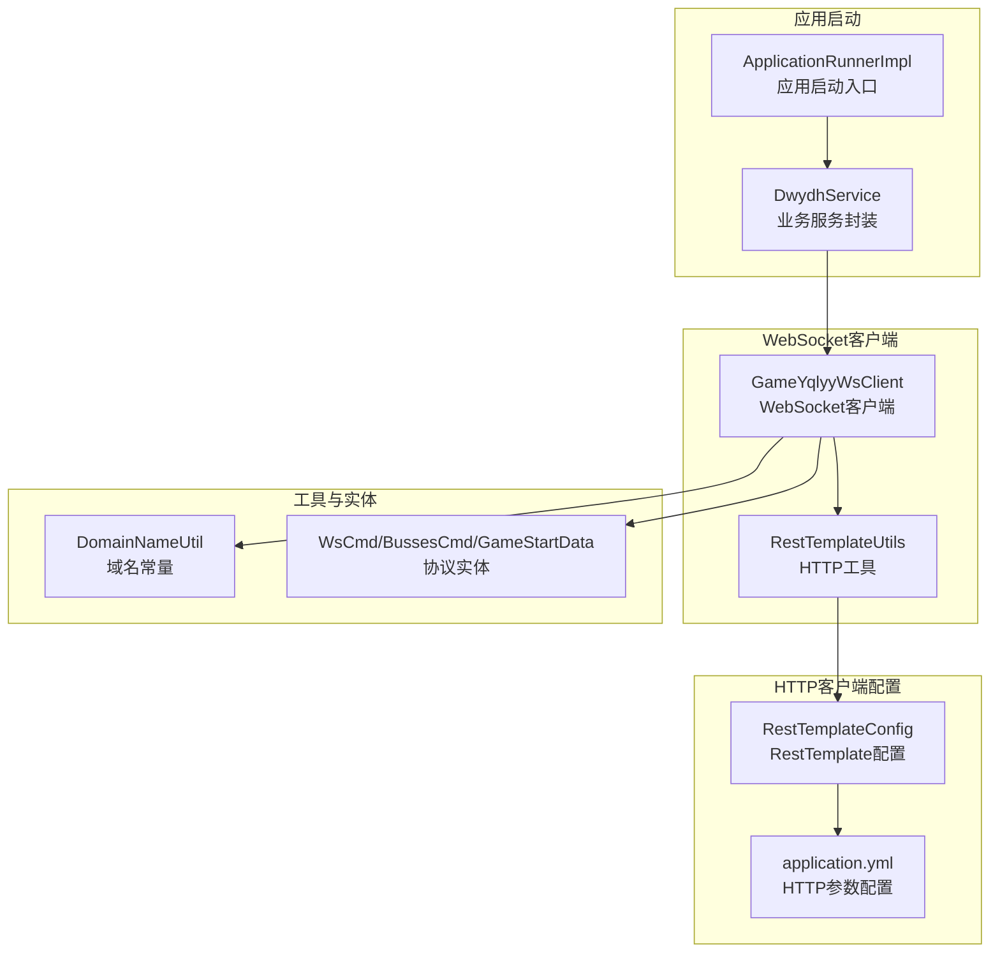
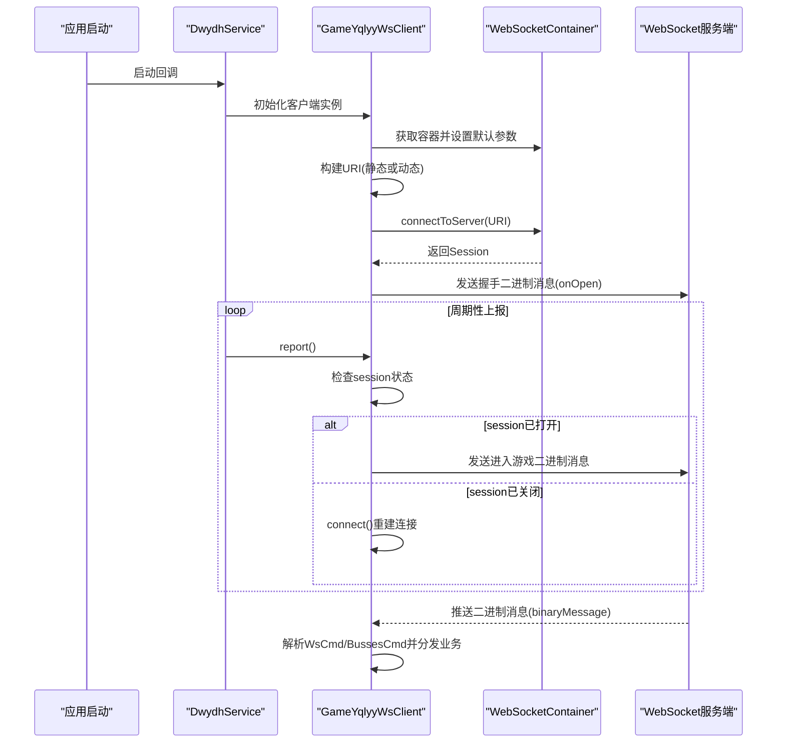
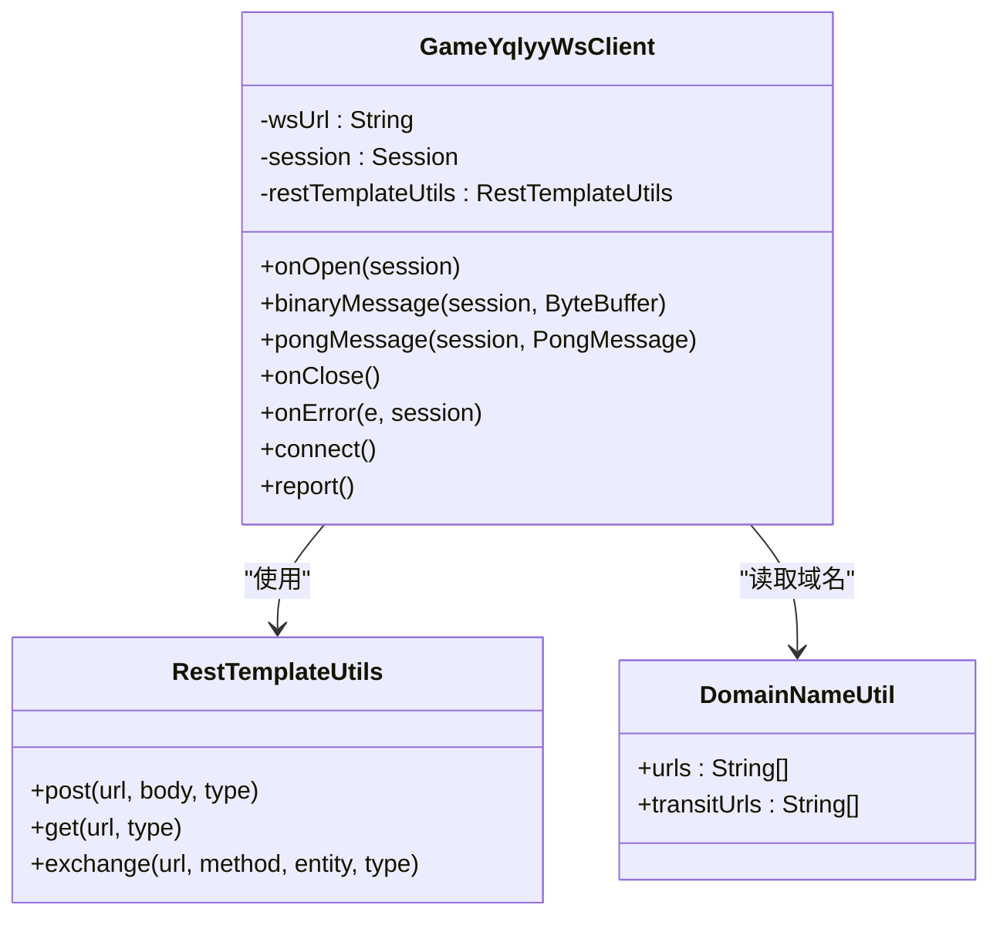
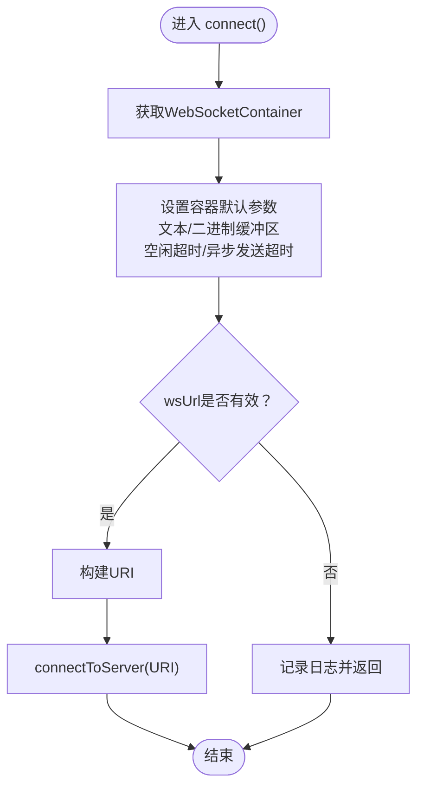
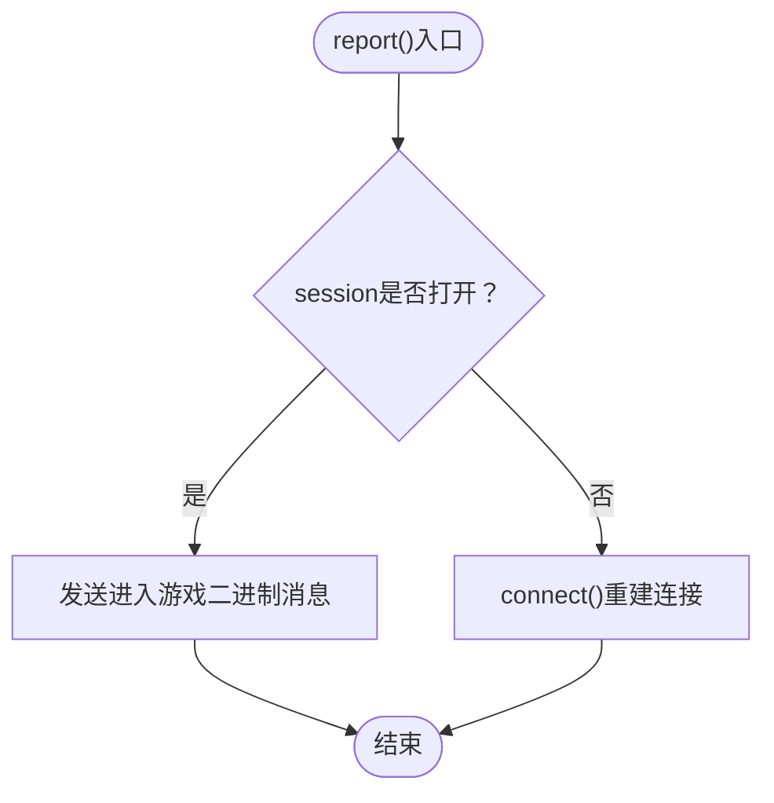
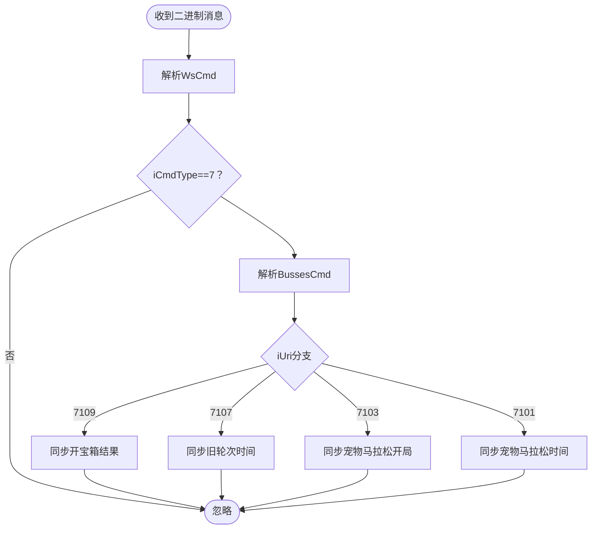
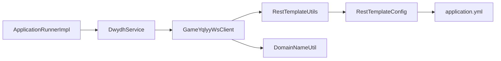

# 连接管理机制

<cite>
**本文引用的文件列表**
- [GameYqlyyWsClient.java](file://src/main/java/com/yqlyy/GameYqlyyWsClient.java)
- [RestTemplateUtils.java](file://src/main/java/com/commom/RestTemplateUtils.java)
- [RestTemplateConfig.java](file://src/main/java/com/commom/RestTemplateConfig.java)
- [ApplicationRunnerImpl.java](file://src/main/java/com/listener/ApplicationRunnerImpl.java)
- [DwydhService.java](file://src/main/java/com/dwydh/DwydhService.java)
- [DomainNameUtil.java](file://src/main/java/com/utils/DomainNameUtil.java)
- [application.yml](file://src/main/resources/application.yml)
</cite>

## 目录
1. [简介](#简介)
2. [项目结构](#项目结构)
3. [核心组件](#核心组件)
4. [架构总览](#架构总览)
5. [详细组件分析](#详细组件分析)
6. [依赖关系分析](#依赖关系分析)
7. [性能考量](#性能考量)
8. [故障排查指南](#故障排查指南)
9. [结论](#结论)

## 简介
本文件聚焦于WebSocket连接管理机制，围绕 GameYqlyyWsClient 类展开，系统性解析其连接建立流程、容器配置、URI 构建与连接建立过程、connect() 方法的实现逻辑（含容器参数设置与异常处理）、连接状态检查与自动重连策略、以及连接池管理现状与调优建议。同时提供面向开发者的最佳实践与排障指引，帮助快速理解并正确使用该连接管理模块。

## 项目结构
该项目采用基于功能域的分层组织方式：
- com.yqlyy：存放WebSocket客户端实现
- com.commom：存放通用工具与HTTP客户端配置
- com.dwydh：业务服务封装与定时上报调度
- com.listener：应用启动入口
- com.utils：工具类（域名常量）
- com.entity：数据模型与协议实体
- resources：Spring配置与日志配置

图表来源
- [ApplicationRunnerImpl.java](file://src/main/java/com/listener/ApplicationRunnerImpl.java#L21-L33)
- [DwydhService.java](file://src/main/java/com/dwydh/DwydhService.java#L21-L36)
- [GameYqlyyWsClient.java](file://src/main/java/com/yqlyy/GameYqlyyWsClient.java#L30-L44)
- [RestTemplateUtils.java](file://src/main/java/com/commom/RestTemplateUtils.java#L14-L30)
- [RestTemplateConfig.java](file://src/main/java/com/commom/RestTemplateConfig.java#L34-L131)
- [application.yml](file://src/main/resources/application.yml#L16-L30)
- [DomainNameUtil.java](file://src/main/java/com/utils/DomainNameUtil.java#L3-L15)
- [WsCmd.java](file://src/main/java/com/entity/WsCmd.java#L1-L68)

章节来源
- [ApplicationRunnerImpl.java](file://src/main/java/com/listener/ApplicationRunnerImpl.java#L21-L33)
- [DwydhService.java](file://src/main/java/com/dwydh/DwydhService.java#L21-L36)
- [GameYqlyyWsClient.java](file://src/main/java/com/yqlyy/GameYqlyyWsClient.java#L30-L44)
- [RestTemplateUtils.java](file://src/main/java/com/commom/RestTemplateUtils.java#L14-L30)
- [RestTemplateConfig.java](file://src/main/java/com/commom/RestTemplateConfig.java#L34-L131)
- [application.yml](file://src/main/resources/application.yml#L16-L30)
- [DomainNameUtil.java](file://src/main/java/com/utils/DomainNameUtil.java#L3-L15)

## 核心组件
- GameYqlyyWsClient：基于JSR 356的客户端Endpoint，负责WebSocket连接生命周期管理、消息收发与业务数据处理。
- RestTemplateUtils/RestTemplateConfig：封装HTTP客户端，提供GET/POST能力，并通过application.yml配置连接池与超时参数。
- DwydhService/ApplicationRunnerImpl：应用启动后在独立线程中周期性触发客户端上报动作，维持连接活跃。
- DomainNameUtil：集中维护目标域名与中转域名集合，用于业务数据同步。
- 协议实体：WsCmd、BussesCmd、GameStartData等，承载WebSocket二进制消息解析与业务字段。

章节来源
- [GameYqlyyWsClient.java](file://src/main/java/com/yqlyy/GameYqlyyWsClient.java#L30-L44)
- [RestTemplateUtils.java](file://src/main/java/com/commom/RestTemplateUtils.java#L14-L30)
- [RestTemplateConfig.java](file://src/main/java/com/commom/RestTemplateConfig.java#L34-L131)
- [application.yml](file://src/main/resources/application.yml#L16-L30)
- [DwydhService.java](file://src/main/java/com/dwydh/DwydhService.java#L21-L36)
- [ApplicationRunnerImpl.java](file://src/main/java/com/listener/ApplicationRunnerImpl.java#L21-L33)
- [DomainNameUtil.java](file://src/main/java/com/utils/DomainNameUtil.java#L3-L15)

## 架构总览
WebSocket连接管理由“应用启动—客户端初始化—连接建立—心跳保活—业务消息处理—异常恢复”构成闭环。客户端通过ContainerProvider获取WebSocketContainer，设置容器级默认参数，随后以URI形式发起连接；连接建立后，服务端推送二进制消息，客户端解析并根据iUri分发至不同业务处理分支，同时周期性上报以维持连接活跃。

图表来源
- [ApplicationRunnerImpl.java](file://src/main/java/com/listener/ApplicationRunnerImpl.java#L25-L31)
- [DwydhService.java](file://src/main/java/com/dwydh/DwydhService.java#L21-L36)
- [GameYqlyyWsClient.java](file://src/main/java/com/yqlyy/GameYqlyyWsClient.java#L250-L272)
- [GameYqlyyWsClient.java](file://src/main/java/com/yqlyy/GameYqlyyWsClient.java#L221-L237)
- [GameYqlyyWsClient.java](file://src/main/java/com/yqlyy/GameYqlyyWsClient.java#L274-L290)

## 详细组件分析

### GameYqlyyWsClient：连接管理与消息处理
- 客户端注解与成员
  - 使用@ClientEndpoint标注为客户端Endpoint，内部持有Session与RestTemplateUtils。
  - 静态wsUrl作为WebSocket服务地址，支持后续扩展为动态获取。
- 生命周期回调
  - onOpen：连接建立后发送握手二进制消息，触发服务端认证与初始化。
  - binaryMessage：接收服务端推送的二进制消息，解析WsCmd/BussesCmd，按iUri分发处理（如开宝箱、游戏开始、时间同步等），并将关键业务数据通过RestTemplateUtils异步上报至业务系统。
  - onOpen/onClose/onError：记录连接状态与异常信息，便于监控与排障。
- 连接建立与容器配置
  - connect()方法内通过ContainerProvider获取WebSocketContainer，默认设置：
    - 文本消息缓冲区：65536字节
    - 二进制消息缓冲区：65536字节
    - 会话空闲超时：30000毫秒
    - 异步发送超时：20000毫秒
  - URI构建：直接使用静态wsUrl构造URI，随后调用connectToServer(this, uri)建立连接。
  - 异常处理：捕获连接过程中的异常并记录日志，避免主线程中断。
- 连接状态检查与自动重连
  - report()方法中，若session为null或未打开，则调用connect()重建连接，形成基础的自动重连策略。
- 数据解析与业务处理
  - 通过TarsInputStream解析二进制消息，提取BussesCmd中的iUri与sMsg，针对不同iUri（如7109、7107、7103、7101）执行相应业务逻辑，并通过RestTemplateUtils向业务系统同步数据。

图表来源
- [GameYqlyyWsClient.java](file://src/main/java/com/yqlyy/GameYqlyyWsClient.java#L30-L44)
- [GameYqlyyWsClient.java](file://src/main/java/com/yqlyy/GameYqlyyWsClient.java#L250-L272)
- [GameYqlyyWsClient.java](file://src/main/java/com/yqlyy/GameYqlyyWsClient.java#L274-L290)
- [RestTemplateUtils.java](file://src/main/java/com/commom/RestTemplateUtils.java#L14-L30)
- [DomainNameUtil.java](file://src/main/java/com/utils/DomainNameUtil.java#L3-L15)

章节来源
- [GameYqlyyWsClient.java](file://src/main/java/com/yqlyy/GameYqlyyWsClient.java#L30-L44)
- [GameYqlyyWsClient.java](file://src/main/java/com/yqlyy/GameYqlyyWsClient.java#L221-L248)
- [GameYqlyyWsClient.java](file://src/main/java/com/yqlyy/GameYqlyyWsClient.java#L250-L272)
- [GameYqlyyWsClient.java](file://src/main/java/com/yqlyy/GameYqlyyWsClient.java#L274-L290)

### connect()方法实现逻辑与容器参数
- 容器参数设置
  - 默认文本消息缓冲区：65536字节
  - 默认二进制消息缓冲区：65536字节
  - 会话空闲超时：30000毫秒
  - 异步发送超时：20000毫秒
- URI构建与连接建立
  - 若wsUrl为空则跳过连接尝试并记录日志
  - 将wsUrl转换为URI并调用connectToServer(this, uri)建立连接
- 异常处理
  - 捕获连接过程中的异常并记录错误日志，确保不会中断上层调度线程

图表来源
- [GameYqlyyWsClient.java](file://src/main/java/com/yqlyy/GameYqlyyWsClient.java#L250-L272)

章节来源
- [GameYqlyyWsClient.java](file://src/main/java/com/yqlyy/GameYqlyyWsClient.java#L250-L272)

### 连接状态检查与自动重连策略
- 状态检查
  - report()方法中判断session是否为null或未打开
- 自动重连
  - 若session不可用，立即调用connect()重建连接
- 周期性触发
  - DwydhService在独立线程中每30秒调用一次report()，维持连接活跃并触发重连

图表来源
- [GameYqlyyWsClient.java](file://src/main/java/com/yqlyy/GameYqlyyWsClient.java#L274-L290)
- [DwydhService.java](file://src/main/java/com/dwydh/DwydhService.java#L21-L36)

章节来源
- [GameYqlyyWsClient.java](file://src/main/java/com/yqlyy/GameYqlyyWsClient.java#L274-L290)
- [DwydhService.java](file://src/main/java/com/dwydh/DwydhService.java#L21-L36)

### 业务消息处理与数据同步
- 二进制消息解析
  - binaryMessage中解析WsCmd与BussesCmd，依据iUri区分业务类型
- 业务分支
  - iUri=7109：开宝箱结果，提取怪物ID与名称，通过RestTemplateUtils向urls同步
  - iUri=7107：游戏开始，同步旧轮次时间至transitUrls
  - iUri=7103：宠物马拉松开局，同步首只动物信息
  - iUri=7101：宠物马拉松开始，同步时间
- HTTP同步
  - 使用RestTemplateUtils.post/get进行异步请求，异常被捕获并记录日志

图表来源
- [GameYqlyyWsClient.java](file://src/main/java/com/yqlyy/GameYqlyyWsClient.java#L51-L218)
- [RestTemplateUtils.java](file://src/main/java/com/commom/RestTemplateUtils.java#L19-L29)
- [DomainNameUtil.java](file://src/main/java/com/utils/DomainNameUtil.java#L3-L15)

章节来源
- [GameYqlyyWsClient.java](file://src/main/java/com/yqlyy/GameYqlyyWsClient.java#L51-L218)
- [RestTemplateUtils.java](file://src/main/java/com/commom/RestTemplateUtils.java#L19-L29)
- [DomainNameUtil.java](file://src/main/java/com/utils/DomainNameUtil.java#L3-L15)

## 依赖关系分析
- 组件耦合
  - GameYqlyyWsClient依赖RestTemplateUtils进行HTTP同步，依赖DomainNameUtil提供域名集合
  - DwydhService负责调度与周期性触发，ApplicationRunnerImpl负责应用启动时初始化
- 外部依赖
  - WebSocket容器：通过ContainerProvider获取，参数在connect()中设置
  - HTTP客户端：RestTemplateConfig基于application.yml配置连接池与超时参数

图表来源
- [ApplicationRunnerImpl.java](file://src/main/java/com/listener/ApplicationRunnerImpl.java#L21-L33)
- [DwydhService.java](file://src/main/java/com/dwydh/DwydhService.java#L21-L36)
- [GameYqlyyWsClient.java](file://src/main/java/com/yqlyy/GameYqlyyWsClient.java#L30-L44)
- [RestTemplateUtils.java](file://src/main/java/com/commom/RestTemplateUtils.java#L14-L30)
- [RestTemplateConfig.java](file://src/main/java/com/commom/RestTemplateConfig.java#L34-L131)
- [application.yml](file://src/main/resources/application.yml#L16-L30)
- [DomainNameUtil.java](file://src/main/java/com/utils/DomainNameUtil.java#L3-L15)

章节来源
- [ApplicationRunnerImpl.java](file://src/main/java/com/listener/ApplicationRunnerImpl.java#L21-L33)
- [DwydhService.java](file://src/main/java/com/dwydh/DwydhService.java#L21-L36)
- [GameYqlyyWsClient.java](file://src/main/java/com/yqlyy/GameYqlyyWsClient.java#L30-L44)
- [RestTemplateUtils.java](file://src/main/java/com/commom/RestTemplateUtils.java#L14-L30)
- [RestTemplateConfig.java](file://src/main/java/com/commom/RestTemplateConfig.java#L34-L131)
- [application.yml](file://src/main/resources/application.yml#L16-L30)
- [DomainNameUtil.java](file://src/main/java/com/utils/DomainNameUtil.java#L3-L15)

## 性能考量
- WebSocket容器参数
  - 当前默认缓冲区为65536字节，适用于中等规模消息；若业务消息较大，建议评估增大缓冲区并结合监控指标调整
  - 空闲超时30秒，异步发送超时20秒，建议结合网络状况与业务延迟容忍度进行调优
- 连接池与HTTP同步
  - HTTP客户端连接池参数来源于application.yml，包括最大连接数、每路由并发、连接超时、请求超时、套接字超时等，建议与WebSocket连接压力匹配
- 报告频率
  - report()每30秒执行一次，既保证连接活跃，又避免过于频繁的上报造成资源浪费
- 建议
  - 在高并发场景下，建议将connect()与report()的调用置于独立线程池，避免阻塞业务线程
  - 对于长连接稳定性，建议引入指数退避重连策略，避免在瞬时故障时频繁重试
  - 对于大数据量上报，建议分批或压缩后再传输，降低带宽占用

章节来源
- [GameYqlyyWsClient.java](file://src/main/java/com/yqlyy/GameYqlyyWsClient.java#L250-L272)
- [application.yml](file://src/main/resources/application.yml#L16-L30)
- [DwydhService.java](file://src/main/java/com/dwydh/DwydhService.java#L21-L36)

## 故障排查指南
- 连接失败
  - 现象：connect()抛出异常并记录错误日志
  - 排查：确认wsUrl有效性、网络可达性、服务端证书与域名匹配情况
- 连接断开
  - 现象：onClose被触发，日志记录“链接关闭”
  - 排查：检查服务端主动断开原因、客户端空闲超时设置、网络抖动
- 消息解析异常
  - 现象：binaryMessage中解析WsCmd/BussesCmd失败
  - 排查：确认消息格式一致性、字段索引与版本兼容性
- HTTP同步失败
  - 现象：RestClientException或未知异常
  - 排查：检查urls与transitUrls可达性、服务端接口状态、超时与重试策略
- 日志定位
  - onOpen/onClose/onError均输出详细日志，便于快速定位问题阶段

章节来源
- [GameYqlyyWsClient.java](file://src/main/java/com/yqlyy/GameYqlyyWsClient.java#L221-L248)
- [GameYqlyyWsClient.java](file://src/main/java/com/yqlyy/GameYqlyyWsClient.java#L245-L248)
- [RestTemplateUtils.java](file://src/main/java/com/commom/RestTemplateUtils.java#L19-L29)

## 结论
本连接管理机制以GameYqlyyWsClient为核心，结合WebSocket容器参数配置、URI构建与连接建立、状态检查与自动重连、以及业务消息解析与HTTP同步，形成了完整的长连接生命周期管理方案。当前实现具备基础的容错与重连能力，建议在生产环境中进一步完善连接池隔离、指数退避重连、缓冲区与超时参数的动态调优，并加强监控与告警，以提升稳定性与可观测性。