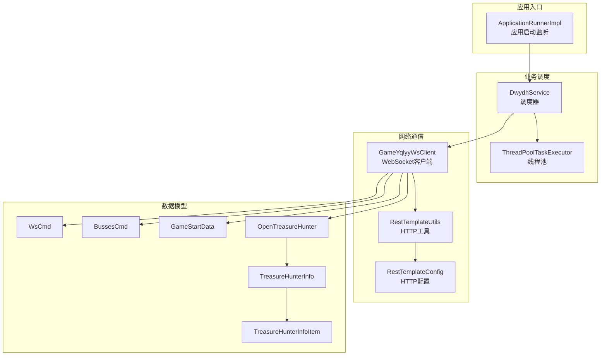
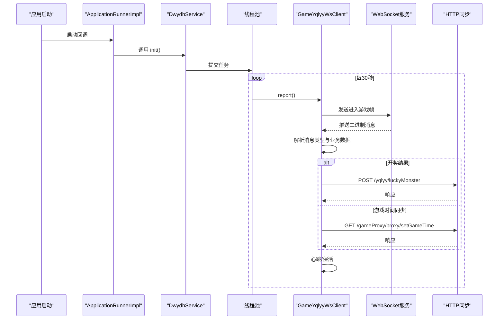
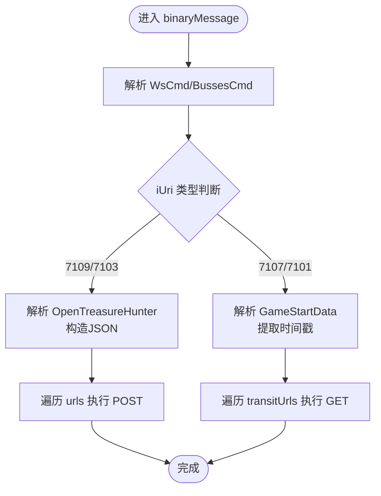
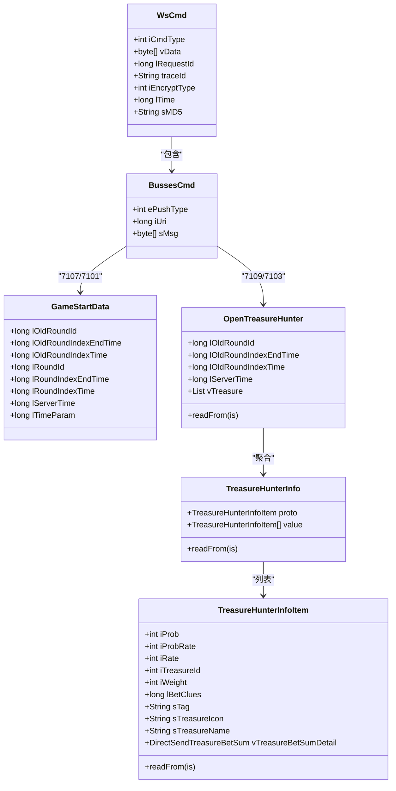
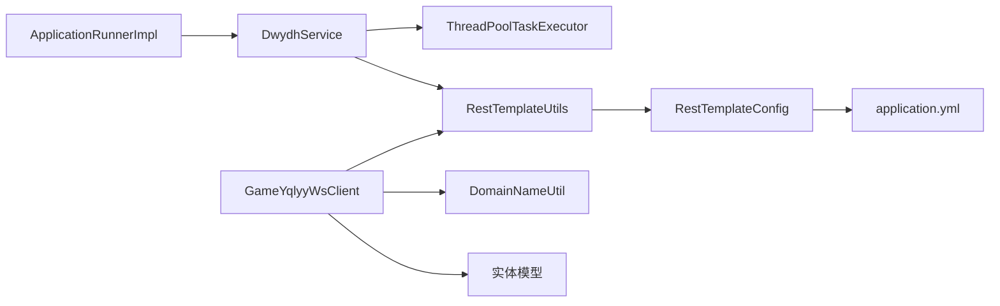

# 业务逻辑模块

<cite>
**本文引用的文件**
- [DwydhService.java](file://src/main/java/com/dwydh/DwydhService.java)
- [GameYqlyyWsClient.java](file://src/main/java/com/yqlyy/GameYqlyyWsClient.java)
- [ApplicationRunnerImpl.java](file://src/main/java/com/listener/ApplicationRunnerImpl.java)
- [RestTemplateUtils.java](file://src/main/java/com/commom/RestTemplateUtils.java)
- [RestTemplateConfig.java](file://src/main/java/com/commom/RestTemplateConfig.java)
- [DomainNameUtil.java](file://src/main/java/com/utils/DomainNameUtil.java)
- [GameStartData.java](file://src/main/java/com/entity/GameStartData.java)
- [WsCmd.java](file://src/main/java/com/entity/WsCmd.java)
- [BussesCmd.java](file://src/main/java/com/entity/BussesCmd.java)
- [OpenTreasureHunter.java](file://src/main/java/com/entity/AccountedNotify/OpenTreasureHunter.java)
- [TreasureHunterInfo.java](file://src/main/java/com/entity/AccountedNotify/TreasureHunterInfo.java)
- [TreasureHunterInfoItem.java](file://src/main/java/com/entity/AccountedNotify/TreasureHunterInfoItem.java)
- [application.yml](file://src/main/resources/application.yml)
</cite>

## 目录
1. [简介](#简介)
2. [项目结构](#项目结构)
3. [核心组件](#核心组件)
4. [架构总览](#架构总览)
5. [详细组件分析](#详细组件分析)
6. [依赖关系分析](#依赖关系分析)
7. [性能与并发特性](#性能与并发特性)
8. [故障排查指南](#故障排查指南)
9. [结论](#结论)
10. [附录](#附录)

## 简介
本文件面向业务逻辑模块的技术文档，重点围绕 DwydhService 服务调度器与 GameYqlyyWsClient WebSocket 客户端的协作，系统性阐述以下内容：
- WebSocket 客户端生命周期管理（连接、心跳、消息解析、异常与重连）
- 服务启动与停止流程（应用启动触发、线程池调度、循环上报）
- 业务执行顺序与状态转换（从游戏数据采集到数据同步）
- 数据同步策略（HTTP 构建、参数传递、响应处理）
- 并发控制与线程安全机制
- 扩展点与自定义配置
- 错误处理与异常恢复的业务层面考虑
- 典型业务场景与最佳实践

## 项目结构
项目采用按领域分层的组织方式，核心业务位于 com.dwydh 与 com.yqlyy 包，通用工具在 com.commom，实体模型在 com.entity，监听器在 com.listener，配置在 resources。

图表来源
- [ApplicationRunnerImpl.java](file://src/main/java/com/listener/ApplicationRunnerImpl.java#L21-L33)
- [DwydhService.java](file://src/main/java/com/dwydh/DwydhService.java#L14-L38)
- [GameYqlyyWsClient.java](file://src/main/java/com/yqlyy/GameYqlyyWsClient.java#L29-L327)
- [RestTemplateUtils.java](file://src/main/java/com/commom/RestTemplateUtils.java#L14-L30)
- [RestTemplateConfig.java](file://src/main/java/com/commom/RestTemplateConfig.java#L34-L131)
- [WsCmd.java](file://src/main/java/com/entity/WsCmd.java#L3-L68)
- [BussesCmd.java](file://src/main/java/com/entity/BussesCmd.java#L3-L9)
- [GameStartData.java](file://src/main/java/com/entity/GameStartData.java#L3-L78)
- [OpenTreasureHunter.java](file://src/main/java/com/entity/AccountedNotify/OpenTreasureHunter.java#L10-L82)
- [TreasureHunterInfo.java](file://src/main/java/com/entity/AccountedNotify/TreasureHunterInfo.java#L10-L43)
- [TreasureHunterInfoItem.java](file://src/main/java/com/entity/AccountedNotify/TreasureHunterInfoItem.java#L8-L123)

章节来源
- [ApplicationRunnerImpl.java](file://src/main/java/com/listener/ApplicationRunnerImpl.java#L21-L33)
- [DwydhService.java](file://src/main/java/com/dwydh/DwydhService.java#L14-L38)
- [RestTemplateConfig.java](file://src/main/java/com/commom/RestTemplateConfig.java#L34-L131)
- [application.yml](file://src/main/resources/application.yml#L1-L31)

## 核心组件
- DwydhService：应用启动后通过线程池调度 WebSocket 客户端，周期性上报并维持连接。
- GameYqlyyWsClient：WebSocket 客户端，负责连接、心跳、二进制消息解析、业务数据提取与 HTTP 同步。
- RestTemplateUtils/RestTemplateConfig：封装 HTTP 客户端，统一 GET/POST/exchange，配置连接池与超时。
- ApplicationRunnerImpl：应用启动回调，调用 DwydhService.init()。
- 实体模型：WsCmd、BussesCmd、GameStartData、OpenTreasureHunter 及其子项，承载协议字段与业务数据结构。

章节来源
- [DwydhService.java](file://src/main/java/com/dwydh/DwydhService.java#L14-L38)
- [GameYqlyyWsClient.java](file://src/main/java/com/yqlyy/GameYqlyyWsClient.java#L29-L327)
- [RestTemplateUtils.java](file://src/main/java/com/commom/RestTemplateUtils.java#L14-L30)
- [RestTemplateConfig.java](file://src/main/java/com/commom/RestTemplateConfig.java#L34-L131)
- [ApplicationRunnerImpl.java](file://src/main/java/com/listener/ApplicationRunnerImpl.java#L21-L33)
- [WsCmd.java](file://src/main/java/com/entity/WsCmd.java#L3-L68)
- [BussesCmd.java](file://src/main/java/com/entity/BussesCmd.java#L3-L9)
- [GameStartData.java](file://src/main/java/com/entity/GameStartData.java#L3-L78)
- [OpenTreasureHunter.java](file://src/main/java/com/entity/AccountedNotify/OpenTreasureHunter.java#L10-L82)
- [TreasureHunterInfo.java](file://src/main/java/com/entity/AccountedNotify/TreasureHunterInfo.java#L10-L43)
- [TreasureHunterInfoItem.java](file://src/main/java/com/entity/AccountedNotify/TreasureHunterInfoItem.java#L8-L123)

## 架构总览
下图展示从应用启动到业务数据采集与同步的全链路交互：

图表来源
- [ApplicationRunnerImpl.java](file://src/main/java/com/listener/ApplicationRunnerImpl.java#L25-L30)
- [DwydhService.java](file://src/main/java/com/dwydh/DwydhService.java#L21-L36)
- [GameYqlyyWsClient.java](file://src/main/java/com/yqlyy/GameYqlyyWsClient.java#L274-L290)
- [RestTemplateUtils.java](file://src/main/java/com/commom/RestTemplateUtils.java#L19-L29)

章节来源
- [ApplicationRunnerImpl.java](file://src/main/java/com/listener/ApplicationRunnerImpl.java#L21-L33)
- [DwydhService.java](file://src/main/java/com/dwydh/DwydhService.java#L14-L38)
- [GameYqlyyWsClient.java](file://src/main/java/com/yqlyy/GameYqlyyWsClient.java#L221-L290)
- [RestTemplateUtils.java](file://src/main/java/com/commom/RestTemplateUtils.java#L14-L30)

## 详细组件分析

### DwydhService 服务调度器
职责与行为
- 在应用启动后，使用线程池提交一个无限循环任务。
- 循环内实例化 WebSocket 客户端，周期性调用 report()，默认间隔 30 秒。
- 异常中断时捕获 InterruptedException，避免线程退出。

生命周期与控制流
- 启动：ApplicationRunnerImpl.run() 调用 DwydhService.init()。
- 运行：线程池执行循环，内部持续上报与连接维护。
- 停止：当前实现为无限循环，无显式停止信号；可通过外部中断或 JVM 生命周期结束。

并发与线程安全
- 使用 @Service 注解的 Spring Bean，默认单例作用域。
- 线程池由 Spring 管理，循环任务在独立线程中执行，避免阻塞主线程。
- 注意：DwydhService 内部未对共享状态加锁，若后续扩展共享变量需考虑同步。

章节来源
- [DwydhService.java](file://src/main/java/com/dwydh/DwydhService.java#L14-L38)
- [ApplicationRunnerImpl.java](file://src/main/java/com/listener/ApplicationRunnerImpl.java#L25-L30)

### GameYqlyyWsClient WebSocket 客户端
生命周期管理
- 连接：connect() 使用 WebSocketContainer 建立连接，设置缓冲区与超时。
- 打开：onOpen() 发送进入游戏帧，准备接收业务推送。
- 消息：binaryMessage() 解析二进制帧，根据 iUri 分派不同业务处理。
- 关闭与异常：onClose()/onError() 记录日志；report() 中出现 IO 异常时触发重连。

业务数据采集与同步
- 开奖结果（iUri=7109/7103）：解析 OpenTreasureHunter，抽取动物信息，构造 JSON，向 DomainNameUtil.urls 列表逐个 POST /yqlyy/luckyMonster 或 /mls/luckyMonster。
- 游戏时间同步（iUri=7107/7101）：解析 GameStartData，提取时间戳，向 DomainNameUtil.transitUrls 列表逐个 GET /gameProxy/proxy/setGameTime。

线程安全与并发
- connect()/report() 标记为 synchronized，避免并发重复连接或发送。
- 会话状态 session 非线程安全，但仅在同步方法内访问，降低竞态风险。
- 多 URL 同步采用串行循环，避免并发风暴；如需提升吞吐，可引入限流与异步队列。

错误处理与恢复
- 连接失败/IO 异常：记录错误日志，必要时重连。
- HTTP 请求异常：捕获 RestClientException 与通用异常，记录警告/错误日志，不影响主循环继续。

图表来源
- [GameYqlyyWsClient.java](file://src/main/java/com/yqlyy/GameYqlyyWsClient.java#L51-L218)
- [OpenTreasureHunter.java](file://src/main/java/com/entity/AccountedNotify/OpenTreasureHunter.java#L73-L81)
- [GameStartData.java](file://src/main/java/com/entity/GameStartData.java#L12-L76)

章节来源
- [GameYqlyyWsClient.java](file://src/main/java/com/yqlyy/GameYqlyyWsClient.java#L29-L327)
- [OpenTreasureHunter.java](file://src/main/java/com/entity/AccountedNotify/OpenTreasureHunter.java#L10-L82)
- [TreasureHunterInfo.java](file://src/main/java/com/entity/AccountedNotify/TreasureHunterInfo.java#L10-L43)
- [TreasureHunterInfoItem.java](file://src/main/java/com/entity/AccountedNotify/TreasureHunterInfoItem.java#L8-L123)
- [GameStartData.java](file://src/main/java/com/entity/GameStartData.java#L3-L78)

### HTTP 同步策略与数据模型
HTTP 请求构建
- POST：RestTemplateUtils.post(url, body, responseType)，用于开奖结果同步。
- GET：RestTemplateUtils.get(url, responseType)，用于时间同步。
- 参数传递：URL 查询参数（如 time、gameId），JSON 正文（如 monsterId、monsterName）。
- 响应处理：统一读取响应体字符串，记录 info/warn/error 日志。

数据模型
- WsCmd：承载命令类型与附加数据。
- BussesCmd：承载推送 URI 与消息体。
- GameStartData：承载轮次与时间戳等字段。
- OpenTreasureHunter/TreasureHunterInfo/TreasureHunterInfoItem：承载开奖动物列表及属性。

图表来源
- [WsCmd.java](file://src/main/java/com/entity/WsCmd.java#L3-L68)
- [BussesCmd.java](file://src/main/java/com/entity/BussesCmd.java#L3-L9)
- [GameStartData.java](file://src/main/java/com/entity/GameStartData.java#L3-L78)
- [OpenTreasureHunter.java](file://src/main/java/com/entity/AccountedNotify/OpenTreasureHunter.java#L10-L82)
- [TreasureHunterInfo.java](file://src/main/java/com/entity/AccountedNotify/TreasureHunterInfo.java#L10-L43)
- [TreasureHunterInfoItem.java](file://src/main/java/com/entity/AccountedNotify/TreasureHunterInfoItem.java#L8-L123)

章节来源
- [RestTemplateUtils.java](file://src/main/java/com/commom/RestTemplateUtils.java#L14-L30)
- [WsCmd.java](file://src/main/java/com/entity/WsCmd.java#L3-L68)
- [BussesCmd.java](file://src/main/java/com/entity/BussesCmd.java#L3-L9)
- [GameStartData.java](file://src/main/java/com/entity/GameStartData.java#L3-L78)
- [OpenTreasureHunter.java](file://src/main/java/com/entity/AccountedNotify/OpenTreasureHunter.java#L10-L82)
- [TreasureHunterInfo.java](file://src/main/java/com/entity/AccountedNotify/TreasureHunterInfo.java#L10-L43)
- [TreasureHunterInfoItem.java](file://src/main/java/com/entity/AccountedNotify/TreasureHunterInfoItem.java#L8-L123)

## 依赖关系分析
- DwydhService 依赖 ThreadPoolTaskExecutor 与 RestTemplateUtils。
- GameYqlyyWsClient 依赖 RestTemplateUtils、DomainNameUtil、实体模型。
- RestTemplateConfig 通过 @Value 注入 application.yml 的 HTTP 配置，供 RestTemplate 使用。
- ApplicationRunnerImpl 依赖 DwydhService，作为应用启动入口。

图表来源
- [DwydhService.java](file://src/main/java/com/dwydh/DwydhService.java#L16-L19)
- [GameYqlyyWsClient.java](file://src/main/java/com/yqlyy/GameYqlyyWsClient.java#L32-L42)
- [RestTemplateUtils.java](file://src/main/java/com/commom/RestTemplateUtils.java#L16-L17)
- [RestTemplateConfig.java](file://src/main/java/com/commom/RestTemplateConfig.java#L35-L54)
- [application.yml](file://src/main/resources/application.yml#L16-L30)
- [ApplicationRunnerImpl.java](file://src/main/java/com/listener/ApplicationRunnerImpl.java#L22-L23)

章节来源
- [DwydhService.java](file://src/main/java/com/dwydh/DwydhService.java#L14-L38)
- [GameYqlyyWsClient.java](file://src/main/java/com/yqlyy/GameYqlyyWsClient.java#L29-L44)
- [RestTemplateUtils.java](file://src/main/java/com/commom/RestTemplateUtils.java#L14-L30)
- [RestTemplateConfig.java](file://src/main/java/com/commom/RestTemplateConfig.java#L34-L131)
- [application.yml](file://src/main/resources/application.yml#L1-L31)
- [ApplicationRunnerImpl.java](file://src/main/java/com/listener/ApplicationRunnerImpl.java#L21-L33)

## 性能与并发特性
- 连接池与超时：RestTemplateConfig 基于 Apache HttpClient，配置最大连接数、路由并发、连接超时、套接字超时、空闲校验等，提升稳定性与吞吐。
- 线程模型：DwydhService 使用线程池执行长周期任务，避免阻塞应用启动与其它组件。
- 并发控制：GameYqlyyWsClient 的 connect()/report() 同步方法减少并发连接与发送冲突；多 URL 同步采用串行循环，避免抖动。
- 建议优化：
  - 将无限循环改为可中断的 ScheduledExecutorService，支持优雅停机。
  - 对多 URL 同步引入限速与异步队列，结合重试与熔断策略。
  - 对 WebSocket 心跳与保活参数进行动态调整，以适配网络波动。

章节来源
- [RestTemplateConfig.java](file://src/main/java/com/commom/RestTemplateConfig.java#L84-L129)
- [application.yml](file://src/main/resources/application.yml#L16-L30)
- [DwydhService.java](file://src/main/java/com/dwydh/DwydhService.java#L21-L36)
- [GameYqlyyWsClient.java](file://src/main/java/com/yqlyy/GameYqlyyWsClient.java#L250-L290)

## 故障排查指南
常见问题与定位思路
- WebSocket 连接失败
  - 检查 wsUrl 是否为空或不可达；查看 connect() 日志与异常栈。
  - 关注 onOpen 发送帧是否成功，确认服务端鉴权与握手流程。
- 消息解析异常
  - 核对二进制帧结构与 iCmdType/iUri；确认 TARS 流解析位置正确。
  - 检查 OpenTreasureHunter/GameStartData 字段读取索引是否匹配协议版本。
- HTTP 同步失败
  - 查看 URLs/transitUrls 配置是否正确；确认目标服务可达。
  - 观察 RestClientException 与通用异常日志，定位超时或格式错误。
- 线程池与内存
  - 监控线程池队列长度与拒绝策略；避免大量阻塞任务导致积压。

章节来源
- [GameYqlyyWsClient.java](file://src/main/java/com/yqlyy/GameYqlyyWsClient.java#L250-L290)
- [RestTemplateUtils.java](file://src/main/java/com/commom/RestTemplateUtils.java#L19-L29)
- [application.yml](file://src/main/resources/application.yml#L16-L30)

## 结论
该业务逻辑模块通过 DwydhService 与 GameYqlyyWsClient 的协同，实现了从 WebSocket 数据采集到 HTTP 同步的关键闭环。整体设计简洁清晰，具备良好的可扩展性。建议后续在停止流程、并发同步、异常恢复与配置治理方面进一步完善，以满足生产环境的高可用与可观测性要求。

## 附录

### 扩展点与自定义配置
- 自定义 URLs/transitUrls：在 DomainNameUtil 中添加目标服务地址，支持多活与灰度发布。
- 调整上报周期：修改 DwydhService 中的 sleep 时间，平衡实时性与资源消耗。
- 动态 wsUrl：在 connect() 中增加远程拉取逻辑，支持动态切换上游。
- HTTP 超时与重试：通过 application.yml 与 RestTemplateConfig 调整连接池与超时参数，结合指数退避策略。

章节来源
- [DomainNameUtil.java](file://src/main/java/com/utils/DomainNameUtil.java#L3-L15)
- [DwydhService.java](file://src/main/java/com/dwydh/DwydhService.java#L28-L29)
- [application.yml](file://src/main/resources/application.yml#L16-L30)
- [RestTemplateConfig.java](file://src/main/java/com/commom/RestTemplateConfig.java#L84-L129)

### 业务场景示例与最佳实践
- 场景一：千与千寻（iUri=7109/7103）
  - 行为：解析开奖动物列表，构造 JSON，向 urls 列表同步。
  - 建议：对 urls 增加幂等标识与去重，确保重复消息不产生重复写入。
- 场景二：宠物马拉松（iUri=7107/7101）
  - 行为：解析旧轮次时间戳，向 transitUrls 同步时间。
  - 建议：对时间同步增加本地缓存与差值校验，避免重复同步。
- 最佳实践
  - 统一日志规范：区分 info/warn/error，便于检索与告警。
  - 资源隔离：将不同业务的 HTTP 调用拆分到独立线程或队列，避免相互影响。
  - 监控埋点：在关键节点（连接、解析、同步）埋点，形成指标看板。

章节来源
- [GameYqlyyWsClient.java](file://src/main/java/com/yqlyy/GameYqlyyWsClient.java#L76-L118)
- [GameYqlyyWsClient.java](file://src/main/java/com/yqlyy/GameYqlyyWsClient.java#L136-L147)
- [OpenTreasureHunter.java](file://src/main/java/com/entity/AccountedNotify/OpenTreasureHunter.java#L73-L81)
- [GameStartData.java](file://src/main/java/com/entity/GameStartData.java#L12-L76)