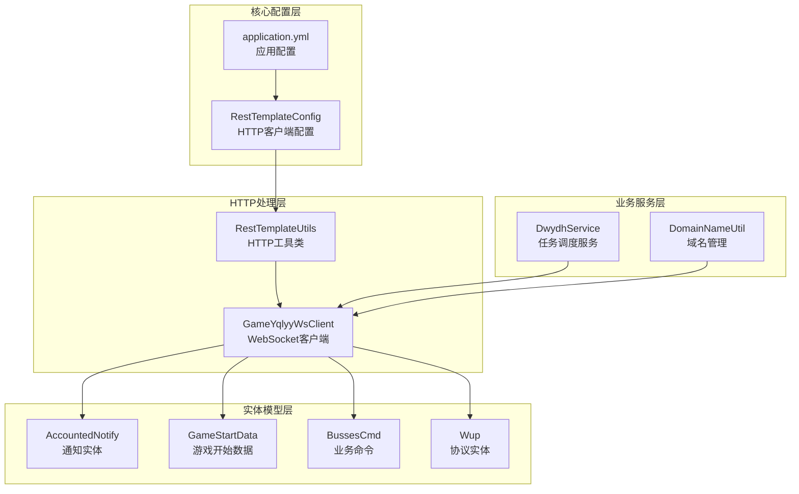
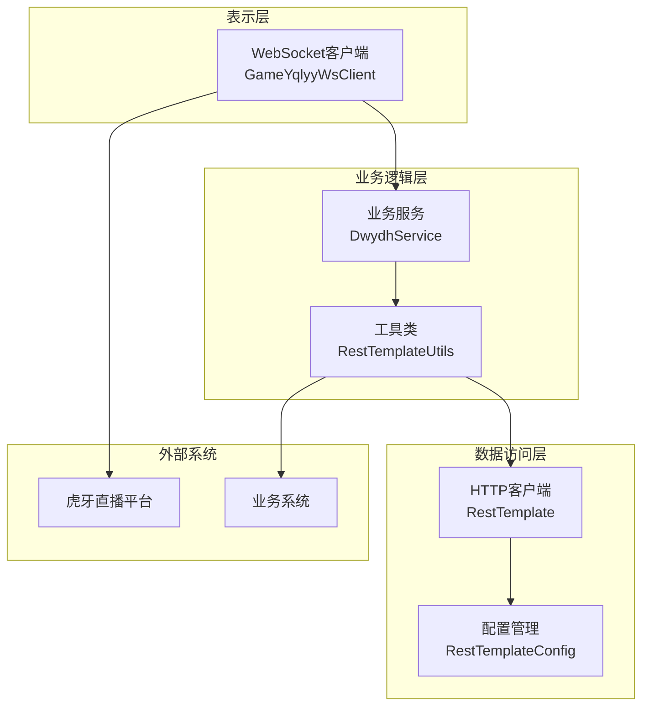
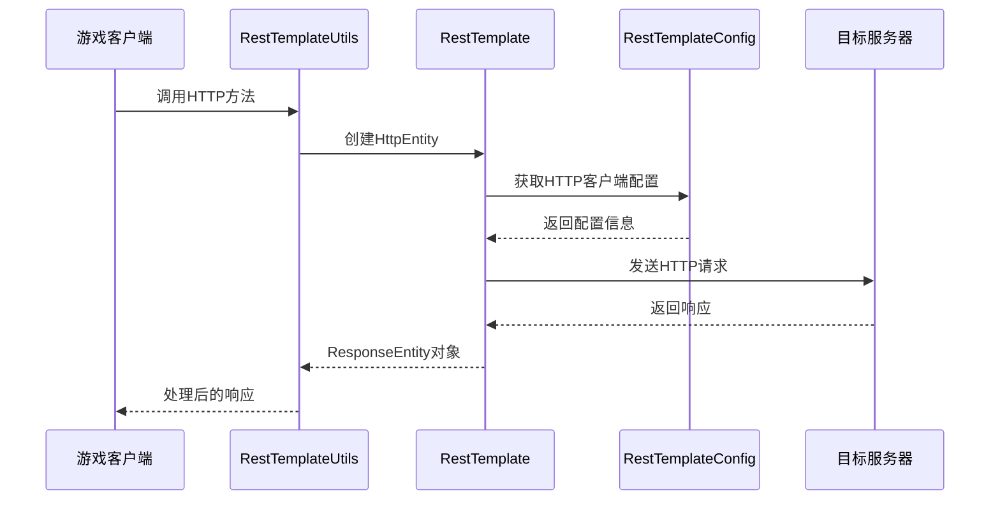
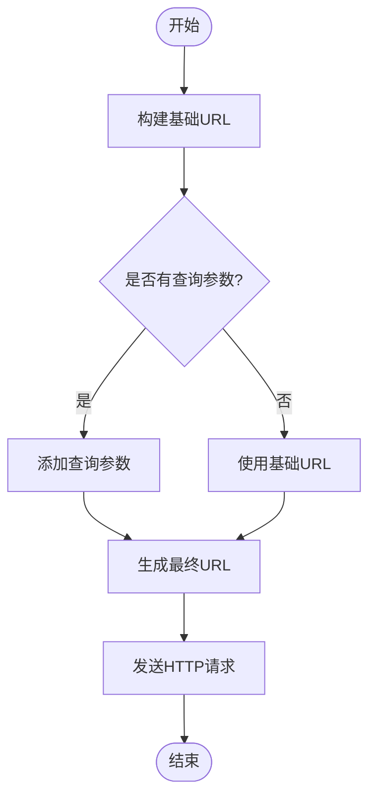
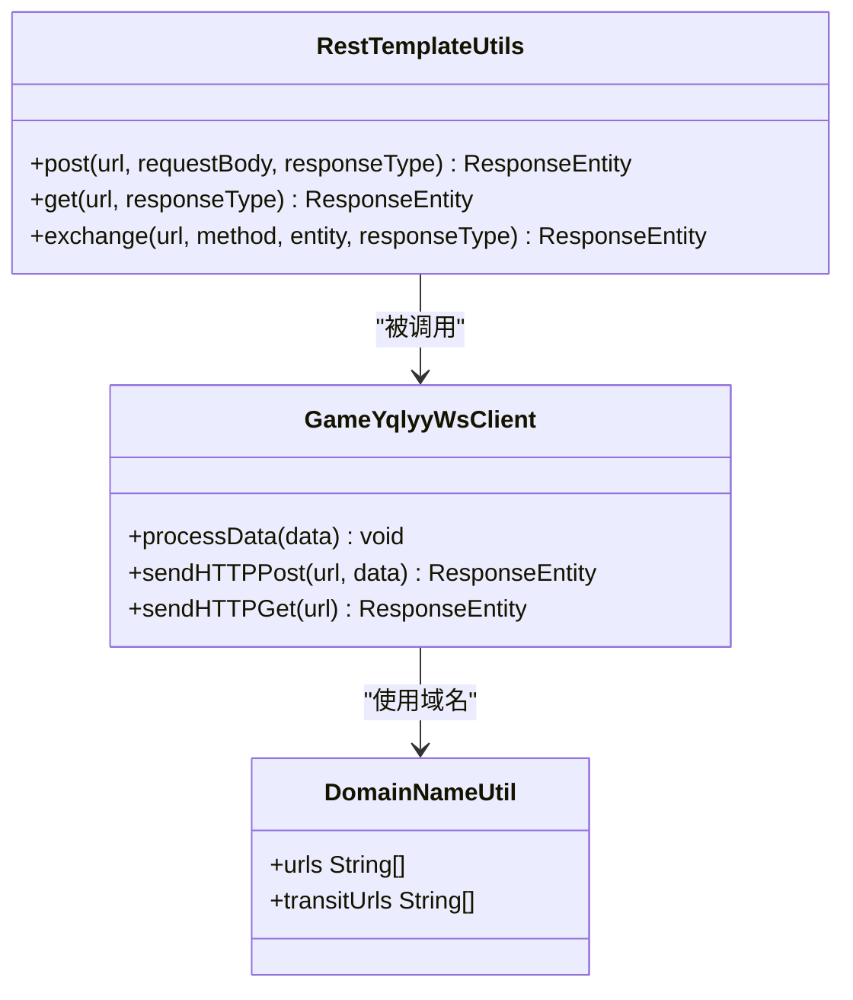
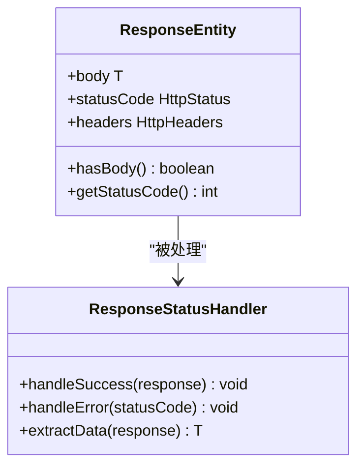
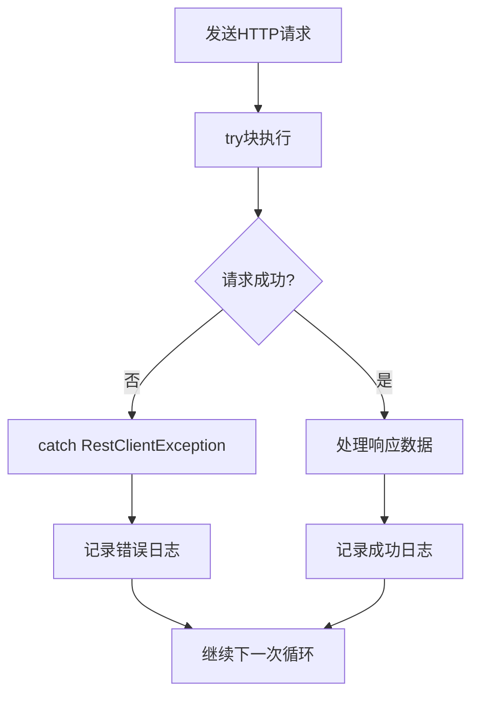
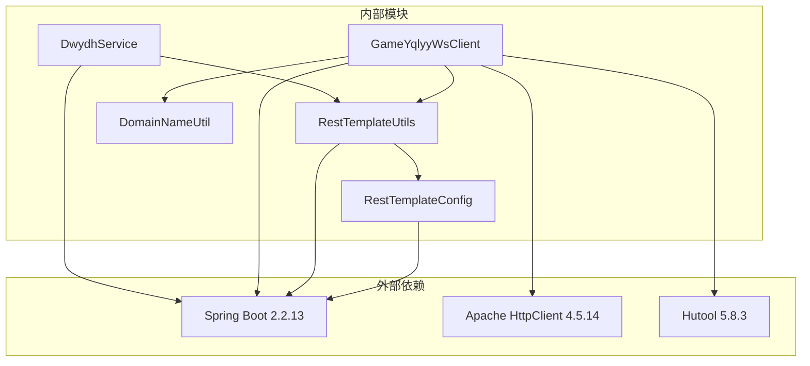
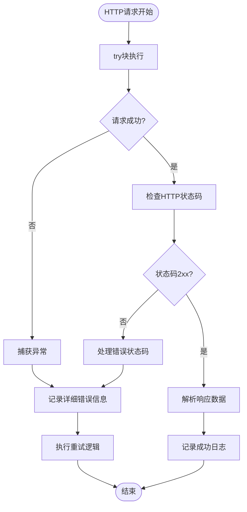

# HTTP请求处理机制

<cite>
**本文档引用的文件**
- [RestTemplateUtils.java](file://src/main/java/com/commom/RestTemplateUtils.java)
- [RestTemplateConfig.java](file://src/main/java/com/commom/RestTemplateConfig.java)
- [GameYqlyyWsClient.java](file://src/main/java/com/yqlyy/GameYqlyyWsClient.java)
- [DwydhService.java](file://src/main/java/com/dwydh/DwydhService.java)
- [application.yml](file://src/main/resources/application.yml)
- [DomainNameUtil.java](file://src/main/java/com/utils/DomainNameUtil.java)
</cite>

## 目录
1. [简介](#简介)
2. [项目结构](#项目结构)
3. [核心组件](#核心组件)
4. [架构概览](#架构概览)
5. [详细组件分析](#详细组件分析)
6. [依赖关系分析](#依赖关系分析)
7. [性能考虑](#性能考虑)
8. [故障排除指南](#故障排除指南)
9. [结论](#结论)

## 简介

本项目实现了基于Spring Boot的HTTP请求处理机制，通过封装RestTemplate提供了简洁的HTTP客户端接口。该系统主要用于虎牙直播平台的数据采集，包括实时游戏数据抓取和开奖结果同步等功能。

系统采用分层架构设计，核心HTTP处理逻辑集中在RestTemplateUtils工具类中，通过RestTemplateConfig进行全局配置，GameYqlyyWsClient负责WebSocket连接和数据处理，DwydhService提供任务调度功能。

## 项目结构

项目采用标准的Spring Boot目录结构，主要包含以下模块：

**图表来源**
- [RestTemplateConfig.java](file://src/main/java/com/commom/RestTemplateConfig.java#L33-L131)
- [RestTemplateUtils.java](file://src/main/java/com/commom/RestTemplateUtils.java#L1-L31)
- [GameYqlyyWsClient.java](file://src/main/java/com/yqlyy/GameYqlyyWsClient.java#L1-L328)

**章节来源**
- [RestTemplateConfig.java](file://src/main/java/com/commom/RestTemplateConfig.java#L1-L132)
- [RestTemplateUtils.java](file://src/main/java/com/commom/RestTemplateUtils.java#L1-L31)
- [application.yml](file://src/main/resources/application.yml#L1-L31)

## 核心组件

### RestTemplateUtils 工具类

RestTemplateUtils是HTTP请求处理的核心工具类，提供了三个主要方法：

- **post方法**：用于POST请求，支持JSON数据传输
- **get方法**：用于GET请求，支持查询参数
- **exchange方法**：通用HTTP方法，支持所有HTTP动词

该类通过依赖注入获得RestTemplate实例，并直接委托给Spring的RestTemplate进行HTTP请求处理。

**章节来源**
- [RestTemplateUtils.java](file://src/main/java/com/commom/RestTemplateUtils.java#L14-L30)

### RestTemplateConfig 配置类

RestTemplateConfig负责整个HTTP客户端的全局配置，包括：

- **连接池配置**：最大连接数、路由并发数、空闲验证
- **超时配置**：连接超时、请求超时、套接字超时
- **默认请求头**：User-Agent、Accept-Encoding、Content-Type等
- **重试机制**：自动重试策略
- **Keep-Alive**：连接保持策略

**章节来源**
- [RestTemplateConfig.java](file://src/main/java/com/commom/RestTemplateConfig.java#L34-L131)
- [application.yml](file://src/main/resources/application.yml#L16-L30)

### GameYqlyyWsClient WebSocket客户端

GameYqlyyWsClient是一个WebSocket客户端，负责与虎牙直播平台建立实时连接，处理游戏数据推送：

- **WebSocket连接管理**：自动重连机制
- **数据解析**：使用TARS协议解析二进制数据
- **HTTP请求转发**：将解析到的游戏数据通过HTTP请求转发到业务系统
- **异常处理**：完善的错误捕获和日志记录

**章节来源**
- [GameYqlyyWsClient.java](file://src/main/java/com/yqlyy/GameYqlyyWsClient.java#L29-L328)

## 架构概览

系统采用分层架构，各层职责清晰分离：

**图表来源**
- [GameYqlyyWsClient.java](file://src/main/java/com/yqlyy/GameYqlyyWsClient.java#L30-L44)
- [DwydhService.java](file://src/main/java/com/dwydh/DwydhService.java#L12-L38)
- [RestTemplateUtils.java](file://src/main/java/com/commom/RestTemplateUtils.java#L16-L17)

## 详细组件分析

### HTTP请求构建流程

HTTP请求的构建过程遵循以下步骤：

**图表来源**
- [RestTemplateUtils.java](file://src/main/java/com/commom/RestTemplateUtils.java#L19-L29)
- [RestTemplateConfig.java](file://src/main/java/com/commom/RestTemplateConfig.java#L62-L107)

### URL组装机制

URL组装采用字符串拼接的方式，支持查询参数的动态添加：

**图表来源**
- [GameYqlyyWsClient.java](file://src/main/java/com/yqlyy/GameYqlyyWsClient.java#L103-L106)
- [GameYqlyyWsClient.java](file://src/main/java/com/yqlyy/GameYqlyyWsClient.java#L138-L140)

### 请求头设置策略

系统通过RestTemplateConfig统一设置默认请求头：

- **User-Agent**：模拟浏览器访问
- **Accept-Encoding**：支持gzip压缩
- **Accept-Language**：指定语言偏好
- **Connection**：保持连接
- **Content-Type**：JSON格式数据

这些设置确保了与目标服务器的兼容性和性能优化。

**章节来源**
- [RestTemplateConfig.java](file://src/main/java/com/commom/RestTemplateConfig.java#L94-L100)

### 请求体序列化机制

请求体的序列化采用JSON格式，通过Hutool工具库进行数据转换：

**图表来源**
- [RestTemplateUtils.java](file://src/main/java/com/commom/RestTemplateUtils.java#L19-L29)
- [GameYqlyyWsClient.java](file://src/main/java/com/yqlyy/GameYqlyyWsClient.java#L89-L117)
- [DomainNameUtil.java](file://src/main/java/com/utils/DomainNameUtil.java#L3-L15)

### 不同HTTP方法的适用场景

| 方法 | 适用场景 | 参数传递机制 | 示例 |
|------|----------|-------------|------|
| GET | 获取数据、查询参数 | URL查询字符串 | `/api/data?param=value` |
| POST | 提交数据、创建资源 | 请求体JSON | `{data: "value"}` |
| EXCHANGE | 通用方法、自定义动词 | HttpEntity封装 | 支持PUT、DELETE等 |

**章节来源**
- [GameYqlyyWsClient.java](file://src/main/java/com/yqlyy/GameYqlyyWsClient.java#L105-L107)
- [GameYqlyyWsClient.java](file://src/main/java/com/yqlyy/GameYqlyyWsClient.java#L138-L140)

### ResponseEntity响应处理

ResponseEntity提供了完整的HTTP响应信息：

**图表来源**
- [GameYqlyyWsClient.java](file://src/main/java/com/yqlyy/GameYqlyyWsClient.java#L106-L108)
- [GameYqlyyWsClient.java](file://src/main/java/com/yqlyy/GameYqlyyWsClient.java#L139-L141)

### 状态码判断逻辑

系统采用异常处理机制进行状态码判断：

**图表来源**
- [GameYqlyyWsClient.java](file://src/main/java/com/yqlyy/GameYqlyyWsClient.java#L108-L114)
- [GameYqlyyWsClient.java](file://src/main/java/com/yqlyy/GameYqlyyWsClient.java#L142-L147)

**章节来源**
- [GameYqlyyWsClient.java](file://src/main/java/com/yqlyy/GameYqlyyWsClient.java#L104-L114)

## 依赖关系分析

系统依赖关系清晰，层次分明：

**图表来源**
- [pom.xml](file://pom.xml#L26-L83)
- [RestTemplateConfig.java](file://src/main/java/com/commom/RestTemplateConfig.java#L3-L22)

**章节来源**
- [pom.xml](file://pom.xml#L1-L83)

## 性能考虑

### 连接池优化

系统通过连接池配置实现高性能HTTP通信：

- **最大连接数**：100个连接
- **路由并发数**：每个路由最多20个并发
- **空闲验证**：3000000毫秒后验证连接有效性
- **Keep-Alive策略**：保持连接活跃状态

### 超时配置优化

合理的超时配置确保系统的稳定性和响应性：

- **连接超时**：10秒
- **请求超时**：500毫秒  
- **套接字超时**：30秒
- **连接检查**：启用陈旧连接检查

### 压缩和缓存

- **GZIP压缩**：支持响应压缩，减少网络传输
- **Keep-Alive**：复用TCP连接，降低握手开销
- **连接池**：避免频繁创建连接的开销

## 故障排除指南

### 常见问题及解决方案

| 问题类型 | 症状 | 解决方案 |
|----------|------|----------|
| 连接超时 | RestClientException: Connect timeout | 增加connectTimeout配置 |
| 请求超时 | RestClientException: Read timeout | 调整socketTimeout值 |
| 连接池耗尽 | 连接获取超时 | 增加maxTotal或调整请求超时 |
| 编码问题 | 中文乱码 | 设置正确的Content-Type和字符集 |
| 重定向问题 | 3xx状态码处理 | 配置重定向跟随策略 |

### 错误处理最佳实践

**图表来源**
- [GameYqlyyWsClient.java](file://src/main/java/com/yqlyy/GameYqlyyWsClient.java#L108-L114)

**章节来源**
- [GameYqlyyWsClient.java](file://src/main/java/com/yqlyy/GameYqlyyWsClient.java#L104-L114)

### 监控和调试

- **日志记录**：详细的请求和响应日志
- **异常监控**：捕获并记录所有HTTP异常
- **性能指标**：连接池使用情况监控
- **健康检查**：定期检查外部服务可用性

## 结论

本HTTP请求处理机制通过简洁的工具类封装和完善的配置管理，为虎牙直播平台的数据采集提供了稳定可靠的技术支撑。系统的主要优势包括：

1. **简洁易用**：通过RestTemplateUtils提供统一的HTTP接口
2. **性能优异**：合理的连接池和超时配置
3. **稳定性强**：完善的异常处理和重试机制
4. **扩展性强**：模块化设计便于功能扩展

在实际使用中，建议根据具体业务需求调整超时参数和连接池配置，同时建立完善的监控体系来确保系统的稳定运行。