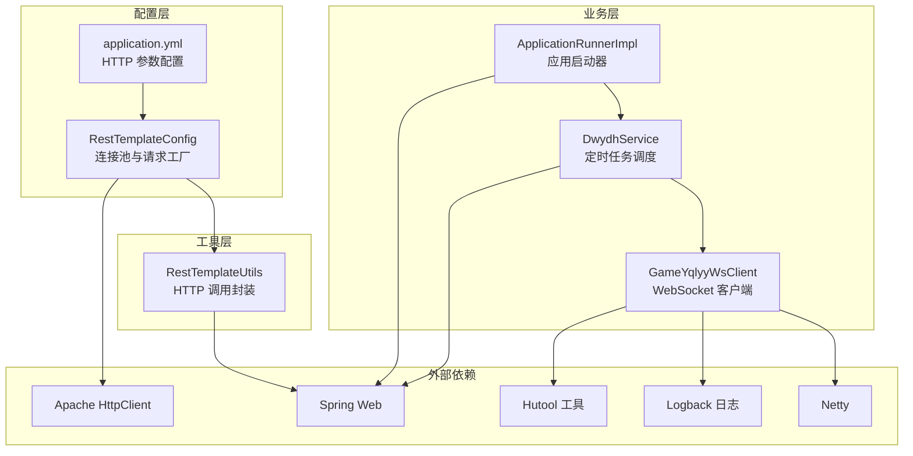
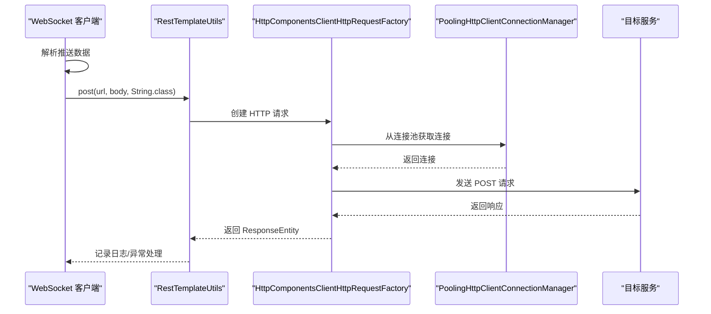
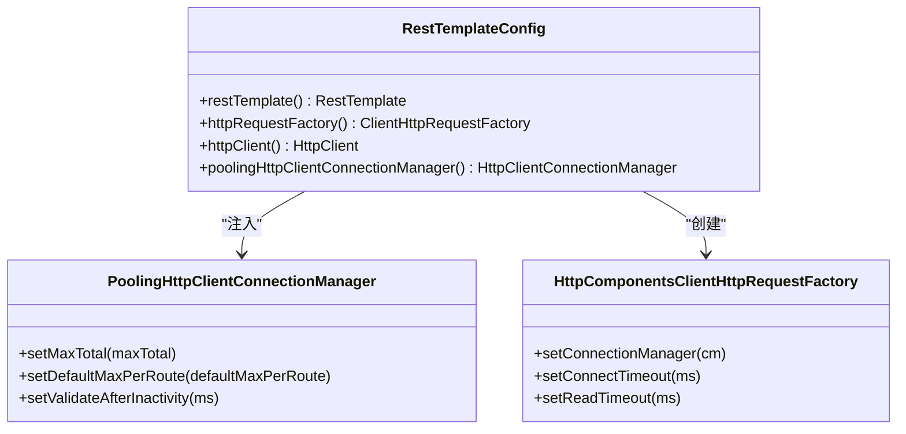
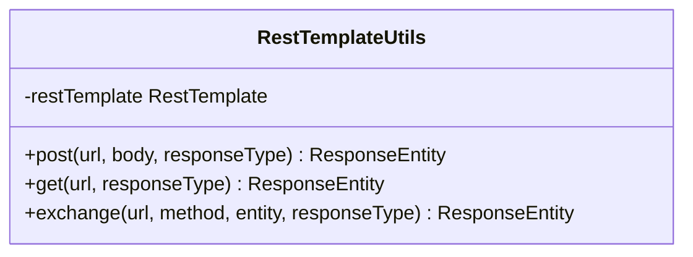
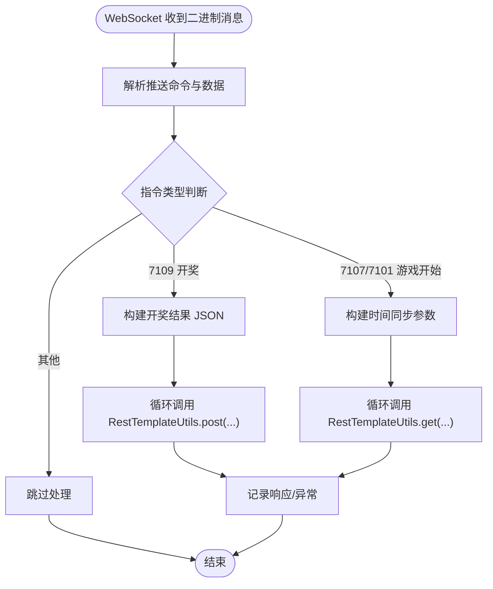
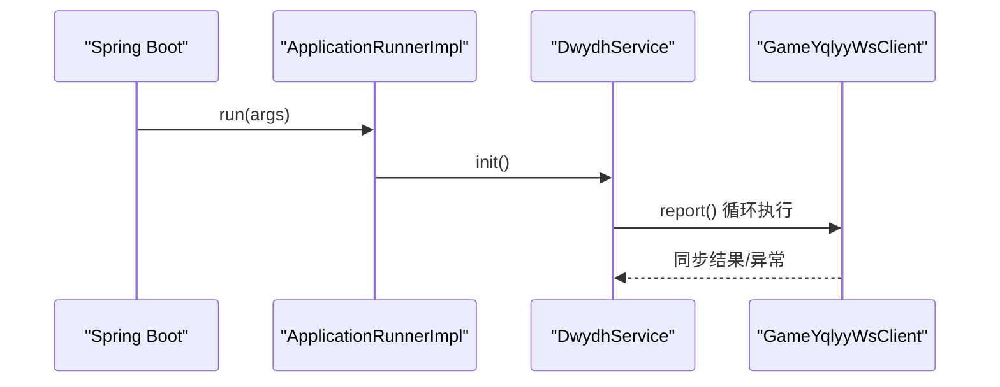
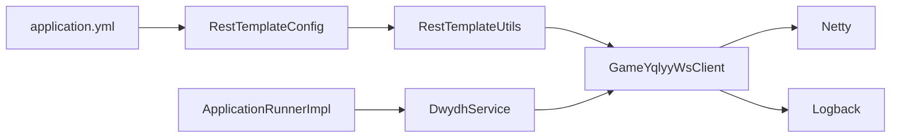

# 性能优化策略

<cite>
**本文引用的文件**
- [RestTemplateConfig.java](file://src/main/java/com/commom/RestTemplateConfig.java)
- [RestTemplateUtils.java](file://src/main/java/com/commom/RestTemplateUtils.java)
- [application.yml](file://src/main/resources/application.yml)
- [DwydhService.java](file://src/main/java/com/dwydh/DwydhService.java)
- [GameYqlyyWsClient.java](file://src/main/java/com/yqlyy/GameYqlyyWsClient.java)
- [ApplicationRunnerImpl.java](file://src/main/java/com/listener/ApplicationRunnerImpl.java)
- [DomainNameUtil.java](file://src/main/java/com/utils/DomainNameUtil.java)
- [pom.xml](file://pom.xml)
</cite>

## 目录
1. [引言](#引言)
2. [项目结构](#项目结构)
3. [核心组件](#核心组件)
4. [架构总览](#架构总览)
5. [详细组件分析](#详细组件分析)
6. [依赖关系分析](#依赖关系分析)
7. [性能考虑](#性能考虑)
8. [故障排查指南](#故障排查指南)
9. [结论](#结论)
10. [附录](#附录)

## 引言
本技术文档围绕项目中的性能优化策略展开，重点覆盖以下方面：
- RestTemplate 连接池的配置与调优参数（最大连接数、连接超时、请求超时等）
- HTTP 请求的并发处理能力与吞吐量优化
- 数据同步过程中的内存管理与垃圾回收优化
- 网络 I/O 的优化技巧（连接复用、压缩传输等）
- 性能监控指标与基准测试方法
- 具体配置示例与调优案例

## 项目结构
该项目为基于 Spring Boot 的应用，主要模块如下：
- 配置层：RestTemplate 连接池与 HTTP 客户端配置
- 工具层：封装 RestTemplate 的通用调用工具类
- 业务层：定时任务与 WebSocket 客户端，负责数据采集与同步
- 配置文件：HTTP 连接池参数与应用基础配置
- 依赖管理：Spring Web、Apache HttpClient、Netty、日志与工具库等

图表来源
- [RestTemplateConfig.java](file://src/main/java/com/commom/RestTemplateConfig.java#L34-L131)
- [RestTemplateUtils.java](file://src/main/java/com/commom/RestTemplateUtils.java#L14-L30)
- [application.yml](file://src/main/resources/application.yml#L16-L30)
- [DwydhService.java](file://src/main/java/com/dwydh/DwydhService.java#L12-L38)
- [GameYqlyyWsClient.java](file://src/main/java/com/yqlyy/GameYqlyyWsClient.java#L29-L327)
- [ApplicationRunnerImpl.java](file://src/main/java/com/listener/ApplicationRunnerImpl.java#L21-L31)

章节来源
- [RestTemplateConfig.java](file://src/main/java/com/commom/RestTemplateConfig.java#L34-L131)
- [application.yml](file://src/main/resources/application.yml#L16-L30)
- [DwydhService.java](file://src/main/java/com/dwydh/DwydhService.java#L12-L38)
- [GameYqlyyWsClient.java](file://src/main/java/com/yqlyy/GameYqlyyWsClient.java#L29-L327)
- [ApplicationRunnerImpl.java](file://src/main/java/com/listener/ApplicationRunnerImpl.java#L21-L31)

## 核心组件
- RestTemplateConfig：定义连接池、请求配置、默认头信息、重试策略与 Keep-Alive 策略，并通过 Bean 注入到 Spring 容器。
- RestTemplateUtils：对 RestTemplate 的 GET/POST/exchange 方法进行封装，简化业务调用。
- application.yml：集中管理 HTTP 连接池的关键参数，如最大连接数、并发路由数、连接超时、请求超时、套接字超时、连接有效性检查等。
- DwydhService：使用线程池定时触发 WebSocket 客户端上报逻辑。
- GameYqlyyWsClient：WebSocket 客户端，负责接收推送数据并同步到下游系统；同时包含 WebSocket 容器的缓冲区与超时配置。
- ApplicationRunnerImpl：应用启动后初始化定时任务。

章节来源
- [RestTemplateConfig.java](file://src/main/java/com/commom/RestTemplateConfig.java#L34-L131)
- [RestTemplateUtils.java](file://src/main/java/com/commom/RestTemplateUtils.java#L14-L30)
- [application.yml](file://src/main/resources/application.yml#L16-L30)
- [DwydhService.java](file://src/main/java/com/dwydh/DwydhService.java#L12-L38)
- [GameYqlyyWsClient.java](file://src/main/java/com/yqlyy/GameYqlyyWsClient.java#L29-L327)
- [ApplicationRunnerImpl.java](file://src/main/java/com/listener/ApplicationRunnerImpl.java#L21-L31)

## 架构总览
下图展示了从 WebSocket 推送数据到下游系统的完整链路，以及 HTTP 请求工厂与连接池在其中的作用。

图表来源
- [GameYqlyyWsClient.java](file://src/main/java/com/yqlyy/GameYqlyyWsClient.java#L103-L114)
- [RestTemplateUtils.java](file://src/main/java/com/commom/RestTemplateUtils.java#L19-L29)
- [RestTemplateConfig.java](file://src/main/java/com/commom/RestTemplateConfig.java#L74-L107)

## 详细组件分析

### RestTemplate 连接池与 HTTP 请求工厂
- 连接池参数
  - 最大连接总数：由配置项控制，决定全局并发上限
  - 每路由最大连接数：限制同一目标主机的并发连接数
  - 连接超时时间：建立 TCP 连接的超时阈值
  - 从连接池获取连接的超时时间：阻塞等待可用连接的最长等待时间
  - 套接字超时时间：读写操作的超时阈值
  - 连接有效性检查：请求前检测连接是否可用
  - 闲置连接验证：空闲连接在复用前的校验间隔
- 默认请求配置与头部
  - 设置 User-Agent、Accept-Encoding、Accept-Language、Connection、Content-Type 等
  - 启用 Keep-Alive 策略与重试机制
- 连接管理器
  - 注册 HTTP/HTTPS 的 Socket 工厂
  - 设置最大连接数、每路由最大连接数、闲置验证

图表来源
- [RestTemplateConfig.java](file://src/main/java/com/commom/RestTemplateConfig.java#L74-L129)

章节来源
- [RestTemplateConfig.java](file://src/main/java/com/commom/RestTemplateConfig.java#L34-L131)
- [application.yml](file://src/main/resources/application.yml#L16-L30)

### HTTP 请求工具封装
- 封装 GET/POST/exchange 方法，统一返回 ResponseEntity，便于后续处理与日志记录
- 通过资源注入 RestTemplate，避免重复创建实例

图表来源
- [RestTemplateUtils.java](file://src/main/java/com/commom/RestTemplateUtils.java#L14-L30)

章节来源
- [RestTemplateUtils.java](file://src/main/java/com/commom/RestTemplateUtils.java#L14-L30)

### WebSocket 客户端与数据同步
- WebSocket 客户端负责接收二进制推送，解析后根据指令类型同步到下游系统
- 对于开奖结果与游戏开始事件，构造 JSON 并通过 RestTemplateUtils 发送到多个目标地址
- WebSocket 容器配置了消息缓冲区大小、空闲超时与异步发送超时，有助于提升网络 I/O 性能

图表来源
- [GameYqlyyWsClient.java](file://src/main/java/com/yqlyy/GameYqlyyWsClient.java#L52-L218)

章节来源
- [GameYqlyyWsClient.java](file://src/main/java/com/yqlyy/GameYqlyyWsClient.java#L52-L218)
- [RestTemplateUtils.java](file://src/main/java/com/commom/RestTemplateUtils.java#L19-L29)
- [DomainNameUtil.java](file://src/main/java/com/utils/DomainNameUtil.java#L4-L13)

### 应用启动与定时任务
- 应用启动后，通过 ApplicationRunnerImpl 初始化 DwydhService
- DwydhService 使用线程池定时执行 WebSocket 客户端的上报逻辑，周期性触发数据同步

图表来源
- [ApplicationRunnerImpl.java](file://src/main/java/com/listener/ApplicationRunnerImpl.java#L25-L31)
- [DwydhService.java](file://src/main/java/com/dwydh/DwydhService.java#L21-L36)
- [GameYqlyyWsClient.java](file://src/main/java/com/yqlyy/GameYqlyyWsClient.java#L274-L290)

章节来源
- [ApplicationRunnerImpl.java](file://src/main/java/com/listener/ApplicationRunnerImpl.java#L21-L31)
- [DwydhService.java](file://src/main/java/com/dwydh/DwydhService.java#L12-L38)

## 依赖关系分析
- RestTemplateConfig 依赖 application.yml 中的 HTTP 参数，构建 HttpClient 与连接池
- RestTemplateUtils 依赖 RestTemplate Bean，提供统一的 HTTP 调用入口
- GameYqlyyWsClient 依赖 RestTemplateUtils 进行下游同步，同时依赖 Netty 与日志框架
- DwydhService 通过线程池调度 WebSocket 客户端，形成定时任务链路

图表来源
- [application.yml](file://src/main/resources/application.yml#L16-L30)
- [RestTemplateConfig.java](file://src/main/java/com/commom/RestTemplateConfig.java#L74-L107)
- [RestTemplateUtils.java](file://src/main/java/com/commom/RestTemplateUtils.java#L14-L30)
- [GameYqlyyWsClient.java](file://src/main/java/com/yqlyy/GameYqlyyWsClient.java#L29-L327)
- [ApplicationRunnerImpl.java](file://src/main/java/com/listener/ApplicationRunnerImpl.java#L21-L31)
- [DwydhService.java](file://src/main/java/com/dwydh/DwydhService.java#L12-L38)

章节来源
- [pom.xml](file://pom.xml#L26-L110)

## 性能考虑

### 1) 连接池配置与调优参数
- 关键参数说明
  - 最大连接总数：控制整体并发上限，避免连接过多导致资源耗尽
  - 每路由最大连接数：限制同一目标主机的并发，防止热点主机成为瓶颈
  - 连接超时：建立 TCP 连接的超时阈值，建议与网络环境匹配
  - 从连接池获取连接的超时：避免线程长时间阻塞
  - 套接字超时：读写超时，影响单次请求的响应时间
  - 连接有效性检查：请求前检测连接可用性，减少无效连接带来的失败
  - 闲置连接验证：空闲连接复用前的校验，平衡连接复用与健康检查
- 调优建议
  - 初期以默认值为基础，结合压测结果逐步调整
  - 若下游服务延迟较高，适当提高套接字超时与连接超时
  - 若存在大量短连接场景，优先启用 Keep-Alive 与连接复用
  - 对热点域名，降低每路由最大连接数以均衡负载

章节来源
- [RestTemplateConfig.java](file://src/main/java/com/commom/RestTemplateConfig.java#L34-L131)
- [application.yml](file://src/main/resources/application.yml#L16-L30)

### 2) 并发处理能力与吞吐量优化
- 当前实现
  - WebSocket 客户端通过定时任务驱动，单线程循环上报
  - 下游同步采用循环调用 RestTemplateUtils，逐个目标地址发送
- 优化方向
  - 引入异步与并发：对多个目标地址的同步请求改为并行发送，减少总耗时
  - 批量合并：将多个小请求合并为批量请求，降低连接与协议开销
  - 限流与背压：在高并发场景下引入限流与队列，避免瞬时洪峰
  - 线程池参数：根据 CPU 核数与 IO 特性调整核心线程数、最大线程数与队列长度

章节来源
- [DwydhService.java](file://src/main/java/com/dwydh/DwydhService.java#L17-L36)
- [GameYqlyyWsClient.java](file://src/main/java/com/yqlyy/GameYqlyyWsClient.java#L103-L114)
- [RestTemplateUtils.java](file://src/main/java/com/commom/RestTemplateUtils.java#L19-L29)

### 3) 内存管理与垃圾回收优化
- 字节缓冲与对象复用
  - WebSocket 处理中频繁使用 ByteBuffer 与 TarsInputStream，建议复用缓冲区，避免频繁分配
  - 对象序列化/反序列化尽量复用输入输出流，减少临时对象
- 日志与异常
  - 控制日志级别，避免在高频路径中产生大量字符串拼接
  - 异常捕获后仅记录必要字段，避免堆栈信息过大
- JSON 构建
  - 使用对象池或复用 JSON 构建器，减少 GC 压力
  - 在循环中避免重复创建大对象

章节来源
- [GameYqlyyWsClient.java](file://src/main/java/com/yqlyy/GameYqlyyWsClient.java#L52-L218)

### 4) 网络 I/O 优化
- 连接复用
  - 启用 Keep-Alive 与连接池，减少 TCP 握手与 TLS 开销
  - 对热点域名设置合理的每路由最大连接数，避免连接争用
- 压缩传输
  - 已设置 Accept-Encoding 头部，确保服务端支持 gzip/deflate
  - 对大体积响应可考虑服务端压缩，客户端自动解压
- 缓冲区与超时
  - WebSocket 容器设置了消息缓冲区大小与空闲超时，有助于稳定网络 I/O
  - 异步发送超时需与上游业务节奏匹配，避免阻塞

章节来源
- [RestTemplateConfig.java](file://src/main/java/com/commom/RestTemplateConfig.java#L94-L107)
- [GameYqlyyWsClient.java](file://src/main/java/com/yqlyy/GameYqlyyWsClient.java#L254-L257)

### 5) 性能监控指标与基准测试
- 监控指标建议
  - 连接池指标：活跃连接数、空闲连接数、获取连接等待时间、连接创建/销毁次数
  - 请求指标：请求成功率、平均/95/99 延迟、错误分布（超时、连接失败、业务异常）
  - 线程池指标：队列长度、拒绝次数、线程利用率
  - WebSocket 指标：消息接收速率、解析耗时、同步耗时、断线重连次数
- 基准测试方法
  - 使用压力测试工具模拟多并发请求，逐步提升并发度，观察延迟与错误率变化
  - 针对不同超时参数组合进行 A/B 测试，选择最优配置
  - 对比启用/禁用 Keep-Alive、压缩传输等策略的性能差异

[本节为通用指导，不直接分析具体文件]

### 6) 具体配置示例与调优案例
- 示例：HTTP 连接池参数（来自配置文件）
  - 最大连接总数、每路由最大连接数、连接超时、请求超时、套接字超时、连接有效性检查、闲置验证
- 调优案例
  - 场景：下游服务延迟较高且不稳定
  - 方案：提高套接字超时与连接超时，开启连接有效性检查，适度降低每路由最大连接数以均衡负载
  - 效果：降低超时失败率，提升稳定性

章节来源
- [application.yml](file://src/main/resources/application.yml#L16-L30)
- [RestTemplateConfig.java](file://src/main/java/com/commom/RestTemplateConfig.java#L84-L107)

## 故障排查指南
- 连接池相关问题
  - 现象：从连接池获取连接超时或连接不足
  - 排查：检查最大连接总数与每路由最大连接数是否合理；查看连接池等待时间与活跃连接数
- 超时问题
  - 现象：请求超时或连接超时
  - 排查：核对连接超时、请求超时、套接字超时配置；评估网络质量与下游服务性能
- WebSocket 断线与重连
  - 现象：连接中断或消息丢失
  - 排查：检查 WebSocket 容器超时配置与心跳策略；确认断线后的重连逻辑是否生效
- 日志与异常
  - 现象：频繁异常或日志过多
  - 排查：降低日志级别或优化日志格式；定位异常源头并修复

章节来源
- [RestTemplateConfig.java](file://src/main/java/com/commom/RestTemplateConfig.java#L84-L107)
- [GameYqlyyWsClient.java](file://src/main/java/com/yqlyy/GameYqlyyWsClient.java#L250-L272)
- [GameYqlyyWsClient.java](file://src/main/java/com/yqlyy/GameYqlyyWsClient.java#L103-L114)

## 结论
本项目通过 RestTemplate 连接池与 HTTP 客户端配置实现了稳定的网络通信基础。结合 WebSocket 客户端的数据采集与下游同步，形成了完整的数据链路。为进一步提升性能，建议在保持稳定性的前提下，引入异步并发、批量合并、限流与背压等策略，并配合完善的监控与基准测试体系，持续迭代优化。

[本节为总结性内容，不直接分析具体文件]

## 附录
- 依赖清单（部分）
  - Spring Web、Apache HttpClient、Netty、Logback、Hutool 等
- 配置参考
  - HTTP 连接池参数位于配置文件中，可通过 profile 或环境变量覆盖

章节来源
- [pom.xml](file://pom.xml#L26-L110)
- [application.yml](file://src/main/resources/application.yml#L16-L30)