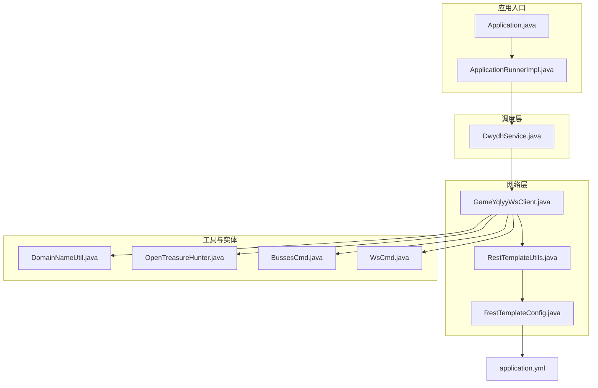
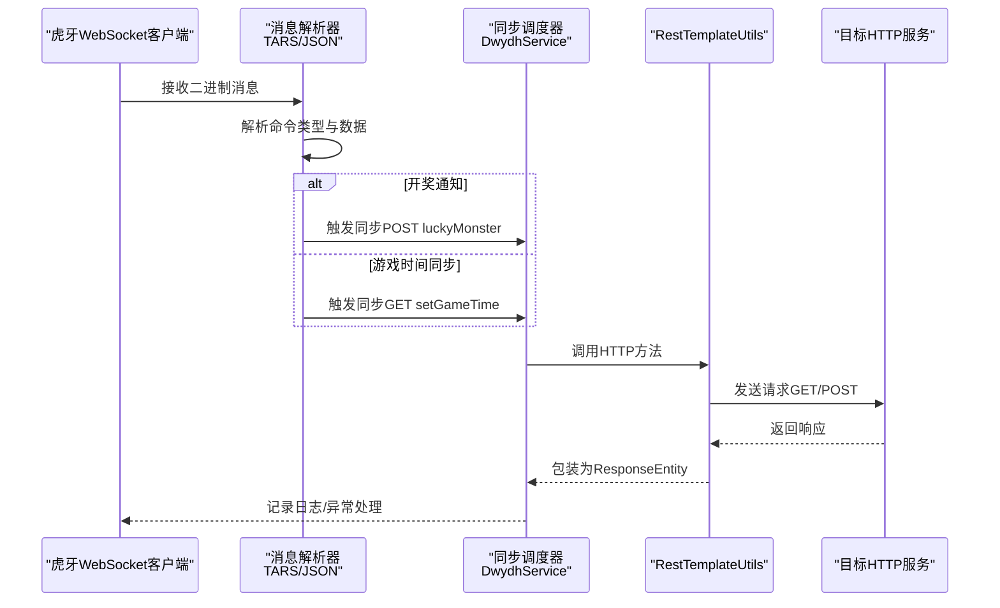
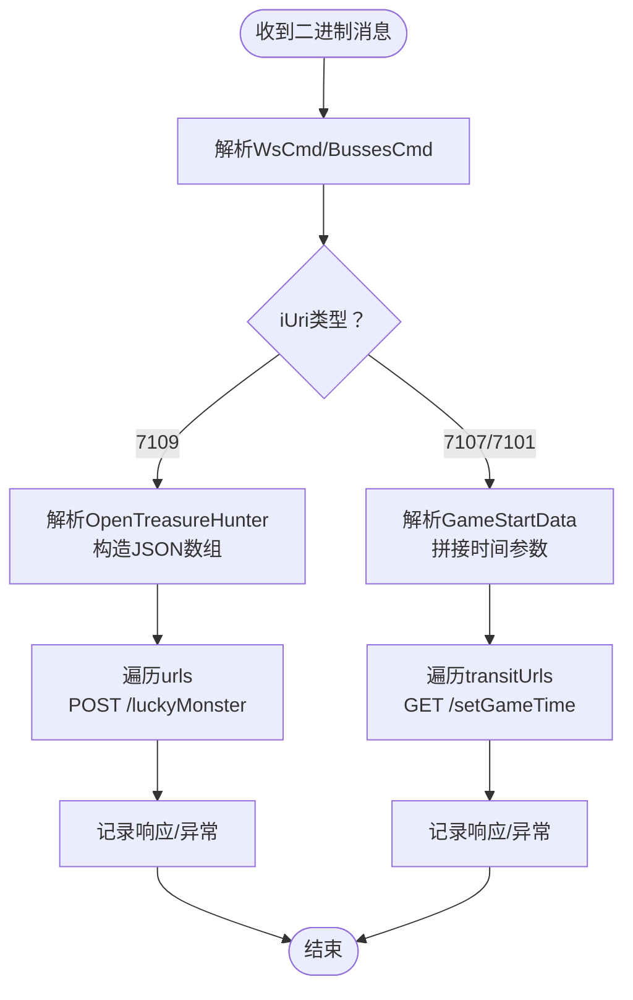
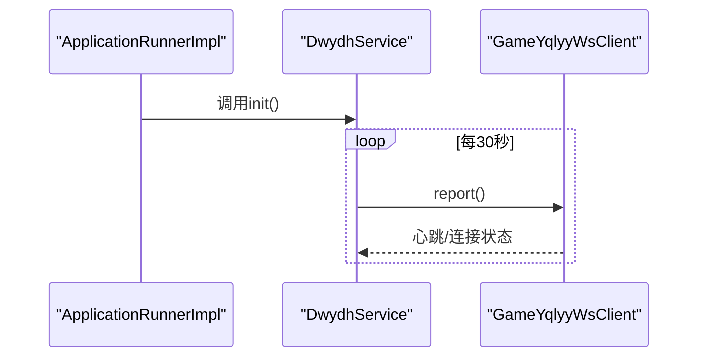
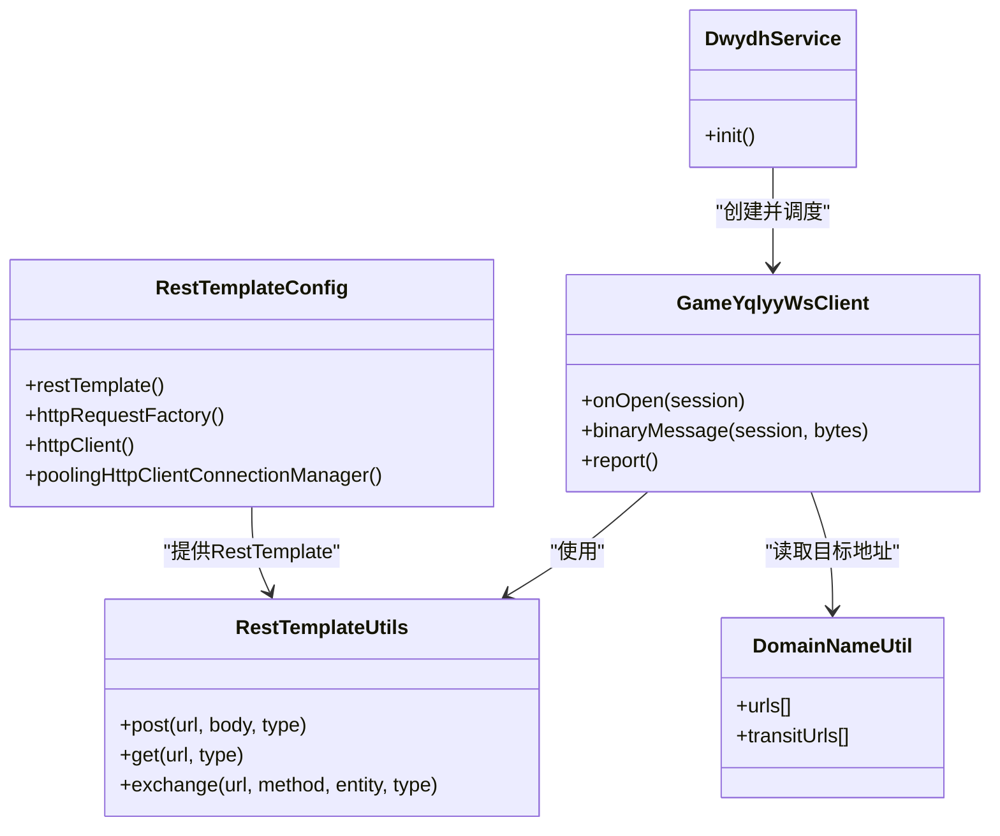

# 数据同步策略

<cite>
**本文引用的文件**
- [Application.java](file://src/main/java/com/Application.java)
- [ApplicationRunnerImpl.java](file://src/main/java/com/listener/ApplicationRunnerImpl.java)
- [DwydhService.java](file://src/main/java/com/dwydh/DwydhService.java)
- [RestTemplateConfig.java](file://src/main/java/com/commom/RestTemplateConfig.java)
- [RestTemplateUtils.java](file://src/main/java/com/commom/RestTemplateUtils.java)
- [GameYqlyyWsClient.java](file://src/main/java/com/yqlyy/GameYqlyyWsClient.java)
- [DomainNameUtil.java](file://src/main/java/com/utils/DomainNameUtil.java)
- [OpenTreasureHunter.java](file://src/main/java/com/entity/AccountedNotify/OpenTreasureHunter.java)
- [BussesCmd.java](file://src/main/java/com/entity/BussesCmd.java)
- [WsCmd.java](file://src/main/java/com/entity/WsCmd.java)
- [application.yml](file://src/main/resources/application.yml)
</cite>

## 目录
1. [简介](#简介)
2. [项目结构](#项目结构)
3. [核心组件](#核心组件)
4. [架构总览](#架构总览)
5. [详细组件分析](#详细组件分析)
6. [依赖关系分析](#依赖关系分析)
7. [性能与调优](#性能与调优)
8. [监控与日志](#监控与日志)
9. [故障排查指南](#故障排查指南)
10. [结论](#结论)
11. [附录：同步场景与最佳实践](#附录：同步场景与最佳实践)

## 简介
本技术文档围绕“数据同步策略”展开，重点阐述 RestTemplateUtils 在数据同步中的核心作用，涵盖：
- HTTP 请求构建、参数传递与响应处理机制
- 从 WebSocket 消息接收到 HTTP 请求发送的完整流程
- 错误处理与重试机制
- 同步策略的配置参数与性能调优
- 监控指标与日志记录方案
- 具体同步场景示例与最佳实践

## 项目结构
该项目采用 Spring Boot 标准目录结构，按功能域划分模块：
- common：通用工具与配置（RestTemplate 工具与配置）
- dwydh：业务初始化与调度（定时任务线程池）
- yqlyy：虎牙 WebSocket 客户端与数据解析
- entity：协议与数据模型（TARS 协议解析）
- utils：域名与中转地址等工具
- resources：配置文件（application.yml）

图表来源
- [Application.java](file://src/main/java/com/Application.java#L1-L14)
- [ApplicationRunnerImpl.java](file://src/main/java/com/listener/ApplicationRunnerImpl.java#L1-L34)
- [DwydhService.java](file://src/main/java/com/dwydh/DwydhService.java#L1-L39)
- [RestTemplateConfig.java](file://src/main/java/com/commom/RestTemplateConfig.java#L1-L132)
- [RestTemplateUtils.java](file://src/main/java/com/commom/RestTemplateUtils.java#L1-L31)
- [GameYqlyyWsClient.java](file://src/main/java/com/yqlyy/GameYqlyyWsClient.java#L1-L328)
- [DomainNameUtil.java](file://src/main/java/com/utils/DomainNameUtil.java#L1-L16)
- [OpenTreasureHunter.java](file://src/main/java/com/entity/AccountedNotify/OpenTreasureHunter.java#L1-L83)
- [BussesCmd.java](file://src/main/java/com/entity/BussesCmd.java#L1-L10)
- [WsCmd.java](file://src/main/java/com/entity/WsCmd.java#L1-L69)
- [application.yml](file://src/main/resources/application.yml#L1-L31)

章节来源
- [Application.java](file://src/main/java/com/Application.java#L1-L14)
- [application.yml](file://src/main/resources/application.yml#L1-L31)

## 核心组件
- RestTemplateUtils：封装 GET/POST/exchange 方法，统一 HTTP 请求入口，简化调用方逻辑
- RestTemplateConfig：基于 Apache HttpClient 的连接池与超时配置，内置重试策略
- GameYqlyyWsClient：WebSocket 客户端，负责接收二进制消息、解析 TARS 协议、构造 JSON 并通过 RestTemplate 发送 HTTP 请求
- DwydhService：应用启动后初始化线程池，周期性驱动 WebSocket 客户端上报与同步
- DomainNameUtil：定义目标服务地址与中转地址集合，支持多目标同步
- 实体类：WsCmd、BussesCmd、OpenTreasureHunter 等用于解析 WebSocket 二进制帧

章节来源
- [RestTemplateUtils.java](file://src/main/java/com/commom/RestTemplateUtils.java#L1-L31)
- [RestTemplateConfig.java](file://src/main/java/com/commom/RestTemplateConfig.java#L1-L132)
- [GameYqlyyWsClient.java](file://src/main/java/com/yqlyy/GameYqlyyWsClient.java#L1-L328)
- [DwydhService.java](file://src/main/java/com/dwydh/DwydhService.java#L1-L39)
- [DomainNameUtil.java](file://src/main/java/com/utils/DomainNameUtil.java#L1-L16)

## 架构总览
数据同步从 WebSocket 接收开始，经由 GameYqlyyWsClient 解析消息，再通过 RestTemplateUtils 统一发起 HTTP 请求，最终将结果写入下游系统或中转服务。

图表来源
- [GameYqlyyWsClient.java](file://src/main/java/com/yqlyy/GameYqlyyWsClient.java#L52-L219)
- [RestTemplateUtils.java](file://src/main/java/com/commom/RestTemplateUtils.java#L19-L29)
- [DwydhService.java](file://src/main/java/com/dwydh/DwydhService.java#L21-L36)

## 详细组件分析

### RestTemplateUtils：HTTP 请求封装
- 职责
  - 封装 GET/POST/exchange 方法，屏蔽 RestTemplate 使用细节
  - 统一返回 ResponseEntity，便于上层读取状态码、头信息与响应体
- 关键点
  - 通过 @Resource 注入 RestTemplate
  - 支持泛型响应类型 Class<T>，便于强类型反序列化
- 适用场景
  - 开奖结果同步（POST）
  - 游戏时间同步（GET）

章节来源
- [RestTemplateUtils.java](file://src/main/java/com/commom/RestTemplateUtils.java#L1-L31)

### RestTemplateConfig：连接池与超时配置
- 连接池与超时
  - 最大连接数、每路由并发上限、连接超时、连接池获取超时、Socket 超时
  - 空闲连接校验与重用策略
- 重试策略
  - 默认启用重试处理器，设置最大重试次数与重试行为
- 头部与 Keep-Alive
  - 设置默认请求头（Content-Type、Accept-Encoding 等）
  - Keep-Alive 策略提升连接复用效率

章节来源
- [RestTemplateConfig.java](file://src/main/java/com/commom/RestTemplateConfig.java#L35-L108)
- [application.yml](file://src/main/resources/application.yml#L16-L31)

### GameYqlyyWsClient：WebSocket 到 HTTP 的桥梁
- WebSocket 生命周期
  - onOpen：发送握手二进制包
  - onMessage：解析二进制帧，识别命令类型
  - onClose、onError：记录异常与关闭事件
- 消息解析与同步触发
  - 通过 TARS 流解析 WsCmd/BussesCmd，识别 iUri
  - iUri=7109：解析 OpenTreasureHunter，构造 JSON，向 DomainNameUtil.urls 发起 POST
  - iUri=7107/7101：解析 GameStartData，拼接时间参数，向 DomainNameUtil.transitUrls 发起 GET
- 异常处理
  - 对 RestClientException 与通用异常分别记录警告与错误日志
  - onOpen 报错时抛出运行时异常；report 中连接断开时自动重连

图表来源
- [GameYqlyyWsClient.java](file://src/main/java/com/yqlyy/GameYqlyyWsClient.java#L52-L219)
- [OpenTreasureHunter.java](file://src/main/java/com/entity/AccountedNotify/OpenTreasureHunter.java#L73-L81)
- [BussesCmd.java](file://src/main/java/com/entity/BussesCmd.java#L3-L6)
- [WsCmd.java](file://src/main/java/com/entity/WsCmd.java#L59-L65)

章节来源
- [GameYqlyyWsClient.java](file://src/main/java/com/yqlyy/GameYqlyyWsClient.java#L1-L328)
- [OpenTreasureHunter.java](file://src/main/java/com/entity/AccountedNotify/OpenTreasureHunter.java#L1-L83)
- [BussesCmd.java](file://src/main/java/com/entity/BussesCmd.java#L1-L10)
- [WsCmd.java](file://src/main/java/com/entity/WsCmd.java#L1-L69)

### DwydhService：调度与周期控制
- 初始化
  - 注入线程池与 RestTemplateUtils
  - 在独立线程中循环创建 GameYqlyyWsClient 并周期性调用 report()
- 执行时机
  - 应用启动后由 ApplicationRunnerImpl 触发 init()
  - 每次循环间隔固定（约 30 秒），持续运行

图表来源
- [ApplicationRunnerImpl.java](file://src/main/java/com/listener/ApplicationRunnerImpl.java#L25-L31)
- [DwydhService.java](file://src/main/java/com/dwydh/DwydhService.java#L21-L36)

章节来源
- [DwydhService.java](file://src/main/java/com/dwydh/DwydhService.java#L1-L39)
- [ApplicationRunnerImpl.java](file://src/main/java/com/listener/ApplicationRunnerImpl.java#L1-L34)

### 实体与数据模型
- WsCmd：WebSocket 命令头，包含命令类型与数据载荷
- BussesCmd：业务命令，包含 iUri 与 sMsg
- OpenTreasureHunter：开奖通知结构，包含动物列表等字段

章节来源
- [WsCmd.java](file://src/main/java/com/entity/WsCmd.java#L1-L69)
- [BussesCmd.java](file://src/main/java/com/entity/BussesCmd.java#L1-L10)
- [OpenTreasureHunter.java](file://src/main/java/com/entity/AccountedNotify/OpenTreasureHunter.java#L1-L83)

## 依赖关系分析
- 组件耦合
  - GameYqlyyWsClient 依赖 RestTemplateUtils 进行 HTTP 请求
  - DwydhService 依赖 GameYqlyyWsClient 与线程池
  - RestTemplateConfig 为 RestTemplate 提供底层连接池与超时策略
- 外部依赖
  - Apache HttpClient（连接池、超时、重试）
  - Spring Web（RestTemplate）
  - TARS 协议解析（二进制帧解析）
  - 日志框架（SLF4J）

图表来源
- [RestTemplateUtils.java](file://src/main/java/com/commom/RestTemplateUtils.java#L1-L31)
- [RestTemplateConfig.java](file://src/main/java/com/commom/RestTemplateConfig.java#L62-L129)
- [GameYqlyyWsClient.java](file://src/main/java/com/yqlyy/GameYqlyyWsClient.java#L32-L44)
- [DwydhService.java](file://src/main/java/com/dwydh/DwydhService.java#L16-L36)
- [DomainNameUtil.java](file://src/main/java/com/utils/DomainNameUtil.java#L3-L15)

## 性能与调优
- 连接池与超时
  - 最大连接数与每路由并发上限直接影响吞吐与排队等待
  - Socket 超时决定服务端响应等待上限，避免线程长期阻塞
  - 连接池获取超时影响请求排队，建议与业务峰值 QPS 匹配
- Keep-Alive 与空闲校验
  - Keep-Alive 策略提升连接复用率，降低握手成本
  - validateAfterInactivity 控制空闲连接重用前的健康检查
- 重试策略
  - 默认重试 2 次，适用于瞬时网络抖动
  - 对幂等操作（如 GET）更安全；对非幂等（如 POST）需谨慎
- 线程与调度
  - DwydhService 使用线程池与固定周期，建议根据上游消息频率与下游服务能力调整周期
- 配置项参考
  - http.maxTotal、http.defaultMaxPerRoute、http.connectTimeout、http.connectionRequestTimeout、http.socketTimeout、http.staleConnectionCheckEnabled、http.validateAfterInactivity

章节来源
- [RestTemplateConfig.java](file://src/main/java/com/commom/RestTemplateConfig.java#L35-L108)
- [application.yml](file://src/main/resources/application.yml#L16-L31)
- [DwydhService.java](file://src/main/java/com/dwydh/DwydhService.java#L21-L36)

## 监控与日志
- 日志记录
  - WebSocket 生命周期：onOpen/onClose/onError
  - 消息解析：收到的二进制消息与解析后的关键字段
  - 同步请求：每个目标 URL 的请求与响应内容
  - 异常：RestClientException 与通用异常均记录
- 建议指标
  - 请求成功率（按目标 URL 分组）
  - 响应时间分布（P50/P95/P99）
  - 连接池使用率（活跃连接/最大连接）
  - 重试次数统计
  - WebSocket 断链与重连次数
- 日志级别
  - 成功路径：INFO
  - 瞬时异常：WARN
  - 严重异常：ERROR

章节来源
- [GameYqlyyWsClient.java](file://src/main/java/com/yqlyy/GameYqlyyWsClient.java#L47-L248)

## 故障排查指南
- WebSocket 连接失败
  - 检查 wsUrl 是否为空或不可达
  - 查看 onOpen/report 中的异常日志与重连逻辑
- HTTP 请求异常
  - RestClientException：检查目标 URL、网络连通性、超时配置
  - 通用异常：检查请求体格式与目标服务状态
- 数据未同步
  - 确认 iUri 类型与解析逻辑
  - 核对 DomainNameUtil.urls/transitUrls 是否正确配置
- 性能问题
  - 调整连接池参数与超时阈值
  - 评估线程池与调度周期，避免过度竞争

章节来源
- [GameYqlyyWsClient.java](file://src/main/java/com/yqlyy/GameYqlyyWsClient.java#L250-L290)
- [RestTemplateConfig.java](file://src/main/java/com/commom/RestTemplateConfig.java#L84-L108)

## 结论
本方案以 GameYqlyyWsClient 为核心，结合 RestTemplateUtils 与 RestTemplateConfig，实现了从 WebSocket 到 HTTP 的稳定数据同步。通过明确的触发条件（iUri）、清晰的错误处理与重试策略、以及可调的连接池与超时参数，满足了高并发与低延迟的同步需求。建议在生产环境中配合完善的监控与告警体系，持续优化连接池与调度周期，确保系统稳定性与性能。

## 附录：同步场景与最佳实践

### 场景一：开奖结果同步（POST）
- 触发条件：WebSocket 二进制消息 iUri=7109
- 处理流程：解析 OpenTreasureHunter，构造 JSON 数组，遍历 urls 发送 POST
- 最佳实践：
  - 对非幂等请求，建议在上游做去重或幂等键设计
  - 对大量动物项，建议分批发送或限流
  - 记录请求体与响应体，便于回溯

章节来源
- [GameYqlyyWsClient.java](file://src/main/java/com/yqlyy/GameYqlyyWsClient.java#L76-L119)
- [OpenTreasureHunter.java](file://src/main/java/com/entity/AccountedNotify/OpenTreasureHunter.java#L73-L81)

### 场景二：游戏时间同步（GET）
- 触发条件：WebSocket 二进制消息 iUri=7107 或 7101
- 处理流程：解析 GameStartData，拼接时间参数，遍历 transitUrls 发送 GET
- 最佳实践：
  - GET 请求应保持幂等，适合多次重试
  - 对时间参数进行边界校验，避免无效值

章节来源
- [GameYqlyyWsClient.java](file://src/main/java/com/yqlyy/GameYqlyyWsClient.java#L120-L148)
- [GameYqlyyWsClient.java](file://src/main/java/com/yqlyy/GameYqlyyWsClient.java#L186-L214)

### 触发条件与执行时机
- 触发条件：WebSocket 二进制消息到达，解析出 iUri
- 执行时机：DwydhService.init() 启动后，每 30 秒周期性调用 report()

章节来源
- [GameYqlyyWsClient.java](file://src/main/java/com/yqlyy/GameYqlyyWsClient.java#L52-L219)
- [DwydhService.java](file://src/main/java/com/dwydh/DwydhService.java#L21-L36)

### 错误处理与重试机制
- 错误处理
  - RestClientException：记录警告日志
  - 通用异常：记录错误日志
- 重试机制
  - RestTemplateConfig 默认重试 2 次
  - onOpen/report 中出现异常时触发重连

章节来源
- [RestTemplateConfig.java](file://src/main/java/com/commom/RestTemplateConfig.java#L106-L107)
- [GameYqlyyWsClient.java](file://src/main/java/com/yqlyy/GameYqlyyWsClient.java#L109-L114)
- [GameYqlyyWsClient.java](file://src/main/java/com/yqlyy/GameYqlyyWsClient.java#L142-L147)
- [GameYqlyyWsClient.java](file://src/main/java/com/yqlyy/GameYqlyyWsClient.java#L286-L289)

### 配置参数与性能调优
- 连接池与超时
  - http.maxTotal、http.defaultMaxPerRoute、http.connectTimeout、http.connectionRequestTimeout、http.socketTimeout
  - http.staleConnectionCheckEnabled、http.validateAfterInactivity
- 建议
  - 根据下游服务 QPS 与延迟特性调整连接池大小
  - 适当提高 socketTimeout 以应对下游波动

章节来源
- [application.yml](file://src/main/resources/application.yml#L16-L31)
- [RestTemplateConfig.java](file://src/main/java/com/commom/RestTemplateConfig.java#L84-L108)