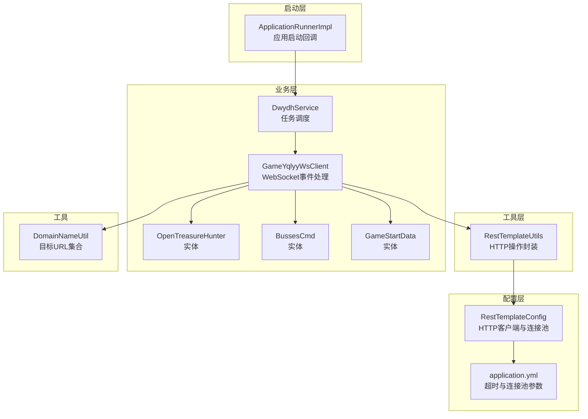
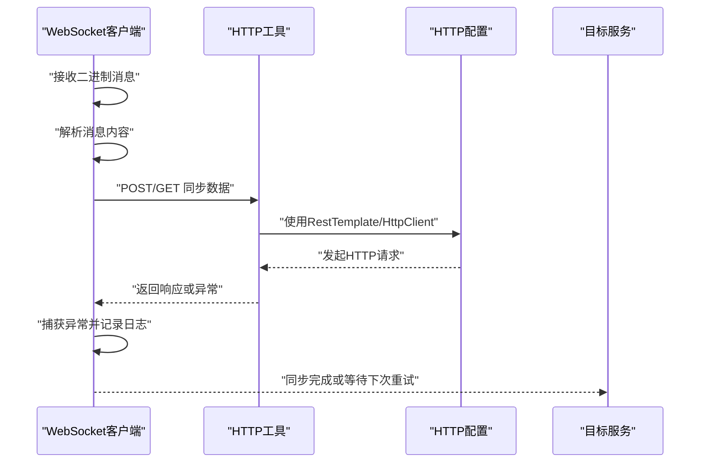
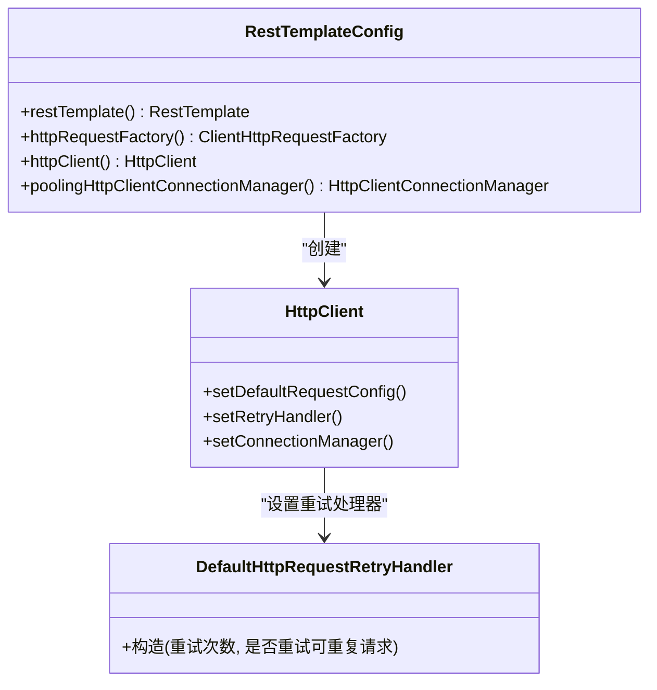
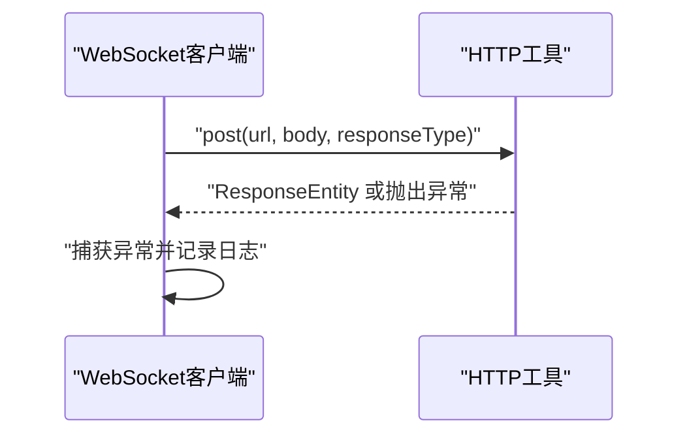
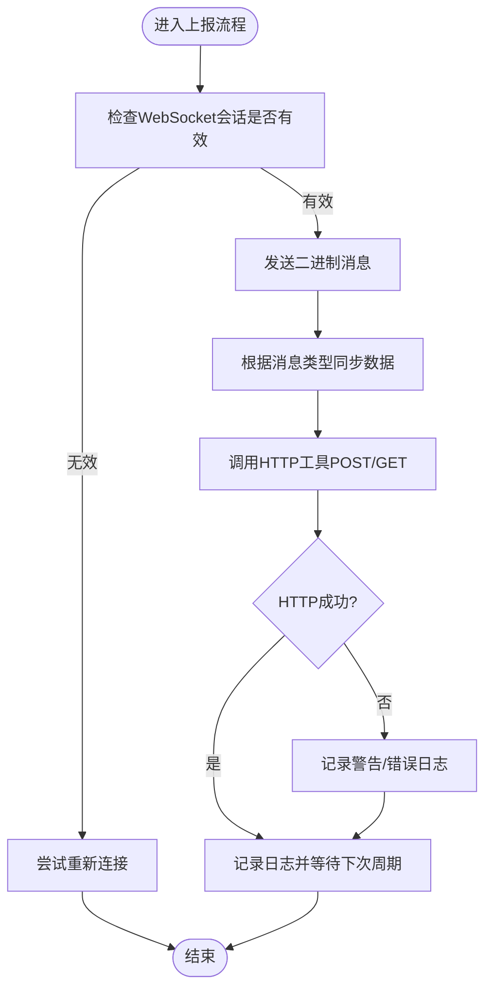
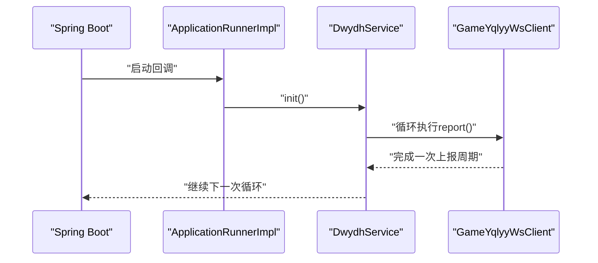
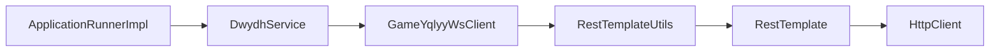

# 错误重试机制

<cite>
**本文引用的文件**
- [RestTemplateConfig.java](file://src/main/java/com/commom/RestTemplateConfig.java)
- [RestTemplateUtils.java](file://src/main/java/com/commom/RestTemplateUtils.java)
- [GameYqlyyWsClient.java](file://src/main/java/com/yqlyy/GameYqlyyWsClient.java)
- [DwydhService.java](file://src/main/java/com/dwydh/DwydhService.java)
- [ApplicationRunnerImpl.java](file://src/main/java/com/listener/ApplicationRunnerImpl.java)
- [application.yml](file://src/main/resources/application.yml)
- [DomainNameUtil.java](file://src/main/java/com/utils/DomainNameUtil.java)
- [OpenTreasureHunter.java](file://src/main/java/com/entity/AccountedNotify/OpenTreasureHunter.java)
- [BussesCmd.java](file://src/main/java/com/entity/BussesCmd.java)
- [GameStartData.java](file://src/main/java/com/entity/GameStartData.java)
- [pom.xml](file://pom.xml)
</cite>

## 目录
1. [引言](#引言)
2. [项目结构](#项目结构)
3. [核心组件](#核心组件)
4. [架构总览](#架构总览)
5. [详细组件分析](#详细组件分析)
6. [依赖关系分析](#依赖关系分析)
7. [性能考量](#性能考量)
8. [故障排查指南](#故障排查指南)
9. [结论](#结论)
10. [附录](#附录)

## 引言
本技术文档围绕“错误重试机制”展开，结合仓库现有实现，系统性阐述在数据同步场景中可能遇到的错误类型（如网络超时、服务器错误、连接中断等），并基于当前代码库中的HTTP客户端与WebSocket客户端配置，解释可观察到的重试行为与潜在改进点。文档同时给出重试策略设计原则、错误分类方法、状态管理与异常传播机制、配置参数与调优建议，以及监控方案与排障指引。

## 项目结构
该项目为Spring Boot应用，采用分层组织方式：
- 配置层：通过RestTemplateConfig定义HTTP客户端与连接池参数，并启用默认的重试处理器。
- 工具层：RestTemplateUtils封装常用HTTP操作，供业务模块复用。
- 业务层：DwydhService负责调度WebSocket客户端；GameYqlyyWsClient处理WebSocket事件与HTTP上报。
- 启动层：ApplicationRunnerImpl在应用启动后初始化业务线程。
- 配置层：application.yml集中管理HTTP超时与连接池参数。
- 实体层：若干实体类用于解析WebSocket二进制消息中的结构化数据。

图表来源
- [RestTemplateConfig.java](file://src/main/java/com/commom/RestTemplateConfig.java#L34-L131)
- [RestTemplateUtils.java](file://src/main/java/com/commom/RestTemplateUtils.java#L14-L30)
- [GameYqlyyWsClient.java](file://src/main/java/com/yqlyy/GameYqlyyWsClient.java#L30-L327)
- [DwydhService.java](file://src/main/java/com/dwydh/DwydhService.java#L14-L38)
- [ApplicationRunnerImpl.java](file://src/main/java/com/listener/ApplicationRunnerImpl.java#L21-L33)
- [application.yml](file://src/main/resources/application.yml#L16-L30)
- [DomainNameUtil.java](file://src/main/java/com/utils/DomainNameUtil.java#L3-L15)
- [OpenTreasureHunter.java](file://src/main/java/com/entity/AccountedNotify/OpenTreasureHunter.java#L10-L82)
- [BussesCmd.java](file://src/main/java/com/entity/BussesCmd.java#L3-L9)
- [GameStartData.java](file://src/main/java/com/entity/GameStartData.java#L3-L78)

章节来源
- [RestTemplateConfig.java](file://src/main/java/com/commom/RestTemplateConfig.java#L34-L131)
- [RestTemplateUtils.java](file://src/main/java/com/commom/RestTemplateUtils.java#L14-L30)
- [GameYqlyyWsClient.java](file://src/main/java/com/yqlyy/GameYqlyyWsClient.java#L30-L327)
- [DwydhService.java](file://src/main/java/com/dwydh/DwydhService.java#L14-L38)
- [ApplicationRunnerImpl.java](file://src/main/java/com/listener/ApplicationRunnerImpl.java#L21-L33)
- [application.yml](file://src/main/resources/application.yml#L16-L30)
- [DomainNameUtil.java](file://src/main/java/com/utils/DomainNameUtil.java#L3-L15)
- [OpenTreasureHunter.java](file://src/main/java/com/entity/AccountedNotify/OpenTreasureHunter.java#L10-L82)
- [BussesCmd.java](file://src/main/java/com/entity/BussesCmd.java#L3-L9)
- [GameStartData.java](file://src/main/java/com/entity/GameStartData.java#L3-L78)

## 核心组件
- HTTP客户端与重试配置：RestTemplateConfig通过Apache HttpClient构建HTTP客户端，默认启用DefaultHttpRequestRetryHandler，设置最大重试次数与是否重试可重复请求。
- HTTP工具封装：RestTemplateUtils提供GET/POST/exchange等常用方法，便于业务侧直接使用。
- WebSocket客户端：GameYqlyyWsClient处理WebSocket连接、心跳、消息解析与HTTP上报；在上报环节捕获RestClientException并记录日志。
- 业务调度：DwydhService在独立线程中循环调用WebSocket客户端的上报逻辑。
- 启动流程：ApplicationRunnerImpl在应用启动后触发业务初始化。
- 配置参数：application.yml集中定义连接超时、套接字超时、连接池上限等参数。

章节来源
- [RestTemplateConfig.java](file://src/main/java/com/commom/RestTemplateConfig.java#L84-L108)
- [RestTemplateUtils.java](file://src/main/java/com/commom/RestTemplateUtils.java#L19-L29)
- [GameYqlyyWsClient.java](file://src/main/java/com/yqlyy/GameYqlyyWsClient.java#L103-L114)
- [DwydhService.java](file://src/main/java/com/dwydh/DwydhService.java#L21-L36)
- [ApplicationRunnerImpl.java](file://src/main/java/com/listener/ApplicationRunnerImpl.java#L25-L30)
- [application.yml](file://src/main/resources/application.yml#L16-L30)

## 架构总览
下图展示从WebSocket消息到达，到业务数据解析与HTTP同步的整体流程，以及当前实现中可见的错误处理位置。

图表来源
- [GameYqlyyWsClient.java](file://src/main/java/com/yqlyy/GameYqlyyWsClient.java#L103-L114)
- [RestTemplateUtils.java](file://src/main/java/com/commom/RestTemplateUtils.java#L19-L29)
- [RestTemplateConfig.java](file://src/main/java/com/commom/RestTemplateConfig.java#L84-L108)

## 详细组件分析

### 组件A：HTTP客户端与重试配置（RestTemplateConfig）
- 关键点
  - 使用HttpComponentsClientHttpRequestFactory与Apache HttpClient。
  - 设置连接超时、套接字超时、连接池最大连接数、每路由并发上限、空闲校验等。
  - 启用DefaultHttpRequestRetryHandler，允许在可重复请求上进行有限次重试。
- 重试行为
  - 默认重试次数为固定值，且仅对可重复HTTP方法生效。
  - 该策略适用于网络瞬时抖动导致的请求失败，但不覆盖所有错误类型（例如语义错误）。
- 配置参数
  - 连接超时、连接池最大连接数、每路由并发上限、套接字超时、空闲校验等均来自application.yml。

图表来源
- [RestTemplateConfig.java](file://src/main/java/com/commom/RestTemplateConfig.java#L84-L108)

章节来源
- [RestTemplateConfig.java](file://src/main/java/com/commom/RestTemplateConfig.java#L84-L108)
- [application.yml](file://src/main/resources/application.yml#L16-L30)

### 组件B：HTTP工具封装（RestTemplateUtils）
- 关键点
  - 封装常用的HTTP方法，简化业务侧调用。
  - 在WebSocket上报处被调用，用于向目标服务同步数据。
- 错误处理
  - 上报逻辑中捕获RestClientException并记录告警日志，未进行自动重试。

图表来源
- [RestTemplateUtils.java](file://src/main/java/com/commom/RestTemplateUtils.java#L19-L29)
- [GameYqlyyWsClient.java](file://src/main/java/com/yqlyy/GameYqlyyWsClient.java#L103-L114)

章节来源
- [RestTemplateUtils.java](file://src/main/java/com/commom/RestTemplateUtils.java#L19-L29)
- [GameYqlyyWsClient.java](file://src/main/java/com/yqlyy/GameYqlyyWsClient.java#L103-L114)

### 组件C：WebSocket客户端与上报流程（GameYqlyyWsClient）
- 关键点
  - 处理WebSocket连接、心跳、二进制消息解析。
  - 在特定消息类型下，构造数据并通过HTTP工具POST/GET同步至目标服务。
  - 对HTTP异常进行捕获与日志记录，未实现自动重试。
- 错误路径
  - 当WebSocket发送或HTTP同步出现异常时，记录警告/错误日志，随后继续循环或等待重连。
  - 若WebSocket断开，report方法会尝试重新连接。

图表来源
- [GameYqlyyWsClient.java](file://src/main/java/com/yqlyy/GameYqlyyWsClient.java#L274-L290)
- [GameYqlyyWsClient.java](file://src/main/java/com/yqlyy/GameYqlyyWsClient.java#L103-L114)

章节来源
- [GameYqlyyWsClient.java](file://src/main/java/com/yqlyy/GameYqlyyWsClient.java#L274-L290)
- [GameYqlyyWsClient.java](file://src/main/java/com/yqlyy/GameYqlyyWsClient.java#L103-L114)

### 组件D：业务调度与启动（DwydhService、ApplicationRunnerImpl）
- 关键点
  - ApplicationRunnerImpl在应用启动后调用DwydhService.init()。
  - DwydhService在独立线程中循环执行WebSocket客户端的上报逻辑。
- 重试现状
  - 业务层未实现显式重试，主要依赖HTTP客户端的有限重试与WebSocket的重连逻辑。

图表来源
- [ApplicationRunnerImpl.java](file://src/main/java/com/listener/ApplicationRunnerImpl.java#L25-L30)
- [DwydhService.java](file://src/main/java/com/dwydh/DwydhService.java#L21-L36)
- [GameYqlyyWsClient.java](file://src/main/java/com/yqlyy/GameYqlyyWsClient.java#L274-L290)

章节来源
- [ApplicationRunnerImpl.java](file://src/main/java/com/listener/ApplicationRunnerImpl.java#L25-L30)
- [DwydhService.java](file://src/main/java/com/dwydh/DwydhService.java#L21-L36)

## 依赖关系分析
- 组件耦合
  - GameYqlyyWsClient依赖RestTemplateUtils进行HTTP同步。
  - RestTemplateUtils依赖RestTemplateConfig提供的RestTemplate。
  - DwydhService调度GameYqlyyWsClient，形成业务线程与网络层的分层。
- 外部依赖
  - Apache HttpClient、Spring Web、WebSocket客户端（Tyrus）、日志框架等。

图表来源
- [GameYqlyyWsClient.java](file://src/main/java/com/yqlyy/GameYqlyyWsClient.java#L32-L42)
- [RestTemplateUtils.java](file://src/main/java/com/commom/RestTemplateUtils.java#L16-L17)
- [RestTemplateConfig.java](file://src/main/java/com/commom/RestTemplateConfig.java#L62-L76)
- [DwydhService.java](file://src/main/java/com/dwydh/DwydhService.java#L17-L19)
- [ApplicationRunnerImpl.java](file://src/main/java/com/listener/ApplicationRunnerImpl.java#L23-L23)

章节来源
- [pom.xml](file://pom.xml#L26-L110)

## 性能考量
- 连接池与超时
  - 连接池最大连接数与每路由并发上限直接影响吞吐能力与资源占用。
  - 套接字超时与连接超时影响请求的最长等待时间，需结合业务延迟容忍度调整。
- 重试策略
  - 默认重试次数有限，且仅对可重复请求生效，适合瞬时网络波动。
  - 对于高并发场景，建议结合指数退避与上限控制，避免雪崩效应。
- 日志与监控
  - 建议对HTTP异常、WebSocket断连、重试次数等指标进行埋点与可视化。

## 故障排查指南
- 常见错误类型与定位
  - 网络超时：检查连接超时、套接字超时与连接池配置。
  - 服务器错误：关注HTTP状态码与响应体，结合日志定位。
  - 连接中断：WebSocket断开后会尝试重连，若频繁断开需检查远端服务稳定性。
- 现状与改进建议
  - 当前实现中，HTTP层面有有限重试，业务侧未实现自动重试。
  - 建议在业务侧引入幂等设计与指数退避重试，区分可重试与不可重试错误，并记录重试状态与异常传播链路。

章节来源
- [application.yml](file://src/main/resources/application.yml#L16-L30)
- [RestTemplateConfig.java](file://src/main/java/com/commom/RestTemplateConfig.java#L84-L108)
- [GameYqlyyWsClient.java](file://src/main/java/com/yqlyy/GameYqlyyWsClient.java#L103-L114)

## 结论
当前代码库在HTTP层面具备有限的自动重试能力，在WebSocket层面具备连接重连能力。对于数据同步场景，建议在业务层补充完善的重试策略（含指数退避、上限控制、错误分类与状态管理），并配合监控与日志体系，以提升系统的鲁棒性与可观测性。

## 附录

### A. 错误类型与分类
- 网络超时：连接超时、套接字超时、连接池获取超时。
- 服务器错误：5xx类错误、业务语义错误。
- 连接中断：WebSocket断开、网络抖动导致的连接丢失。
- 不可重试错误：4xx类错误（非幂等）、非法参数等。

### B. 重试策略设计原则
- 重试次数上限：防止无限重试导致资源耗尽。
- 指数退避：每次退避时间按指数增长，避免同时重试引发拥塞。
- 错误分类：区分瞬时错误与永久错误，仅对可重试错误进行重试。
- 幂等性：确保重试不会产生副作用（如重复写入）。
- 状态管理：记录重试次数、上次重试时间、当前状态机，支持恢复与降级。

### C. 配置参数与调优建议
- HTTP超时与连接池
  - 连接超时、套接字超时、连接池最大连接数、每路由并发上限、空闲校验间隔等。
- WebSocket超时
  - 会话空闲超时、异步发送超时等，需结合业务心跳策略调整。
- 重试参数
  - 初始退避时间、最大退避时间、最大重试次数、是否仅对可重复请求重试。

章节来源
- [application.yml](file://src/main/resources/application.yml#L16-L30)
- [RestTemplateConfig.java](file://src/main/java/com/commom/RestTemplateConfig.java#L84-L108)
- [GameYqlyyWsClient.java](file://src/main/java/com/yqlyy/GameYqlyyWsClient.java#L250-L272)

### D. 监控方案
- 指标建议
  - HTTP请求成功率、平均/99线延迟、重试次数分布、WebSocket断连次数与恢复时延。
- 日志建议
  - 记录异常类型、重试原因、重试次数、最终结果与耗时。
- 告警建议
  - 连续失败率阈值、重试次数上限触发、WebSocket长时间无法恢复。

### E. 示例与最佳实践
- 示例：在业务侧对HTTP异常进行分类与重试，结合幂等键与退避策略。
- 最佳实践：优先保证幂等性，其次再考虑重试策略与退避算法；对不可重试错误快速失败并记录。