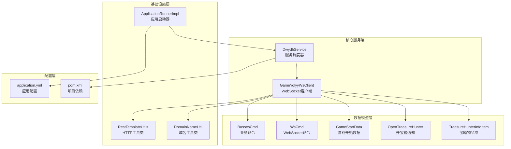
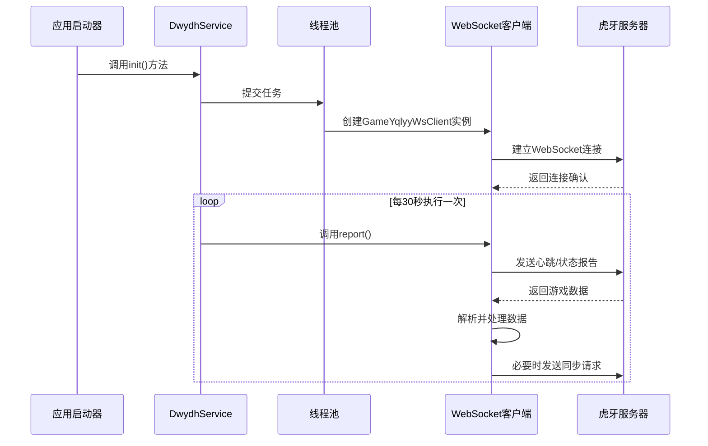
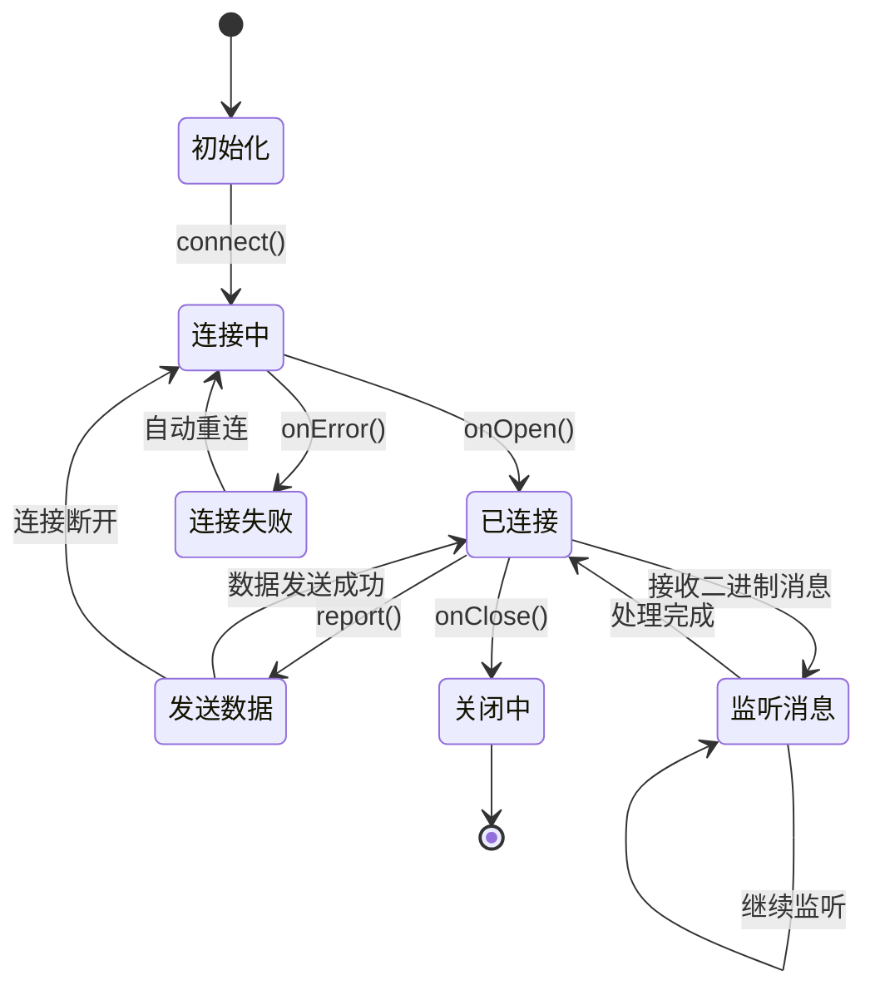
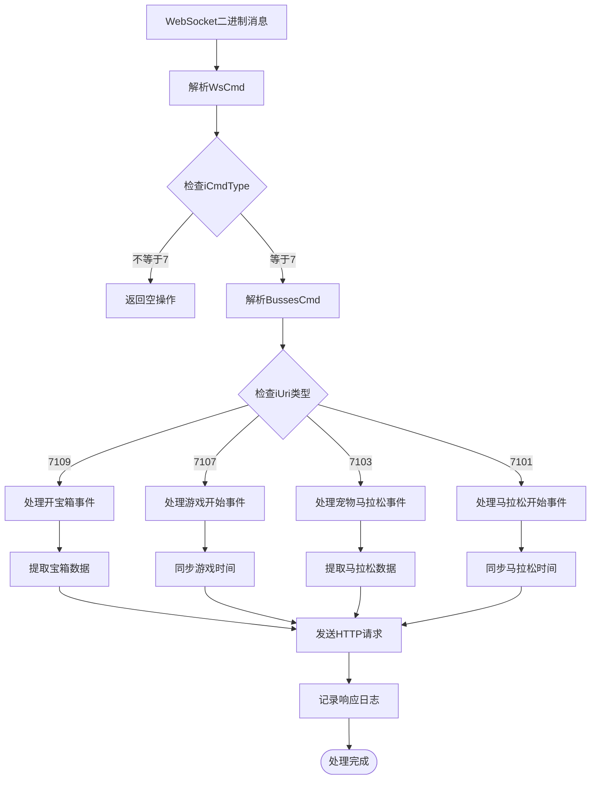
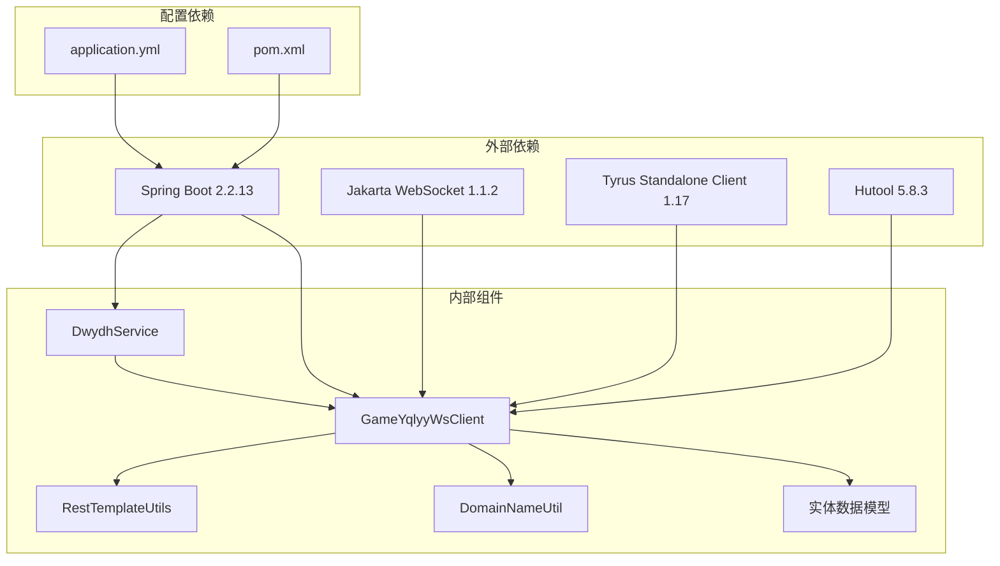

# 服务调度器

<cite>
**本文档引用的文件**
- [DwydhService.java](file://src/main/java/com/dwydh/DwydhService.java)
- [GameYqlyyWsClient.java](file://src/main/java/com/yqlyy/GameYqlyyWsClient.java)
- [ApplicationRunnerImpl.java](file://src/main/java/com/listener/ApplicationRunnerImpl.java)
- [RestTemplateUtils.java](file://src/main/java/com/commom/RestTemplateUtils.java)
- [DomainNameUtil.java](file://src/main/java/com/utils/DomainNameUtil.java)
- [application.yml](file://src/main/resources/application.yml)
- [pom.xml](file://pom.xml)
- [BussesCmd.java](file://src/main/java/com/entity/BussesCmd.java)
- [WsCmd.java](file://src/main/java/com/entity/WsCmd.java)
- [GameStartData.java](file://src/main/java/com/entity/GameStartData.java)
- [OpenTreasureHunter.java](file://src/main/java/com/entity/AccountedNotify/OpenTreasureHunter.java)
- [TreasureHunterInfoItem.java](file://src/main/java/com/entity/AccountedNotify/TreasureHunterInfoItem.java)
</cite>

## 目录
1. [简介](#简介)
2. [项目结构](#项目结构)
3. [核心组件](#核心组件)
4. [架构概览](#架构概览)
5. [详细组件分析](#详细组件分析)
6. [依赖关系分析](#依赖关系分析)
7. [性能考虑](#性能考虑)
8. [故障排查指南](#故障排查指南)
9. [结论](#结论)

## 简介

服务调度器是一个基于Spring Boot的WebSocket客户端监控系统，专门用于监控虎牙直播平台的"一千零一夜"和"宠物马拉松"游戏。该系统通过DwydhService作为核心调度器，利用线程池任务执行机制和WebSocket客户端生命周期管理，实现对游戏状态的实时监控和数据同步。

系统采用异步处理模式，通过30秒间隔的周期性报告机制，确保与虎牙服务器的持续连接和数据交换。该设计既保证了系统的稳定性，又避免了阻塞主线程，提高了整体性能。

## 项目结构

该项目采用标准的Spring Boot项目结构，主要包含以下模块：



**图表来源**
- [DwydhService.java](file://src/main/java/com/dwydh/DwydhService.java#L1-L39)
- [GameYqlyyWsClient.java](file://src/main/java/com/yqlyy/GameYqlyyWsClient.java#L1-L328)
- [ApplicationRunnerImpl.java](file://src/main/java/com/listener/ApplicationRunnerImpl.java#L1-L34)

**章节来源**
- [DwydhService.java](file://src/main/java/com/dwydh/DwydhService.java#L1-L39)
- [GameYqlyyWsClient.java](file://src/main/java/com/yqlyy/GameYqlyyWsClient.java#L1-L328)
- [ApplicationRunnerImpl.java](file://src/main/java/com/listener/ApplicationRunnerImpl.java#L1-L34)

## 核心组件

### DwydhService - 服务调度器

DwydhService是整个系统的核心调度器，负责管理WebSocket客户端的生命周期和任务执行。该类采用Spring注解`@Service`和`@Slf4j`，体现了其在Spring容器中的服务角色和日志记录能力。

**关键特性：**
- **线程池任务执行**：使用`ThreadPoolTaskExecutor`实现异步任务调度
- **客户端生命周期管理**：负责WebSocket客户端的创建、维护和重启
- **循环执行机制**：通过while(true)循环实现30秒间隔的定期报告

### GameYqlyyWsClient - WebSocket客户端

GameYqlyyWsClient实现了Jakarta WebSocket标准的客户端接口，负责与虎牙服务器建立和维护WebSocket连接。该类具有以下核心功能：

**连接管理：**
- 支持自动重连机制
- 处理连接异常和错误状态
- 维护会话状态和消息序列

**数据处理：**
- 解析二进制WebSocket消息
- 处理不同类型的游戏事件
- 同步开奖结果到其他服务

**章节来源**
- [DwydhService.java](file://src/main/java/com/dwydh/DwydhService.java#L12-L38)
- [GameYqlyyWsClient.java](file://src/main/java/com/yqlyy/GameYqlyyWsClient.java#L29-L328)

## 架构概览

系统采用分层架构设计，各层职责明确，耦合度低：



**图表来源**
- [ApplicationRunnerImpl.java](file://src/main/java/com/listener/ApplicationRunnerImpl.java#L25-L31)
- [DwydhService.java](file://src/main/java/com/dwydh/DwydhService.java#L21-L36)
- [GameYqlyyWsClient.java](file://src/main/java/com/yqlyy/GameYqlyyWsClient.java#L274-L290)

## 详细组件分析

### DwydhService初始化流程

DwydhService的init()方法执行了完整的初始化流程，从线程池任务创建到WebSocket客户端实例化：

```mermaid
flowchart TD
Start([init()方法调用]) --> CreateTask["创建线程池任务"]
CreateTask --> NewClient["实例化GameYqlyyWsClient"]
NewClient --> PrintLog["打印启动日志"]
PrintLog --> LoopStart["进入while(true)循环"]
LoopStart --> TryBlock["try块执行"]
TryBlock --> CallReport["调用client.report()"]
CallReport --> Sleep["Thread.sleep(30秒)"]
Sleep --> LoopStart
TryBlock --> CatchBlock{"捕获InterruptedException?"}
CatchBlock --> |是| HandleInterrupt["处理中断异常"]
HandleInterrupt --> LoopStart
CatchBlock --> |否| LoopStart
```

**图表来源**
- [DwydhService.java](file://src/main/java/com/dwydh/DwydhService.java#L21-L36)

**执行流程详解：**

1. **线程池任务创建**：使用`taskExecutor.execute()`提交匿名Runnable任务
2. **客户端实例化**：构造函数注入RestTemplateUtils依赖
3. **无限循环执行**：while(true)确保持续运行
4. **周期性报告**：每30秒调用一次report()方法
5. **异常处理**：捕获并处理线程中断异常

### WebSocket客户端生命周期管理

GameYqlyyWsClient实现了完整的生命周期管理：



**图表来源**
- [GameYqlyyWsClient.java](file://src/main/java/com/yqlyy/GameYqlyyWsClient.java#L250-L272)
- [GameYqlyyWsClient.java](file://src/main/java/com/yqlyy/GameYqlyyWsClient.java#L274-L290)

**生命周期关键点：**

1. **连接阶段**：connect()方法建立WebSocket连接
2. **活跃阶段**：report()方法发送心跳和状态报告
3. **数据处理阶段**：@OnMessage注解处理服务器消息
4. **异常恢复阶段**：自动重连机制处理连接中断

### 异步处理模式分析

系统采用双重异步处理机制：

```mermaid
graph LR
subgraph "应用启动异步"
RUNNER[ApplicationRunnerImpl] --> INIT[init()方法]
end
subgraph "任务执行异步"
INIT --> THREAD_POOL[ThreadPoolTaskExecutor]
THREAD_POOL --> CLIENT_TASK[WebSocket客户端任务]
end
subgraph "网络通信异步"
CLIENT_TASK --> WS_CONNECT[WebSocket连接]
WS_CONNECT --> ASYNC_SEND[异步消息发送]
ASYNC_SEND --> CALLBACK[回调处理]
end
```

**图表来源**
- [ApplicationRunnerImpl.java](file://src/main/java/com/listener/ApplicationRunnerImpl.java#L25-L31)
- [DwydhService.java](file://src/main/java/com/dwydh/DwydhService.java#L16-L17)

**异步处理优势：**
- 避免阻塞Spring Boot应用启动
- 提高系统并发处理能力
- 实现非阻塞的WebSocket通信

### 数据解析和处理机制

WebSocket客户端实现了复杂的数据解析逻辑：



**图表来源**
- [GameYqlyyWsClient.java](file://src/main/java/com/yqlyy/GameYqlyyWsClient.java#L51-L219)

**数据处理流程：**

1. **消息接收**：@OnMessage注解处理二进制WebSocket消息
2. **协议解析**：使用TARS协议解析二进制数据
3. **业务处理**：根据iUri字段识别不同游戏事件
4. **数据同步**：将结果同步到其他服务系统

**章节来源**
- [DwydhService.java](file://src/main/java/com/dwydh/DwydhService.java#L21-L36)
- [GameYqlyyWsClient.java](file://src/main/java/com/yqlyy/GameYqlyyWsClient.java#L46-L219)

## 依赖关系分析

系统依赖关系清晰，层次分明：



**图表来源**
- [pom.xml](file://pom.xml#L26-L111)
- [DwydhService.java](file://src/main/java/com/dwydh/DwydhService.java#L3-L6)

**依赖特点：**
- **轻量级框架**：Spring Boot提供基础框架支持
- **专业WebSocket客户端**：Tyrus提供稳定的WebSocket实现
- **实用工具库**：Hutool简化常用操作
- **清晰的模块分离**：各组件职责明确，便于维护

**章节来源**
- [pom.xml](file://pom.xml#L1-L160)

## 性能考虑

### 线程池配置优化

系统使用Spring的ThreadPoolTaskExecutor，建议的配置参数如下：

**当前配置分析：**
- 默认线程池大小：由Spring Boot自动配置
- 核心线程数：通常为CPU核心数
- 最大线程数：根据任务负载调整
- 队列长度：无界队列可能导致内存问题

**优化建议：**
1. **显式配置线程池**：避免使用默认配置
2. **设置合理的队列大小**：防止内存溢出
3. **配置线程存活时间**：减少资源占用
4. **添加任务拒绝策略**：优雅处理过载情况

### WebSocket连接优化

**连接参数调优：**
- `setDefaultMaxBinaryMessageBufferSize`: 65536字节（可按需调整）
- `setDefaultMaxSessionIdleTimeout`: 30000毫秒（10秒）
- `setAsyncSendTimeout`: 20000毫秒（20秒）

**连接池优化：**
- 当前HTTP客户端配置：
  - `maxTotal`: 100（最大连接数）
  - `defaultMaxPerRoute`: 20（路由并发数）
  - `socketTimeout`: 30000毫秒（套接字超时）

### 内存和资源管理

**内存优化策略：**
1. **及时释放资源**：连接关闭后清理相关资源
2. **避免内存泄漏**：确保ByteBuffer正确释放
3. **监控内存使用**：定期检查内存占用情况

**资源限制：**
- WebSocket消息缓冲区大小
- HTTP连接池大小
- 日志输出频率控制

## 故障排查指南

### 常见问题及解决方案

**1. WebSocket连接失败**

**症状：**
- 日志显示连接异常
- report()方法抛出异常
- 客户端无法接收服务器消息

**排查步骤：**
1. 检查网络连接状态
2. 验证WebSocket URL有效性
3. 查看防火墙设置
4. 检查服务器状态

**2. 数据解析错误**

**症状：**
- TARS协议解析失败
- 二进制消息格式异常
- 数据字段读取错误

**排查步骤：**
1. 验证二进制消息格式
2. 检查协议版本兼容性
3. 对比服务器消息规范

**3. HTTP同步请求失败**

**症状：**
- RestTemplate请求异常
- 响应超时
- 服务不可达

**排查步骤：**
1. 检查目标服务地址配置
2. 验证网络连通性
3. 查看服务端日志

### 日志分析

**关键日志位置：**
- WebSocket连接状态：`logger.info()`输出
- 错误异常信息：`logger.error()`输出
- 数据处理过程：`logger.debug()`输出

**日志级别建议：**
- 生产环境：INFO级别
- 开发调试：DEBUG级别
- 性能分析：TRACE级别

### 监控指标

**建议监控的指标：**
1. **连接成功率**：WebSocket连接成功/失败比例
2. **消息处理延迟**：从接收消息到处理完成的时间
3. **HTTP请求成功率**：同步请求的成功率
4. **内存使用率**：系统内存占用情况
5. **线程池利用率**：任务执行效率

**章节来源**
- [GameYqlyyWsClient.java](file://src/main/java/com/yqlyy/GameYqlyyWsClient.java#L240-L248)
- [DwydhService.java](file://src/main/java/com/dwydh/DwydhService.java#L30-L32)

## 结论

服务调度器系统通过精心设计的架构和实现，成功实现了对虎牙直播平台游戏的实时监控。系统的主要优势包括：

**技术优势：**
- **异步处理**：避免阻塞，提高系统响应性
- **自动重连**：增强系统稳定性
- **模块化设计**：便于维护和扩展
- **日志监控**：完善的故障诊断能力

**架构特点：**
- 清晰的分层设计
- 明确的职责分离
- 稳定的依赖关系
- 良好的扩展性

**改进建议：**
1. **配置管理**：将硬编码参数移至配置文件
2. **监控告警**：添加更完善的监控和告警机制
3. **测试覆盖**：增加单元测试和集成测试
4. **文档完善**：补充详细的API文档和使用说明

该系统为类似的消息推送和实时数据处理场景提供了良好的参考模板，其设计理念和实现方式值得在其他项目中借鉴和应用。