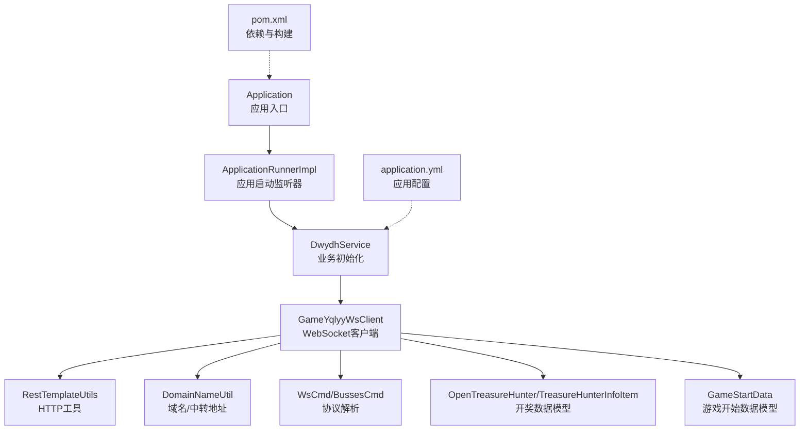
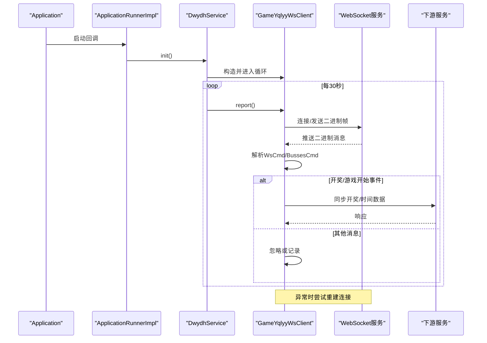
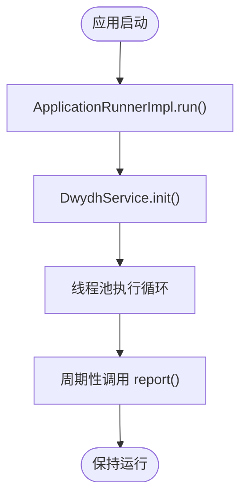
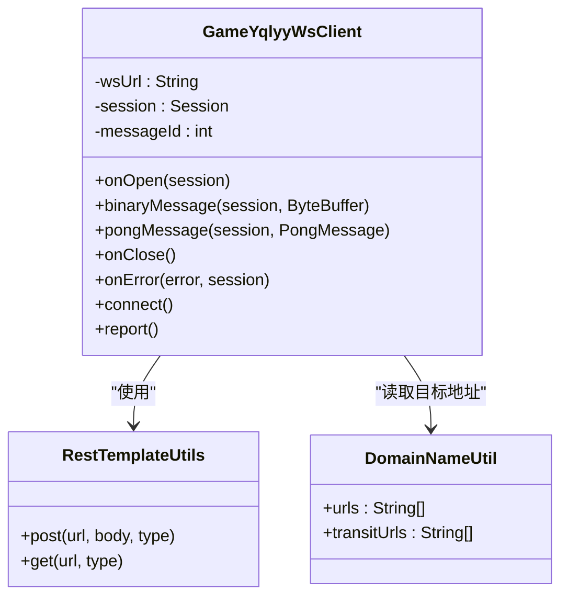
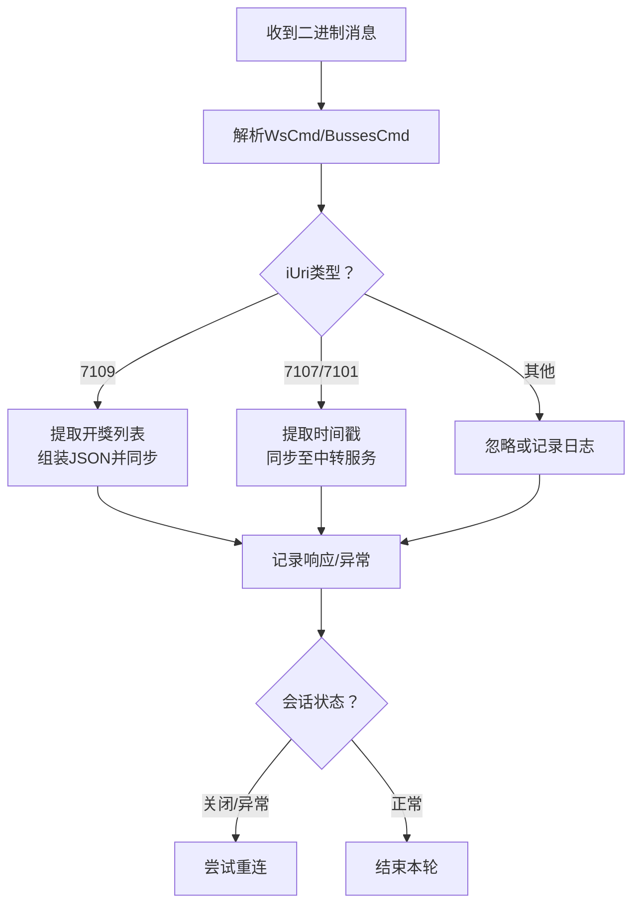
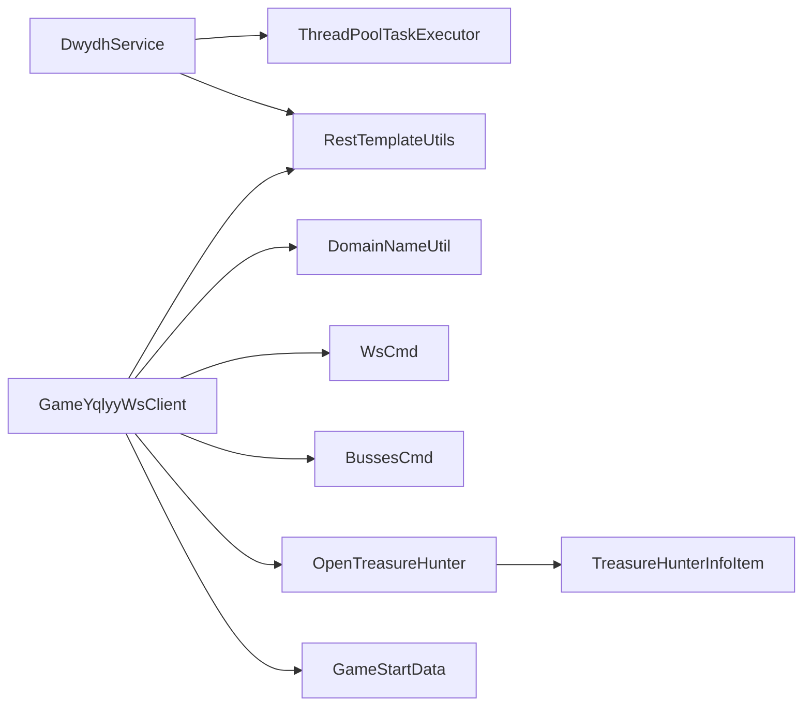

# 状态管理

<cite>
**本文引用的文件**
- [Application.java](file://src/main/java/com/Application.java)
- [ApplicationRunnerImpl.java](file://src/main/java/com/listener/ApplicationRunnerImpl.java)
- [DwydhService.java](file://src/main/java/com/dwydh/DwydhService.java)
- [GameYqlyyWsClient.java](file://src/main/java/com/yqlyy/GameYqlyyWsClient.java)
- [RestTemplateUtils.java](file://src/main/java/com/commom/RestTemplateUtils.java)
- [DomainNameUtil.java](file://src/main/java/com/utils/DomainNameUtil.java)
- [application.yml](file://src/main/resources/application.yml)
- [pom.xml](file://pom.xml)
- [WsCmd.java](file://src/main/java/com/entity/WsCmd.java)
- [BussesCmd.java](file://src/main/java/com/entity/BussesCmd.java)
- [OpenTreasureHunter.java](file://src/main/java/com/entity/AccountedNotify/OpenTreasureHunter.java)
- [TreasureHunterInfoItem.java](file://src/main/java/com/entity/AccountedNotify/TreasureHunterInfoItem.java)
- [GameStartData.java](file://src/main/java/com/entity/GameStartData.java)
</cite>

## 目录
1. [简介](#简介)
2. [项目结构](#项目结构)
3. [核心组件](#核心组件)
4. [架构总览](#架构总览)
5. [详细组件分析](#详细组件分析)
6. [依赖关系分析](#依赖关系分析)
7. [性能与稳定性考量](#性能与稳定性考量)
8. [故障排查指南](#故障排查指南)
9. [结论](#结论)
10. [附录](#附录)

## 简介
本文件围绕“状态管理”主题，系统梳理该代码库在业务运行过程中的状态转换与控制机制，重点覆盖：
- 应用启动、运行、停止等关键阶段的状态管理
- WebSocket 连接状态的监控与维护（连接建立、心跳与异常恢复）
- 客户端状态生命周期管理与状态持久化策略
- 状态变更的触发条件与处理流程
- 状态监控与诊断工具的使用方法
- 状态异常的处理策略与恢复机制
- 具体的状态管理示例与调试技巧

## 项目结构
该项目为基于 Spring Boot 的 Java 应用，采用分层与按功能模块组织的结构：
- 启动入口与监听器：Application、ApplicationRunnerImpl
- 业务服务：DwydhService
- WebSocket 客户端：GameYqlyyWsClient
- HTTP 工具：RestTemplateUtils
- 配置：application.yml
- 实体模型：WsCmd、BussesCmd、OpenTreasureHunter、TreasureHunterInfoItem、GameStartData
- 工具类：DomainNameUtil
- 依赖管理：pom.xml

图表来源
- [Application.java](file://src/main/java/com/Application.java#L1-L14)
- [ApplicationRunnerImpl.java](file://src/main/java/com/listener/ApplicationRunnerImpl.java#L1-L34)
- [DwydhService.java](file://src/main/java/com/dwydh/DwydhService.java#L1-L39)
- [GameYqlyyWsClient.java](file://src/main/java/com/yqlyy/GameYqlyyWsClient.java#L1-L328)
- [RestTemplateUtils.java](file://src/main/java/com/commom/RestTemplateUtils.java#L1-L31)
- [DomainNameUtil.java](file://src/main/java/com/utils/DomainNameUtil.java#L1-L16)
- [application.yml](file://src/main/resources/application.yml#L1-L31)
- [pom.xml](file://pom.xml#L1-L160)

章节来源
- [Application.java](file://src/main/java/com/Application.java#L1-L14)
- [ApplicationRunnerImpl.java](file://src/main/java/com/listener/ApplicationRunnerImpl.java#L1-L34)
- [DwydhService.java](file://src/main/java/com/dwydh/DwydhService.java#L1-L39)
- [GameYqlyyWsClient.java](file://src/main/java/com/yqlyy/GameYqlyyWsClient.java#L1-L328)
- [RestTemplateUtils.java](file://src/main/java/com/commom/RestTemplateUtils.java#L1-L31)
- [DomainNameUtil.java](file://src/main/java/com/utils/DomainNameUtil.java#L1-L16)
- [application.yml](file://src/main/resources/application.yml#L1-L31)
- [pom.xml](file://pom.xml#L1-L160)

## 核心组件
- 应用入口与启动监听器：负责应用启动后的初始化任务调度
- 业务服务：封装 WebSocket 客户端的生命周期与状态维护
- WebSocket 客户端：负责连接、消息处理、异常恢复
- HTTP 工具：封装 REST 请求，用于向下游服务同步状态
- 实体模型：承载 WebSocket 协议解析与业务数据结构
- 配置与依赖：提供运行参数、线程池、网络超时等基础能力

章节来源
- [Application.java](file://src/main/java/com/Application.java#L1-L14)
- [ApplicationRunnerImpl.java](file://src/main/java/com/listener/ApplicationRunnerImpl.java#L1-L34)
- [DwydhService.java](file://src/main/java/com/dwydh/DwydhService.java#L1-L39)
- [GameYqlyyWsClient.java](file://src/main/java/com/yqlyy/GameYqlyyWsClient.java#L1-L328)
- [RestTemplateUtils.java](file://src/main/java/com/commom/RestTemplateUtils.java#L1-L31)
- [WsCmd.java](file://src/main/java/com/entity/WsCmd.java#L1-L69)
- [BussesCmd.java](file://src/main/java/com/entity/BussesCmd.java#L1-L10)
- [OpenTreasureHunter.java](file://src/main/java/com/entity/AccountedNotify/OpenTreasureHunter.java#L1-L82)
- [TreasureHunterInfoItem.java](file://src/main/java/com/entity/AccountedNotify/TreasureHunterInfoItem.java#L1-L123)
- [GameStartData.java](file://src/main/java/com/entity/GameStartData.java#L1-L62)

## 架构总览
整体运行流程如下：
- 应用启动后，通过 ApplicationRunnerImpl 触发 DwydhService 初始化
- DwydhService 在线程池中创建 GameYqlyyWsClient，并周期性调用其上报逻辑
- WebSocket 客户端负责连接建立、消息接收、业务数据解析与下游同步
- 异常发生时，客户端尝试重建连接以维持状态稳定

图表来源
- [ApplicationRunnerImpl.java](file://src/main/java/com/listener/ApplicationRunnerImpl.java#L25-L31)
- [DwydhService.java](file://src/main/java/com/dwydh/DwydhService.java#L21-L36)
- [GameYqlyyWsClient.java](file://src/main/java/com/yqlyy/GameYqlyyWsClient.java#L274-L290)
- [RestTemplateUtils.java](file://src/main/java/com/commom/RestTemplateUtils.java#L19-L25)

## 详细组件分析

### 应用启动与运行状态管理
- 启动阶段：Application 作为 Spring Boot 入口，启动容器；随后由 ApplicationRunnerImpl 执行初始化逻辑
- 运行阶段：DwydhService 在线程池中执行 WebSocket 客户端的持续上报循环
- 停止阶段：当前实现未显式注册 JVM 关闭钩子，建议在生产环境补充优雅停机逻辑

图表来源
- [Application.java](file://src/main/java/com/Application.java#L8-L11)
- [ApplicationRunnerImpl.java](file://src/main/java/com/listener/ApplicationRunnerImpl.java#L25-L31)
- [DwydhService.java](file://src/main/java/com/dwydh/DwydhService.java#L21-L36)

章节来源
- [Application.java](file://src/main/java/com/Application.java#L1-L14)
- [ApplicationRunnerImpl.java](file://src/main/java/com/listener/ApplicationRunnerImpl.java#L1-L34)
- [DwydhService.java](file://src/main/java/com/dwydh/DwydhService.java#L1-L39)

### WebSocket 客户端状态管理与心跳维护
- 连接建立：构造 WebSocketContainer，设置默认缓冲区大小与超时，按配置 URL 建立连接
- 心跳检测：客户端具备 PongMessage 处理回调，用于记录心跳响应
- 异常恢复：当会话为空或关闭时，自动尝试重新连接；发送二进制帧异常时同样触发重连

图表来源
- [GameYqlyyWsClient.java](file://src/main/java/com/yqlyy/GameYqlyyWsClient.java#L29-L328)
- [RestTemplateUtils.java](file://src/main/java/com/commom/RestTemplateUtils.java#L1-L31)
- [DomainNameUtil.java](file://src/main/java/com/utils/DomainNameUtil.java#L1-L16)

章节来源
- [GameYqlyyWsClient.java](file://src/main/java/com/yqlyy/GameYqlyyWsClient.java#L221-L290)
- [RestTemplateUtils.java](file://src/main/java/com/commom/RestTemplateUtils.java#L1-L31)
- [DomainNameUtil.java](file://src/main/java/com/utils/DomainNameUtil.java#L1-L16)

### 客户端状态生命周期与持久化
- 生命周期：客户端在 DwydhService 的线程池中长期运行，通过 report() 循环维持连接与上报
- 状态持久化：当前未见本地持久化机制；建议在生产环境引入轻量级状态落盘（如内存快照或外部存储），以便重启后快速恢复
- 建议：在 report() 中加入状态快照与恢复逻辑，结合配置项控制是否启用

章节来源
- [DwydhService.java](file://src/main/java/com/dwydh/DwydhService.java#L21-L36)
- [GameYqlyyWsClient.java](file://src/main/java/com/yqlyy/GameYqlyyWsClient.java#L274-L290)

### 状态变更触发条件与处理流程
- 触发条件
  - WebSocket 连接建立成功（onOpen）
  - 收到二进制消息（binaryMessage）
  - Pong 心跳响应（pongMessage）
  - 连接关闭或异常（onClose/onError）
- 处理流程
  - 解析 WsCmd/BussesCmd，识别 iUri 类型
  - 对开奖事件（如 7109）提取 TreasureHunterInfoItem 列表，组装 JSON 并同步至下游
  - 对游戏开始事件（如 7107/7101）提取 GameStartData 时间戳，同步至中转服务
  - 若异常或会话不可用，触发 reconnect 流程

图表来源
- [GameYqlyyWsClient.java](file://src/main/java/com/yqlyy/GameYqlyyWsClient.java#L51-L219)
- [WsCmd.java](file://src/main/java/com/entity/WsCmd.java#L1-L69)
- [BussesCmd.java](file://src/main/java/com/entity/BussesCmd.java#L1-L10)
- [OpenTreasureHunter.java](file://src/main/java/com/entity/AccountedNotify/OpenTreasureHunter.java#L1-L82)
- [TreasureHunterInfoItem.java](file://src/main/java/com/entity/AccountedNotify/TreasureHunterInfoItem.java#L1-L123)
- [GameStartData.java](file://src/main/java/com/entity/GameStartData.java#L1-L62)

章节来源
- [GameYqlyyWsClient.java](file://src/main/java/com/yqlyy/GameYqlyyWsClient.java#L51-L219)
- [WsCmd.java](file://src/main/java/com/entity/WsCmd.java#L1-L69)
- [BussesCmd.java](file://src/main/java/com/entity/BussesCmd.java#L1-L10)
- [OpenTreasureHunter.java](file://src/main/java/com/entity/AccountedNotify/OpenTreasureHunter.java#L1-L82)
- [TreasureHunterInfoItem.java](file://src/main/java/com/entity/AccountedNotify/TreasureHunterInfoItem.java#L1-L123)
- [GameStartData.java](file://src/main/java/com/entity/GameStartData.java#L1-L62)

### 状态监控与诊断工具
- 日志输出：客户端在连接、异常、心跳、消息处理等关键节点输出日志，便于定位问题
- HTTP 同步：通过 RestTemplateUtils 将状态同步至下游服务，可结合下游返回值进行二次校验
- 建议：集成指标采集（如 Micrometer）与健康检查端点，增强可观测性

章节来源
- [GameYqlyyWsClient.java](file://src/main/java/com/yqlyy/GameYqlyyWsClient.java#L46-L49)
- [RestTemplateUtils.java](file://src/main/java/com/commom/RestTemplateUtils.java#L1-L31)

### 状态异常处理与恢复机制
- 连接异常：onError 记录异常；report 发送二进制帧异常时触发重连
- 会话关闭：onClose 记录关闭；report 检测 session 为空或关闭时重连
- 心跳异常：pongMessage 仅记录，建议在上层增加心跳超时检测与主动重连策略

章节来源
- [GameYqlyyWsClient.java](file://src/main/java/com/yqlyy/GameYqlyyWsClient.java#L245-L248)
- [GameYqlyyWsClient.java](file://src/main/java/com/yqlyy/GameYqlyyWsClient.java#L274-L290)

### 状态管理示例与调试技巧
- 示例场景：定时上报（每30秒）、心跳响应、开奖/游戏开始事件同步
- 调试技巧
  - 打开详细日志级别，观察 onOpen、pongMessage、binaryMessage、onError 的输出
  - 在 DomainNameUtil 中配置真实下游地址，验证 HTTP 同步链路
  - 使用抓包工具（如 Wireshark 或浏览器开发者工具）捕获 WebSocket 二进制帧，辅助解析 iUri 与 sMsg 内容

章节来源
- [DwydhService.java](file://src/main/java/com/dwydh/DwydhService.java#L21-L36)
- [GameYqlyyWsClient.java](file://src/main/java/com/yqlyy/GameYqlyyWsClient.java#L221-L290)
- [DomainNameUtil.java](file://src/main/java/com/utils/DomainNameUtil.java#L1-L16)

## 依赖关系分析
- 组件耦合
  - DwydhService 依赖 ThreadPoolTaskExecutor 与 RestTemplateUtils
  - GameYqlyyWsClient 依赖 RestTemplateUtils 与 DomainNameUtil
  - 实体模型（WsCmd、BussesCmd、OpenTreasureHunter 等）被客户端用于协议解析
- 外部依赖
  - Spring Boot Web、WebSocket 客户端、HTTP 客户端、日志框架、TARS 协议支持

图表来源
- [DwydhService.java](file://src/main/java/com/dwydh/DwydhService.java#L1-L39)
- [GameYqlyyWsClient.java](file://src/main/java/com/yqlyy/GameYqlyyWsClient.java#L1-L328)
- [RestTemplateUtils.java](file://src/main/java/com/commom/RestTemplateUtils.java#L1-L31)
- [DomainNameUtil.java](file://src/main/java/com/utils/DomainNameUtil.java#L1-L16)
- [WsCmd.java](file://src/main/java/com/entity/WsCmd.java#L1-L69)
- [BussesCmd.java](file://src/main/java/com/entity/BussesCmd.java#L1-L10)
- [OpenTreasureHunter.java](file://src/main/java/com/entity/AccountedNotify/OpenTreasureHunter.java#L1-L82)
- [TreasureHunterInfoItem.java](file://src/main/java/com/entity/AccountedNotify/TreasureHunterInfoItem.java#L1-L123)
- [GameStartData.java](file://src/main/java/com/entity/GameStartData.java#L1-L62)

章节来源
- [DwydhService.java](file://src/main/java/com/dwydh/DwydhService.java#L1-L39)
- [GameYqlyyWsClient.java](file://src/main/java/com/yqlyy/GameYqlyyWsClient.java#L1-L328)
- [RestTemplateUtils.java](file://src/main/java/com/commom/RestTemplateUtils.java#L1-L31)
- [DomainNameUtil.java](file://src/main/java/com/utils/DomainNameUtil.java#L1-L16)
- [WsCmd.java](file://src/main/java/com/entity/WsCmd.java#L1-L69)
- [BussesCmd.java](file://src/main/java/com/entity/BussesCmd.java#L1-L10)
- [OpenTreasureHunter.java](file://src/main/java/com/entity/AccountedNotify/OpenTreasureHunter.java#L1-L82)
- [TreasureHunterInfoItem.java](file://src/main/java/com/entity/AccountedNotify/TreasureHunterInfoItem.java#L1-L123)
- [GameStartData.java](file://src/main/java/com/entity/GameStartData.java#L1-L62)

## 性能与稳定性考量
- 连接与缓冲
  - 默认二进制消息缓冲区上限与会话空闲超时已配置，建议根据实际流量调整
- 线程与并发
  - 使用线程池隔离 WebSocket 客户端任务，避免阻塞主线程
- 超时与重试
  - HTTP 请求超时与连接池参数已在 application.yml 中配置，建议结合业务重试策略
- 心跳与保活
  - 当前仅记录 Pong，建议增加心跳超时检测与主动 ping 机制

章节来源
- [GameYqlyyWsClient.java](file://src/main/java/com/yqlyy/GameYqlyyWsClient.java#L254-L257)
- [application.yml](file://src/main/resources/application.yml#L16-L31)

## 故障排查指南
- 连接失败
  - 检查 wsUrl 是否有效；查看 onOpen 与 onError 日志
  - 确认网络可达与证书/域名配置
- 心跳异常
  - 观察 pongMessage 日志；若长时间无响应，考虑增加心跳超时检测
- 消息解析异常
  - 检查 iUri 与 sMsg 的解析逻辑；必要时打印原始二进制内容辅助分析
- HTTP 同步失败
  - 查看 RestTemplateUtils 返回值与异常日志；确认下游服务地址与权限

章节来源
- [GameYqlyyWsClient.java](file://src/main/java/com/yqlyy/GameYqlyyWsClient.java#L221-L248)
- [RestTemplateUtils.java](file://src/main/java/com/commom/RestTemplateUtils.java#L1-L31)

## 结论
本项目通过 ApplicationRunnerImpl 触发业务初始化，DwydhService 在线程池中驱动 GameYqlyyWsClient 实现 WebSocket 连接与状态同步。当前实现具备基本的心跳记录与异常重连能力，建议在生产环境中补充：
- 显式优雅停机与状态持久化
- 心跳超时检测与主动 ping
- 指标采集与健康检查
- 更完善的错误分类与重试策略

## 附录
- 配置参考
  - 端口与上下文路径：application.yml
  - HTTP 连接池与超时：application.yml
  - 依赖与构建：pom.xml
- 数据模型参考
  - WsCmd、BussesCmd、OpenTreasureHunter、TreasureHunterInfoItem、GameStartData

章节来源
- [application.yml](file://src/main/resources/application.yml#L1-L31)
- [pom.xml](file://pom.xml#L1-L160)
- [WsCmd.java](file://src/main/java/com/entity/WsCmd.java#L1-L69)
- [BussesCmd.java](file://src/main/java/com/entity/BussesCmd.java#L1-L10)
- [OpenTreasureHunter.java](file://src/main/java/com/entity/AccountedNotify/OpenTreasureHunter.java#L1-L82)
- [TreasureHunterInfoItem.java](file://src/main/java/com/entity/AccountedNotify/TreasureHunterInfoItem.java#L1-L123)
- [GameStartData.java](file://src/main/java/com/entity/GameStartData.java#L1-L62)