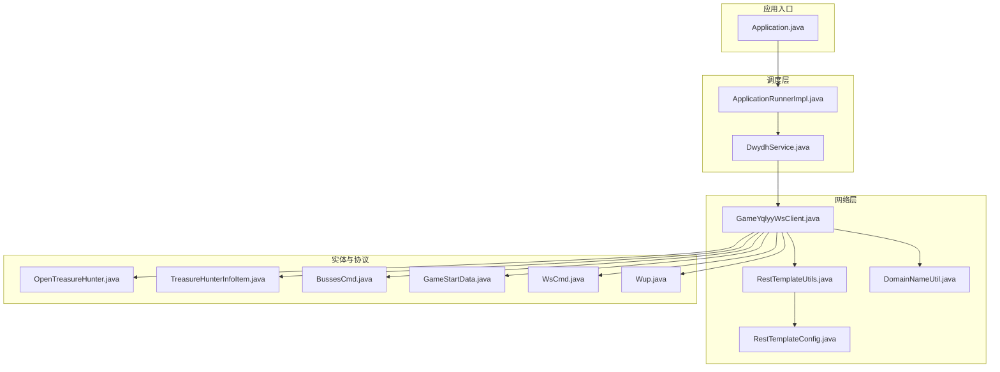
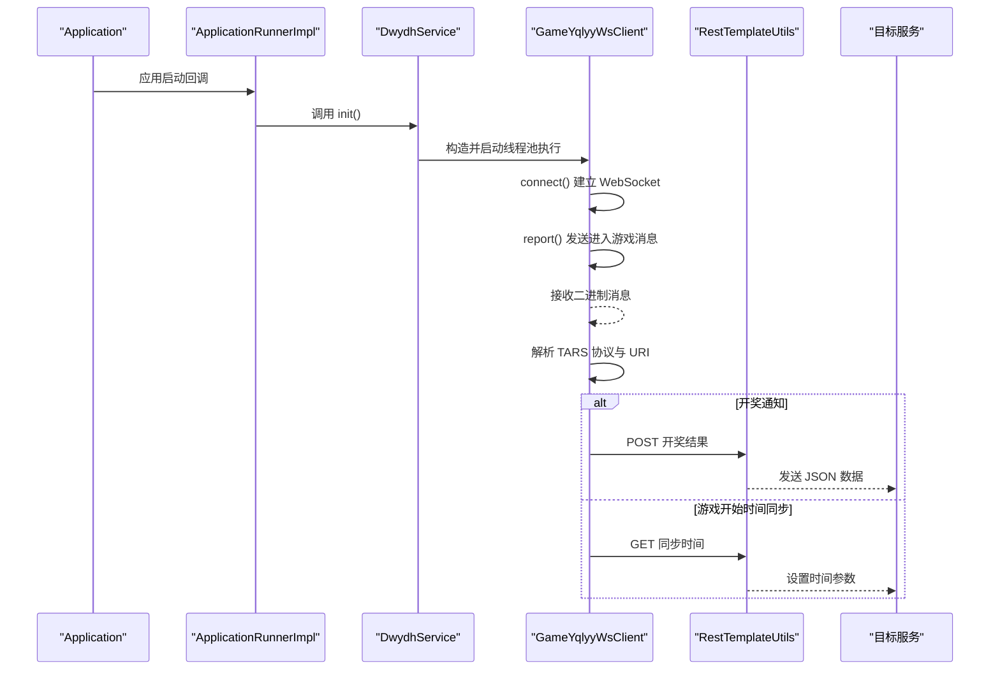
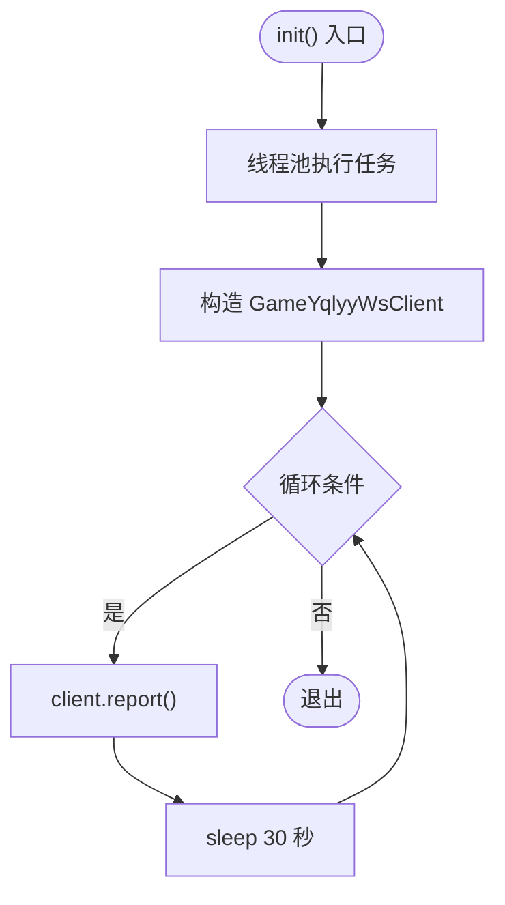
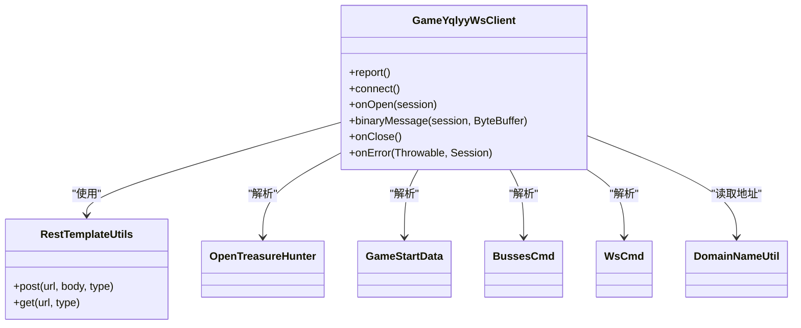
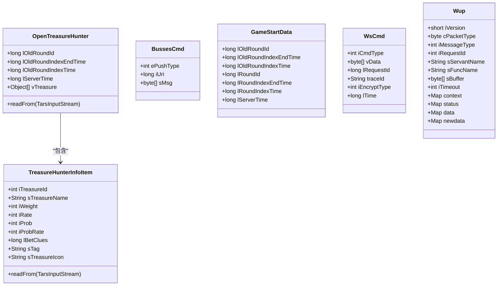
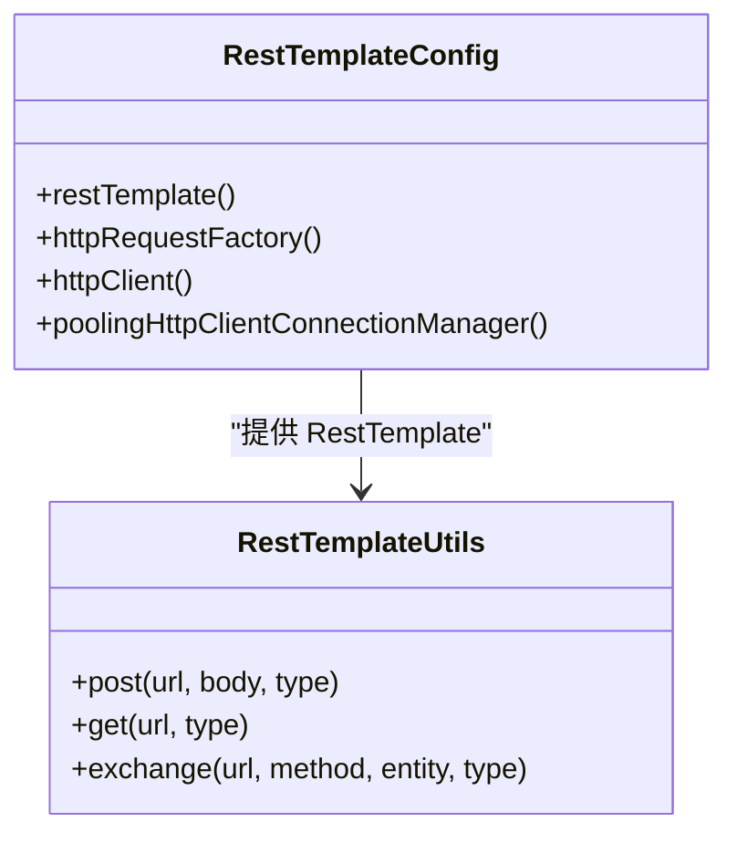
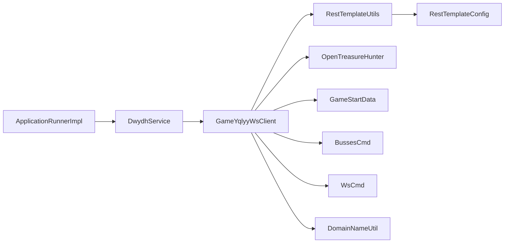

# 代码结构理解

<cite>
**本文引用的文件**
- [Application.java](file://src/main/java/com/Application.java)
- [DwydhService.java](file://src/main/java/com/dwydh/DwydhService.java)
- [GameYqlyyWsClient.java](file://src/main/java/com/yqlyy/GameYqlyyWsClient.java)
- [ApplicationRunnerImpl.java](file://src/main/java/com/listener/ApplicationRunnerImpl.java)
- [RestTemplateConfig.java](file://src/main/java/com/commom/RestTemplateConfig.java)
- [RestTemplateUtils.java](file://src/main/java/com/commom/RestTemplateUtils.java)
- [DomainNameUtil.java](file://src/main/java/com/utils/DomainNameUtil.java)
- [OpenTreasureHunter.java](file://src/main/java/com/entity/AccountedNotify/OpenTreasureHunter.java)
- [TreasureHunterInfoItem.java](file://src/main/java/com/entity/AccountedNotify/TreasureHunterInfoItem.java)
- [BussesCmd.java](file://src/main/java/com/entity/BussesCmd.java)
- [GameStartData.java](file://src/main/java/com/entity/GameStartData.java)
- [WsCmd.java](file://src/main/java/com/entity/WsCmd.java)
- [Wup.java](file://src/main/java/com/entity/Wup.java)
</cite>

## 目录
1. [简介](#简介)
2. [项目结构](#项目结构)
3. [核心组件](#核心组件)
4. [架构总览](#架构总览)
5. [详细组件分析](#详细组件分析)
6. [依赖分析](#依赖分析)
7. [性能考虑](#性能考虑)
8. [故障排查指南](#故障排查指南)
9. [结论](#结论)
10. [附录：新成员上手导航](#附录新成员上手导航)

## 简介
本指南面向希望深入理解该代码库的开发者与新成员，系统梳理项目目录结构、包划分原则、核心类职责、模块间交互与依赖注入机制，并结合实际代码路径给出循序渐进的阅读建议与最佳实践。项目围绕“虎牙游戏数据采集与通知”展开，通过 WebSocket 接收游戏推送，解析协议后将开奖结果与时间同步至内部中转服务。

## 项目结构
项目采用按功能域分包的组织方式，主要包如下：
- com：应用入口与通用配置
- com.dwydh：调度与任务执行（定时线程池）
- com.yqlyy：WebSocket 客户端与协议解析
- com.entity：协议与业务实体模型
- com.commom：HTTP 客户端配置与工具
- com.utils：域名与中转地址等工具
- com.listener：应用启动回调

**图表来源**
- [Application.java](file://src/main/java/com/Application.java#L1-L14)
- [DwydhService.java](file://src/main/java/com/dwydh/DwydhService.java#L1-L39)
- [GameYqlyyWsClient.java](file://src/main/java/com/yqlyy/GameYqlyyWsClient.java#L1-L328)
- [ApplicationRunnerImpl.java](file://src/main/java/com/listener/ApplicationRunnerImpl.java#L1-L34)
- [RestTemplateConfig.java](file://src/main/java/com/commom/RestTemplateConfig.java#L1-L132)
- [RestTemplateUtils.java](file://src/main/java/com/commom/RestTemplateUtils.java#L1-L31)
- [DomainNameUtil.java](file://src/main/java/com/utils/DomainNameUtil.java#L1-L16)
- [OpenTreasureHunter.java](file://src/main/java/com/entity/AccountedNotify/OpenTreasureHunter.java#L1-L83)
- [TreasureHunterInfoItem.java](file://src/main/java/com/entity/AccountedNotify/TreasureHunterInfoItem.java#L1-L124)
- [BussesCmd.java](file://src/main/java/com/entity/BussesCmd.java#L1-L10)
- [GameStartData.java](file://src/main/java/com/entity/GameStartData.java#L1-L79)
- [WsCmd.java](file://src/main/java/com/entity/WsCmd.java#L1-L69)
- [Wup.java](file://src/main/java/com/entity/Wup.java#L1-L29)

**章节来源**
- [Application.java](file://src/main/java/com/Application.java#L1-L14)
- [DwydhService.java](file://src/main/java/com/dwydh/DwydhService.java#L1-L39)
- [GameYqlyyWsClient.java](file://src/main/java/com/yqlyy/GameYqlyyWsClient.java#L1-L328)
- [ApplicationRunnerImpl.java](file://src/main/java/com/listener/ApplicationRunnerImpl.java#L1-L34)
- [RestTemplateConfig.java](file://src/main/java/com/commom/RestTemplateConfig.java#L1-L132)
- [RestTemplateUtils.java](file://src/main/java/com/commom/RestTemplateUtils.java#L1-L31)
- [DomainNameUtil.java](file://src/main/java/com/utils/DomainNameUtil.java#L1-L16)
- [OpenTreasureHunter.java](file://src/main/java/com/entity/AccountedNotify/OpenTreasureHunter.java#L1-L83)
- [TreasureHunterInfoItem.java](file://src/main/java/com/entity/AccountedNotify/TreasureHunterInfoItem.java#L1-L124)
- [BussesCmd.java](file://src/main/java/com/entity/BussesCmd.java#L1-L10)
- [GameStartData.java](file://src/main/java/com/entity/GameStartData.java#L1-L79)
- [WsCmd.java](file://src/main/java/com/entity/WsCmd.java#L1-L69)
- [Wup.java](file://src/main/java/com/entity/Wup.java#L1-L29)

## 核心组件
- Application：Spring Boot 启动入口，负责加载上下文并启动应用。
- DwydhService：调度器，使用线程池异步初始化 WebSocket 客户端并周期性上报。
- GameYqlyyWsClient：WebSocket 客户端，负责建立连接、接收二进制消息、解析 TARS 协议、触发 HTTP 通知。
- ApplicationRunnerImpl：应用启动回调，负责在应用启动后调用调度器初始化。
- RestTemplateConfig/RestTemplateUtils：HTTP 客户端配置与封装，统一对外提供 GET/POST 能力。
- DomainNameUtil：集中维护目标服务地址与中转地址。
- 实体与协议：OpenTreasureHunter、TreasureHunterInfoItem、BussesCmd、GameStartData、WsCmd、Wup 等，承载协议字段与解析逻辑。

**章节来源**
- [Application.java](file://src/main/java/com/Application.java#L1-L14)
- [DwydhService.java](file://src/main/java/com/dwydh/DwydhService.java#L1-L39)
- [GameYqlyyWsClient.java](file://src/main/java/com/yqlyy/GameYqlyyWsClient.java#L1-L328)
- [ApplicationRunnerImpl.java](file://src/main/java/com/listener/ApplicationRunnerImpl.java#L1-L34)
- [RestTemplateConfig.java](file://src/main/java/com/commom/RestTemplateConfig.java#L1-L132)
- [RestTemplateUtils.java](file://src/main/java/com/commom/RestTemplateUtils.java#L1-L31)
- [DomainNameUtil.java](file://src/main/java/com/utils/DomainNameUtil.java#L1-L16)
- [OpenTreasureHunter.java](file://src/main/java/com/entity/AccountedNotify/OpenTreasureHunter.java#L1-L83)
- [TreasureHunterInfoItem.java](file://src/main/java/com/entity/AccountedNotify/TreasureHunterInfoItem.java#L1-L124)
- [BussesCmd.java](file://src/main/java/com/entity/BussesCmd.java#L1-L10)
- [GameStartData.java](file://src/main/java/com/entity/GameStartData.java#L1-L79)
- [WsCmd.java](file://src/main/java/com/entity/WsCmd.java#L1-L69)
- [Wup.java](file://src/main/java/com/entity/Wup.java#L1-L29)

## 架构总览
整体流程：应用启动 → 启动回调 → 调度器启动 WebSocket 客户端 → WebSocket 接收二进制消息 → 解析协议 → 按不同 URI 分发处理 → 通过 HTTP 工具向中转或目标服务发送结果。

**图表来源**
- [Application.java](file://src/main/java/com/Application.java#L1-L14)
- [ApplicationRunnerImpl.java](file://src/main/java/com/listener/ApplicationRunnerImpl.java#L1-L34)
- [DwydhService.java](file://src/main/java/com/dwydh/DwydhService.java#L1-L39)
- [GameYqlyyWsClient.java](file://src/main/java/com/yqlyy/GameYqlyyWsClient.java#L1-L328)
- [RestTemplateUtils.java](file://src/main/java/com/commom/RestTemplateUtils.java#L1-L31)

## 详细组件分析

### Application 启动入口
- 职责：声明 Spring Boot 启动类，作为 JVM 入口。
- 关键点：无额外初始化逻辑，交由 Spring 容器管理。

**章节来源**
- [Application.java](file://src/main/java/com/Application.java#L1-L14)

### ApplicationRunnerImpl 应用启动回调
- 职责：实现 ApplicationRunner，在应用启动完成后调用 DwydhService.init()。
- 设计要点：通过 @Resource 注入 DwydhService，确保在容器就绪后执行。

**章节来源**
- [ApplicationRunnerImpl.java](file://src/main/java/com/listener/ApplicationRunnerImpl.java#L1-L34)

### DwydhService 调度器
- 职责：使用线程池异步启动 WebSocket 客户端；循环调用客户端的 report() 方法。
- 设计要点：使用 @Resource 注入 ThreadPoolTaskExecutor 与 RestTemplateUtils；在 while(true) 循环中定期上报，具备基本的异常处理与中断捕获。

**图表来源**
- [DwydhService.java](file://src/main/java/com/dwydh/DwydhService.java#L1-L39)

**章节来源**
- [DwydhService.java](file://src/main/java/com/dwydh/DwydhService.java#L1-L39)

### GameYqlyyWsClient WebSocket 客户端
- 职责：建立 WebSocket 连接、发送进入游戏消息、接收二进制消息、解析 TARS 协议、根据 iUri 分发处理并调用 HTTP 工具上报。
- 关键处理：
  - binaryMessage：解析 WsCmd → BussesCmd → 不同 iUri 的业务对象（如 OpenTreasureHunter、GameStartData）。
  - onOpen：发送进入游戏的二进制握手包。
  - report：在会话关闭时自动重连并再次发送进入游戏消息。
  - connect：基于默认容器配置建立连接，设置缓冲区大小与超时。
- 依赖注入：通过构造函数注入 RestTemplateUtils；内部使用 DomainNameUtil 中的 urls/transitUrls。

**图表来源**
- [GameYqlyyWsClient.java](file://src/main/java/com/yqlyy/GameYqlyyWsClient.java#L1-L328)
- [RestTemplateUtils.java](file://src/main/java/com/commom/RestTemplateUtils.java#L1-L31)
- [OpenTreasureHunter.java](file://src/main/java/com/entity/AccountedNotify/OpenTreasureHunter.java#L1-L83)
- [GameStartData.java](file://src/main/java/com/entity/GameStartData.java#L1-L79)
- [BussesCmd.java](file://src/main/java/com/entity/BussesCmd.java#L1-L10)
- [WsCmd.java](file://src/main/java/com/entity/WsCmd.java#L1-L69)
- [DomainNameUtil.java](file://src/main/java/com/utils/DomainNameUtil.java#L1-L16)

**章节来源**
- [GameYqlyyWsClient.java](file://src/main/java/com/yqlyy/GameYqlyyWsClient.java#L1-L328)

### 实体与协议模型
- OpenTreasureHunter：包含历史轮次 ID、时间戳、服务器时间以及动物列表等字段，支持从 TARS 输入流读取。
- TreasureHunterInfoItem：单个动物项，包含 ID、名称、权重、概率、注码等字段。
- BussesCmd：承载推送类型、URI 与消息体。
- GameStartData：承载轮次时间与服务器时间等字段。
- WsCmd：承载命令类型、数据体、请求 ID、追踪 ID、加密类型、时间戳等字段。
- Wup：承载协议版本、包类型、消息类型、请求 ID、函数名、缓冲区、上下文与状态等字段。

**图表来源**
- [OpenTreasureHunter.java](file://src/main/java/com/entity/AccountedNotify/OpenTreasureHunter.java#L1-L83)
- [TreasureHunterInfoItem.java](file://src/main/java/com/entity/AccountedNotify/TreasureHunterInfoItem.java#L1-L124)
- [BussesCmd.java](file://src/main/java/com/entity/BussesCmd.java#L1-L10)
- [GameStartData.java](file://src/main/java/com/entity/GameStartData.java#L1-L79)
- [WsCmd.java](file://src/main/java/com/entity/WsCmd.java#L1-L69)
- [Wup.java](file://src/main/java/com/entity/Wup.java#L1-L29)

**章节来源**
- [OpenTreasureHunter.java](file://src/main/java/com/entity/AccountedNotify/OpenTreasureHunter.java#L1-L83)
- [TreasureHunterInfoItem.java](file://src/main/java/com/entity/AccountedNotify/TreasureHunterInfoItem.java#L1-L124)
- [BussesCmd.java](file://src/main/java/com/entity/BussesCmd.java#L1-L10)
- [GameStartData.java](file://src/main/java/com/entity/GameStartData.java#L1-L79)
- [WsCmd.java](file://src/main/java/com/entity/WsCmd.java#L1-L69)
- [Wup.java](file://src/main/java/com/entity/Wup.java#L1-L29)

### HTTP 工具与配置
- RestTemplateConfig：定义 RestTemplate、HttpClient、连接池与请求工厂 Bean，支持超时、重试、Keep-Alive 等配置。
- RestTemplateUtils：对 RestTemplate 的轻量封装，提供 GET/POST/exchange 方法。

**图表来源**
- [RestTemplateConfig.java](file://src/main/java/com/commom/RestTemplateConfig.java#L1-L132)
- [RestTemplateUtils.java](file://src/main/java/com/commom/RestTemplateUtils.java#L1-L31)

**章节来源**
- [RestTemplateConfig.java](file://src/main/java/com/commom/RestTemplateConfig.java#L1-L132)
- [RestTemplateUtils.java](file://src/main/java/com/commom/RestTemplateUtils.java#L1-L31)

### 工具类 DomainNameUtil
- 职责：集中维护目标服务地址数组与中转地址数组，便于统一替换与扩展。

**章节来源**
- [DomainNameUtil.java](file://src/main/java/com/utils/DomainNameUtil.java#L1-L16)

## 依赖分析
- 控制反转与依赖注入：
  - ApplicationRunnerImpl 通过 @Resource 注入 DwydhService。
  - DwydhService 通过 @Resource 注入 ThreadPoolTaskExecutor 与 RestTemplateUtils。
  - GameYqlyyWsClient 通过构造函数注入 RestTemplateUtils。
- 组件耦合：
  - DwydhService 与 GameYqlyyWsClient 存在直接实例化关系（在 init 内部），属于“被调度”与“执行者”的关系。
  - GameYqlyyWsClient 与实体模型存在解析耦合，但字段与方法边界清晰。
- 外部依赖：
  - WebSocket 容器、TARS 协议解析库、Apache HttpClient、Spring Web。

**图表来源**
- [ApplicationRunnerImpl.java](file://src/main/java/com/listener/ApplicationRunnerImpl.java#L1-L34)
- [DwydhService.java](file://src/main/java/com/dwydh/DwydhService.java#L1-L39)
- [GameYqlyyWsClient.java](file://src/main/java/com/yqlyy/GameYqlyyWsClient.java#L1-L328)
- [RestTemplateUtils.java](file://src/main/java/com/commom/RestTemplateUtils.java#L1-L31)
- [RestTemplateConfig.java](file://src/main/java/com/commom/RestTemplateConfig.java#L1-L132)
- [OpenTreasureHunter.java](file://src/main/java/com/entity/AccountedNotify/OpenTreasureHunter.java#L1-L83)
- [GameStartData.java](file://src/main/java/com/entity/GameStartData.java#L1-L79)
- [BussesCmd.java](file://src/main/java/com/entity/BussesCmd.java#L1-L10)
- [WsCmd.java](file://src/main/java/com/entity/WsCmd.java#L1-L69)
- [DomainNameUtil.java](file://src/main/java/com/utils/DomainNameUtil.java#L1-L16)

**章节来源**
- [ApplicationRunnerImpl.java](file://src/main/java/com/listener/ApplicationRunnerImpl.java#L1-L34)
- [DwydhService.java](file://src/main/java/com/dwydh/DwydhService.java#L1-L39)
- [GameYqlyyWsClient.java](file://src/main/java/com/yqlyy/GameYqlyyWsClient.java#L1-L328)
- [RestTemplateUtils.java](file://src/main/java/com/commom/RestTemplateUtils.java#L1-L31)
- [RestTemplateConfig.java](file://src/main/java/com/commom/RestTemplateConfig.java#L1-L132)
- [OpenTreasureHunter.java](file://src/main/java/com/entity/AccountedNotify/OpenTreasureHunter.java#L1-L83)
- [GameStartData.java](file://src/main/java/com/entity/GameStartData.java#L1-L79)
- [BussesCmd.java](file://src/main/java/com/entity/BussesCmd.java#L1-L10)
- [WsCmd.java](file://src/main/java/com/entity/WsCmd.java#L1-L69)
- [DomainNameUtil.java](file://src/main/java/com/utils/DomainNameUtil.java#L1-L16)

## 性能考虑
- 连接池与超时：通过 RestTemplateConfig 配置 HttpClient 连接池、Socket 超时、连接超时、重试策略与 Keep-Alive 策略，有助于提升并发与稳定性。
- WebSocket 缓冲区：在 connect() 中设置了文本与二进制消息缓冲区上限与会话空闲超时，避免内存占用过高。
- 线程池：DwydhService 使用 ThreadPoolTaskExecutor 异步执行 WebSocket 初始化，避免阻塞主线程。
- 建议：
  - 将 wsUrl 与域名数组从硬编码迁移到配置文件，便于动态切换。
  - 对 HTTP 请求增加超时与熔断策略，防止下游异常导致资源耗尽。
  - 在解析 TARS 协议前增加校验与日志埋点，便于问题定位。

[本节为通用指导，无需具体文件分析]

## 故障排查指南
- WebSocket 连接失败
  - 检查 wsUrl 是否为空或不可达；确认网络与代理设置。
  - 查看 onOpen/onError 回调日志，定位握手或异常原因。
- 消息解析异常
  - 确认 iUri 与协议字段是否匹配；检查 TARS 输入流读取顺序与类型。
  - 对 binaryMessage 中的关键分支（如 iUri==7109/7107/7103/7101）增加日志与异常捕获。
- HTTP 请求异常
  - 检查 DomainNameUtil 中的 urls/transitUrls 是否正确；查看 RestTemplateUtils 的 GET/POST 返回值与异常栈。
- 线程池与死循环
  - 确认线程池配置合理；在 while(true) 循环中增加异常恢复与优雅退出逻辑。

**章节来源**
- [GameYqlyyWsClient.java](file://src/main/java/com/yqlyy/GameYqlyyWsClient.java#L1-L328)
- [RestTemplateUtils.java](file://src/main/java/com/commom/RestTemplateUtils.java#L1-L31)
- [DwydhService.java](file://src/main/java/com/dwydh/DwydhService.java#L1-L39)
- [DomainNameUtil.java](file://src/main/java/com/utils/DomainNameUtil.java#L1-L16)

## 结论
该项目以简洁清晰的方式实现了“WebSocket 接收 → 协议解析 → HTTP 通知”的闭环。通过依赖注入与线程池解耦了启动流程与执行逻辑，实体模型以 TARS 字段映射为主，职责明确。建议后续在配置化、可观测性与容错方面进一步完善。

[本节为总结，无需具体文件分析]

## 附录：新成员上手导航
- 第一步：从 Application 入口开始，理解应用启动流程与 Spring 容器加载。
  - 参考：[Application.java](file://src/main/java/com/Application.java#L1-L14)
- 第二步：阅读 ApplicationRunnerImpl，掌握启动回调与调度器的衔接。
  - 参考：[ApplicationRunnerImpl.java](file://src/main/java/com/listener/ApplicationRunnerImpl.java#L1-L34)
- 第三步：理解 DwydhService 的调度与线程池使用，关注 init() 与 report() 的协作。
  - 参考：[DwydhService.java](file://src/main/java/com/dwydh/DwydhService.java#L1-L39)
- 第四步：深入 GameYqlyyWsClient，掌握 WebSocket 连接、握手、消息解析与 HTTP 通知。
  - 参考：[GameYqlyyWsClient.java](file://src/main/java/com/yqlyy/GameYqlyyWsClient.java#L1-L328)
- 第五步：学习 HTTP 工具链，理解 RestTemplateConfig 与 RestTemplateUtils 的职责。
  - 参考：[RestTemplateConfig.java](file://src/main/java/com/commom/RestTemplateConfig.java#L1-L132), [RestTemplateUtils.java](file://src/main/java/com/commom/RestTemplateUtils.java#L1-L31)
- 第六步：熟悉实体与协议模型，理解 TARS 字段与业务含义。
  - 参考：[OpenTreasureHunter.java](file://src/main/java/com/entity/AccountedNotify/OpenTreasureHunter.java#L1-L83), [TreasureHunterInfoItem.java](file://src/main/java/com/entity/AccountedNotify/TreasureHunterInfoItem.java#L1-L124), [BussesCmd.java](file://src/main/java/com/entity/BussesCmd.java#L1-L10), [GameStartData.java](file://src/main/java/com/entity/GameStartData.java#L1-L79), [WsCmd.java](file://src/main/java/com/entity/WsCmd.java#L1-L69), [Wup.java](file://src/main/java/com/entity/Wup.java#L1-L29)
- 第七步：检查工具类 DomainNameUtil，了解域名与中转地址的配置方式。
  - 参考：[DomainNameUtil.java](file://src/main/java/com/utils/DomainNameUtil.java#L1-L16)

[本节为导航指引，无需具体文件分析]