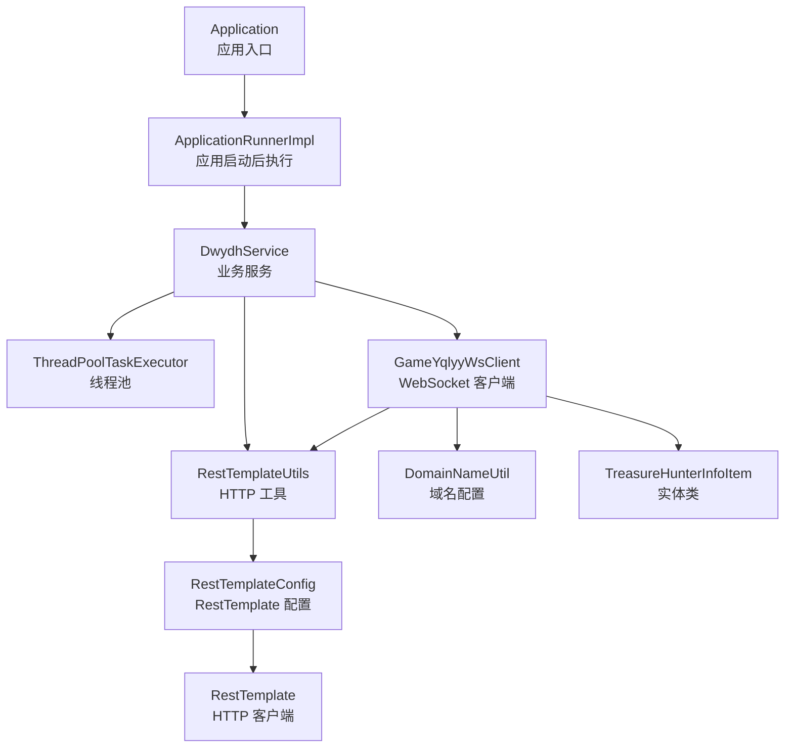
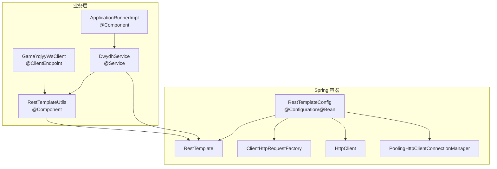
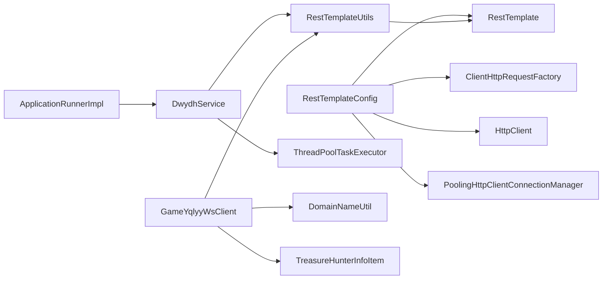
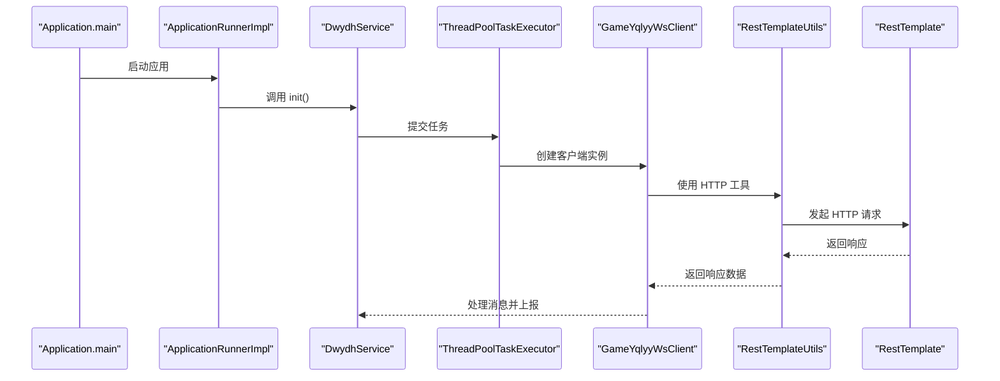

# 依赖注入机制

<cite>
**本文档引用的文件**
- [Application.java](file://src/main/java/com/Application.java)
- [RestTemplateConfig.java](file://src/main/java/com/commom/RestTemplateConfig.java)
- [RestTemplateUtils.java](file://src/main/java/com/commom/RestTemplateUtils.java)
- [DwydhService.java](file://src/main/java/com/dwydh/DwydhService.java)
- [ApplicationRunnerImpl.java](file://src/main/java/com/listener/ApplicationRunnerImpl.java)
- [GameYqlyyWsClient.java](file://src/main/java/com/yqlyy/GameYqlyyWsClient.java)
- [DomainNameUtil.java](file://src/main/java/com/utils/DomainNameUtil.java)
- [TreasureHunterInfoItem.java](file://src/main/java/com/entity/AccountedNotify/TreasureHunterInfoItem.java)
- [application.yml](file://src/main/resources/application.yml)
- [pom.xml](file://pom.xml)
</cite>

## 目录
1. [简介](#简介)
2. [项目结构](#项目结构)
3. [核心组件](#核心组件)
4. [架构总览](#架构总览)
5. [详细组件分析](#详细组件分析)
6. [依赖关系分析](#依赖关系分析)
7. [性能考量](#性能考量)
8. [故障排查指南](#故障排查指南)
9. [结论](#结论)
10. [附录](#附录)

## 简介
本文件围绕依赖注入（DI）与自动配置展开，结合仓库中的实际代码，系统解析以下主题：
- Spring Boot 自动配置如何简化依赖注入配置
- 组件注解（@Component、@Service、@Configuration、@Bean）在组件注册中的作用
- 构造函数注入、Setter 注入、字段注入的使用场景与最佳实践
- 循环依赖的识别与解决策略
- 条件注解在配置管理中的应用
- 依赖注入的调试技巧与故障排查
- 自定义 Bean 注册与配置类的编写指南
- 测试环境下的依赖注入模拟与替换

## 项目结构
该项目为基于 Spring Boot 的 Web 应用，采用标准的 Maven 工程结构，核心入口类位于 com 包下，业务组件分布在不同子包中，配置集中在 com.commom 包内，资源文件位于 resources 目录。

图表来源
- [Application.java](file://src/main/java/com/Application.java#L1-L14)
- [ApplicationRunnerImpl.java](file://src/main/java/com/listener/ApplicationRunnerImpl.java#L1-L33)
- [DwydhService.java](file://src/main/java/com/dwydh/DwydhService.java#L1-L39)
- [RestTemplateConfig.java](file://src/main/java/com/commom/RestTemplateConfig.java#L1-L131)
- [RestTemplateUtils.java](file://src/main/java/com/commom/RestTemplateUtils.java#L1-L31)
- [GameYqlyyWsClient.java](file://src/main/java/com/yqlyy/GameYqlyyWsClient.java#L1-L328)
- [DomainNameUtil.java](file://src/main/java/com/utils/DomainNameUtil.java#L1-L16)
- [TreasureHunterInfoItem.java](file://src/main/java/com/entity/AccountedNotify/TreasureHunterInfoItem.java#L1-L124)

章节来源
- [Application.java](file://src/main/java/com/Application.java#L1-L14)
- [pom.xml](file://pom.xml#L1-L160)

## 核心组件
- 应用入口与自动配置
  - 应用入口类通过 @SpringBootApplication 启用自动配置与组件扫描，简化了大量 XML 或 Java 配置的工作量。
- 配置类与 Bean 注册
  - RestTemplateConfig 通过 @Configuration 和 @Bean 注解声明多个 Bean，包括 RestTemplate、ClientHttpRequestFactory、HttpClient、连接池管理器等，集中管理 HTTP 客户端配置。
- 业务组件与注入
  - DwydhService 作为 @Service 组件，使用 @Resource 注入 ThreadPoolTaskExecutor 与 RestTemplateUtils；RestTemplateUtils 作为 @Component，注入 RestTemplate。
  - ApplicationRunnerImpl 实现 ApplicationRunner 接口并通过 @Component 注册为组件，在应用启动后调用 DwydhService.init()。
  - GameYqlyyWsClient 作为 WebSocket 客户端，通过构造函数注入 RestTemplateUtils，并在运行时处理 WebSocket 消息与 HTTP 请求。

章节来源
- [Application.java](file://src/main/java/com/Application.java#L1-L14)
- [RestTemplateConfig.java](file://src/main/java/com/commom/RestTemplateConfig.java#L1-L131)
- [RestTemplateUtils.java](file://src/main/java/com/commom/RestTemplateUtils.java#L1-L31)
- [DwydhService.java](file://src/main/java/com/dwydh/DwydhService.java#L1-L39)
- [ApplicationRunnerImpl.java](file://src/main/java/com/listener/ApplicationRunnerImpl.java#L1-L33)
- [GameYqlyyWsClient.java](file://src/main/java/com/yqlyy/GameYqlyyWsClient.java#L1-L328)

## 架构总览
该应用以 Spring 容器为核心，通过自动配置与组件扫描发现 Bean，再由容器负责依赖注入。配置类集中管理外部组件（如 HTTP 客户端），业务组件通过构造函数注入或 @Resource 注入所需依赖，形成清晰的分层结构。

图表来源
- [RestTemplateConfig.java](file://src/main/java/com/commom/RestTemplateConfig.java#L1-L131)
- [RestTemplateUtils.java](file://src/main/java/com/commom/RestTemplateUtils.java#L1-L31)
- [DwydhService.java](file://src/main/java/com/dwydh/DwydhService.java#L1-L39)
- [ApplicationRunnerImpl.java](file://src/main/java/com/listener/ApplicationRunnerImpl.java#L1-L33)
- [GameYqlyyWsClient.java](file://src/main/java/com/yqlyy/GameYqlyyWsClient.java#L1-L328)

## 详细组件分析

### 组件注册与自动配置
- @SpringBootApplication
  - 在应用入口类上使用，组合启用自动配置、组件扫描与 Web 支持，极大简化了配置工作。
- @Configuration 与 @Bean
  - RestTemplateConfig 通过 @Configuration 标识为配置类，内部使用 @Bean 方法注册多个 Bean，包括 RestTemplate、ClientHttpRequestFactory、HttpClient、连接池管理器等，统一管理 HTTP 客户端生命周期与参数。
- @Component 与 @Service
  - RestTemplateUtils 与 DwydhService 分别通过 @Component 与 @Service 注册为组件，便于容器自动发现与依赖注入。
- @Resource
  - 多处使用 @Resource 进行字段注入，用于注入容器中的其他 Bean，如 ThreadPoolTaskExecutor、RestTemplate、RestTemplateUtils 等。

章节来源
- [Application.java](file://src/main/java/com/Application.java#L1-L14)
- [RestTemplateConfig.java](file://src/main/java/com/commom/RestTemplateConfig.java#L1-L131)
- [RestTemplateUtils.java](file://src/main/java/com/commom/RestTemplateUtils.java#L1-L31)
- [DwydhService.java](file://src/main/java/com/dwydh/DwydhService.java#L1-L39)

### 依赖注入方式与最佳实践
- 构造函数注入
  - GameYqlyyWsClient 通过构造函数注入 RestTemplateUtils，确保对象创建时即具备必需依赖，有利于不可变性与测试隔离。
- Setter 注入
  - DwydhService 中对 ThreadPoolTaskExecutor 的注入采用 @Resource 字段注入，属于 Setter 注入的一种形式，适用于可选依赖或运行时可替换的场景。
- 字段注入
  - RestTemplateUtils 对 RestTemplate 的注入使用 @Resource 字段注入，简洁直观，适合无复杂初始化逻辑的简单依赖。

最佳实践建议
- 优先使用构造函数注入，保证对象不可变与依赖明确
- 对可选依赖或运行时可替换的组件，可考虑 Setter 注入
- 避免过度使用字段注入，降低对容器的耦合度

章节来源
- [GameYqlyyWsClient.java](file://src/main/java/com/yqlyy/GameYqlyyWsClient.java#L1-L328)
- [DwydhService.java](file://src/main/java/com/dwydh/DwydhService.java#L1-L39)
- [RestTemplateUtils.java](file://src/main/java/com/commom/RestTemplateUtils.java#L1-L31)

### 循环依赖识别与解决
- 识别
  - 当两个或多个 Bean 相互持有对方的引用且通过构造函数注入时，Spring 容器会在启动阶段检测到循环依赖并抛出异常。
- 解决策略
  - 将部分依赖改为 @Lazy 注入，延迟加载
  - 重构设计，拆分职责，避免强耦合
  - 使用 @PostConstruct 或 @EventListener 替代构造函数中的复杂依赖初始化

注意
- 本仓库未出现显式循环依赖示例，但上述策略可用于预防与解决潜在问题。

### 条件注解与配置管理
- 条件注解
  - 本仓库未直接使用 @ConditionalOnProperty 等条件注解，但在配置文件 application.yml 中通过 profiles.active 控制环境配置，体现了条件化配置的思想。
- 配置管理
  - application.yml 中集中管理服务器端口、应用名与 HTTP 客户端参数，RestTemplateConfig 通过 @Value 注解读取这些属性，实现配置驱动的 Bean 初始化。

章节来源
- [application.yml](file://src/main/resources/application.yml#L1-L31)
- [RestTemplateConfig.java](file://src/main/java/com/commom/RestTemplateConfig.java#L1-L131)

### 自定义 Bean 注册与配置类编写
- 关键步骤
  - 使用 @Configuration 标识配置类
  - 使用 @Bean 方法注册 Bean，并在方法中装配依赖
  - 使用 @Value 读取配置文件属性，实现配置驱动
  - 通过 @Primary 或限定符（@Qualifier）处理同类型多实现的冲突
- 示例参考
  - RestTemplateConfig 展示了完整的 Bean 注册流程：RestTemplate -> ClientHttpRequestFactory -> HttpClient -> 连接池管理器

章节来源
- [RestTemplateConfig.java](file://src/main/java/com/commom/RestTemplateConfig.java#L1-L131)

### 测试环境下的依赖注入模拟与替换
- 模拟与替换
  - 使用 @MockBean 或 @SpyBean 替换容器中的真实 Bean，便于单元测试隔离外部依赖
  - 通过 @TestConfiguration 定义测试专用配置类，覆盖生产配置
  - 使用 @ActiveProfiles 指定测试环境配置文件，实现条件化配置
- 适用范围
  - 适用于 RestTemplateUtils、DwydhService 等组件的测试场景

注意
- 本仓库未包含测试代码，以上为通用实践指导。

## 依赖关系分析
组件之间的依赖关系如下图所示，展示了从配置类到业务组件再到 WebSocket 客户端的完整链路。

图表来源
- [RestTemplateConfig.java](file://src/main/java/com/commom/RestTemplateConfig.java#L1-L131)
- [RestTemplateUtils.java](file://src/main/java/com/commom/RestTemplateUtils.java#L1-L31)
- [DwydhService.java](file://src/main/java/com/dwydh/DwydhService.java#L1-L39)
- [ApplicationRunnerImpl.java](file://src/main/java/com/listener/ApplicationRunnerImpl.java#L1-L33)
- [GameYqlyyWsClient.java](file://src/main/java/com/yqlyy/GameYqlyyWsClient.java#L1-L328)
- [DomainNameUtil.java](file://src/main/java/com/utils/DomainNameUtil.java#L1-L16)
- [TreasureHunterInfoItem.java](file://src/main/java/com/entity/AccountedNotify/TreasureHunterInfoItem.java#L1-L124)

## 性能考量
- 连接池与超时配置
  - RestTemplateConfig 中对 HTTP 客户端的连接池大小、并发限制、超时参数进行了集中配置，有助于提升网络请求的吞吐与稳定性。
- 线程池与异步任务
  - DwydhService 使用 ThreadPoolTaskExecutor 执行异步任务，避免阻塞主线程，提高响应能力。
- WebSocket 连接管理
  - GameYqlyyWsClient 内置连接状态检查与重连逻辑，减少异常断开带来的影响。

章节来源
- [RestTemplateConfig.java](file://src/main/java/com/commom/RestTemplateConfig.java#L1-L131)
- [DwydhService.java](file://src/main/java/com/dwydh/DwydhService.java#L1-L39)
- [GameYqlyyWsClient.java](file://src/main/java/com/yqlyy/GameYqlyyWsClient.java#L1-L328)

## 故障排查指南
- 启动失败与 Bean 未找到
  - 检查 @SpringBootApplication 是否位于正确的位置，确认组件扫描路径覆盖到目标类
  - 确认 @Component、@Service、@Configuration、@Bean 注解是否正确使用
- 注入失败
  - 检查 @Resource、@Autowired 的字段或构造函数是否匹配 Bean 名称或类型
  - 对于多实现场景，使用 @Qualifier 指定具体 Bean
- 循环依赖
  - 若出现循环依赖异常，优先考虑重构设计或使用 @Lazy 延迟注入
- 配置不生效
  - 检查 application.yml 中的属性名与 @Value 注解是否一致，确认 profiles.active 是否正确
- 日志与监控
  - 利用日志输出定位问题，结合异常堆栈信息快速定位注入点与调用链

章节来源
- [Application.java](file://src/main/java/com/Application.java#L1-L14)
- [RestTemplateConfig.java](file://src/main/java/com/commom/RestTemplateConfig.java#L1-L131)
- [RestTemplateUtils.java](file://src/main/java/com/commom/RestTemplateUtils.java#L1-L31)
- [DwydhService.java](file://src/main/java/com/dwydh/DwydhService.java#L1-L39)
- [ApplicationRunnerImpl.java](file://src/main/java/com/listener/ApplicationRunnerImpl.java#L1-L33)
- [GameYqlyyWsClient.java](file://src/main/java/com/yqlyy/GameYqlyyWsClient.java#L1-L328)
- [application.yml](file://src/main/resources/application.yml#L1-L31)

## 结论
本项目通过 Spring Boot 的自动配置与组件扫描，结合 @Configuration 与 @Bean 的集中配置，实现了 HTTP 客户端与业务组件的清晰分离。在依赖注入方面，优先采用构造函数注入，辅以 @Resource 字段注入，既保证了对象的不可变性，也兼顾了开发效率。同时，通过连接池、线程池与 WebSocket 连接管理等手段提升了整体性能与稳定性。对于条件注解与测试模拟，建议在后续迭代中引入，以进一步增强配置灵活性与测试覆盖率。

## 附录
- 关键流程时序图：应用启动与 WebSocket 数据上报

图表来源
- [Application.java](file://src/main/java/com/Application.java#L1-L14)
- [ApplicationRunnerImpl.java](file://src/main/java/com/listener/ApplicationRunnerImpl.java#L1-L33)
- [DwydhService.java](file://src/main/java/com/dwydh/DwydhService.java#L1-L39)
- [GameYqlyyWsClient.java](file://src/main/java/com/yqlyy/GameYqlyyWsClient.java#L1-L328)
- [RestTemplateUtils.java](file://src/main/java/com/commom/RestTemplateUtils.java#L1-L31)
- [RestTemplateConfig.java](file://src/main/java/com/commom/RestTemplateConfig.java#L1-L131)