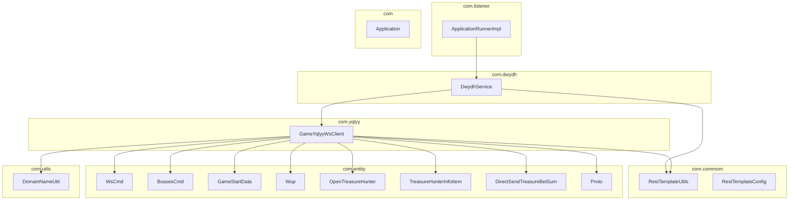
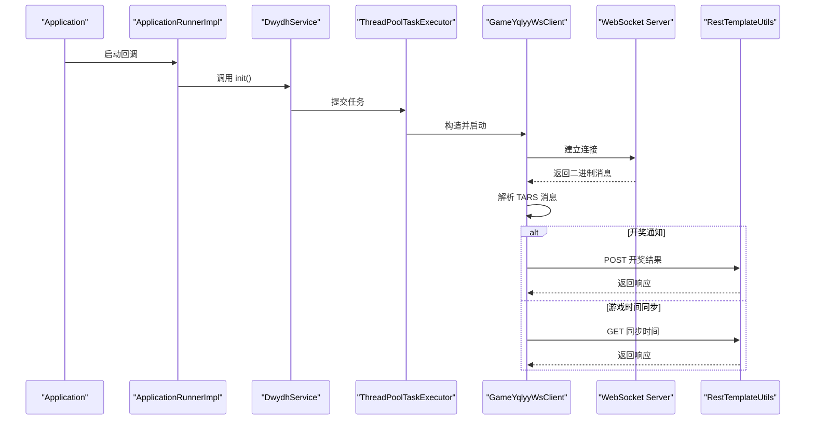
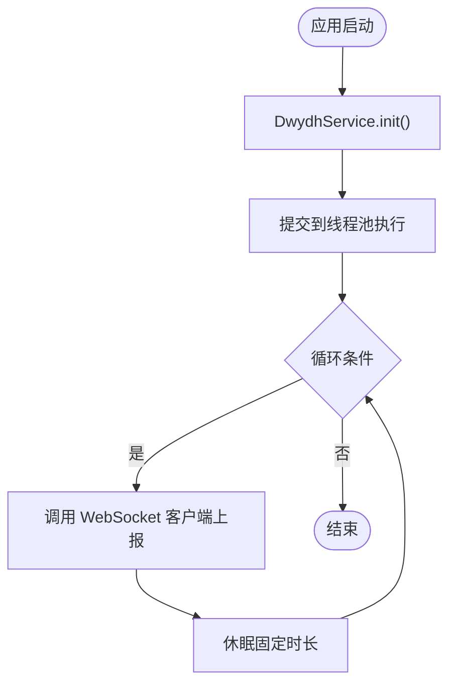
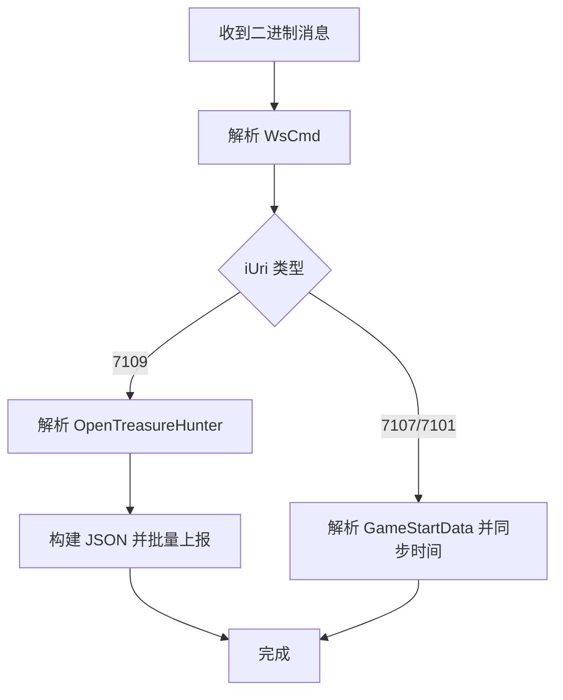
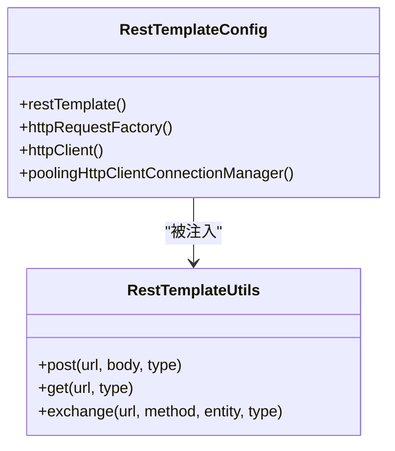
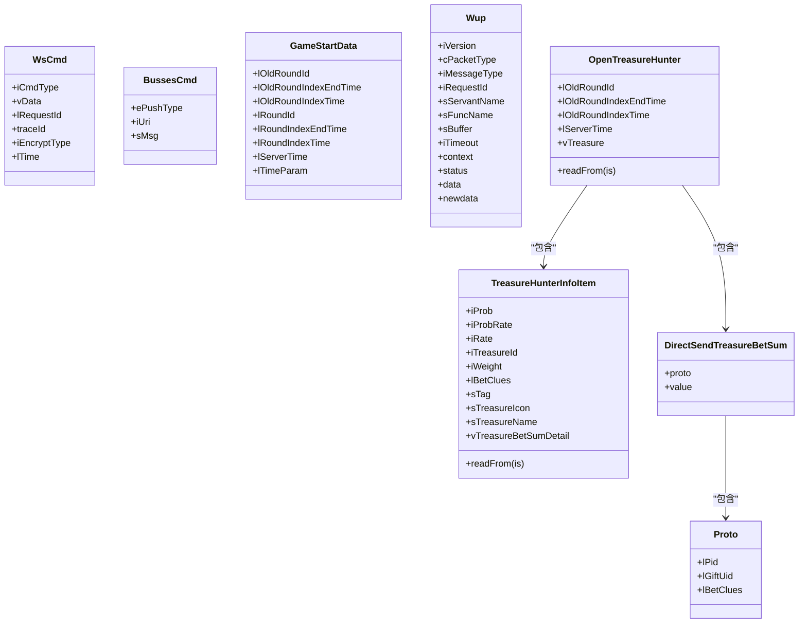
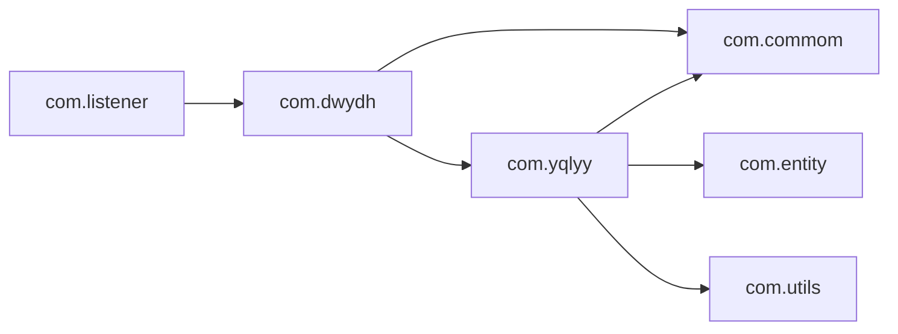

# 包结构设计

<cite>
**本文档引用的文件**
- [DwydhService.java](file://src/main/java/com/dwydh/DwydhService.java)
- [GameYqlyyWsClient.java](file://src/main/java/com/yqlyy/GameYqlyyWsClient.java)
- [RestTemplateConfig.java](file://src/main/java/com/commom/RestTemplateConfig.java)
- [RestTemplateUtils.java](file://src/main/java/com/commom/RestTemplateUtils.java)
- [OpenTreasureHunter.java](file://src/main/java/com/entity/AccountedNotify/OpenTreasureHunter.java)
- [TreasureHunterInfoItem.java](file://src/main/java/com/entity/AccountedNotify/TreasureHunterInfoItem.java)
- [DirectSendTreasureBetSum.java](file://src/main/java/com/entity/AccountedNotify/DirectSendTreasureBetSum.java)
- [Proto.java](file://src/main/java/com/entity/AccountedNotify/Proto.java)
- [BussesCmd.java](file://src/main/java/com/entity/BussesCmd.java)
- [GameStartData.java](file://src/main/java/com/entity/GameStartData.java)
- [WsCmd.java](file://src/main/java/com/entity/WsCmd.java)
- [Wup.java](file://src/main/java/com/entity/Wup.java)
- [DomainNameUtil.java](file://src/main/java/com/utils/DomainNameUtil.java)
- [ApplicationRunnerImpl.java](file://src/main/java/com/listener/ApplicationRunnerImpl.java)
- [Application.java](file://src/main/java/com/Application.java)
</cite>

## 目录
1. [引言](#引言)
2. [项目结构](#项目结构)
3. [核心组件](#核心组件)
4. [架构总览](#架构总览)
5. [详细组件分析](#详细组件分析)
6. [依赖关系分析](#依赖关系分析)
7. [性能考虑](#性能考虑)
8. [故障排除指南](#故障排除指南)
9. [结论](#结论)
10. [附录](#附录)

## 引言
本指南系统性阐述该代码库的包结构设计与分层原则，覆盖服务调度、WebSocket 客户端、通用组件、数据模型与工具类等模块，并给出包间依赖关系图与模块边界定义。文档同时总结包结构演进的指导原则与最佳实践，帮助读者快速理解并扩展该系统。

## 项目结构
该项目采用基于职责的分层包结构，遵循“高内聚、低耦合”的设计原则，各包职责明确、边界清晰：

- com.dwydh：服务调度与生命周期管理，负责应用启动后的任务编排与线程调度。
- com.yqlyy：WebSocket 客户端实现，负责与远端服务建立连接、接收二进制消息并进行业务处理。
- com.commom：通用基础设施，提供 HTTP 客户端配置与封装工具，供上层模块复用。
- com.entity：数据模型与协议实体，承载业务消息结构与序列化基类。
- com.utils：通用工具类，提供域名与环境配置等辅助能力。
- com.listener：应用生命周期钩子，负责在应用启动时触发调度服务。
- com：Spring Boot 启动入口。

图表来源
- [DwydhService.java](file://src/main/java/com/dwydh/DwydhService.java#L1-L39)
- [GameYqlyyWsClient.java](file://src/main/java/com/yqlyy/GameYqlyyWsClient.java#L1-L328)
- [RestTemplateUtils.java](file://src/main/java/com/commom/RestTemplateUtils.java#L1-L31)
- [RestTemplateConfig.java](file://src/main/java/com/commom/RestTemplateConfig.java#L1-L132)
- [OpenTreasureHunter.java](file://src/main/java/com/entity/AccountedNotify/OpenTreasureHunter.java#L1-L83)
- [TreasureHunterInfoItem.java](file://src/main/java/com/entity/AccountedNotify/TreasureHunterInfoItem.java#L1-L124)
- [DirectSendTreasureBetSum.java](file://src/main/java/com/entity/AccountedNotify/DirectSendTreasureBetSum.java#L1-L9)
- [Proto.java](file://src/main/java/com/entity/AccountedNotify/Proto.java#L1-L8)
- [BussesCmd.java](file://src/main/java/com/entity/BussesCmd.java#L1-L10)
- [GameStartData.java](file://src/main/java/com/entity/GameStartData.java#L1-L79)
- [WsCmd.java](file://src/main/java/com/entity/WsCmd.java#L1-L69)
- [Wup.java](file://src/main/java/com/entity/Wup.java#L1-L29)
- [DomainNameUtil.java](file://src/main/java/com/utils/DomainNameUtil.java#L1-L16)
- [ApplicationRunnerImpl.java](file://src/main/java/com/listener/ApplicationRunnerImpl.java#L1-L34)
- [Application.java](file://src/main/java/com/Application.java#L1-L14)

章节来源
- [Application.java](file://src/main/java/com/Application.java#L1-L14)
- [ApplicationRunnerImpl.java](file://src/main/java/com/listener/ApplicationRunnerImpl.java#L1-L34)

## 核心组件
本节聚焦四大核心模块：服务调度、WebSocket 客户端、通用组件与数据模型。

- 服务调度（com.dwydh）
  - 职责：在应用启动后创建独立线程，周期性驱动 WebSocket 客户端上报状态，实现服务编排与生命周期管理。
  - 关键点：使用线程池执行器隔离调度线程；通过构造注入 RestTemplate 工具类；循环调用客户端的上报方法并设置固定间隔。
  
- WebSocket 客户端（com.yqlyy）
  - 职责：建立 WebSocket 连接、发送登录与进入游戏指令、解析二进制消息、根据消息类型分发到不同业务处理逻辑。
  - 关键点：@ClientEndpoint 注解定义生命周期回调；解析 TARS 协议消息；根据 iUri 分支处理开奖与时间同步事件；通过 RestTemplate 工具类向内部服务上报结果。
  
- 通用组件（com.commom）
  - 职责：提供 HTTP 客户端连接池配置与 RestTemplate 封装，统一网络请求行为。
  - 关键点：RestTemplateConfig 提供连接池、超时、重试等配置；RestTemplateUtils 提供简洁的 GET/POST/exchange 方法。
  
- 数据模型（com.entity）
  - 职责：定义业务消息结构，包括 WebSocket 指令、推送命令、游戏开始数据、WUP 协议以及账户通知相关的实体类。
  - 关键点：AccountedNotify 子包下的实体类基于 TARS 结构基类，支持读写方法；其他实体类提供字段与访问器。

章节来源
- [DwydhService.java](file://src/main/java/com/dwydh/DwydhService.java#L1-L39)
- [GameYqlyyWsClient.java](file://src/main/java/com/yqlyy/GameYqlyyWsClient.java#L1-L328)
- [RestTemplateConfig.java](file://src/main/java/com/commom/RestTemplateConfig.java#L1-L132)
- [RestTemplateUtils.java](file://src/main/java/com/commom/RestTemplateUtils.java#L1-L31)
- [OpenTreasureHunter.java](file://src/main/java/com/entity/AccountedNotify/OpenTreasureHunter.java#L1-L83)
- [TreasureHunterInfoItem.java](file://src/main/java/com/entity/AccountedNotify/TreasureHunterInfoItem.java#L1-L124)
- [BussesCmd.java](file://src/main/java/com/entity/BussesCmd.java#L1-L10)
- [GameStartData.java](file://src/main/java/com/entity/GameStartData.java#L1-L79)
- [WsCmd.java](file://src/main/java/com/entity/WsCmd.java#L1-L69)
- [Wup.java](file://src/main/java/com/entity/Wup.java#L1-L29)

## 架构总览
下图展示从应用启动到 WebSocket 业务处理的完整流程，体现各包之间的交互关系与控制流。

图表来源
- [Application.java](file://src/main/java/com/Application.java#L1-L14)
- [ApplicationRunnerImpl.java](file://src/main/java/com/listener/ApplicationRunnerImpl.java#L1-L34)
- [DwydhService.java](file://src/main/java/com/dwydh/DwydhService.java#L1-L39)
- [GameYqlyyWsClient.java](file://src/main/java/com/yqlyy/GameYqlyyWsClient.java#L1-L328)
- [RestTemplateUtils.java](file://src/main/java/com/commom/RestTemplateUtils.java#L1-L31)

## 详细组件分析

### 服务调度模块（com.dwydh）
- 设计要点
  - 使用线程池隔离调度任务，避免阻塞主线程。
  - 在 init() 中创建 WebSocket 客户端实例并循环调用其上报方法，实现持续运行。
  - 通过资源注入 RestTemplate 工具类，为后续网络请求做准备。
- 生命周期管理
  - 由 ApplicationRunnerImpl 在应用启动后触发 init()，随后长期运行。
  - 客户端内部维护连接状态，若会话关闭则自动重连。
- 复杂度与性能
  - 循环调用与固定休眠构成 O(n) 的周期性任务，注意线程池容量与休眠时间的平衡。

图表来源
- [DwydhService.java](file://src/main/java/com/dwydh/DwydhService.java#L21-L36)
- [ApplicationRunnerImpl.java](file://src/main/java/com/listener/ApplicationRunnerImpl.java#L25-L31)

章节来源
- [DwydhService.java](file://src/main/java/com/dwydh/DwydhService.java#L1-L39)
- [ApplicationRunnerImpl.java](file://src/main/java/com/listener/ApplicationRunnerImpl.java#L1-L34)

### WebSocket 客户端（com.yqlyy）
- 网络通信
  - 使用 Java WebSocket API 建立连接，默认二进制缓冲区大小与超时参数在连接前配置。
  - 支持发送登录与进入游戏的二进制帧，用于握手与认证。
- 消息处理
  - @OnMessage 接收二进制消息，解析 TARS 协议的 WsCmd 与 BussesCmd。
  - 根据 iUri 分支处理不同业务：
    - 7109：开奖通知，提取 TreasureHunterInfoItem 列表并转换为 JSON，向内部服务批量上报。
    - 7107：游戏时间同步，向中转服务发送 GET 请求更新时间。
    - 7103/7101：类似逻辑，分别对应不同游戏场景的时间同步。
- 错误处理
  - @OnClose 与 @OnError 记录日志，便于问题定位。
  - 发送异常时尝试重连，提升鲁棒性。

图表来源
- [GameYqlyyWsClient.java](file://src/main/java/com/yqlyy/GameYqlyyWsClient.java#L46-L219)
- [WsCmd.java](file://src/main/java/com/entity/WsCmd.java#L1-L69)
- [BussesCmd.java](file://src/main/java/com/entity/BussesCmd.java#L1-L10)
- [GameStartData.java](file://src/main/java/com/entity/GameStartData.java#L1-L79)
- [OpenTreasureHunter.java](file://src/main/java/com/entity/AccountedNotify/OpenTreasureHunter.java#L1-L83)
- [TreasureHunterInfoItem.java](file://src/main/java/com/entity/AccountedNotify/TreasureHunterInfoItem.java#L1-L124)

章节来源
- [GameYqlyyWsClient.java](file://src/main/java/com/yqlyy/GameYqlyyWsClient.java#L1-L328)

### 通用组件（com.commom）
- RestTemplateConfig
  - 提供连接池、超时、重试与默认请求头配置，确保网络请求稳定与高效。
  - 关键配置项：最大连接数、每路由最大连接数、连接超时、套接字超时、空闲校验等。
- RestTemplateUtils
  - 对 RestTemplate 的轻量封装，提供 GET/POST/exchange 方法，简化上层调用。

图表来源
- [RestTemplateConfig.java](file://src/main/java/com/commom/RestTemplateConfig.java#L62-L129)
- [RestTemplateUtils.java](file://src/main/java/com/commom/RestTemplateUtils.java#L14-L30)

章节来源
- [RestTemplateConfig.java](file://src/main/java/com/commom/RestTemplateConfig.java#L1-L132)
- [RestTemplateUtils.java](file://src/main/java/com/commom/RestTemplateUtils.java#L1-L31)

### 数据模型（com.entity）
- 实体类设计模式
  - AccountedNotify 子包中的类基于 TARS 结构基类，提供 readFrom/writeTo 方法，便于二进制协议解析与生成。
  - 其他实体类以 POJO 形式提供字段与访问器，配合 JSON 序列化/反序列化使用。
- 关键实体
  - WsCmd：WebSocket 指令头，包含命令类型、数据体、时间戳等。
  - BussesCmd：推送命令，包含推送类型、URI 与消息体。
  - GameStartData：游戏开始相关的时间戳与轮次信息。
  - Wup：WUP 协议载体，包含版本、包类型、函数名、上下文与数据。
  - OpenTreasureHunter/TreasureHunterInfoItem/DirectSendTreasureBetSum/Proto：账户通知相关实体，承载开奖与投注明细。

图表来源
- [WsCmd.java](file://src/main/java/com/entity/WsCmd.java#L1-L69)
- [BussesCmd.java](file://src/main/java/com/entity/BussesCmd.java#L1-L10)
- [GameStartData.java](file://src/main/java/com/entity/GameStartData.java#L1-L79)
- [Wup.java](file://src/main/java/com/entity/Wup.java#L1-L29)
- [OpenTreasureHunter.java](file://src/main/java/com/entity/AccountedNotify/OpenTreasureHunter.java#L1-L83)
- [TreasureHunterInfoItem.java](file://src/main/java/com/entity/AccountedNotify/TreasureHunterInfoItem.java#L1-L124)
- [DirectSendTreasureBetSum.java](file://src/main/java/com/entity/AccountedNotify/DirectSendTreasureBetSum.java#L1-L9)
- [Proto.java](file://src/main/java/com/entity/AccountedNotify/Proto.java#L1-L8)

章节来源
- [OpenTreasureHunter.java](file://src/main/java/com/entity/AccountedNotify/OpenTreasureHunter.java#L1-L83)
- [TreasureHunterInfoItem.java](file://src/main/java/com/entity/AccountedNotify/TreasureHunterInfoItem.java#L1-L124)
- [DirectSendTreasureBetSum.java](file://src/main/java/com/entity/AccountedNotify/DirectSendTreasureBetSum.java#L1-L9)
- [Proto.java](file://src/main/java/com/entity/AccountedNotify/Proto.java#L1-L8)
- [BussesCmd.java](file://src/main/java/com/entity/BussesCmd.java#L1-L10)
- [GameStartData.java](file://src/main/java/com/entity/GameStartData.java#L1-L79)
- [WsCmd.java](file://src/main/java/com/entity/WsCmd.java#L1-L69)
- [Wup.java](file://src/main/java/com/entity/Wup.java#L1-L29)

### 工具类（com.utils）
- DomainNameUtil
  - 提供内部服务地址数组与中转服务地址数组，便于客户端批量上报或同步时间。
  - 当前示例中 urls 为空，transitUrls 指向本地中转服务。

章节来源
- [DomainNameUtil.java](file://src/main/java/com/utils/DomainNameUtil.java#L1-L16)

## 依赖关系分析
- 包间依赖
  - com.listener 依赖 com.dwydh，启动时触发调度。
  - com.dwydh 依赖 com.yqlyy 与 com.commom，负责任务编排与网络工具。
  - com.yqlyy 依赖 com.commom、com.entity、com.utils，承担网络通信与业务解析。
  - com.entity 为纯数据模型，不依赖其他业务包。
  - com.utils 为纯工具包，不依赖业务包。
- 模块边界
  - 业务边界：WebSocket 客户端与数据模型解耦，通过实体类传递数据。
  - 基础设施边界：通用组件对业务透明，仅暴露配置与工具方法。
  - 生命周期边界：监听器只负责启动阶段的初始化，不参与运行期业务。

图表来源
- [ApplicationRunnerImpl.java](file://src/main/java/com/listener/ApplicationRunnerImpl.java#L1-L34)
- [DwydhService.java](file://src/main/java/com/dwydh/DwydhService.java#L1-L39)
- [GameYqlyyWsClient.java](file://src/main/java/com/yqlyy/GameYqlyyWsClient.java#L1-L328)
- [RestTemplateUtils.java](file://src/main/java/com/commom/RestTemplateUtils.java#L1-L31)

章节来源
- [ApplicationRunnerImpl.java](file://src/main/java/com/listener/ApplicationRunnerImpl.java#L1-L34)
- [DwydhService.java](file://src/main/java/com/dwydh/DwydhService.java#L1-L39)
- [GameYqlyyWsClient.java](file://src/main/java/com/yqlyy/GameYqlyyWsClient.java#L1-L328)
- [RestTemplateUtils.java](file://src/main/java/com/commom/RestTemplateUtils.java#L1-L31)

## 性能考虑
- 线程与并发
  - 使用线程池执行调度任务，避免阻塞 Spring 默认线程。
  - WebSocket 客户端内部连接与消息处理建议限制并发，防止资源争用。
- 网络与缓存
  - 合理配置连接池大小与超时参数，减少连接抖动。
  - 对于重复的上报操作，可在客户端层引入去重与批量合并策略。
- 序列化与解析
  - TARS 协议解析应尽量减少对象创建次数，必要时复用输入流。
- 日志与监控
  - 在关键路径添加埋点与指标采集，便于性能分析与问题定位。

## 故障排除指南
- WebSocket 连接失败
  - 检查 wsUrl 配置与网络可达性；查看 @OnError 日志输出。
  - 若连接断开，确认客户端的重连逻辑是否正常执行。
- 消息解析异常
  - 核对 iUri 分支与字段索引是否匹配协议版本；检查 TARS 输入流位置。
- 上报失败
  - 查看 RestTemplate 工具类返回的异常信息；确认目标服务地址与权限。
- 启动未生效
  - 确认 ApplicationRunnerImpl 是否成功注入并执行 init()。

章节来源
- [GameYqlyyWsClient.java](file://src/main/java/com/yqlyy/GameYqlyyWsClient.java#L240-L248)
- [RestTemplateUtils.java](file://src/main/java/com/commom/RestTemplateUtils.java#L14-L30)
- [ApplicationRunnerImpl.java](file://src/main/java/com/listener/ApplicationRunnerImpl.java#L25-L31)

## 结论
该代码库采用清晰的分层包结构：调度层（com.dwydh）、通信层（com.yqlyy）、基础设施层（com.commom）、数据层（com.entity）与工具层（com.utils）。通过明确的模块边界与依赖方向，系统实现了服务编排、WebSocket 通信与通用网络能力的解耦。建议在后续演进中进一步完善配置中心、监控告警与测试体系，以提升系统的可观测性与可维护性。

## 附录
- 包结构演进指导原则
  - 单一职责：每个包只负责一类能力（调度、通信、配置、模型、工具）。
  - 明确边界：跨包调用通过接口或实体类传递，避免直接依赖实现。
  - 可替换性：基础设施（如 HTTP 客户端）应可替换，不影响业务逻辑。
  - 可观测性：在关键节点添加日志与指标，便于问题定位与性能优化。
- 最佳实践
  - 使用线程池隔离后台任务，避免影响主线程。
  - 对外网络请求统一通过工具类封装，集中处理异常与重试。
  - 协议解析与业务处理分离，保持实体类的纯净与可测试性。
  - 在启动阶段只做必要的初始化，复杂逻辑延迟到运行期按需加载。