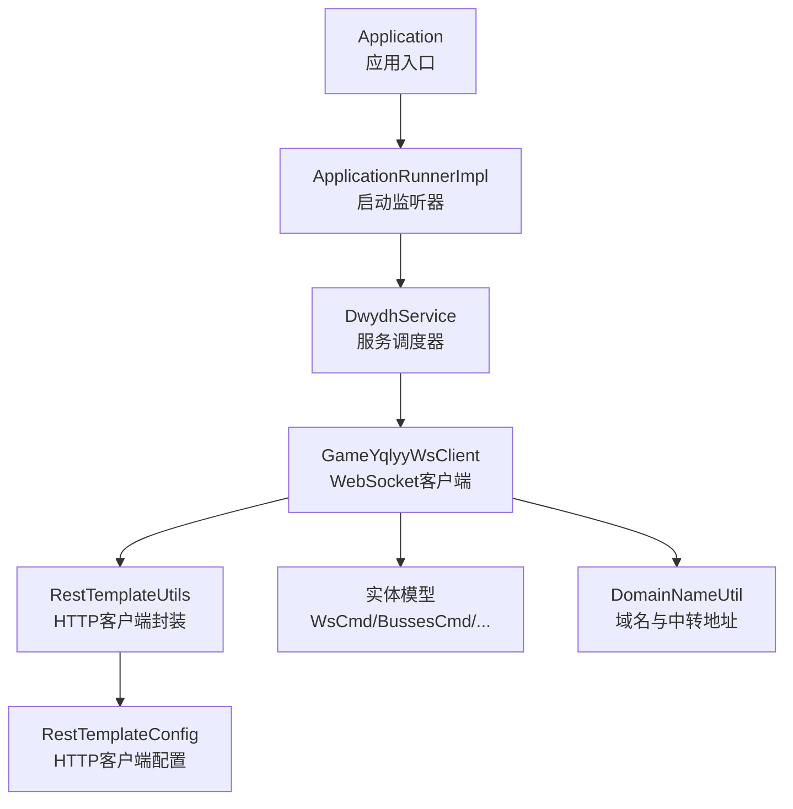
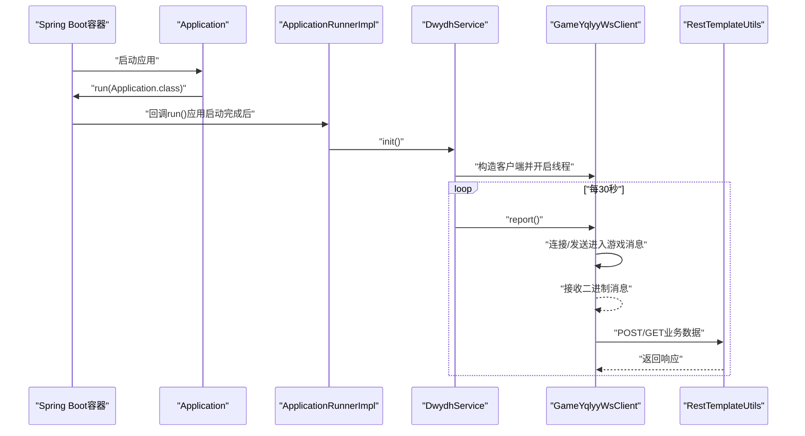
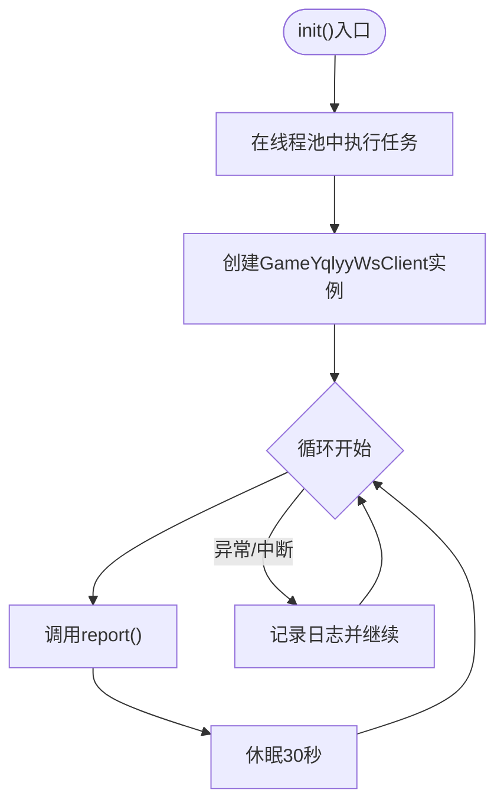
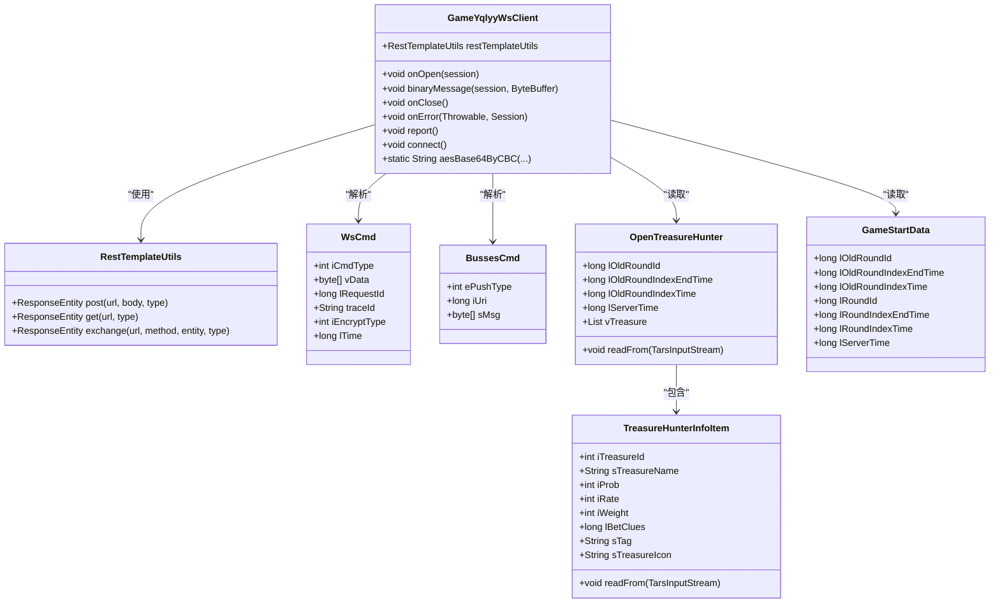
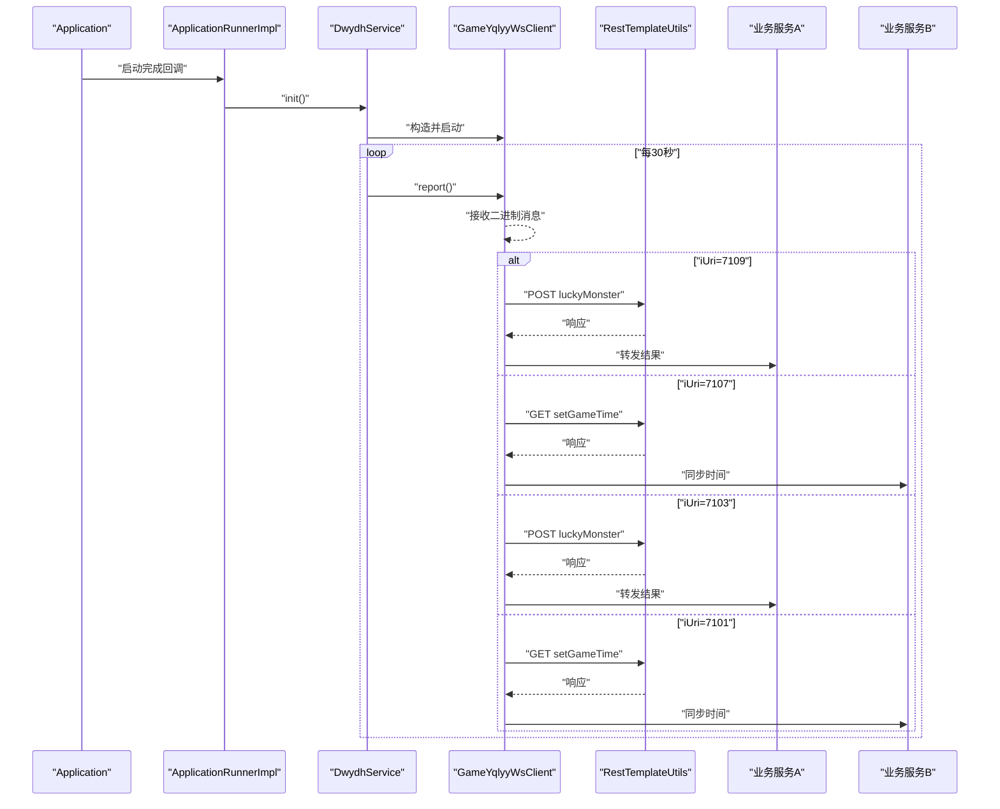
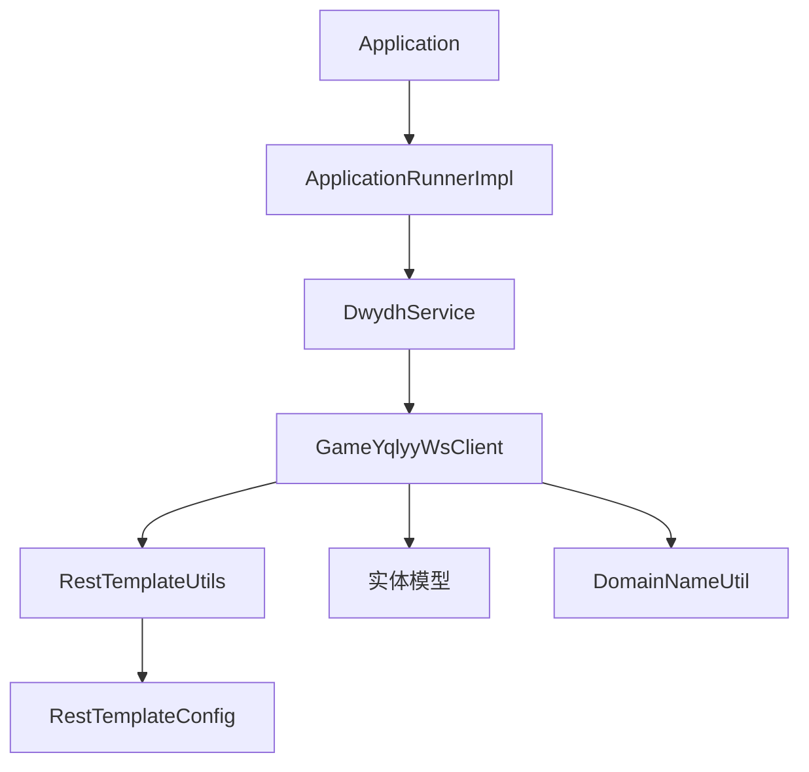

# 核心模块分析

<cite>
**本文引用的文件**
- [Application.java](file://src/main/java/com/Application.java)
- [DwydhService.java](file://src/main/java/com/dwydh/DwydhService.java)
- [GameYqlyyWsClient.java](file://src/main/java/com/yqlyy/GameYqlyyWsClient.java)
- [ApplicationRunnerImpl.java](file://src/main/java/com/listener/ApplicationRunnerImpl.java)
- [RestTemplateUtils.java](file://src/main/java/com/commom/RestTemplateUtils.java)
- [RestTemplateConfig.java](file://src/main/java/com/commom/RestTemplateConfig.java)
- [DomainNameUtil.java](file://src/main/java/com/utils/DomainNameUtil.java)
- [WsCmd.java](file://src/main/java/com/entity/WsCmd.java)
- [BussesCmd.java](file://src/main/java/com/entity/BussesCmd.java)
- [OpenTreasureHunter.java](file://src/main/java/com/entity/AccountedNotify/OpenTreasureHunter.java)
- [TreasureHunterInfoItem.java](file://src/main/java/com/entity/AccountedNotify/TreasureHunterInfoItem.java)
- [Proto.java](file://src/main/java/com/entity/AccountedNotify/Proto.java)
- [GameStartData.java](file://src/main/java/com/entity/GameStartData.java)
- [application.yml](file://src/main/resources/application.yml)
- [pom.xml](file://pom.xml)
</cite>

## 目录
1. [引言](#引言)
2. [项目结构](#项目结构)
3. [核心组件](#核心组件)
4. [架构总览](#架构总览)
5. [详细组件分析](#详细组件分析)
6. [依赖关系分析](#依赖关系分析)
7. [性能考量](#性能考量)
8. [故障排查指南](#故障排查指南)
9. [结论](#结论)
10. [附录](#附录)

## 引言
本文件聚焦于核心模块的系统化分析，围绕以下目标展开：
- 深入解释Application主入口类的设计与Spring Boot启动流程（含自动配置机制）
- 详述DwydhService服务调度器的职责、生命周期与线程模型
- 解析GameYqlyyWsClient WebSocket客户端的架构设计与消息处理机制
- 阐明ApplicationRunnerImpl启动监听器的作用与执行时机
- 绘制模块间接口调用的时序图与交互流程
- 总结模块扩展的最佳实践与注意事项

## 项目结构
该项目采用基于包的分层组织方式，核心模块分布如下：
- 应用入口与自动配置：com.Application（Spring Boot启动入口）
- 启动监听与调度：com.listener.ApplicationRunnerImpl（实现ApplicationRunner）
- 业务调度与线程池：com.dwydh.DwydhService（调度WebSocket客户端）
- WebSocket客户端：com.yqlyy.GameYqlyyWsClient（WebSocket消息收发与解析）
- HTTP客户端封装：com.commom.RestTemplateUtils（对RestTemplate的薄封装）
- 实体与协议：com.entity.*（包含WebSocket命令、推送数据等）
- 工具类：com.utils.DomainNameUtil（域名与中转地址配置）
- 配置：application.yml（HTTP连接池与应用基础配置）

图表来源
- [Application.java](file://src/main/java/com/Application.java#L1-L14)
- [ApplicationRunnerImpl.java](file://src/main/java/com/listener/ApplicationRunnerImpl.java#L1-L34)
- [DwydhService.java](file://src/main/java/com/dwydh/DwydhService.java#L1-L39)
- [GameYqlyyWsClient.java](file://src/main/java/com/yqlyy/GameYqlyyWsClient.java#L1-L328)
- [RestTemplateUtils.java](file://src/main/java/com/commom/RestTemplateUtils.java#L1-L31)
- [RestTemplateConfig.java](file://src/main/java/com/commom/RestTemplateConfig.java#L1-L132)
- [WsCmd.java](file://src/main/java/com/entity/WsCmd.java#L1-L69)
- [BussesCmd.java](file://src/main/java/com/entity/BussesCmd.java#L1-L10)
- [DomainNameUtil.java](file://src/main/java/com/utils/DomainNameUtil.java#L1-L16)

章节来源
- [Application.java](file://src/main/java/com/Application.java#L1-L14)
- [application.yml](file://src/main/resources/application.yml#L1-L31)
- [pom.xml](file://pom.xml#L1-L160)

## 核心组件
本节概述四大核心组件的职责与交互要点：
- Application：Spring Boot应用入口，负责启动容器与加载自动配置
- ApplicationRunnerImpl：应用启动后回调，触发业务初始化
- DwydhService：使用线程池异步调度WebSocket客户端，周期性上报
- GameYqlyyWsClient：WebSocket客户端，负责握手、心跳、二进制消息解析与业务推送

章节来源
- [Application.java](file://src/main/java/com/Application.java#L1-L14)
- [ApplicationRunnerImpl.java](file://src/main/java/com/listener/ApplicationRunnerImpl.java#L1-L34)
- [DwydhService.java](file://src/main/java/com/dwydh/DwydhService.java#L1-L39)
- [GameYqlyyWsClient.java](file://src/main/java/com/yqlyy/GameYqlyyWsClient.java#L1-L328)

## 架构总览
下图展示从应用启动到WebSocket业务处理的总体流程：

图表来源
- [Application.java](file://src/main/java/com/Application.java#L1-L14)
- [ApplicationRunnerImpl.java](file://src/main/java/com/listener/ApplicationRunnerImpl.java#L1-L34)
- [DwydhService.java](file://src/main/java/com/dwydh/DwydhService.java#L1-L39)
- [GameYqlyyWsClient.java](file://src/main/java/com/yqlyy/GameYqlyyWsClient.java#L1-L328)
- [RestTemplateUtils.java](file://src/main/java/com/commom/RestTemplateUtils.java#L1-L31)

## 详细组件分析

### Application主入口与Spring Boot自动配置
- 设计要点
  - 使用注解声明为Spring Boot应用入口，简化启动流程
  - 通过容器默认配置加载外部化配置（如application.yml）
- 启动流程
  - 容器扫描@Component、@Service等注解，构建ApplicationContext
  - 执行ApplicationRunnerImpl.run()（在所有非Web Bean初始化后）
- 自动配置机制
  - Web Starter引入Tomcat与WebMvc配置
  - RestTemplateConfig定义HTTP连接池与请求工厂
  - YAML中的HTTP参数映射至连接池配置

章节来源
- [Application.java](file://src/main/java/com/Application.java#L1-L14)
- [application.yml](file://src/main/resources/application.yml#L1-L31)
- [RestTemplateConfig.java](file://src/main/java/com/commom/RestTemplateConfig.java#L1-L132)
- [pom.xml](file://pom.xml#L26-L31)

### DwydhService服务调度器
- 核心职责
  - 通过线程池异步调度WebSocket客户端
  - 周期性调用客户端上报逻辑，维持长连接与心跳
- 生命周期管理
  - 初始化阶段：在独立线程中创建客户端实例并进入循环
  - 运行阶段：每30秒执行一次上报；若会话关闭则重建连接
  - 错误处理：捕获中断异常并继续循环
- 线程模型
  - 使用ThreadPoolTaskExecutor执行任务，避免阻塞主线程
  - 客户端内部未显式使用线程池，但其report()方法在循环中被调度

图表来源
- [DwydhService.java](file://src/main/java/com/dwydh/DwydhService.java#L1-L39)

章节来源
- [DwydhService.java](file://src/main/java/com/dwydh/DwydhService.java#L1-L39)

### GameYqlyyWsClient WebSocket客户端
- 架构设计
  - 使用Jakarta WebSocket API与Tyrus客户端实现
  - 通过@ClientEndpoint标注生命周期回调（onOpen/onMessage/onClose/onError）
  - 内置二进制消息解析（TARS协议），按iUri区分不同业务推送
- 消息处理机制
  - onOpen：发送握手二进制消息，建立会话
  - onMessage（binary）：解析WsCmd与BussesCmd，根据iUri分派处理
    - iUri=7109：解析开宝箱结果，组装JSON并调用RestTemplateUtils转发
    - iUri=7107：解析游戏开始时间，调用中转服务同步时间
    - iUri=7103：宠物马拉松开局动物信息转发
    - iUri=7101：宠物马拉松时间同步
  - report()：若会话关闭则重建连接，并发送进入游戏消息
  - 连接管理：connect()负责WebSocketContainer配置与URI连接
- 数据模型
  - WsCmd：封装命令类型与载荷
  - BussesCmd：封装推送URI与消息体
  - OpenTreasureHunter/TreasureHunterInfoItem：开宝箱结果结构
  - GameStartData：游戏开始时间等字段

图表来源
- [GameYqlyyWsClient.java](file://src/main/java/com/yqlyy/GameYqlyyWsClient.java#L1-L328)
- [RestTemplateUtils.java](file://src/main/java/com/commom/RestTemplateUtils.java#L1-L31)
- [WsCmd.java](file://src/main/java/com/entity/WsCmd.java#L1-L69)
- [BussesCmd.java](file://src/main/java/com/entity/BussesCmd.java#L1-L10)
- [OpenTreasureHunter.java](file://src/main/java/com/entity/AccountedNotify/OpenTreasureHunter.java#L1-L83)
- [TreasureHunterInfoItem.java](file://src/main/java/com/entity/AccountedNotify/TreasureHunterInfoItem.java#L1-L124)
- [GameStartData.java](file://src/main/java/com/entity/GameStartData.java#L1-L79)

章节来源
- [GameYqlyyWsClient.java](file://src/main/java/com/yqlyy/GameYqlyyWsClient.java#L1-L328)
- [WsCmd.java](file://src/main/java/com/entity/WsCmd.java#L1-L69)
- [BussesCmd.java](file://src/main/java/com/entity/BussesCmd.java#L1-L10)
- [OpenTreasureHunter.java](file://src/main/java/com/entity/AccountedNotify/OpenTreasureHunter.java#L1-L83)
- [TreasureHunterInfoItem.java](file://src/main/java/com/entity/AccountedNotify/TreasureHunterInfoItem.java#L1-L124)
- [GameStartData.java](file://src/main/java/com/entity/GameStartData.java#L1-L79)

### ApplicationRunnerImpl启动监听器
- 作用与执行时机
  - 实现ApplicationRunner接口，在Spring容器完全初始化后执行
  - 在run()中调用DwydhService.init()，启动WebSocket调度
- 依赖注入
  - 注入DwydhService，确保调度器可用
- 日志与可观测性
  - 记录启动完成日志，便于运维监控

章节来源
- [ApplicationRunnerImpl.java](file://src/main/java/com/listener/ApplicationRunnerImpl.java#L1-L34)

### 模块间接口调用时序图与交互流程
- 启动阶段
  - Application启动容器
  - 容器回调ApplicationRunnerImpl.run()
  - DwydhService.init()创建WebSocket客户端并进入循环
- WebSocket消息处理
  - 客户端接收二进制消息，解析TARS结构
  - 根据iUri分派业务：开宝箱结果或游戏时间同步
  - 通过RestTemplateUtils向下游服务发起HTTP请求

图表来源
- [ApplicationRunnerImpl.java](file://src/main/java/com/listener/ApplicationRunnerImpl.java#L1-L34)
- [DwydhService.java](file://src/main/java/com/dwydh/DwydhService.java#L1-L39)
- [GameYqlyyWsClient.java](file://src/main/java/com/yqlyy/GameYqlyyWsClient.java#L1-L328)
- [RestTemplateUtils.java](file://src/main/java/com/commom/RestTemplateUtils.java#L1-L31)

## 依赖关系分析
- 组件耦合
  - ApplicationRunnerImpl依赖DwydhService
  - DwydhService依赖ThreadPoolTaskExecutor与RestTemplateUtils
  - GameYqlyyWsClient依赖RestTemplateUtils与实体模型
- 外部依赖
  - Spring Boot Web Starter、WebSocket客户端、HTTP客户端
  - TARS协议解析库、Hutool JSON工具
- 配置依赖
  - application.yml中的HTTP连接池参数映射至RestTemplateConfig

图表来源
- [Application.java](file://src/main/java/com/Application.java#L1-L14)
- [ApplicationRunnerImpl.java](file://src/main/java/com/listener/ApplicationRunnerImpl.java#L1-L34)
- [DwydhService.java](file://src/main/java/com/dwydh/DwydhService.java#L1-L39)
- [GameYqlyyWsClient.java](file://src/main/java/com/yqlyy/GameYqlyyWsClient.java#L1-L328)
- [RestTemplateUtils.java](file://src/main/java/com/commom/RestTemplateUtils.java#L1-L31)
- [RestTemplateConfig.java](file://src/main/java/com/commom/RestTemplateConfig.java#L1-L132)
- [DomainNameUtil.java](file://src/main/java/com/utils/DomainNameUtil.java#L1-L16)

章节来源
- [pom.xml](file://pom.xml#L26-L111)
- [application.yml](file://src/main/resources/application.yml#L1-L31)

## 性能考量
- 连接池与超时
  - application.yml配置了连接池大小、并发限制与超时参数
  - RestTemplateConfig基于Apache HttpClient实现连接复用与重试策略
- 线程模型
  - DwydhService使用线程池隔离调度，避免阻塞Spring主线程
  - WebSocket客户端内部未使用线程池，建议在高并发场景考虑引入线程池
- 心跳与重连
  - 客户端在会话关闭时自动重建连接，减少人工干预
  - 建议增加指数退避与最大重试次数，防止雪崩效应

## 故障排查指南
- WebSocket连接失败
  - 检查wsUrl是否为空或不可达
  - 查看onError日志，定位网络或证书问题
- 消息解析异常
  - 确认iUri分支覆盖完整
  - 校验TARS字段索引与实体模型一致性
- HTTP转发失败
  - 核对DomainNameUtil中的urls与transitUrls配置
  - 检查RestTemplateConfig的超时与重试设置
- 线程阻塞
  - 确认DwydhService的线程池配置合理
  - 避免在report()中执行耗时操作

章节来源
- [GameYqlyyWsClient.java](file://src/main/java/com/yqlyy/GameYqlyyWsClient.java#L240-L290)
- [RestTemplateConfig.java](file://src/main/java/com/commom/RestTemplateConfig.java#L84-L129)
- [application.yml](file://src/main/resources/application.yml#L16-L31)

## 结论
该系统以Spring Boot为基础，通过ApplicationRunnerImpl在应用启动后触发DwydhService的异步调度，进而驱动GameYqlyyWsClient与虎牙WebSocket服务进行消息交互。整体架构清晰、职责分离明确，具备良好的扩展性。建议在生产环境中进一步完善错误处理、连接池参数与线程模型配置，以提升稳定性与性能。

## 附录
- 扩展最佳实践
  - 将硬编码的URL与密钥抽取为配置项，支持环境变量注入
  - 引入指标监控与链路追踪，增强可观测性
  - 对关键路径增加熔断与降级策略，提高系统韧性
  - 规范实体模型与协议版本管理，避免解析不一致
- 注意事项
  - WebSocket二进制消息解析需严格校验字段索引
  - HTTP转发应支持幂等与去重，避免重复推送
  - 线程池与连接池参数需结合实际负载压测调整