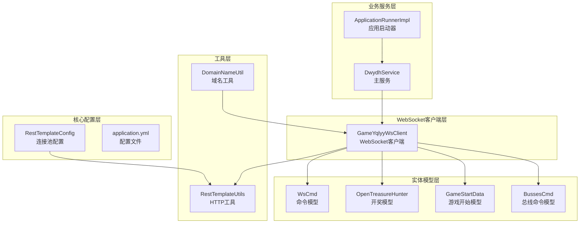
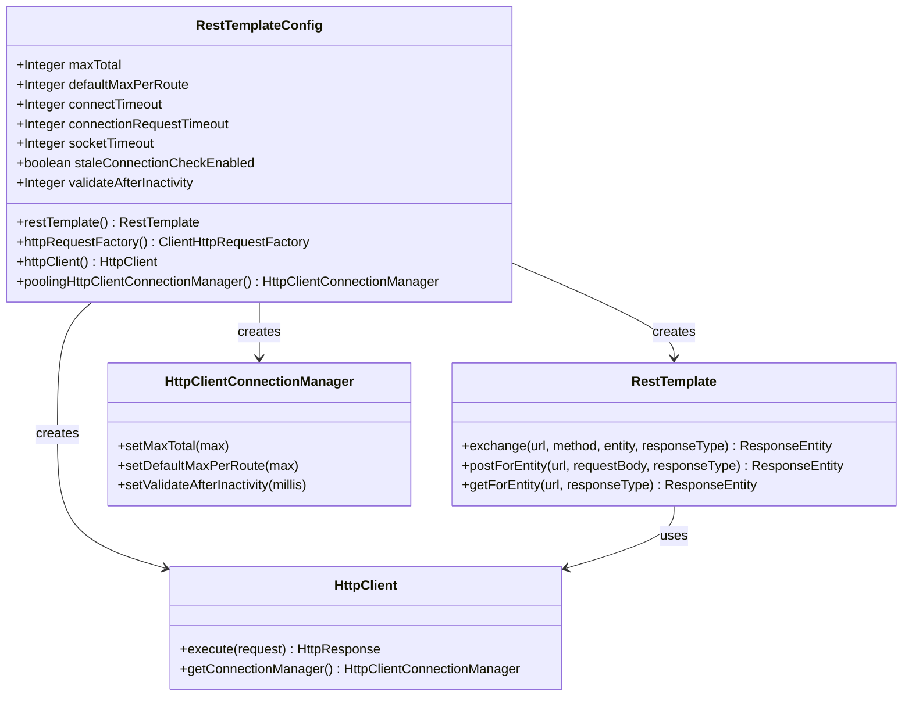
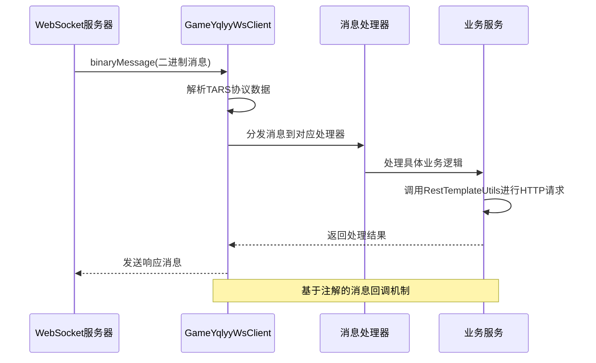
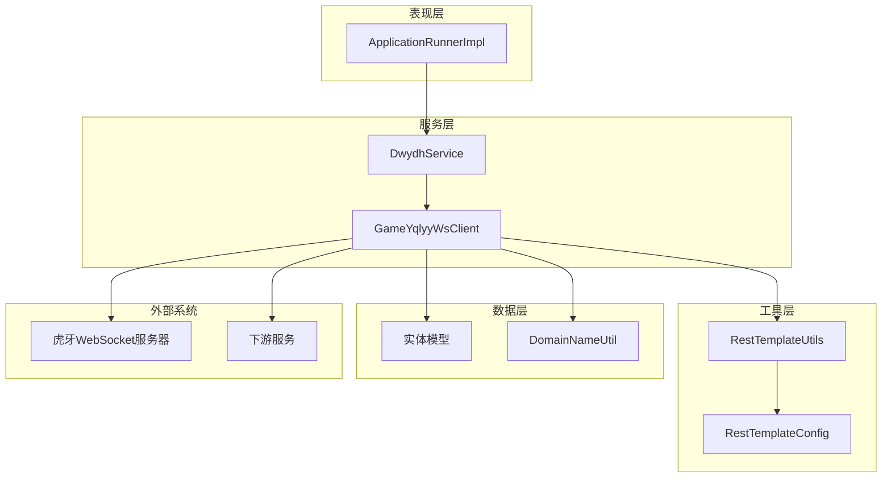
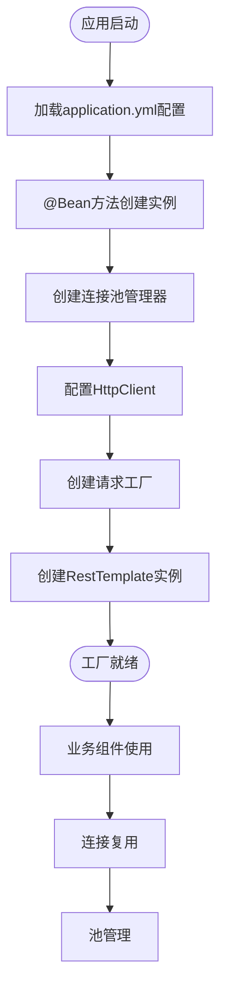
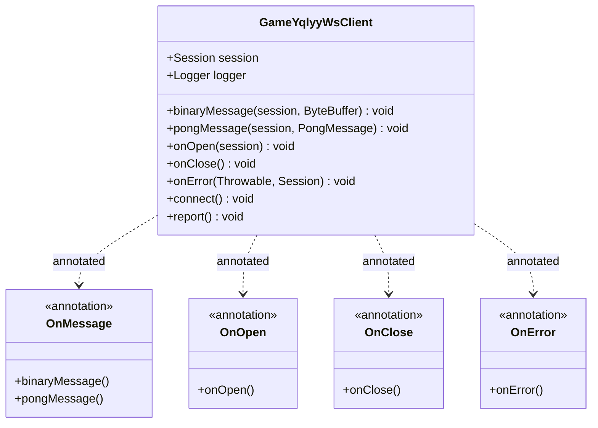
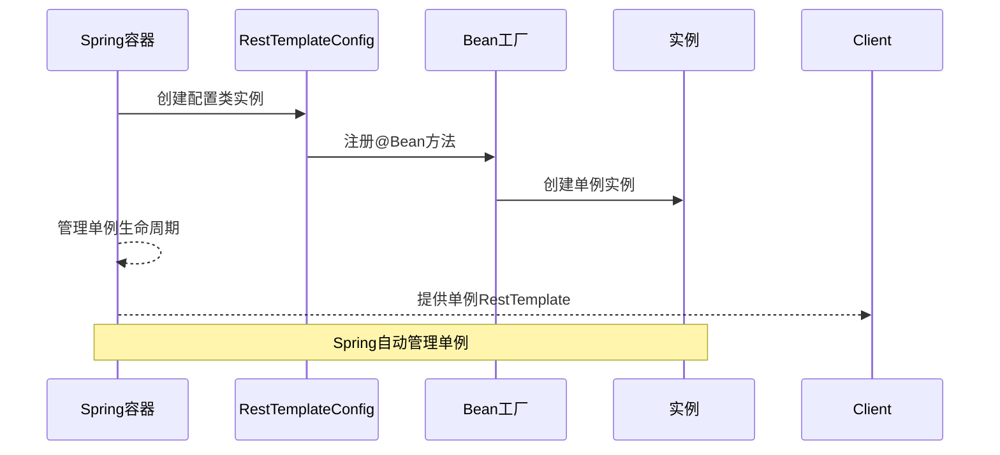
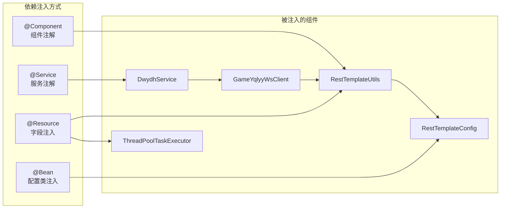
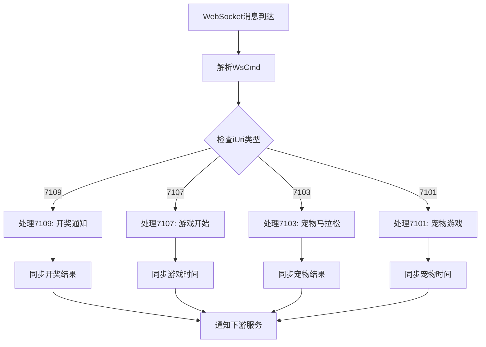
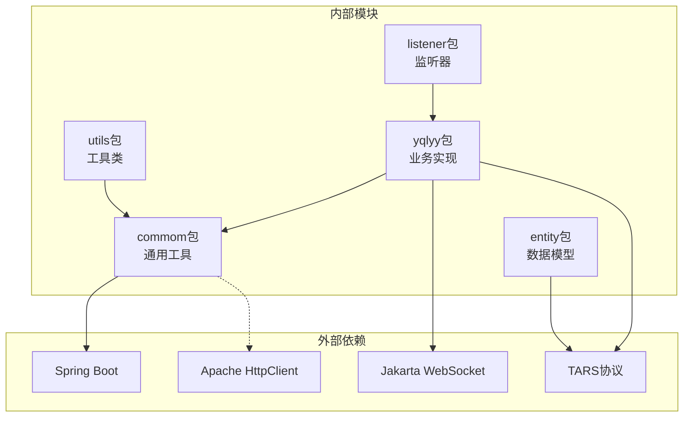

# 设计模式应用

<cite>
**本文档引用的文件**
- [RestTemplateConfig.java](file://src/main/java/com/commom/RestTemplateConfig.java)
- [RestTemplateUtils.java](file://src/main/java/com/commom/RestTemplateUtils.java)
- [GameYqlyyWsClient.java](file://src/main/java/com/yqlyy/GameYqlyyWsClient.java)
- [DwydhService.java](file://src/main/java/com/dwydh/DwydhService.java)
- [ApplicationRunnerImpl.java](file://src/main/java/com/listener/ApplicationRunnerImpl.java)
- [WsCmd.java](file://src/main/java/com/entity/WsCmd.java)
- [OpenTreasureHunter.java](file://src/main/java/com/entity/AccountedNotify/OpenTreasureHunter.java)
- [GameStartData.java](file://src/main/java/com/entity/GameStartData.java)
- [BussesCmd.java](file://src/main/java/com/entity/BussesCmd.java)
- [DomainNameUtil.java](file://src/main/java/com/utils/DomainNameUtil.java)
- [application.yml](file://src/main/resources/application.yml)
- [pom.xml](file://pom.xml)
</cite>

## 目录
1. [引言](#引言)
2. [项目结构](#项目结构)
3. [核心组件](#核心组件)
4. [架构概览](#架构概览)
5. [设计模式详细分析](#设计模式详细分析)
6. [依赖关系分析](#依赖关系分析)
7. [性能考虑](#性能考虑)
8. [故障排除指南](#故障排除指南)
9. [结论](#结论)

## 引言

本项目是一个基于Spring Boot的虎牙游戏数据采集系统，主要功能是从WebSocket实时获取游戏数据并同步到下游服务。通过对代码库的深入分析，我发现该项目在实际开发中自然地应用了多种设计模式，包括工厂模式、观察者模式、单例模式、依赖注入模式和策略模式等。本文将详细分析这些设计模式的应用场景、实现方式以及技术考量。

## 项目结构

项目采用标准的Spring Boot目录结构，按照功能模块进行组织：

**图表来源**
- [RestTemplateConfig.java](file://src/main/java/com/commom/RestTemplateConfig.java#L33-L131)
- [DwydhService.java](file://src/main/java/com/dwydh/DwydhService.java#L12-L38)
- [GameYqlyyWsClient.java](file://src/main/java/com/yqlyy/GameYqlyyWsClient.java#L29-L327)

**章节来源**
- [pom.xml](file://pom.xml#L1-L160)
- [application.yml](file://src/main/resources/application.yml#L1-L31)

## 核心组件

### RestTemplateConfig - 工厂模式的核心实现

RestTemplateConfig是整个系统中最典型的工厂模式实现，负责创建和配置HTTP客户端实例。

**图表来源**
- [RestTemplateConfig.java](file://src/main/java/com/commom/RestTemplateConfig.java#L34-L129)

### GameYqlyyWsClient - 观察者模式的WebSocket实现

GameYqlyyWsClient实现了Jakarta WebSocket的客户端接口，天然具备观察者模式的特征：

**图表来源**
- [GameYqlyyWsClient.java](file://src/main/java/com/yqlyy/GameYqlyyWsClient.java#L46-L219)

**章节来源**
- [RestTemplateConfig.java](file://src/main/java/com/commom/RestTemplateConfig.java#L34-L129)
- [GameYqlyyWsClient.java](file://src/main/java/com/yqlyy/GameYqlyyWsClient.java#L29-L327)

## 架构概览

系统采用分层架构设计，结合多种设计模式实现松耦合和高内聚：

**图表来源**
- [ApplicationRunnerImpl.java](file://src/main/java/com/listener/ApplicationRunnerImpl.java#L21-L33)
- [DwydhService.java](file://src/main/java/com/dwydh/DwydhService.java#L12-L38)
- [GameYqlyyWsClient.java](file://src/main/java/com/yqlyy/GameYqlyyWsClient.java#L29-L327)

## 设计模式详细分析

### 工厂模式 - RestTemplateConfig中的连接池配置

#### 实现机制

RestTemplateConfig通过Spring的@Configuration注解和@Bean方法实现了标准的工厂模式：

1. **配置驱动的工厂创建**：通过application.yml中的配置参数驱动连接池的创建
2. **多级工厂层次**：从HttpClient到ClientHttpRequestFactory再到RestTemplate的逐级创建
3. **连接池管理**：使用PoolingHttpClientConnectionManager实现连接复用

#### 关键实现细节

**图表来源**
- [RestTemplateConfig.java](file://src/main/java/com/commom/RestTemplateConfig.java#L62-L129)
- [application.yml](file://src/main/resources/application.yml#L16-L30)

#### 技术考量

- **性能优化**：通过连接池避免频繁创建HTTP连接的开销
- **资源控制**：maxTotal和defaultMaxPerRoute限制系统资源占用
- **超时管理**：合理的超时配置确保系统稳定性
- **线程安全**：Apache HttpClient的线程安全特性

**章节来源**
- [RestTemplateConfig.java](file://src/main/java/com/commom/RestTemplateConfig.java#L34-L129)
- [application.yml](file://src/main/resources/application.yml#L16-L30)

### 观察者模式 - WebSocket消息处理

#### 回调机制实现

GameYqlyyWsClient通过Jakarta WebSocket注解实现观察者模式：

**图表来源**
- [GameYqlyyWsClient.java](file://src/main/java/com/yqlyy/GameYqlyyWsClient.java#L29-L248)

#### 事件驱动架构

系统采用事件驱动的方式处理WebSocket消息：

1. **消息到达事件**：binaryMessage回调处理新消息
2. **心跳事件**：pongMessage处理服务器心跳
3. **连接状态事件**：onOpen/onClose/onError处理连接生命周期
4. **异步处理**：通过线程池实现非阻塞的消息处理

**章节来源**
- [GameYqlyyWsClient.java](file://src/main/java/com/yqlyy/GameYqlyyWsClient.java#L46-L248)

### 单例模式 - 连接管理和线程池配置

#### Spring容器中的单例管理

虽然代码中没有显式的单例实现，但Spring容器天然提供了单例管理：

**图表来源**
- [RestTemplateConfig.java](file://src/main/java/com/commom/RestTemplateConfig.java#L34-L65)

#### 线程池配置

DwydhService使用ThreadPoolTaskExecutor实现任务调度：

- **线程池管理**：通过Spring配置管理线程生命周期
- **任务隔离**：每个WebSocket客户端任务独立运行
- **资源控制**：避免线程泄漏和资源耗尽

**章节来源**
- [DwydhService.java](file://src/main/java/com/dwydh/DwydhService.java#L16-L36)

### 依赖注入模式 - Spring容器中的组件装配

#### 组件装配机制

系统通过多种方式实现依赖注入：

**图表来源**
- [RestTemplateUtils.java](file://src/main/java/com/commom/RestTemplateUtils.java#L13-L17)
- [DwydhService.java](file://src/main/java/com/dwydh/DwydhService.java#L16-L19)

#### 注入策略分析

- **构造函数注入**：GameYqlyyWsClient使用构造函数注入RestTemplateUtils
- **字段注入**：@Resource注解用于自动装配
- **配置类注入**：@Bean方法创建和管理复杂对象

**章节来源**
- [RestTemplateUtils.java](file://src/main/java/com/commom/RestTemplateUtils.java#L13-L30)
- [GameYqlyyWsClient.java](file://src/main/java/com/yqlyy/GameYqlyyWsClient.java#L40-L44)

### 策略模式 - 不同游戏数据处理

#### 多游戏支持策略

系统通过条件判断实现不同游戏的数据处理策略：

**图表来源**
- [GameYqlyyWsClient.java](file://src/main/java/com/yqlyy/GameYqlyyWsClient.java#L76-L218)

#### 策略实现细节

- **iUri字段**：作为策略选择的关键标识
- **条件分支**：根据不同的iUri值执行不同的处理逻辑
- **统一接口**：所有策略都遵循相同的处理流程

**章节来源**
- [GameYqlyyWsClient.java](file://src/main/java/com/yqlyy/GameYqlyyWsClient.java#L76-L218)

### 实际代码示例和应用场景

#### 工厂模式示例路径

1. **连接池配置创建**：
   - [RestTemplateConfig.poolingHttpClientConnectionManager()](file://src/main/java/com/commom/RestTemplateConfig.java#L116-L129)

2. **HTTP客户端创建**：
   - [RestTemplateConfig.httpClient()](file://src/main/java/com/commom/RestTemplateConfig.java#L84-L108)

3. **RestTemplate实例创建**：
   - [RestTemplateConfig.restTemplate()](file://src/main/java/com/commom/RestTemplateConfig.java#L62-L65)

#### 观察者模式示例路径

1. **消息回调处理**：
   - [GameYqlyyWsClient.binaryMessage()](file://src/main/java/com/yqlyy/GameYqlyyWsClient.java#L51-L219)

2. **连接状态回调**：
   - [GameYqlyyWsClient.onOpen()](file://src/main/java/com/yqlyy/GameYqlyyWsClient.java#L221-L237)
   - [GameYqlyyWsClient.onClose()](file://src/main/java/com/yqlyy/GameYqlyyWsClient.java#L240-L243)

#### 策略模式示例路径

1. **游戏类型判断**：
   - [GameYqlyyWsClient.7109处理](file://src/main/java/com/yqlyy/GameYqlyyWsClient.java#L76-L118)
   - [GameYqlyyWsClient.7107处理](file://src/main/java/com/yqlyy/GameYqlyyWsClient.java#L120-L147)

**章节来源**
- [RestTemplateConfig.java](file://src/main/java/com/commom/RestTemplateConfig.java#L62-L129)
- [GameYqlyyWsClient.java](file://src/main/java/com/yqlyy/GameYqlyyWsClient.java#L46-L248)

## 依赖关系分析

系统依赖关系清晰，体现了良好的分层架构：

**图表来源**
- [pom.xml](file://pom.xml#L26-L111)

**章节来源**
- [pom.xml](file://pom.xml#L1-L160)

## 性能考虑

### 连接池优化

1. **连接复用**：通过PoolingHttpClientConnectionManager实现连接复用
2. **资源限制**：maxTotal和defaultMaxPerRoute控制资源占用
3. **超时配置**：合理的超时设置避免资源泄漏

### 线程池管理

1. **任务隔离**：每个WebSocket客户端独立线程池
2. **资源控制**：避免线程泄漏和系统过载
3. **异步处理**：非阻塞的消息处理提高吞吐量

### 内存管理

1. **ByteBuffer复用**：避免频繁的对象创建
2. **字符串缓存**：Base64编码结果的合理使用
3. **日志级别**：生产环境适当降低日志级别

## 故障排除指南

### WebSocket连接问题

1. **连接失败排查**：
   - 检查wsUrl配置是否正确
   - 验证网络连通性
   - 查看防火墙设置

2. **消息处理异常**：
   - 检查TARS协议解析逻辑
   - 验证实体类字段映射
   - 查看异常日志输出

### HTTP请求问题

1. **连接池耗尽**：
   - 检查maxTotal配置
   - 监控连接使用情况
   - 优化请求频率

2. **超时问题**：
   - 调整socketTimeout配置
   - 检查下游服务响应时间
   - 实现重试机制

**章节来源**
- [GameYqlyyWsClient.java](file://src/main/java/com/yqlyy/GameYqlyyWsClient.java#L245-L248)
- [RestTemplateConfig.java](file://src/main/java/com/commom/RestTemplateConfig.java#L86-L91)

## 结论

通过对TigerTeeth项目的深入分析，我发现该系统在实际开发中自然地应用了多种设计模式：

### 主要设计模式总结

1. **工厂模式**：RestTemplateConfig提供了完整的HTTP客户端工厂实现
2. **观察者模式**：GameYqlyyWsClient通过注解回调实现事件驱动架构
3. **单例模式**：Spring容器天然提供单例管理
4. **依赖注入模式**：通过多种注解实现组件装配
5. **策略模式**：通过iUri字段实现多游戏数据处理策略

### 技术优势

- **松耦合**：各组件职责明确，依赖关系清晰
- **可扩展性**：新增游戏类型只需添加新的策略分支
- **可维护性**：代码结构清晰，易于理解和修改
- **性能优化**：连接池和线程池有效提升系统性能

### 改进建议

1. **抽象策略接口**：为不同游戏类型定义统一的处理接口
2. **配置化策略**：通过配置文件动态配置游戏处理策略
3. **监控指标**：添加性能监控和错误统计
4. **测试覆盖**：增加单元测试和集成测试

该系统展示了如何在实际项目中自然应用设计模式，既保证了系统的稳定性和性能，又保持了良好的可维护性和扩展性。