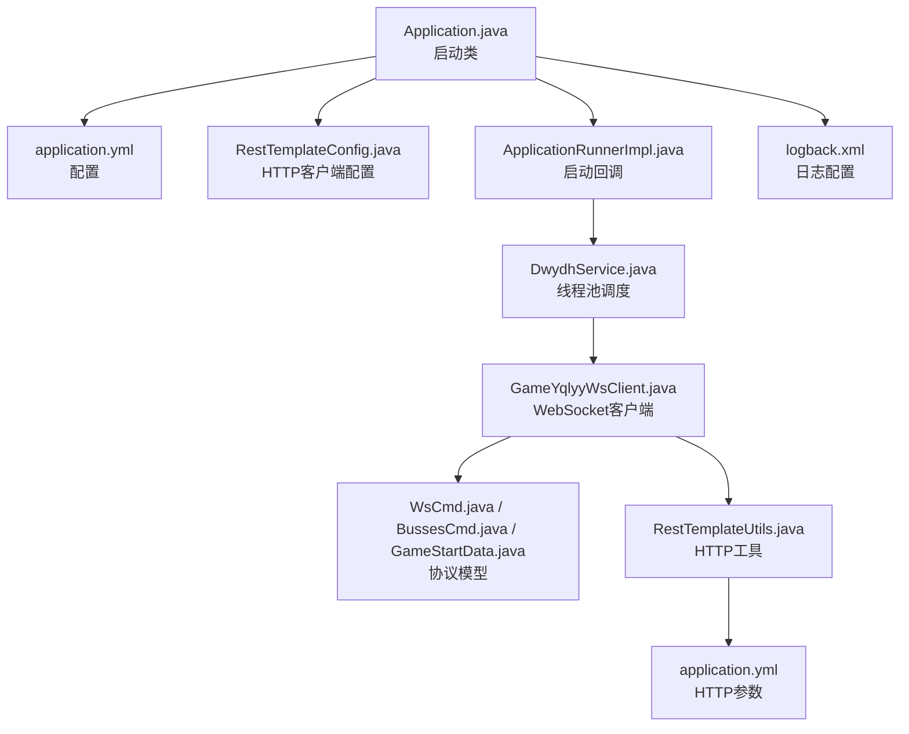
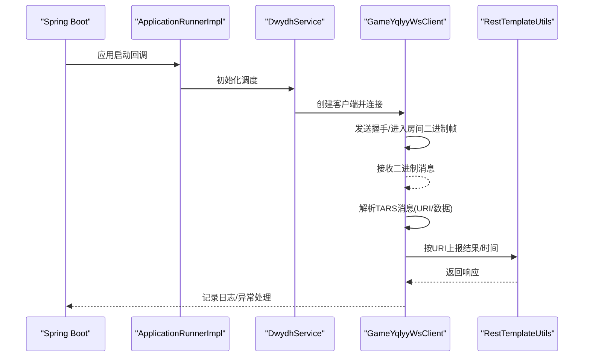
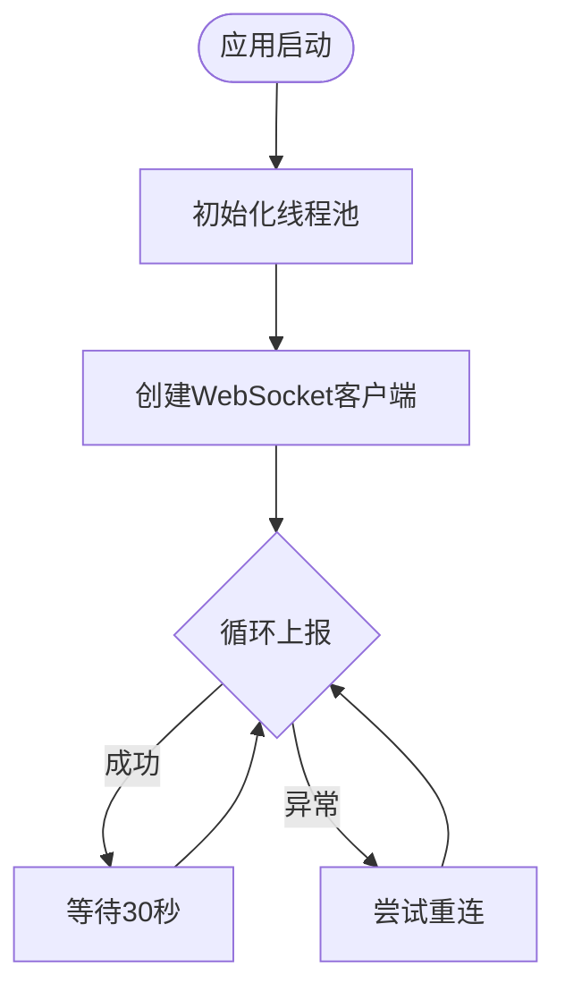
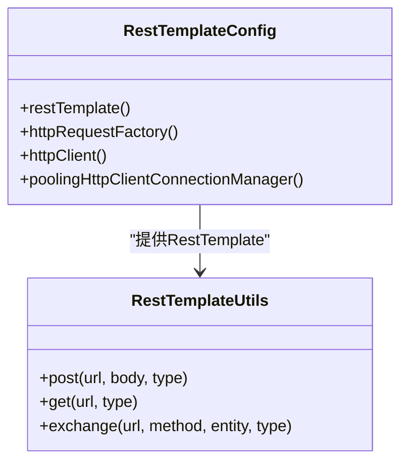
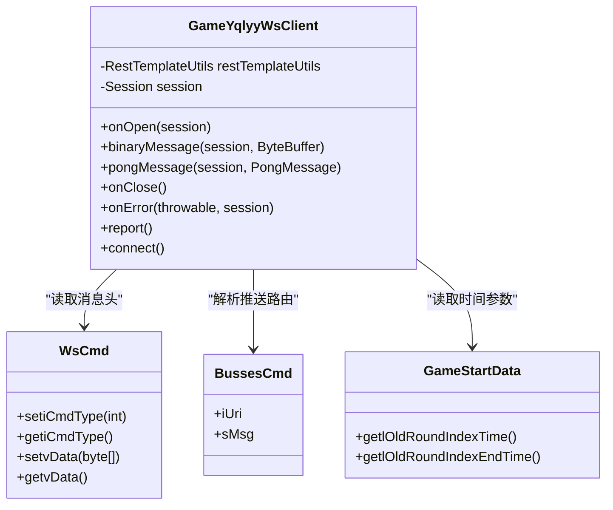
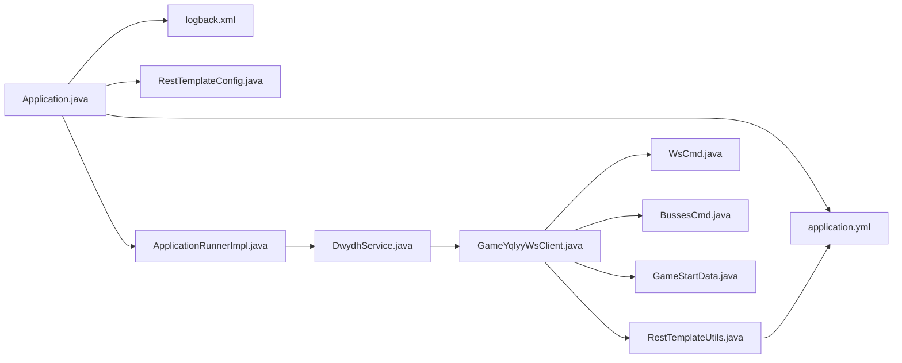

# 开发指南

<cite>
**本文引用的文件**
- [pom.xml](file://pom.xml)
- [Application.java](file://src/main/java/com/Application.java)
- [application.yml](file://src/main/resources/application.yml)
- [logback.xml](file://src/main/resources/logback.xml)
- [DwydhService.java](file://src/main/java/com/dwydh/DwydhService.java)
- [ApplicationRunnerImpl.java](file://src/main/java/com/listener/ApplicationRunnerImpl.java)
- [RestTemplateConfig.java](file://src/main/java/com/commom/RestTemplateConfig.java)
- [RestTemplateUtils.java](file://src/main/java/com/commom/RestTemplateUtils.java)
- [GameYqlyyWsClient.java](file://src/main/java/com/yqlyy/GameYqlyyWsClient.java)
- [DomainNameUtil.java](file://src/main/java/com/utils/DomainNameUtil.java)
- [WsCmd.java](file://src/main/java/com/entity/WsCmd.java)
- [BussesCmd.java](file://src/main/java/com/entity/BussesCmd.java)
- [GameStartData.java](file://src/main/java/com/entity/GameStartData.java)
</cite>

## 目录
1. [简介](#简介)
2. [项目结构](#项目结构)
3. [核心组件](#核心组件)
4. [架构总览](#架构总览)
5. [详细组件分析](#详细组件分析)
6. [依赖关系分析](#依赖关系分析)
7. [性能与内存管理](#性能与内存管理)
8. [测试指南](#测试指南)
9. [扩展开发最佳实践](#扩展开发最佳实践)
10. [调试与开发工具](#调试与开发工具)
11. [代码审查与质量保障](#代码审查与质量保障)
12. [依赖管理与版本控制策略](#依赖管理与版本控制策略)
13. [故障排查指南](#故障排查指南)
14. [结论](#结论)

## 简介
本项目为基于 Spring Boot 的网络爬虫与实时通信客户端，主要面向虎牙直播平台的特定游戏数据采集与上报，包含 WebSocket 接入、二进制协议解析（TARS）、HTTP 同步上报、线程池调度与日志配置等能力。本文档旨在帮助新开发者快速理解项目结构、掌握开发与调试方法，并提供扩展与维护的实践建议。

## 项目结构
项目采用标准 Maven 多模块布局，核心源码位于 src/main/java 下，资源位于 src/main/resources。关键目录与职责如下：
- com：应用入口与业务模块
  - Application.java：Spring Boot 启动类
  - commom：通用基础设施（HTTP 客户端、线程池、工具）
  - dwydh：定时任务与线程池调度
  - listener：应用启动回调
  - yqlyy：WebSocket 客户端与协议处理
  - utils：域名与地址常量
  - entity：协议与通知模型
- resources：配置与日志
  - application.yml：服务端口、HTTP 连接池参数、环境配置
  - logback.xml：日志输出策略

图表来源
- [Application.java](file://src/main/java/com/Application.java#L1-L14)
- [application.yml](file://src/main/resources/application.yml#L1-L31)
- [RestTemplateConfig.java](file://src/main/java/com/commom/RestTemplateConfig.java#L1-L132)
- [ApplicationRunnerImpl.java](file://src/main/java/com/listener/ApplicationRunnerImpl.java#L1-L34)
- [DwydhService.java](file://src/main/java/com/dwydh/DwydhService.java#L1-L39)
- [GameYqlyyWsClient.java](file://src/main/java/com/yqlyy/GameYqlyyWsClient.java#L1-L328)
- [WsCmd.java](file://src/main/java/com/entity/WsCmd.java#L1-L69)
- [BussesCmd.java](file://src/main/java/com/entity/BussesCmd.java#L1-L10)
- [GameStartData.java](file://src/main/java/com/entity/GameStartData.java#L1-L79)
- [RestTemplateUtils.java](file://src/main/java/com/commom/RestTemplateUtils.java#L1-L31)
- [logback.xml](file://src/main/resources/logback.xml#L1-L75)

章节来源
- [pom.xml](file://pom.xml#L1-L160)
- [Application.java](file://src/main/java/com/Application.java#L1-L14)
- [application.yml](file://src/main/resources/application.yml#L1-L31)
- [logback.xml](file://src/main/resources/logback.xml#L1-L75)

## 核心组件
- 启动类与配置
  - Application：Spring Boot 启动入口
  - application.yml：端口、上下文路径、HTTP 连接池参数、环境变量占位符
  - logback.xml：控制台与滚动文件输出、按级别过滤
- 线程池与调度
  - RestTemplateConfig：基于 Apache HttpClient 的连接池与超时配置
  - DwydhService：使用线程池执行 WebSocket 客户端初始化与周期性上报
  - ApplicationRunnerImpl：应用启动后触发调度
- WebSocket 客户端
  - GameYqlyyWsClient：连接虎牙 WebSocket，解析二进制消息（TARS），分发不同 URI 的业务事件
- 协议与数据模型
  - WsCmd、BussesCmd、GameStartData：承载消息头、推送路由与游戏时间等数据
- HTTP 工具
  - RestTemplateUtils：封装 GET/POST/exchange，统一对外调用

章节来源
- [Application.java](file://src/main/java/com/Application.java#L1-L14)
- [application.yml](file://src/main/resources/application.yml#L1-L31)
- [logback.xml](file://src/main/resources/logback.xml#L1-L75)
- [RestTemplateConfig.java](file://src/main/java/com/commom/RestTemplateConfig.java#L1-L132)
- [DwydhService.java](file://src/main/java/com/dwydh/DwydhService.java#L1-L39)
- [ApplicationRunnerImpl.java](file://src/main/java/com/listener/ApplicationRunnerImpl.java#L1-L34)
- [GameYqlyyWsClient.java](file://src/main/java/com/yqlyy/GameYqlyyWsClient.java#L1-L328)
- [WsCmd.java](file://src/main/java/com/entity/WsCmd.java#L1-L69)
- [BussesCmd.java](file://src/main/java/com/entity/BussesCmd.java#L1-L10)
- [GameStartData.java](file://src/main/java/com/entity/GameStartData.java#L1-L79)
- [RestTemplateUtils.java](file://src/main/java/com/commom/RestTemplateUtils.java#L1-L31)

## 架构总览
系统以“启动回调 → 线程池调度 → WebSocket 客户端 → 协议解析 → HTTP 上报”的主链路为核心，辅以连接池与日志配置，形成稳定的采集与同步通道。

图表来源
- [ApplicationRunnerImpl.java](file://src/main/java/com/listener/ApplicationRunnerImpl.java#L25-L31)
- [DwydhService.java](file://src/main/java/com/dwydh/DwydhService.java#L21-L36)
- [GameYqlyyWsClient.java](file://src/main/java/com/yqlyy/GameYqlyyWsClient.java#L274-L290)
- [RestTemplateUtils.java](file://src/main/java/com/commom/RestTemplateUtils.java#L19-L29)

## 详细组件分析

### 启动与配置
- 启动类 Application：标准 Spring Boot 启动入口
- 配置文件 application.yml：定义服务端口、上下文路径、HTTP 连接池参数（最大连接、并发、超时、空闲校验等）
- 日志配置 logback.xml：控制台输出 + 按日期滚动的 info/error 文件输出，过滤级别可控

章节来源
- [Application.java](file://src/main/java/com/Application.java#L1-L14)
- [application.yml](file://src/main/resources/application.yml#L1-L31)
- [logback.xml](file://src/main/resources/logback.xml#L1-L75)

### 线程池与调度
- DwydhService：通过注入的线程池执行客户端初始化与周期性上报；内部循环每 30 秒上报一次
- ApplicationRunnerImpl：在应用启动后立即触发 DwydhService.init()

图表来源
- [DwydhService.java](file://src/main/java/com/dwydh/DwydhService.java#L21-L36)
- [ApplicationRunnerImpl.java](file://src/main/java/com/listener/ApplicationRunnerImpl.java#L25-L31)

章节来源
- [DwydhService.java](file://src/main/java/com/dwydh/DwydhService.java#L1-L39)
- [ApplicationRunnerImpl.java](file://src/main/java/com/listener/ApplicationRunnerImpl.java#L1-L34)

### HTTP 客户端与连接池
- RestTemplateConfig：基于 Apache HttpClient 的连接池配置，设置最大连接、默认路由并发、超时、空闲校验、Keep-Alive 策略与重试
- RestTemplateUtils：封装 GET/POST/exchange，统一对外调用

图表来源
- [RestTemplateConfig.java](file://src/main/java/com/commom/RestTemplateConfig.java#L62-L129)
- [RestTemplateUtils.java](file://src/main/java/com/commom/RestTemplateUtils.java#L14-L30)

章节来源
- [RestTemplateConfig.java](file://src/main/java/com/commom/RestTemplateConfig.java#L1-L132)
- [RestTemplateUtils.java](file://src/main/java/com/commom/RestTemplateUtils.java#L1-L31)

### WebSocket 客户端与协议解析
- GameYqlyyWsClient：负责连接、握手、心跳、二进制消息解析与业务分发
- 协议模型：WsCmd（消息头）、BussesCmd（推送路由）、GameStartData（游戏时间）
- 数据上报：根据 URI 分发到不同业务接口（如 luckyMonster、setGameTime）

图表来源
- [GameYqlyyWsClient.java](file://src/main/java/com/yqlyy/GameYqlyyWsClient.java#L30-L328)
- [WsCmd.java](file://src/main/java/com/entity/WsCmd.java#L1-L69)
- [BussesCmd.java](file://src/main/java/com/entity/BussesCmd.java#L1-L10)
- [GameStartData.java](file://src/main/java/com/entity/GameStartData.java#L1-L79)

章节来源
- [GameYqlyyWsClient.java](file://src/main/java/com/yqlyy/GameYqlyyWsClient.java#L1-L328)
- [WsCmd.java](file://src/main/java/com/entity/WsCmd.java#L1-L69)
- [BussesCmd.java](file://src/main/java/com/entity/BussesCmd.java#L1-L10)
- [GameStartData.java](file://src/main/java/com/entity/GameStartData.java#L1-L79)

### 地址与域名配置
- DomainNameUtil：集中管理目标地址数组（urls 与 transitUrls），便于扩展与切换

章节来源
- [DomainNameUtil.java](file://src/main/java/com/utils/DomainNameUtil.java#L1-L16)

## 依赖关系分析
- 组件耦合
  - ApplicationRunnerImpl 依赖 DwydhService
  - DwydhService 依赖线程池与 RestTemplateUtils
  - GameYqlyyWsClient 依赖 RestTemplateUtils 与协议模型
- 外部依赖
  - Spring Boot Web、WebSocket、Netty、Hutool、Fastjson2、TARS、Apache HttpClient 等

图表来源
- [Application.java](file://src/main/java/com/Application.java#L1-L14)
- [application.yml](file://src/main/resources/application.yml#L1-L31)
- [logback.xml](file://src/main/resources/logback.xml#L1-L75)
- [RestTemplateConfig.java](file://src/main/java/com/commom/RestTemplateConfig.java#L1-L132)
- [ApplicationRunnerImpl.java](file://src/main/java/com/listener/ApplicationRunnerImpl.java#L1-L34)
- [DwydhService.java](file://src/main/java/com/dwydh/DwydhService.java#L1-L39)
- [GameYqlyyWsClient.java](file://src/main/java/com/yqlyy/GameYqlyyWsClient.java#L1-L328)
- [RestTemplateUtils.java](file://src/main/java/com/commom/RestTemplateUtils.java#L1-L31)
- [WsCmd.java](file://src/main/java/com/entity/WsCmd.java#L1-L69)
- [BussesCmd.java](file://src/main/java/com/entity/BussesCmd.java#L1-L10)
- [GameStartData.java](file://src/main/java/com/entity/GameStartData.java#L1-L79)

章节来源
- [pom.xml](file://pom.xml#L26-L111)

## 性能与内存管理
- 连接池与超时
  - 在 RestTemplateConfig 中设置最大连接、默认路由并发、连接超时、请求超时、套接字超时、空闲校验与 Keep-Alive 策略，避免连接泄漏与阻塞
- WebSocket 缓冲区
  - 设置文本与二进制消息缓冲上限，防止内存暴涨
- 线程池
  - 使用线程池隔离长连接与上报任务，避免主线程阻塞
- 日志
  - 使用滚动文件与级别过滤，降低 IO 压力

章节来源
- [RestTemplateConfig.java](file://src/main/java/com/commom/RestTemplateConfig.java#L84-L129)
- [GameYqlyyWsClient.java](file://src/main/java/com/yqlyy/GameYqlyyWsClient.java#L250-L272)
- [DwydhService.java](file://src/main/java/com/dwydh/DwydhService.java#L21-L36)
- [logback.xml](file://src/main/resources/logback.xml#L16-L58)

## 测试指南
- 单元测试
  - 对协议模型与工具类（如 RestTemplateUtils）进行方法级测试，覆盖构造、序列化/反序列化、边界值与异常分支
- 集成测试
  - 搭建本地中转服务（参考 transitUrls），验证 WebSocket 客户端连接、消息解析与 HTTP 上报链路
- 覆盖率
  - 建议关键路径与异常分支达到较高覆盖率，确保协议解析与上报逻辑稳定

[本节为通用测试建议，不直接分析具体文件]

## 扩展开发最佳实践
- 新增游戏支持
  - 在 GameYqlyyWsClient 中识别新的 URI 或消息类型，新增分支处理并调用对应 HTTP 接口
  - 在 DomainNameUtil 中补充目标地址，确保上报 URL 正确
- 协议扩展
  - 在 entity 下新增对应模型类，遵循现有字段命名与读写约定
  - 在 GameYqlyyWsClient 的 binaryMessage 中添加解析逻辑
- 功能增强
  - 将硬编码的二进制握手帧与 URL 抽象为配置项，便于动态下发
  - 引入重连策略与指数退避，提升稳定性

章节来源
- [GameYqlyyWsClient.java](file://src/main/java/com/yqlyy/GameYqlyyWsClient.java#L150-L218)
- [DomainNameUtil.java](file://src/main/java/com/utils/DomainNameUtil.java#L4-L13)
- [WsCmd.java](file://src/main/java/com/entity/WsCmd.java#L1-L69)
- [BussesCmd.java](file://src/main/java/com/entity/BussesCmd.java#L1-L10)
- [GameStartData.java](file://src/main/java/com/entity/GameStartData.java#L1-L79)

## 调试与开发工具
- IDE 配置
  - 使用支持 Maven 的 IDE（如 IntelliJ IDEA），启用 Lombok 插件与断点调试
  - 配置 application.yml 的 profiles.active 与日志级别，便于定位问题
- 关键调试点
  - WebSocket：onOpen、binaryMessage、onError、onClose
  - HTTP：RestTemplateUtils 的 GET/POST 调用与异常捕获
- 日志
  - 通过 logback.xml 输出到控制台与文件，结合 INFO/ERROR 过滤快速定位

章节来源
- [logback.xml](file://src/main/resources/logback.xml#L1-L75)
- [GameYqlyyWsClient.java](file://src/main/java/com/yqlyy/GameYqlyyWsClient.java#L221-L248)
- [RestTemplateUtils.java](file://src/main/java/com/commom/RestTemplateUtils.java#L19-L29)

## 代码审查与质量保障
- 规范
  - 统一使用 Lombok 注解减少样板代码；保持字段命名与注释清晰
- 审查要点
  - 异常处理：确保所有网络调用均捕获并记录异常
  - 资源管理：WebSocket 会话与线程池需正确关闭与回收
  - 配置外化：将 URL、超时等参数放入 application.yml
- 质量工具
  - 建议引入静态分析与格式化工具（如 SpotBugs、Checkstyle、Spotless），统一风格

[本节为通用质量建议，不直接分析具体文件]

## 依赖管理与版本控制策略
- 版本管理
  - 使用 Maven 管理依赖版本，统一升级 Spring Boot 与常用库版本
- 版本控制
  - 采用 Git，分支策略建议：develop/release/hotfix/master，打标签发布
- 依赖更新
  - 定期评估第三方库的安全与兼容性，优先选择长期支持版本

章节来源
- [pom.xml](file://pom.xml#L11-L23)
- [pom.xml](file://pom.xml#L26-L111)

## 故障排查指南
- WebSocket 连接失败
  - 检查 wsUrl 是否为空、容器默认缓冲与超时设置是否合理
- 消息解析异常
  - 核对 TARS 字段索引与数据长度，确认 URI 分支逻辑
- HTTP 上报失败
  - 查看 RestTemplate 超时与重试策略，核对目标地址与中转服务状态
- 日志定位
  - 通过 logback.xml 的滚动文件与级别过滤，快速定位错误堆栈

章节来源
- [GameYqlyyWsClient.java](file://src/main/java/com/yqlyy/GameYqlyyWsClient.java#L250-L272)
- [RestTemplateConfig.java](file://src/main/java/com/commom/RestTemplateConfig.java#L84-L108)
- [logback.xml](file://src/main/resources/logback.xml#L38-L58)

## 结论
本项目以简洁的模块划分与清晰的数据流实现了虎牙特定游戏的数据采集与上报。通过合理的连接池与日志策略、可扩展的协议模型与域名配置，能够快速适配新游戏与新协议。建议在后续迭代中加强测试覆盖、完善异常恢复与配置外化，持续提升稳定性与可维护性。